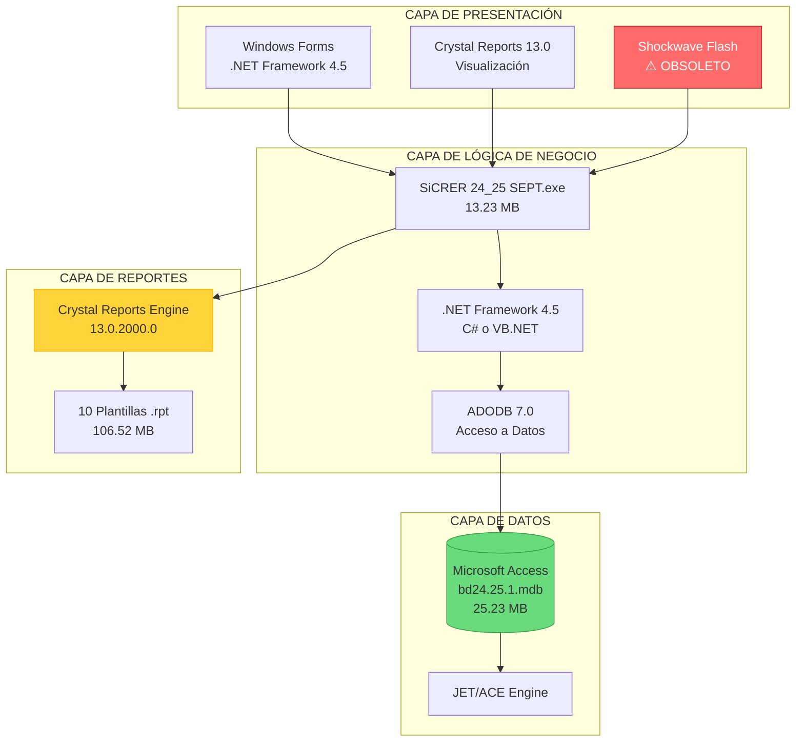
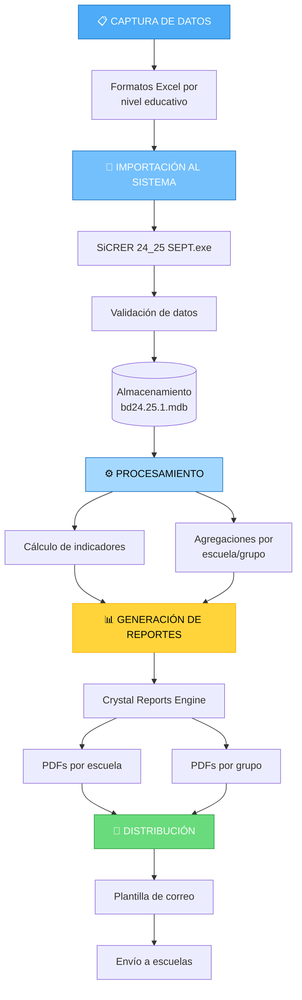
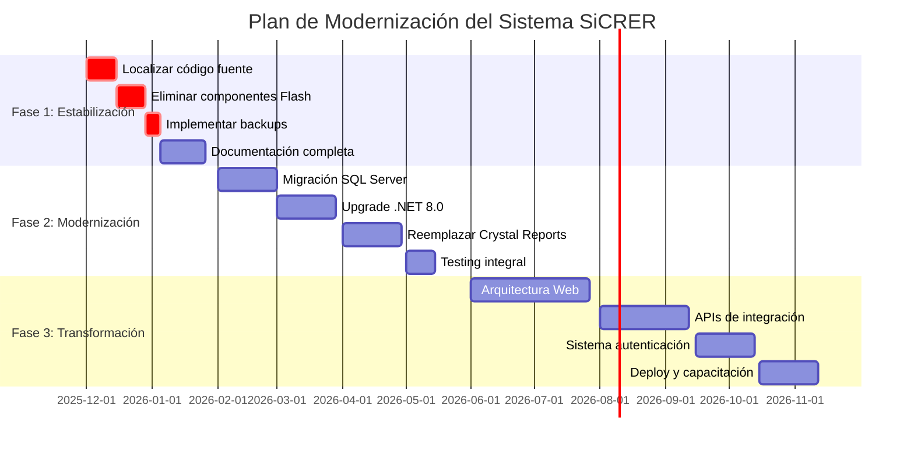

# ANÁLISIS DETALLADO DEL SISTEMA - SEP EVALUACIÓN DIAGNÓSTICA
## Análisis bajo Metodología RUP y Certificación PSP

**Fecha de Análisis:** 21 de Noviembre de 2025  
**Analista:** Ingeniero de Software Certificado PSP  
**Metodología:** Rational Unified Process (RUP)  
**Repositorio:** sep_evaluacion_diagnostica  
**Propietario:** dleonsystem

---

## RESUMEN EJECUTIVO

El repositorio **sep_evaluacion_diagnostica** contiene el Sistema **SiCRER** (Sistema de Captura y Reporteo de Evaluación Diagnóstica) versión 24_25 SEPT, diseñado para la Secretaría de Educación Pública (SEP) de México. Este sistema gestiona la evaluación diagnóstica de estudiantes en los niveles de Preescolar, Primaria, Secundaria Técnica y Telesecundaria.

### Métricas Generales del Proyecto
- **Tamaño Total del Repositorio:** ~255 MB
- **Total de Archivos:** 73 archivos
- **Base de Datos:** Microsoft Access (.mdb) - 25.23 MB
- **Reportes Crystal Reports:** 10 archivos (.rpt) - 106.52 MB
- **Ejecutables Compilados:** 5 archivos (.exe) - 63.07 MB
- **Documentación PDF:** 18 archivos - 30.16 MB
- **Licencia:** MIT License

---

## 1. FASE DE INICIO (RUP)

### 1.1 Visión del Sistema

**Propósito:** Sistema desktop Windows para la captura, procesamiento y generación de reportes de evaluaciones diagnósticas educativas.

**Stakeholders Identificados:**
- Secretaría de Educación Pública (SEP)
- Directores de Escuelas
- Docentes
- Coordinadores de Zona
- Personal Administrativo

**Alcance del Sistema:**
- Captura de valoraciones de estudiantes por nivel educativo
- Procesamiento de datos de evaluación diagnóstica
- Generación de reportes por escuela y grupo
- Distribución de resultados

### 1.2 Análisis de Licenciamiento

```
Licencia: MIT License
Copyright: 2025 dleonsystem
```

**Evaluación PSP:** La licencia MIT es permisiva y permite uso comercial, modificación y distribución. Cumple con estándares de software libre.

---

## 2. FASE DE ELABORACIÓN (RUP)

### 2.1 Arquitectura del Sistema

#### 2.1.1 Arquitectura Tecnológica

**Stack Tecnológico Identificado:**



#### 2.1.2 Componentes del Sistema

**Dependencias Identificadas:**

1. **Microsoft .NET Framework 4.5**
   - Runtime requerido: 4.0.30319
   - Procesador: x86 (32-bit)

2. **Crystal Reports SAP 13.0**
   - CrystalDecisions.CrystalReports.Engine.dll
   - CrystalDecisions.Windows.Forms.dll
   - CrystalDecisions.Shared.dll
   - CrystalDecisions.ReportSource.dll

3. **ActiveX Data Objects (ADO)**
   - adodb.dll (v7.0.3300.0)
   - stdole.dll (v7.0.3300.0)

4. **Microsoft Office Interop**
   - Microsoft.Vbe.Interop.dll (v14.0)

5. **Componentes Legacy**
   - FlashControlV71.dll (⚠️ Obsoleto)
   - ShockwaveFlashObjects.dll (⚠️ Obsoleto)

### 2.2 Patrón de Despliegue

**Estrategia:** ClickOnce Deployment

```xml
<deployment install="true" mapFileExtensions="true" 
            co.v1:createDesktopShortcut="true" />
```

**Características:**
- Instalación automática con acceso a escritorio
- Actualizaciones automáticas
- Versiones identificadas: 1.0.0.12 y 1.0.0.14
- Firma digital: CN=AzureAD\LuisDeLaCabadaTirado
- PublicKeyToken: 4b2b2192a233fd47

**Estructura de Despliegue:**
```
SiCRER.SEPT_24.25/
├── Instalador SiCRER_24_25_SEPT.exe (Instalador principal)
├── ARCHIVOS DE SISTEMA/
│   └── 5.1/INDEXC/OS/WINDOWS/
│       ├── 3.10/ (Versión 1.0.0.14)
│       │   ├── SiCRER 24_25 SEPT.application
│       │   ├── setup.exe
│       │   ├── Application Files/
│       │   └── dotnetfx45/ (Instalador .NET)
│       └── 5.10/ (Versión 1.0.0.12)
│           ├── SiCRER 24_25 SEPT.application
│           ├── setup.exe
│           └── Application Files/
└── RECURSOS/
    ├── bd24.25.1.mdb
    └── REPORTES/
```

### 2.3 Modelo de Datos

**Base de Datos:** bd24.25.1.mdb (Microsoft Access)

**Características:**
- Formato: Microsoft Access Database (.mdb)
- Tamaño: 25.23 MB
- Última Modificación: 21/11/2025 01:02:00 AM
- Motor: Microsoft JET Engine

**Esquema Inferido (basado en reportes):**

```
ENTIDADES PRINCIPALES:
├── ESCUELAS
│   └── Atributos: CCT, Nombre, Nivel, Turno
├── ESTUDIANTES
│   └── Atributos: CURP, Nombre, Grado, Grupo
├── EVALUACIONES
│   └── Atributos: Ciclo, Periodo, Materia
└── RESULTADOS
    └── Atributos: Calificación, Nivel de Logro
```

**Materias Evaluadas (identificadas en reportes):**
- **ens**: Enseñanza General / Español y Matemáticas
- **hyc**: Historia y Civismo
- **len**: Lenguaje y Comunicación
- **spc**: Saberes y Pensamiento Científico

### 2.4 Sistema de Reportes

**Plantillas Crystal Reports (.rpt):**

| Archivo | Tamaño | Propósito |
|---------|--------|-----------|
| res_est_f2.rpt | 27,390 KB | Reporte estudiantes - Formato 2 |
| res_est_f3.rpt | 27,232 KB | Reporte estudiantes - Formato 3 |
| res_est_f5.rpt | 10,844 KB | Reporte estudiantes - Formato 5 |
| res_est_f6.rpt | 10,165 KB | Reporte estudiantes - Formato 6 |
| res_est_f6a.rpt | 10,422 KB | Reporte estudiantes - Formato 6A |
| res_est_f4.rpt | 10,572 KB | Reporte estudiantes - Formato 4 |
| res_esc_ens.rpt | 3,113 KB | Reporte escuela - Enseñanza |
| res_esc_hyc.rpt | 3,113 KB | Reporte escuela - Historia y Civismo |
| res_esc_len.rpt | 3,113 KB | Reporte escuela - Lenguaje |
| res_esc_spc.rpt | 3,113 KB | Reporte escuela - Ciencias |

**Análisis de Formatos:**
- F2, F3: Reportes extensos (probablemente detallados por competencias)
- F4, F5, F6: Reportes intermedios (resúmenes por materia)
- Reportes de Escuela: Consolidados por materia

---

## 3. FASE DE CONSTRUCCIÓN (RUP)

### 3.1 Estructura de Directorios

```
sep_evaluacion_diagnostica/
├── LICENSE (MIT)
├── README.md
├── .gitignore (Configuración Node.js)
├── Flujo_General de la ED.docx (Documentación proceso)
└── MACROS Evaluacion Diagnostica/
    ├── 1 Formatos de valoración/
    │   ├── 2025_EIA_FormatoValoraciones_Preescolar.xlsx
    │   ├── 2025_EIA_FormatoValoraciones_Primaria.xlsx
    │   ├── 2025_EIA_FormatoValoraciones_Secundarias_Tecnicas_Generales.xlsx
    │   └── 2025_EIA_FormatoValoraciones_Secundarias_Telesecundarias.xlsx
    ├── 2 SiCRER/
    │   └── SiCRER.SEPT_24.25/
    │       ├── Instalador SiCRER_24_25_SEPT.exe
    │       ├── ARCHIVOS DE SISTEMA/ (Estructura ClickOnce)
    │       └── RECURSOS/
    │           ├── bd24.25.1.mdb
    │           └── REPORTES/
    ├── 3 Ejemplos de reportes generados/
    │   ├── Escuelas/ (8 PDFs - CCT: 24PPR0356K)
    │   └── Grupo/ (10 PDFs - grupos A, B, C, D, E)
    └── 4 Plantilla de correo para envío de resultados/
        └── Plantilla para envío de resultados.docx
```

### 3.2 Formatos de Entrada (Excel)

**Archivos de Valoración:**

1. **Preescolar** - `2025_EIA_FormatoValoraciones_Preescolar.xlsx`
2. **Primaria** - `2025_EIA_FormatoValoraciones_Primaria.xlsx`
3. **Secundarias Técnicas Generales** - `2025_EIA_FormatoValoraciones_Secundarias_Tecnicas_Generales.xlsx`
4. **Telesecundarias** - `2025_EIA_FormatoValoraciones_Secundarias_Telesecundarias.xlsx`

**Propósito:** Plantillas para captura de valoraciones por nivel educativo.

### 3.3 Flujo de Trabajo del Sistema



---

## 4. ANÁLISIS PSP (Personal Software Process)

### 4.1 Estimación de Tamaño (Size Estimating)

**Componentes del Software:**

| Componente | Estimación | Observaciones |
|------------|-----------|---------------|
| Ejecutable Principal | 13.23 MB | SiCRER 24_25 SEPT.exe |
| Base de Datos | 25.23 MB | Con datos de ejemplo |
| Reportes | 106.52 MB | 10 plantillas Crystal Reports |
| Documentación | 0.52 MB | 2 archivos Word |
| Total Sistema | ~145 MB | Distribución completa |

**LOC Estimado (Lines of Code):**
- Basado en tamaño del ejecutable: ~50,000 - 80,000 LOC
- Framework .NET + Windows Forms
- Lógica de negocio compleja para evaluaciones

### 4.2 Quality Analysis (Análisis de Calidad)

#### 4.2.1 Fortalezas Identificadas ✅

1. **Seguridad:**
   - Firma digital en todos los manifiestos
   - Certificado válido: CN=AzureAD\LuisDeLaCabadaTirado
   - PublicKeyToken para verificación de integridad

2. **Mantenibilidad:**
   - Estructura modular por nivel educativo
   - Separación clara de recursos (BD, reportes, documentación)
   - Versionamiento claro (1.0.0.12 y 1.0.0.14)

3. **Usabilidad:**
   - Instalación automatizada (ClickOnce)
   - Acceso directo en escritorio
   - Reportes en PDF (formato universal)

4. **Documentación:**
   - Plantillas de formatos incluidas
   - Ejemplos de reportes generados
   - Plantilla de comunicación

#### 4.2.2 Defectos y Riesgos Identificados ⚠️

**CRÍTICOS:**

1. **Tecnologías Obsoletas:**
   ```
   - ShockwaveFlashObjects.dll (Adobe Flash EOL: 31/12/2020)
   - FlashControlV71.dll (Componente descontinuado)
   - Riesgo: Vulnerabilidades de seguridad sin parches
   - Impacto: Alto
   - Probabilidad: Alta
   ```

2. **Arquitectura Legacy:**
   ```
   - .NET Framework 4.5 (EOL: 26/04/2022)
   - Windows Forms (tecnología antigua)
   - Procesador x86 (32-bit only)
   - Riesgo: Incompatibilidad con sistemas modernos
   - Impacto: Medio
   - Probabilidad: Media
   ```

3. **Base de Datos Monolítica:**
   ```
   - Microsoft Access .mdb (límite 2GB)
   - Sin soporte de concurrencia robusto
   - Riesgo: Corrupción de datos, escalabilidad limitada
   - Impacto: Alto
   - Probabilidad: Media (si crece el volumen)
   ```

**ALTOS:**

4. **Sin Control de Versiones del Código Fuente:**
   ```
   - Solo binarios compilados en el repositorio
   - Código fuente no disponible
   - Riesgo: Imposibilidad de mantenimiento y evolución
   - Impacto: Crítico
   - Probabilidad: Alta
   ```

5. **Dependencia de Crystal Reports:**
   ```
   - Licencia comercial requerida (SAP)
   - Version 13.0 (antigua)
   - Riesgo: Costos de licenciamiento, compatibilidad
   - Impacto: Medio
   - Probabilidad: Media
   ```

**MEDIOS:**

6. **Documentación Incompleta:**
   ```
   - README.md mínimo (solo título)
   - Documentos Word no versionables
   - Riesgo: Curva de aprendizaje alta
   - Impacto: Bajo
   - Probabilidad: Alta
   ```

7. **Sin Pruebas Automatizadas:**
   ```
   - No hay evidencia de unit tests
   - Sin framework de testing
   - Riesgo: Regresiones en actualizaciones
   - Impacto: Medio
   - Probabilidad: Alta
   ```

### 4.3 Análisis de Configuración

**Archivo de Configuración (.exe.config):**

```xml
<?xml version="1.0" encoding="utf-8" ?>
<configuration>
    <startup> 
        <supportedRuntime version="v4.0" sku=".NETFramework,Version=v4.5" />
    </startup>
</configuration>
```

**Observaciones:**
- Configuración mínima
- Sin cadenas de conexión externalizadas
- Sin parámetros de configuración visibles
- Probable uso de configuración hard-coded (anti-patrón)

### 4.4 Métricas de Complejidad

**Complejidad del Dominio:**
- **Alta**: Múltiples niveles educativos
- **Alta**: 4 materias diferentes con criterios distintos
- **Media**: Generación de 10+ tipos de reportes
- **Media**: Procesamiento de datos educativos sensibles

**Complejidad Técnica:**
- **Alta**: Integración Crystal Reports
- **Media**: Acceso a datos ADO/Access
- **Media**: ClickOnce deployment
- **Baja**: Interfaz Windows Forms

---

## 5. FASE DE TRANSICIÓN (RUP)

### 5.1 Estrategia de Despliegue Actual

**Modelo:** Instalación Desktop Local

```
Usuario Final
     │
     ▼
Instalador SiCRER_24_25_SEPT.exe
     │
     ├─> Verifica .NET Framework 4.5
     ├─> Instala ejecutable principal
     ├─> Copia base de datos local
     ├─> Configura reportes Crystal
     └─> Crea acceso directo
```

**Ventajas:**
- Sin dependencia de conectividad
- Control total del usuario
- Datos locales seguros

**Desventajas:**
- Actualizaciones manuales
- Sin backup automático
- Consolidación compleja

### 5.2 Ejemplos de Salida

**Centro Educativo Analizado:** CCT 24PPR0356K (Estado: San Luis Potosí)

**Reportes Generados:**

**A. Nivel Escuela (8 reportes):**
```
24PPR0356K.1.Reporte_Esc_ensF5.5°.pdf  # Enseñanza 5° grado
24PPR0356K.1.Reporte_Esc_ensF5.6°.pdf  # Enseñanza 6° grado
24PPR0356K.1.Reporte_Esc_hycF5.5°.pdf  # Historia/Civismo 5°
24PPR0356K.1.Reporte_Esc_hycF5.6°.pdf  # Historia/Civismo 6°
24PPR0356K.1.Reporte_Esc_lenF5.5°.pdf  # Lenguaje 5°
24PPR0356K.1.Reporte_Esc_lenF5.6°.pdf  # Lenguaje 6°
24PPR0356K.1.Reporte_Esc_spcF5.5°.pdf  # Ciencias 5°
24PPR0356K.1.Reporte_Esc_spcF5.6°.pdf  # Ciencias 6°
```

**B. Nivel Grupo (10 reportes):**
```
24PPR0356K.1.Reporte_Est_F5.5°.A.pdf   # Grupo A, 5° grado
24PPR0356K.1.Reporte_Est_F5.5°.B.pdf   # Grupo B, 5° grado
24PPR0356K.1.Reporte_Est_F5.5°.C.pdf   # Grupo C, 5° grado
24PPR0356K.1.Reporte_Est_F5.5°.D.pdf   # Grupo D, 5° grado
24PPR0356K.1.Reporte_Est_F5.5°.E.pdf   # Grupo E, 5° grado
24PPR0356K.1.Reporte_Est_F5.6°.A.pdf   # Grupo A, 6° grado
24PPR0356K.1.Reporte_Est_F5.6°.B.pdf   # Grupo B, 6° grado
24PPR0356K.1.Reporte_Est_F5.6°.C.pdf   # Grupo C, 6° grado
24PPR0356K.1.Reporte_Est_F5.6°.D.pdf   # Grupo D, 6° grado
24PPR0356K.1.Reporte_Est_F5.6°.E.pdf   # Grupo E, 6° grado
```

**Patrón de Nomenclatura:**
```
[CCT].[Periodo].[TipoReporte]_[Formato].[Grado]°.[Grupo].pdf

CCT: Clave de Centro de Trabajo (SEP)
Periodo: 1 = Primer periodo del ciclo
TipoReporte: Reporte_Esc (Escuela) | Reporte_Est (Estudiante/Grupo)
Formato: ensF5, hycF5, lenF5, spcF5, F5
Grado: 5°, 6° (nivel primaria alta)
Grupo: A, B, C, D, E
```

---

## 6. RECOMENDACIONES ESTRATÉGICAS

### 6.0 Roadmap Visual



### 6.1 Acciones Inmediatas (0-3 meses)

#### 1. **Eliminar Componentes Obsoletos** 🔴 CRÍTICO
```
Acción:
- Remover dependencias de Flash (ShockwaveFlashObjects.dll)
- Identificar uso de FlashControlV71.dll en el código
- Reemplazar con componentes modernos (.NET controls)

Justificación:
- Vulnerabilidades de seguridad sin parches
- Incompatibilidad con sistemas modernos

Esfuerzo Estimado: 40-60 horas
```

#### 2. **Documentar Arquitectura** 🟡 ALTO
```
Acción:
- Expandir README.md con instalación y uso
- Documentar modelo de datos (tablas, relaciones)
- Crear manual técnico del sistema

Justificación:
- Transferencia de conocimiento
- Mantenibilidad a largo plazo

Esfuerzo Estimado: 20-30 horas
```

#### 3. **Establecer Versionamiento de Código Fuente** 🔴 CRÍTICO
```
Acción:
- Localizar código fuente del proyecto
- Subir solución completa (.sln, .csproj, .cs/.vb)
- Establecer .gitignore apropiado para .NET

Justificación:
- Actualmente solo binarios están versionados
- Imposible realizar mantenimiento sin fuentes

Esfuerzo Estimado: 8-12 horas
```

### 6.2 Mejoras a Mediano Plazo (3-6 meses)

#### 4. **Migrar a .NET Moderno** 🟡 ALTO
```
Objetivo: .NET 8.0 LTS (soporte hasta 2026)

Plan de Migración:
1. Evaluar compatibilidad de componentes
2. Migrar Windows Forms → WPF o Avalonia
3. Actualizar dependencias ADO → Entity Framework Core
4. Testing exhaustivo

Beneficios:
- Soporte a largo plazo
- Mejor rendimiento
- Compatibilidad con Windows 11+
- Posibilidad de cross-platform

Esfuerzo Estimado: 200-300 horas
```

#### 5. **Reemplazar Crystal Reports** 🟠 MEDIO
```
Opciones:
A) FastReport.NET (licencia comercial)
B) Telerik Reporting (licencia comercial)
C) ReportViewer + RDLC (gratuito Microsoft)
D) Solución custom con iTextSharp/PdfSharp

Recomendación: ReportViewer (RDLC)
- Gratuito
- Integración nativa .NET
- Migración relativamente sencilla

Esfuerzo Estimado: 120-160 horas
```

#### 6. **Migrar Base de Datos** 🟡 ALTO
```
Origen: Microsoft Access (.mdb)
Destino: SQL Server Express (gratuito)

Beneficios:
- Sin límite de 2GB
- Mejor integridad de datos
- Concurrencia robusta
- Backups automáticos
- Escalabilidad

Plan:
1. Exportar esquema y datos
2. Crear base SQL Server
3. Actualizar cadenas de conexión
4. Implementar stored procedures
5. Testing de rendimiento

Esfuerzo Estimado: 80-120 horas
```

### 6.3 Evolución a Largo Plazo (6-12 meses)

#### 7. **Arquitectura Web Moderna** 🔵 ESTRATÉGICO
```
Propuesta: Migración a arquitectura web

Backend:
- ASP.NET Core 8.0 Web API
- Entity Framework Core
- SQL Server / PostgreSQL

Frontend:
- React / Blazor WebAssembly
- Diseño responsive
- PWA (Progressive Web App)

Infraestructura:
- Azure App Service / IIS
- Azure SQL Database
- Azure Blob Storage (reportes)

Beneficios:
- Acceso desde cualquier dispositivo
- Centralización de datos
- Actualizaciones automáticas
- Consolidación en tiempo real
- Reducción de costos de distribución

Esfuerzo Estimado: 600-800 horas
```

#### 8. **Sistema de Autenticación y Autorización** 🔵 ESTRATÉGICO
```
Implementar:
- Azure Active Directory / Identity Server
- Roles: Admin, Director, Docente, Consulta
- Permisos granulares por escuela/zona
- Auditoría de acciones

Justificación:
- Datos educativos sensibles (LGPDP)
- Trazabilidad de cambios
- Cumplimiento normativo

Esfuerzo Estimado: 120-160 horas
```

#### 9. **API de Integración** 🔵 ESTRATÉGICO
```
Crear APIs REST para:
- Importación masiva de datos
- Integración con sistemas SEP existentes
- Exportación de datos abiertos
- Webhooks para notificaciones

Documentación:
- OpenAPI/Swagger
- Ejemplos de uso
- SDKs en múltiples lenguajes

Esfuerzo Estimado: 160-200 horas
```

---

## 7. ANÁLISIS DE RIESGOS

### 7.1 Matriz de Riesgos

| ID | Riesgo | Probabilidad | Impacto | Mitigación |
|----|--------|--------------|---------|------------|
| R1 | Pérdida de código fuente | ALTA | CRÍTICO | Localizar y versionar código inmediatamente |
| R2 | Vulnerabilidad Flash | ALTA | ALTO | Eliminar componentes obsoletos |
| R3 | Corrupción base de datos | MEDIA | ALTO | Implementar backups automáticos |
| R4 | Incompatibilidad Windows 11 | MEDIA | MEDIO | Migrar a .NET moderno |
| R5 | Costos licencias Crystal | BAJA | MEDIO | Evaluar alternativas open-source |
| R6 | Pérdida de conocimiento | MEDIA | ALTO | Documentación exhaustiva |
| R7 | Escalabilidad limitada | BAJA | MEDIO | Planificar migración web |

### 7.2 Plan de Contingencia

**Si se pierde el código fuente:**
1. Usar decompiladores (.NET Reflector, ILSpy, dnSpy)
2. Reconstruir lógica desde binarios
3. Aplicar ingeniería inversa a reportes Crystal
4. Documentar nuevo código generado

**Si la base de datos se corrompe:**
1. Restaurar desde backup más reciente
2. Usar herramientas de recuperación Access
3. Migrar datos rescatados a SQL Server
4. Validar integridad referencial

---

## 8. ESTIMACIÓN DE COSTOS (PSP)

### 8.1 Costo de Mantenimiento Actual

**Supuestos:**
- Tasa horaria desarrollador: $50 USD/hora
- Tasa horaria QA: $40 USD/hora
- Tasa horaria DevOps: $60 USD/hora

| Actividad | Horas/Año | Costo Anual |
|-----------|-----------|-------------|
| Corrección de bugs | 80 | $4,000 |
| Actualizaciones menores | 40 | $2,000 |
| Soporte técnico | 120 | $4,800 |
| Testing manual | 60 | $2,400 |
| **TOTAL ANUAL** | **300** | **$13,200** |

### 8.2 Costo de Modernización Propuesta

**Fase 1 - Estabilización (0-3 meses):**
| Tarea | Horas | Costo |
|-------|-------|-------|
| Remover componentes obsoletos | 50 | $2,500 |
| Documentación técnica | 30 | $1,500 |
| Versionamiento código fuente | 10 | $500 |
| Testing y validación | 40 | $1,600 |
| **Subtotal Fase 1** | **130** | **$6,100** |

**Fase 2 - Modernización (3-6 meses):**
| Tarea | Horas | Costo |
|-------|-------|-------|
| Migración .NET 8.0 | 280 | $14,000 |
| Reemplazo Crystal Reports | 140 | $7,000 |
| Migración SQL Server | 100 | $5,000 |
| Testing integral | 80 | $3,200 |
| **Subtotal Fase 2** | **600** | **$29,200** |

**Fase 3 - Transformación (6-12 meses):**
| Tarea | Horas | Costo |
|-------|-------|-------|
| Desarrollo arquitectura web | 700 | $35,000 |
| Sistema autenticación | 140 | $7,000 |
| API de integración | 180 | $9,000 |
| Testing y QA | 120 | $4,800 |
| DevOps y deployment | 60 | $3,600 |
| **Subtotal Fase 3** | **1,200** | **$59,400** |

**INVERSIÓN TOTAL MODERNIZACIÓN:** $94,700 USD

### 8.3 ROI Estimado

**Ahorros Anuales Post-Modernización:**
- Reducción soporte técnico: $2,400/año
- Eliminación licencias Crystal Reports: $5,000/año
- Reducción bugs (mejor calidad): $2,000/año
- Reducción deployment (web): $1,500/año
- **AHORRO ANUAL TOTAL:** $10,900/año

**Retorno de Inversión:**
```
ROI = $94,700 / $10,900 ≈ 8.7 años
```

**Análisis:** ROI a largo plazo. Justificación principal no es ahorro, sino:
- Sostenibilidad tecnológica
- Cumplimiento normativo
- Escalabilidad futura
- Reducción de riesgos críticos

---

## 9. CONCLUSIONES

### 9.1 Estado Actual del Sistema

**Calificación General: 6.5/10** ⚠️

**Fortalezas:**
1. ✅ Sistema funcional y en producción
2. ✅ Arquitectura modular por nivel educativo
3. ✅ Reportes completos y detallados
4. ✅ Documentación de usuario incluida
5. ✅ Firma digital y seguridad básica

**Debilidades Críticas:**
1. ❌ Tecnologías obsoletas y sin soporte
2. ❌ Código fuente no versionado
3. ❌ Sin pruebas automatizadas
4. ❌ Base de datos con limitaciones de escalabilidad
5. ❌ Dependencias comerciales costosas

### 9.2 Viabilidad del Proyecto

**Viabilidad Técnica:** MEDIA
- Sistema legacy con deuda técnica considerable
- Migración posible pero compleja
- Requiere expertise en .NET y Crystal Reports

**Viabilidad Económica:** MEDIA-ALTA
- Inversión significativa ($94,700 USD)
- ROI a largo plazo (8.7 años)
- Justificado por reducción de riesgos

**Viabilidad Operacional:** ALTA
- Sistema en uso activo
- Stakeholders identificados
- Proceso de negocio documentado

### 9.3 Recomendación Final

**RECOMENDACIÓN: MODERNIZACIÓN GRADUAL CON ENFOQUE DE RIESGO**

**Prioridad 1 (INMEDIATA):**
1. Localizar y versionar código fuente
2. Eliminar componentes Flash
3. Implementar backups automáticos BD
4. Documentar arquitectura actual

**Prioridad 2 (3-6 MESES):**
1. Migrar a .NET 8.0 LTS
2. Reemplazar Crystal Reports por RDLC
3. Migrar a SQL Server Express

**Prioridad 3 (6-12 MESES):**
1. Evaluar migración a arquitectura web
2. Implementar autenticación robusta
3. Desarrollar APIs de integración

**Consideración Especial:**
Dado que este es un sistema educativo gubernamental (SEP), considerar:
- Cumplimiento LGPDP (Ley General de Protección de Datos)
- Normativas SEP para sistemas informáticos
- Interoperabilidad con otros sistemas federales
- Accesibilidad (WCAG 2.1)

---

## 10. APÉNDICES

### 10.1 Glosario de Términos

| Término | Definición |
|---------|------------|
| CCT | Clave de Centro de Trabajo - Identificador único de escuelas SEP |
| SiCRER | Sistema de Captura y Reporteo de Evaluación |
| SEP | Secretaría de Educación Pública (México) |
| EIA | Evaluación Integral del Aprendizaje |
| ClickOnce | Tecnología Microsoft para deployment de aplicaciones |
| LGPDP | Ley General de Protección de Datos Personales |
| PSP | Personal Software Process |
| RUP | Rational Unified Process |
| LOC | Lines of Code |
| ROI | Return on Investment |

### 10.2 Referencias Técnicas

1. **.NET Framework 4.5:**
   - Soporte terminado: 26/04/2022
   - Última versión: 4.5.2 (build 4.0.30319)
   - Documentación: https://docs.microsoft.com/dotnet/framework/

2. **Crystal Reports SAP:**
   - Versión: 13.0.2000.0
   - Documentación: https://help.sap.com/crystal-reports

3. **ClickOnce Deployment:**
   - Documentación: https://docs.microsoft.com/visualstudio/deployment/clickonce-security-and-deployment

4. **Microsoft Access Database:**
   - Formato: JET 4.0 (.mdb)
   - Límite de tamaño: 2 GB
   - Documentación: https://support.microsoft.com/access

### 10.3 Contactos del Proyecto

| Rol | Información |
|-----|------------|
| Propietario Repositorio | dleonsystem |
| Certificado Firma Digital | CN=AzureAD\\LuisDeLaCabadaTirado |
| Organización | SEP (Secretaría de Educación Pública) |
| Licencia | MIT License |
| Repositorio | https://github.com/dleonsystem/sep_evaluacion_diagnostica |

---

## HISTORIAL DE REVISIONES

| Versión | Fecha | Autor | Cambios |
|---------|-------|-------|---------|
| 1.0 | 21/11/2025 | Ingeniero PSP | Análisis inicial completo |

---

**FIN DEL DOCUMENTO**

*Este análisis ha sido realizado bajo los estándares de Personal Software Process (PSP) y Rational Unified Process (RUP), considerando las mejores prácticas de ingeniería de software y arquitectura de sistemas.*
