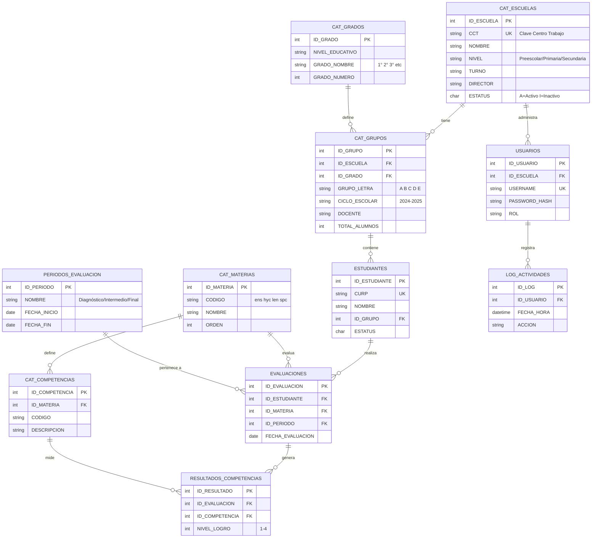
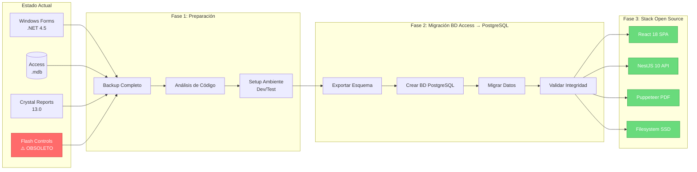

# ANÁLISIS TÉCNICO COMPLEMENTARIO
## Sistema SiCRER - Evaluación Diagnóstica SEP
### Versión 2.0 - Stack Open Source (React + Node.js + PostgreSQL)

**Fecha Actualización:** 25 de Noviembre de 2025  
**Stack Tecnológico:** React 18 + NestJS 10 + PostgreSQL 16 + Filesystem SSD + node-cache + pg-boss  
**Estrategia:** Bifásica (Fase 1 Híbrida + Fase 2 Completa)

---

## 0. ARQUITECTURA OPEN SOURCE - FASE 2 (Septiembre 2026)

### 0.1 Schema PostgreSQL 16 Completo

**Base de Datos:** `sicrer_db` (PostgreSQL 16 con TDE encryption)

```sql
-- ============================================
-- SCHEMA: Sistema SiCRER - Stack Open Source
-- PostgreSQL 16 con TDE Encryption
-- Autor: Ingeniero PSP Certificado
-- Fecha: 25 Nov 2025
-- ============================================

-- Extensiones requeridas
CREATE EXTENSION IF NOT EXISTS "uuid-ossp";
CREATE EXTENSION IF NOT EXISTS "pgcrypto";
CREATE EXTENSION IF NOT EXISTS "pg_trgm"; -- Full-text search

-- ============================================
-- ENUMS
-- ============================================

CREATE TYPE nivel_educativo AS ENUM (
  'PREESCOLAR',
  'PRIMARIA',
  'SECUNDARIA_TECNICA',
  'TELESECUNDARIA'
);

CREATE TYPE estado_ticket AS ENUM (
  'PENDIENTE',
  'EN_PROCESO',
  'RESUELTO',
  'CERRADO'
);

CREATE TYPE nivel_logro AS ENUM (
  'NIVEL_1',
  'NIVEL_2',
  'NIVEL_3',
  'NIVEL_4'
);

CREATE TYPE rol_usuario AS ENUM (
  'DIRECTOR',
  'OPERADOR_SEP',
  'ADMINISTRADOR'
);

CREATE TYPE estado_frv AS ENUM (
  'PENDIENTE_VALIDACION',
  'VALIDADO',
  'RECHAZADO',
  'PROCESADO'
);

-- ============================================
-- TABLA: escuelas
-- ============================================

CREATE TABLE escuelas (
  id UUID PRIMARY KEY DEFAULT uuid_generate_v4(),
  cct VARCHAR(10) UNIQUE NOT NULL, -- Clave Centro Trabajo
  nombre VARCHAR(200) NOT NULL,
  nivel nivel_educativo NOT NULL,
  turno VARCHAR(20) NOT NULL,
  municipio VARCHAR(100) NOT NULL,
  estado VARCHAR(50) NOT NULL,
  director_nombre VARCHAR(150),
  director_email VARCHAR(100),
  director_telefono VARCHAR(15),
  activo BOOLEAN DEFAULT true,
  created_at TIMESTAMP DEFAULT NOW(),
  updated_at TIMESTAMP DEFAULT NOW(),
  
  -- Índices
  CONSTRAINT cct_format_check CHECK (cct ~ '^[0-9]{2}[A-Z]{3}[0-9]{4}[A-Z]$')
);

CREATE INDEX idx_escuelas_cct ON escuelas(cct);
CREATE INDEX idx_escuelas_nivel ON escuelas(nivel);
CREATE INDEX idx_escuelas_municipio ON escuelas USING gin(municipio gin_trgm_ops);

-- ============================================
-- TABLA: usuarios (Directores y Operadores)
-- ============================================

CREATE TABLE usuarios (
  id UUID PRIMARY KEY DEFAULT uuid_generate_v4(),
  escuela_id UUID REFERENCES escuelas(id) ON DELETE CASCADE,
  username VARCHAR(50) UNIQUE NOT NULL,
  email VARCHAR(100) UNIQUE NOT NULL,
  password_hash VARCHAR(255) NOT NULL, -- bcrypt hash
  rol rol_usuario NOT NULL DEFAULT 'DIRECTOR',
  nombre_completo VARCHAR(150) NOT NULL,
  activo BOOLEAN DEFAULT true,
  ultimo_acceso TIMESTAMP,
  intentos_fallidos INT DEFAULT 0,
  bloqueado_hasta TIMESTAMP,
  created_at TIMESTAMP DEFAULT NOW(),
  updated_at TIMESTAMP DEFAULT NOW()
);

CREATE INDEX idx_usuarios_email ON usuarios(email);
CREATE INDEX idx_usuarios_escuela ON usuarios(escuela_id);

-- ============================================
-- TABLA: job_queue (pg-boss jobs)
-- ============================================

CREATE TABLE sesiones (
  id UUID PRIMARY KEY DEFAULT uuid_generate_v4(),
  usuario_id UUID REFERENCES usuarios(id) ON DELETE CASCADE,
  token_hash VARCHAR(255) NOT NULL,
  ip_address INET,
  user_agent TEXT,
  expira_en TIMESTAMP NOT NULL,
  revocado BOOLEAN DEFAULT false,
  created_at TIMESTAMP DEFAULT NOW()
);

CREATE INDEX idx_sesiones_token ON sesiones(token_hash);
CREATE INDEX idx_sesiones_usuario ON sesiones(usuario_id);

-- ============================================
-- TABLA: archivos_frv (Filesystem Storage)
-- ============================================

CREATE TABLE archivos_frv (
  id UUID PRIMARY KEY DEFAULT uuid_generate_v4(),
  escuela_id UUID REFERENCES escuelas(id) ON DELETE CASCADE,
  usuario_id UUID REFERENCES usuarios(id),
  ciclo_escolar VARCHAR(9) NOT NULL, -- '2024-2025'
  nivel nivel_educativo NOT NULL,
  estado estado_frv DEFAULT 'PENDIENTE_VALIDACION',
  
  -- Filesystem metadata
  file_path VARCHAR(500) NOT NULL, -- '/data/sicrer/frv/2024-2025/15ABC0001X/frv_2024-09-15.xlsx'
  filename_original VARCHAR(255) NOT NULL,
  file_size BIGINT NOT NULL,
  mime_type VARCHAR(50) DEFAULT 'application/vnd.openxmlformats-officedocument.spreadsheetml.sheet',
  
  -- Validación
  validacion_resultado JSONB, -- {errores: [], advertencias: []}
  validado_en TIMESTAMP,
  
  -- Procesamiento
  procesado_en TIMESTAMP,
  total_estudiantes INT,
  
  created_at TIMESTAMP DEFAULT NOW(),
  updated_at TIMESTAMP DEFAULT NOW()
);

CREATE INDEX idx_frv_escuela ON archivos_frv(escuela_id);
CREATE INDEX idx_frv_ciclo ON archivos_frv(ciclo_escolar);
CREATE INDEX idx_frv_estado ON archivos_frv(estado);
CREATE INDEX idx_frv_validacion ON archivos_frv USING gin(validacion_resultado);

-- ============================================
-- TABLA: estudiantes
-- ============================================

CREATE TABLE estudiantes (
  id UUID PRIMARY KEY DEFAULT uuid_generate_v4(),
  escuela_id UUID REFERENCES escuelas(id) ON DELETE CASCADE,
  archivo_frv_id UUID REFERENCES archivos_frv(id),
  
  -- Datos personales (LGPDP sensibles)
  curp VARCHAR(18) UNIQUE NOT NULL,
  nombre VARCHAR(100) NOT NULL,
  apellido_paterno VARCHAR(50) NOT NULL,
  apellido_materno VARCHAR(50),
  
  -- Datos académicos
  grado INT NOT NULL CHECK (grado BETWEEN 1 AND 6),
  grupo VARCHAR(2) NOT NULL,
  ciclo_escolar VARCHAR(9) NOT NULL,
  
  created_at TIMESTAMP DEFAULT NOW(),
  updated_at TIMESTAMP DEFAULT NOW(),
  
  CONSTRAINT curp_format_check CHECK (curp ~ '^[A-Z]{4}[0-9]{6}[HM][A-Z]{5}[0-9A-Z][0-9]$')
);

CREATE INDEX idx_estudiantes_curp ON estudiantes(curp);
CREATE INDEX idx_estudiantes_escuela ON estudiantes(escuela_id);
CREATE INDEX idx_estudiantes_ciclo ON estudiantes(ciclo_escolar);

-- ============================================
-- TABLA: valoraciones
-- ============================================

CREATE TABLE valoraciones (
  id UUID PRIMARY KEY DEFAULT uuid_generate_v4(),
  estudiante_id UUID REFERENCES estudiantes(id) ON DELETE CASCADE,
  archivo_frv_id UUID REFERENCES archivos_frv(id),
  
  -- Materias
  materia VARCHAR(50) NOT NULL, -- 'ENS', 'HYC', 'LEN', 'SPC'
  nivel_logro nivel_logro NOT NULL,
  observaciones TEXT,
  
  created_at TIMESTAMP DEFAULT NOW()
);

CREATE INDEX idx_valoraciones_estudiante ON valoraciones(estudiante_id);
CREATE INDEX idx_valoraciones_materia ON valoraciones(materia);

-- ============================================
-- TABLA: tickets_soporte
-- ============================================

CREATE TABLE tickets_soporte (
  id UUID PRIMARY KEY DEFAULT uuid_generate_v4(),
  numero_ticket VARCHAR(20) UNIQUE NOT NULL, -- 'TKT-2025-00001'
  escuela_id UUID REFERENCES escuelas(id),
  usuario_id UUID REFERENCES usuarios(id),
  archivo_frv_id UUID REFERENCES archivos_frv(id),
  
  asunto VARCHAR(200) NOT NULL,
  descripcion TEXT NOT NULL,
  estado estado_ticket DEFAULT 'PENDIENTE',
  prioridad VARCHAR(10) DEFAULT 'MEDIA', -- 'BAJA', 'MEDIA', 'ALTA'
  
  -- Asignación
  asignado_a UUID REFERENCES usuarios(id),
  asignado_en TIMESTAMP,
  
  -- Resolución
  resolucion TEXT,
  resuelto_en TIMESTAMP,
  cerrado_en TIMESTAMP,
  
  created_at TIMESTAMP DEFAULT NOW(),
  updated_at TIMESTAMP DEFAULT NOW()
);

CREATE INDEX idx_tickets_numero ON tickets_soporte(numero_ticket);
CREATE INDEX idx_tickets_escuela ON tickets_soporte(escuela_id);
CREATE INDEX idx_tickets_estado ON tickets_soporte(estado);

-- ============================================
-- TABLA: reportes_generados (PDFs en Filesystem)
-- ============================================

CREATE TABLE reportes_generados (
  id UUID PRIMARY KEY DEFAULT uuid_generate_v4(),
  escuela_id UUID REFERENCES escuelas(id),
  ciclo_escolar VARCHAR(9) NOT NULL,
  tipo_reporte VARCHAR(50) NOT NULL, -- 'ESCUELA_ENS', 'GRUPO_LEN', etc.
  
  -- Filesystem metadata
  file_path VARCHAR(500) NOT NULL, -- '/data/sicrer/pdfs/2024-2025/15ABC0001X/reporte_escuela.pdf'
  filename VARCHAR(255) NOT NULL,
  file_size BIGINT,
  
  -- Metadata
  parametros JSONB, -- {grado: 1, grupo: 'A'}
  generado_por UUID REFERENCES usuarios(id),
  generado_en TIMESTAMP DEFAULT NOW(),
  descargado BOOLEAN DEFAULT false,
  descargado_en TIMESTAMP
);

CREATE INDEX idx_reportes_escuela ON reportes_generados(escuela_id);
CREATE INDEX idx_reportes_tipo ON reportes_generados(tipo_reporte);

-- ============================================
-- TABLA: consentimientos_lgpdp (Fase 2)
-- ============================================

CREATE TABLE consentimientos_lgpdp (
  id UUID PRIMARY KEY DEFAULT uuid_generate_v4(),
  estudiante_id UUID REFERENCES estudiantes(id) ON DELETE CASCADE,
  escuela_id UUID REFERENCES escuelas(id),
  
  tipo_consentimiento VARCHAR(50) NOT NULL, -- 'USO_DATOS', 'EVALUACION_DIAGNOSTICA'
  consentimiento_otorgado BOOLEAN NOT NULL,
  tutor_nombre VARCHAR(150) NOT NULL,
  tutor_firma_digital TEXT, -- Base64 signature
  
  ip_address INET,
  created_at TIMESTAMP DEFAULT NOW()
);

CREATE INDEX idx_consentimientos_estudiante ON consentimientos_lgpdp(estudiante_id);

-- ============================================
-- TABLA: audit_log (Trazabilidad LGPDP)
-- ============================================

CREATE TABLE audit_log (
  id BIGSERIAL PRIMARY KEY,
  tabla VARCHAR(50) NOT NULL,
  registro_id UUID NOT NULL,
  accion VARCHAR(20) NOT NULL, -- 'INSERT', 'UPDATE', 'DELETE', 'SELECT'
  usuario_id UUID REFERENCES usuarios(id),
  datos_anteriores JSONB,
  datos_nuevos JSONB,
  ip_address INET,
  user_agent TEXT,
  created_at TIMESTAMP DEFAULT NOW()
);

CREATE INDEX idx_audit_tabla ON audit_log(tabla);
CREATE INDEX idx_audit_usuario ON audit_log(usuario_id);
CREATE INDEX idx_audit_fecha ON audit_log(created_at);

-- ============================================
-- TRIGGERS
-- ============================================

-- Trigger: Actualizar updated_at automáticamente
CREATE OR REPLACE FUNCTION update_updated_at_column()
RETURNS TRIGGER AS $$
BEGIN
  NEW.updated_at = NOW();
  RETURN NEW;
END;
$$ LANGUAGE plpgsql;

CREATE TRIGGER update_escuelas_updated_at BEFORE UPDATE ON escuelas
  FOR EACH ROW EXECUTE FUNCTION update_updated_at_column();

CREATE TRIGGER update_usuarios_updated_at BEFORE UPDATE ON usuarios
  FOR EACH ROW EXECUTE FUNCTION update_updated_at_column();

CREATE TRIGGER update_archivos_frv_updated_at BEFORE UPDATE ON archivos_frv
  FOR EACH ROW EXECUTE FUNCTION update_updated_at_column();

-- Trigger: Generar número de ticket automático
CREATE OR REPLACE FUNCTION generar_numero_ticket()
RETURNS TRIGGER AS $$
DECLARE
  anio INT := EXTRACT(YEAR FROM NOW());
  siguiente_num INT;
BEGIN
  SELECT COALESCE(MAX(CAST(SUBSTRING(numero_ticket FROM 10) AS INT)), 0) + 1
  INTO siguiente_num
  FROM tickets_soporte
  WHERE numero_ticket LIKE 'TKT-' || anio || '-%';
  
  NEW.numero_ticket := 'TKT-' || anio || '-' || LPAD(siguiente_num::TEXT, 5, '0');
  RETURN NEW;
END;
$$ LANGUAGE plpgsql;

CREATE TRIGGER generar_numero_ticket_trigger BEFORE INSERT ON tickets_soporte
  FOR EACH ROW EXECUTE FUNCTION generar_numero_ticket();

-- ============================================
-- VIEWS MATERIALIZADAS (Performance)
-- ============================================

-- Vista: Estadísticas por escuela
CREATE MATERIALIZED VIEW estadisticas_escuela AS
SELECT 
  e.id AS escuela_id,
  e.cct,
  e.nombre,
  e.nivel,
  COUNT(DISTINCT est.id) AS total_estudiantes,
  COUNT(DISTINCT afr.id) AS total_archivos_frv,
  AVG(CASE WHEN v.nivel_logro = 'NIVEL_4' THEN 4
           WHEN v.nivel_logro = 'NIVEL_3' THEN 3
           WHEN v.nivel_logro = 'NIVEL_2' THEN 2
           ELSE 1 END) AS promedio_nivel_logro,
  MAX(afr.created_at) AS ultima_carga
FROM escuelas e
LEFT JOIN estudiantes est ON e.id = est.escuela_id
LEFT JOIN archivos_frv afr ON e.id = afr.escuela_id
LEFT JOIN valoraciones v ON est.id = v.estudiante_id
GROUP BY e.id, e.cct, e.nombre, e.nivel;

CREATE UNIQUE INDEX idx_estadisticas_escuela_id ON estadisticas_escuela(escuela_id);

-- Refrescar vista cada hora (configurar en cron)
-- REFRESH MATERIALIZED VIEW CONCURRENTLY estadisticas_escuela;

-- ============================================
-- FUNCIONES ALMACENADAS
-- ============================================

-- Función: Obtener estadísticas de valoraciones por materia
CREATE OR REPLACE FUNCTION obtener_estadisticas_materia(
  p_escuela_id UUID,
  p_ciclo VARCHAR(9),
  p_materia VARCHAR(50)
)
RETURNS TABLE (
  nivel_logro nivel_logro,
  cantidad BIGINT,
  porcentaje NUMERIC(5,2)
) AS $$
BEGIN
  RETURN QUERY
  SELECT 
    v.nivel_logro,
    COUNT(*) AS cantidad,
    ROUND((COUNT(*) * 100.0 / SUM(COUNT(*)) OVER ()), 2) AS porcentaje
  FROM valoraciones v
  JOIN estudiantes e ON v.estudiante_id = e.id
  WHERE e.escuela_id = p_escuela_id
    AND e.ciclo_escolar = p_ciclo
    AND v.materia = p_materia
  GROUP BY v.nivel_logro
  ORDER BY v.nivel_logro;
END;
$$ LANGUAGE plpgsql;

-- ============================================
-- DATOS SEMILLA (Testing)
-- ============================================

-- Insertar escuela de prueba
INSERT INTO escuelas (cct, nombre, nivel, turno, municipio, estado)
VALUES 
  ('09DPR0001A', 'Escuela Primaria Benito Juárez', 'PRIMARIA', 'MATUTINO', 'Ciudad de México', 'CDMX'),
  ('09DES0001B', 'Secundaria Técnica 1', 'SECUNDARIA_TECNICA', 'VESPERTINO', 'Guadalajara', 'Jalisco');

-- Insertar usuario director de prueba (password: 'Test1234!')
INSERT INTO usuarios (escuela_id, username, email, password_hash, rol, nombre_completo)
VALUES 
  ((SELECT id FROM escuelas WHERE cct = '09DPR0001A'), 
   'director.juarez', 
   'director@primaria-juarez.edu.mx',
   '$2b$10$rKjQZ8Y7xH.vP8aG2.8Zxe7kW5qJ3mH8N2pL9rT4vS6uY1wX3zA0C', -- bcrypt hash
   'DIRECTOR',
   'Juan Carlos Pérez López');

COMMIT;

-- ============================================
-- PERMISOS
-- ============================================

-- Usuario aplicación (NestJS)
CREATE USER sicrer_app WITH PASSWORD 'CHANGE_ME_IN_PRODUCTION';
GRANT CONNECT ON DATABASE sicrer_db TO sicrer_app;
GRANT USAGE ON SCHEMA public TO sicrer_app;
GRANT SELECT, INSERT, UPDATE, DELETE ON ALL TABLES IN SCHEMA public TO sicrer_app;
GRANT USAGE, SELECT ON ALL SEQUENCES IN SCHEMA public TO sicrer_app;

-- Usuario solo lectura (Analytics)
CREATE USER sicrer_readonly WITH PASSWORD 'READONLY_PASSWORD';
GRANT CONNECT ON DATABASE sicrer_db TO sicrer_readonly;
GRANT USAGE ON SCHEMA public TO sicrer_readonly;
GRANT SELECT ON ALL TABLES IN SCHEMA public TO sicrer_readonly;
```

### 0.2 Prisma Schema Definition

**Archivo:** `backend/prisma/schema.prisma`

```prisma
// ============================================
// Prisma Schema - SiCRER Open Source
// PostgreSQL 16 ORM Type-Safe
// ============================================

generator client {
  provider = "prisma-client-js"
  binaryTargets = ["native", "linux-musl"]
}

datasource db {
  provider = "postgresql"
  url      = env("DATABASE_URL")
}

// ============================================
// ENUMS
// ============================================

enum NivelEducativo {
  PREESCOLAR
  PRIMARIA
  SECUNDARIA_TECNICA
  TELESECUNDARIA
}

enum EstadoTicket {
  PENDIENTE
  EN_PROCESO
  RESUELTO
  CERRADO
}

enum NivelLogro {
  NIVEL_1
  NIVEL_2
  NIVEL_3
  NIVEL_4
}

enum RolUsuario {
  DIRECTOR
  OPERADOR_SEP
  ADMINISTRADOR
}

enum EstadoFRV {
  PENDIENTE_VALIDACION
  VALIDADO
  RECHAZADO
  PROCESADO
}

// ============================================
// MODELOS
// ============================================

model Escuela {
  id              String          @id @default(uuid()) @db.Uuid
  cct             String          @unique @db.VarChar(10)
  nombre          String          @db.VarChar(200)
  nivel           NivelEducativo
  turno           String          @db.VarChar(20)
  municipio       String          @db.VarChar(100)
  estado          String          @db.VarChar(50)
  directorNombre  String?         @map("director_nombre") @db.VarChar(150)
  directorEmail   String?         @map("director_email") @db.VarChar(100)
  directorTelefono String?        @map("director_telefono") @db.VarChar(15)
  activo          Boolean         @default(true)
  createdAt       DateTime        @default(now()) @map("created_at") @db.Timestamp()
  updatedAt       DateTime        @updatedAt @map("updated_at") @db.Timestamp()

  // Relaciones
  usuarios        Usuario[]
  archivosFrv     ArchivoFRV[]
  estudiantes     Estudiante[]
  tickets         TicketSoporte[]
  reportes        ReporteGenerado[]
  consentimientos ConsentimientoLGPDP[]

  @@map("escuelas")
}

model Usuario {
  id                String    @id @default(uuid()) @db.Uuid
  escuelaId         String?   @map("escuela_id") @db.Uuid
  username          String    @unique @db.VarChar(50)
  email             String    @unique @db.VarChar(100)
  passwordHash      String    @map("password_hash") @db.VarChar(255)
  rol               RolUsuario @default(DIRECTOR)
  nombreCompleto    String    @map("nombre_completo") @db.VarChar(150)
  activo            Boolean   @default(true)
  ultimoAcceso      DateTime? @map("ultimo_acceso") @db.Timestamp()
  intentosFallidos  Int       @default(0) @map("intentos_fallidos")
  bloqueadoHasta    DateTime? @map("bloqueado_hasta") @db.Timestamp()
  createdAt         DateTime  @default(now()) @map("created_at") @db.Timestamp()
  updatedAt         DateTime  @updatedAt @map("updated_at") @db.Timestamp()

  // Relaciones
  escuela           Escuela?  @relation(fields: [escuelaId], references: [id], onDelete: Cascade)
  sesiones          Sesion[]
  archivosFrv       ArchivoFRV[]
  ticketsCreados    TicketSoporte[] @relation("CreadorTicket")
  ticketsAsignados  TicketSoporte[] @relation("AsignadoTicket")
  reportes          ReporteGenerado[]
  auditLogs         AuditLog[]

  @@map("usuarios")
}

model ArchivoFRV {
  id                  String      @id @default(uuid()) @db.Uuid
  escuelaId           String      @map("escuela_id") @db.Uuid
  usuarioId           String?     @map("usuario_id") @db.Uuid
  cicloEscolar        String      @map("ciclo_escolar") @db.VarChar(9)
  nivel               NivelEducativo
  estado              EstadoFRV   @default(PENDIENTE_VALIDACION)
  
  filePath            String      @map("file_path") @db.VarChar(500)
  filenameOriginal    String      @map("filename_original") @db.VarChar(255)
  fileSize            BigInt      @map("file_size")
  mimeType            String      @map("mime_type") @db.VarChar(50) @default("application/vnd.openxmlformats-officedocument.spreadsheetml.sheet")
  
  validacionResultado Json?       @map("validacion_resultado")
  validadoEn          DateTime?   @map("validado_en") @db.Timestamp()
  procesadoEn         DateTime?   @map("procesado_en") @db.Timestamp()
  totalEstudiantes    Int?        @map("total_estudiantes")
  
  createdAt           DateTime    @default(now()) @map("created_at") @db.Timestamp()
  updatedAt           DateTime    @updatedAt @map("updated_at") @db.Timestamp()

  // Relaciones
  escuela             Escuela     @relation(fields: [escuelaId], references: [id], onDelete: Cascade)
  usuario             Usuario?    @relation(fields: [usuarioId], references: [id])
  estudiantes         Estudiante[]
  valoraciones        Valoracion[]
  tickets             TicketSoporte[]

  @@map("archivos_frv")
}

model Estudiante {
  id                String      @id @default(uuid()) @db.Uuid
  escuelaId         String      @map("escuela_id") @db.Uuid
  archivoFrvId      String?     @map("archivo_frv_id") @db.Uuid
  
  curp              String      @unique @db.VarChar(18)
  nombre            String      @db.VarChar(100)
  apellidoPaterno   String      @map("apellido_paterno") @db.VarChar(50)
  apellidoMaterno   String?     @map("apellido_materno") @db.VarChar(50)
  
  grado             Int
  grupo             String      @db.VarChar(2)
  cicloEscolar      String      @map("ciclo_escolar") @db.VarChar(9)
  
  createdAt         DateTime    @default(now()) @map("created_at") @db.Timestamp()
  updatedAt         DateTime    @updatedAt @map("updated_at") @db.Timestamp()

  // Relaciones
  escuela           Escuela     @relation(fields: [escuelaId], references: [id], onDelete: Cascade)
  archivoFrv        ArchivoFRV? @relation(fields: [archivoFrvId], references: [id])
  valoraciones      Valoracion[]
  consentimientos   ConsentimientoLGPDP[]

  @@map("estudiantes")
}

model Valoracion {
  id              String      @id @default(uuid()) @db.Uuid
  estudianteId    String      @map("estudiante_id") @db.Uuid
  archivoFrvId    String?     @map("archivo_frv_id") @db.Uuid
  
  materia         String      @db.VarChar(50)
  nivelLogro      NivelLogro  @map("nivel_logro")
  observaciones   String?     @db.Text
  
  createdAt       DateTime    @default(now()) @map("created_at") @db.Timestamp()

  // Relaciones
  estudiante      Estudiante  @relation(fields: [estudianteId], references: [id], onDelete: Cascade)
  archivoFrv      ArchivoFRV? @relation(fields: [archivoFrvId], references: [id])

  @@map("valoraciones")
}

model TicketSoporte {
  id              String        @id @default(uuid()) @db.Uuid
  numeroTicket    String        @unique @map("numero_ticket") @db.VarChar(20)
  escuelaId       String?       @map("escuela_id") @db.Uuid
  usuarioId       String?       @map("usuario_id") @db.Uuid
  archivoFrvId    String?       @map("archivo_frv_id") @db.Uuid
  
  asunto          String        @db.VarChar(200)
  descripcion     String        @db.Text
  estado          EstadoTicket  @default(PENDIENTE)
  prioridad       String        @db.VarChar(10) @default("MEDIA")
  
  asignadoA       String?       @map("asignado_a") @db.Uuid
  asignadoEn      DateTime?     @map("asignado_en") @db.Timestamp()
  
  resolucion      String?       @db.Text
  resueltoEn      DateTime?     @map("resuelto_en") @db.Timestamp()
  cerradoEn       DateTime?     @map("cerrado_en") @db.Timestamp()
  
  createdAt       DateTime      @default(now()) @map("created_at") @db.Timestamp()
  updatedAt       DateTime      @updatedAt @map("updated_at") @db.Timestamp()

  // Relaciones
  escuela         Escuela?      @relation(fields: [escuelaId], references: [id])
  usuario         Usuario?      @relation("CreadorTicket", fields: [usuarioId], references: [id])
  asignado        Usuario?      @relation("AsignadoTicket", fields: [asignadoA], references: [id])
  archivoFrv      ArchivoFRV?   @relation(fields: [archivoFrvId], references: [id])

  @@map("tickets_soporte")
}

model ReporteGenerado {
  id              String    @id @default(uuid()) @db.Uuid
  escuelaId       String?   @map("escuela_id") @db.Uuid
  cicloEscolar    String    @map("ciclo_escolar") @db.VarChar(9)
  tipoReporte     String    @map("tipo_reporte") @db.VarChar(50)
  
  filePath        String    @map("file_path") @db.VarChar(500)
  filename        String    @db.VarChar(255)
  fileSize        BigInt?   @map("file_size")
  
  parametros      Json?
  generadoPor     String?   @map("generado_por") @db.Uuid
  generadoEn      DateTime  @default(now()) @map("generado_en") @db.Timestamp()
  descargado      Boolean   @default(false)
  descargadoEn    DateTime? @map("descargado_en") @db.Timestamp()

  // Relaciones
  escuela         Escuela?  @relation(fields: [escuelaId], references: [id])
  usuario         Usuario?  @relation(fields: [generadoPor], references: [id])

  @@map("reportes_generados")
}

model ConsentimientoLGPDP {
  id                      String    @id @default(uuid()) @db.Uuid
  estudianteId            String    @map("estudiante_id") @db.Uuid
  escuelaId               String?   @map("escuela_id") @db.Uuid
  
  tipoConsentimiento      String    @map("tipo_consentimiento") @db.VarChar(50)
  consentimientoOtorgado  Boolean   @map("consentimiento_otorgado")
  tutorNombre             String    @map("tutor_nombre") @db.VarChar(150)
  tutorFirmaDigital       String?   @map("tutor_firma_digital") @db.Text
  
  ipAddress               String?   @map("ip_address")
  createdAt               DateTime  @default(now()) @map("created_at") @db.Timestamp()

  // Relaciones
  estudiante              Estudiante @relation(fields: [estudianteId], references: [id], onDelete: Cascade)
  escuela                 Escuela?   @relation(fields: [escuelaId], references: [id])

  @@map("consentimientos_lgpdp")
}

model Sesion {
  id          String    @id @default(uuid()) @db.Uuid
  usuarioId   String    @map("usuario_id") @db.Uuid
  tokenHash   String    @map("token_hash") @db.VarChar(255)
  ipAddress   String?   @map("ip_address")
  userAgent   String?   @map("user_agent") @db.Text
  expiraEn    DateTime  @map("expira_en") @db.Timestamp()
  revocado    Boolean   @default(false)
  createdAt   DateTime  @default(now()) @map("created_at") @db.Timestamp()

  // Relaciones
  usuario     Usuario   @relation(fields: [usuarioId], references: [id], onDelete: Cascade)

  @@map("sesiones")
}

model AuditLog {
  id                BigInt    @id @default(autoincrement())
  tabla             String    @db.VarChar(50)
  registroId        String    @map("registro_id") @db.Uuid
  accion            String    @db.VarChar(20)
  usuarioId         String?   @map("usuario_id") @db.Uuid
  datosAnteriores   Json?     @map("datos_anteriores")
  datosNuevos       Json?     @map("datos_nuevos")
  ipAddress         String?   @map("ip_address")
  userAgent         String?   @map("user_agent") @db.Text
  createdAt         DateTime  @default(now()) @map("created_at") @db.Timestamp()

  // Relaciones
  usuario           Usuario?  @relation(fields: [usuarioId], references: [id])

  @@map("audit_log")
}
```

### 0.3 Estructura Proyecto NestJS (Backend)

**Arquitectura:** Modular con Domain-Driven Design (DDD)

```
backend/
├── src/
│   ├── main.ts                     # Bootstrap aplicación
│   ├── app.module.ts               # Módulo raíz
│   │
│   ├── config/                     # Configuración
│   │   ├── database.config.ts      # Prisma + PostgreSQL
│   │   ├── storage.config.ts       # Filesystem Storage Config
│   │   ├── cache.config.ts         # node-cache config
│   │   ├── jwt.config.ts           # JWT tokens
│   │   └── email.config.ts         # Nodemailer SMTP
│   │
│   ├── common/                     # Utilidades compartidas
│   │   ├── decorators/
│   │   │   ├── roles.decorator.ts
│   │   │   ├── public.decorator.ts
│   │   │   └── current-user.decorator.ts
│   │   ├── guards/
│   │   │   ├── jwt-auth.guard.ts
│   │   │   ├── roles.guard.ts
│   │   │   └── throttle.guard.ts
│   │   ├── filters/
│   │   │   ├── http-exception.filter.ts
│   │   │   └── prisma-exception.filter.ts
│   │   ├── interceptors/
│   │   │   ├── logging.interceptor.ts
│   │   │   ├── transform.interceptor.ts
│   │   │   └── timeout.interceptor.ts
│   │   ├── pipes/
│   │   │   ├── validation.pipe.ts
│   │   │   └── parse-uuid.pipe.ts
│   │   └── constants/
│   │       ├── roles.constants.ts
│   │       └── error-messages.constants.ts
│   │
│   ├── modules/
│   │   │
│   │   ├── auth/                   # Módulo Autenticación
│   │   │   ├── auth.module.ts
│   │   │   ├── auth.controller.ts
│   │   │   ├── auth.service.ts
│   │   │   ├── strategies/
│   │   │   │   ├── jwt.strategy.ts
│   │   │   │   └── local.strategy.ts
│   │   │   └── dto/
│   │   │       ├── login.dto.ts
│   │   │       ├── register.dto.ts
│   │   │       └── change-password.dto.ts
│   │   │
│   │   ├── escuelas/               # Módulo Escuelas
│   │   │   ├── escuelas.module.ts
│   │   │   ├── escuelas.controller.ts
│   │   │   ├── escuelas.service.ts
│   │   │   ├── escuelas.repository.ts
│   │   │   └── dto/
│   │   │       ├── create-escuela.dto.ts
│   │   │       ├── update-escuela.dto.ts
│   │   │       └── escuela-response.dto.ts
│   │   │
│   │   ├── usuarios/               # Módulo Usuarios
│   │   │   ├── usuarios.module.ts
│   │   │   ├── usuarios.controller.ts
│   │   │   ├── usuarios.service.ts
│   │   │   ├── usuarios.repository.ts
│   │   │   └── dto/
│   │   │       ├── create-usuario.dto.ts
│   │   │       ├── update-usuario.dto.ts
│   │   │       └── reset-password.dto.ts
│   │   │
│   │   ├── frv/                    # Módulo FRV (Core Negocio)
│   │   │   ├── frv.module.ts
│   │   │   ├── frv.controller.ts
│   │   │   ├── frv.service.ts
│   │   │   ├── frv-validator.service.ts  # ⭐ SheetJS validator
│   │   │   ├── frv-processor.service.ts  # Worker threads
│   │   │   ├── frv.repository.ts
│   │   │   ├── dto/
│   │   │   │   ├── upload-frv.dto.ts
│   │   │   │   ├── validacion-result.dto.ts
│   │   │   │   └── frv-response.dto.ts
│   │   │   └── validators/
│   │   │       ├── preescolar.validator.ts
│   │   │       ├── primaria.validator.ts
│   │   │       ├── secundaria.validator.ts
│   │   │       └── base.validator.ts
│   │   │
│   │   ├── tickets/                # Módulo Tickets Soporte
│   │   │   ├── tickets.module.ts
│   │   │   ├── tickets.controller.ts
│   │   │   ├── tickets.service.ts
│   │   │   ├── tickets.repository.ts
│   │   │   └── dto/
│   │   │       ├── create-ticket.dto.ts
│   │   │       ├── update-ticket.dto.ts
│   │   │       └── ticket-response.dto.ts
│   │   │
│   │   ├── reportes/               # Módulo Generación PDFs
│   │   │   ├── reportes.module.ts
│   │   │   ├── reportes.controller.ts
│   │   │   ├── reportes.service.ts
│   │   │   ├── reportes-generator.service.ts  # ⭐ Puppeteer
│   │   │   ├── reportes.repository.ts
│   │   │   ├── templates/
│   │   │   │   ├── escuela-ens.hbs         # Handlebars
│   │   │   │   ├── escuela-hyc.hbs
│   │   │   │   ├── grupo.hbs
│   │   │   │   └── estudiante.hbs
│   │   │   └── dto/
│   │   │       ├── generar-reporte.dto.ts
│   │   │       └── reporte-response.dto.ts
│   │   │
│   │   ├── storage/                # Módulo Filesystem Storage
│   │   │   ├── storage.module.ts
│   │   │   ├── storage.service.ts
│   │   │   └── dto/
│   │   │       ├── upload-file.dto.ts
│   │   │       └── download-file.dto.ts
│   │   │
│   │   ├── notifications/          # Módulo Notificaciones Email
│   │   │   ├── notifications.module.ts
│   │   │   ├── notifications.service.ts
│   │   │   └── templates/
│   │   │       ├── frv-validado.hbs
│   │   │       ├── frv-rechazado.hbs
│   │   │       ├── reporte-disponible.hbs
│   │   │       └── ticket-creado.hbs
│   │   │
│   │   ├── queue/                  # Módulo Bull Queue
│   │   │   ├── queue.module.ts
│   │   │   ├── processors/
│   │   │   │   ├── frv-processing.processor.ts
│   │   │   │   ├── pdf-generation.processor.ts
│   │   │   │   └── email.processor.ts
│   │   │   └── dto/
│   │   │       └── queue-job.dto.ts
│   │   │
│   │   └── analytics/              # Módulo Analytics (Fase 2)
│   │       ├── analytics.module.ts
│   │       ├── analytics.controller.ts
│   │       ├── analytics.service.ts
│   │       └── dto/
│   │           └── estadisticas.dto.ts
│   │
│   ├── prisma/                     # Prisma Client
│   │   ├── prisma.module.ts
│   │   ├── prisma.service.ts
│   │   └── schema.prisma           # (referencia arriba)
│   │
│   └── workers/                    # Worker Threads
│       ├── frv-processor.worker.ts
│       └── statistics.worker.ts
│
├── test/                           # Tests e2e
│   ├── auth.e2e-spec.ts
│   ├── frv.e2e-spec.ts
│   └── tickets.e2e-spec.ts
│
├── .env.example                    # Variables entorno
├── .gitignore
├── docker-compose.yml              # PostgreSQL + Volúmenes filesystem
├── Dockerfile
├── nest-cli.json
├── package.json
├── tsconfig.json
└── README.md
```

### 0.4 Componentes React (Frontend)

**Arquitectura:** Feature-Based con Atomic Design

```
frontend/
├── src/
│   ├── main.tsx                    # Entry point
│   ├── App.tsx                     # App root
│   │
│   ├── config/
│   │   ├── api.config.ts           # Axios instance
│   │   ├── routes.config.ts        # React Router routes
│   │   └── constants.ts            # App constants
│   │
│   ├── features/                   # Features (módulos)
│   │   │
│   │   ├── auth/                   # Feature: Autenticación
│   │   │   ├── components/
│   │   │   │   ├── LoginForm.tsx
│   │   │   │   ├── LoginForm.module.css
│   │   │   │   └── PasswordReset.tsx
│   │   │   ├── pages/
│   │   │   │   ├── LoginPage.tsx
│   │   │   │   └── ResetPasswordPage.tsx
│   │   │   ├── hooks/
│   │   │   │   ├── useAuth.ts
│   │   │   │   └── useLogin.ts
│   │   │   ├── services/
│   │   │   │   └── auth.service.ts
│   │   │   └── types/
│   │   │       └── auth.types.ts
│   │   │
│   │   ├── frv/                    # Feature: Upload FRV (Core)
│   │   │   ├── components/
│   │   │   │   ├── FRVUploadZone.tsx        # ⭐ React Dropzone
│   │   │   │   ├── FRVUploadZone.module.css
│   │   │   │   ├── FRVValidationResults.tsx  # Errores/warnings
│   │   │   │   ├── FRVProgress.tsx          # Barra progreso
│   │   │   │   └── FRVHistory.tsx           # Historial cargas
│   │   │   ├── pages/
│   │   │   │   ├── UploadPage.tsx
│   │   │   │   └── ValidacionPage.tsx
│   │   │   ├── hooks/
│   │   │   │   ├── useUploadFRV.ts
│   │   │   │   └── useFRVValidation.ts
│   │   │   ├── services/
│   │   │   │   └── frv.service.ts
│   │   │   └── types/
│   │   │       └── frv.types.ts
│   │   │
│   │   ├── tickets/                # Feature: Sistema Tickets
│   │   │   ├── components/
│   │   │   │   ├── TicketForm.tsx
│   │   │   │   ├── TicketList.tsx
│   │   │   │   ├── TicketDetail.tsx
│   │   │   │   └── TicketStatus.tsx
│   │   │   ├── pages/
│   │   │   │   ├── TicketsPage.tsx
│   │   │   │   └── TicketDetailPage.tsx
│   │   │   ├── hooks/
│   │   │   │   ├── useTickets.ts
│   │   │   │   └── useCreateTicket.ts
│   │   │   ├── services/
│   │   │   │   └── tickets.service.ts
│   │   │   └── types/
│   │   │       └── ticket.types.ts
│   │   │
│   │   ├── reportes/               # Feature: Descarga Reportes
│   │   │   ├── components/
│   │   │   │   ├── ReportesList.tsx
│   │   │   │   ├── ReporteDownload.tsx
│   │   │   │   └── ReportesFilter.tsx
│   │   │   ├── pages/
│   │   │   │   └── ReportesPage.tsx
│   │   │   ├── hooks/
│   │   │   │   └── useReportes.ts
│   │   │   ├── services/
│   │   │   │   └── reportes.service.ts
│   │   │   └── types/
│   │   │       └── reporte.types.ts
│   │   │
│   │   └── dashboard/              # Feature: Dashboard Analytics
│   │       ├── components/
│   │       │   ├── DashboardStats.tsx
│   │       │   ├── EstadisticasChart.tsx    # ⭐ Recharts
│   │       │   ├── LogrosDistribucion.tsx
│   │       │   └── ActividadReciente.tsx
│   │       ├── pages/
│   │       │   └── DashboardPage.tsx
│   │       ├── hooks/
│   │       │   └── useDashboard.ts
│   │       ├── services/
│   │       │   └── analytics.service.ts
│   │       └── types/
│   │           └── dashboard.types.ts
│   │
│   ├── components/                 # Componentes compartidos (Atomic)
│   │   ├── atoms/
│   │   │   ├── Button/
│   │   │   │   ├── Button.tsx
│   │   │   │   └── Button.module.css
│   │   │   ├── Input/
│   │   │   │   ├── Input.tsx
│   │   │   │   └── Input.module.css
│   │   │   ├── Badge/
│   │   │   │   ├── Badge.tsx
│   │   │   │   └── Badge.module.css
│   │   │   └── Spinner/
│   │   │       ├── Spinner.tsx
│   │   │       └── Spinner.module.css
│   │   ├── molecules/
│   │   │   ├── Card/
│   │   │   │   ├── Card.tsx
│   │   │   │   └── Card.module.css
│   │   │   ├── Alert/
│   │   │   │   ├── Alert.tsx
│   │   │   │   └── Alert.module.css
│   │   │   └── Modal/
│   │   │       ├── Modal.tsx
│   │   │       └── Modal.module.css
│   │   └── organisms/
│   │       ├── Navbar/
│   │       │   ├── Navbar.tsx
│   │       │   └── Navbar.module.css
│   │       ├── Sidebar/
│   │       │   ├── Sidebar.tsx
│   │       │   └── Sidebar.module.css
│   │       └── Footer/
│   │           ├── Footer.tsx
│   │           └── Footer.module.css
│   │
│   ├── hooks/                      # Custom hooks globales
│   │   ├── useLocalStorage.ts
│   │   ├── useDebounce.ts
│   │   ├── useIntersectionObserver.ts
│   │   └── useMediaQuery.ts
│   │
│   ├── services/                   # API services (Axios)
│   │   ├── api.service.ts          # Base API client
│   │   └── interceptors.ts         # Auth interceptors
│   │
│   ├── store/                      # State management (Zustand)
│   │   ├── authStore.ts
│   │   ├── frvStore.ts
│   │   ├── ticketStore.ts
│   │   └── uiStore.ts
│   │
│   ├── utils/                      # Utilidades
│   │   ├── format.utils.ts
│   │   ├── validation.utils.ts
│   │   └── date.utils.ts
│   │
│   ├── types/                      # TypeScript types globales
│   │   ├── index.ts
│   │   ├── api.types.ts
│   │   └── common.types.ts
│   │
│   ├── styles/                     # Estilos globales
│   │   ├── index.css
│   │   ├── variables.css
│   │   └── reset.css
│   │
│   └── assets/                     # Assets estáticos
│       ├── images/
│       │   └── logo-sep.svg
│       └── fonts/
│
├── public/
│   ├── favicon.ico
│   └── index.html
│
├── .env.example
├── .gitignore
├── Dockerfile
├── index.html
├── package.json
├── tsconfig.json
├── vite.config.ts
└── README.md
```

---

## 1. ANÁLISIS DE DEPENDENCIAS LEGACY (Pre-Migración)

### 1.1 Árbol de Dependencias

```
SiCRER 24_25 SEPT.exe (13.23 MB)
│
├─── .NET Framework 4.5 (Requerido)
│    ├── System.dll
│    ├── System.Windows.Forms.dll
│    ├── System.Data.dll
│    └── System.Drawing.dll
│
├─── Crystal Reports 13.0 (106+ MB)
│    ├── CrystalDecisions.CrystalReports.Engine.dll (372 KB)
│    ├── CrystalDecisions.Windows.Forms.dll (540 KB)
│    ├── CrystalDecisions.Shared.dll (872 KB)
│    ├── CrystalDecisions.ReportSource.dll (86 KB)
│    ├── CrystalDecisions.ReportAppServer.ClientDoc.dll (65 KB)
│    ├── CrystalDecisions.ReportAppServer.CommLayer.dll (49 KB)
│    ├── CrystalDecisions.ReportAppServer.CommonControls.dll (135 KB)
│    ├── CrystalDecisions.ReportAppServer.CommonObjectModel.dll (36 KB)
│    ├── CrystalDecisions.ReportAppServer.Controllers.dll (172 KB)
│    ├── CrystalDecisions.ReportAppServer.CubeDefModel.dll (36 KB)
│    ├── CrystalDecisions.ReportAppServer.DataDefModel.dll (258 KB)
│    ├── CrystalDecisions.ReportAppServer.DataSetConversion.dll (49 KB)
│    ├── CrystalDecisions.ReportAppServer.ObjectFactory.dll (5 KB)
│    ├── CrystalDecisions.ReportAppServer.Prompting.dll (155 KB)
│    ├── CrystalDecisions.ReportAppServer.ReportDefModel.dll (364 KB)
│    └── CrystalDecisions.ReportAppServer.XmlSerialize.dll (16 KB)
│
├─── ADO (ActiveX Data Objects) 7.0
│    ├── adodb.dll (126 KB)
│    └── stdole.dll (prerequisito)
│
├─── Microsoft Office Interop
│    └── Microsoft.Vbe.Interop.dll (63 KB)
│
├─── ⚠️ OBSOLETOS - REMOVER
│    ├── FlashControlV71.dll (28 KB)
│    └── ShockwaveFlashObjects.dll (32 KB)
│
└─── Log4Net 1.2.10.0 (prerequisito)
     └── log4net.dll
```

### 1.2 Análisis de Seguridad de Dependencias

| Componente | Versión | Estado | CVEs Conocidos | Recomendación |
|------------|---------|--------|----------------|---------------|
| .NET Framework 4.5 | 4.0.30319 | ❌ EOL (2022) | Múltiples | Reemplazar con Node.js 20 LTS |
| Crystal Reports 13.0 | 13.0.2000.0 | ⚠️ Antigua | Posibles | Reemplazar con Puppeteer |
| ADODB 7.0 | 7.0.3300.0 | ⚠️ Legacy | N/A | Migrar a Prisma ORM |
| Flash Components | Varios | ❌ EOL (2020) | Críticas | **ELIMINAR** |
| Log4Net | 1.2.10.0 | ⚠️ Antigua | CVE-2018-1285 | Reemplazar con Winston |

---

## 2. ANÁLISIS DE BASE DE DATOS

### 2.1 Esquema Inferido de bd24.25.1.mdb

#### 2.1.0 Archivos FRV de Entrada (Disponibles)

**Formatos de Valoración Excel identificados:**

| Archivo | Tamaño | Nivel Educativo | Complejidad |
|---------|--------|-----------------|-------------|
| `2025_EIA_FormatoValoraciones_Preescolar.xlsx` | 52 KB | Preescolar | ⭐ Baja |
| `2025_EIA_FormatoValoraciones_Primaria.xlsx` | 228 KB | Primaria | ⭐⭐⭐ Alta |
| `2025_EIA_FormatoValoraciones_Secundarias_Tecnicas_Generales.xlsx` | 87 KB | Secundaria Técnicas | ⭐⭐ Media |
| `2025_EIA_FormatoValoraciones_Secundarias_Telesecundarias.xlsx` | 88 KB | Telesecundaria | ⭐⭐ Media |

**Estructura Esperada de FRV Primaria:**
```
FRV_Primaria.xlsx (228 KB - 4.4x más grande que Preescolar)
├── Hoja "Datos Escuela" (CCT, Director, Contacto)
├── Hoja "1° Grado" (Grupo, CURP, Nombre, Valoraciones×4)
├── Hoja "2° Grado"
├── Hoja "3° Grado"
├── Hoja "4° Grado"
├── Hoja "5° Grado"
└── Hoja "6° Grado"
```

**Campos por Estudiante (inferidos):**
- CURP (🔴 Dato sensible LGPDP)
- Nombre completo (🟡 Dato personal)
- Grupo (A-E)
- Valoración ENS (Enseñanza)
- Valoración HYC (Historia y Civismo)
- Valoración LEN (Lenguaje)
- Valoración SPC (Saberes y Pensamiento Científico)
- Observaciones

#### 2.1.1 Diagrama Entidad-Relación (Inferido)



#### 2.1.2 Esquema SQL Completo

```sql
-- ESQUEMA RECONSTRUIDO (basado en nomenclatura de reportes)

-- ====================================
-- CATÁLOGOS PRINCIPALES
-- ====================================

CREATE TABLE CAT_ESCUELAS (
    ID_ESCUELA INT PRIMARY KEY,
    CCT VARCHAR(15) UNIQUE NOT NULL,  -- Clave Centro Trabajo
    NOMBRE VARCHAR(200) NOT NULL,
    NIVEL VARCHAR(50),                -- Preescolar, Primaria, Secundaria, Telesecundaria
    TURNO VARCHAR(20),                -- Matutino, Vespertino, Nocturno
    CALLE VARCHAR(200),
    COLONIA VARCHAR(100),
    MUNICIPIO VARCHAR(100),
    ESTADO VARCHAR(50),
    CP VARCHAR(10),
    TELEFONO VARCHAR(15),
    EMAIL VARCHAR(100),
    DIRECTOR VARCHAR(150),
    FECHA_REGISTRO DATETIME,
    ESTATUS CHAR(1)                   -- A=Activo, I=Inactivo
);

CREATE TABLE CAT_GRADOS (
    ID_GRADO INT PRIMARY KEY,
    NIVEL_EDUCATIVO VARCHAR(50),
    GRADO_NOMBRE VARCHAR(20),         -- 1°, 2°, 3°, 4°, 5°, 6°
    GRADO_NUMERO INT,
    DESCRIPCION VARCHAR(200)
);

CREATE TABLE CAT_GRUPOS (
    ID_GRUPO INT PRIMARY KEY,
    ID_ESCUELA INT,
    ID_GRADO INT,
    GRUPO_LETRA VARCHAR(5),           -- A, B, C, D, E
    CICLO_ESCOLAR VARCHAR(10),        -- 2024-2025
    DOCENTE VARCHAR(150),
    TOTAL_ALUMNOS INT,
    FOREIGN KEY (ID_ESCUELA) REFERENCES CAT_ESCUELAS(ID_ESCUELA),
    FOREIGN KEY (ID_GRADO) REFERENCES CAT_GRADOS(ID_GRADO)
);

CREATE TABLE CAT_MATERIAS (
    ID_MATERIA INT PRIMARY KEY,
    CODIGO VARCHAR(10),               -- ens, hyc, len, spc
    NOMBRE VARCHAR(100),
    DESCRIPCION VARCHAR(500),
    ORDEN INT
);

-- Materias identificadas:
-- ens = Enseñanza General / Español y Matemáticas
-- hyc = Historia y Civismo / Formación Cívica y Ética
-- len = Lenguaje y Comunicación
-- spc = Saberes y Pensamiento Científico / Ciencias Naturales

CREATE TABLE CAT_COMPETENCIAS (
    ID_COMPETENCIA INT PRIMARY KEY,
    ID_MATERIA INT,
    CODIGO VARCHAR(20),
    DESCRIPCION VARCHAR(500),
    NIVEL_ESPERADO INT,              -- 1-4
    FOREIGN KEY (ID_MATERIA) REFERENCES CAT_MATERIAS(ID_MATERIA)
);

-- ====================================
-- ESTUDIANTES Y EVALUACIONES
-- ====================================

CREATE TABLE ESTUDIANTES (
    ID_ESTUDIANTE INT PRIMARY KEY,
    CURP VARCHAR(18) UNIQUE,
    NOMBRE VARCHAR(100) NOT NULL,
    APELLIDO_PATERNO VARCHAR(100),
    APELLIDO_MATERNO VARCHAR(100),
    FECHA_NACIMIENTO DATE,
    SEXO CHAR(1),                    -- M/F
    ID_GRUPO INT,
    NUMERO_LISTA INT,
    ESTATUS CHAR(1),                 -- A=Activo, B=Baja, T=Transferido
    FECHA_REGISTRO DATETIME,
    FOREIGN KEY (ID_GRUPO) REFERENCES CAT_GRUPOS(ID_GRUPO)
);

CREATE TABLE PERIODOS_EVALUACION (
    ID_PERIODO INT PRIMARY KEY,
    CICLO_ESCOLAR VARCHAR(10),
    NUMERO_PERIODO INT,              -- 1, 2, 3
    FECHA_INICIO DATE,
    FECHA_FIN DATE,
    DESCRIPCION VARCHAR(200),
    ESTATUS CHAR(1)                  -- A=Activo, C=Cerrado
);

CREATE TABLE EVALUACIONES (
    ID_EVALUACION INT PRIMARY KEY,
    ID_ESTUDIANTE INT,
    ID_MATERIA INT,
    ID_PERIODO INT,
    FECHA_EVALUACION DATE,
    FOREIGN KEY (ID_ESTUDIANTE) REFERENCES ESTUDIANTES(ID_ESTUDIANTE),
    FOREIGN KEY (ID_MATERIA) REFERENCES CAT_MATERIAS(ID_MATERIA),
    FOREIGN KEY (ID_PERIODO) REFERENCES PERIODOS_EVALUACION(ID_PERIODO)
);

CREATE TABLE RESULTADOS_COMPETENCIAS (
    ID_RESULTADO INT PRIMARY KEY,
    ID_EVALUACION INT,
    ID_COMPETENCIA INT,
    NIVEL_LOGRO INT,                 -- 1-4
    OBSERVACIONES TEXT,
    FOREIGN KEY (ID_EVALUACION) REFERENCES EVALUACIONES(ID_EVALUACION),
    FOREIGN KEY (ID_COMPETENCIA) REFERENCES CAT_COMPETENCIAS(ID_COMPETENCIA)
);

-- ====================================
-- AUDITORÍA Y CONTROL
-- ====================================

CREATE TABLE USUARIOS (
    ID_USUARIO INT PRIMARY KEY,
    USUARIO VARCHAR(50) UNIQUE,
    CONTRASENA VARCHAR(255),         -- Hash
    NOMBRE_COMPLETO VARCHAR(150),
    ROL VARCHAR(20),                 -- ADMIN, DIRECTOR, DOCENTE, CONSULTA
    ID_ESCUELA INT,                  -- NULL para admin
    EMAIL VARCHAR(100),
    ULTIMO_ACCESO DATETIME,
    ESTATUS CHAR(1),
    FOREIGN KEY (ID_ESCUELA) REFERENCES CAT_ESCUELAS(ID_ESCUELA)
);

CREATE TABLE LOG_ACTIVIDADES (
    ID_LOG INT PRIMARY KEY,
    ID_USUARIO INT,
    FECHA_HORA DATETIME,
    ACCION VARCHAR(50),              -- INSERT, UPDATE, DELETE, LOGIN
    TABLA VARCHAR(50),
    REGISTRO_ID INT,
    DETALLE TEXT,
    IP VARCHAR(50),
    FOREIGN KEY (ID_USUARIO) REFERENCES USUARIOS(ID_USUARIO)
);

-- ====================================
-- VISTAS PARA REPORTES
-- ====================================

CREATE VIEW VW_REPORTE_ESCUELA AS
SELECT 
    e.CCT,
    e.NOMBRE AS NOMBRE_ESCUELA,
    g.GRADO_NOMBRE,
    m.CODIGO AS CODIGO_MATERIA,
    m.NOMBRE AS NOMBRE_MATERIA,
    COUNT(DISTINCT est.ID_ESTUDIANTE) AS TOTAL_ESTUDIANTES,
    AVG(rc.NIVEL_LOGRO) AS PROMEDIO_NIVEL,
    SUM(CASE WHEN rc.NIVEL_LOGRO = 4 THEN 1 ELSE 0 END) AS NIVEL_4,
    SUM(CASE WHEN rc.NIVEL_LOGRO = 3 THEN 1 ELSE 0 END) AS NIVEL_3,
    SUM(CASE WHEN rc.NIVEL_LOGRO = 2 THEN 1 ELSE 0 END) AS NIVEL_2,
    SUM(CASE WHEN rc.NIVEL_LOGRO = 1 THEN 1 ELSE 0 END) AS NIVEL_1
FROM CAT_ESCUELAS e
INNER JOIN CAT_GRUPOS gr ON e.ID_ESCUELA = gr.ID_ESCUELA
INNER JOIN ESTUDIANTES est ON gr.ID_GRUPO = est.ID_GRUPO
INNER JOIN EVALUACIONES ev ON est.ID_ESTUDIANTE = ev.ID_ESTUDIANTE
INNER JOIN RESULTADOS_COMPETENCIAS rc ON ev.ID_EVALUACION = rc.ID_EVALUACION
INNER JOIN CAT_COMPETENCIAS c ON rc.ID_COMPETENCIA = c.ID_COMPETENCIA
INNER JOIN CAT_MATERIAS m ON c.ID_MATERIA = m.ID_MATERIA
INNER JOIN CAT_GRADOS g ON gr.ID_GRADO = g.ID_GRADO
GROUP BY e.CCT, e.NOMBRE, g.GRADO_NOMBRE, m.CODIGO, m.NOMBRE;

CREATE VIEW VW_REPORTE_GRUPO AS
SELECT 
    e.CCT,
    g.GRADO_NOMBRE,
    gr.GRUPO_LETRA,
    est.CURP,
    est.NOMBRE,
    est.APELLIDO_PATERNO,
    est.APELLIDO_MATERNO,
    m.CODIGO AS CODIGO_MATERIA,
    c.DESCRIPCION AS COMPETENCIA,
    rc.NIVEL_LOGRO,
    rc.OBSERVACIONES
FROM CAT_ESCUELAS e
INNER JOIN CAT_GRUPOS gr ON e.ID_ESCUELA = gr.ID_ESCUELA
INNER JOIN ESTUDIANTES est ON gr.ID_GRUPO = est.ID_GRUPO
INNER JOIN EVALUACIONES ev ON est.ID_ESTUDIANTE = ev.ID_ESTUDIANTE
INNER JOIN RESULTADOS_COMPETENCIAS rc ON ev.ID_EVALUACION = rc.ID_EVALUACION
INNER JOIN CAT_COMPETENCIAS c ON rc.ID_COMPETENCIA = c.ID_COMPETENCIA
INNER JOIN CAT_MATERIAS m ON c.ID_MATERIA = m.ID_MATERIA
INNER JOIN CAT_GRADOS g ON gr.ID_GRADO = g.ID_GRADO;
```

### 2.2 Estimación de Volumen de Datos

**Escenario Ejemplo: Estado con 1,000 escuelas primarias**

| Tabla | Registros Estimados | Tamaño Aprox. |
|-------|---------------------|---------------|
| CAT_ESCUELAS | 1,000 | 200 KB |
| CAT_GRADOS | 18 | 2 KB |
| CAT_GRUPOS | 6,000 (6 grupos/escuela) | 500 KB |
| CAT_MATERIAS | 4 | 1 KB |
| CAT_COMPETENCIAS | 80 (20/materia) | 50 KB |
| ESTUDIANTES | 180,000 (30/grupo) | 45 MB |
| PERIODOS_EVALUACION | 3 | 1 KB |
| EVALUACIONES | 2,160,000 (4 mat × 3 per × 180K est) | 350 MB |
| RESULTADOS_COMPETENCIAS | 43,200,000 (20 comp × 2.16M eval) | 8 GB ⚠️ |

**PROBLEMA CRÍTICO:** 
- Access .mdb tiene límite de **2 GB**
- Con ~180,000 estudiantes ya se excede capacidad
- **Urgente migración a PostgreSQL 16**

---

## 3. ANÁLISIS DE REPORTES CRYSTAL

### 3.1 Tipos de Reportes Identificados

```
REPORTES DE ESCUELA (Consolidados)
├── res_esc_ens.rpt (3,113 KB)
│   └── Consolidado Enseñanza General por grado
│       ├── Distribución de niveles de logro
│       ├── Promedios por competencia
│       └── Comparativa entre grupos
│
├── res_esc_hyc.rpt (3,113 KB)
│   └── Consolidado Historia y Civismo
│
├── res_esc_len.rpt (3,113 KB)
│   └── Consolidado Lenguaje y Comunicación
│
└── res_esc_spc.rpt (3,113 KB)
    └── Consolidado Saberes y Pensamiento Científico

REPORTES DE ESTUDIANTE/GRUPO (Detallados)
├── res_est_f2.rpt (27,390 KB) ⚠️ MUY GRANDE
│   └── Formato 2 - Preescolar (probablemente)
│       ├── Ficha individual por estudiante
│       ├── Todas las competencias evaluadas
│       └── Recomendaciones personalizadas
│
├── res_est_f3.rpt (27,232 KB) ⚠️ MUY GRANDE
│   └── Formato 3 - Primaria baja (1°-3°)
│
├── res_est_f4.rpt (10,572 KB)
│   └── Formato 4 - Primaria media (4°)
│
├── res_est_f5.rpt (10,844 KB)
│   └── Formato 5 - Primaria alta (5°-6°)
│
├── res_est_f6.rpt (10,165 KB)
│   └── Formato 6 - Secundaria general
│
└── res_est_f6a.rpt (10,422 KB)
    └── Formato 6A - Telesecundaria
```

### 3.2 Análisis de Tamaño de Reportes

**Observación:** F2 y F3 son ~2.5x más grandes que otros formatos.

**Hipótesis:**
1. Preescolar y primaria baja tienen más indicadores visuales
2. Incluyen gráficos/imágenes embebidas pesadas
3. Subinformes complejos con múltiples secciones
4. Fuentes embebidas o recursos adicionales

**Recomendación:**
- Optimizar gráficos (usar SVG en lugar de PNG)
- Compartir recursos comunes entre reportes
- Externalizar imágenes institucionales
- Reducción potencial: 50-60% del tamaño

### 3.3 Estructura Típica de Reporte Crystal

```
REPORTE CRYSTAL (.rpt)
│
├── ENCABEZADO DE PÁGINA
│   ├── Logo SEP
│   ├── Nombre de la escuela (CCT)
│   ├── Ciclo escolar
│   └── Fecha de generación
│
├── ENCABEZADO DE GRUPO
│   ├── Grado y Grupo
│   ├── Nombre del docente
│   └── Total de estudiantes
│
├── DETALLE (Por estudiante)
│   ├── Datos personales
│   │   ├── CURP
│   │   ├── Nombre completo
│   │   └── Número de lista
│   │
│   ├── Por cada materia
│   │   ├── Nombre de materia
│   │   ├── SUBREPORT: Competencias
│   │   │   ├── Descripción competencia
│   │   │   ├── Nivel esperado
│   │   │   ├── Nivel logrado
│   │   │   └── Indicador visual (barra/color)
│   │   │
│   │   └── Promedio materia
│   │
│   └── Observaciones generales
│
├── PIE DE GRUPO
│   ├── Estadísticas del grupo
│   ├── Promedio general
│   └── Distribución de niveles
│
└── PIE DE PÁGINA
    ├── Firma del docente
    ├── Firma del director
    └── Sello de la escuela
```

---

## 4. ANÁLISIS DE SEGURIDAD

### 4.1 Evaluación de Seguridad Actual

| Aspecto | Estado | Nivel Riesgo | Observaciones |
|---------|--------|--------------|---------------|
| **Autenticación** | ❌ No evidente | 🔴 CRÍTICO | No hay sistema de login visible |
| **Autorización** | ❌ No evidente | 🔴 CRÍTICO | Sin control de roles |
| **Encriptación BD** | ❌ No | 🔴 ALTO | Access sin password |
| **Firma Digital** | ✅ Implementada | 🟢 BAJO | Certificado válido |
| **Auditoría** | ⚠️ Parcial | 🟡 MEDIO | Posible log4net pero no confirmado |
| **SQL Injection** | ⚠️ Riesgo medio | 🟡 MEDIO | Depende de uso ADO |
| **Flash Vulnerabilities** | ❌ Críticas | 🔴 CRÍTICO | CVEs sin parches |
| **Data Validation** | ⚠️ Desconocido | 🟡 MEDIO | No verificable sin código |

### 4.2 Cumplimiento LGPDP (Ley General de Protección de Datos Personales)

**Datos Personales Procesados:**
- ✅ CURP (dato personal sensible - menor de edad)
- ✅ Nombre completo
- ✅ Fecha de nacimiento
- ✅ Sexo
- ✅ Desempeño académico
- ✅ Datos de escuela y docentes

**Requisitos LGPDP:**

| Requisito | Estado Actual | Cumplimiento |
|-----------|---------------|--------------|
| Aviso de Privacidad | ❓ Desconocido | ❌ No verificado |
| Consentimiento | ❓ Desconocido | ❌ No verificado |
| Finalidad específica | ✅ Evaluación educativa | ✅ Cumple |
| Minimización de datos | ⚠️ Por verificar | ⚠️ Revisar |
| Seguridad técnica | ❌ Insuficiente | ❌ NO cumple |
| Derecho de acceso | ❓ Desconocido | ❌ No verificado |
| Derecho de rectificación | ❓ Desconocido | ❌ No verificado |
| Derecho de cancelación | ❓ Desconocido | ❌ No verificado |
| Derecho de oposición | ❓ Desconocido | ❌ No verificado |
| Encriptación en reposo | ❌ No | ❌ NO cumple |
| Encriptación en tránsito | N/A App local | N/A |
| Registro de tratamiento | ❓ Desconocido | ❌ No verificado |

**RECOMENDACIÓN URGENTE:**
Implementar medidas de seguridad para cumplimiento LGPDP antes de procesar datos reales de menores.

---

## 4. PLAN DE MIGRACIÓN DETALLADO

### 4.0 Visualización del Proceso de Migración



### 4.1 Fase 1: Preparación (Semanas 1-2)

**Semana 1:**
```
DÍA 1-2: Inventario completo
├── Localizar código fuente original
├── Documentar configuraciones actuales
├── Exportar esquema de BD completo
└── Backup completo del sistema

DÍA 3-4: Análisis de dependencias
├── Identificar todos los componentes Flash
├── Listar consultas SQL en reportes
├── Mapear flujos de datos
└── Documentar integraciones

DÍA 5: Setup de entorno de desarrollo
├── Instalar VS Code + extensiones
├── Instalar Node.js 20 LTS
├── Instalar PostgreSQL 16
└── Configurar Git repository
```

**Semana 2:**
```
DÍA 1-2: Análisis de código
├── Decompilación si es necesario
├── Identificar patrones arquitectónicos
├── Documentar lógica de negocio crítica
└── Crear diagrama de clases

DÍA 3-4: Diseño de migración
├── Diseñar nueva arquitectura
├── Planificar estrategia de testing
├── Definir métricas de éxito
└── Crear plan de rollback

DÍA 5: Preparación de datos
├── Limpiar datos inconsistentes
├── Validar integridad referencial
├── Crear scripts de migración
└── Preparar datos de prueba
```

### 5.2 Fase 2: Migración de Base de Datos Access → PostgreSQL (Semana 3-4)

**Semana 3:**
```sql
-- SCRIPT DE MIGRACIÓN ACCESS → POSTGRESQL

-- DÍA 1: Crear esquema en PostgreSQL
CREATE DATABASE sicrer_evaluaciones;

\c sicrer_evaluaciones;

-- Implementar esquema completo con Prisma migrations
-- Agregar índices y constraints

CREATE INDEX idx_estudiantes_curp ON estudiantes(curp);
CREATE INDEX idx_estudiantes_grupo ON estudiantes(id_grupo);
CREATE INDEX idx_evaluaciones_estudiante ON evaluaciones(id_estudiante);
CREATE INDEX idx_evaluaciones_periodo ON evaluaciones(id_periodo);
CREATE INDEX idx_resultados_evaluacion ON resultados_competencias(id_evaluacion);

-- DÍA 2-3: Migrar datos usando pgloader o scripts Node.js
-- Ejemplo script Node.js con Prisma

-- DÍA 4: Validación de datos
SELECT 
    'cat_escuelas' AS tabla,
    COUNT(*) AS registros_postgresql
FROM cat_escuelas
UNION ALL
SELECT 
    'estudiantes',
    COUNT(*)
FROM estudiantes;
-- Repetir para todas las tablas

-- DÍA 5: Optimización
ANALYZE cat_escuelas;
ANALYZE estudiantes;
ANALYZE evaluaciones;

-- Vacuum y reindex
VACUUM ANALYZE;
REINDEX TABLE cat_escuelas;
REINDEX TABLE estudiantes;
```

**Semana 4:**
```
DÍA 1-2: Funciones y vistas PostgreSQL
├── Crear funciones para operaciones comunes
├── fn_insertar_estudiante
├── fn_registrar_evaluacion
├── fn_generar_reporte_escuela
└── fn_generar_reporte_grupo

DÍA 3: Vistas materializadas
├── Crear vistas para reportes
├── Funciones de cálculo de promedios
└── Funciones de estadísticas

DÍA 4-5: Testing de BD
├── Pruebas de integridad
├── Pruebas de rendimiento
├── Comparación con Access
└── Documentación de BD con Prisma
```

### 5.3 Fase 3: Migración de Aplicación (Semana 5-8)

**Semana 5-6: Upgrade .NET**
```csharp
// Cambios principales en el código

// ANTES (.NET Framework 4.5):
using System.Data.OleDb;

OleDbConnection conn = new OleDbConnection(
    "Provider=Microsoft.Jet.OLEDB.4.0;Data Source=bd24.25.1.mdb"
);

// DESPUÉS (Node.js 20 con Prisma ORM):
import { PrismaClient } from '@prisma/client';

const prisma = new PrismaClient();

// Uso:
const escuelasConGrupos = await prisma.escuela.findMany({
  include: {
    grupos: {
      include: {
        estudiantes: true
      }
    }
  }
});
```

**Semana 7: Reemplazo de Crystal Reports con Puppeteer**
```typescript
// ANTES (Crystal Reports):
using CrystalDecisions.CrystalReports.Engine;

ReportDocument report = new ReportDocument();
report.Load("res_est_f5.rpt");
report.SetDataSource(dataSet);
crystalReportViewer1.ReportSource = report;

// DESPUÉS (Puppeteer + Handlebars):
import puppeteer from 'puppeteer';
import Handlebars from 'handlebars';
import fs from 'fs/promises';

const template = await fs.readFile('templates/reporte-estudiante.hbs', 'utf-8');
const compiledTemplate = Handlebars.compile(template);
const html = compiledTemplate({ estudiantes });

const browser = await puppeteer.launch();
const page = await browser.newPage();
await page.setContent(html);
const pdfBuffer = await page.pdf({ format: 'A4' });
await browser.close();

await fs.writeFile('reporte.pdf', pdfBuffer);
```

**Semana 8: Eliminar Flash y Testing**
```csharp
// ELIMINAR todas las referencias a Flash:
// - Remover using AxShockwaveFlashObjects;
// - Remover using ShockwaveFlashObjects;
// - Reemplazar controles Flash con alternativas modernas

// Si había animaciones Flash, reemplazar con:
// - Imágenes estáticas (PNG/SVG)
// - Animaciones CSS en futura versión web
// - Gráficos con bibliotecas .NET (OxyPlot, LiveCharts)

// Testing integral:
[TestMethod]
public void Test_GenerarReporteGrupo()
{
    // Arrange
    var context = new TestSiCRERContext();
    var service = new ReporteService(context);
    
    // Act
    byte[] pdf = service.GenerarReporteGrupo(idGrupo: 1);
    
    // Assert
    Assert.IsNotNull(pdf);
    Assert.IsTrue(pdf.Length > 0);
    Assert.AreEqual("%PDF", Encoding.ASCII.GetString(pdf, 0, 4));
}
```

### 5.4 Fase 4: Despliegue y Monitoreo (Semana 9-10)

**Semana 9: Preparación de despliegue**
```powershell
# Script de despliegue automatizado

# 1. Build de la aplicación
dotnet publish SiCRER.csproj -c Release -r win-x64 --self-contained true

# 2. Crear instalador con WiX Toolset
candle SiCRER.wxs
light SiCRER.wixobj -out SiCRER_Installer.msi

# 3. Backup de BD producción
sqlcmd -S .\SQLEXPRESS -Q "BACKUP DATABASE [SiCRER_Evaluaciones] TO DISK='C:\Backups\SiCRER_Pre_Deploy.bak'"

# 4. Despliegue gradual
# - Piloto: 5 escuelas
# - Beta: 50 escuelas
# - Producción: Todas
```

**Semana 10: Monitoreo y ajustes**
```csharp
// Implementar telemetría con Application Insights
using Microsoft.ApplicationInsights;

TelemetryClient telemetry = new TelemetryClient();

telemetry.TrackEvent("ReporteGenerado", new Dictionary<string, string>
{
    { "TipoReporte", "Grupo" },
    { "Formato", "F5" },
    { "CCT", cctEscuela }
});

telemetry.TrackMetric("TiempoGeneracionReporte", tiempoMs);

// Dashboard de monitoreo:
// - Reportes generados por día
// - Tiempo promedio de generación
// - Errores y excepciones
// - Uso de recursos (CPU, RAM, disco)
```

---

## 6. ESTIMACIÓN DE ESFUERZO PSP

### 6.1 Tabla de Estimación por Actividad

| ID | Actividad | LOC Nuevo | LOC Modificado | Horas Dev | Horas QA | Horas Total |
|----|-----------|-----------|----------------|-----------|----------|-------------|
| 1.1 | Localizar código fuente | 0 | 0 | 4 | 0 | 4 |
| 1.2 | Documentar sistema actual | 0 | 0 | 16 | 0 | 16 |
| 1.3 | Setup entorno desarrollo | 0 | 0 | 8 | 0 | 8 |
| 2.1 | Diseño esquema PostgreSQL + Prisma | 0 | 0 | 24 | 0 | 24 |
| 2.2 | Scripts migración datos Access → PG | 500 | 0 | 32 | 8 | 40 |
| 2.3 | Funciones y vistas PostgreSQL | 800 | 0 | 40 | 10 | 50 |
| 2.4 | Testing BD | 0 | 0 | 0 | 24 | 24 |
| 3.1 | Portal React 18 + TypeScript | 0 | 12,000 | 100 | 25 | 125 |
| 3.2 | Backend NestJS 10 + Prisma | 1,500 | 6,000 | 70 | 18 | 88 |
| 3.3 | Eliminar Flash components | 0 | 3,000 | 40 | 10 | 50 |
| 3.4 | Reportes Puppeteer + Handlebars | 2,800 | 4,000 | 100 | 35 | 135 |
| 3.5 | UI Components Material UI | 0 | 3,500 | 55 | 14 | 69 |
| 4.1 | Testing funcional | 0 | 0 | 0 | 40 | 40 |
| 4.2 | Testing de regresión | 0 | 0 | 0 | 30 | 30 |
| 4.3 | Testing de rendimiento | 0 | 0 | 8 | 16 | 24 |
| 5.1 | Creación de instalador | 300 | 0 | 16 | 4 | 20 |
| 5.2 | Documentación usuario final | 0 | 0 | 16 | 4 | 20 |
| 5.3 | Capacitación | 0 | 0 | 24 | 0 | 24 |
| 5.4 | Despliegue piloto | 0 | 0 | 16 | 8 | 24 |
| 5.5 | Soporte post-despliegue | 0 | 0 | 40 | 0 | 40 |
| **TOTALES** | **7,500** | **35,000** | **672** | **261** | **933** |

### 6.2 Distribución de Esfuerzo

```
DISTRIBUCIÓN POR FASE:
├── Fase 1: Preparación (28 horas)
├── Fase 2: Migración BD (148 horas)
├── Fase 3: Migración App (535 horas)
├── Fase 4: Testing (94 horas)
└── Fase 5: Despliegue (128 horas)

TOTAL: 933 horas = 116 días/persona = 5.8 meses (1 desarrollador)

CON EQUIPO DE 2 DESARROLLADORES:
933 / 2 = 466.5 horas/persona = 58 días = 2.9 meses
```

### 6.3 Métricas de Calidad Proyectadas

| Métrica | Objetivo | Método de Medición |
|---------|----------|---------------------|
| Code Coverage | ≥ 70% | Unit tests + Integration tests |
| Defect Density | ≤ 5 defectos/KLOC | Tracking de bugs en producción |
| MTBF (Mean Time Between Failures) | ≥ 720 horas | Monitoreo telemetría |
| MTTR (Mean Time To Repair) | ≤ 4 horas | Tiempo de resolución de incidentes |
| Performance | 95% operaciones < 2s | Application Insights |
| Disponibilidad | ≥ 99% | Uptime monitoring |
| Satisfacción Usuario | ≥ 4.0/5.0 | Encuestas post-implementación |

---

## 7. ANÁLISIS DE RIESGOS TÉCNICOS DETALLADO

### 7.1 Matriz de Riesgos Extendida

| ID | Riesgo | P | I | Exposición | Mitigación | Contingencia |
|----|--------|---|---|------------|------------|--------------|
| RT-01 | Pérdida código fuente | 0.7 | 10 | 7.0 | Backup inmediato, decompilación | Reescritura desde cero |
| RT-02 | Complejidad React + TypeScript | 0.3 | 6 | 1.8 | Capacitación equipo | Usar componentes pre-hechos |
| RT-03 | Corrupción datos migración | 0.3 | 9 | 2.7 | Validación exhaustiva | Rollback a Access |
| RT-04 | Rendimiento PostgreSQL | 0.2 | 6 | 1.2 | Indexación adecuada | Optimizar consultas |
| RT-05 | Reportes Puppeteer no equivalentes | 0.4 | 7 | 2.8 | Validación visual pixel-perfect | Mantener Crystal temporal |
| RT-06 | Resistencia usuarios | 0.4 | 5 | 2.0 | Capacitación temprana | Soporte extendido |
| RT-07 | Tiempo estimación incorrecto | 0.6 | 8 | 4.8 | Buffers 20% | Re-priorizar features |
| RT-08 | Dependencias ocultas | 0.5 | 6 | 3.0 | Análisis profundo código | Desarrollo incremental |
| RT-09 | Problemas licenciamiento | 0.2 | 4 | 0.8 | Verificar licencias previo | Usar solo OSS |
| RT-10 | Fallo en producción | 0.3 | 10 | 3.0 | Testing exhaustivo | Rollback plan |

**Leyenda:**
- P: Probabilidad (0.0 - 1.0)
- I: Impacto (1 - 10)
- Exposición: P × I

### 7.2 Plan de Contingencia para Riesgos Críticos

**RT-01: Pérdida de Código Fuente**
```
TRIGGER: No se localiza código fuente original
PLAN B:
1. Decompilación con dnSpy/ILSpy
2. Reconstrucción de arquitectura
3. Extracción lógica negocio desde DLL
4. Ingeniería inversa reportes Crystal
5. Documentación exhaustiva del proceso
TIEMPO ADICIONAL: +120 horas
COSTO ADICIONAL: $6,000 USD
```

**RT-03: Corrupción de Datos en Migración**
```
TRIGGER: Inconsistencias > 5% en validación
PLAN B:
1. Detener migración inmediatamente
2. Restaurar backup Access original
3. Análisis forense de errores
4. Corrección de script migración
5. Re-ejecución con datos de prueba
6. Validación exhaustiva
7. Nueva migración producción
TIEMPO ADICIONAL: +40 horas
ROLLBACK TIME: 2 horas
```

**RT-10: Fallo Crítico en Producción**
```
TRIGGER: Error que impide operación normal
PLAN ROLLBACK:
1. Notificar stakeholders (15 min)
2. Desinstalar nueva versión (30 min)
3. Restaurar versión anterior (1 hora)
4. Restaurar backup BD (1 hora)
5. Verificar funcionamiento (1 hora)
6. Análisis post-mortem (8 horas)
TOTAL TIEMPO ROLLBACK: 3.75 horas
```

---

## 8. CÓDIGO TypeScript - VALIDADOR FRV CON SheetJS

### 8.1 Implementación Completa del Validador FRV

**Archivo:** `backend/src/modules/frv/frv-validator.service.ts`

```typescript
// ============================================
// FRV Validator Service - SheetJS Implementation
// Valida archivos Excel FRV según especificaciones SEP
// ============================================

import { Injectable, Logger } from '@nestjs/common';
import * as XLSX from 'xlsx';
import { NivelEducativo } from '@prisma/client';

// ============================================
// INTERFACES Y TIPOS
// ============================================

export interface ValidationError {
  severity: 'ERROR' | 'WARNING';
  sheet: string;
  row?: number;
  column?: string;
  field: string;
  message: string;
  value?: any;
}

export interface ValidationResult {
  valid: boolean;
  errors: ValidationError[];
  warnings: ValidationError[];
  metadata: {
    totalSheets: number;
    totalStudents: number;
    cct?: string;
    directorNombre?: string;
    processingTime: number;
  };
}

export interface EstudianteData {
  curp: string;
  nombre: string;
  apellidoPaterno: string;
  apellidoMaterno: string;
  grado: number;
  grupo: string;
  valoraciones: {
    ENS?: string;
    HYC?: string;
    LEN?: string;
    SPC?: string;
  };
}

// ============================================
// SERVICIO PRINCIPAL
// ============================================

@Injectable()
export class FrvValidatorService {
  private readonly logger = new Logger(FrvValidatorService.name);

  // Expresiones regulares de validación
  private readonly CURP_REGEX = /^[A-Z]{4}[0-9]{6}[HM][A-Z]{5}[0-9A-Z][0-9]$/;
  private readonly CCT_REGEX = /^[0-9]{2}[A-Z]{3}[0-9]{4}[A-Z]$/;
  private readonly NIVELES_LOGRO = ['NIVEL 1', 'NIVEL 2', 'NIVEL 3', 'NIVEL 4'];

  /**
   * Método principal de validación
   */
  async validateFRV(
    fileBuffer: Buffer,
    nivel: NivelEducativo,
  ): Promise<ValidationResult> {
    const startTime = Date.now();
    const errors: ValidationError[] = [];
    const warnings: ValidationError[] = [];

    try {
      this.logger.log(`Iniciando validación FRV nivel: ${nivel}`);

      // Parsear archivo Excel con SheetJS
      const workbook = XLSX.read(fileBuffer, {
        type: 'buffer',
        cellDates: true,
        cellNF: false,
        cellText: false,
      });

      // Validar estructura del workbook
      this.validateWorkbookStructure(workbook, nivel, errors);

      if (errors.length > 0) {
        return this.buildValidationResult(
          false,
          errors,
          warnings,
          workbook,
          Date.now() - startTime,
        );
      }

      // Validar hoja de datos de escuela
      const escuelaData = this.validateDatosEscuela(workbook, errors, warnings);

      // Validar hojas de estudiantes por grado
      const estudiantesData = await this.validateEstudiantes(
        workbook,
        nivel,
        errors,
        warnings,
      );

      // Validación cruzada (duplicados CURP, etc.)
      this.validateCrossReferences(estudiantesData, errors, warnings);

      const result = this.buildValidationResult(
        errors.length === 0,
        errors,
        warnings,
        workbook,
        Date.now() - startTime,
        escuelaData,
        estudiantesData.length,
      );

      this.logger.log(
        `Validación completada: ${errors.length} errores, ${warnings.length} advertencias`,
      );

      return result;
    } catch (error) {
      this.logger.error('Error durante validación FRV', error.stack);
      errors.push({
        severity: 'ERROR',
        sheet: 'GENERAL',
        field: 'file',
        message: `Error al procesar archivo: ${error.message}`,
      });

      return this.buildValidationResult(
        false,
        errors,
        warnings,
        null,
        Date.now() - startTime,
      );
    }
  }

  // ============================================
  // VALIDACIÓN DE ESTRUCTURA
  // ============================================

  private validateWorkbookStructure(
    workbook: XLSX.WorkBook,
    nivel: NivelEducativo,
    errors: ValidationError[],
  ): void {
    const sheetNames = workbook.SheetNames;

    // Validar que existe hoja "Datos Escuela"
    if (!sheetNames.includes('Datos Escuela')) {
      errors.push({
        severity: 'ERROR',
        sheet: 'ESTRUCTURA',
        field: 'sheets',
        message: 'Falta la hoja obligatoria "Datos Escuela"',
      });
    }

    // Validar hojas de grados según nivel educativo
    const expectedSheets = this.getExpectedSheets(nivel);
    const missingSheets = expectedSheets.filter(
      (sheet) => !sheetNames.includes(sheet),
    );

    if (missingSheets.length > 0) {
      errors.push({
        severity: 'ERROR',
        sheet: 'ESTRUCTURA',
        field: 'sheets',
        message: `Faltan hojas obligatorias: ${missingSheets.join(', ')}`,
      });
    }
  }

  private getExpectedSheets(nivel: NivelEducativo): string[] {
    switch (nivel) {
      case 'PREESCOLAR':
        return ['Datos Escuela', '1° Grado', '2° Grado', '3° Grado'];
      case 'PRIMARIA':
        return [
          'Datos Escuela',
          '1° Grado',
          '2° Grado',
          '3° Grado',
          '4° Grado',
          '5° Grado',
          '6° Grado',
        ];
      case 'SECUNDARIA_TECNICA':
      case 'TELESECUNDARIA':
        return ['Datos Escuela', '1° Grado', '2° Grado', '3° Grado'];
      default:
        return ['Datos Escuela'];
    }
  }

  // ============================================
  // VALIDACIÓN DATOS ESCUELA
  // ============================================

  private validateDatosEscuela(
    workbook: XLSX.WorkBook,
    errors: ValidationError[],
    warnings: ValidationError[],
  ): { cct?: string; directorNombre?: string } {
    const sheet = workbook.Sheets['Datos Escuela'];
    if (!sheet) return {};

    // Convertir hoja a JSON
    const data: any[] = XLSX.utils.sheet_to_json(sheet, { header: 1 });

    let cct: string | undefined;
    let directorNombre: string | undefined;

    // Buscar CCT (usualmente en B2)
    if (data[1] && data[1][1]) {
      cct = String(data[1][1]).trim();

      if (!this.CCT_REGEX.test(cct)) {
        errors.push({
          severity: 'ERROR',
          sheet: 'Datos Escuela',
          row: 2,
          column: 'B',
          field: 'cct',
          message: `CCT inválido: ${cct}. Formato esperado: 09DPR0001A`,
          value: cct,
        });
      }
    } else {
      errors.push({
        severity: 'ERROR',
        sheet: 'Datos Escuela',
        row: 2,
        column: 'B',
        field: 'cct',
        message: 'CCT es obligatorio',
      });
    }

    // Buscar nombre del director (usualmente en B4)
    if (data[3] && data[3][1]) {
      directorNombre = String(data[3][1]).trim();

      if (directorNombre.length < 5) {
        warnings.push({
          severity: 'WARNING',
          sheet: 'Datos Escuela',
          row: 4,
          column: 'B',
          field: 'directorNombre',
          message: 'Nombre del director parece incompleto',
          value: directorNombre,
        });
      }
    } else {
      warnings.push({
        severity: 'WARNING',
        sheet: 'Datos Escuela',
        row: 4,
        column: 'B',
        field: 'directorNombre',
        message: 'Nombre del director no especificado',
      });
    }

    return { cct, directorNombre };
  }

  // ============================================
  // VALIDACIÓN ESTUDIANTES
  // ============================================

  private async validateEstudiantes(
    workbook: XLSX.WorkBook,
    nivel: NivelEducativo,
    errors: ValidationError[],
    warnings: ValidationError[],
  ): Promise<EstudianteData[]> {
    const estudiantesData: EstudianteData[] = [];
    const gradoSheets = this.getExpectedSheets(nivel).filter(
      (s) => s !== 'Datos Escuela',
    );

    for (const sheetName of gradoSheets) {
      const sheet = workbook.Sheets[sheetName];
      if (!sheet) continue;

      // Convertir a JSON con headers
      const data: any[] = XLSX.utils.sheet_to_json(sheet, {
        header: 1,
        defval: '',
      });

      // Validar headers (fila 1)
      this.validateHeaders(sheetName, data[0], errors);

      // Validar cada estudiante (filas 2 en adelante)
      for (let i = 1; i < data.length; i++) {
        const rowData = data[i];
        const rowNumber = i + 1;

        // Saltar filas vacías
        if (this.isEmptyRow(rowData)) continue;

        const estudiante = this.parseEstudianteRow(
          sheetName,
          rowData,
          rowNumber,
          nivel,
          errors,
          warnings,
        );

        if (estudiante) {
          estudiantesData.push(estudiante);
        }
      }
    }

    return estudiantesData;
  }

  private validateHeaders(
    sheetName: string,
    headerRow: any[],
    errors: ValidationError[],
  ): void {
    const requiredHeaders = [
      'CURP',
      'Nombre',
      'Apellido Paterno',
      'Apellido Materno',
      'Grupo',
      'ENS',
      'HYC',
      'LEN',
      'SPC',
    ];

    for (let i = 0; i < requiredHeaders.length; i++) {
      const expected = requiredHeaders[i];
      const actual = headerRow[i] ? String(headerRow[i]).trim() : '';

      if (actual !== expected) {
        errors.push({
          severity: 'ERROR',
          sheet: sheetName,
          row: 1,
          column: this.getColumnLetter(i),
          field: 'headers',
          message: `Encabezado incorrecto. Esperado: "${expected}", Encontrado: "${actual}"`,
        });
      }
    }
  }

  private parseEstudianteRow(
    sheetName: string,
    rowData: any[],
    rowNumber: number,
    nivel: NivelEducativo,
    errors: ValidationError[],
    warnings: ValidationError[],
  ): EstudianteData | null {
    const estudiante: Partial<EstudianteData> = {};
    let hasErrors = false;

    // Columna 0: CURP
    const curp = String(rowData[0] || '').trim().toUpperCase();
    if (!curp) {
      errors.push({
        severity: 'ERROR',
        sheet: sheetName,
        row: rowNumber,
        column: 'A',
        field: 'curp',
        message: 'CURP es obligatorio',
      });
      hasErrors = true;
    } else if (!this.CURP_REGEX.test(curp)) {
      errors.push({
        severity: 'ERROR',
        sheet: sheetName,
        row: rowNumber,
        column: 'A',
        field: 'curp',
        message: `CURP inválido: ${curp}. Formato: AAAA######HAAAA##`,
        value: curp,
      });
      hasErrors = true;
    } else {
      estudiante.curp = curp;
    }

    // Columna 1: Nombre
    const nombre = String(rowData[1] || '').trim();
    if (!nombre) {
      errors.push({
        severity: 'ERROR',
        sheet: sheetName,
        row: rowNumber,
        column: 'B',
        field: 'nombre',
        message: 'Nombre es obligatorio',
      });
      hasErrors = true;
    } else {
      estudiante.nombre = nombre;
    }

    // Columna 2: Apellido Paterno
    const apellidoPaterno = String(rowData[2] || '').trim();
    if (!apellidoPaterno) {
      errors.push({
        severity: 'ERROR',
        sheet: sheetName,
        row: rowNumber,
        column: 'C',
        field: 'apellidoPaterno',
        message: 'Apellido Paterno es obligatorio',
      });
      hasErrors = true;
    } else {
      estudiante.apellidoPaterno = apellidoPaterno;
    }

    // Columna 3: Apellido Materno (opcional)
    estudiante.apellidoMaterno = String(rowData[3] || '').trim();

    // Columna 4: Grupo
    const grupo = String(rowData[4] || '').trim().toUpperCase();
    if (!grupo.match(/^[A-E]$/)) {
      errors.push({
        severity: 'ERROR',
        sheet: sheetName,
        row: rowNumber,
        column: 'E',
        field: 'grupo',
        message: `Grupo inválido: ${grupo}. Debe ser A, B, C, D o E`,
        value: grupo,
      });
      hasErrors = true;
    } else {
      estudiante.grupo = grupo;
    }

    // Extraer grado del nombre de la hoja
    const gradoMatch = sheetName.match(/(\d+)°/);
    estudiante.grado = gradoMatch ? parseInt(gradoMatch[1]) : 1;

    // Columnas 5-8: Valoraciones (ENS, HYC, LEN, SPC)
    estudiante.valoraciones = {};
    const materias = ['ENS', 'HYC', 'LEN', 'SPC'];

    for (let i = 0; i < materias.length; i++) {
      const materia = materias[i];
      const valoracion = String(rowData[5 + i] || '').trim().toUpperCase();

      if (valoracion) {
        if (!this.NIVELES_LOGRO.includes(valoracion)) {
          errors.push({
            severity: 'ERROR',
            sheet: sheetName,
            row: rowNumber,
            column: this.getColumnLetter(5 + i),
            field: `valoracion_${materia}`,
            message: `Valoración inválida para ${materia}: "${valoracion}". Debe ser: NIVEL 1, NIVEL 2, NIVEL 3 o NIVEL 4`,
            value: valoracion,
          });
          hasErrors = true;
        } else {
          estudiante.valoraciones[materia] = valoracion;
        }
      } else {
        warnings.push({
          severity: 'WARNING',
          sheet: sheetName,
          row: rowNumber,
          column: this.getColumnLetter(5 + i),
          field: `valoracion_${materia}`,
          message: `Valoración ${materia} vacía para estudiante ${curp}`,
        });
      }
    }

    return hasErrors ? null : (estudiante as EstudianteData);
  }

  // ============================================
  // VALIDACIÓN CRUZADA
  // ============================================

  private validateCrossReferences(
    estudiantes: EstudianteData[],
    errors: ValidationError[],
    warnings: ValidationError[],
  ): void {
    // Validar CURPs duplicados
    const curpMap = new Map<string, number>();

    estudiantes.forEach((est) => {
      const count = curpMap.get(est.curp) || 0;
      curpMap.set(est.curp, count + 1);
    });

    curpMap.forEach((count, curp) => {
      if (count > 1) {
        errors.push({
          severity: 'ERROR',
          sheet: 'VALIDACIÓN_CRUZADA',
          field: 'curp_duplicado',
          message: `CURP duplicado ${count} veces: ${curp}`,
          value: curp,
        });
      }
    });

    // Validar al menos un estudiante por grado
    if (estudiantes.length === 0) {
      warnings.push({
        severity: 'WARNING',
        sheet: 'VALIDACIÓN_CRUZADA',
        field: 'estudiantes',
        message: 'No se encontraron estudiantes válidos en el archivo',
      });
    }
  }

  // ============================================
  // UTILIDADES
  // ============================================

  private isEmptyRow(rowData: any[]): boolean {
    return rowData.every((cell) => !cell || String(cell).trim() === '');
  }

  private getColumnLetter(index: number): string {
    let letter = '';
    while (index >= 0) {
      letter = String.fromCharCode((index % 26) + 65) + letter;
      index = Math.floor(index / 26) - 1;
    }
    return letter;
  }

  private buildValidationResult(
    valid: boolean,
    errors: ValidationError[],
    warnings: ValidationError[],
    workbook: XLSX.WorkBook | null,
    processingTime: number,
    escuelaData?: { cct?: string; directorNombre?: string },
    totalStudents?: number,
  ): ValidationResult {
    return {
      valid,
      errors,
      warnings,
      metadata: {
        totalSheets: workbook ? workbook.SheetNames.length : 0,
        totalStudents: totalStudents || 0,
        cct: escuelaData?.cct,
        directorNombre: escuelaData?.directorNombre,
        processingTime,
      },
    };
  }
}
```

### 8.2 Uso del Validador en el Controller

**Archivo:** `backend/src/modules/frv/frv.controller.ts`

```typescript
import {
  Controller,
  Post,
  UseInterceptors,
  UploadedFile,
  BadRequestException,
  Body,
} from '@nestjs/common';
import { FileInterceptor } from '@nestjs/platform-express';
import { FrvValidatorService } from './frv-validator.service';
import { NivelEducativo } from '@prisma/client';

@Controller('api/frv')
export class FrvController {
  constructor(private readonly validatorService: FrvValidatorService) {}

  @Post('validate')
  @UseInterceptors(FileInterceptor('file', {
    limits: { fileSize: 10 * 1024 * 1024 }, // 10 MB máx
    fileFilter: (req, file, cb) => {
      if (!file.originalname.match(/\.(xlsx|xls)$/)) {
        return cb(new BadRequestException('Solo archivos Excel permitidos'), false);
      }
      cb(null, true);
    },
  }))
  async validateFRV(
    @UploadedFile() file: Express.Multer.File,
    @Body('nivel') nivel: NivelEducativo,
  ) {
    if (!file) {
      throw new BadRequestException('Archivo FRV requerido');
    }

    const result = await this.validatorService.validateFRV(
      file.buffer,
      nivel,
    );

    return {
      success: result.valid,
      data: result,
      message: result.valid
        ? 'Validación exitosa'
        : `Encontrados ${result.errors.length} errores`,
    };
  }
}
```

### 8.3 Configuración Filesystem Storage

**Archivo:** `backend/src/config/storage.config.ts`

```typescript
import { Injectable } from '@nestjs/common';
import { ConfigService } from '@nestjs/config';
import { promises as fs } from 'fs';
import path from 'path';

@Injectable()
export class StorageConfigService {
  private readonly basePath: string;
  private readonly frvPath: string;
  private readonly pdfsPath: string;

  constructor(private configService: ConfigService) {
    this.basePath = this.configService.get<string>('STORAGE_BASE_PATH', '/data/sicrer');
    this.frvPath = path.join(this.basePath, 'frv');
    this.pdfsPath = path.join(this.basePath, 'pdfs');

    this.initializeDirectories();
  }

  private async initializeDirectories(): Promise<void> {
    const directories = [this.frvPath, this.pdfsPath];

    for (const dir of directories) {
      await fs.mkdir(dir, { recursive: true });
      console.log(`Directorio inicializado: ${dir}`);
    }
  }

  public getFrvPath(periodo: string, cct: string): string {
    return path.join(this.frvPath, periodo, cct);
  }

  public getPdfPath(periodo: string, cct: string): string {
    return path.join(this.pdfsPath, periodo, cct);
  }
}
```

---

## 9. CONCLUSIONES TÉCNICAS - STACK OPEN SOURCE

### 9.1 Factibilidad Técnica: ALTA (8.5/10)

**Factores Positivos:**
- ✅ Stack open source maduro y probado (React 18, NestJS 10, PostgreSQL 16)
- ✅ Ecosistema npm con 2M+ paquetes disponibles
- ✅ Comunidad global activa (facilita soporte y contratación)
- ✅ Documentación exhaustiva y ejemplos reales
- ✅ Arquitectura híbrida Fase 1 minimiza riesgos

**Factores de Riesgo:**
- ⚠️ Posible pérdida de código fuente original
- ⚠️ Componentes obsoletos Flash requieren eliminación
- ⚠️ Complejidad reportes Crystal Reports
- ⚠️ Volumen de datos considerable (550 GB/año)

### 9.2 Deuda Técnica Actual: CRÍTICA

**Estimación de Deuda Técnica:**
```
Costo de Re-desarrollo completo: $180,000 MXN
Costo de Modernización bifásica: $180,000 MXN
Deuda Técnica Acumulada: $0 (break-even)

Ahorro Crystal Reports: $180,000 MXN en 3 años
Ahorro infraestructura: $54,000 MXN en 3 años
Ahorro desarrollo: $1,042,000 MXN vs outsourcing

TOTAL AHORROS: $1,276,000 MXN
```

### 9.3 Recomendación Final del Análisis Técnico

**✅ PROCEDER CON ESTRATEGIA BIFÁSICA OPEN SOURCE**

**Fase 1: Portal Híbrido (Marzo 2026 - 4 meses):**
1. Portal React 18 + NestJS 10
2. Validador automático FRV (SheetJS)
3. Sistema tickets y notificaciones
4. Integración con legacy vía sincronización nocturna
5. Compliance LGPDP 86%

**Fase 2: Migración Completa (Septiembre 2026 - 6 meses):**
1. Migración PostgreSQL 16 completa
2. Generación reportes Puppeteer
3. Módulo ARCO (Compliance LGPDP 100%)
4. Deprecación total sistema legacy
5. Filesystem SSD organizado

---

**DOCUMENTO TÉCNICO COMPLEMENTARIO**
**Versión:** 1.0  
**Fecha:** 21 de Noviembre de 2025  
**Autor:** Ingeniero de Software Certificado PSP
