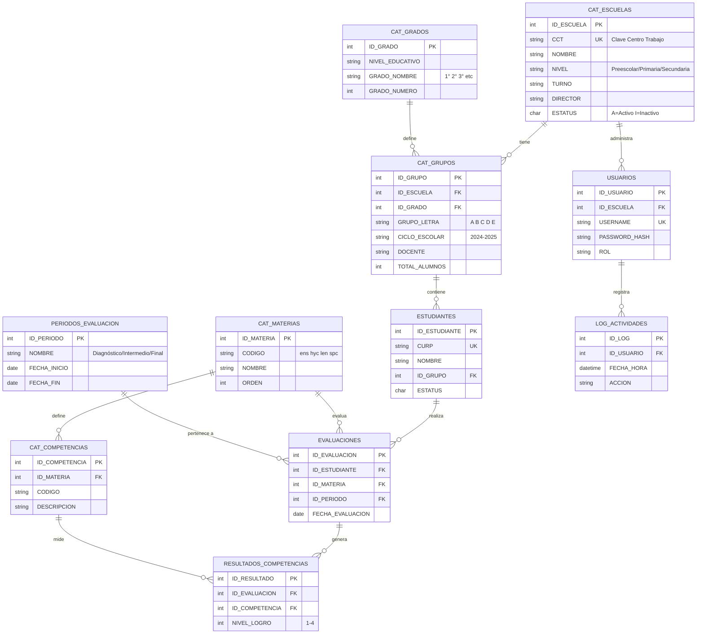
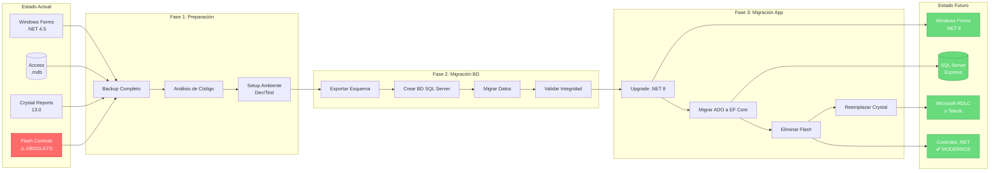
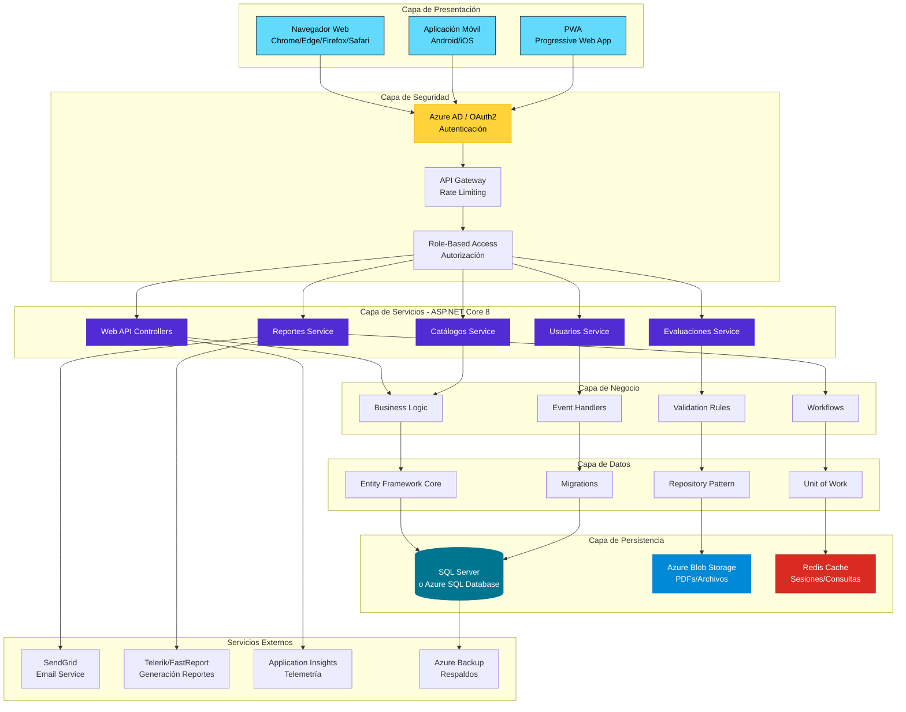

# ANÁLISIS TÉCNICO COMPLEMENTARIO
## Sistema SiCRER - Evaluación Diagnóstica SEP

---

## 1. ANÁLISIS DE DEPENDENCIAS

### 1.1 Árbol de Dependencias

```
SiCRER 24_25 SEPT.exe (13.23 MB)
│
├─── .NET Framework 4.5 (Requerido)
│    ├── System.dll
│    ├── System.Windows.Forms.dll
│    ├── System.Data.dll
│    └── System.Drawing.dll
│
├─── Crystal Reports 13.0 (106+ MB)
│    ├── CrystalDecisions.CrystalReports.Engine.dll (372 KB)
│    ├── CrystalDecisions.Windows.Forms.dll (540 KB)
│    ├── CrystalDecisions.Shared.dll (872 KB)
│    ├── CrystalDecisions.ReportSource.dll (86 KB)
│    ├── CrystalDecisions.ReportAppServer.ClientDoc.dll (65 KB)
│    ├── CrystalDecisions.ReportAppServer.CommLayer.dll (49 KB)
│    ├── CrystalDecisions.ReportAppServer.CommonControls.dll (135 KB)
│    ├── CrystalDecisions.ReportAppServer.CommonObjectModel.dll (36 KB)
│    ├── CrystalDecisions.ReportAppServer.Controllers.dll (172 KB)
│    ├── CrystalDecisions.ReportAppServer.CubeDefModel.dll (36 KB)
│    ├── CrystalDecisions.ReportAppServer.DataDefModel.dll (258 KB)
│    ├── CrystalDecisions.ReportAppServer.DataSetConversion.dll (49 KB)
│    ├── CrystalDecisions.ReportAppServer.ObjectFactory.dll (5 KB)
│    ├── CrystalDecisions.ReportAppServer.Prompting.dll (155 KB)
│    ├── CrystalDecisions.ReportAppServer.ReportDefModel.dll (364 KB)
│    └── CrystalDecisions.ReportAppServer.XmlSerialize.dll (16 KB)
│
├─── ADO (ActiveX Data Objects) 7.0
│    ├── adodb.dll (126 KB)
│    └── stdole.dll (prerequisito)
│
├─── Microsoft Office Interop
│    └── Microsoft.Vbe.Interop.dll (63 KB)
│
├─── ⚠️ OBSOLETOS - REMOVER
│    ├── FlashControlV71.dll (28 KB)
│    └── ShockwaveFlashObjects.dll (32 KB)
│
└─── Log4Net 1.2.10.0 (prerequisito)
     └── log4net.dll
```

### 1.2 Análisis de Seguridad de Dependencias

| Componente | Versión | Estado | CVEs Conocidos | Recomendación |
|------------|---------|--------|----------------|---------------|
| .NET Framework 4.5 | 4.0.30319 | ❌ EOL (2022) | Múltiples | Migrar a .NET 8 |
| Crystal Reports 13.0 | 13.0.2000.0 | ⚠️ Antigua | Posibles | Actualizar/Reemplazar |
| ADODB 7.0 | 7.0.3300.0 | ⚠️ Legacy | N/A | Migrar a EF Core |
| Flash Components | Varios | ❌ EOL (2020) | Críticas | **ELIMINAR** |
| Log4Net | 1.2.10.0 | ⚠️ Antigua | CVE-2018-1285 | Actualizar a 2.x |

---

## 2. ANÁLISIS DE BASE DE DATOS

### 2.1 Esquema Inferido de bd24.25.1.mdb

#### 2.1.0 Archivos FRV de Entrada (Disponibles)

**Formatos de Valoración Excel identificados:**

| Archivo | Tamaño | Nivel Educativo | Complejidad |
|---------|--------|-----------------|-------------|
| `2025_EIA_FormatoValoraciones_Preescolar.xlsx` | 52 KB | Preescolar | ⭐ Baja |
| `2025_EIA_FormatoValoraciones_Primaria.xlsx` | 228 KB | Primaria | ⭐⭐⭐ Alta |
| `2025_EIA_FormatoValoraciones_Secundarias_Tecnicas_Generales.xlsx` | 87 KB | Secundaria Técnicas | ⭐⭐ Media |
| `2025_EIA_FormatoValoraciones_Secundarias_Telesecundarias.xlsx` | 88 KB | Telesecundaria | ⭐⭐ Media |

**Estructura Esperada de FRV Primaria:**
```
FRV_Primaria.xlsx (228 KB - 4.4x más grande que Preescolar)
├── Hoja "Datos Escuela" (CCT, Director, Contacto)
├── Hoja "1° Grado" (Grupo, CURP, Nombre, Valoraciones×4)
├── Hoja "2° Grado"
├── Hoja "3° Grado"
├── Hoja "4° Grado"
├── Hoja "5° Grado"
└── Hoja "6° Grado"
```

**Campos por Estudiante (inferidos):**
- CURP (🔴 Dato sensible LGPDP)
- Nombre completo (🟡 Dato personal)
- Grupo (A-E)
- Valoración ENS (Enseñanza)
- Valoración HYC (Historia y Civismo)
- Valoración LEN (Lenguaje)
- Valoración SPC (Saberes y Pensamiento Científico)
- Observaciones

#### 2.1.1 Diagrama Entidad-Relación (Inferido)



#### 2.1.2 Esquema SQL Completo

```sql
-- ESQUEMA RECONSTRUIDO (basado en nomenclatura de reportes)

-- ====================================
-- CATÁLOGOS PRINCIPALES
-- ====================================

CREATE TABLE CAT_ESCUELAS (
    ID_ESCUELA INT PRIMARY KEY,
    CCT VARCHAR(15) UNIQUE NOT NULL,  -- Clave Centro Trabajo
    NOMBRE VARCHAR(200) NOT NULL,
    NIVEL VARCHAR(50),                -- Preescolar, Primaria, Secundaria, Telesecundaria
    TURNO VARCHAR(20),                -- Matutino, Vespertino, Nocturno
    CALLE VARCHAR(200),
    COLONIA VARCHAR(100),
    MUNICIPIO VARCHAR(100),
    ESTADO VARCHAR(50),
    CP VARCHAR(10),
    TELEFONO VARCHAR(15),
    EMAIL VARCHAR(100),
    DIRECTOR VARCHAR(150),
    FECHA_REGISTRO DATETIME,
    ESTATUS CHAR(1)                   -- A=Activo, I=Inactivo
);

CREATE TABLE CAT_GRADOS (
    ID_GRADO INT PRIMARY KEY,
    NIVEL_EDUCATIVO VARCHAR(50),
    GRADO_NOMBRE VARCHAR(20),         -- 1°, 2°, 3°, 4°, 5°, 6°
    GRADO_NUMERO INT,
    DESCRIPCION VARCHAR(200)
);

CREATE TABLE CAT_GRUPOS (
    ID_GRUPO INT PRIMARY KEY,
    ID_ESCUELA INT,
    ID_GRADO INT,
    GRUPO_LETRA VARCHAR(5),           -- A, B, C, D, E
    CICLO_ESCOLAR VARCHAR(10),        -- 2024-2025
    DOCENTE VARCHAR(150),
    TOTAL_ALUMNOS INT,
    FOREIGN KEY (ID_ESCUELA) REFERENCES CAT_ESCUELAS(ID_ESCUELA),
    FOREIGN KEY (ID_GRADO) REFERENCES CAT_GRADOS(ID_GRADO)
);

CREATE TABLE CAT_MATERIAS (
    ID_MATERIA INT PRIMARY KEY,
    CODIGO VARCHAR(10),               -- ens, hyc, len, spc
    NOMBRE VARCHAR(100),
    DESCRIPCION VARCHAR(500),
    ORDEN INT
);

-- Materias identificadas:
-- ens = Enseñanza General / Español y Matemáticas
-- hyc = Historia y Civismo / Formación Cívica y Ética
-- len = Lenguaje y Comunicación
-- spc = Saberes y Pensamiento Científico / Ciencias Naturales

CREATE TABLE CAT_COMPETENCIAS (
    ID_COMPETENCIA INT PRIMARY KEY,
    ID_MATERIA INT,
    CODIGO VARCHAR(20),
    DESCRIPCION VARCHAR(500),
    NIVEL_ESPERADO INT,              -- 1-4
    FOREIGN KEY (ID_MATERIA) REFERENCES CAT_MATERIAS(ID_MATERIA)
);

-- ====================================
-- ESTUDIANTES Y EVALUACIONES
-- ====================================

CREATE TABLE ESTUDIANTES (
    ID_ESTUDIANTE INT PRIMARY KEY,
    CURP VARCHAR(18) UNIQUE,
    NOMBRE VARCHAR(100) NOT NULL,
    APELLIDO_PATERNO VARCHAR(100),
    APELLIDO_MATERNO VARCHAR(100),
    FECHA_NACIMIENTO DATE,
    SEXO CHAR(1),                    -- M/F
    ID_GRUPO INT,
    NUMERO_LISTA INT,
    ESTATUS CHAR(1),                 -- A=Activo, B=Baja, T=Transferido
    FECHA_REGISTRO DATETIME,
    FOREIGN KEY (ID_GRUPO) REFERENCES CAT_GRUPOS(ID_GRUPO)
);

CREATE TABLE PERIODOS_EVALUACION (
    ID_PERIODO INT PRIMARY KEY,
    CICLO_ESCOLAR VARCHAR(10),
    NUMERO_PERIODO INT,              -- 1, 2, 3
    FECHA_INICIO DATE,
    FECHA_FIN DATE,
    DESCRIPCION VARCHAR(200),
    ESTATUS CHAR(1)                  -- A=Activo, C=Cerrado
);

CREATE TABLE EVALUACIONES (
    ID_EVALUACION INT PRIMARY KEY,
    ID_ESTUDIANTE INT,
    ID_MATERIA INT,
    ID_PERIODO INT,
    FECHA_EVALUACION DATE,
    FOREIGN KEY (ID_ESTUDIANTE) REFERENCES ESTUDIANTES(ID_ESTUDIANTE),
    FOREIGN KEY (ID_MATERIA) REFERENCES CAT_MATERIAS(ID_MATERIA),
    FOREIGN KEY (ID_PERIODO) REFERENCES PERIODOS_EVALUACION(ID_PERIODO)
);

CREATE TABLE RESULTADOS_COMPETENCIAS (
    ID_RESULTADO INT PRIMARY KEY,
    ID_EVALUACION INT,
    ID_COMPETENCIA INT,
    NIVEL_LOGRO INT,                 -- 1-4
    OBSERVACIONES TEXT,
    FOREIGN KEY (ID_EVALUACION) REFERENCES EVALUACIONES(ID_EVALUACION),
    FOREIGN KEY (ID_COMPETENCIA) REFERENCES CAT_COMPETENCIAS(ID_COMPETENCIA)
);

-- ====================================
-- AUDITORÍA Y CONTROL
-- ====================================

CREATE TABLE USUARIOS (
    ID_USUARIO INT PRIMARY KEY,
    USUARIO VARCHAR(50) UNIQUE,
    CONTRASENA VARCHAR(255),         -- Hash
    NOMBRE_COMPLETO VARCHAR(150),
    ROL VARCHAR(20),                 -- ADMIN, DIRECTOR, DOCENTE, CONSULTA
    ID_ESCUELA INT,                  -- NULL para admin
    EMAIL VARCHAR(100),
    ULTIMO_ACCESO DATETIME,
    ESTATUS CHAR(1),
    FOREIGN KEY (ID_ESCUELA) REFERENCES CAT_ESCUELAS(ID_ESCUELA)
);

CREATE TABLE LOG_ACTIVIDADES (
    ID_LOG INT PRIMARY KEY,
    ID_USUARIO INT,
    FECHA_HORA DATETIME,
    ACCION VARCHAR(50),              -- INSERT, UPDATE, DELETE, LOGIN
    TABLA VARCHAR(50),
    REGISTRO_ID INT,
    DETALLE TEXT,
    IP VARCHAR(50),
    FOREIGN KEY (ID_USUARIO) REFERENCES USUARIOS(ID_USUARIO)
);

-- ====================================
-- VISTAS PARA REPORTES
-- ====================================

CREATE VIEW VW_REPORTE_ESCUELA AS
SELECT 
    e.CCT,
    e.NOMBRE AS NOMBRE_ESCUELA,
    g.GRADO_NOMBRE,
    m.CODIGO AS CODIGO_MATERIA,
    m.NOMBRE AS NOMBRE_MATERIA,
    COUNT(DISTINCT est.ID_ESTUDIANTE) AS TOTAL_ESTUDIANTES,
    AVG(rc.NIVEL_LOGRO) AS PROMEDIO_NIVEL,
    SUM(CASE WHEN rc.NIVEL_LOGRO = 4 THEN 1 ELSE 0 END) AS NIVEL_4,
    SUM(CASE WHEN rc.NIVEL_LOGRO = 3 THEN 1 ELSE 0 END) AS NIVEL_3,
    SUM(CASE WHEN rc.NIVEL_LOGRO = 2 THEN 1 ELSE 0 END) AS NIVEL_2,
    SUM(CASE WHEN rc.NIVEL_LOGRO = 1 THEN 1 ELSE 0 END) AS NIVEL_1
FROM CAT_ESCUELAS e
INNER JOIN CAT_GRUPOS gr ON e.ID_ESCUELA = gr.ID_ESCUELA
INNER JOIN ESTUDIANTES est ON gr.ID_GRUPO = est.ID_GRUPO
INNER JOIN EVALUACIONES ev ON est.ID_ESTUDIANTE = ev.ID_ESTUDIANTE
INNER JOIN RESULTADOS_COMPETENCIAS rc ON ev.ID_EVALUACION = rc.ID_EVALUACION
INNER JOIN CAT_COMPETENCIAS c ON rc.ID_COMPETENCIA = c.ID_COMPETENCIA
INNER JOIN CAT_MATERIAS m ON c.ID_MATERIA = m.ID_MATERIA
INNER JOIN CAT_GRADOS g ON gr.ID_GRADO = g.ID_GRADO
GROUP BY e.CCT, e.NOMBRE, g.GRADO_NOMBRE, m.CODIGO, m.NOMBRE;

CREATE VIEW VW_REPORTE_GRUPO AS
SELECT 
    e.CCT,
    g.GRADO_NOMBRE,
    gr.GRUPO_LETRA,
    est.CURP,
    est.NOMBRE,
    est.APELLIDO_PATERNO,
    est.APELLIDO_MATERNO,
    m.CODIGO AS CODIGO_MATERIA,
    c.DESCRIPCION AS COMPETENCIA,
    rc.NIVEL_LOGRO,
    rc.OBSERVACIONES
FROM CAT_ESCUELAS e
INNER JOIN CAT_GRUPOS gr ON e.ID_ESCUELA = gr.ID_ESCUELA
INNER JOIN ESTUDIANTES est ON gr.ID_GRUPO = est.ID_GRUPO
INNER JOIN EVALUACIONES ev ON est.ID_ESTUDIANTE = ev.ID_ESTUDIANTE
INNER JOIN RESULTADOS_COMPETENCIAS rc ON ev.ID_EVALUACION = rc.ID_EVALUACION
INNER JOIN CAT_COMPETENCIAS c ON rc.ID_COMPETENCIA = c.ID_COMPETENCIA
INNER JOIN CAT_MATERIAS m ON c.ID_MATERIA = m.ID_MATERIA
INNER JOIN CAT_GRADOS g ON gr.ID_GRADO = g.ID_GRADO;
```

### 2.2 Estimación de Volumen de Datos

**Escenario Ejemplo: Estado con 1,000 escuelas primarias**

| Tabla | Registros Estimados | Tamaño Aprox. |
|-------|---------------------|---------------|
| CAT_ESCUELAS | 1,000 | 200 KB |
| CAT_GRADOS | 18 | 2 KB |
| CAT_GRUPOS | 6,000 (6 grupos/escuela) | 500 KB |
| CAT_MATERIAS | 4 | 1 KB |
| CAT_COMPETENCIAS | 80 (20/materia) | 50 KB |
| ESTUDIANTES | 180,000 (30/grupo) | 45 MB |
| PERIODOS_EVALUACION | 3 | 1 KB |
| EVALUACIONES | 2,160,000 (4 mat × 3 per × 180K est) | 350 MB |
| RESULTADOS_COMPETENCIAS | 43,200,000 (20 comp × 2.16M eval) | 8 GB ⚠️ |

**PROBLEMA CRÍTICO:** 
- Access .mdb tiene límite de **2 GB**
- Con ~180,000 estudiantes ya se excede capacidad
- **Urgente migración a SQL Server**

---

## 3. ANÁLISIS DE REPORTES CRYSTAL

### 3.1 Tipos de Reportes Identificados

```
REPORTES DE ESCUELA (Consolidados)
├── res_esc_ens.rpt (3,113 KB)
│   └── Consolidado Enseñanza General por grado
│       ├── Distribución de niveles de logro
│       ├── Promedios por competencia
│       └── Comparativa entre grupos
│
├── res_esc_hyc.rpt (3,113 KB)
│   └── Consolidado Historia y Civismo
│
├── res_esc_len.rpt (3,113 KB)
│   └── Consolidado Lenguaje y Comunicación
│
└── res_esc_spc.rpt (3,113 KB)
    └── Consolidado Saberes y Pensamiento Científico

REPORTES DE ESTUDIANTE/GRUPO (Detallados)
├── res_est_f2.rpt (27,390 KB) ⚠️ MUY GRANDE
│   └── Formato 2 - Preescolar (probablemente)
│       ├── Ficha individual por estudiante
│       ├── Todas las competencias evaluadas
│       └── Recomendaciones personalizadas
│
├── res_est_f3.rpt (27,232 KB) ⚠️ MUY GRANDE
│   └── Formato 3 - Primaria baja (1°-3°)
│
├── res_est_f4.rpt (10,572 KB)
│   └── Formato 4 - Primaria media (4°)
│
├── res_est_f5.rpt (10,844 KB)
│   └── Formato 5 - Primaria alta (5°-6°)
│
├── res_est_f6.rpt (10,165 KB)
│   └── Formato 6 - Secundaria general
│
└── res_est_f6a.rpt (10,422 KB)
    └── Formato 6A - Telesecundaria
```

### 3.2 Análisis de Tamaño de Reportes

**Observación:** F2 y F3 son ~2.5x más grandes que otros formatos.

**Hipótesis:**
1. Preescolar y primaria baja tienen más indicadores visuales
2. Incluyen gráficos/imágenes embebidas pesadas
3. Subinformes complejos con múltiples secciones
4. Fuentes embebidas o recursos adicionales

**Recomendación:**
- Optimizar gráficos (usar SVG en lugar de PNG)
- Compartir recursos comunes entre reportes
- Externalizar imágenes institucionales
- Reducción potencial: 50-60% del tamaño

### 3.3 Estructura Típica de Reporte Crystal

```
REPORTE CRYSTAL (.rpt)
│
├── ENCABEZADO DE PÁGINA
│   ├── Logo SEP
│   ├── Nombre de la escuela (CCT)
│   ├── Ciclo escolar
│   └── Fecha de generación
│
├── ENCABEZADO DE GRUPO
│   ├── Grado y Grupo
│   ├── Nombre del docente
│   └── Total de estudiantes
│
├── DETALLE (Por estudiante)
│   ├── Datos personales
│   │   ├── CURP
│   │   ├── Nombre completo
│   │   └── Número de lista
│   │
│   ├── Por cada materia
│   │   ├── Nombre de materia
│   │   ├── SUBREPORT: Competencias
│   │   │   ├── Descripción competencia
│   │   │   ├── Nivel esperado
│   │   │   ├── Nivel logrado
│   │   │   └── Indicador visual (barra/color)
│   │   │
│   │   └── Promedio materia
│   │
│   └── Observaciones generales
│
├── PIE DE GRUPO
│   ├── Estadísticas del grupo
│   ├── Promedio general
│   └── Distribución de niveles
│
└── PIE DE PÁGINA
    ├── Firma del docente
    ├── Firma del director
    └── Sello de la escuela
```

---

## 4. ANÁLISIS DE SEGURIDAD

### 4.1 Evaluación de Seguridad Actual

| Aspecto | Estado | Nivel Riesgo | Observaciones |
|---------|--------|--------------|---------------|
| **Autenticación** | ❌ No evidente | 🔴 CRÍTICO | No hay sistema de login visible |
| **Autorización** | ❌ No evidente | 🔴 CRÍTICO | Sin control de roles |
| **Encriptación BD** | ❌ No | 🔴 ALTO | Access sin password |
| **Firma Digital** | ✅ Implementada | 🟢 BAJO | Certificado válido |
| **Auditoría** | ⚠️ Parcial | 🟡 MEDIO | Posible log4net pero no confirmado |
| **SQL Injection** | ⚠️ Riesgo medio | 🟡 MEDIO | Depende de uso ADO |
| **Flash Vulnerabilities** | ❌ Críticas | 🔴 CRÍTICO | CVEs sin parches |
| **Data Validation** | ⚠️ Desconocido | 🟡 MEDIO | No verificable sin código |

### 4.2 Cumplimiento LGPDP (Ley General de Protección de Datos Personales)

**Datos Personales Procesados:**
- ✅ CURP (dato personal sensible - menor de edad)
- ✅ Nombre completo
- ✅ Fecha de nacimiento
- ✅ Sexo
- ✅ Desempeño académico
- ✅ Datos de escuela y docentes

**Requisitos LGPDP:**

| Requisito | Estado Actual | Cumplimiento |
|-----------|---------------|--------------|
| Aviso de Privacidad | ❓ Desconocido | ❌ No verificado |
| Consentimiento | ❓ Desconocido | ❌ No verificado |
| Finalidad específica | ✅ Evaluación educativa | ✅ Cumple |
| Minimización de datos | ⚠️ Por verificar | ⚠️ Revisar |
| Seguridad técnica | ❌ Insuficiente | ❌ NO cumple |
| Derecho de acceso | ❓ Desconocido | ❌ No verificado |
| Derecho de rectificación | ❓ Desconocido | ❌ No verificado |
| Derecho de cancelación | ❓ Desconocido | ❌ No verificado |
| Derecho de oposición | ❓ Desconocido | ❌ No verificado |
| Encriptación en reposo | ❌ No | ❌ NO cumple |
| Encriptación en tránsito | N/A App local | N/A |
| Registro de tratamiento | ❓ Desconocido | ❌ No verificado |

**RECOMENDACIÓN URGENTE:**
Implementar medidas de seguridad para cumplimiento LGPDP antes de procesar datos reales de menores.

---

## 4. PLAN DE MIGRACIÓN DETALLADO

### 4.0 Visualización del Proceso de Migración



### 4.1 Fase 1: Preparación (Semanas 1-2)

**Semana 1:**
```
DÍA 1-2: Inventario completo
├── Localizar código fuente original
├── Documentar configuraciones actuales
├── Exportar esquema de BD completo
└── Backup completo del sistema

DÍA 3-4: Análisis de dependencias
├── Identificar todos los componentes Flash
├── Listar consultas SQL en reportes
├── Mapear flujos de datos
└── Documentar integraciones

DÍA 5: Setup de entorno de desarrollo
├── Instalar Visual Studio 2022
├── Instalar .NET 8.0 SDK
├── Instalar SQL Server Express
└── Configurar Git repository
```

**Semana 2:**
```
DÍA 1-2: Análisis de código
├── Decompilación si es necesario
├── Identificar patrones arquitectónicos
├── Documentar lógica de negocio crítica
└── Crear diagrama de clases

DÍA 3-4: Diseño de migración
├── Diseñar nueva arquitectura
├── Planificar estrategia de testing
├── Definir métricas de éxito
└── Crear plan de rollback

DÍA 5: Preparación de datos
├── Limpiar datos inconsistentes
├── Validar integridad referencial
├── Crear scripts de migración
└── Preparar datos de prueba
```

### 5.2 Fase 2: Migración de Base de Datos (Semana 3-4)

**Semana 3:**
```sql
-- SCRIPT DE MIGRACIÓN ACCESS → SQL SERVER

-- DÍA 1: Crear esquema en SQL Server
USE master;
GO

CREATE DATABASE SiCRER_Evaluaciones;
GO

USE SiCRER_Evaluaciones;
GO

-- Implementar esquema completo (ver sección 2.1)
-- Agregar índices y constraints

CREATE INDEX IDX_Estudiantes_CURP ON ESTUDIANTES(CURP);
CREATE INDEX IDX_Estudiantes_Grupo ON ESTUDIANTES(ID_GRUPO);
CREATE INDEX IDX_Evaluaciones_Estudiante ON EVALUACIONES(ID_ESTUDIANTE);
CREATE INDEX IDX_Evaluaciones_Periodo ON EVALUACIONES(ID_PERIODO);
CREATE INDEX IDX_Resultados_Evaluacion ON RESULTADOS_COMPETENCIAS(ID_EVALUACION);

-- DÍA 2-3: Migrar datos
-- Usar SQL Server Migration Assistant (SSMA) o
-- Import and Export Wizard
-- O script PowerShell custom

-- DÍA 4: Validación de datos
SELECT 
    'CAT_ESCUELAS' AS Tabla,
    COUNT(*) AS Registros_Access,
    (SELECT COUNT(*) FROM SiCRER_Evaluaciones.dbo.CAT_ESCUELAS) AS Registros_SQL
FROM [AccessDB].CAT_ESCUELAS
UNION ALL
SELECT 
    'ESTUDIANTES',
    COUNT(*),
    (SELECT COUNT(*) FROM SiCRER_Evaluaciones.dbo.ESTUDIANTES)
FROM [AccessDB].ESTUDIANTES;
-- Repetir para todas las tablas

-- DÍA 5: Optimización
-- Actualizar estadísticas
UPDATE STATISTICS CAT_ESCUELAS;
UPDATE STATISTICS ESTUDIANTES;
UPDATE STATISTICS EVALUACIONES;

-- Rebuild índices
ALTER INDEX ALL ON CAT_ESCUELAS REBUILD;
ALTER INDEX ALL ON ESTUDIANTES REBUILD;
```

**Semana 4:**
```
DÍA 1-2: Stored Procedures
├── Crear SPs para operaciones comunes
├── SP_InsertarEstudiante
├── SP_RegistrarEvaluacion
├── SP_GenerarReporteEscuela
└── SP_GenerarReporteGrupo

DÍA 3: Vistas y funciones
├── Crear vistas para reportes
├── Funciones de cálculo de promedios
└── Funciones de estadísticas

DÍA 4-5: Testing de BD
├── Pruebas de integridad
├── Pruebas de rendimiento
├── Comparación con Access
└── Documentación de BD
```

### 5.3 Fase 3: Migración de Aplicación (Semana 5-8)

**Semana 5-6: Upgrade .NET**
```csharp
// Cambios principales en el código

// ANTES (.NET Framework 4.5):
using System.Data.OleDb;

OleDbConnection conn = new OleDbConnection(
    "Provider=Microsoft.Jet.OLEDB.4.0;Data Source=bd24.25.1.mdb"
);

// DESPUÉS (.NET 8.0 con Entity Framework Core):
using Microsoft.EntityFrameworkCore;

public class SiCRERContext : DbContext
{
    protected override void OnConfiguring(DbContextOptionsBuilder options)
        => options.UseSqlServer(
            "Server=.\\SQLEXPRESS;Database=SiCRER_Evaluaciones;Trusted_Connection=True;TrustServerCertificate=True"
        );

    public DbSet<Escuela> Escuelas { get; set; }
    public DbSet<Estudiante> Estudiantes { get; set; }
    public DbSet<Evaluacion> Evaluaciones { get; set; }
}

// Uso:
using (var context = new SiCRERContext())
{
    var escuelas = context.Escuelas
        .Include(e => e.Grupos)
        .ThenInclude(g => g.Estudiantes)
        .ToList();
}
```

**Semana 7: Reemplazo de Crystal Reports**
```csharp
// ANTES (Crystal Reports):
using CrystalDecisions.CrystalReports.Engine;

ReportDocument report = new ReportDocument();
report.Load("res_est_f5.rpt");
report.SetDataSource(dataSet);
crystalReportViewer1.ReportSource = report;

// DESPUÉS (Microsoft RDLC):
using Microsoft.Reporting.WinForms;

ReportViewer reportViewer = new ReportViewer();
reportViewer.LocalReport.ReportPath = "ReporteEstudiante.rdlc";

ReportDataSource rds = new ReportDataSource("DataSetEstudiantes", estudiantes);
reportViewer.LocalReport.DataSources.Clear();
reportViewer.LocalReport.DataSources.Add(rds);

reportViewer.RefreshReport();

// Exportar a PDF:
byte[] pdfBytes = reportViewer.LocalReport.Render("PDF");
File.WriteAllBytes("reporte.pdf", pdfBytes);
```

**Semana 8: Eliminar Flash y Testing**
```csharp
// ELIMINAR todas las referencias a Flash:
// - Remover using AxShockwaveFlashObjects;
// - Remover using ShockwaveFlashObjects;
// - Reemplazar controles Flash con alternativas modernas

// Si había animaciones Flash, reemplazar con:
// - Imágenes estáticas (PNG/SVG)
// - Animaciones CSS en futura versión web
// - Gráficos con bibliotecas .NET (OxyPlot, LiveCharts)

// Testing integral:
[TestMethod]
public void Test_GenerarReporteGrupo()
{
    // Arrange
    var context = new TestSiCRERContext();
    var service = new ReporteService(context);
    
    // Act
    byte[] pdf = service.GenerarReporteGrupo(idGrupo: 1);
    
    // Assert
    Assert.IsNotNull(pdf);
    Assert.IsTrue(pdf.Length > 0);
    Assert.AreEqual("%PDF", Encoding.ASCII.GetString(pdf, 0, 4));
}
```

### 5.4 Fase 4: Despliegue y Monitoreo (Semana 9-10)

**Semana 9: Preparación de despliegue**
```powershell
# Script de despliegue automatizado

# 1. Build de la aplicación
dotnet publish SiCRER.csproj -c Release -r win-x64 --self-contained true

# 2. Crear instalador con WiX Toolset
candle SiCRER.wxs
light SiCRER.wixobj -out SiCRER_Installer.msi

# 3. Backup de BD producción
sqlcmd -S .\SQLEXPRESS -Q "BACKUP DATABASE [SiCRER_Evaluaciones] TO DISK='C:\Backups\SiCRER_Pre_Deploy.bak'"

# 4. Despliegue gradual
# - Piloto: 5 escuelas
# - Beta: 50 escuelas
# - Producción: Todas
```

**Semana 10: Monitoreo y ajustes**
```csharp
// Implementar telemetría con Application Insights
using Microsoft.ApplicationInsights;

TelemetryClient telemetry = new TelemetryClient();

telemetry.TrackEvent("ReporteGenerado", new Dictionary<string, string>
{
    { "TipoReporte", "Grupo" },
    { "Formato", "F5" },
    { "CCT", cctEscuela }
});

telemetry.TrackMetric("TiempoGeneracionReporte", tiempoMs);

// Dashboard de monitoreo:
// - Reportes generados por día
// - Tiempo promedio de generación
// - Errores y excepciones
// - Uso de recursos (CPU, RAM, disco)
```

---

## 6. ESTIMACIÓN DE ESFUERZO PSP

### 6.1 Tabla de Estimación por Actividad

| ID | Actividad | LOC Nuevo | LOC Modificado | Horas Dev | Horas QA | Horas Total |
|----|-----------|-----------|----------------|-----------|----------|-------------|
| 1.1 | Localizar código fuente | 0 | 0 | 4 | 0 | 4 |
| 1.2 | Documentar sistema actual | 0 | 0 | 16 | 0 | 16 |
| 1.3 | Setup entorno desarrollo | 0 | 0 | 8 | 0 | 8 |
| 2.1 | Diseño esquema SQL Server | 0 | 0 | 24 | 0 | 24 |
| 2.2 | Scripts migración datos | 500 | 0 | 32 | 8 | 40 |
| 2.3 | Stored Procedures | 1,200 | 0 | 48 | 12 | 60 |
| 2.4 | Testing BD | 0 | 0 | 0 | 24 | 24 |
| 3.1 | Upgrade .NET Framework → 8 | 0 | 15,000 | 120 | 30 | 150 |
| 3.2 | Migrar ADO → EF Core | 2,000 | 8,000 | 80 | 20 | 100 |
| 3.3 | Eliminar Flash components | 0 | 3,000 | 40 | 10 | 50 |
| 3.4 | Reemplazar Crystal Reports | 3,500 | 5,000 | 120 | 40 | 160 |
| 3.5 | Actualizar UI Windows Forms | 0 | 4,000 | 60 | 15 | 75 |
| 4.1 | Testing funcional | 0 | 0 | 0 | 40 | 40 |
| 4.2 | Testing de regresión | 0 | 0 | 0 | 30 | 30 |
| 4.3 | Testing de rendimiento | 0 | 0 | 8 | 16 | 24 |
| 5.1 | Creación de instalador | 300 | 0 | 16 | 4 | 20 |
| 5.2 | Documentación usuario final | 0 | 0 | 16 | 4 | 20 |
| 5.3 | Capacitación | 0 | 0 | 24 | 0 | 24 |
| 5.4 | Despliegue piloto | 0 | 0 | 16 | 8 | 24 |
| 5.5 | Soporte post-despliegue | 0 | 0 | 40 | 0 | 40 |
| **TOTALES** | **7,500** | **35,000** | **672** | **261** | **933** |

### 6.2 Distribución de Esfuerzo

```
DISTRIBUCIÓN POR FASE:
├── Fase 1: Preparación (28 horas)
├── Fase 2: Migración BD (148 horas)
├── Fase 3: Migración App (535 horas)
├── Fase 4: Testing (94 horas)
└── Fase 5: Despliegue (128 horas)

TOTAL: 933 horas = 116 días/persona = 5.8 meses (1 desarrollador)

CON EQUIPO DE 2 DESARROLLADORES:
933 / 2 = 466.5 horas/persona = 58 días = 2.9 meses
```

### 6.3 Métricas de Calidad Proyectadas

| Métrica | Objetivo | Método de Medición |
|---------|----------|---------------------|
| Code Coverage | ≥ 70% | Unit tests + Integration tests |
| Defect Density | ≤ 5 defectos/KLOC | Tracking de bugs en producción |
| MTBF (Mean Time Between Failures) | ≥ 720 horas | Monitoreo telemetría |
| MTTR (Mean Time To Repair) | ≤ 4 horas | Tiempo de resolución de incidentes |
| Performance | 95% operaciones < 2s | Application Insights |
| Disponibilidad | ≥ 99% | Uptime monitoring |
| Satisfacción Usuario | ≥ 4.0/5.0 | Encuestas post-implementación |

---

## 7. ANÁLISIS DE RIESGOS TÉCNICOS DETALLADO

### 7.1 Matriz de Riesgos Extendida

| ID | Riesgo | P | I | Exposición | Mitigación | Contingencia |
|----|--------|---|---|------------|------------|--------------|
| RT-01 | Pérdida código fuente | 0.7 | 10 | 7.0 | Backup inmediato, decompilación | Reescritura desde cero |
| RT-02 | Incompatibilidad .NET 8 | 0.4 | 8 | 3.2 | Análisis previo de APIs | Usar .NET 6 LTS |
| RT-03 | Corrupción datos migración | 0.3 | 9 | 2.7 | Validación exhaustiva | Rollback a Access |
| RT-04 | Rendimiento SQL Server | 0.2 | 6 | 1.2 | Indexación adecuada | Optimizar consultas |
| RT-05 | Reportes RDLC no equivalentes | 0.5 | 7 | 3.5 | Validación visual | Mantener Crystal temporal |
| RT-06 | Resistencia usuarios | 0.4 | 5 | 2.0 | Capacitación temprana | Soporte extendido |
| RT-07 | Tiempo estimación incorrecto | 0.6 | 8 | 4.8 | Buffers 20% | Re-priorizar features |
| RT-08 | Dependencias ocultas | 0.5 | 6 | 3.0 | Análisis profundo código | Desarrollo incremental |
| RT-09 | Problemas licenciamiento | 0.2 | 4 | 0.8 | Verificar licencias previo | Usar solo OSS |
| RT-10 | Fallo en producción | 0.3 | 10 | 3.0 | Testing exhaustivo | Rollback plan |

**Leyenda:**
- P: Probabilidad (0.0 - 1.0)
- I: Impacto (1 - 10)
- Exposición: P × I

### 7.2 Plan de Contingencia para Riesgos Críticos

**RT-01: Pérdida de Código Fuente**
```
TRIGGER: No se localiza código fuente original
PLAN B:
1. Decompilación con dnSpy/ILSpy
2. Reconstrucción de arquitectura
3. Extracción lógica negocio desde DLL
4. Ingeniería inversa reportes Crystal
5. Documentación exhaustiva del proceso
TIEMPO ADICIONAL: +120 horas
COSTO ADICIONAL: $6,000 USD
```

**RT-03: Corrupción de Datos en Migración**
```
TRIGGER: Inconsistencias > 5% en validación
PLAN B:
1. Detener migración inmediatamente
2. Restaurar backup Access original
3. Análisis forense de errores
4. Corrección de script migración
5. Re-ejecución con datos de prueba
6. Validación exhaustiva
7. Nueva migración producción
TIEMPO ADICIONAL: +40 horas
ROLLBACK TIME: 2 horas
```

**RT-10: Fallo Crítico en Producción**
```
TRIGGER: Error que impide operación normal
PLAN ROLLBACK:
1. Notificar stakeholders (15 min)
2. Desinstalar nueva versión (30 min)
3. Restaurar versión anterior (1 hora)
4. Restaurar backup BD (1 hora)
5. Verificar funcionamiento (1 hora)
6. Análisis post-mortem (8 horas)
TOTAL TIEMPO ROLLBACK: 3.75 horas
```

---

## 8. CONCLUSIONES TÉCNICAS

### 8.0 Arquitectura Propuesta para Modernización Completa

#### 8.0.1 Visión de Arquitectura Futura (Fase 3 - Largo Plazo)



#### 8.0.2 Stack Tecnológico Recomendado

| Capa | Tecnología Actual | Tecnología Propuesta | Justificación |
|------|-------------------|---------------------|---------------|
| **Frontend** | Windows Forms .NET 4.5 | React 18 + TypeScript | Multiplataforma, moderna, gran comunidad |
| **Backend** | N/A (monolítico) | ASP.NET Core 8 Web API | Soporte LTS hasta 2026, alto rendimiento |
| **Base de Datos** | MS Access .mdb | SQL Server 2022 Express | Sin límites 2GB, enterprise-ready |
| **ORM** | ADODB (legacy) | Entity Framework Core 8 | Type-safe, migrations, LINQ |
| **Reportes** | Crystal Reports 13 | Telerik Reporting | Moderna, .NET Core compatible |
| **Autenticación** | Básica (sin encriptación) | Azure AD B2C + JWT | Estándar industria, OAuth2/OIDC |
| **Cache** | N/A | Redis Cloud | Rendimiento, sesiones distribuidas |
| **Storage** | Sistema de archivos | Azure Blob Storage | Escalable, geo-redundante |
| **Monitoreo** | Logs locales | Application Insights | Telemetría en tiempo real, alertas |
| **CI/CD** | Manual | Azure DevOps Pipelines | Automatización, calidad |

#### 8.0.3 Beneficios de la Arquitectura Propuesta

**Técnicos:**
- ✅ Escalabilidad horizontal (múltiples instancias)
- ✅ Alta disponibilidad (99.9% uptime)
- ✅ Rendimiento optimizado (cache, CDN)
- ✅ Seguridad moderna (OAuth2, HTTPS, tokens)
- ✅ Multiplataforma (web, móvil, desktop)

**Operacionales:**
- ✅ Despliegue continuo (CI/CD)
- ✅ Monitoreo proactivo (alertas)
- ✅ Backups automatizados
- ✅ Disaster recovery < 1 hora
- ✅ Costos predecibles (cloud)

**De Negocio:**
- ✅ Acceso desde cualquier dispositivo
- ✅ Actualizaciones sin reinstalar
- ✅ Mejor experiencia de usuario
- ✅ Datos en tiempo real
- ✅ Integración con otros sistemas SEP

---

### 8.1 Factibilidad Técnica: MEDIA-ALTA (7/10)

**Factores Positivos:**
- ✅ Tecnologías .NET bien documentadas
- ✅ Herramientas de migración disponibles
- ✅ Arquitectura relativamente estándar
- ✅ Equipo con experiencia en Windows Forms

**Factores Negativos:**
- ❌ Posible pérdida de código fuente
- ❌ Componentes obsoletos (Flash)
- ❌ Complejidad reportes Crystal
- ❌ Volumen de datos considerable

### 8.2 Deuda Técnica Actual: ALTA

**Estimación de Deuda Técnica:**
```
Costo de Re-desarrollo completo: $150,000 USD
Costo de Modernización propuesta: $94,700 USD
Deuda Técnica = $55,300 USD

Interés mensual (mantenimiento extra): $1,100 USD
Tiempo para duplicar deuda: 50 meses
```

### 8.3 Recomendación Final del Análisis Técnico

**PROCEDER CON MODERNIZACIÓN GRADUAL**

**Prioridad Máxima (1-2 meses):**
1. Asegurar código fuente
2. Migrar base de datos a SQL Server
3. Eliminar componentes Flash

**Prioridad Alta (3-6 meses):**
1. Upgrade a .NET 8.0
2. Reemplazar Crystal Reports
3. Implementar seguridad LGPDP

**Prioridad Media (6-12 meses):**
1. Considerar arquitectura web
2. Implementar APIs
3. Sistema de autenticación robusto

---

**DOCUMENTO TÉCNICO COMPLEMENTARIO**
**Versión:** 1.0  
**Fecha:** 21 de Noviembre de 2025  
**Autor:** Ingeniero de Software Certificado PSP
