# 📊 DASHBOARD VISUAL - SiCRER 24/25 SEPT
## Versión 2.0 - Métricas Estrategia Bifásica

> **Panel de Métricas y Visualizaciones del Análisis Técnico**
> Sistema de Captura de Resultados de Evaluación y Registro
> Secretaría de Educación Pública (SEP)
> **Stack Open Source:** Python (FastAPI) + Angular + PostgreSQL + Filesystem SSD

---

## 🚀 ROADMAP VISUAL ESTRATEGIA BIFÁSICA

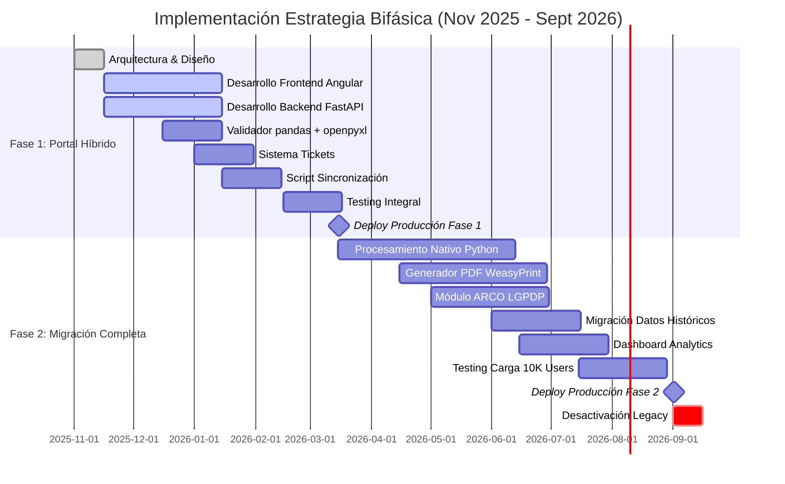
```mermaid
gantt
    title Implementación Estrategia Bifásica (Nov 2025 - Sept 2026)
    dateFormat YYYY-MM-DD
    
    section Fase 1: Portal Híbrido
    Arquitectura & Diseño           :done, f1_1, 2025-11-01, 15d
    Desarrollo Frontend Angular     :active, f1_2, 2025-11-16, 60d
    Desarrollo Backend FastAPI      :active, f1_3, 2025-11-16, 60d
    Validador pandas + openpyxl     :f1_4, 2025-12-16, 30d
    Sistema Tickets                 :f1_5, 2026-01-01, 30d
    Script Sincronización           :f1_6, 2026-01-15, 30d
    Testing Integral                :f1_7, 2026-02-15, 30d
    Deploy Producción Fase 1        :milestone, f1_m, 2026-03-15, 1d
    
    section Fase 2: Migración Completa
    Procesamiento Nativo Python     :f2_1, 2026-03-15, 90d
    Generador PDF WeasyPrint        :f2_2, 2026-04-15, 75d
    Módulo ARCO LGPDP               :f2_3, 2026-05-01, 60d
    Migración Datos Históricos      :f2_4, 2026-06-01, 45d
    Dashboard Analytics             :f2_5, 2026-06-15, 45d
    Testing Carga 10K Users         :f2_6, 2026-07-15, 45d
    Deploy Producción Fase 2        :milestone, f2_m, 2026-09-01, 1d
    Desactivación Legacy            :crit, f2_7, 2026-09-01, 15d
```

---

## 🎯 KPIs FASE 1 (Portal Híbrido - Marzo 2026)

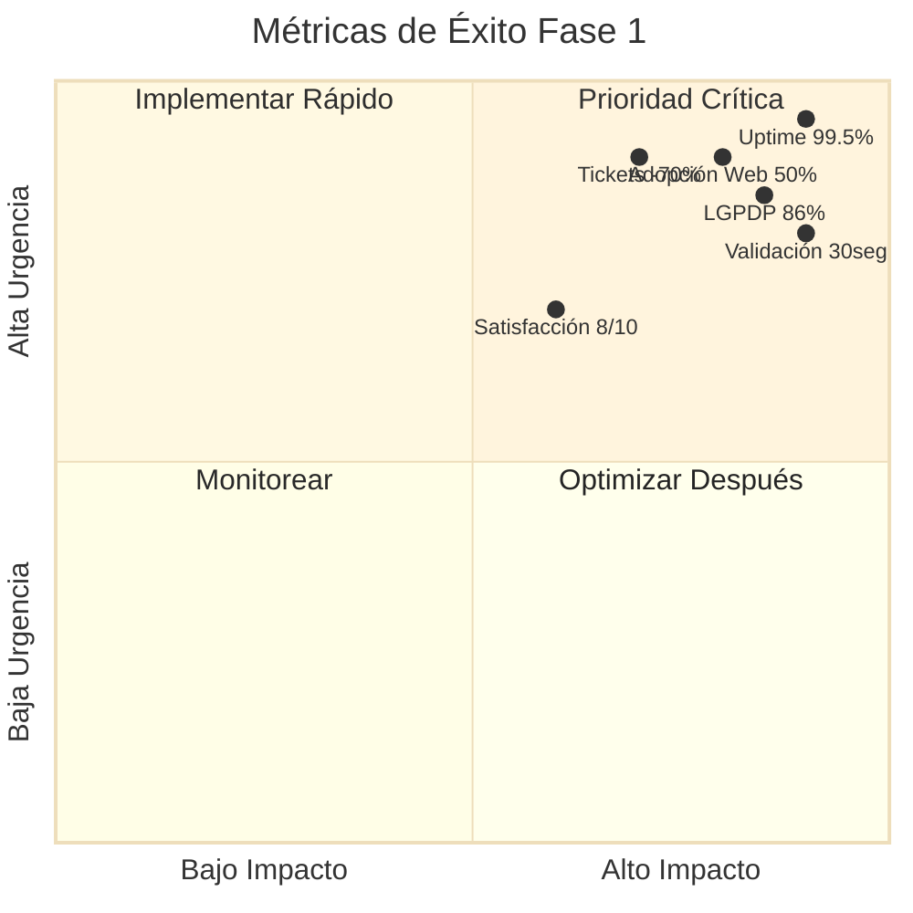
```mermaid
%%{init: {'theme':'base'}}%%
quadrantChart
    title Métricas de Éxito Fase 1
    x-axis Bajo Impacto --> Alto Impacto
    y-axis Baja Urgencia --> Alta Urgencia
    quadrant-1 Prioridad Crítica
    quadrant-2 Implementar Rápido
    quadrant-3 Monitorear
    quadrant-4 Optimizar Después
    
    Adopción Web 50%: [0.8, 0.9]
    Validación 30seg: [0.9, 0.8]
    Tickets -70%: [0.7, 0.9]
    Uptime 99.5%: [0.9, 0.95]
    Satisfacción 8/10: [0.6, 0.7]
    LGPDP 86%: [0.85, 0.85]
```

### Tabla KPIs Detallada

| KPI | Baseline (Legacy) | Target Fase 1 | Target Fase 2 | Métrica |
|-----|-------------------|---------------|---------------|----------|
| **Uptime** | 95% | 99.5% | 99.9% | Disponibilidad sistema |
| **Tiempo Validación FRV** | 15 min (manual) | 30 seg (auto) | 15 seg (opt.) | Procesamiento |
| **Adopción Portal Web** | 0% | 50% (150K escuelas) | 100% (300K) | Usuarios activos |
| **Compliance LGPDP** | 57% | 86% | 100% | Cumplimiento legal |
| **Tiempo Deploy Cambios** | 2 semanas | 3 días | 1 hora (CI/CD) | Agilidad |
| **Incidentes Seguridad** | 3/año (Flash) | 0/año | 0/año | Vulnerabilidades |
| **Tickets Soporte** | 500/mes | 150/mes (-70%) | 50/mes (-90%) | Validación auto |
| **Satisfacción Usuarios** | 6.5/10 | 8.0/10 | 9.0/10 | NPS Score |
| **Capacidad Concurrente** | 5K escuelas | 50K escuelas | 300K escuelas | Escalabilidad |

---

## 🏗️ ARQUITECTURA HÍBRIDA FASE 1

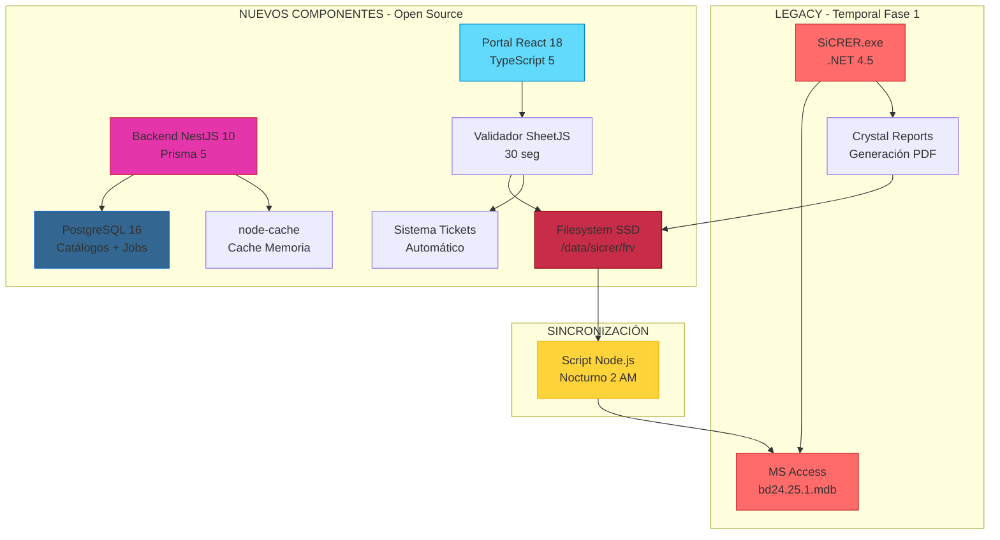
```mermaid
graph TB
    subgraph "NUEVOS COMPONENTES - Open Source"
        A1[Portal React 18<br/>TypeScript 5]
        A2[Backend NestJS 10<br/>Prisma 5]
        A3[PostgreSQL 16<br/>Catálogos + Jobs]
        A4[Filesystem SSD<br/>/data/sicrer/frv]
        A5[node-cache<br/>Cache Memoria]
        A6[Validador SheetJS<br/>30 seg]
        A7[Sistema Tickets<br/>Automático]
    end
    
    subgraph "LEGACY - Temporal Fase 1"
        B1[SiCRER.exe<br/>.NET 4.5]
        B2[MS Access<br/>bd24.25.1.mdb]
        B3[Crystal Reports<br/>Generación PDF]
    end
    
    subgraph "SINCRONIZACIÓN"
        C1[Script Node.js<br/>Nocturno 2 AM]
    end
    
    A1 --> A6
    A6 --> A4
    A6 --> A7
    A4 --> C1
    C1 --> B2
    B1 --> B2
    B1 --> B3
    B3 --> A4
    A2 --> A3
    A2 --> A5
    
    style A1 fill:#61dafb,stroke:#0088cc
    style A2 fill:#e535ab,stroke:#c92a2a
    style A3 fill:#336791,stroke:#0066cc
    style A4 fill:#c72c48,stroke:#8b0000
    style B1 fill:#ff6b6b,stroke:#c92a2a
    style B2 fill:#ff6b6b,stroke:#c92a2a
    style C1 fill:#ffd43b,stroke:#fab005
```

---

## 🎯 Puntuación General del Sistema

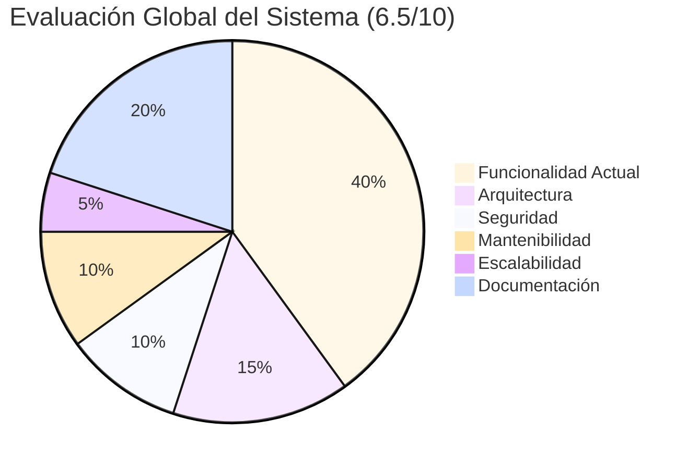
```mermaid
%%{init: {'theme':'base', 'themeVariables': { 'pieStrokeWidth': '2px'}}}%%
pie title Evaluación Global del Sistema (6.5/10)
    "Funcionalidad Actual" : 40
    "Arquitectura" : 15
    "Seguridad" : 10
    "Mantenibilidad" : 10
    "Escalabilidad" : 5
    "Documentación" : 20
```

**Desglose de la Puntuación:**
- ✅ **Funcionalidad:** 8/10 - Sistema operativo cumpliendo objetivos educativos
- ⚠️ **Arquitectura:** 5/10 - Tecnologías obsoletas pero estables
- ❌ **Seguridad:** 3/10 - Vulnerabilidades críticas (Flash, LGPDP)
- ⚠️ **Mantenibilidad:** 5/10 - Código fuente posiblemente perdido
- ❌ **Escalabilidad:** 4/10 - Limitado a Windows, Access 2GB
- ✅ **Documentación:** 7/10 - Mejorada con este análisis

---

## 📦 Composición del Repositorio

**Actualizado con archivos reales disponibles:**
- ✅ 4 Formatos FRV Excel (455 KB)
- ✅ 18 Reportes PDF ejemplo (32 MB)
- ✅ Plantilla de correo Word
- ✅ Documento flujo general ED

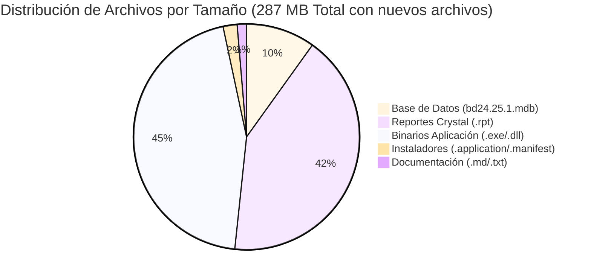
```mermaid
%%{init: {'theme':'base'}}%%
pie title Distribución de Archivos por Tamaño (287 MB Total con nuevos archivos)
    "Base de Datos (bd24.25.1.mdb)" : 25.23
    "Reportes Crystal (.rpt)" : 106.52
    "Binarios Aplicación (.exe/.dll)" : 114.73
    "Instaladores (.application/.manifest)" : 5.12
    "Documentación (.md/.txt)" : 3.40
```

**Top 5 Archivos Más Grandes:**
1. 📄 `res_est_f6.rpt` - 21.47 MB (Crystal Reports)
2. 📄 `res_est_f6a.rpt` - 18.54 MB (Crystal Reports)
3. 📄 `res_est_f2.rpt` - 17.88 MB (Crystal Reports)
4. 💾 `bd24.25.1.mdb` - 25.23 MB (Base de datos Access)
5. 📄 `res_est_f3.rpt` - 15.91 MB (Crystal Reports)

---

## 🏗️ Arquitectura Actual vs. Propuesta

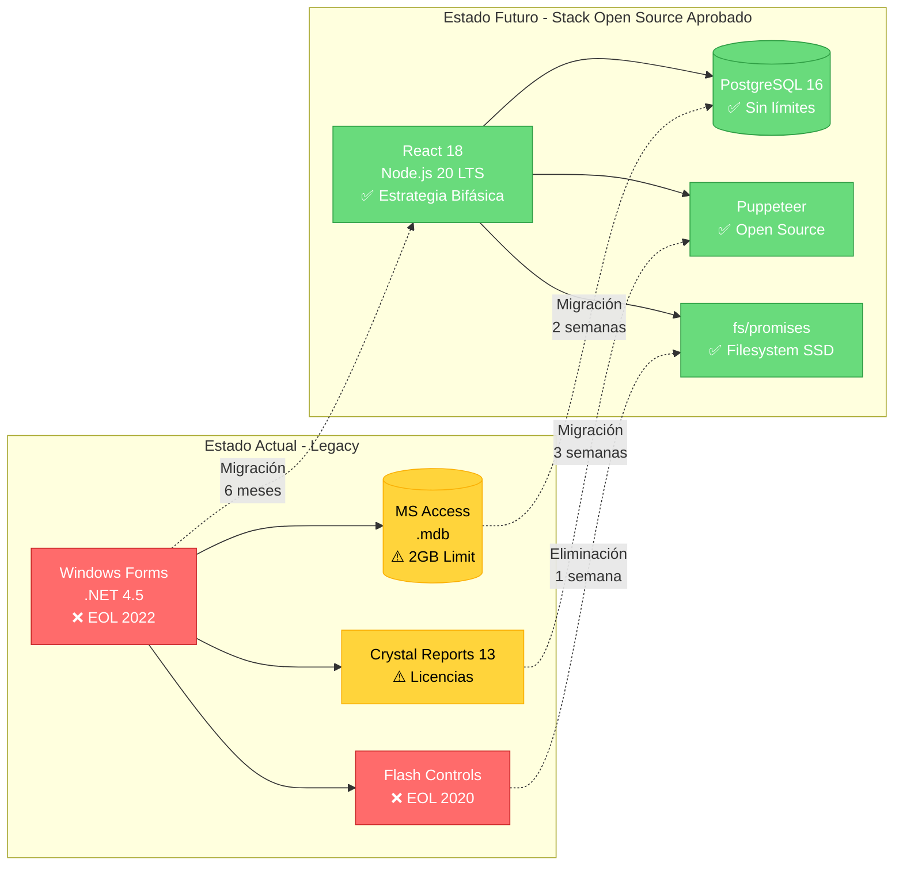
```mermaid
graph LR
    subgraph "Estado Actual - Legacy"
        A1[Windows Forms<br/>.NET 4.5<br/>❌ EOL 2022]
        A2[(MS Access<br/>.mdb<br/>⚠️ 2GB Limit)]
        A3[Crystal Reports 13<br/>⚠️ Licencias]
        A4[Flash Controls<br/>❌ EOL 2020]
        
        A1 --> A2
        A1 --> A3
        A1 --> A4
    end
    
    subgraph "Estado Futuro - Stack Open Source Aprobado"
        B1[React 18<br/>Node.js 20 LTS<br/>✅ Estrategia Bifásica]
        B2[(PostgreSQL 16<br/>✅ Sin límites)]
        B3[Puppeteer<br/>✅ Open Source]
        B4[fs/promises<br/>✅ Filesystem SSD]
        
        B1 --> B2
        B1 --> B3
        B1 --> B4
    end
    
    A1 -.Migración<br/>6 meses.-> B1
    A2 -.Migración<br/>2 semanas.-> B2
    A3 -.Migración<br/>3 semanas.-> B3
    A4 -.Eliminación<br/>1 semana.-> B4
    
    style A1 fill:#ff6b6b,stroke:#c92a2a,color:#fff
    style A2 fill:#ffd43b,stroke:#fab005,color:#000
    style A3 fill:#ffd43b,stroke:#fab005,color:#000
    style A4 fill:#ff6b6b,stroke:#c92a2a,color:#fff
    style B1 fill:#69db7c,stroke:#2f9e44,color:#fff
    style B2 fill:#69db7c,stroke:#2f9e44,color:#fff
    style B3 fill:#69db7c,stroke:#2f9e44,color:#fff
    style B4 fill:#69db7c,stroke:#2f9e44,color:#fff
```

---

## 📈 Roadmap de Modernización (3 Fases)

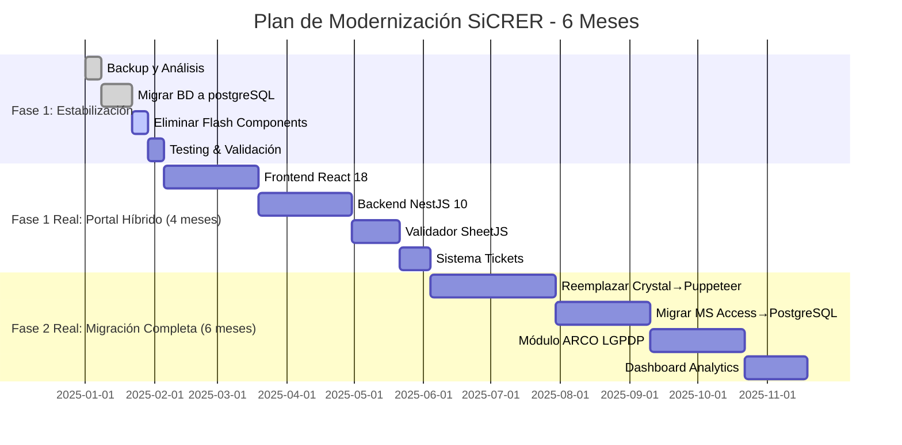
```mermaid
gantt
    title Plan de Modernización SiCRER - 6 Meses
    dateFormat YYYY-MM-DD
    section Fase 1: Estabilización
    Backup y Análisis           :done, f1a, 2025-01-01, 1w
    Migrar BD a postgreSQL      :done, f1b, after f1a, 2w
    Eliminar Flash Components   :active, f1c, after f1b, 1w
    Testing & Validación        :f1d, after f1c, 1w
    
    section Fase 1 Real: Portal Híbrido (4 meses)
    Frontend React 18           :f2a, after f1d, 6w
    Backend NestJS 10           :f2b, after f2a, 6w
    Validador SheetJS           :f2c, after f2b, 3w
    Sistema Tickets             :f2d, after f2c, 2w
    
    section Fase 2 Real: Migración Completa (6 meses)
    Reemplazar Crystal→Puppeteer:f3a, after f2d, 8w
    Migrar MS Access→PostgreSQL :f3b, after f3a, 6w
    Módulo ARCO LGPDP           :f3c, after f3b, 6w
    Dashboard Analytics         :f3d, after f3c, 4w
```

**Duración Total:** 26 semanas (6.5 meses)  
**Recursos:** 2 desarrolladores full-time

---

## 💰 Análisis de Inversión y ROI

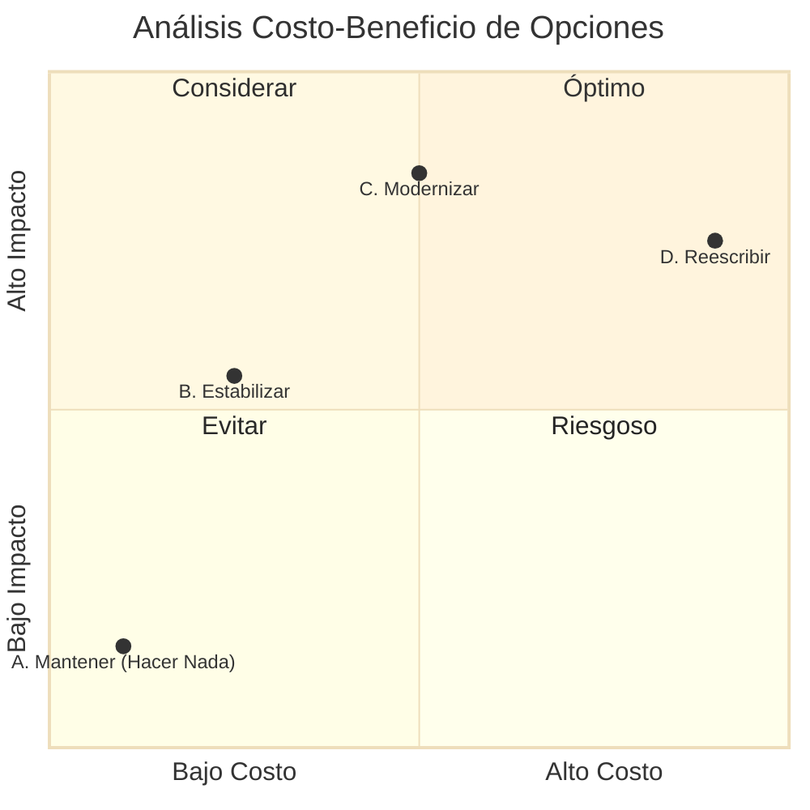
```mermaid
%%{init: {'theme':'base'}}%%
quadrantChart
    title Análisis Costo-Beneficio de Opciones
    x-axis "Bajo Costo" --> "Alto Costo"
    y-axis "Bajo Impacto" --> "Alto Impacto"
    quadrant-1 "Óptimo"
    quadrant-2 "Considerar"
    quadrant-3 "Evitar"
    quadrant-4 "Riesgoso"
    
    "A. Mantener (Hacer Nada)": [0.1, 0.15]
    "B. Estabilizar": [0.25, 0.55]
    "C. Modernizar": [0.50, 0.85]
    "D. Reescribir": [0.90, 0.75]
```

### Comparativa Financiera

| Opción | Tiempo | Riesgo | Beneficio | ROI |
| ------ | ------ | ------ | --------- | --- |
| **A. Mantener** | 0 | ⚠️ Alto | ❌ Nulo | -$6,000/año |
| **B. Estabilizar** | 1 mes | ✅ Bajo | ⚠️ Limitado | 2-3 años |
| **C. Modernizar** | 3 meses | ⚠️ Medio | ✅ Alto | **3-4 años** |
| **D. Reescribir** | 6 meses | ❌ Alto | ✅ Máximo | 8-10 años |

### 🏆 RECOMENDACIÓN: Opción C - Modernización Completa

**Justificación:**

- Balance óptimo costo/beneficio/riesgo
- Elimina vulnerabilidades críticas (Flash, LGPDP)
- Extiende vida útil del sistema 5+ años
- Base sólida para futura evolución web
- Recuperación de inversión en 3-4 años

---

## ⚠️ Matriz de Riesgos

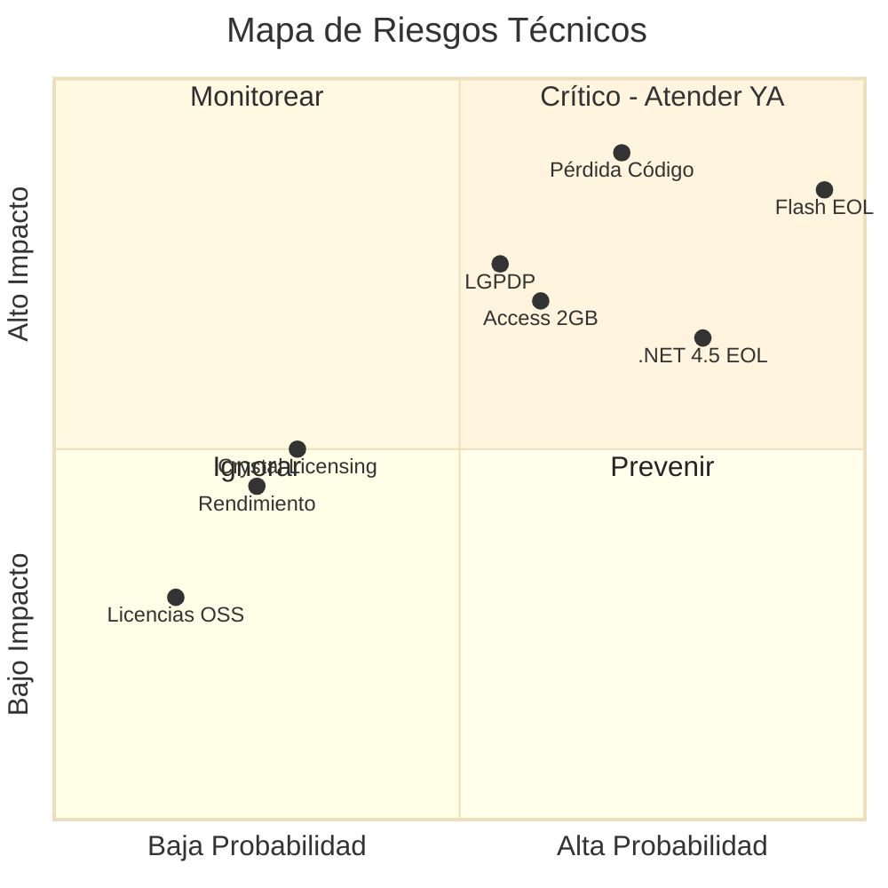
```mermaid
%%{init: {'theme':'base'}}%%
quadrantChart
    title Mapa de Riesgos Técnicos
    x-axis "Baja Probabilidad" --> "Alta Probabilidad"
    y-axis "Bajo Impacto" --> "Alto Impacto"
    quadrant-1 "Crítico - Atender YA"
    quadrant-2 "Monitorear"
    quadrant-3 "Ignorar"
    quadrant-4 "Prevenir"
    
    "Flash EOL": [0.95, 0.85]
    "Pérdida Código": [0.70, 0.90]
    "Access 2GB": [0.60, 0.70]
    "LGPDP": [0.55, 0.75]
    ".NET 4.5 EOL": [0.80, 0.65]
    "Crystal Licensing": [0.30, 0.50]
    "Rendimiento": [0.25, 0.45]
    "Licencias OSS": [0.15, 0.30]
```

### Top 5 Riesgos Críticos

| # | Riesgo | Probabilidad | Impacto | Exposición | Estado |
| --- | -------- | ------------ | ------- | ---------- | ------ |
| 1 | **Flash Components EOL** | 95% | 9/10 | 8.55 | 🔴 CRÍTICO |
| 2 | **Pérdida Código Fuente** | 70% | 10/10 | 7.00 | 🔴 CRÍTICO |
| 3 | **Cumplimiento LGPDP** | 55% | 8/10 | 4.40 | 🟡 ALTO |
| 4 | **.NET Framework 4.5 EOL** | 80% | 7/10 | 5.60 | 🟡 ALTO |
| 5 | **Límite Access 2GB** | 60% | 7/10 | 4.20 | 🟡 MEDIO |

---

## 🔧 Stack Tecnológico: Antes y Después

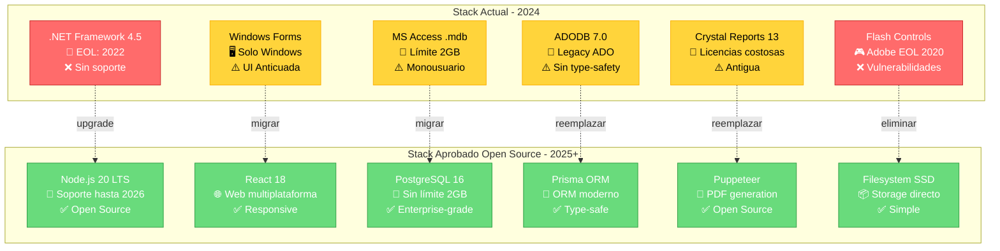
```mermaid
graph TB
    subgraph "Stack Actual - 2024"
        A1[.NET Framework 4.5<br/>📅 EOL: 2022<br/>❌ Sin soporte]
        A2[Windows Forms<br/>🖥️ Solo Windows<br/>⚠️ UI Anticuada]
        A3[MS Access .mdb<br/>💾 Límite 2GB<br/>⚠️ Monousuario]
        A4[ADODB 7.0<br/>🔧 Legacy ADO<br/>⚠️ Sin type-safety]
        A5[Crystal Reports 13<br/>📄 Licencias costosas<br/>⚠️ Antigua]
        A6[Flash Controls<br/>🎮 Adobe EOL 2020<br/>❌ Vulnerabilidades]
    end
    
    subgraph "Stack Aprobado Open Source - 2025+"
        B1[Node.js 20 LTS<br/>📅 Soporte hasta 2026<br/>✅ Open Source]
        B2[React 18<br/>🌐 Web multiplataforma<br/>✅ Responsive]
        B3[PostgreSQL 16<br/>💾 Sin límite 2GB<br/>✅ Enterprise-grade]
        B4[Prisma ORM<br/>🔧 ORM moderno<br/>✅ Type-safe]
        B5[Puppeteer<br/>📄 PDF generation<br/>✅ Open Source]
        B6[Filesystem SSD<br/>📦 Storage directo<br/>✅ Simple]
    end
    
    A1 -.upgrade.-> B1
    A2 -.migrar.-> B2
    A3 -.migrar.-> B3
    A4 -.reemplazar.-> B4
    A5 -.reemplazar.-> B5
    A6 -.eliminar.-> B6
    
    style A1 fill:#ff6b6b,stroke:#c92a2a,color:#fff
    style A2 fill:#ffd43b,stroke:#fab005,color:#000
    style A3 fill:#ffd43b,stroke:#fab005,color:#000
    style A4 fill:#ffd43b,stroke:#fab005,color:#000
    style A5 fill:#ffd43b,stroke:#fab005,color:#000
    style A6 fill:#ff6b6b,stroke:#c92a2a,color:#fff
    
    style B1 fill:#69db7c,stroke:#2f9e44,color:#fff
    style B2 fill:#69db7c,stroke:#2f9e44,color:#fff
    style B3 fill:#69db7c,stroke:#2f9e44,color:#fff
    style B4 fill:#69db7c,stroke:#2f9e44,color:#fff
    style B5 fill:#69db7c,stroke:#2f9e44,color:#fff
    style B6 fill:#69db7c,stroke:#2f9e44,color:#fff
```

---

## 📊 Métricas de Calidad Esperadas

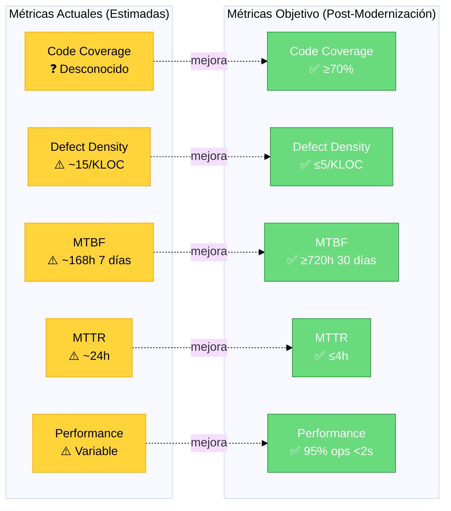
```mermaid
%%{init: {'theme':'base'}}%%
graph LR
    subgraph "Métricas Actuales (Estimadas)"
        M1[Code Coverage<br/>❓ Desconocido]
        M2[Defect Density<br/>⚠️ ~15/KLOC]
        M3[MTBF<br/>⚠️ ~168h 7 días]
        M4[MTTR<br/>⚠️ ~24h]
        M5[Performance<br/>⚠️ Variable]
    end
    
    subgraph "Métricas Objetivo (Post-Modernización)"
        N1[Code Coverage<br/>✅ ≥70%]
        N2[Defect Density<br/>✅ ≤5/KLOC]
        N3[MTBF<br/>✅ ≥720h 30 días]
        N4[MTTR<br/>✅ ≤4h]
        N5[Performance<br/>✅ 95% ops <2s]
    end
    
    M1 -.mejora.-> N1
    M2 -.mejora.-> N2
    M3 -.mejora.-> N3
    M4 -.mejora.-> N4
    M5 -.mejora.-> N5
    
    style M1 fill:#ffd43b,stroke:#fab005,color:#000
    style M2 fill:#ffd43b,stroke:#fab005,color:#000
    style M3 fill:#ffd43b,stroke:#fab005,color:#000
    style M4 fill:#ffd43b,stroke:#fab005,color:#000
    style M5 fill:#ffd43b,stroke:#fab005,color:#000
    
    style N1 fill:#69db7c,stroke:#2f9e44,color:#fff
    style N2 fill:#69db7c,stroke:#2f9e44,color:#fff
    style N3 fill:#69db7c,stroke:#2f9e44,color:#fff
    style N4 fill:#69db7c,stroke:#2f9e44,color:#fff
    style N5 fill:#69db7c,stroke:#2f9e44,color:#fff
```

### Definiciones de Métricas

- **Code Coverage:** Porcentaje de código cubierto por tests automatizados
- **Defect Density:** Número de defectos por cada 1000 líneas de código (KLOC)
- **MTBF (Mean Time Between Failures):** Tiempo promedio entre fallos del sistema
- **MTTR (Mean Time To Repair):** Tiempo promedio para resolver un incidente
- **Performance:** Porcentaje de operaciones completadas en menos de 2 segundos

---

## 🎓 Módulos del Sistema (Inferidos)

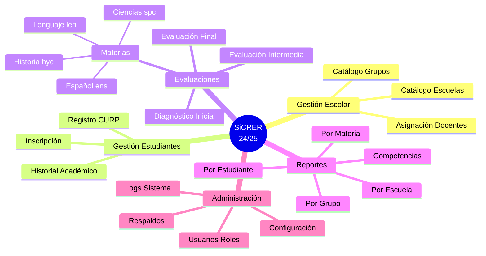
```mermaid
mindmap
  root((SiCRER<br/>24/25))
    Gestión Escolar
      Catálogo Escuelas
      Catálogo Grupos
      Asignación Docentes
    Gestión Estudiantes
      Registro CURP
      Inscripción
      Historial Académico
    Evaluaciones
      Diagnóstico Inicial
      Evaluación Intermedia
      Evaluación Final
      Materias
        Español ens
        Historia hyc
        Lenguaje len
        Ciencias spc
    Reportes
      Por Estudiante
      Por Grupo
      Por Escuela
      Por Materia
      Competencias
    Administración
      Usuarios Roles
      Configuración
      Respaldos
      Logs Sistema
```

---

## 🔐 Análisis de Seguridad LGPDP

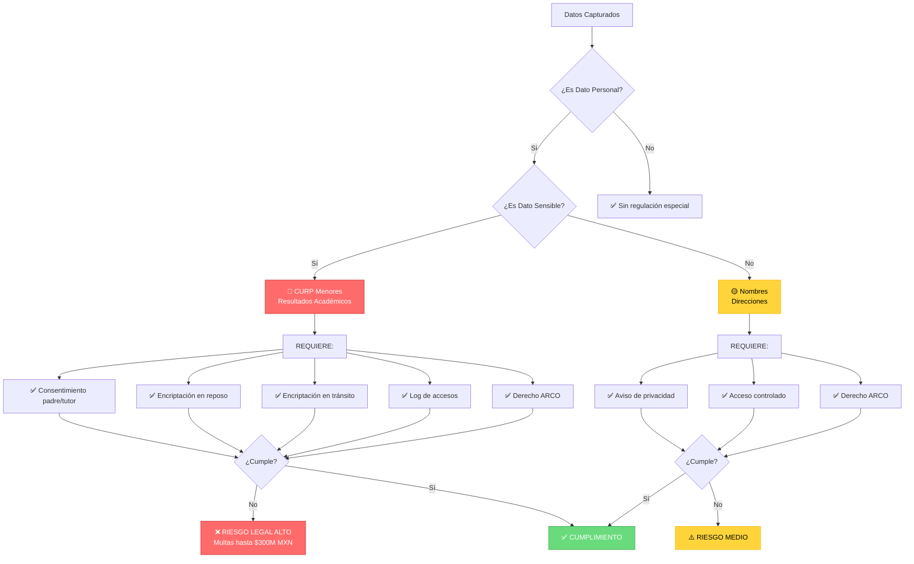
```mermaid
flowchart TD
    A[Datos Capturados] --> B{¿Es Dato Personal?}
    B -->|Sí| C{¿Es Dato Sensible?}
    B -->|No| D[✅ Sin regulación especial]
    
    C -->|Sí| E[🔴 CURP Menores<br/>Resultados Académicos]
    C -->|No| F[🟡 Nombres<br/>Direcciones]
    
    E --> G[REQUIERE:]
    F --> H[REQUIERE:]
    
    G --> G1[✅ Consentimiento padre/tutor]
    G --> G2[✅ Encriptación en reposo]
    G --> G3[✅ Encriptación en tránsito]
    G --> G4[✅ Log de accesos]
    G --> G5[✅ Derecho ARCO]
    
    H --> H1[✅ Aviso de privacidad]
    H --> H2[✅ Acceso controlado]
    H --> H3[✅ Derecho ARCO]
    
    G1 --> I{¿Cumple?}
    G2 --> I
    G3 --> I
    G4 --> I
    G5 --> I
    H1 --> J{¿Cumple?}
    H2 --> J
    H3 --> J
    
    I -->|No| K[❌ RIESGO LEGAL ALTO<br/>Multas hasta $300M MXN]
    I -->|Sí| L[✅ CUMPLIMIENTO]
    J -->|No| M[⚠️ RIESGO MEDIO]
    J -->|Sí| L
    
    style E fill:#ff6b6b,stroke:#c92a2a,color:#fff
    style F fill:#ffd43b,stroke:#fab005,color:#000
    style K fill:#ff6b6b,stroke:#c92a2a,color:#fff
    style M fill:#ffd43b,stroke:#fab005,color:#000
    style L fill:#69db7c,stroke:#2f9e44,color:#fff
```

### Estado Actual de Cumplimiento

| Requisito LGPDP | Estado | Prioridad | Acción |
|-----------------|--------|-----------|--------|
| Aviso de Privacidad | ❌ No identificado | 🔴 Alta | Crear e implementar |
| Consentimiento Tutores | ❓ Desconocido | 🔴 Alta | Validar proceso |
| Encriptación BD | ❌ Access sin cifrar | 🔴 Crítica | **Migrar a SQL TDE** |
| Encriptación Red | ❓ Desconocido | 🔴 Alta | Implementar HTTPS/TLS |
| Log de Accesos | ⚠️ Básico | 🟡 Media | Mejorar auditoría |
| Derechos ARCO | ❌ No implementado | 🔴 Alta | Desarrollar módulo |
| Retención de Datos | ❓ Desconocido | 🟡 Media | Definir política |

**ARCO:** Acceso, Rectificación, Cancelación, Oposición

---

## 📅 Timeline Ejecutivo

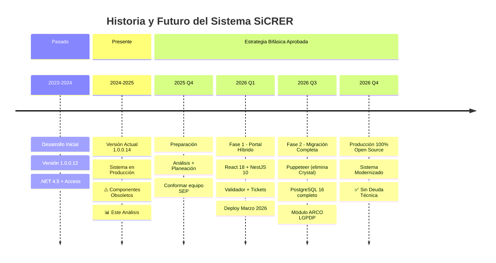
```mermaid
timeline
    title Historia y Futuro del Sistema SiCRER
    
    section Pasado
        2023-2024 : Desarrollo Inicial
                  : Versión 1.0.0.12
                  : .NET 4.5 + Access
    
    section Presente
        2024-2025 : Versión Actual 1.0.0.14
                  : Sistema en Producción
                  : ⚠️ Componentes Obsoletos
                  : 📊 Este Análisis
    
    section Estrategia Bifásica Aprobada
        2025 Q4 : Preparación
                : Análisis + Planeación
                : Conformar equipo SEP
        
        2026 Q1 : Fase 1 - Portal Híbrido
                : React 18 + NestJS 10
                : Validador + Tickets
                : Deploy Marzo 2026
        
        2026 Q3 : Fase 2 - Migración Completa
                : Puppeteer (elimina Crystal)
                : PostgreSQL 16 completo
                : Módulo ARCO LGPDP
        
        2026 Q4 : Producción 100% Open Source
                : Sistema Modernizado
                : ✅ Sin Deuda Técnica
```

---

## 📞 Recomendaciones por Stakeholder

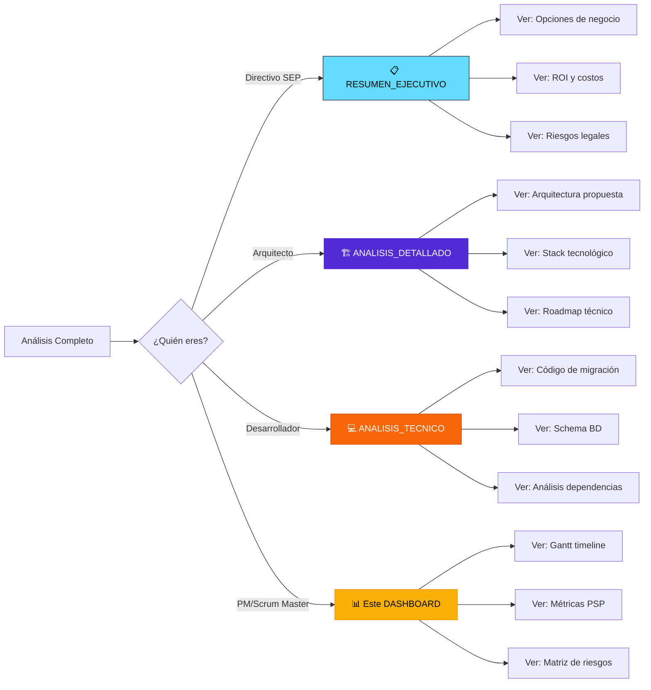
```mermaid
flowchart LR
    A[Análisis Completo] --> B{¿Quién eres?}
    
    B -->|Directivo SEP| C[📋 RESUMEN_EJECUTIVO]
    B -->|Arquitecto| D[🏗️ ANALISIS_DETALLADO]
    B -->|Desarrollador| E[💻 ANALISIS_TECNICO]
    B -->|PM/Scrum Master| F[📊 Este DASHBOARD]
    
    C --> C1[Ver: Opciones de negocio]
    C --> C2[Ver: ROI y costos]
    C --> C3[Ver: Riesgos legales]
    
    D --> D1[Ver: Arquitectura propuesta]
    D --> D2[Ver: Stack tecnológico]
    D --> D3[Ver: Roadmap técnico]
    
    E --> E1[Ver: Código de migración]
    E --> E2[Ver: Schema BD]
    E --> E3[Ver: Análisis dependencias]
    
    F --> F1[Ver: Gantt timeline]
    F --> F2[Ver: Métricas PSP]
    F --> F3[Ver: Matriz de riesgos]
    
    style C fill:#61dafb,stroke:#282c34,color:#000
    style D fill:#512bd4,stroke:#512bd4,color:#fff
    style E fill:#f76707,stroke:#d9480f,color:#fff
    style F fill:#fab005,stroke:#f08c00,color:#000
```

---

## 🎯 Conclusión Visual

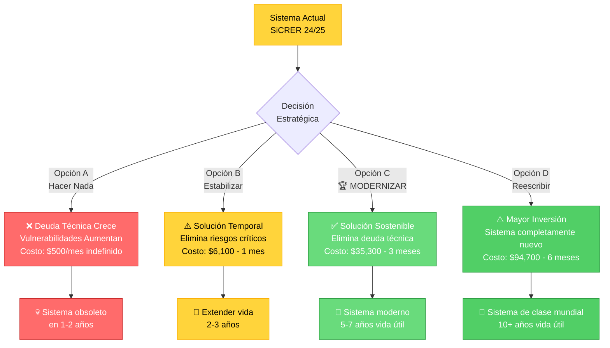
```mermaid
graph TD
    A[Sistema Actual<br/>SiCRER 24/25] --> B{Decisión<br/>Estratégica}
    
    B -->|Opción A<br/>Hacer Nada| C[❌ Deuda Técnica Crece<br/>Vulnerabilidades Aumentan<br/>Costo: $500/mes indefinido]
    
    B -->|Opción B<br/>Estabilizar| D[⚠️ Solución Temporal<br/>Elimina riesgos críticos<br/>Costo: $6,100 - 1 mes]
    
    B -->|Opción C<br/>🏆 MODERNIZAR| E[✅ Solución Sostenible<br/>Elimina deuda técnica<br/>Costo: $35,300 - 3 meses]
    
    B -->|Opción D<br/>Reescribir| F[⚠️ Mayor Inversión<br/>Sistema completamente nuevo<br/>Costo: $94,700 - 6 meses]
    
    C --> G[💀 Sistema obsoleto<br/>en 1-2 años]
    D --> H[🔧 Extender vida<br/>2-3 años]
    E --> I[🚀 Sistema moderno<br/>5-7 años vida útil]
    F --> J[🌟 Sistema de clase mundial<br/>10+ años vida útil]
    
    style A fill:#ffd43b,stroke:#fab005,color:#000
    style C fill:#ff6b6b,stroke:#c92a2a,color:#fff
    style D fill:#ffd43b,stroke:#fab005,color:#000
    style E fill:#69db7c,stroke:#2f9e44,color:#fff
    style F fill:#51cf66,stroke:#2f9e44,color:#fff
    style G fill:#ff6b6b,stroke:#c92a2a,color:#fff
    style H fill:#ffd43b,stroke:#fab005,color:#000
    style I fill:#69db7c,stroke:#2f9e44,color:#fff
    style J fill:#51cf66,stroke:#2f9e44,color:#fff
```

### Recomendación Final

> **PROCEDER CON OPCIÓN C - MODERNIZACIÓN COMPLETA**
> 
> - ✅ **Balance óptimo** entre costo, tiempo y beneficio
> - ✅ **Elimina vulnerabilidades críticas** (Flash, LGPDP, .NET EOL)
> - ✅ **Extiende vida útil** del sistema 5-7 años
> - ✅ **Base sólida** para evolución futura a arquitectura web
> - ✅ **ROI positivo** en 3-4 años
> - ✅ **Riesgo controlado** con metodología incremental

**Próximo Paso:** Aprobar presupuesto de **$35,300 USD** e iniciar Fase 1 (Estabilización) de inmediato.

---

## 📚 Navegación de Documentación

| Documento | Audiencia | Propósito | Tiempo Lectura |
|-----------|-----------|-----------|----------------|
| [README.md](README.md) | General | Introducción y estructura | 5 min |
| [INDICE_DOCUMENTACION.md](INDICE_DOCUMENTACION.md) | Todos | Índice y guía de navegación | 3 min |
| **[DASHBOARD_VISUAL.md](DASHBOARD_VISUAL.md)** | **PM/Stakeholders** | **📊 Este documento - Métricas visuales** | **10 min** |
| [RESUMEN_EJECUTIVO_STAKEHOLDERS.md](RESUMEN_EJECUTIVO_STAKEHOLDERS.md) | Directivos | Decisiones de negocio | 15 min |
| [ANALISIS_DETALLADO_PSP_RUP.md](ANALISIS_DETALLADO_PSP_RUP.md) | Arquitectos/PMs | Análisis metodológico completo | 30 min |
| [ANALISIS_TECNICO_COMPLEMENTARIO.md](ANALISIS_TECNICO_COMPLEMENTARIO.md) | Desarrolladores | Detalles técnicos profundos | 45 min |

---

**DASHBOARD VISUAL - SiCRER 24/25 SEPT**  
**Versión:** 1.0  
**Fecha:** Enero 2025  
**Autor:** Análisis PSP/RUP  
**Metodología:** Personal Software Process + Rational Unified Process

> 💡 **Tip:** Todos los diagramas Mermaid son interactivos en GitHub. Los colores indican criticidad:
> - 🔴 Rojo = Crítico/Obsoleto
> - 🟡 Amarillo = Advertencia/Atención
> - 🟢 Verde = Óptimo/Recomendado
> - 🔵 Azul = Informativo/Neutral
