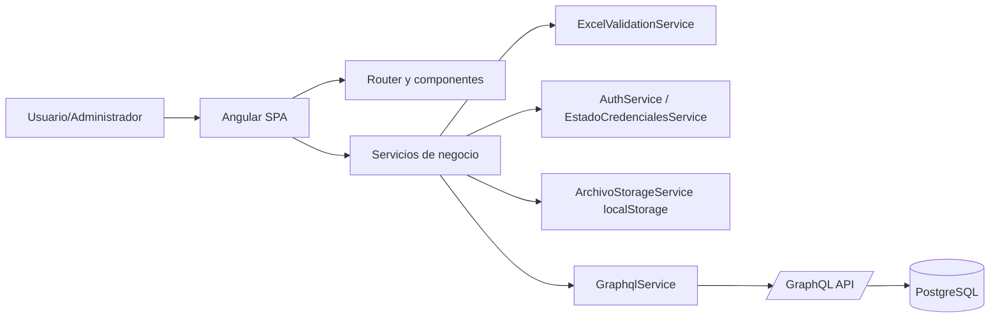
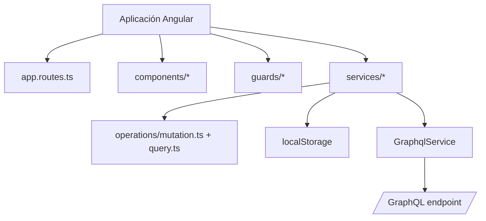
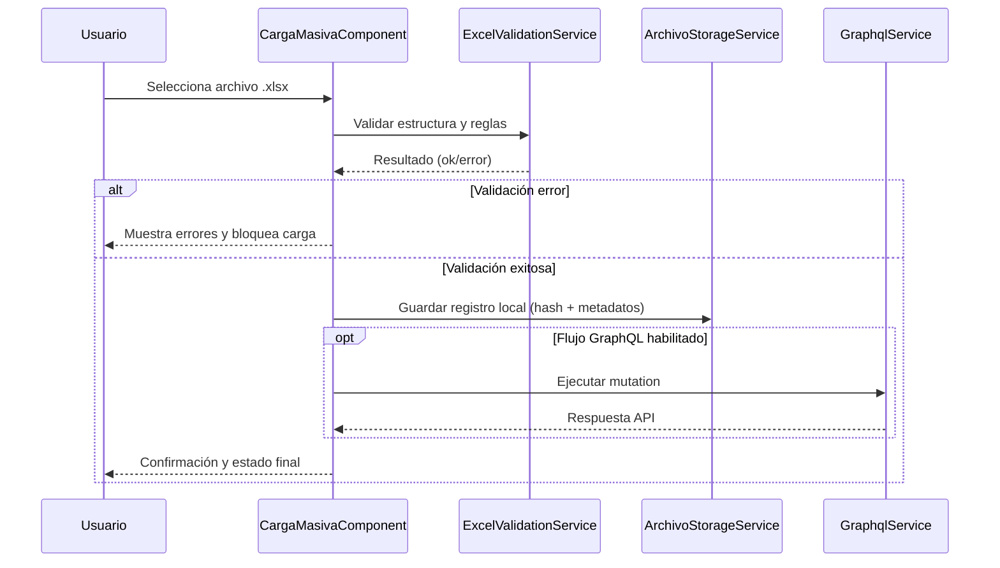
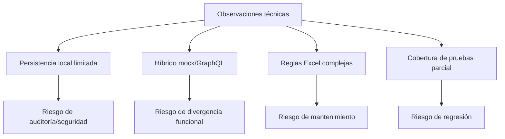
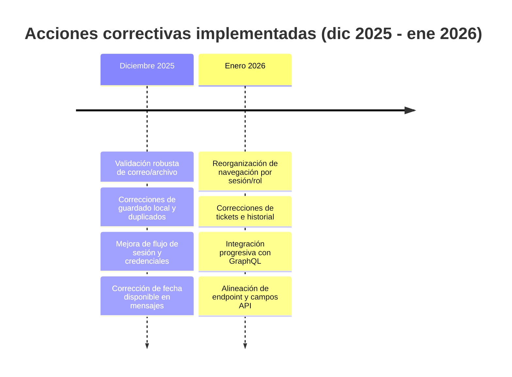
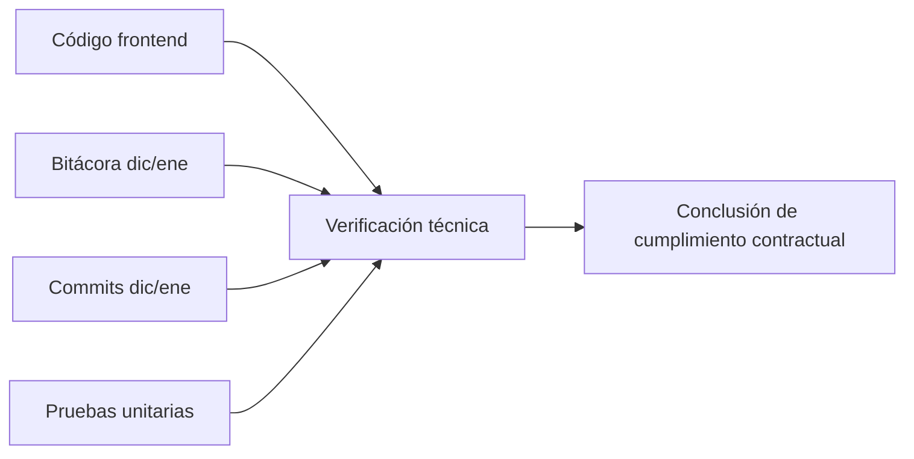

# Documento de estándares y criterios técnicos de desarrollo Frontend
## Periodo evaluado: diciembre 2025 – enero 2026 (excluye febrero)

## 1) Objetivo del entregable
Este documento establece y verifica los criterios técnicos, estándares de desarrollo y buenas prácticas aplicadas al Frontend del sistema EIA durante **diciembre 2025 y enero 2026**, incorporando:

- lineamientos establecidos,
- validaciones realizadas,
- observaciones técnicas,
- acciones correctivas implementadas,
- evidencia de verificación de cumplimiento.

> **Corte temporal explícito:** este entregable analiza únicamente evidencia de diciembre y enero. Cualquier trabajo de febrero queda fuera y se reserva para su informe mensual independiente.

---

## 2) Fuentes de evidencia usadas
1. Bitácora de cambios del proyecto (hitos funcionales y correctivos en dic/ene).
2. Código fuente frontend Angular (rutas, servicios, guardas, validaciones y componentes).
3. Pruebas unitarias existentes en frontend (servicios críticos y componentes clave).
4. Documentación funcional/arquitectónica ya integrada en repositorio.
5. Trazabilidad por commits de fecha diciembre-enero para verificar evolución técnica.

---

## 3) Alcance técnico evaluado
- **Arquitectura frontend SPA en Angular 19** y navegación por rutas.
- **Calidad de validación de archivos Excel** (tipo, estructura, datos mínimos y reglas de negocio).
- **Gestión de sesión/credenciales y almacenamiento local** para continuidad operativa.
- **Capa de integración API (GraphQL)** con estrategia híbrida (mock/localStorage + integración real gradual).
- **Trazabilidad y control de cambios** sobre funcionalidades frontend implementadas.

**Descripción del diagrama:** este diagrama muestra la vista integral del alcance técnico evaluado y cómo se relacionan módulos de UI, servicios de dominio, capa de integración GraphQL y persistencia temporal en navegador.

---

## 4) Lineamientos y estándares técnicos establecidos

### 4.1 Estructura y modularidad
- Separación por capas en frontend: `components/`, `services/`, `guards/`, `operations/`.
- Enfoque de responsabilidad única por servicio (autenticación, validación, almacenamiento, GraphQL, usuarios, evaluaciones).
- Enrutamiento centralizado y explícito para módulos funcionales de usuario y administración.

### 4.2 Calidad de código y tipado
- Uso de **TypeScript tipado** con interfaces de dominio (respuestas GraphQL, entradas de carga, estado de credenciales, registros de archivo).
- Normalización de datos de entrada sensibles a reglas de negocio (correo/cct) antes de persistir o comparar.
- Manejo de errores de negocio con mensajes claros al usuario y control de flujo en servicios/componentes.

### 4.3 Validación funcional y de datos
- Validación previa obligatoria de correo antes de aceptar cargas.
- Validación de tipo de archivo (`.xlsx`) y tamaño máximo permitido.
- Validación estructural de plantillas por nivel educativo en servicio centralizado.
- Prevención de duplicados con huella SHA-256 y opción de reemplazo controlado.

### 4.4 Seguridad y control de acceso
- Regla de continuidad: si ya existen credenciales, se exige login para nuevas cargas.
- Persistencia controlada de estado de sesión y correo asociado en localStorage.
- Separación de acceso usuario/admin por rutas y componentes de autenticación diferenciados.

### 4.5 Integración API y portabilidad de ambientes
- Cliente GraphQL encapsulado en un servicio único (`GraphqlService`).
- Resolución de endpoint por ambiente (variable inyectada, modo dev localhost o ruta relativa en despliegue).
- Servicios de dominio (`UsuariosService`, `EvaluacionesService`) aislando queries/mutations del resto de componentes.

### 4.6 Trazabilidad y evidencia técnica
- Registro cronológico de cambios en bitácora.
- Evidencia por commits con mensajes que documentan correcciones/ajustes.
- Evidencia verificable por pruebas unitarias en funcionalidades críticas.

**Descripción del diagrama:** este mapa de componentes resume el estándar de organización que se siguió en frontend para mantener trazabilidad y separación de responsabilidades.

---

## 5) Validaciones realizadas (dic/ene)

### 5.1 Validaciones de entrada y negocio en carga
- Correo requerido y con formato válido antes de procesar archivos.
- Rechazo de extensiones no permitidas y archivos excedidos de tamaño.
- Checklist de consistencia de plantilla y campos obligatorios por nivel.
- Mensajería de estado de validación (validando, error, éxito) para trazabilidad operativa.

### 5.2 Validaciones de persistencia local
- Guardado de archivos en localStorage con metadatos (correo, CCT, nivel, hash, fecha).
- Rechazo de duplicado exacto por hash + CCT en mismo correo.
- Reemplazo explícito de duplicado sólo cuando se activa bandera de reemplazo.
- Conservación de clave estable de registro para trazabilidad de elementos guardados.

### 5.3 Validaciones de sesión/autenticación
- Verificación de credenciales previas antes de permitir nueva carga.
- Inicio/cierre de sesión y sincronización de estado de sesión en UI.
- Validación de coincidencia entre correo en sesión y credenciales persistidas.

### 5.4 Validaciones de integración GraphQL
- Validación de respuesta GraphQL con control de errores (`errors[]`) y datos faltantes.
- Reglas explícitas de error en creación/autenticación de usuario y carga de Excel.
- Estrategia de fallback operativo local mientras se consolidan flujos API.

**Descripción del diagrama:** esta secuencia representa el flujo de validación/carga, incluyendo decisiones de bloqueo por errores, persistencia local y uso de GraphQL en flujos habilitados.

---

## 6) Observaciones técnicas identificadas

1. **Dependencia operativa en localStorage durante diciembre**: adecuada para continuidad temprana, pero con límites de persistencia, seguridad y auditoría de largo plazo.
2. **Convivencia híbrida mock + GraphQL en enero**: correcta para transición incremental, aunque exige disciplina para evitar divergencias de comportamiento entre ambos flujos.
3. **Fuerte concentración de reglas en validación Excel**: técnicamente útil para centralizar reglas, pero requiere mantenimiento riguroso por volumen de variantes por nivel/grado.
4. **Buenas prácticas de UX técnica presentes**: alertas de estado, mensajes de error/sugerencia y bloqueo preventivo de acciones inválidas.
5. **Necesidad de ampliar automatización de pruebas**: ya existen tests relevantes, pero el crecimiento funcional sugiere ampliar cobertura (especialmente autenticación/integración).

**Descripción del diagrama:** este diagrama de decisión sintetiza las observaciones técnicas y su impacto operativo para priorizar acciones de mejora.

---

## 7) Acciones correctivas implementadas (evidencia dic/ene)

### 7.1 Diciembre
- Ajustes para robustecer validación y captura de correo previo a carga.
- Correcciones de consistencia en guardado local y prevención de duplicados.
- Mejora de mensajes/flujo de sesión y control de credenciales en primera carga.
- Corrección de cálculo y uso de fecha disponible en mensajes de éxito.

### 7.2 Enero
- Reorganización de navegación (submenús y visibilidad condicional por sesión/rol).
- Correcciones sucesivas al flujo de tickets, historial y persistencia local asociada.
- Integración progresiva GraphQL para autenticación y creación de usuario.
- Alineación de campos y endpoint GraphQL para compatibilidad con backend/DB.

**Descripción del diagrama:** el timeline organiza las acciones correctivas por mes para evidenciar continuidad técnica y trazabilidad del trabajo realizado.

---

## 8) Evidencia de verificación de cumplimiento

### 8.1 Cumplimiento de estándares de arquitectura frontend
- Se verifica separación por módulos/rutas/servicios y configuración central de providers.
- Se verifica existencia de rutas funcionales para módulos comprometidos (inicio, carga, login, descargas, tickets, admin).

### 8.2 Cumplimiento de validaciones técnicas
- Servicio de validación Excel centralizado con reglas por nivel y catálogos de encabezados/columnas esperadas.
- Servicio de almacenamiento con hash SHA-256 y política de duplicados.
- Servicio de autenticación con reglas de normalización y control de sesión.

### 8.3 Cumplimiento de trazabilidad
- Bitácora con hitos de diciembre y enero que documentan acciones y correcciones.
- Historial de commits de enero con mensajes de integración/corrección alineados al avance funcional.

### 8.4 Cumplimiento de verificación por pruebas
- Existen pruebas unitarias enfocadas en: detección de duplicados/reemplazo (`ArchivoStorageService`) y creación de componentes clave.
- La existencia de pruebas demuestra práctica de verificación técnica en funcionalidades críticas del frontend.

**Descripción del diagrama:** este flujo de verificación muestra cómo se consolidó la evidencia de cumplimiento desde código, bitácora, historial de commits y pruebas.

---

## 9) Sugerencias de capturas de pantalla (si deseas reforzar evidencia visual)
Sí aplica incluir capturas porque el entregable es técnico y de cumplimiento; las imágenes ayudan a demostrar que los estándares se reflejan en la interfaz y en el flujo operativo real.

Recomendación de capturas mínimas:
1. **Pantalla de Carga Masiva** mostrando correo, zona de carga y reglas visibles.
2. **Estado de validación con errores** (evidencia de validaciones y mensajes de control).
3. **Estado de validación exitosa + botón de carga** (evidencia de flujo correcto).
4. **Pantalla de login usuario** (evidencia de control de acceso).
5. **Vista con sesión iniciada y submenú de usuario** (evidencia de navegación condicionada).
6. **Módulo de tickets/historial** (evidencia de trazabilidad funcional de soporte).
7. **Vista admin login/admin panel** (evidencia de separación de rol administrativo).

Sugerencia de formato para anexarlas en el informe:
- Captura + breve pie de figura: *“Qué estándar valida / qué evidencia aporta”*.

---

## 10) Matriz de cumplimiento del entregable contractual

| Requisito del entregable | Evidencia del proyecto (dic/ene) | Estado |
|---|---|---|
| Lineamientos establecidos | Estructura por capas, tipado, validación y seguridad de sesión en frontend | Cumple |
| Validaciones realizadas | Reglas de correo/archivo/plantilla/hash/sesión/integración GraphQL | Cumple |
| Observaciones técnicas | Identificación de límites localStorage y complejidad de esquema híbrido | Cumple |
| Acciones correctivas implementadas | Correcciones de flujo, navegación, tickets, credenciales e integración GraphQL | Cumple |
| Evidencia de verificación de cumplimiento | Bitácora, commits, código y pruebas unitarias en repositorio | Cumple |

---

## 11) Criterios de aceptación para auditoría interna
Para considerar conforme este entregable en futuras revisiones mensuales:

1. Mantener corte temporal explícito por mes evaluado.
2. Adjuntar evidencia reproducible (bitácora + commits + rutas de código + pruebas).
3. Reportar desviaciones técnicas y acción correctiva asociada.
4. Mantener consistencia entre reglas de frontend y contratos de API.
5. Actualizar matriz de cumplimiento con estatus verificable.

---

## 12) Conclusión ejecutiva
Con base en la evidencia revisada del repositorio, **sí existe un marco técnico de desarrollo frontend aplicado y verificable para diciembre-enero**, con lineamientos claros, validaciones operativas, acciones correctivas documentadas y trazabilidad suficiente para sustentar el cumplimiento contractual del entregable solicitado.

> **Nota final de alcance:** este documento excluye deliberadamente avances de febrero para no mezclar periodos de reporte.
