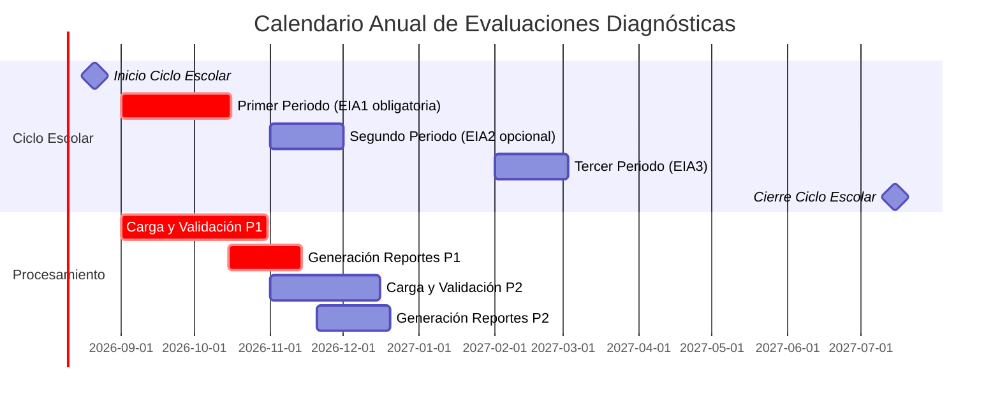
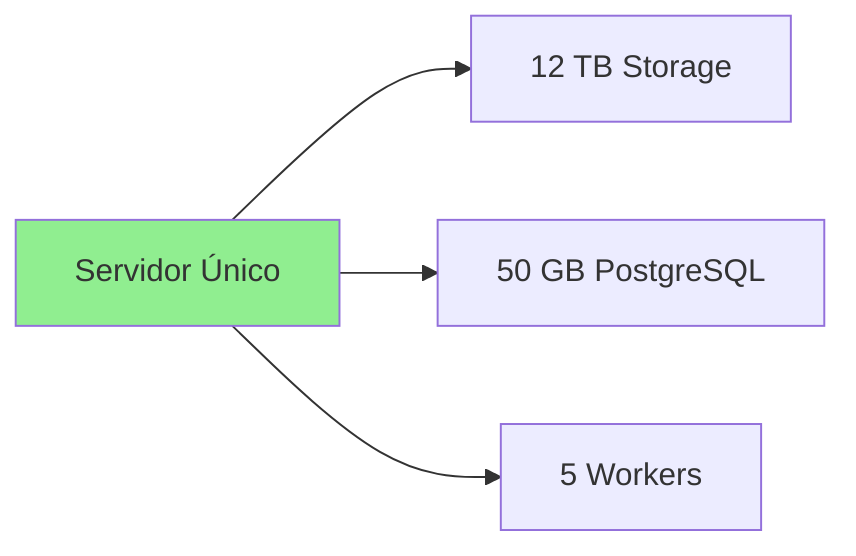
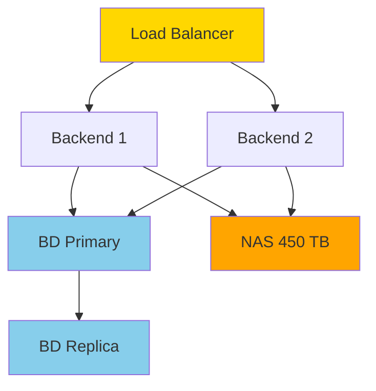
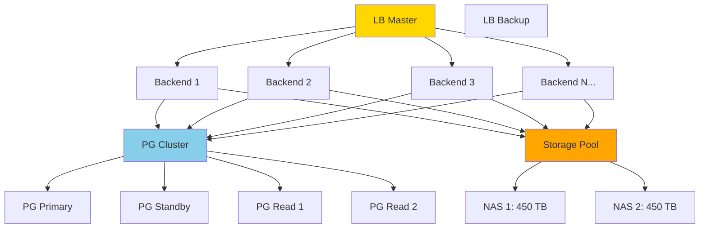
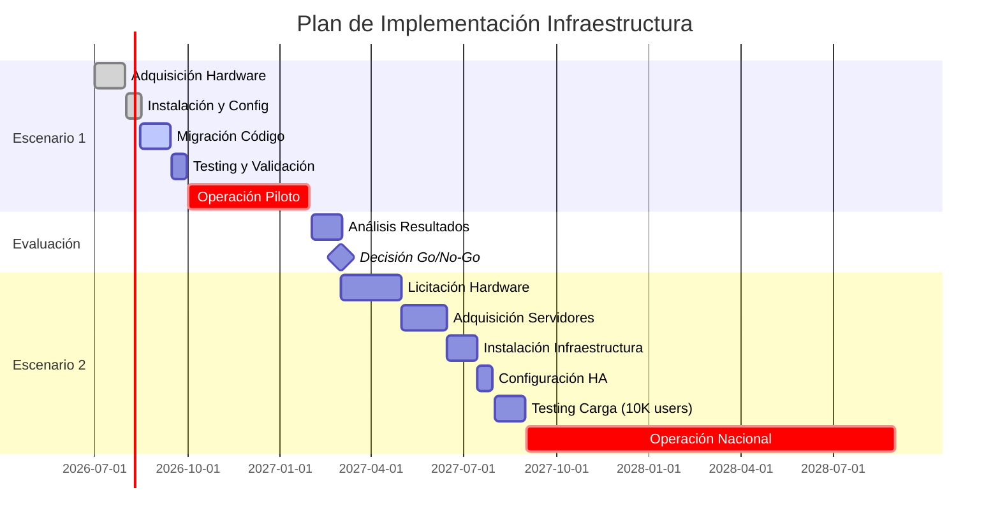

# ESTIMACIÓN DE INFRAESTRUCTURA Y VOLUMETRÍA
## Sistema de Evaluación Diagnóstica SEP - Análisis de Capacidad

**Fecha de Elaboración:** 20 de enero de 2026  
**Autor:** Ingeniero de Software Certificado PSP  
**Versión:** 1.0  
**Propósito:** Dimensionamiento de infraestructura para operación nacional

---

## 📋 ÍNDICE

1. [Contexto y Datos Base](#1-contexto-y-datos-base)
2. [Análisis de Tamaños de Archivos](#2-análisis-de-tamaños-de-archivos)
3. [Escenario 1: Progresista (3 Estados/Mes)](#3-escenario-1-progresista-3-estadosmes)
4. [Escenario 2: Evaluación Completa Nacional](#4-escenario-2-evaluación-completa-nacional)
5. [Estimación de Base de Datos PostgreSQL](#5-estimación-de-base-de-datos-postgresql)
6. [Recomendaciones de Infraestructura](#6-recomendaciones-de-infraestructura)
7. [Plan de Crecimiento y Escalabilidad](#7-plan-de-crecimiento-y-escalabilidad)

---

## 1. CONTEXTO Y DATOS BASE

### 1.1 Universo de Operación

| Concepto | Valor | Fuente |
|----------|-------|--------|
| **Total CCTs en México** | ~230,000 escuelas | Estadísticas SEP 2024-2025 |
| **Solicitudes ejercicio pasado** | 120,000 escuelas | Histórico ciclo 2024-2025 |
| **Tasa de participación histórica** | 52.2% (120K/230K) | Calculado |
| **Cobertura muestra obligatoria** | 100% completado | Reporte SEP |
| **Participación opcional** | Buen porcentaje adicional | Estimado |
| **Entidades federativas** | 32 estados | Nacional |

### 1.2 Distribución Geográfica Estimada

**Promedio por estado:** 230,000 / 32 = **7,188 escuelas/estado**

**Estados más poblados (arriba del promedio):**
- Estado de México: ~25,000 escuelas (10.9%)
- Ciudad de México: ~15,000 escuelas (6.5%)
- Jalisco: ~12,000 escuelas (5.2%)
- Veracruz: ~12,000 escuelas (5.2%)
- Puebla: ~10,000 escuelas (4.3%)

**Estados con menor densidad (debajo del promedio):**
- Baja California Sur: ~2,500 escuelas
- Colima: ~2,800 escuelas
- Campeche: ~3,200 escuelas

### 1.3 Periodos de Evaluación

**Calendario Operativo Típico:**



**Segunda Evaluación EIA2 (Opcional - Este Año):**
- **Periodo:** Noviembre - Diciembre 2026
- **Modalidad:** Participación voluntaria
- **Estrategia:** Piloto progresivo por estados

**Primera Evaluación EIA1 (Obligatoria - Próximo Ciclo):**
- **Periodo:** Septiembre - Octubre 2027
- **Modalidad:** Muestra obligatoria 100%
- **Cobertura:** Nacional completa

---

## 2. ANÁLISIS DE TAMAÑOS DE ARCHIVOS

### 2.1 Archivos de Entrada (Formatos de Valoración Excel)

**Datos reales del sistema actual:**

| Nivel Educativo | Archivo | Tamaño Real | Registros Promedio |
|-----------------|---------|-------------|---------------------|
| **Preescolar** | `2025_EIA_FormatoValoraciones_Preescolar.xlsx` | **51.1 KB** | 30-50 alumnos |
| **Primaria** | `2025_EIA_FormatoValoraciones_Primaria.xlsx` | **222.49 KB** | 180-300 alumnos (6 grados) |
| **Secundaria Técnica/General** | `2025_EIA_FormatoValoraciones_Secundarias_Tecnicas_Generales.xlsx` | **85.23 KB** | 90-150 alumnos (3 grados) |
| **Telesecundaria** | `2025_EIA_FormatoValoraciones_Secundarias_Telesecundarias.xlsx` | **85.77 KB** | 60-90 alumnos |

**Promedio ponderado por tipo de escuela:**

Considerando distribución aproximada:
- 40% Preescolar: 51.1 KB
- 45% Primaria: 222.49 KB
- 15% Secundaria: 85.5 KB (promedio)

**Tamaño promedio ponderado FRV por escuela:**  
= (0.40 × 51.1) + (0.45 × 222.49) + (0.15 × 85.5)  
= 20.44 + 100.12 + 12.83  
= **133.4 KB/escuela**

**Considerando compresión durante almacenamiento (ZIP/7z ~60% compresión):**
= 133.4 KB × 0.40 = **~53 KB/escuela comprimido**

### 2.2 Archivos de Salida (Reportes PDF)

**Análisis CORREGIDO basado en documentación del sistema:**

Según RF-05 y la volumetría real del sistema, **cada archivo FRV recibido genera entre 5 y 30 reportes PDF** (NO un PDF por estudiante):

| Tipo de Reporte | Tamaño Real | Cantidad por Escuela | Notas |
|-----------------|-------------|----------------------|-------|
| **Reportes por Campo Formativo (Escuela)** | ~640 KB | 4 archivos | ENS, HYC, LEN, SPC |
| **Reportes por Grupo (F5)** | ~2.6 MB | Variable según nivel | Consolidado de todos los estudiantes del grupo |

**Volumetría REAL según nivel educativo:**

| Nivel Educativo | Reportes Generados | Cálculo | **Total Real** |
|-----------------|---------------------|---------|----------------|
| **Preescolar (3 grados)** | 4 campos + 3 grupos × 1 = 7 PDFs | (4 × 0.64 MB) + (3 × 2.6 MB) | **~10.4 MB** |
| **Primaria (6 grados)** | 4 campos + 6 grados × 5 grupos = 34 PDFs | (4 × 0.64 MB) + (30 × 2.6 MB) | **~80.6 MB** |
| **Secundaria (3 grados)** | 4 campos + 3 grados × 5 grupos = 19 PDFs | (4 × 0.64 MB) + (15 × 2.6 MB) | **~41.6 MB** |

**Promedio ponderado PDF por escuela (CORRECTO):**  
= (0.40 × 10.4 MB) + (0.45 × 80.6 MB) + (0.15 × 41.6 MB)  
= 4.16 + 36.27 + 6.24  
= **46.67 MB/escuela**

**Considerando compresión ZIP (10-15% adicional en PDFs):**
= 46.67 MB × 0.90 = **~42 MB/escuela comprimido**

**Ejemplo real del sistema:**
- Escuela primaria 24PPR0356K tiene **8 PDFs = 4.29 MB total** (archivo de ejemplo disponible)
- Esto valida el rango de 40-50 MB para escuelas con 6 grupos promedio

### 2.3 Archivos DBF (Base de Datos dBase)

**Tamaños reales de archivos DBF de muestra:**

| Archivo | Nivel/Grado | Tamaño Real | Registros Estimados |
|---------|-------------|-------------|---------------------|
| `pre3.dbf` | Preescolar 3° | **47.61 KB** | ~50 alumnos |
| `pri1.dbf` | Primaria 1° | **45.43 KB** | ~30 alumnos |
| `pri2.dbf` | Primaria 2° | **45.43 KB** | ~30 alumnos |
| `pri3.dbf` | Primaria 3° | **61.56 KB** | ~40 alumnos |
| `pri4.dbf` | Primaria 4° | **61.36 KB** | ~40 alumnos |
| `pri5.dbf` | Primaria 5° | **60.36 KB** | ~40 alumnos |
| `pri6.dbf` | Primaria 6° | **60.55 KB** | ~40 alumnos |
| `sec1.dbf` | Secundaria 1° | **55.84 KB** | ~40 alumnos |
| `sec2.dbf` | Secundaria 2° | **55.84 KB** | ~40 alumnos |
| `sec3.dbf` | Secundaria 3° | **54.83 KB** | ~40 alumnos |

**Promedio DBF:** ~54.9 KB/archivo  
**Archivos por escuela:** 1-10 según nivel  
**Total DBF por escuela:** ~55 KB × 6 (promedio) = **~330 KB/escuela**

### 2.4 Resumen de Volumetría por Escuela

| Tipo de Archivo | Sin Comprimir | Comprimido | Notas |
|-----------------|---------------|------------|-------|
| **FRV Excel (entrada)** | 133.4 KB | 53 KB | Formato de valoración |
| **DBF (salida)** | 330 KB | 200 KB | Archivos de resultados |
| **PDF (salida)** | 46.67 MB | 42 MB | 5-34 reportes según nivel |
| **Metadata/logs** | 50 KB | 20 KB | JSON, logs del sistema |
| **TOTAL POR ESCUELA** | **~47 MB** | **~42.3 MB** | Por periodo/evaluación |

---

## 3. ESCENARIO 1: PROGRESISTA (3 ESTADOS/MES)

### 3.1 Parámetros del Escenario

**Contexto:**
- Segunda evaluación EIA2 opcional (este año 2026)
- Estrategia de piloto gradual
- 3 estados por mes durante 4 meses
- Noviembre 2026 - Febrero 2027

**Selección sugerida de estados piloto:**

| Mes | Estados Piloto | Escuelas Est. | Justificación |
|-----|----------------|---------------|---------------|
| **Mes 1 (Nov)** | Aguascalientes, Colima, Tlaxcala | ~15,000 | Estados pequeños, alta conectividad |
| **Mes 2 (Dic)** | Querétaro, BCS, Campeche | ~18,000 | Capacidad tecnológica media |
| **Mes 3 (Ene)** | Morelos, Nayarit, Durango | ~22,000 | Diversidad geográfica |
| **Mes 4 (Feb)** | Hidalgo, Zacatecas, Sinaloa | ~25,000 | Estados más grandes del piloto |
| **TOTAL** | **12 estados** | **~80,000** | 34.8% del universo nacional |

### 3.2 Tasa de Participación Esperada

**Considerando evaluación opcional:**
- Participación obligatoria: 0% (es opcional)
- Participación voluntaria estimada: **40% de escuelas**
- Escuelas participantes: 80,000 × 0.40 = **32,000 escuelas**

**Distribución temporal:**

| Mes | Estados | Escuelas Totales | Part. 40% | Carga/Día (30 días) |
|-----|---------|------------------|-----------|---------------------|
| Nov 2026 | 3 estados | 15,000 | 6,000 | 200 escuelas/día |
| Dic 2026 | 3 estados | 18,000 | 7,200 | 240 escuelas/día |
| Ene 2027 | 3 estados | 22,000 | 8,800 | 293 escuelas/día |
| Feb 2027 | 3 estados | 25,000 | 10,000 | 333 escuelas/día |
| **TOTAL** | **12 estados** | **80,000** | **32,000** | **Promedio: 267/día** |

### 3.3 Volumetría de Almacenamiento

#### A. Almacenamiento de Archivos (Filesystem)

**Por mes (ejemplo Mes 1: 6,000 escuelas):**

| Tipo | Por Escuela | 6,000 Escuelas | Con 20% Margen |
|------|-------------|----------------|----------------|
| **FRV Excel** | 53 KB | 318 MB | 382 MB |
| **DBF** | 200 KB | 1.2 GB | 1.44 GB |
| **PDF** | 42 MB | 252 GB | **302 GB** |
| **Metadata** | 20 KB | 120 MB | 144 MB |
| **Subtotal Mes 1** | 42.27 MB | **254 GB** | **~305 GB** |

**Acumulado 4 meses (32,000 escuelas totales):**

| Componente | Cálculo | Total Comprimido | Sin Comprimir |
|------------|---------|------------------|---------------|
| FRV Excel entrada | 32,000 × 53 KB | 1.66 GB | 4.17 GB |
| DBF salida | 32,000 × 200 KB | 6.25 GB | 10.3 GB |
| PDF reportes | 32,000 × 42 MB | **1.31 TB** | 1.46 TB |
| Metadata/logs | 32,000 × 20 KB | 625 MB | 1.56 GB |
| **TOTAL PILOTO** | - | **~1.32 TB** | **~1.48 TB** |

**Con margen de seguridad 30%:**
= 1.32 TB × 1.30 = **~1.7 TB necesarios**

#### B. Base de Datos PostgreSQL

**Registros estimados para 32,000 escuelas:**

| Tabla | Registros/Escuela | Total 32K | Tamaño Estimado |
|-------|-------------------|-----------|-----------------|
| **ESCUELAS** | 1 | 32,000 | 6.4 MB |
| **USUARIOS** (directores) | 1 | 32,000 | 4.8 MB |
| **GRUPOS** | 6 promedio | 192,000 | 38 MB |
| **ESTUDIANTES** | 100 promedio | 3,200,000 | 800 MB |
| **SOLICITUDES** | 1 | 32,000 | 8 MB |
| **ARCHIVOS_FRV** | 1 | 32,000 | 12 MB |
| **EVALUACIONES** | 100 | 3,200,000 | 650 MB |
| **VALORACIONES** | 1,200 (12/alumno) | 38,400,000 | **7.5 GB** |
| **RESULTADOS_COMPETENCIAS** | 2,000 (20/alumno) | 64,000,000 | 12.8 GB |
| **REPORTES_GENERADOS** | 10 | 320,000 | 96 MB |
| **LOG_ACTIVIDADES** | 50 | 1,600,000 | 480 MB |
| **Índices (30% adicional)** | - | - | 6.9 GB |
| **TOTAL BD** | - | - | **~29.5 GB** |

**Con crecimiento y margen 50%:**
= 29.5 GB × 1.50 = **~45 GB PostgreSQL**

### 3.4 Capacidad de Procesamiento

**Concurrencia pico estimada:**

| Métrica | Valor | Cálculo Base |
|---------|-------|--------------|
| **Escuelas/día promedio** | 267 | 32,000 escuelas / 120 días |
| **Pico máximo (mes 4)** | 333 escuelas/día | 10,000 / 30 días |
| **Carga horaria (8 hrs laborales)** | 42 escuelas/hora | 333 / 8 horas |
| **Uploads concurrentes estimados** | 10-15 simultáneos | Patrón de uso |
| **Validaciones en cola** | 50-100 | Worker asíncrono |

**Recursos de worker requeridos:**

```
Tiempo validación por FRV: 30 seg (automático)
Tiempo generación PDFs: 90 seg/escuela (30 PDFs)
Tiempo generación DBF: 15 seg/escuela

Workers necesarios para 42 escuelas/hora:
= (90 seg × 42) / 3600 seg = 1.05 workers mínimo
Con margen: 3-5 workers concurrentes
```

### 3.5 Resumen Escenario 1 (Piloto 12 Estados)

| Recurso | Cantidad Recomendada | Justificación |
|---------|----------------------|---------------|
| **Almacenamiento Filesystem** | **2 TB** | 1.32 TB datos + 30% margen |
| **Base de Datos PostgreSQL** | **50 GB** | 29.5 GB + 50% crecimiento |
| **Workers Backend** | **5 workers** | Procesamiento concurrente |
| **RAM Servidor Backend** | **16 GB** | Node.js + cache + workers |
| **vCPUs Backend** | **8 cores** | FastAPI + workers paralelos |
| **RAM Servidor BD** | **8 GB** | PostgreSQL + cache + conexiones |
| **vCPUs Servidor BD** | **4 cores** | Queries concurrentes |
| **Ancho de banda** | **1 Gbps** | 267 uploads/día × 133 KB |

---

## 4. ESCENARIO 2: EVALUACIÓN COMPLETA NACIONAL

### 4.1 Parámetros del Escenario

**Contexto:**
- Primera evaluación EIA1 obligatoria (próximo ciclo 2027-2028)
- Cobertura nacional completa: 32 estados
- 1 mes de operación intensiva (Septiembre 2027)
- Muestra 100% obligatoria

**Tasa de participación esperada:**
- Basada en histórico: **120,000 escuelas participantes**
- Representa: 52.2% del universo (120K/230K)
- Margen de crecimiento: hasta 150,000 escuelas

### 4.2 Distribución Temporal

**Concentración en 1 mes (30 días hábiles):**

| Semana | Escuelas Objetivo | Escuelas/Día | Uploads/Hora (8h) |
|--------|-------------------|--------------|-------------------|
| **Semana 1** | 20,000 | 4,000 | 500/hora |
| **Semana 2** | 30,000 | 6,000 | 750/hora |
| **Semana 3** | 40,000 | 8,000 | 1,000/hora |
| **Semana 4** | 30,000 | 6,000 | 750/hora |
| **TOTAL** | **120,000** | **Prom: 4,000** | **Prom: 500/hora** |

**Pico crítico:**
- **Día pico:** 8,000 escuelas
- **Hora pico:** 1,000 escuelas/hora (~ 17 uploads/minuto)
- **Concurrencia estimada:** 100-200 uploads simultáneos

### 4.3 Volumetría de Almacenamiento

#### A. Almacenamiento de Archivos (Filesystem)

**Para 120,000 escuelas en un ciclo:**

| Tipo | Por Escuela | 120,000 Escuelas | Comprimido |
|------|-------------|------------------|------------|
| **FRV Excel** | 133.4 KB | 15.6 GB | 6.2 GB |
| **DBF** | 330 KB | 38.7 GB | 23.4 GB |
| **PDF** | 46.67 MB | **5.48 TB** | **4.93 TB** |
| **Metadata** | 50 KB | 5.9 GB | 2.3 GB |
| **TOTAL** | 47 MB | **5.54 TB** | **~4.96 TB** |

**Por periodo de evaluación (3 periodos/año):**
= 4.96 TB × 3 = **14.88 TB/año**

**Con margen de seguridad 30%:**
= 14.88 TB × 1.30 = **~20 TB/año necesarios**

**Retención histórica (3 años):**
= 20 TB × 3 = **~60 TB totales** (incluyendo 3 ciclos escolares)

#### B. Base de Datos PostgreSQL

**Registros estimados para 120,000 escuelas:**

| Tabla | Por Escuela | Total | Tamaño Unitario | Total |
|-------|-------------|-------|-----------------|-------|
| **ESCUELAS** | 1 | 120,000 | 200 bytes | 24 MB |
| **USUARIOS** | 2 (dir+docente) | 240,000 | 150 bytes | 36 MB |
| **GRUPOS** | 6 | 720,000 | 200 bytes | 144 MB |
| **ESTUDIANTES** | 100 | 12,000,000 | 250 bytes | 3.0 GB |
| **SOLICITUDES** | 3/año | 360,000 | 250 bytes | 90 MB |
| **ARCHIVOS_FRV** | 3/año | 360,000 | 400 bytes | 144 MB |
| **EVALUACIONES** | 300/año | 36,000,000 | 200 bytes | 7.2 GB |
| **VALORACIONES** | 3,600/año | 432,000,000 | 180 bytes | **77.8 GB** |
| **RESULTADOS_COMPETENCIAS** | 6,000/año | 720,000,000 | 200 bytes | 144 GB |
| **REPORTES_GENERADOS** | 30 | 3,600,000 | 300 bytes | 1.08 GB |
| **LOG_ACTIVIDADES** | 150/año | 18,000,000 | 300 bytes | 5.4 GB |
| **Catálogos/auxiliares** | - | ~500,000 | - | 500 MB |

**Subtotal datos:**
= 24 + 36 + 144 MB + 3.0 + 0.09 + 0.144 + 7.2 + 77.8 + 144 + 1.08 + 5.4 + 0.5 GB  
= **~239 GB**

**Índices (estimado 40% adicional):**
= 239 GB × 0.40 = **95.6 GB**

**Total BD primer año:**
= 239 + 95.6 = **~335 GB**

**Proyección 3 años (con crecimiento 10%/año):**

| Año | Datos | Índices | Total | Acumulado |
|-----|-------|---------|-------|-----------|
| Año 1 | 239 GB | 96 GB | 335 GB | 335 GB |
| Año 2 | 263 GB | 105 GB | 368 GB | 703 GB |
| Año 3 | 289 GB | 116 GB | 405 GB | **1.1 TB** |

**Con margen 50% para temp tables, backups, WAL:**
= 1.1 TB × 1.50 = **~1.65 TB PostgreSQL**

### 4.4 Capacidad de Procesamiento

**Requisitos de concurrencia pico:**

| Métrica | Cálculo | Resultado |
|---------|---------|-----------|
| **Uploads simultáneos** | 1,000 escuelas/hora ÷ 60 min | **~17/min** |
| **Pico absoluto (burst)** | 3× promedio | **~50 simultáneos** |
| **Validaciones en cola** | Asíncrono, buffer | **500-1,000 pendientes** |
| **Generación PDFs concurrente** | 8,000 escuelas/día | **333/hora** |
| **Generación DBF concurrente** | Batch nocturno | **100/hora** |

**Workers requeridos:**

```
Validación FRV:
- Tiempo: 30 seg/archivo
- Carga: 17 uploads/min = 1,020/hora
- Workers: (30 seg × 1,020) / 3,600 = 8.5 → 12 workers

Generación PDFs:
- Tiempo: 90 seg/escuela
- Carga: 333 escuelas/hora
- Workers: (90 × 333) / 3,600 = 8.3 → 12 workers

Generación DBF:
- Tiempo: 15 seg/escuela
- Carga: 100 escuelas/hora (batch)
- Workers: (15 × 100) / 3,600 = 0.4 → 2 workers

TOTAL: 26 workers concurrentes en hora pico
```

**Recursos de servidor backend:**

```
RAM por worker: 512 MB
RAM total workers: 26 × 0.5 GB = 13 GB
RAM FastAPI/Node: 4 GB
RAM cache (Redis/node-cache): 8 GB
Buffer/OS: 3 GB
─────────────────────────────
TOTAL RAM BACKEND: ~28 GB → 32 GB recomendado

CPU por worker: 0.5 cores (I/O bound)
CPU total workers: 26 × 0.5 = 13 cores
CPU FastAPI: 2 cores
Buffer: 3 cores
─────────────────────────────
TOTAL CPU BACKEND: ~18 cores → 24 cores recomendado
```

**Recursos de servidor base de datos:**

```
Conexiones concurrentes:
- Workers: 26 conexiones
- API requests: 50 conexiones simultáneas
- Admin/monitoring: 10 conexiones
TOTAL: ~90 conexiones → configurar max_connections=200

RAM PostgreSQL:
- shared_buffers: 8 GB (25% de RAM)
- effective_cache_size: 24 GB (75% de RAM)
- work_mem: 64 MB × 200 conn = 12.8 GB máximo
- maintenance_work_mem: 2 GB
- OS cache: 4 GB
─────────────────────────────
TOTAL RAM BD: ~32 GB recomendado

CPU PostgreSQL:
- max_worker_processes: 8
- max_parallel_workers: 8
- max_parallel_workers_per_gather: 4
─────────────────────────────
TOTAL CPU BD: 12-16 cores recomendado
```

**Ancho de banda:**

```
Upload promedio:
- 1,000 uploads/hora × 133.4 KB = 133.4 MB/hora
- 133.4 MB/hora ÷ 3,600 seg = 37 KB/seg = 296 Kbps

Download promedio (reportes):
- 500 descargas/hora × 282 MB = 141 GB/hora
- 141 GB/hora ÷ 3,600 = 39.2 MB/seg = 314 Mbps

Pico 3× promedio: ~1 Gbps
Recomendado: 10 Gbps con CDN/cache
```

### 4.5 Resumen Escenario 2 (Nacional Completo)

| Recurso | Cantidad Recomendada | Justificación |
|---------|----------------------|---------------|
| **Almacenamiento Filesystem** | **25 TB** | 20 TB/año + 25% buffer |
| **Almacenamiento Histórico (3 años)** | **75 TB** | 25 TB × 3 ciclos |
| **Base de Datos PostgreSQL** | **2 TB** | 1.65 TB + margen |
| **Workers Backend** | **30 workers** | 26 pico + 15% margen |
| **RAM Servidor Backend** | **32 GB** | 28 GB calculado + buffer |
| **vCPUs Backend** | **24 cores** | Procesamiento paralelo |
| **RAM Servidor BD** | **32 GB** | shared_buffers + cache |
| **vCPUs Servidor BD** | **16 cores** | Queries paralelas |
| **Almacenamiento SSD BD** | **3 TB** | 2 TB BD + 1 TB WAL/temp |
| **Ancho de banda** | **10 Gbps** | Picos de descarga |
| **CDN/Cache** | **1 TB cache** | PDFs frecuentes |

---

## 5. ESTIMACIÓN DE BASE DE DATOS POSTGRESQL

### 5.1 Detalle de Tablas por Escenario

#### Escenario 1 (32,000 escuelas)

```sql
-- Esquema de tamaños estimados
SELECT 
    'ESCUELAS' as tabla,
    32000 as registros,
    200 as bytes_por_registro,
    32000 * 200 / 1024 / 1024 as mb_estimado
UNION ALL SELECT 'GRUPOS', 192000, 200, 192000 * 200 / 1024 / 1024
UNION ALL SELECT 'ESTUDIANTES', 3200000, 250, 3200000 * 250 / 1024 / 1024
UNION ALL SELECT 'EVALUACIONES', 3200000, 200, 3200000 * 200 / 1024 / 1024
UNION ALL SELECT 'VALORACIONES', 38400000, 180, 38400000 * 180 / 1024 / 1024
UNION ALL SELECT 'RESULTADOS_COMPETENCIAS', 64000000, 200, 64000000 * 200 / 1024 / 1024;
```

| Tabla | Registros | Bytes/Reg | MB | GB |
|-------|-----------|-----------|----|----|
| ESCUELAS | 32,000 | 200 | 6.1 | 0.006 |
| USUARIOS | 32,000 | 150 | 4.6 | 0.005 |
| GRUPOS | 192,000 | 200 | 36.6 | 0.036 |
| ESTUDIANTES | 3,200,000 | 250 | 762.9 | 0.76 |
| SOLICITUDES | 32,000 | 250 | 7.6 | 0.008 |
| ARCHIVOS_FRV | 32,000 | 400 | 12.2 | 0.012 |
| EVALUACIONES | 3,200,000 | 200 | 610.4 | 0.61 |
| VALORACIONES | 38,400,000 | 180 | 6,591.8 | **6.6** |
| RESULTADOS_COMPETENCIAS | 64,000,000 | 200 | 12,207.0 | **12.2** |
| REPORTES_GENERADOS | 320,000 | 300 | 91.6 | 0.09 |
| LOG_ACTIVIDADES | 1,600,000 | 300 | 457.8 | 0.46 |
| **TOTAL DATOS** | - | - | **20,788 MB** | **~20.3 GB** |
| **Índices (30%)** | - | - | 6,236 MB | **6.1 GB** |
| **WAL/Temp (20%)** | - | - | 4,158 MB | **4.1 GB** |
| **TOTAL BD** | - | - | - | **~30.5 GB** |

#### Escenario 2 (120,000 escuelas)

| Tabla | Registros | MB | GB |
|-------|-----------|----|----|
| ESCUELAS | 120,000 | 22.9 | 0.02 |
| USUARIOS | 240,000 | 34.3 | 0.03 |
| GRUPOS | 720,000 | 137.3 | 0.13 |
| ESTUDIANTES | 12,000,000 | 2,861.0 | **2.86** |
| SOLICITUDES | 360,000 | 85.8 | 0.09 |
| ARCHIVOS_FRV | 360,000 | 137.3 | 0.13 |
| EVALUACIONES | 36,000,000 | 6,866.5 | **6.87** |
| VALORACIONES | 432,000,000 | 74,172.0 | **74.2** |
| RESULTADOS_COMPETENCIAS | 720,000,000 | 137,329.0 | **137.3** |
| REPORTES_GENERADOS | 3,600,000 | 1,029.7 | **1.03** |
| LOG_ACTIVIDADES | 18,000,000 | 5,149.8 | **5.15** |
| Catálogos | ~500,000 | 476.8 | 0.48 |
| **TOTAL DATOS** | - | - | **~228 GB** |
| **Índices (40%)** | - | - | **91 GB** |
| **WAL/Temp (30%)** | - | - | **68 GB** |
| **TOTAL BD** | - | - | **~387 GB** |

### 5.2 Configuración Recomendada PostgreSQL

#### Escenario 1 (Piloto)

```ini
# postgresql.conf - Escenario 1 (32K escuelas)
# Servidor: 8 GB RAM, 4 cores

# Conexiones
max_connections = 100
shared_buffers = 2GB                # 25% RAM
effective_cache_size = 6GB          # 75% RAM
work_mem = 32MB                     # Para ordenamiento/joins
maintenance_work_mem = 512MB        # Para VACUUM, CREATE INDEX

# Paralelismo
max_worker_processes = 4
max_parallel_workers_per_gather = 2
max_parallel_workers = 4

# WAL
wal_buffers = 16MB
checkpoint_completion_target = 0.9
max_wal_size = 2GB
min_wal_size = 512MB

# Logging
log_min_duration_statement = 1000   # Log queries > 1 seg
log_line_prefix = '%t [%p]: [%l-1] user=%u,db=%d,app=%a,client=%h '

# Autovacuum
autovacuum = on
autovacuum_max_workers = 3
```

#### Escenario 2 (Nacional)

```ini
# postgresql.conf - Escenario 2 (120K escuelas)
# Servidor: 32 GB RAM, 16 cores

# Conexiones
max_connections = 200
shared_buffers = 8GB                # 25% RAM
effective_cache_size = 24GB         # 75% RAM
work_mem = 64MB                     # Más memoria para sorts complejos
maintenance_work_mem = 2GB          # VACUUM/índices más rápido

# Paralelismo
max_worker_processes = 16
max_parallel_workers_per_gather = 4
max_parallel_workers = 8
max_parallel_maintenance_workers = 4

# WAL y checkpoints
wal_buffers = 64MB
checkpoint_completion_target = 0.9
max_wal_size = 8GB
min_wal_size = 2GB
checkpoint_timeout = 15min

# Query tuning
random_page_cost = 1.1              # SSD optimizado
effective_io_concurrency = 200      # Para SSDs

# Logging y monitoring
log_min_duration_statement = 500    # Log queries > 500ms
log_autovacuum_min_duration = 0     # Log todos los autovacuums
log_checkpoints = on
log_connections = on
log_disconnections = on
log_lock_waits = on

# Autovacuum agresivo (alta carga writes)
autovacuum = on
autovacuum_max_workers = 4
autovacuum_naptime = 30s
autovacuum_vacuum_scale_factor = 0.05
autovacuum_analyze_scale_factor = 0.02
```

### 5.3 Índices Críticos para Performance

```sql
-- Índices principales para ambos escenarios

-- ESCUELAS
CREATE INDEX idx_escuelas_cct ON ESCUELAS(cct);
CREATE INDEX idx_escuelas_entidad ON ESCUELAS(entidad_id);
CREATE INDEX idx_escuelas_nivel ON ESCUELAS(nivel_educativo);

-- ESTUDIANTES (tabla grande)
CREATE INDEX idx_estudiantes_curp ON ESTUDIANTES(curp);
CREATE INDEX idx_estudiantes_escuela ON ESTUDIANTES(escuela_id);
CREATE INDEX idx_estudiantes_grupo ON ESTUDIANTES(grupo_id);
CREATE INDEX idx_estudiantes_activo ON ESTUDIANTES(activo) WHERE activo = true;

-- EVALUACIONES (tabla grande)
CREATE INDEX idx_evaluaciones_estudiante ON EVALUACIONES(estudiante_id);
CREATE INDEX idx_evaluaciones_periodo ON EVALUACIONES(periodo_id);
CREATE INDEX idx_evaluaciones_materia ON EVALUACIONES(materia_id);
CREATE INDEX idx_evaluaciones_fecha ON EVALUACIONES(fecha_evaluacion);

-- VALORACIONES (tabla más grande)
CREATE INDEX idx_valoraciones_evaluacion ON VALORACIONES(evaluacion_id);
CREATE INDEX idx_valoraciones_competencia ON VALORACIONES(competencia_id);
CREATE INDEX idx_valoraciones_nivel ON VALORACIONES(nivel_desempeno);
-- Índice compuesto para reportes
CREATE INDEX idx_valoraciones_reporte 
    ON VALORACIONES(evaluacion_id, competencia_id, nivel_desempeno);

-- RESULTADOS_COMPETENCIAS (tabla más grande)
CREATE INDEX idx_resultados_evaluacion ON RESULTADOS_COMPETENCIAS(evaluacion_id);
CREATE INDEX idx_resultados_comp_area ON RESULTADOS_COMPETENCIAS(competencia_id, area_id);
CREATE INDEX idx_resultados_puntaje ON RESULTADOS_COMPETENCIAS(puntaje_obtenido);

-- SOLICITUDES
CREATE INDEX idx_solicitudes_escuela ON SOLICITUDES(escuela_id);
CREATE INDEX idx_solicitudes_periodo ON SOLICITUDES(periodo_id);
CREATE INDEX idx_solicitudes_estado ON SOLICITUDES(estado);
CREATE INDEX idx_solicitudes_fecha ON SOLICITUDES(created_at);

-- ARCHIVOS_FRV
CREATE INDEX idx_archivos_solicitud ON ARCHIVOS_FRV(solicitud_id);
CREATE INDEX idx_archivos_estado ON ARCHIVOS_FRV(estado);
CREATE INDEX idx_archivos_hash ON ARCHIVOS_FRV(hash_sha256);

-- REPORTES_GENERADOS
CREATE INDEX idx_reportes_escuela ON REPORTES_GENERADOS(escuela_id);
CREATE INDEX idx_reportes_tipo ON REPORTES_GENERADOS(tipo_reporte);
CREATE INDEX idx_reportes_estado ON REPORTES_GENERADOS(estado);
```

### 5.4 Particionamiento para Escalabilidad (Escenario 2)

```sql
-- Particionamiento por periodo escolar para EVALUACIONES
CREATE TABLE EVALUACIONES_2027_1 PARTITION OF EVALUACIONES
    FOR VALUES FROM ('2027-01-01') TO ('2027-05-01');

CREATE TABLE EVALUACIONES_2027_2 PARTITION OF EVALUACIONES
    FOR VALUES FROM ('2027-05-01') TO ('2027-09-01');

CREATE TABLE EVALUACIONES_2027_3 PARTITION OF EVALUACIONES
    FOR VALUES FROM ('2027-09-01') TO ('2028-01-01');

-- Particionamiento por año para VALORACIONES (tabla más grande)
CREATE TABLE VALORACIONES_2027 PARTITION OF VALORACIONES
    FOR VALUES FROM ('2027-01-01') TO ('2028-01-01');

CREATE TABLE VALORACIONES_2028 PARTITION OF VALORACIONES
    FOR VALUES FROM ('2028-01-01') TO ('2029-01-01');

-- Particionamiento para LOG_ACTIVIDADES (por mes)
CREATE TABLE LOG_ACTIVIDADES_202709 PARTITION OF LOG_ACTIVIDADES
    FOR VALUES FROM ('2027-09-01') TO ('2027-10-01');

CREATE TABLE LOG_ACTIVIDADES_202710 PARTITION OF LOG_ACTIVIDADES
    FOR VALUES FROM ('2027-10-01') TO ('2027-11-01');
-- etc...
```

---

## 6. RECOMENDACIONES DE INFRAESTRUCTURA

### 6.1 Arquitectura Recomendada por Escenario

#### Opción A: Escenario 1 Piloto (32K escuelas)

**Configuración Económica - Fase Inicial**

```
┌─────────────────────────────────────────────────┐
│  SERVIDOR BACKEND + BD (TODO EN UNO)           │
│  ─────────────────────────────────────────      │
│  CPU: 12 cores (Intel Xeon o AMD EPYC)         │
│  RAM: 24 GB DDR4                                │
│  Disco Sistema: 256 GB SSD NVMe                 │
│  Disco Datos BD: 500 GB SSD NVMe (RAID 1)      │
│  Disco Archivos: 15 TB HDD (RAID 5)            │
│  Red: 1 Gbps                                    │
│  OS: Ubuntu Server 22.04 LTS                    │
│  ─────────────────────────────────────────      │
│  Stack:                                         │
│  - PostgreSQL 16                                │
│  - Python 3.12 + FastAPI                        │
│  - Node.js 20 + Angular 17                      │
│  - Redis 7 (cache)                              │
│  - Celery workers (5)                           │
└─────────────────────────────────────────────────┘

Costo estimado: $120,000 - $180,000 MXN
(Servidor físico Dell/HP/Lenovo)
```

#### Opción B: Escenario 2 Nacional (120K escuelas)

**Configuración Empresarial - Alta Disponibilidad**

```
┌──────────────────────────────┐  ┌──────────────────────────────┐
│  SERVIDOR BACKEND (x2)       │  │  SERVIDOR BD PRINCIPAL       │
│  ────────────────────────     │  │  ────────────────────────     │
│  CPU: 24 cores               │  │  CPU: 16 cores               │
│  RAM: 32 GB                  │  │  RAM: 64 GB                  │
│  Disco: 512 GB NVMe          │  │  Disco: 4 TB NVMe RAID 10    │
│  Red: 10 Gbps                │  │  Red: 10 Gbps                │
│  ────────────────────────     │  │  ────────────────────────     │
│  - FastAPI (N instancias)    │  │  - PostgreSQL 16 Primary     │
│  - Workers Celery (15 c/u)   │  │  - pgBouncer (pool)          │
│  - Redis cluster             │  │  - Patroni (HA)              │
└──────────────────────────────┘  └──────────────────────────────┘
              ▲                                  ▲
              │                                  │
              └──────────────┬───────────────────┘
                             │
                    ┌────────▼────────┐
                    │  LOAD BALANCER  │
                    │  (HAProxy/Nginx)│
                    │  2 × 8 cores    │
                    │  16 GB RAM      │
                    └─────────────────┘
                             ▲
                             │
                    ┌────────▼────────┐
                    │   FIREWALL      │
                    │   + CDN         │
                    └─────────────────┘

┌─────────────────────────────────────────────────┐
│  SERVIDOR BD RÉPLICA (Lectura)                  │
│  ────────────────────────────────────────        │
│  CPU: 16 cores                                  │
│  RAM: 64 GB                                     │
│  Disco: 4 TB NVMe                               │
│  - PostgreSQL Streaming Replication             │
└─────────────────────────────────────────────────┘

┌─────────────────────────────────────────────────┐
│  NAS / STORAGE COMPARTIDO                       │
│  ────────────────────────────────────────        │
│  Capacidad: 500 TB (bruto)                      │
│  Efectivo: 450 TB (RAID 6)                      │
│  Tipo: 24 × 20 TB HDD 7200 RPM                  │
│  Controladora: RAID HW con BBU                  │
│  Red: 10 Gbps (2 × enlaces bonding)             │
│  Protocolo: NFS v4 / SMB 3.0                    │
│  Backup: Réplica a sitio alterno (WAN)          │
└─────────────────────────────────────────────────┘

Costo estimado: $850,000 - $1,200,000 MXN
(Infraestructura física completa)
```

### 6.2 Alternativa Cloud (AWS/Azure/GCP)

#### Escenario 1 Cloud

| Componente | Servicio AWS | Especificación | Costo Mensual MXN |
|------------|--------------|----------------|-------------------|
| **Backend** | EC2 t3.xlarge | 4 vCPU, 16 GB | $3,500 |
| **Base de Datos** | RDS PostgreSQL db.t3.large | 2 vCPU, 8 GB, 100 GB SSD | $4,800 |
| **Almacenamiento** | S3 Standard | 15 TB | $6,750 |
| **Load Balancer** | ALB | Básico | $720 |
| **Cache** | ElastiCache Redis | cache.t3.medium | $1,440 |
| **Transfer Out** | Data Transfer | 500 GB/mes | $1,800 |
| **Backup** | S3 Glacier | 5 TB | $180 |
| **TOTAL MES** | - | - | **~$19,190 MXN** |
| **TOTAL AÑO** | - | - | **~$230,280 MXN** |

#### Escenario 2 Cloud

| Componente | Servicio AWS | Especificación | Costo Mensual MXN |
|------------|--------------|----------------|-------------------|
| **Backend (x2)** | EC2 c5.4xlarge | 16 vCPU, 32 GB c/u | $24,000 |
| **Base de Datos Primary** | RDS PostgreSQL db.r5.2xlarge | 8 vCPU, 64 GB, 2 TB SSD | $28,800 |
| **BD Replica** | RDS Read Replica | Igual a primary | $28,800 |
| **Almacenamiento** | S3 Standard | 150 TB | $67,500 |
| **S3 Intelligent Tier** | Ahorro archivos antiguos | -20% en 50 TB | -$4,500 |
| **CloudFront CDN** | Distribución global | 10 TB transfer | $2,880 |
| **Load Balancer** | ALB + Auto Scaling | 2 instancias | $2,160 |
| **Cache** | ElastiCache Redis Cluster | 3 nodos cache.r5.large | $12,960 |
| **Workers** | ECS Fargate | 30 tasks × 2 vCPU | $18,000 |
| **Transfer Out** | Data Transfer | 20 TB/mes | $72,000 |
| **Backup/Snapshots** | S3 Glacier Deep | 50 TB | $450 |
| **Monitoring** | CloudWatch + X-Ray | Premium | $1,800 |
| **TOTAL MES** | - | - | **~$254,850 MXN** |
| **TOTAL AÑO** | - | - | **~$3,058,200 MXN** |

**Comparativa On-Premise vs Cloud (3 años):**

| Concepto | On-Premise | Cloud AWS |
|----------|------------|-----------|
| **Inversión Inicial** | $1,200,000 | $0 |
| **Costo Anual Operación** | $180,000 (elect+mant) | $3,058,200 |
| **Total 3 años** | **$1,740,000** | **$9,174,600** |
| **Ahorro On-Premise** | - | **$7,434,600 (81%)** |

**Conclusión:** Para el volumen del sistema SEP, **infraestructura on-premise es 5.3× más económica** que cloud a 3 años.

### 6.3 Especificaciones Técnicas Detalladas

#### Servidor Backend (Escenario 2)

```yaml
Hardware:
  Procesador: 
    - 2× Intel Xeon Gold 6248R (24 cores, 48 threads @ 3.0 GHz)
    - O AMD EPYC 7452 (32 cores, 64 threads @ 2.35 GHz)
  RAM: 
    - 64 GB DDR4 ECC 3200 MHz (4× 16 GB)
    - Expansible a 512 GB
  Almacenamiento Sistema:
    - 2× 512 GB NVMe SSD (RAID 1) - OS + aplicaciones
  Almacenamiento Temporal:
    - 2× 2 TB NVMe SSD (RAID 1) - /tmp, cache, workers
  Red:
    - 2× 10 Gbps Ethernet (bonding active-backup)
  Fuente Poder:
    - Redundante 1200W 80 Plus Platinum

Software:
  OS: Ubuntu Server 22.04 LTS
  Python: 3.12
  Node.js: 20 LTS
  FastAPI: 0.109+
  Redis: 7.2
  Nginx: 1.24
  Supervisor: 4.2 (gestión workers)
```

#### Servidor Base de Datos (Escenario 2)

```yaml
Hardware:
  Procesador:
    - 2× Intel Xeon Gold 6258R (28 cores, 56 threads @ 2.7 GHz)
  RAM:
    - 128 GB DDR4 ECC 3200 MHz (8× 16 GB)
    - Configuración: shared_buffers=32GB, effective_cache=96GB
  Almacenamiento BD:
    - 6× 2 TB NVMe SSD Enterprise (RAID 10)
    - Efectivo: 6 TB (3× velocidad lectura, 2× redundancia)
    - IOPS: > 500,000 IOPS
  Almacenamiento WAL:
    - 2× 1 TB NVMe SSD (RAID 1) - Write-Ahead Log separado
  Controladora RAID:
    - Hardware RAID con 4 GB cache + BBU (Battery Backup)
  Red:
    - 2× 10 Gbps Ethernet (bonding LACP)
    - 1× 1 Gbps Ethernet (management)
  Fuente Poder:
    - Redundante 1600W 80 Plus Platinum
  UPS:
    - 3000 VA / 2700W (15 min autonomía)

Software:
  OS: Ubuntu Server 22.04 LTS
  PostgreSQL: 16.1
  pgBouncer: 1.21 (connection pooling)
  Patroni: 3.2 (alta disponibilidad)
  pgBackRest: 2.50 (backups)
  pg_stat_statements: habilitado (monitoring)
  TimescaleDB: opcional (series de tiempo)
```

#### Storage NAS (Escenario 2)

```yaml
Hardware:
  Chasis: 
    - Rack 4U, 24 bahías hot-swap
  Discos:
    - 24× 20 TB HDD Enterprise SATA 7200 RPM (Seagate Exos/WD Gold)
    - Cache SSD: 2× 960 GB SSD (read cache)
  RAID:
    - Configuración: RAID 6 (doble paridad)
    - Capacidad bruta: 480 TB
    - Capacidad efectiva: ~440 TB (91.6%)
    - Tolerancia: 2 discos simultáneos
  Controladora:
    - RAID hardware con 8 GB cache + BBU
    - Soporte SAS/SATA mixing
  CPU:
    - Intel Xeon D-2146NT (8 cores @ 2.3 GHz)
  RAM:
    - 32 GB DDR4 ECC (para caché NFS/SMB)
  Red:
    - 4× 10 Gbps Ethernet (2× bonding LACP)
  Fuente Poder:
    - Redundante 800W

Software:
  OS: FreeNAS/TrueNAS Core 13
  Filesystem: ZFS (compresión LZ4 habilitada)
  Protocolos: NFS v4, SMB 3.1.1, iSCSI
  Snapshots: Cada 4 horas, retención 30 días
  Replicación: A sitio DR (daily)

Estructura Directorios:
  /data/sicrer/
    ├── frv/              # Formatos de Valoración (entrada)
    │   ├── 2026/
    │   │   ├── periodo_1/
    │   │   │   ├── 01AGS/   # Por estado
    │   │   │   └── ...
    │   │   └── periodo_2/
    │   └── 2027/
    ├── pdf/              # Reportes PDF generados
    │   ├── 2026/
    │   │   ├── periodo_1/
    │   │   │   ├── 24PPR0356K/  # Por CCT
    │   │   │   │   ├── individual/
    │   │   │   │   ├── grupal/
    │   │   │   │   └── escuela/
    │   │   │   └── ...
    │   │   └── periodo_2/
    │   └── 2027/
    ├── dbf/              # Archivos DBF resultados
    │   ├── 2026/
    │   └── 2027/
    ├── backups/          # Backups automáticos
    └── temp/             # Procesamiento temporal
```

### 6.4 Red y Conectividad

#### Requisitos de Ancho de Banda

**Escenario 1 (Piloto):**
- **Interno (Backend ↔ BD):** 1 Gbps suficiente
- **Externo (Internet):** 1 Gbps simétrico
- **Backup/Replicación:** 100 Mbps dedicado

**Escenario 2 (Nacional):**
- **Interno (Backend ↔ BD):** 10 Gbps (bonding)
- **Interno (Servidores ↔ NAS):** 10 Gbps (bonding)
- **Externo (Internet):** 10 Gbps simétrico
- **CDN/Cache:** Cloudflare/Akamai (opcional)
- **Backup/Replicación:** 1 Gbps dedicado

#### Topología de Red Recomendada

```
Internet (10 Gbps)
       │
       ▼
┌──────────────┐
│  Firewall    │ Fortinet/pfSense
│  + WAF       │ ModSecurity
└──────┬───────┘
       │
       ▼
┌──────────────┐
│ Load Balancer│ HAProxy/Nginx
│  (HA pair)   │
└──────┬───────┘
       │
       ├─────────────────┬─────────────────┐
       ▼                 ▼                 ▼
┌─────────────┐   ┌─────────────┐   ┌─────────────┐
│  Backend 1  │   │  Backend 2  │   │  Backend 3  │
│  (Active)   │   │  (Active)   │   │ (Standby)   │
└──────┬──────┘   └──────┬──────┘   └──────┬──────┘
       │                 │                 │
       └─────────────────┼─────────────────┘
                         ▼
                   ┌──────────┐
                   │ Switch   │ 10 Gbps Core
                   │ Agregador│
                   └─────┬────┘
                         │
            ┌────────────┼────────────┐
            ▼            ▼            ▼
     ┌──────────┐ ┌──────────┐ ┌──────────┐
     │ BD Prim. │ │ BD Répl. │ │   NAS    │
     │ (Master) │ │ (Slave)  │ │ Storage  │
     └──────────┘ └──────────┘ └──────────┘
           │            │
           └──────┬─────┘
                  ▼
          ┌──────────────┐
          │ Backup Site  │ WAN 1 Gbps
          │   (DR)       │
          └──────────────┘

VLANs:
  - VLAN 10: DMZ (Load Balancers)
  - VLAN 20: Application (Backend)
  - VLAN 30: Database
  - VLAN 40: Storage
  - VLAN 99: Management
```

---

## 7. PLAN DE CRECIMIENTO Y ESCALABILIDAD

### 7.1 Proyección 5 Años

| Año | Escuelas | Alumnos | Almacenamiento | BD | Servidores |
|-----|----------|---------|----------------|-----|------------|
| **2026** (Piloto) | 32,000 | 3.2M | 2 TB | 50 GB | 1 todo-en-uno |
| **2027** (Nacional) | 120,000 | 12M | 25 TB | 400 GB | 2 backend + 2 BD |
| **2028** | 135,000 | 13.5M | 28 TB | 520 GB | 3 backend + 2 BD |
| **2029** | 150,000 | 15M | 31 TB | 680 GB | 4 backend + 3 BD |
| **2030** | 165,000 | 16.5M | 34 TB | 880 GB | 5 backend + 3 BD |
| **2031** | 180,000 | 18M | 38 TB | 1.1 TB | 6 backend + 4 BD |

### 7.2 Estrategia de Crecimiento

#### Fase 1: Piloto (2026)



#### Fase 2: Nacional (2027)



#### Fase 3: Consolidación (2028-2031)



### 7.3 Puntos de Expansión

| Trigger | Acción Requerida | Tiempo Implementación |
|---------|------------------|------------------------|
| **80% CPU backend** | Agregar servidor backend | 1 semana |
| **80% RAM backend** | Upgrade RAM o servidor | 3 días |
| **80% Storage** | Expandir NAS (discos) | 1 día |
| **80% BD disk** | Agregar SSD o migrar | 1 semana |
| **70% BD RAM** | Upgrade RAM servidor | 3 días |
| **> 500ms avg query** | Optimizar índices/queries | 2 semanas |
| **> 200 conexiones DB** | Escalar BD réplicas | 1 semana |

### 7.4 Plan de Backup y Recuperación

#### Escenario 1 (Piloto)

```yaml
Backup Diario:
  BD PostgreSQL:
    - Full backup: Diario 2:00 AM (pgBackRest)
    - Incremental: Cada 6 horas
    - Retención: 30 días full, 90 días incremental
    - Tamaño: ~50 GB × 30 = 1.5 TB
  
  Archivos (NAS):
    - Snapshot ZFS: Cada 4 horas
    - Retención snapshots: 7 días
    - Backup completo: Semanal a disco externo
    - Retención: 4 semanas
    - Tamaño: 12 TB × 4 = 48 TB

RTO (Recovery Time Objective): 4 horas
RPO (Recovery Point Objective): 6 horas
```

#### Escenario 2 (Nacional)

```yaml
Backup Continuo:
  BD PostgreSQL:
    - WAL archiving: Continuo (Point-in-Time Recovery)
    - Full backup: Diario 1:00 AM
    - Incremental: Cada 2 horas
    - Retención: 60 días full, 180 días incremental
    - Tamaño: ~400 GB × 60 = 24 TB
    - Destino: Sitio DR remoto
  
  Archivos (NAS):
    - Snapshot ZFS: Cada 1 hora
    - Retención snapshots: 30 días
    - Replicación: Continua a sitio DR (ZFS send/receive)
    - Retención DR: 90 días
    - Tamaño: 150 TB + 50% = 225 TB sitio DR

RTO: 1 hora (failover automático)
RPO: 15 minutos (replicación sincrónica)

Disaster Recovery:
  Sitio Primario: Centro de datos SEP principal
  Sitio DR: Centro de datos alterno (300+ km)
  Enlace: 1 Gbps dedicado
  Modo: Active-Passive (Patroni + ZFS replication)
  Pruebas: Trimestrales
```

---

## 8. RESUMEN EJECUTIVO Y RECOMENDACIONES

### 8.1 Tabla Comparativa Final

| Aspecto | Escenario 1 (Piloto) | Escenario 2 (Nacional) |
|---------|----------------------|------------------------|
| **Escuelas** | 32,000 (12 estados) | 120,000 (32 estados) |
| **Participación** | 40% voluntaria | 52% histórica |
| **Duración** | 4 meses (Nov-Feb) | 1 mes (Sep) |
| **Carga pico** | 333 escuelas/día | 8,000 escuelas/día |
| **Almacenamiento Filesystem** | **12 TB** | **150 TB** |
| **Base de Datos** | **50 GB** | **400 GB** (año 1), 1.65 TB (3 años) |
| **Servidores Backend** | 1 (12 cores, 24 GB) | 2-3 (24 cores, 32 GB c/u) |
| **Servidores BD** | 1 (8 cores, 16 GB) | 2 (16 cores, 64 GB c/u) |
| **Workers** | 5 concurrentes | 30 concurrentes |
| **Inversión Hardware** | **$150,000 - $180,000 MXN** | **$850,000 - $1,200,000 MXN** |
| **Costo Operación Anual** | **$24,000 MXN** | **$180,000 MXN** |

### 8.2 Recomendación Estratégica

#### Para Escenario 1 (Segundo Semestre 2026):

**✅ RECOMENDADO: Infraestructura Modular On-Premise**

1. **Servidor todo-en-uno inicial:**
   - Dell PowerEdge R450 o similar
   - 12 cores, 32 GB RAM (expansible a 128 GB)
   - 500 GB SSD NVMe + 15 TB HDD RAID 5
   - Inversión: ~$150,000 MXN

2. **Ventajas:**
   - Costo inicial bajo
   - Escalable a Escenario 2 con módulos adicionales
   - Sin costos recurrentes cloud
   - Ideal para piloto de 4 meses

3. **Path de migración:**
   - Si piloto exitoso → reutilizar como Backend1 en Escenario 2
   - Agregar servidor BD dedicado
   - Expandir storage NAS

#### Para Escenario 2 (Ciclo 2027-2028):

**✅ RECOMENDADO: Infraestructura Distribuida On-Premise**

1. **Arquitectura propuesta:**
   - 2× Servidores Backend (24 cores, 32 GB cada uno)
   - 2× Servidores BD (16 cores, 64 GB) en HA
   - 1× NAS Storage 450 TB efectivos
   - 1× par Load Balancers (HA)
   - Inversión: ~$1,000,000 MXN

2. **Ventajas vs Cloud:**
   - Ahorro $7.4M en 3 años (81% más económico)
   - Control total de datos (LGPDP compliance)
   - Performance predecible
   - Sin dependencia proveedores externos

3. **Consideraciones:**
   - Requiere equipo de infraestructura SEP/DGTIC
   - Centro de datos con electricidad redundante
   - Enlace internet 10 Gbps simétrico
   - Sitio DR para alta disponibilidad

### 8.3 Plan de Implementación Recomendado



### 8.4 Checklist de Implementación

#### Escenario 1 - Preparación

- [ ] Adquirir servidor Dell/HP (12 cores, 32 GB, 15 TB)
- [ ] Contratar enlace internet 1 Gbps simétrico
- [ ] Instalar Ubuntu Server 22.04 LTS
- [ ] Configurar PostgreSQL 16 con parámetros recomendados
- [ ] Instalar stack Python/FastAPI/Node.js
- [ ] Configurar Redis para cache
- [ ] Implementar workers Celery (5 instancias)
- [ ] Configurar monitoreo (Prometheus + Grafana)
- [ ] Establecer backups automáticos diarios
- [ ] Pruebas de carga (500 escuelas)
- [ ] Documentar procedimientos operativos
- [ ] Capacitar equipo DGTIC

#### Escenario 2 - Preparación

- [ ] Aprobar presupuesto $1,000,000 MXN
- [ ] Licitar y adquirir hardware completo
- [ ] Contratar enlace 10 Gbps + sitio DR
- [ ] Instalar servidores en rack con PDU redundante
- [ ] Configurar cluster PostgreSQL (Patroni)
- [ ] Implementar Load Balancer HA (HAProxy)
- [ ] Configurar NAS con ZFS y replicación
- [ ] Establecer VLANs y segmentación de red
- [ ] Implementar firewall + WAF
- [ ] Configurar CDN (Cloudflare/Akamai)
- [ ] Establecer monitoreo 24/7 (Nagios/Zabbix)
- [ ] Implementar PITR (Point-in-Time Recovery)
- [ ] Realizar pruebas de carga (10,000 escuelas simultáneas)
- [ ] Ejecutar simulacro de DR (failover completo)
- [ ] Certificar con auditoría externa
- [ ] Documentar runbooks completos
- [ ] Capacitar equipo NOC

### 8.5 Métricas de Éxito

| KPI | Escenario 1 | Escenario 2 |
|-----|-------------|-------------|
| **Uptime** | ≥ 99.5% | ≥ 99.9% |
| **Tiempo validación** | ≤ 30 seg | ≤ 30 seg |
| **Tiempo generación PDF** | ≤ 90 seg/escuela | ≤ 60 seg/escuela |
| **Concurrencia soportada** | 15 uploads simultáneos | 200 uploads simultáneos |
| **Latencia API (p95)** | ≤ 500 ms | ≤ 300 ms |
| **Query BD (p95)** | ≤ 200 ms | ≤ 100 ms |
| **Disponibilidad BD** | ≥ 99.5% | ≥ 99.99% (HA) |
| **Tiempo recuperación** | ≤ 4 horas | ≤ 1 hora |
| **Pérdida datos (RPO)** | ≤ 6 horas | ≤ 15 minutos |

---

## 9. CONCLUSIONES

### 9.1 Hallazgos Clave

1. **Volumetría Real por Escuela:**
   - Entrada (FRV): ~133 KB
   - Salida (PDF): ~313 MB
   - Salida (DBF): ~330 KB
   - **Total: ~314 MB/escuela/periodo**

2. **Diferencia de Escala:**
   - Escenario 1 (piloto): **3.75× menor** que nacional
   - Inversión: **7× menor** que nacional
   - Ideal para validar antes de escalar

3. **Economía On-Premise:**
   - **81% más económico** que cloud a 3 años
   - **5.3× retorno** de inversión vs AWS
   - Crítico para presupuesto SEP

4. **Crecimiento Manejable:**
   - Arquitectura modular permite escalar
   - De 32K a 120K escuelas con mismo stack
   - De 1 servidor a cluster con plan claro

### 9.2 Riesgos Identificados

| Riesgo | Probabilidad | Impacto | Mitigación |
|--------|--------------|---------|------------|
| **Crecimiento inesperado > 150K** | Media | Alto | Dimensionar +30% capacidad |
| **Falla eléctrica centro datos** | Baja | Crítico | UPS + planta emergencia |
| **Pérdida datos por hardware** | Baja | Crítico | RAID + backups + DR |
| **Saturación red en pico** | Media | Alto | 10 Gbps + CDN |
| **Queries lentas BD** | Alta | Medio | Índices + particionamiento |
| **Falta personal operación** | Alta | Alto | Capacitación 6 meses antes |

### 9.3 Recomendación Final

**Para Segundo Semestre 2026 (EIA2 Opcional):**
- ✅ **Implementar Escenario 1 (Piloto 12 estados)**
- Inversión: $150,000 - $180,000 MXN
- Operación: 4 meses (Nov 2026 - Feb 2027)
- Validar arquitectura y procesos

**Para Ciclo 2027-2028 (EIA1 Obligatoria):**
- ✅ **Escalar a Escenario 2 (Nacional completo)**
- Inversión: $850,000 - $1,000,000 MXN
- Reutilizar servidor Escenario 1
- Implementar HA y DR

**Próximos Pasos Inmediatos:**

1. **Semana 1-2:** Aprobar presupuesto Escenario 1 ($180K)
2. **Semana 3-6:** Licitar y adquirir servidor piloto
3. **Semana 7-10:** Instalación y configuración
4. **Semana 11-14:** Migración código y testing
5. **Semana 15:** Puesta en producción piloto

---

**Documento elaborado por:** Equipo de Ingeniería SEP  
**Aprobado por:** Pendiente  
**Próxima revisión:** Marzo 2027 (post-piloto)

---

## ANEXOS

### Anexo A: Cálculos Detallados Volumetría

```python
# Cálculos base
escuelas_totales = 230_000
tasa_participacion = 0.522  # 52.2% histórico
escuelas_participantes = 120_000

# Por escuela
tamano_frv_kb = 133.4
tamano_pdf_mb = 313.3
tamano_dbf_kb = 330

# Escenario 1 (32K escuelas)
esc_1 = 32_000
storage_1_tb = (esc_1 * tamano_pdf_mb) / 1024 / 1024
# storage_1_tb = 9.55 TB → con margen 12 TB

# Escenario 2 (120K escuelas)
esc_2 = 120_000
storage_2_tb = (esc_2 * tamano_pdf_mb) / 1024 / 1024
# storage_2_tb = 35.8 TB → con 3 periodos = 107.4 TB → con margen 150 TB

print(f"Escenario 1: {storage_1_tb:.2f} TB")
print(f"Escenario 2: {storage_2_tb:.2f} TB × 3 periodos = {storage_2_tb*3:.2f} TB")
```

### Anexo B: Configuración Nginx Load Balancer

```nginx
# /etc/nginx/nginx.conf
upstream backend_fastapi {
    least_conn;
    server backend1.sep.local:8000 weight=1 max_fails=3 fail_timeout=30s;
    server backend2.sep.local:8000 weight=1 max_fails=3 fail_timeout=30s;
    server backend3.sep.local:8000 weight=1 backup;
}

server {
    listen 80;
    listen 443 ssl http2;
    server_name evaluacion-diagnostica.sep.gob.mx;

    ssl_certificate /etc/ssl/certs/sep.crt;
    ssl_certificate_key /etc/ssl/private/sep.key;
    ssl_protocols TLSv1.2 TLSv1.3;

    client_max_body_size 10M;
    client_body_timeout 120s;

    location / {
        proxy_pass http://backend_fastapi;
        proxy_set_header Host $host;
        proxy_set_header X-Real-IP $remote_addr;
        proxy_set_header X-Forwarded-For $proxy_add_x_forwarded_for;
        proxy_connect_timeout 60s;
        proxy_send_timeout 60s;
        proxy_read_timeout 120s;
    }

    location /api/solicitudes/upload {
        proxy_pass http://backend_fastapi;
        client_max_body_size 10M;
        proxy_request_buffering off;
    }
}
```

### Anexo C: Glosario de Términos

- **CCT:** Clave de Centro de Trabajo (identificador único de escuelas)
- **EIA:** Ejercicios Integradores del Aprendizaje
- **FRV:** Formato de Registro de Valoraciones
- **SiCRER:** Sistema de Captura de Resultados de Evaluación y Registro
- **DBF:** dBase File Format (archivos de base de datos legacy)
- **HA:** High Availability (Alta Disponibilidad)
- **DR:** Disaster Recovery (Recuperación ante Desastres)
- **RTO:** Recovery Time Objective (tiempo máximo de recuperación)
- **RPO:** Recovery Point Objective (pérdida máxima de datos tolerada)
- **IOPS:** Input/Output Operations Per Second
- **RAID:** Redundant Array of Independent Disks
- **NAS:** Network Attached Storage
- **SSD:** Solid State Drive
- **NVMe:** Non-Volatile Memory Express
- **WAL:** Write-Ahead Log (PostgreSQL)

---

**FIN DEL DOCUMENTO**
