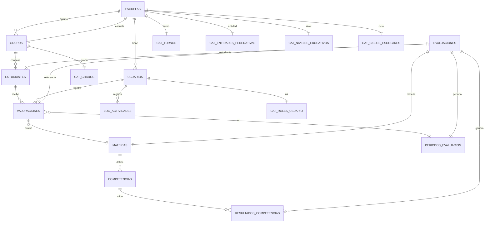

---
## 12. Consideraciones de migración y respaldo
    - Realizar respaldos automáticos diarios de la base de datos.
    - Probar restauraciones periódicas para validar integridad.
    - Documentar scripts de migración y versionado de esquema.
     - Considerar migración a la nube o escalabilidad horizontal si el volumen de datos crece.

---

# Checklist de Validación Final

1. **Diagrama Entidad-Relación**
    - [x] Incluye todas las entidades principales y catálogos.
    - [x] Refleja relaciones y claves foráneas correctamente.
    - [x] Actualizado con catálogos adicionales.

2. **Diccionario de Datos**
    - [x] Todas las tablas principales y catálogos documentados.
    - [x] Descripción clara de cada campo.
    - [x] Claves primarias, foráneas y únicas especificadas.
    - [x] Relaciones con catálogos reflejadas en las tablas principales.

3. **Consultas y Vistas SQL**
    - [x] Ejemplos de consultas clave y vistas para reportes.
    - [x] Ejemplo de consulta de auditoría.

4. **Notas y Recomendaciones**
    - [x] Buenas prácticas de integridad y migración documentadas.

5. **Glosario de Términos**
    - [x] Definiciones de términos y abreviaturas relevantes.

6. **Reglas de Negocio**
    - [x] Restricciones y validaciones clave documentadas.

7. **Índices y Optimización**
    - [x] Índices principales y sugeridos listados.

8. **Triggers y Procedimientos**
    - [x] Triggers y procedimientos almacenados sugeridos.

9. **Seguridad y Acceso**
    - [x] Políticas de acceso y restricciones por rol.

10. **Ejemplos de Datos**
     - [x] Ejemplos de registros para tablas clave.

11. **Diagrama Físico**
     - [x] Sección referencial para incluir diagrama físico.

12. **Migración y Respaldo**
     - [x] Estrategias y recomendaciones de respaldo y migración.

---
# Documento de Estructura de Datos

## 1. Diagrama Entidad-Relación (ER)

A continuación se presenta el diagrama entidad-relación inferido del sistema, basado en los esquemas y modelos encontrados en la documentación:




---

### Descripción de entidades principales:

 **COMPETENCIAS**: Competencias evaluadas por materia.
 **RESULTADOS_COMPETENCIAS**: Logros por competencia en cada evaluación.
 **LOG_ACTIVIDADES**: Bitácora de actividades y auditoría.
 **CAT_GRADOS**: Catálogo de grados escolares.

---

## 2. Diccionario de Datos

### ESCUELAS
| Campo           | Tipo         | Descripción                       |
|-----------------|--------------|-----------------------------------|
| id              | UUID         | Identificador único               |
| cct             | VARCHAR(10)  | Clave Centro Trabajo              |
| nombre          | VARCHAR(150) | Nombre de la escuela              |
| estado          | VARCHAR(50)  | Estado                            |
| cp              | VARCHAR(10)  | Código postal                     |
| telefono        | VARCHAR(15)  | Teléfono                          |
| email           | VARCHAR(100) | Correo electrónico                |
| director        | VARCHAR(150) | Nombre del director               |
| fecha_registro  | DATETIME     | Fecha de registro                 |
| estatus         | CHAR(1)      | Estado (A=Activo, I=Inactivo)     |

| id_turno        | INT          | Relación con CAT_TURNOS           |
| id_nivel        | INT          | Relación con CAT_NIVELES_EDUCATIVOS |
| id_entidad      | INT          | Relación con CAT_ENTIDADES_FEDERATIVAS |
| id_ciclo        | INT          | Relación con CAT_CICLOS_ESCOLARES |

#### Restricciones y claves
- **FK:** id_turno → CAT_TURNOS(id_turno)
- **FK:** id_nivel → CAT_NIVELES_EDUCATIVOS(id_nivel)
- **FK:** id_entidad → CAT_ENTIDADES_FEDERATIVAS(id_entidad)
- **FK:** id_ciclo → CAT_CICLOS_ESCOLARES(id_ciclo)

### USUARIOS
| Campo           | Tipo         | Descripción                       |
|-----------------|--------------|-----------------------------------|
| id              | UUID         | Identificador único               |
| nombre          | VARCHAR(150) | Nombre completo                   |
| email           | VARCHAR(100) | Correo electrónico                |
| rol             | VARCHAR(20)  | Rol (DIRECTOR, OPERADOR_SEP, ADMINISTRADOR) |
| escuela_id      | UUID         | Relación con ESCUELAS             |
| fecha_registro  | DATETIME     | Fecha de registro                 |
| estatus         | CHAR(1)      | Estado (A=Activo, I=Inactivo)     |

#### Restricciones y claves
- **PK:** id
- **FK:** escuela_id → ESCUELAS(id)
- **UK:** email

### VALORACIONES
| Campo           | Tipo         | Descripción                       |
|-----------------|--------------|-----------------------------------|
| id              | UUID         | Identificador único               |
| estudiante_id   | UUID         | Relación con ESTUDIANTES          |
| materia_id      | INT          | Relación con MATERIAS             |
| periodo_id      | INT          | Relación con PERIODOS_EVALUACION  |
| valor           | INT          | Valoración (0-3)                  |
| fecha           | DATETIME     | Fecha de valoración               |

#### Restricciones y claves
- **PK:** id
- **FK:** estudiante_id → ESTUDIANTES(id)
- **FK:** materia_id → MATERIAS(id_materia)
- **FK:** periodo_id → PERIODOS_EVALUACION(id_periodo)

### EVALUACIONES
| Campo           | Tipo         | Descripción                       |
|-----------------|--------------|-----------------------------------|
| id_evaluacion   | INT          | Identificador de evaluación       |
| id_estudiante   | INT          | Relación con ESTUDIANTES          |
| id_materia      | INT          | Relación con MATERIAS             |
| id_periodo      | INT          | Relación con PERIODOS_EVALUACION  |
| fecha_evaluacion| DATE         | Fecha de evaluación               |

#### Restricciones y claves
- **FK:** id_materia → MATERIAS(id_materia)
- **FK:** id_periodo → PERIODOS_EVALUACION(id_periodo)

### GRUPOS
| Campo           | Tipo         | Descripción                       |
|-----------------|--------------|-----------------------------------|
| id_grupo        | INT          | Identificador de grupo            |
| nivel_educativo | VARCHAR(50)  | Nivel educativo                   |
| grado_nombre    | VARCHAR(20)  | Nombre del grado                  |
| grado_numero    | INT          | Número de grado                   |
| descripcion     | VARCHAR(200) | Descripción                       |

#### Restricciones y claves

| id_rol          | INT          | Relación con CAT_ROLES_USUARIO    |
- **PK:** id_grupo
### MATERIAS
- **FK:** id_rol → CAT_ROLES_USUARIO(id_rol)
| codigo          | VARCHAR(10)  | Código de materia                 |
| nombre          | VARCHAR(100) | Nombre de la materia              |
| orden           | INT          | Orden                             |

#### Restricciones y claves
- **PK:** id_materia
- **UK:** codigo

### PERIODOS_EVALUACION
| Campo           | Tipo         | Descripción                       |
|-----------------|--------------|-----------------------------------|
| id_periodo      | INT          | Identificador de periodo          |
| nombre          | VARCHAR(50)  | Nombre del periodo                |
| fecha_inicio    | DATE         | Fecha de inicio                   |
| fecha_fin       | DATE         | Fecha de fin                      |

#### Restricciones y claves
- **PK:** id_periodo

### ESTUDIANTES
| Campo           | Tipo         | Descripción                       |
|-----------------|--------------|-----------------------------------|
| id              | UUID         | Identificador único               |
| nombre          | VARCHAR(150) | Nombre completo                   |
| grupo_id        | INT          | Relación con GRUPOS               |
| curp            | VARCHAR(18)  | CURP del estudiante               |
| fecha_nacimiento| DATE         | Fecha de nacimiento               |
| estatus         | CHAR(1)      | Estado (A=Activo, I=Inactivo)     |

#### Restricciones y claves

### CAT_GRADOS
| Campo           | Tipo         | Descripción                       |
|-----------------|--------------|-----------------------------------|
| id_grado        | INT          | Identificador de grado            |
| nivel_educativo | VARCHAR(50)  | Nivel educativo                   |
| grado_nombre    | VARCHAR(20)  | Nombre del grado                  |
| grado_numero    | INT          | Número de grado                   |
| descripcion     | VARCHAR(200) | Descripción                       |

#### Restricciones y claves
- **PK:** id_grado

### COMPETENCIAS
| Campo           | Tipo         | Descripción                       |
|-----------------|--------------|-----------------------------------|
| id_competencia  | INT          | Identificador de competencia      |
| id_materia      | INT          | Relación con MATERIAS             |
| codigo          | VARCHAR(20)  | Código de competencia             |
| descripcion     | VARCHAR(500) | Descripción                       |
| nivel_esperado  | INT          | Nivel esperado (1-4)              |

#### Restricciones y claves
- **PK:** id_competencia
- **FK:** id_materia → MATERIAS(id_materia)

### RESULTADOS_COMPETENCIAS
| Campo           | Tipo         | Descripción                       |
|-----------------|--------------|-----------------------------------|
| id_resultado    | INT          | Identificador de resultado        |
| id_evaluacion   | INT          | Relación con EVALUACIONES         |
| id_competencia  | INT          | Relación con COMPETENCIAS         |
| nivel_logro     | INT          | Nivel de logro (1-4)              |

#### Restricciones y claves
- **PK:** id_resultado
- **FK:** id_evaluacion → EVALUACIONES(id_evaluacion)
- **FK:** id_competencia → COMPETENCIAS(id_competencia)

### LOG_ACTIVIDADES
| Campo           | Tipo         | Descripción                       |
|-----------------|--------------|-----------------------------------|
| id_log          | INT          | Identificador de log              |
| id_usuario      | UUID         | Relación con USUARIOS             |
| fecha_hora      | DATETIME     | Fecha y hora de la actividad      |
| accion          | VARCHAR(50)  | Tipo de acción (INSERT, UPDATE, DELETE, LOGIN) |
| tabla           | VARCHAR(50)  | Tabla afectada                    |
| registro_id     | INT          | ID del registro afectado          |
| detalle         | TEXT         | Detalle de la acción              |
| ip              | VARCHAR(50)  | IP de origen                      |

#### Restricciones y claves

### CAT_TURNOS
| Campo           | Tipo         | Descripción                       |
|-----------------|--------------|-----------------------------------|
| id_turno        | INT          | Identificador de turno            |
| nombre          | VARCHAR(20)  | Nombre del turno (Matutino, Vespertino, Nocturno) |

#### Restricciones y claves
- **PK:** id_turno

### CAT_NIVELES_EDUCATIVOS
| Campo           | Tipo         | Descripción                       |
|-----------------|--------------|-----------------------------------|
| id_nivel        | INT          | Identificador de nivel educativo  |
| nombre          | VARCHAR(50)  | Nombre del nivel (Preescolar, Primaria, Secundaria, Telesecundaria) |

#### Restricciones y claves
- **PK:** id_nivel

### CAT_ENTIDADES_FEDERATIVAS
| Campo           | Tipo         | Descripción                       |
|-----------------|--------------|-----------------------------------|
| id_entidad      | INT          | Identificador de entidad federativa |
| nombre          | VARCHAR(100) | Nombre de la entidad              |
| clave           | VARCHAR(2)   | Clave de la entidad (INEGI)       |

#### Restricciones y claves
- **PK:** id_entidad
- **UK:** clave

### CAT_CICLOS_ESCOLARES
| Campo           | Tipo         | Descripción                       |
|-----------------|--------------|-----------------------------------|
| id_ciclo        | INT          | Identificador de ciclo escolar    |
| nombre          | VARCHAR(10)  | Nombre del ciclo (2024-2025, etc) |
| fecha_inicio    | DATE         | Fecha de inicio                   |
| fecha_fin       | DATE         | Fecha de fin                      |

#### Restricciones y claves
- **PK:** id_ciclo

### CAT_ROLES_USUARIO
| Campo           | Tipo         | Descripción                       |
|-----------------|--------------|-----------------------------------|
| id_rol          | INT          | Identificador de rol              |
| nombre          | VARCHAR(30)  | Nombre del rol (ADMIN, DIRECTOR, DOCENTE, CONSULTA, OPERADOR_SEP) |

#### Restricciones y claves
- **PK:** id_rol
---
Este documento resume la estructura de datos principal del sistema, incluyendo el diagrama ER y el diccionario de datos para las entidades clave. Para detalles adicionales, consulta los archivos de análisis técnico y los scripts SQL del proyecto.

---

## 3. Ejemplos de Consultas SQL

### Consulta: Valoraciones por escuela y periodo
```sql
SELECT e.nombre AS escuela, p.nombre AS periodo, COUNT(v.id) AS total_valoraciones
FROM ESCUELAS e
JOIN USUARIOS u ON u.escuela_id = e.id
JOIN ESTUDIANTES est ON est.grupo_id IN (SELECT id_grupo FROM GRUPOS WHERE escuela_id = e.id)
JOIN VALORACIONES v ON v.estudiante_id = est.id
JOIN PERIODOS_EVALUACION p ON v.periodo_id = p.id_periodo
GROUP BY e.nombre, p.nombre;
```

### Consulta: Promedio de valoración por materia
```sql
SELECT m.nombre AS materia, AVG(v.valor) AS promedio_valoracion
FROM VALORACIONES v
JOIN MATERIAS m ON v.materia_id = m.id_materia
GROUP BY m.nombre;
```

### Consulta: Listado de estudiantes con valoraciones incompletas
```sql
SELECT est.nombre, est.curp, g.grado_nombre, e.nombre AS escuela
FROM ESTUDIANTES est
JOIN GRUPOS g ON est.grupo_id = g.id_grupo
JOIN ESCUELAS e ON g.escuela_id = e.id
WHERE est.id NOT IN (
   SELECT estudiante_id FROM VALORACIONES WHERE valor IS NOT NULL
);
```

### Vista: Reporte por escuela y materia
```sql
CREATE VIEW VW_REPORTE_ESCUELA AS
SELECT 
        e.cct,
        e.nombre AS nombre_escuela,
        g.grado_nombre,
        m.codigo AS codigo_materia,
        m.nombre AS nombre_materia,
        COUNT(DISTINCT est.id) AS total_estudiantes,
        AVG(rc.nivel_logro) AS promedio_nivel,
        SUM(CASE WHEN rc.nivel_logro = 4 THEN 1 ELSE 0 END) AS nivel_4,
        SUM(CASE WHEN rc.nivel_logro = 3 THEN 1 ELSE 0 END) AS nivel_3,
        SUM(CASE WHEN rc.nivel_logro = 2 THEN 1 ELSE 0 END) AS nivel_2,
        SUM(CASE WHEN rc.nivel_logro = 1 THEN 1 ELSE 0 END) AS nivel_1
FROM ESCUELAS e
INNER JOIN GRUPOS g ON e.id = g.id_escuela
INNER JOIN ESTUDIANTES est ON g.id_grupo = est.grupo_id
INNER JOIN EVALUACIONES ev ON est.id = ev.id_estudiante
INNER JOIN MATERIAS m ON ev.id_materia = m.id_materia
INNER JOIN RESULTADOS_COMPETENCIAS rc ON ev.id_evaluacion = rc.id_evaluacion
GROUP BY e.cct, e.nombre, g.grado_nombre, m.codigo, m.nombre;
```

### Consulta: Auditoría de actividades por usuario
```sql
SELECT u.nombre, l.accion, l.tabla, l.fecha_hora, l.detalle
FROM LOG_ACTIVIDADES l
JOIN USUARIOS u ON l.id_usuario = u.id
WHERE l.fecha_hora >= '2025-12-01';
```

---

## 4. Notas y recomendaciones


---

## 5. Glosario de términos

| Término | Definición |
|---------|------------|
| CCT | Clave de Centro de Trabajo |
| CURP | Clave Única de Registro de Población |
| FRV | Formato de Recepción de Valoraciones |
| PK | Primary Key (Clave primaria) |
| FK | Foreign Key (Clave foránea) |
| UK | Unique Key (Clave única) |
| DGADAE | Dirección General de Acreditación, Incorporación y Revalidación |

---

## 6. Reglas de negocio relevantes

- No puede haber dos escuelas con el mismo CCT.
- El CURP de cada estudiante debe ser único.
- Un usuario solo puede estar activo en una escuela a la vez.
- Los valores de valoración deben estar en el rango 0-3.
- Los periodos deben estar correctamente definidos y no solaparse.
- Los roles de usuario determinan el acceso a módulos y datos.

---

## 7. Índices y optimización

- Índices únicos en CCT (escuelas), CURP (estudiantes), email (usuarios).
- Índices compuestos sugeridos:
    - (escuela_id, nombre) en GRUPOS
    - (id_estudiante, id_materia, id_periodo) en EVALUACIONES
    - (id_evaluacion, id_competencia) en RESULTADOS_COMPETENCIAS

---

## 8. Triggers y procedimientos almacenados

- Trigger para auditar cambios en tablas críticas (insert/update/delete en ESCUELAS, ESTUDIANTES, VALORACIONES).
- Procedimiento para cierre de periodo escolar (actualiza estatus y bloquea nuevas valoraciones).
- Trigger para validar unicidad de CURP antes de insertar estudiante.

---

## 9. Políticas de seguridad y acceso

- Solo usuarios con rol ADMIN pueden eliminar registros.
- Los DIRECTORES solo pueden ver y editar datos de su escuela.
- Los DOCENTES solo pueden consultar valoraciones de sus grupos.
- Acceso a reportes restringido por rol y entidad federativa.

---

## 10. Ejemplos de datos

### ESCUELAS
| id | cct | nombre | id_turno | id_nivel | id_entidad | id_ciclo |
|----|-----|--------|----------|----------|------------|----------|
| 1  | 09ABC1234X | Primaria Benito Juárez | 1 | 2 | 9 | 1 |

### USUARIOS
| id | nombre | email | id_rol | escuela_id |
|----|--------|-------|--------|------------|
| 1  | Juan Pérez | juan@escuela.edu.mx | 2 | 1 |

### ESTUDIANTES
| id | nombre | curp | grupo_id |
|----|--------|------|----------|
| 1  | Ana López | LOAA010101MDFRNN09 | 1 |

---

## 11. Diagrama físico (referencial)

> Nota: El diagrama físico puede generarse con herramientas como pgAdmin, MySQL Workbench o dbdiagram.io. Aquí se recomienda incluir una imagen o enlace al archivo fuente del diagrama físico.

---

## 12. Consideraciones de migración y respaldo

- Realizar respaldos automáticos diarios de la base de datos.
- Probar restauraciones periódicas para validar integridad.
- Documentar scripts de migración y versionado de esquema.
- Considerar migración a la nube o escalabilidad horizontal si el volumen de datos crece.