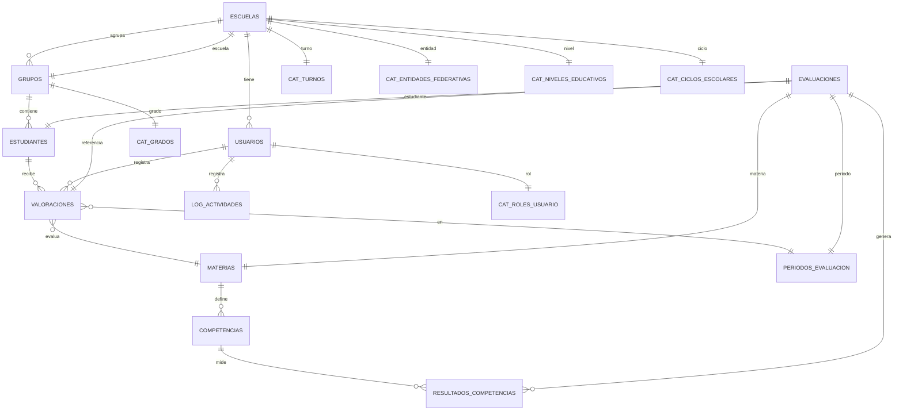

# ESTRUCTURA_DE_DATOS.md

Este documento contiene la descripción completa de la estructura de datos del sistema SEP Evaluación Diagnóstica. Aquí encontrarás:

- El diagrama entidad-relación (ER) que muestra las relaciones entre las principales entidades y catálogos del sistema.
- Un diccionario de datos unificado y ordenado alfabéticamente, con la definición de todas las tablas, sus campos y descripciones.
- Catálogos, tablas auxiliares y estructuras derivadas de archivos fuente (.DBF) integradas en el modelo.
- Reglas de negocio, índices, procedimientos, vistas, políticas de seguridad y ejemplos de datos relevantes.
- Notas técnicas y recomendaciones para migración, respaldo y auditoría.

Este archivo sirve como referencia técnica para desarrolladores, analistas, auditores y cualquier persona que requiera comprender la estructura y funcionamiento de la base de datos del sistema.

## Diagrama Entidad-Relación (ER)



# ESTRUCTURA_DE_DATOS.md

Este documento contiene la descripción completa de la estructura de datos del sistema SEP Evaluación Diagnóstica. Aquí encontrarás:

- El diagrama entidad-relación (ER) que muestra las relaciones entre las principales entidades y catálogos del sistema.
- Un diccionario de datos unificado y ordenado alfabéticamente, con la definición de todas las tablas, sus campos y descripciones.
- Catálogos, tablas auxiliares y estructuras derivadas de archivos fuente (.DBF) integradas en el modelo.
- Reglas de negocio, índices, procedimientos, vistas, políticas de seguridad y ejemplos de datos relevantes.
- Notas técnicas y recomendaciones para migración, respaldo y auditoría.

Este archivo sirve como referencia técnica para desarrolladores, analistas, auditores y cualquier persona que requiera comprender la estructura y funcionamiento de la base de datos del sistema.

## Diccionario de Datos (todas las tablas, orden alfabético)

<!-- INICIO DICCIONARIO ORDENADO -->

### ARCHIVOS_FRV
| Campo              | Tipo         | Descripción                       |
|--------------------|--------------|-----------------------------------|
| id                 | UUID         | Identificador único               |
| escuela_id         | UUID         | Relación con ESCUELAS             |
| usuario_id         | UUID         | Relación con USUARIOS             |
| ciclo_escolar      | VARCHAR(9)   | Ciclo escolar                     |
| nivel              | ENUM         | Nivel educativo                   |
| estado             | ENUM         | Estado del archivo                |
| file_path          | VARCHAR(500) | Ruta en filesystem                |
| filename_original  | VARCHAR(255) | Nombre original del archivo       |
| file_size          | BIGINT       | Tamaño en bytes                   |
| mime_type          | VARCHAR(50)  | Tipo MIME                         |
| validacion_resultado| JSONB       | Resultado de validación           |
| validado_en        | TIMESTAMP    | Fecha de validación               |
| procesado_en       | TIMESTAMP    | Fecha de procesamiento            |
| total_estudiantes  | INT          | Total de estudiantes              |
| created_at         | TIMESTAMP    | Fecha de creación                 |
| updated_at         | TIMESTAMP    | Fecha de actualización            |

### BITACORA_DETALLADA
| Campo           | Tipo         | Descripción                       |
|-----------------|--------------|-----------------------------------|
| id              | BIGSERIAL    | Identificador único               |
| usuario_id      | UUID         | Relación con USUARIOS             |
| accion          | VARCHAR(100) | Acción realizada                  |
| descripcion     | TEXT         | Descripción detallada             |
| modulo          | VARCHAR(100) | Módulo o componente               |
| resultado       | VARCHAR(50)  | Resultado (OK, ERROR, etc.)       |
| ip_address      | INET         | IP de origen                      |
| fecha           | TIMESTAMP    | Fecha y hora                      |

### CATALOGO_ERRORES
| Campo           | Tipo         | Descripción                       |
|-----------------|--------------|-----------------------------------|
| codigo          | VARCHAR(20)  | Código de error                   |
| mensaje         | VARCHAR(255) | Mensaje corto                     |
| descripcion     | TEXT         | Descripción detallada             |
| modulo          | VARCHAR(100) | Módulo o componente relacionado   |
| solucion        | TEXT         | Sugerencia de solución            |

### COMPETENCIAS
| Campo           | Tipo         | Descripción                       |
|-----------------|--------------|-----------------------------------|
| id_competencia  | INT          | Identificador de competencia      |
| id_materia      | INT          | Relación con MATERIAS             |
| codigo          | VARCHAR(20)  | Código de competencia             |
| descripcion     | VARCHAR(500) | Descripción                       |
| nivel_esperado  | INT          | Nivel esperado (1-4)              |

### CONFIGURACIONES_USUARIO
| Campo           | Tipo         | Descripción                       |
|-----------------|--------------|-----------------------------------|
| id              | UUID         | Identificador único               |
| usuario_id      | UUID         | Relación con USUARIOS             |
| clave           | VARCHAR(100) | Nombre de la configuración        |
| valor           | TEXT         | Valor de la configuración         |
| actualizado_en  | TIMESTAMP    | Fecha de última actualización     |

### CONSENTIMIENTOS_LGPDP
| Campo                 | Tipo         | Descripción                       |
|-----------------------|--------------|-----------------------------------|
| id                    | UUID         | Identificador único               |
| estudiante_id         | UUID         | Relación con ESTUDIANTES          |
| escuela_id            | UUID         | Relación con ESCUELAS             |
| tipo_consentimiento   | VARCHAR(50)  | Tipo de consentimiento            |
| consentimiento_otorgado| BOOLEAN     | Consentimiento otorgado           |
| tutor_nombre          | VARCHAR(150) | Nombre del tutor                  |
| tutor_firma_digital   | TEXT         | Firma digital                     |
| ip_address            | INET         | IP de origen                      |
| created_at            | TIMESTAMP    | Fecha de creación                 |

### ESCUELAS
| Campo           | Tipo         | Descripción                       |
|-----------------|--------------|-----------------------------------|
| id              | UUID         | Identificador único               |
| cct             | VARCHAR(10)  | Clave Centro Trabajo              |
| nombre          | VARCHAR(150) | Nombre de la escuela              |
| estado          | VARCHAR(50)  | Estado                            |
| cp              | VARCHAR(10)  | Código postal                     |
| telefono        | VARCHAR(15)  | Teléfono                          |
| email           | VARCHAR(100) | Correo electrónico                |
| director        | VARCHAR(150) | Nombre del director               |
| fecha_registro  | DATETIME     | Fecha de registro                 |
| estatus         | CHAR(1)      | Estado (A=Activo, I=Inactivo)     |
| id_turno        | INT          | Relación con CAT_TURNOS           |
| id_nivel        | INT          | Relación con CAT_NIVELES_EDUCATIVOS |
| id_entidad      | INT          | Relación con CAT_ENTIDADES_FEDERATIVAS |
| id_ciclo        | INT          | Relación con CAT_CICLOS_ESCOLARES |

### ESTUDIANTES
| Campo           | Tipo         | Descripción                       |
|-----------------|--------------|-----------------------------------|
| id              | UUID         | Identificador único               |
| nombre          | VARCHAR(150) | Nombre completo                   |
| grupo_id        | INT          | Relación con GRUPOS               |
| curp            | VARCHAR(18)  | CURP del estudiante               |
| fecha_nacimiento| DATE         | Fecha de nacimiento               |
| estatus         | CHAR(1)      | Estado (A=Activo, I=Inactivo)     |

### GRUPOS
| Campo           | Tipo         | Descripción                       |
|-----------------|--------------|-----------------------------------|
| id_grupo        | INT          | Identificador de grupo            |
| nivel_educativo | VARCHAR(50)  | Nivel educativo                   |
| grado_nombre    | VARCHAR(20)  | Nombre del grado                  |
| grado_numero    | INT          | Número de grado                   |
| descripcion     | VARCHAR(200) | Descripción                       |
| id_rol          | INT          | Relación con CAT_ROLES_USUARIO    |

### LOG_ACTIVIDADES
| Campo           | Tipo         | Descripción                       |
|-----------------|--------------|-----------------------------------|
| id_log          | INT          | Identificador de log              |
| id_usuario      | UUID         | Relación con USUARIOS             |
| fecha_hora      | DATETIME     | Fecha y hora de la actividad      |
| accion          | VARCHAR(50)  | Tipo de acción (INSERT, UPDATE, DELETE, LOGIN) |
| tabla           | VARCHAR(50)  | Tabla afectada                    |
| registro_id     | INT          | ID del registro afectado          |
| detalle         | TEXT         | Detalle de la acción              |
| ip              | VARCHAR(50)  | IP de origen                      |

### MATERIAS
| Campo           | Tipo         | Descripción                       |
|-----------------|--------------|-----------------------------------|
| codigo          | VARCHAR(10)  | Código de materia                 |
| nombre          | VARCHAR(100) | Nombre de la materia              |
| orden           | INT          | Orden                             |

### PERIODOS_EVALUACION
| Campo           | Tipo         | Descripción                       |
|-----------------|--------------|-----------------------------------|
| id_periodo      | INT          | Identificador de periodo          |
| nombre          | VARCHAR(50)  | Nombre del periodo                |
| fecha_inicio    | DATE         | Fecha de inicio                   |
| fecha_fin       | DATE         | Fecha de fin                      |

### PRE3
| Campo         | Tipo        | Descripción                                      |
|--------------|-------------|--------------------------------------------------|
| CCT          | CHAR(21)    | Clave de Centro de Trabajo                       |
| TURNO        | CHAR(22)    | Turno escolar                                    |
| NOM_CCT      | CHAR(31)    | Nombre del Centro de Trabajo                     |
| NIVEL        | CHAR(10)    | Nivel educativo                                  |
| FASE         | CHAR(7)     | Fase de la evaluación                            |
| GRADO        | CHAR(11)    | Grado escolar                                    |
| CORREO1      | CHAR(32)    | Correo electrónico principal                     |
| CORREO2      | CHAR(32)    | Correo electrónico alternativo                   |
| MATRICULA_   | CHAR(22)    | Matrícula del estudiante                         |
| NLISTA       | CHAR(14)    | Número de lista                                  |
| ESTUDIANTE   | CHAR(59)    | Nombre completo del estudiante                   |
| GENERO       | CHAR(10)    | Género                                           |
| GRUPO        | CHAR(10)    | Grupo escolar                                    |
| EIA1_C1_A1   | CHAR(10)    | Resultado EIA1, Competencia 1, Área 1            |
| EIA1_C1_A2   | CHAR(10)    | Resultado EIA1, Competencia 1, Área 2            |
| EIA1_C2_A1   | CHAR(10)    | Resultado EIA1, Competencia 2, Área 1            |
| EIA1_C2_A2   | CHAR(10)    | Resultado EIA1, Competencia 2, Área 2            |
| EIA1_C3_A1   | CHAR(10)    | Resultado EIA1, Competencia 3, Área 1            |
| EIA1_C3_A2   | CHAR(10)    | Resultado EIA1, Competencia 3, Área 2            |
| EIA2_C1_A1   | CHAR(10)    | Resultado EIA2, Competencia 1, Área 1            |
| EIA2_C2_A1   | CHAR(10)    | Resultado EIA2, Competencia 2, Área 1            |
| EIA2_C3_A1   | CHAR(10)    | Resultado EIA2, Competencia 3, Área 1            |
| EIA2_C4_A1   | CHAR(10)    | Resultado EIA2, Competencia 4, Área 1            |
| EIA2_C4_A2   | CHAR(10)    | Resultado EIA2, Competencia 4, Área 2            |
| PLEN         | CHAR(10)    | Indicador de plenitud                            |
| PSPC         | CHAR(10)    | Indicador PSPC                                   |
| PENS         | CHAR(10)    | Indicador PENS                                   |
| PHYC         | CHAR(10)    | Indicador PHYC                                   |
| ID           | CHAR(19)    | Identificador único                              |
| ARCHIVOORI   | CHAR(24)    | Nombre de archivo original                       |

### PRI1
| Campo         | Tipo        | Descripción                                      |
|--------------|-------------|--------------------------------------------------|
| CCT          | CHAR(21)    | Clave de Centro de Trabajo                       |
| TURNO        | CHAR(22)    | Turno escolar                                    |
| NOM_CCT      | CHAR(29)    | Nombre del Centro de Trabajo                     |
| NIVEL        | CHAR(10)    | Nivel educativo                                  |
| FASE         | CHAR(7)     | Fase de la evaluación                            |
| GRADO        | CHAR(11)    | Grado escolar                                    |
| CORREO1      | CHAR(26)    | Correo electrónico principal                     |
| CORREO2      | CHAR(29)    | Correo electrónico alternativo                   |
| MATRICULA_   | CHAR(22)    | Matrícula del estudiante                         |
| NLISTA       | CHAR(14)    | Número de lista                                  |
| ESTUDIANTE   | CHAR(59)    | Nombre completo del estudiante                   |
| GENERO       | CHAR(10)    | Género                                           |
| GRUPO        | CHAR(10)    | Grupo escolar                                    |
| EIA1_C1_A1   | CHAR(10)    | Resultado EIA1, Competencia 1, Área 1            |
| EIA1_C2_A1   | CHAR(10)    | Resultado EIA1, Competencia 2, Área 1            |
| EIA1_C2_A2   | CHAR(10)    | Resultado EIA1, Competencia 2, Área 2            |
| EIA1_C3_A1   | CHAR(10)    | Resultado EIA1, Competencia 3, Área 1            |
| EIA1_C4_A1   | CHAR(10)    | Resultado EIA1, Competencia 4, Área 1            |
| EIA2_C1_A1   | CHAR(10)    | Resultado EIA2, Competencia 1, Área 1            |
| EIA2_C2_A1   | CHAR(10)    | Resultado EIA2, Competencia 2, Área 1            |
| EIA2_C3_A1   | CHAR(10)    | Resultado EIA2, Competencia 3, Área 1            |
| EIA2_C3_A2   | CHAR(10)    | Resultado EIA2, Competencia 3, Área 2            |
| EIA2_C4_A1   | CHAR(10)    | Resultado EIA2, Competencia 4, Área 1            |
| PLEN         | CHAR(10)    | Indicador de plenitud                            |
| PSPC         | CHAR(10)    | Indicador PSPC                                   |
| PENS         | CHAR(10)    | Indicador PENS                                   |
| PHYC         | CHAR(10)    | Indicador PHYC                                   |
| ID           | CHAR(19)    | Identificador único                              |
| ARCHIVOORI   | CHAR(23)    | Nombre de archivo original                       |


### PRI2
| Campo         | Tipo        | Descripción                                      |
|--------------|-------------|--------------------------------------------------|
| CCT          | CHAR(21)    | Clave de Centro de Trabajo                       |
| TURNO        | CHAR(22)    | Turno escolar                                    |
| NOM_CCT      | CHAR(29)    | Nombre del Centro de Trabajo                     |
| NIVEL        | CHAR(10)    | Nivel educativo                                  |
| FASE         | CHAR(7)     | Fase de la evaluación                            |
| GRADO        | CHAR(11)    | Grado escolar                                    |
| CORREO1      | CHAR(26)    | Correo electrónico principal                     |
| CORREO2      | CHAR(29)    | Correo electrónico alternativo                   |
| MATRICULA_   | CHAR(22)    | Matrícula del estudiante                         |
| NLISTA       | CHAR(14)    | Número de lista                                  |
| ESTUDIANTE   | CHAR(59)    | Nombre completo del estudiante                   |
| GENERO       | CHAR(10)    | Género                                           |
| GRUPO        | CHAR(10)    | Grupo escolar                                    |
| EIA1_C1_A1   | CHAR(10)    | Resultado EIA1, Competencia 1, Área 1            |
| EIA1_C2_A1   | CHAR(10)    | Resultado EIA1, Competencia 2, Área 1            |
| EIA1_C2_A2   | CHAR(10)    | Resultado EIA1, Competencia 2, Área 2            |
| EIA1_C3_A1   | CHAR(10)    | Resultado EIA1, Competencia 3, Área 1            |
| EIA1_C4_A1   | CHAR(10)    | Resultado EIA1, Competencia 4, Área 1            |
| EIA2_C1_A1   | CHAR(10)    | Resultado EIA2, Competencia 1, Área 1            |
| EIA2_C2_A1   | CHAR(10)    | Resultado EIA2, Competencia 2, Área 1            |
| EIA2_C3_A1   | CHAR(10)    | Resultado EIA2, Competencia 3, Área 1            |
| EIA2_C3_A2   | CHAR(10)    | Resultado EIA2, Competencia 3, Área 2            |
| EIA2_C4_A1   | CHAR(10)    | Resultado EIA2, Competencia 4, Área 1            |
| PLEN         | CHAR(10)    | Indicador de plenitud                            |
| PSPC         | CHAR(10)    | Indicador PSPC                                   |
| PENS         | CHAR(10)    | Indicador PENS                                   |
| PHYC         | CHAR(10)    | Indicador PHYC                                   |
| ID           | CHAR(19)    | Identificador único                              |
| ARCHIVOORI   | CHAR(23)    | Nombre de archivo original                       |

### PRI3
| Campo         | Tipo        | Descripción                                      |
|--------------|-------------|--------------------------------------------------|
| CCT          | CHAR(21)    | Clave de Centro de Trabajo                       |
| TURNO        | CHAR(22)    | Turno escolar                                    |
| NOM_CCT      | CHAR(29)    | Nombre del Centro de Trabajo                     |
| NIVEL        | CHAR(10)    | Nivel educativo                                  |
| FASE         | CHAR(7)     | Fase de la evaluación                            |
| GRADO        | CHAR(11)    | Grado escolar                                    |
| CORREO1      | CHAR(26)    | Correo electrónico principal                     |
| CORREO2      | CHAR(29)    | Correo electrónico alternativo                   |
| MATRICULA_   | CHAR(22)    | Matrícula del estudiante                         |
| NLISTA       | CHAR(14)    | Número de lista                                  |
| ESTUDIANTE   | CHAR(59)    | Nombre completo del estudiante                   |
| GENERO       | CHAR(10)    | Género                                           |
| GRUPO        | CHAR(10)    | Grupo escolar                                    |
| EIA1_C1_A1   | CHAR(10)    | Resultado EIA1, Competencia 1, Área 1            |
| EIA1_C1_A2   | CHAR(10)    | Resultado EIA1, Competencia 1, Área 2            |
| EIA1_C1_B1   | CHAR(10)    | Resultado EIA1, Competencia 1, Bloque 1          |
| EIA1_C1_B2   | CHAR(10)    | Resultado EIA1, Competencia 1, Bloque 2          |
| EIA1_C1_B3   | CHAR(10)    | Resultado EIA1, Competencia 1, Bloque 3          |
| EIA1_C2_A1   | CHAR(10)    | Resultado EIA1, Competencia 2, Área 1            |
| EIA1_C2_A2   | CHAR(10)    | Resultado EIA1, Competencia 2, Área 2            |
| EIA1_C2_A3   | CHAR(10)    | Resultado EIA1, Competencia 2, Área 3            |
| EIA1_C2_B1   | CHAR(10)    | Resultado EIA1, Competencia 2, Bloque 1          |
| EIA1_C3_A1   | CHAR(10)    | Resultado EIA1, Competencia 3, Área 1            |
| EIA1_C3_B1   | CHAR(10)    | Resultado EIA1, Competencia 3, Bloque 1          |
| EIA1_C4_A1   | CHAR(10)    | Resultado EIA1, Competencia 4, Área 1            |
| EIA1_C4_A2   | CHAR(10)    | Resultado EIA1, Competencia 4, Área 2            |
| EIA1_C4_A3   | CHAR(10)    | Resultado EIA1, Competencia 4, Área 3            |
| EIA2_C1_A1   | CHAR(10)    | Resultado EIA2, Competencia 1, Área 1            |
| EIA2_C1_B1   | CHAR(10)    | Resultado EIA2, Competencia 1, Bloque 1          |
| EIA2_C2_A1   | CHAR(10)    | Resultado EIA2, Competencia 2, Área 1            |
| EIA2_C3_A1   | CHAR(10)    | Resultado EIA2, Competencia 3, Área 1            |
| EIA2_C3_B1   | CHAR(10)    | Resultado EIA2, Competencia 3, Bloque 1          |
| EIA2_C3_C1   | CHAR(10)    | Resultado EIA2, Competencia 3, Componente 1      |
| EIA2_C3_C2   | CHAR(10)    | Resultado EIA2, Competencia 3, Componente 2      |
| EIA2_C4_A1   | CHAR(10)    | Resultado EIA2, Competencia 4, Área 1            |
| EIA2_C4_B1   | CHAR(10)    | Resultado EIA2, Competencia 4, Bloque 1          |
| EIA2_C5_A1   | CHAR(10)    | Resultado EIA2, Competencia 5, Área 1            |
| EIA2_C5_A2   | CHAR(10)    | Resultado EIA2, Competencia 5, Área 2            |
| EIA2_C5_A3   | CHAR(10)    | Resultado EIA2, Competencia 5, Área 3            |
| PLEN         | CHAR(10)    | Indicador de plenitud                            |
| PSPC         | CHAR(10)    | Indicador PSPC                                   |
| PENS         | CHAR(10)    | Indicador PENS                                   |
| PHYC         | CHAR(10)    | Indicador PHYC                                   |
| ID           | CHAR(19)    | Identificador único                              |
| ARCHIVOORI   | CHAR(23)    | Nombre de archivo original                       |

### PRI4
| Campo         | Tipo        | Descripción                                      |
|--------------|-------------|--------------------------------------------------|
| CCT          | CHAR(21)    | Clave de Centro de Trabajo                       |
| TURNO        | CHAR(22)    | Turno escolar                                    |
| NOM_CCT      | CHAR(29)    | Nombre del Centro de Trabajo                     |
| NIVEL        | CHAR(10)    | Nivel educativo                                  |
| FASE         | CHAR(7)     | Fase de la evaluación                            |
| GRADO        | CHAR(11)    | Grado escolar                                    |
| CORREO1      | CHAR(24)    | Correo electrónico principal                     |
| CORREO2      | CHAR(29)    | Correo electrónico alternativo                   |
| MATRICULA_   | CHAR(22)    | Matrícula del estudiante                         |
| NLISTA       | CHAR(14)    | Número de lista                                  |
| ESTUDIANTE   | CHAR(59)    | Nombre completo del estudiante                   |
| GENERO       | CHAR(10)    | Género                                           |
| GRUPO        | CHAR(10)    | Grupo escolar                                    |
| EIA1_C1_A1   | CHAR(10)    | Resultado EIA1, Competencia 1, Área 1            |
| EIA1_C1_A2   | CHAR(10)    | Resultado EIA1, Competencia 1, Área 2            |
| EIA1_C1_B1   | CHAR(10)    | Resultado EIA1, Competencia 1, Bloque 1          |
| EIA1_C1_B2   | CHAR(10)    | Resultado EIA1, Competencia 1, Bloque 2          |
| EIA1_C1_B3   | CHAR(10)    | Resultado EIA1, Competencia 1, Bloque 3          |
| EIA1_C2_A1   | CHAR(10)    | Resultado EIA1, Competencia 2, Área 1            |
| EIA1_C2_A2   | CHAR(10)    | Resultado EIA1, Competencia 2, Área 2            |
| EIA1_C2_A3   | CHAR(10)    | Resultado EIA1, Competencia 2, Área 3            |
| EIA1_C2_B1   | CHAR(10)    | Resultado EIA1, Competencia 2, Bloque 1          |
| EIA1_C3_A1   | CHAR(10)    | Resultado EIA1, Competencia 3, Área 1            |
| EIA1_C3_B1   | CHAR(10)    | Resultado EIA1, Competencia 3, Bloque 1          |
| EIA1_C4_A1   | CHAR(10)    | Resultado EIA1, Competencia 4, Área 1            |
| EIA1_C4_A2   | CHAR(10)    | Resultado EIA1, Competencia 4, Área 2            |
| EIA1_C4_A3   | CHAR(10)    | Resultado EIA1, Competencia 4, Área 3            |
| EIA2_C1_A1   | CHAR(10)    | Resultado EIA2, Competencia 1, Área 1            |
| EIA2_C1_B1   | CHAR(10)    | Resultado EIA2, Competencia 1, Bloque 1          |
| EIA2_C2_A1   | CHAR(10)    | Resultado EIA2, Competencia 2, Área 1            |
| EIA2_C3_A1   | CHAR(10)    | Resultado EIA2, Competencia 3, Área 1            |
| EIA2_C3_B1   | CHAR(10)    | Resultado EIA2, Competencia 3, Bloque 1          |
| EIA2_C3_C1   | CHAR(10)    | Resultado EIA2, Competencia 3, Componente 1      |
| EIA2_C3_C2   | CHAR(10)    | Resultado EIA2, Competencia 3, Componente 2      |
| EIA2_C4_A1   | CHAR(10)    | Resultado EIA2, Competencia 4, Área 1            |
| EIA2_C4_B1   | CHAR(10)    | Resultado EIA2, Competencia 4, Bloque 1          |
| EIA2_C5_A1   | CHAR(10)    | Resultado EIA2, Competencia 5, Área 1            |
| EIA2_C5_A2   | CHAR(10)    | Resultado EIA2, Competencia 5, Área 2            |
| EIA2_C5_A3   | CHAR(10)    | Resultado EIA2, Competencia 5, Área 3            |
| PLEN         | CHAR(10)    | Indicador de plenitud                            |
| PSPC         | CHAR(10)    | Indicador PSPC                                   |
| PENS         | CHAR(10)    | Indicador PENS                                   |
| PHYC         | CHAR(10)    | Indicador PHYC                                   |
| ID           | CHAR(19)    | Identificador único                              |
| ARCHIVOORI   | CHAR(23)    | Nombre de archivo original                       |

### PRI5
| Campo         | Tipo        | Descripción                                      |
|--------------|-------------|--------------------------------------------------|
| CCT          | CHAR(21)    | Clave de Centro de Trabajo                       |
| TURNO        | CHAR(22)    | Turno escolar                                    |
| NOM_CCT      | CHAR(29)    | Nombre del Centro de Trabajo                     |
| NIVEL        | CHAR(10)    | Nivel educativo                                  |
| FASE         | CHAR(7)     | Fase de la evaluación                            |
| GRADO        | CHAR(11)    | Grado escolar                                    |
| CORREO1      | CHAR(24)    | Correo electrónico principal                     |
| CORREO2      | CHAR(29)    | Correo electrónico alternativo                   |
| MATRICULA_   | CHAR(22)    | Matrícula del estudiante                         |
| NLISTA       | CHAR(14)    | Número de lista                                  |
| ESTUDIANTE   | CHAR(59)    | Nombre completo del estudiante                   |
| GENERO       | CHAR(10)    | Género                                           |
| GRUPO        | CHAR(10)    | Grupo escolar                                    |
| EIA1_C1_A1   | CHAR(10)    | Resultado EIA1, Competencia 1, Área 1            |
| EIA1_C1_B1   | CHAR(10)    | Resultado EIA1, Competencia 1, Bloque 1          |
| EIA1_C1_B2   | CHAR(10)    | Resultado EIA1, Competencia 1, Bloque 2          |
| EIA1_C2_A1   | CHAR(10)    | Resultado EIA1, Competencia 2, Área 1            |
| EIA1_C2_B1   | CHAR(10)    | Resultado EIA1, Competencia 2, Bloque 1          |
| EIA1_C3_A1   | CHAR(10)    | Resultado EIA1, Competencia 3, Área 1            |
| EIA1_C3_B1   | CHAR(10)    | Resultado EIA1, Competencia 3, Bloque 1          |
| EIA1_C4_A1   | CHAR(10)    | Resultado EIA1, Competencia 4, Área 1            |
| EIA2_C1_A1   | CHAR(10)    | Resultado EIA2, Competencia 1, Área 1            |
| EIA2_C1_B1   | CHAR(10)    | Resultado EIA2, Competencia 1, Bloque 1          |
| EIA2_C2_A1   | CHAR(10)    | Resultado EIA2, Competencia 2, Área 1            |
| EIA2_C3_A1   | CHAR(10)    | Resultado EIA2, Competencia 3, Área 1            |
| EIA2_C3_B1   | CHAR(10)    | Resultado EIA2, Competencia 3, Bloque 1          |
| EIA2_C4_A1   | CHAR(10)    | Resultado EIA2, Competencia 4, Área 1            |
| PLEN         | CHAR(10)    | Indicador de plenitud                            |
| PSPC         | CHAR(10)    | Indicador PSPC                                   |
| PENS         | CHAR(10)    | Indicador PENS                                   |
| PHYC         | CHAR(10)    | Indicador PHYC                                   |
| ID           | CHAR(19)    | Identificador único                              |
| ARCHIVOORI   | CHAR(23)    | Nombre de archivo original                       |

### PRI6
| Campo         | Tipo        | Descripción                                      |
|--------------|-------------|--------------------------------------------------|
| CCT          | CHAR(21)    | Clave de Centro de Trabajo                       |
| TURNO        | CHAR(22)    | Turno escolar                                    |
| NOM_CCT      | CHAR(29)    | Nombre del Centro de Trabajo                     |
| NIVEL        | CHAR(10)    | Nivel educativo                                  |
| FASE         | CHAR(7)     | Fase de la evaluación                            |
| GRADO        | CHAR(11)    | Grado escolar                                    |
| CORREO1      | CHAR(26)    | Correo electrónico principal                     |
| CORREO2      | CHAR(29)    | Correo electrónico alternativo                   |
| MATRICULA_   | CHAR(22)    | Matrícula del estudiante                         |
| NLISTA       | CHAR(14)    | Número de lista                                  |
| ESTUDIANTE   | CHAR(59)    | Nombre completo del estudiante                   |
| GENERO       | CHAR(10)    | Género                                           |
| GRUPO        | CHAR(10)    | Grupo escolar                                    |
| EIA1_C1_A1   | CHAR(10)    | Resultado EIA1, Competencia 1, Área 1            |
| EIA1_C1_B1   | CHAR(10)    | Resultado EIA1, Competencia 1, Bloque 1          |
| EIA1_C1_B2   | CHAR(10)    | Resultado EIA1, Competencia 1, Bloque 2          |
| EIA1_C2_A1   | CHAR(10)    | Resultado EIA1, Competencia 2, Área 1            |
| EIA1_C2_B1   | CHAR(10)    | Resultado EIA1, Competencia 2, Bloque 1          |
| EIA1_C3_A1   | CHAR(10)    | Resultado EIA1, Competencia 3, Área 1            |
| EIA1_C3_B1   | CHAR(10)    | Resultado EIA1, Competencia 3, Bloque 1          |
| EIA1_C4_A1   | CHAR(10)    | Resultado EIA1, Competencia 4, Área 1            |
| EIA2_C1_A1   | CHAR(10)    | Resultado EIA2, Competencia 1, Área 1            |
| EIA2_C1_B1   | CHAR(10)    | Resultado EIA2, Competencia 1, Bloque 1          |
| EIA2_C2_A1   | CHAR(10)    | Resultado EIA2, Competencia 2, Área 1            |
| EIA2_C3_A1   | CHAR(10)    | Resultado EIA2, Competencia 3, Área 1            |
| EIA2_C4_A1   | CHAR(10)    | Resultado EIA2, Competencia 4, Área 1            |
| PLEN         | CHAR(10)    | Indicador de plenitud                            |
| PSPC         | CHAR(10)    | Indicador PSPC                                   |
| PENS         | CHAR(10)    | Indicador PENS                                   |
| PHYC         | CHAR(10)    | Indicador PHYC                                   |
| ID           | CHAR(19)    | Identificador único                              |
| ARCHIVOORI   | CHAR(23)    | Nombre de archivo original                       |

### RESULTADOS_COMPETENCIAS
| Campo           | Tipo         | Descripción                       |
|-----------------|--------------|-----------------------------------|
| id_resultado    | INT          | Identificador de resultado        |
| id_evaluacion   | INT          | Relación con EVALUACIONES         |
| id_competencia  | INT          | Relación con COMPETENCIAS         |
| nivel_logro     | INT          | Nivel de logro (1-4)              |

### SEC1
| Campo         | Tipo        | Descripción                                      |
|--------------|-------------|--------------------------------------------------|
| CCT          | CHAR(21)    | Clave de Centro de Trabajo                       |
| TURNO        | CHAR(22)    | Turno escolar                                    |
| NOM_CCT      | CHAR(48)    | Nombre del Centro de Trabajo                     |
| NIVEL        | CHAR(10)    | Nivel educativo                                  |
| FASE         | CHAR(7)     | Fase de la evaluación                            |
| GRADO        | CHAR(11)    | Grado escolar                                    |
| CORREO1      | CHAR(21)    | Correo electrónico principal                     |
| CORREO2      | CHAR(9)     | Correo electrónico alternativo                   |
| MATRICULA_   | CHAR(22)    | Matrícula del estudiante                         |
| NLISTA       | CHAR(14)    | Número de lista                                  |
| ESTUDIANTE   | CHAR(59)    | Nombre completo del estudiante                   |
| GENERO       | CHAR(10)    | Género                                           |
| GRUPO        | CHAR(10)    | Grupo escolar                                    |
| EIA1_C1_A1   | CHAR(10)    | Resultado EIA1, Competencia 1, Área 1            |
| EIA1_C1_A2   | CHAR(10)    | Resultado EIA1, Competencia 1, Área 2            |
| EIA1_C1_A3   | CHAR(10)    | Resultado EIA1, Competencia 1, Área 3            |
| EIA1_C2_A1   | CHAR(10)    | Resultado EIA1, Competencia 2, Área 1            |
| EIA1_C2_A2   | CHAR(10)    | Resultado EIA1, Competencia 2, Área 2            |
| EIA1_C3_A1   | CHAR(10)    | Resultado EIA1, Competencia 3, Área 1            |
| EIA1_C4_A1   | CHAR(10)    | Resultado EIA1, Competencia 4, Área 1            |
| EIA1_C4_B1   | CHAR(10)    | Resultado EIA1, Competencia 4, Bloque 1          |
| EIA1_C5_A1   | CHAR(10)    | Resultado EIA1, Competencia 5, Área 1            |
| EIA1_C5_B1   | CHAR(10)    | Resultado EIA1, Competencia 5, Bloque 1          |
| EIA1_C5_C1   | CHAR(10)    | Resultado EIA1, Competencia 5, Componente 1      |
| EIA2_C1_A1   | CHAR(10)    | Resultado EIA2, Competencia 1, Área 1            |
| EIA2_C1_A2   | CHAR(10)    | Resultado EIA2, Competencia 1, Área 2            |
| EIA2_C2_A1   | CHAR(10)    | Resultado EIA2, Competencia 2, Área 1            |
| EIA2_C2_A2   | CHAR(10)    | Resultado EIA2, Competencia 2, Área 2            |
| EIA2_C2_B1   | CHAR(10)    | Resultado EIA2, Competencia 2, Bloque 1          |
| EIA2_C2_B2   | CHAR(10)    | Resultado EIA2, Competencia 2, Bloque 2          |
| EIA2_C3_A1   | CHAR(10)    | Resultado EIA2, Competencia 3, Área 1            |
| EIA2_C3_B1   | CHAR(10)    | Resultado EIA2, Competencia 3, Bloque 1          |
| EIA2_C3_C1   | CHAR(10)    | Resultado EIA2, Competencia 3, Componente 1      |
| EIA2_C4_A1   | CHAR(10)    | Resultado EIA2, Competencia 4, Área 1            |
| PLEN         | CHAR(10)    | Indicador de plenitud                            |
| PSPC         | CHAR(10)    | Indicador PSPC                                   |
| PENS         | CHAR(10)    | Indicador PENS                                   |
| PHYC         | CHAR(10)    | Indicador PHYC                                   |
| ID           | CHAR(19)    | Identificador único                              |
| ARCHIVOORI   | CHAR(22)    | Nombre de archivo original                       |

### SEC2
| Campo         | Tipo        | Descripción                                      |
|--------------|-------------|--------------------------------------------------|
| CCT          | CHAR(21)    | Clave de Centro de Trabajo                       |
| TURNO        | CHAR(22)    | Turno escolar                                    |
| NOM_CCT      | CHAR(48)    | Nombre del Centro de Trabajo                     |
| NIVEL        | CHAR(10)    | Nivel educativo                                  |
| FASE         | CHAR(7)     | Fase de la evaluación                            |
| GRADO        | CHAR(11)    | Grado escolar                                    |
| CORREO1      | CHAR(21)    | Correo electrónico principal                     |
| CORREO2      | CHAR(9)     | Correo electrónico alternativo                   |
| MATRICULA_   | CHAR(22)    | Matrícula del estudiante                         |
| NLISTA       | CHAR(14)    | Número de lista                                  |
| ESTUDIANTE   | CHAR(59)    | Nombre completo del estudiante                   |
| GENERO       | CHAR(10)    | Género                                           |
| GRUPO        | CHAR(10)    | Grupo escolar                                    |
| EIA1_C1_A1   | CHAR(10)    | Resultado EIA1, Competencia 1, Área 1            |
| EIA1_C1_A2   | CHAR(10)    | Resultado EIA1, Competencia 1, Área 2            |
| EIA1_C1_A3   | CHAR(10)    | Resultado EIA1, Competencia 1, Área 3            |
| EIA1_C2_A1   | CHAR(10)    | Resultado EIA1, Competencia 2, Área 1            |
| EIA1_C2_A2   | CHAR(10)    | Resultado EIA1, Competencia 2, Área 2            |
| EIA1_C3_A1   | CHAR(10)    | Resultado EIA1, Competencia 3, Área 1            |
| EIA1_C4_A1   | CHAR(10)    | Resultado EIA1, Competencia 4, Área 1            |
| EIA1_C4_B1   | CHAR(10)    | Resultado EIA1, Competencia 4, Bloque 1          |
| EIA1_C5_A1   | CHAR(10)    | Resultado EIA1, Competencia 5, Área 1            |
| EIA1_C5_B1   | CHAR(10)    | Resultado EIA1, Competencia 5, Bloque 1          |
| EIA1_C5_C1   | CHAR(10)    | Resultado EIA1, Competencia 5, Componente 1      |
| EIA2_C1_A1   | CHAR(10)    | Resultado EIA2, Competencia 1, Área 1            |
| EIA2_C1_A2   | CHAR(10)    | Resultado EIA2, Competencia 1, Área 2            |
| EIA2_C2_A1   | CHAR(10)    | Resultado EIA2, Competencia 2, Área 1            |
| EIA2_C2_A2   | CHAR(10)    | Resultado EIA2, Competencia 2, Área 2            |
| EIA2_C2_B1   | CHAR(10)    | Resultado EIA2, Competencia 2, Bloque 1          |
| EIA2_C2_B2   | CHAR(10)    | Resultado EIA2, Competencia 2, Bloque 2          |
| EIA2_C3_A1   | CHAR(10)    | Resultado EIA2, Competencia 3, Área 1            |
| EIA2_C3_B1   | CHAR(10)    | Resultado EIA2, Competencia 3, Bloque 1          |
| EIA2_C3_C1   | CHAR(10)    | Resultado EIA2, Competencia 3, Componente 1      |
| EIA2_C4_A1   | CHAR(10)    | Resultado EIA2, Competencia 4, Área 1            |
| PLEN         | CHAR(10)    | Indicador de plenitud                            |
| PSPC         | CHAR(10)    | Indicador PSPC                                   |
| PENS         | CHAR(10)    | Indicador PENS                                   |
| PHYC         | CHAR(10)    | Indicador PHYC                                   |
| ID           | CHAR(19)    | Identificador único                              |
| ARCHIVOORI   | CHAR(22)    | Nombre de archivo original                       |

### SEC3
| Campo         | Tipo        | Descripción                                      |
|--------------|-------------|--------------------------------------------------|
| CCT          | CHAR(21)    | Clave de Centro de Trabajo                       |
| TURNO        | CHAR(22)    | Turno escolar                                    |
| NOM_CCT      | CHAR(48)    | Nombre del Centro de Trabajo                     |
| NIVEL        | CHAR(10)    | Nivel educativo                                  |
| FASE         | CHAR(7)     | Fase de la evaluación                            |
| GRADO        | CHAR(11)    | Grado escolar                                    |
| CORREO1      | CHAR(21)    | Correo electrónico principal                     |
| CORREO2      | CHAR(9)     | Correo electrónico alternativo                   |
| MATRICULA_   | CHAR(22)    | Matrícula del estudiante                         |
| NLISTA       | CHAR(14)    | Número de lista                                  |
| ESTUDIANTE   | CHAR(59)    | Nombre completo del estudiante                   |
| GENERO       | CHAR(10)    | Género                                           |
| GRUPO        | CHAR(10)    | Grupo escolar                                    |
| EIA1_C1_A1   | CHAR(10)    | Resultado EIA1, Competencia 1, Área 1            |
| EIA1_C1_A2   | CHAR(10)    | Resultado EIA1, Competencia 1, Área 2            |
| EIA1_C1_A3   | CHAR(10)    | Resultado EIA1, Competencia 1, Área 3            |
| EIA1_C2_A1   | CHAR(10)    | Resultado EIA1, Competencia 2, Área 1            |
| EIA1_C2_A2   | CHAR(10)    | Resultado EIA1, Competencia 2, Área 2            |
| EIA1_C2_B1   | CHAR(10)    | Resultado EIA1, Competencia 2, Bloque 1          |
| EIA1_C3_A1   | CHAR(10)    | Resultado EIA1, Competencia 3, Área 1            |
| EIA1_C3_A2   | CHAR(10)    | Resultado EIA1, Competencia 3, Área 2            |
| EIA1_C4_A1   | CHAR(10)    | Resultado EIA1, Competencia 4, Área 1            |
| EIA1_C4_A2   | CHAR(10)    | Resultado EIA1, Competencia 4, Área 2            |
| EIA2_C1_A1   | CHAR(10)    | Resultado EIA2, Competencia 1, Área 1            |
| EIA2_C1_A2   | CHAR(10)    | Resultado EIA2, Competencia 1, Área 2            |
| EIA2_C1_A3   | CHAR(10)    | Resultado EIA2, Competencia 1, Área 3            |
| EIA2_C2_A1   | CHAR(10)    | Resultado EIA2, Competencia 2, Área 1            |
| EIA2_C2_A2   | CHAR(10)    | Resultado EIA2, Competencia 2, Área 2            |
| EIA2_C3_A1   | CHAR(10)    | Resultado EIA2, Competencia 3, Área 1            |
| EIA2_C3_A2   | CHAR(10)    | Resultado EIA2, Competencia 3, Área 2            |
| EIA2_C3_A3   | CHAR(10)    | Resultado EIA2, Competencia 3, Área 3            |
| EIA2_C4_A1   | CHAR(10)    | Resultado EIA2, Competencia 4, Área 1            |
| EIA2_C4_A2   | CHAR(10)    | Resultado EIA2, Competencia 4, Área 2            |
| PLEN         | CHAR(10)    | Indicador de plenitud                            |
| PSPC         | CHAR(10)    | Indicador PSPC                                   |
| PENS         | CHAR(10)    | Indicador PENS                                   |
| PHYC         | CHAR(10)    | Indicador PHYC                                   |
| ID           | CHAR(19)    | Identificador único                              |
| ARCHIVOORI   | CHAR(22)    | Nombre de archivo original                       |

### SESIONES
| Campo           | Tipo         | Descripción                       |
|-----------------|--------------|-----------------------------------|
| id              | UUID         | Identificador único               |
| usuario_id      | UUID         | Relación con USUARIOS             |
| token_hash      | VARCHAR(255) | Hash del token                    |
| ip_address      | INET         | IP de la sesión                   |
| user_agent      | TEXT         | User agent                        |
| expira_en       | TIMESTAMP    | Expiración                        |
| revocado        | BOOLEAN      | Revocado                          |
| created_at      | TIMESTAMP    | Fecha de creación                 |

### TICKETS_SOPORTE
| Campo           | Tipo         | Descripción                       |
|-----------------|--------------|-----------------------------------|
| id              | UUID         | Identificador único               |
| numero_ticket   | VARCHAR(20)  | Número de ticket                  |
| escuela_id      | UUID         | Relación con ESCUELAS             |
| usuario_id      | UUID         | Relación con USUARIOS             |
| archivo_frv_id  | UUID         | Relación con ARCHIVOS_FRV         |
| asunto          | VARCHAR(200) | Asunto                            |
| descripcion     | TEXT         | Descripción                       |
| estado          | ENUM         | Estado del ticket                 |
| prioridad       | VARCHAR(10)  | Prioridad                         |
| asignado_a      | UUID         | Usuario asignado                  |
| asignado_en     | TIMESTAMP    | Fecha de asignación               |
| resolucion      | TEXT         | Resolución                        |
| resuelto_en     | TIMESTAMP    | Fecha de resolución               |
| cerrado_en      | TIMESTAMP    | Fecha de cierre                   |
| created_at      | TIMESTAMP    | Fecha de creación                 |
| updated_at      | TIMESTAMP    | Fecha de actualización            |

### USUARIOS
| Campo           | Tipo         | Descripción                       |
|-----------------|--------------|-----------------------------------|
| id              | UUID         | Identificador único               |
| nombre          | VARCHAR(150) | Nombre completo                   |
| email           | VARCHAR(100) | Correo electrónico                |
| rol             | VARCHAR(20)  | Rol (DIRECTOR, OPERADOR_SEP, ADMINISTRADOR) |
| escuela_id      | UUID         | Relación con ESCUELAS             |
| fecha_registro  | DATETIME     | Fecha de registro                 |
| estatus         | CHAR(1)      | Estado (A=Activo, I=Inactivo)     |

### VALORACIONES
| Campo           | Tipo         | Descripción                       |
|-----------------|--------------|-----------------------------------|
| id              | UUID         | Identificador único               |
| estudiante_id   | UUID         | Relación con ESTUDIANTES          |
| materia_id      | INT          | Relación con MATERIAS             |
| periodo_id      | INT          | Relación con PERIODOS_EVALUACION  |
| valor           | INT          | Valoración (0-3)                  |
| fecha           | DATETIME     | Fecha de valoración               |


```

---

### Descripción de entidades principales:

 **COMPETENCIAS**: Competencias evaluadas por materia.
 **RESULTADOS_COMPETENCIAS**: Logros por competencia en cada evaluación.
 **LOG_ACTIVIDADES**: Bitácora de actividades y auditoría.
 **CAT_GRADOS**: Catálogo de grados escolares.

---


## 2. Diccionario de Datos

### ARCHIVOS_FRV
| Campo              | Tipo         | Descripción                       |
|--------------------|--------------|-----------------------------------|
| id                 | UUID         | Identificador único               |
| escuela_id         | UUID         | Relación con ESCUELAS             |
| usuario_id         | UUID         | Relación con USUARIOS             |
| ciclo_escolar      | VARCHAR(9)   | Ciclo escolar                     |
| nivel              | ENUM         | Nivel educativo                   |
| estado             | ENUM         | Estado del archivo                |
| file_path          | VARCHAR(500) | Ruta en filesystem                |
| filename_original  | VARCHAR(255) | Nombre original del archivo       |
| file_size          | BIGINT       | Tamaño en bytes                   |
| mime_type          | VARCHAR(50)  | Tipo MIME                         |
| validacion_resultado| JSONB       | Resultado de validación           |
| validado_en        | TIMESTAMP    | Fecha de validación               |
| procesado_en       | TIMESTAMP    | Fecha de procesamiento            |
| total_estudiantes  | INT          | Total de estudiantes              |
| created_at         | TIMESTAMP    | Fecha de creación                 |
| updated_at         | TIMESTAMP    | Fecha de actualización            |

### BITACORA_DETALLADA
| Campo           | Tipo         | Descripción                       |
|-----------------|--------------|-----------------------------------|
| id              | BIGSERIAL    | Identificador único               |
| usuario_id      | UUID         | Relación con USUARIOS             |
| accion          | VARCHAR(100) | Acción realizada                  |
| descripcion     | TEXT         | Descripción detallada             |
| modulo          | VARCHAR(100) | Módulo o componente               |
| resultado       | VARCHAR(50)  | Resultado (OK, ERROR, etc.)       |
| ip_address      | INET         | IP de origen                      |
| fecha           | TIMESTAMP    | Fecha y hora                      |

### CATALOGO_ERRORES
| Campo           | Tipo         | Descripción                       |
|-----------------|--------------|-----------------------------------|
| codigo          | VARCHAR(20)  | Código de error                   |
| mensaje         | VARCHAR(255) | Mensaje corto                     |
| descripcion     | TEXT         | Descripción detallada             |
| modulo          | VARCHAR(100) | Módulo o componente relacionado   |
| solucion        | TEXT         | Sugerencia de solución            |

### COMPETENCIAS
| Campo           | Tipo         | Descripción                       |
|-----------------|--------------|-----------------------------------|
| id_competencia  | INT          | Identificador de competencia      |
| id_materia      | INT          | Relación con MATERIAS             |
| codigo          | VARCHAR(20)  | Código de competencia             |
| descripcion     | VARCHAR(500) | Descripción                       |
| nivel_esperado  | INT          | Nivel esperado (1-4)              |

### CONFIGURACIONES_USUARIO
| Campo           | Tipo         | Descripción                       |
|-----------------|--------------|-----------------------------------|
| id              | UUID         | Identificador único               |
| usuario_id      | UUID         | Relación con USUARIOS             |
| clave           | VARCHAR(100) | Nombre de la configuración        |
| valor           | TEXT         | Valor de la configuración         |
| actualizado_en  | TIMESTAMP    | Fecha de última actualización     |

### CONSENTIMIENTOS_LGPDP
| Campo                 | Tipo         | Descripción                       |
|-----------------------|--------------|-----------------------------------|
| id                    | UUID         | Identificador único               |
| estudiante_id         | UUID         | Relación con ESTUDIANTES          |
| escuela_id            | UUID         | Relación con ESCUELAS             |
| tipo_consentimiento   | VARCHAR(50)  | Tipo de consentimiento            |
| consentimiento_otorgado| BOOLEAN     | Consentimiento otorgado           |
| tutor_nombre          | VARCHAR(150) | Nombre del tutor                  |
| tutor_firma_digital   | TEXT         | Firma digital                     |
| ip_address            | INET         | IP de origen                      |
| created_at            | TIMESTAMP    | Fecha de creación                 |

### ESCUELAS
| Campo           | Tipo         | Descripción                       |
|-----------------|--------------|-----------------------------------|
| id              | UUID         | Identificador único               |
| cct             | VARCHAR(10)  | Clave Centro Trabajo              |
| nombre          | VARCHAR(150) | Nombre de la escuela              |
| estado          | VARCHAR(50)  | Estado                            |
| cp              | VARCHAR(10)  | Código postal                     |
| telefono        | VARCHAR(15)  | Teléfono                          |
| email           | VARCHAR(100) | Correo electrónico                |
| director        | VARCHAR(150) | Nombre del director               |
| fecha_registro  | DATETIME     | Fecha de registro                 |
| estatus         | CHAR(1)      | Estado (A=Activo, I=Inactivo)     |
| id_turno        | INT          | Relación con CAT_TURNOS           |
| id_nivel        | INT          | Relación con CAT_NIVELES_EDUCATIVOS |
| id_entidad      | INT          | Relación con CAT_ENTIDADES_FEDERATIVAS |
| id_ciclo        | INT          | Relación con CAT_CICLOS_ESCOLARES |

### ESTUDIANTES
| Campo           | Tipo         | Descripción                       |
|-----------------|--------------|-----------------------------------|
| id              | UUID         | Identificador único               |
| nombre          | VARCHAR(150) | Nombre completo                   |
| grupo_id        | INT          | Relación con GRUPOS               |
| curp            | VARCHAR(18)  | CURP del estudiante               |
| fecha_nacimiento| DATE         | Fecha de nacimiento               |
| estatus         | CHAR(1)      | Estado (A=Activo, I=Inactivo)     |

### GRUPOS
| Campo           | Tipo         | Descripción                       |
|-----------------|--------------|-----------------------------------|
| id_grupo        | INT          | Identificador de grupo            |
| nivel_educativo | VARCHAR(50)  | Nivel educativo                   |
| grado_nombre    | VARCHAR(20)  | Nombre del grado                  |
| grado_numero    | INT          | Número de grado                   |
| descripcion     | VARCHAR(200) | Descripción                       |
| id_rol          | INT          | Relación con CAT_ROLES_USUARIO    |

### LOG_ACTIVIDADES
| Campo           | Tipo         | Descripción                       |
|-----------------|--------------|-----------------------------------|
| id_log          | INT          | Identificador de log              |
| id_usuario      | UUID         | Relación con USUARIOS             |
| fecha_hora      | DATETIME     | Fecha y hora de la actividad      |
| accion          | VARCHAR(50)  | Tipo de acción (INSERT, UPDATE, DELETE, LOGIN) |
| tabla           | VARCHAR(50)  | Tabla afectada                    |
| registro_id     | INT          | ID del registro afectado          |
| detalle         | TEXT         | Detalle de la acción              |
| ip              | VARCHAR(50)  | IP de origen                      |

### MATERIAS
| Campo           | Tipo         | Descripción                       |
|-----------------|--------------|-----------------------------------|
| codigo          | VARCHAR(10)  | Código de materia                 |
| nombre          | VARCHAR(100) | Nombre de la materia              |
| orden           | INT          | Orden                             |

### PERIODOS_EVALUACION
| Campo           | Tipo         | Descripción                       |
|-----------------|--------------|-----------------------------------|
| id_periodo      | INT          | Identificador de periodo          |
| nombre          | VARCHAR(50)  | Nombre del periodo                |
| fecha_inicio    | DATE         | Fecha de inicio                   |
| fecha_fin       | DATE         | Fecha de fin                      |

### PRE3
| Campo         | Tipo        | Descripción                                      |
|--------------|-------------|--------------------------------------------------|
| CCT          | CHAR(21)    | Clave de Centro de Trabajo                       |
| TURNO        | CHAR(22)    | Turno escolar                                    |
| NOM_CCT      | CHAR(31)    | Nombre del Centro de Trabajo                     |
| NIVEL        | CHAR(10)    | Nivel educativo                                  |
| FASE         | CHAR(7)     | Fase de la evaluación                            |
| GRADO        | CHAR(11)    | Grado escolar                                    |
| CORREO1      | CHAR(32)    | Correo electrónico principal                     |
| CORREO2      | CHAR(32)    | Correo electrónico alternativo                   |
| MATRICULA_   | CHAR(22)    | Matrícula del estudiante                         |
| NLISTA       | CHAR(14)    | Número de lista                                  |
| ESTUDIANTE   | CHAR(59)    | Nombre completo del estudiante                   |
| GENERO       | CHAR(10)    | Género                                           |
| GRUPO        | CHAR(10)    | Grupo escolar                                    |
| EIA1_C1_A1   | CHAR(10)    | Resultado EIA1, Competencia 1, Área 1            |
| EIA1_C1_A2   | CHAR(10)    | Resultado EIA1, Competencia 1, Área 2            |
| EIA1_C2_A1   | CHAR(10)    | Resultado EIA1, Competencia 2, Área 1            |
| EIA1_C2_A2   | CHAR(10)    | Resultado EIA1, Competencia 2, Área 2            |
| EIA1_C3_A1   | CHAR(10)    | Resultado EIA1, Competencia 3, Área 1            |
| EIA1_C3_A2   | CHAR(10)    | Resultado EIA1, Competencia 3, Área 2            |
| EIA2_C1_A1   | CHAR(10)    | Resultado EIA2, Competencia 1, Área 1            |
| EIA2_C2_A1   | CHAR(10)    | Resultado EIA2, Competencia 2, Área 1            |
| EIA2_C3_A1   | CHAR(10)    | Resultado EIA2, Competencia 3, Área 1            |
| EIA2_C4_A1   | CHAR(10)    | Resultado EIA2, Competencia 4, Área 1            |
| EIA2_C4_A2   | CHAR(10)    | Resultado EIA2, Competencia 4, Área 2            |
| PLEN         | CHAR(10)    | Indicador de plenitud                            |
| PSPC         | CHAR(10)    | Indicador PSPC                                   |
| PENS         | CHAR(10)    | Indicador PENS                                   |
| PHYC         | CHAR(10)    | Indicador PHYC                                   |
| ID           | CHAR(19)    | Identificador único                              |
| ARCHIVOORI   | CHAR(24)    | Nombre de archivo original                       |

### PRI1
| Campo         | Tipo        | Descripción                                      |
|--------------|-------------|--------------------------------------------------|
| CCT          | CHAR(21)    | Clave de Centro de Trabajo                       |
| TURNO        | CHAR(22)    | Turno escolar                                    |
| NOM_CCT      | CHAR(29)    | Nombre del Centro de Trabajo                     |
| NIVEL        | CHAR(10)    | Nivel educativo                                  |
| FASE         | CHAR(7)     | Fase de la evaluación                            |
| GRADO        | CHAR(11)    | Grado escolar                                    |
| CORREO1      | CHAR(26)    | Correo electrónico principal                     |
| CORREO2      | CHAR(29)    | Correo electrónico alternativo                   |
| MATRICULA_   | CHAR(22)    | Matrícula del estudiante                         |
| NLISTA       | CHAR(14)    | Número de lista                                  |
| ESTUDIANTE   | CHAR(59)    | Nombre completo del estudiante                   |
| GENERO       | CHAR(10)    | Género                                           |
| GRUPO        | CHAR(10)    | Grupo escolar                                    |
| EIA1_C1_A1   | CHAR(10)    | Resultado EIA1, Competencia 1, Área 1            |
| EIA1_C2_A1   | CHAR(10)    | Resultado EIA1, Competencia 2, Área 1            |
| EIA1_C2_A2   | CHAR(10)    | Resultado EIA1, Competencia 2, Área 2            |
| EIA1_C3_A1   | CHAR(10)    | Resultado EIA1, Competencia 3, Área 1            |
| EIA1_C4_A1   | CHAR(10)    | Resultado EIA1, Competencia 4, Área 1            |
| EIA2_C1_A1   | CHAR(10)    | Resultado EIA2, Competencia 1, Área 1            |
| EIA2_C2_A1   | CHAR(10)    | Resultado EIA2, Competencia 2, Área 1            |
| EIA2_C3_A1   | CHAR(10)    | Resultado EIA2, Competencia 3, Área 1            |
| EIA2_C3_A2   | CHAR(10)    | Resultado EIA2, Competencia 3, Área 2            |
| EIA2_C4_A1   | CHAR(10)    | Resultado EIA2, Competencia 4, Área 1            |
| PLEN         | CHAR(10)    | Indicador de plenitud                            |
| PSPC         | CHAR(10)    | Indicador PSPC                                   |
| PENS         | CHAR(10)    | Indicador PENS                                   |
| PHYC         | CHAR(10)    | Indicador PHYC                                   |
| ID           | CHAR(19)    | Identificador único                              |
| ARCHIVOORI   | CHAR(23)    | Nombre de archivo original                       |

### PRI2
| Campo         | Tipo        | Descripción                                      |
|--------------|-------------|--------------------------------------------------|
| CCT          | CHAR(21)    | Clave de Centro de Trabajo                       |
| TURNO        | CHAR(22)    | Turno escolar                                    |
| NOM_CCT      | CHAR(29)    | Nombre del Centro de Trabajo                     |
| NIVEL        | CHAR(10)    | Nivel educativo                                  |
| FASE         | CHAR(7)     | Fase de la evaluación                            |
| GRADO        | CHAR(11)    | Grado escolar                                    |
| CORREO1      | CHAR(26)    | Correo electrónico principal                     |
| CORREO2      | CHAR(29)    | Correo electrónico alternativo                   |
| MATRICULA_   | CHAR(22)    | Matrícula del estudiante                         |
| NLISTA       | CHAR(14)    | Número de lista                                  |
| ESTUDIANTE   | CHAR(59)    | Nombre completo del estudiante                   |
| GENERO       | CHAR(10)    | Género                                           |
| GRUPO        | CHAR(10)    | Grupo escolar                                    |
| EIA1_C1_A1   | CHAR(10)    | Resultado EIA1, Competencia 1, Área 1            |
| EIA1_C2_A1   | CHAR(10)    | Resultado EIA1, Competencia 2, Área 1            |
| EIA1_C2_A2   | CHAR(10)    | Resultado EIA1, Competencia 2, Área 2            |
| EIA1_C3_A1   | CHAR(10)    | Resultado EIA1, Competencia 3, Área 1            |
| EIA1_C4_A1   | CHAR(10)    | Resultado EIA1, Competencia 4, Área 1            |
| EIA2_C1_A1   | CHAR(10)    | Resultado EIA2, Competencia 1, Área 1            |
| EIA2_C2_A1   | CHAR(10)    | Resultado EIA2, Competencia 2, Área 1            |
| EIA2_C3_A1   | CHAR(10)    | Resultado EIA2, Competencia 3, Área 1            |
| EIA2_C3_A2   | CHAR(10)    | Resultado EIA2, Competencia 3, Área 2            |
| EIA2_C4_A1   | CHAR(10)    | Resultado EIA2, Competencia 4, Área 1            |
| PLEN         | CHAR(10)    | Indicador de plenitud                            |
| PSPC         | CHAR(10)    | Indicador PSPC                                   |
| PENS         | CHAR(10)    | Indicador PENS                                   |
| PHYC         | CHAR(10)    | Indicador PHYC                                   |
| ID           | CHAR(19)    | Identificador único                              |
| ARCHIVOORI   | CHAR(23)    | Nombre de archivo original                       |

### PRI3
| Campo         | Tipo        | Descripción                                      |
|--------------|-------------|--------------------------------------------------|
| CCT          | CHAR(21)    | Clave de Centro de Trabajo                       |
| TURNO        | CHAR(22)    | Turno escolar                                    |
| NOM_CCT      | CHAR(29)    | Nombre del Centro de Trabajo                     |
| NIVEL        | CHAR(10)    | Nivel educativo                                  |
| FASE         | CHAR(7)     | Fase de la evaluación                            |
| GRADO        | CHAR(11)    | Grado escolar                                    |
| CORREO1      | CHAR(26)    | Correo electrónico principal                     |
| CORREO2      | CHAR(29)    | Correo electrónico alternativo                   |
| MATRICULA_   | CHAR(22)    | Matrícula del estudiante                         |
| NLISTA       | CHAR(14)    | Número de lista                                  |
| ESTUDIANTE   | CHAR(59)    | Nombre completo del estudiante                   |
| GENERO       | CHAR(10)    | Género                                           |
| GRUPO        | CHAR(10)    | Grupo escolar                                    |
| EIA1_C1_A1   | CHAR(10)    | Resultado EIA1, Competencia 1, Área 1            |
| EIA1_C1_A2   | CHAR(10)    | Resultado EIA1, Competencia 1, Área 2            |
| EIA1_C1_B1   | CHAR(10)    | Resultado EIA1, Competencia 1, Bloque 1          |
| EIA1_C1_B2   | CHAR(10)    | Resultado EIA1, Competencia 1, Bloque 2          |
| EIA1_C1_B3   | CHAR(10)    | Resultado EIA1, Competencia 1, Bloque 3          |
| EIA1_C2_A1   | CHAR(10)    | Resultado EIA1, Competencia 2, Área 1            |
| EIA1_C2_A2   | CHAR(10)    | Resultado EIA1, Competencia 2, Área 2            |
| EIA1_C2_A3   | CHAR(10)    | Resultado EIA1, Competencia 2, Área 3            |
| EIA1_C2_B1   | CHAR(10)    | Resultado EIA1, Competencia 2, Bloque 1          |
| EIA1_C3_A1   | CHAR(10)    | Resultado EIA1, Competencia 3, Área 1            |
| EIA1_C3_B1   | CHAR(10)    | Resultado EIA1, Competencia 3, Bloque 1          |
| EIA1_C4_A1   | CHAR(10)    | Resultado EIA1, Competencia 4, Área 1            |
| EIA1_C4_A2   | CHAR(10)    | Resultado EIA1, Competencia 4, Área 2            |
| EIA1_C4_A3   | CHAR(10)    | Resultado EIA1, Competencia 4, Área 3            |
| EIA2_C1_A1   | CHAR(10)    | Resultado EIA2, Competencia 1, Área 1            |
| EIA2_C1_B1   | CHAR(10)    | Resultado EIA2, Competencia 1, Bloque 1          |
| EIA2_C2_A1   | CHAR(10)    | Resultado EIA2, Competencia 2, Área 1            |
| EIA2_C3_A1   | CHAR(10)    | Resultado EIA2, Competencia 3, Área 1            |
| EIA2_C3_B1   | CHAR(10)    | Resultado EIA2, Competencia 3, Bloque 1          |
| EIA2_C3_C1   | CHAR(10)    | Resultado EIA2, Competencia 3, Componente 1      |
| EIA2_C3_C2   | CHAR(10)    | Resultado EIA2, Competencia 3, Componente 2      |
| EIA2_C4_A1   | CHAR(10)    | Resultado EIA2, Competencia 4, Área 1            |
| EIA2_C4_B1   | CHAR(10)    | Resultado EIA2, Competencia 4, Bloque 1          |
| EIA2_C5_A1   | CHAR(10)    | Resultado EIA2, Competencia 5, Área 1            |
| EIA2_C5_A2   | CHAR(10)    | Resultado EIA2, Competencia 5, Área 2            |
| EIA2_C5_A3   | CHAR(10)    | Resultado EIA2, Competencia 5, Área 3            |
| PLEN         | CHAR(10)    | Indicador de plenitud                            |
| PSPC         | CHAR(10)    | Indicador PSPC                                   |
| PENS         | CHAR(10)    | Indicador PENS                                   |
| PHYC         | CHAR(10)    | Indicador PHYC                                   |
| ID           | CHAR(19)    | Identificador único                              |
| ARCHIVOORI   | CHAR(23)    | Nombre de archivo original                       |

### PRI4
| Campo         | Tipo        | Descripción                                      |
|--------------|-------------|--------------------------------------------------|
| CCT          | CHAR(21)    | Clave de Centro de Trabajo                       |
| TURNO        | CHAR(22)    | Turno escolar                                    |
| NOM_CCT      | CHAR(29)    | Nombre del Centro de Trabajo                     |
| NIVEL        | CHAR(10)    | Nivel educativo                                  |
| FASE         | CHAR(7)     | Fase de la evaluación                            |
| GRADO        | CHAR(11)    | Grado escolar                                    |
| CORREO1      | CHAR(24)    | Correo electrónico principal                     |
| CORREO2      | CHAR(29)    | Correo electrónico alternativo                   |
| MATRICULA_   | CHAR(22)    | Matrícula del estudiante                         |
| NLISTA       | CHAR(14)    | Número de lista                                  |
| ESTUDIANTE   | CHAR(59)    | Nombre completo del estudiante                   |
| GENERO       | CHAR(10)    | Género                                           |
| GRUPO        | CHAR(10)    | Grupo escolar                                    |
| EIA1_C1_A1   | CHAR(10)    | Resultado EIA1, Competencia 1, Área 1            |
| EIA1_C1_A2   | CHAR(10)    | Resultado EIA1, Competencia 1, Área 2            |
| EIA1_C1_B1   | CHAR(10)    | Resultado EIA1, Competencia 1, Bloque 1          |
| EIA1_C1_B2   | CHAR(10)    | Resultado EIA1, Competencia 1, Bloque 2          |
| EIA1_C1_B3   | CHAR(10)    | Resultado EIA1, Competencia 1, Bloque 3          |
| EIA1_C2_A1   | CHAR(10)    | Resultado EIA1, Competencia 2, Área 1            |
| EIA1_C2_A2   | CHAR(10)    | Resultado EIA1, Competencia 2, Área 2            |
| EIA1_C2_A3   | CHAR(10)    | Resultado EIA1, Competencia 2, Área 3            |
| EIA1_C2_B1   | CHAR(10)    | Resultado EIA1, Competencia 2, Bloque 1          |
| EIA1_C3_A1   | CHAR(10)    | Resultado EIA1, Competencia 3, Área 1            |
| EIA1_C3_B1   | CHAR(10)    | Resultado EIA1, Competencia 3, Bloque 1          |
| EIA1_C4_A1   | CHAR(10)    | Resultado EIA1, Competencia 4, Área 1            |
| EIA1_C4_A2   | CHAR(10)    | Resultado EIA1, Competencia 4, Área 2            |
| EIA1_C4_A3   | CHAR(10)    | Resultado EIA1, Competencia 4, Área 3            |
| EIA2_C1_A1   | CHAR(10)    | Resultado EIA2, Competencia 1, Área 1            |
| EIA2_C1_B1   | CHAR(10)    | Resultado EIA2, Competencia 1, Bloque 1          |
| EIA2_C2_A1   | CHAR(10)    | Resultado EIA2, Competencia 2, Área 1            |
| EIA2_C3_A1   | CHAR(10)    | Resultado EIA2, Competencia 3, Área 1            |
| EIA2_C3_B1   | CHAR(10)    | Resultado EIA2, Competencia 3, Bloque 1          |
| EIA2_C3_C1   | CHAR(10)    | Resultado EIA2, Competencia 3, Componente 1      |
| EIA2_C3_C2   | CHAR(10)    | Resultado EIA2, Competencia 3, Componente 2      |
| EIA2_C4_A1   | CHAR(10)    | Resultado EIA2, Competencia 4, Área 1            |
| EIA2_C4_B1   | CHAR(10)    | Resultado EIA2, Competencia 4, Bloque 1          |
| EIA2_C5_A1   | CHAR(10)    | Resultado EIA2, Competencia 5, Área 1            |
| EIA2_C5_A2   | CHAR(10)    | Resultado EIA2, Competencia 5, Área 2            |
| EIA2_C5_A3   | CHAR(10)    | Resultado EIA2, Competencia 5, Área 3            |
| PLEN         | CHAR(10)    | Indicador de plenitud                            |
| PSPC         | CHAR(10)    | Indicador PSPC                                   |
| PENS         | CHAR(10)    | Indicador PENS                                   |
| PHYC         | CHAR(10)    | Indicador PHYC                                   |
| ID           | CHAR(19)    | Identificador único                              |
| ARCHIVOORI   | CHAR(23)    | Nombre de archivo original                       |

### PRI5
| Campo         | Tipo        | Descripción                                      |
|--------------|-------------|--------------------------------------------------|
| CCT          | CHAR(21)    | Clave de Centro de Trabajo                       |
| TURNO        | CHAR(22)    | Turno escolar                                    |
| NOM_CCT      | CHAR(29)    | Nombre del Centro de Trabajo                     |
| NIVEL        | CHAR(10)    | Nivel educativo                                  |
| FASE         | CHAR(7)     | Fase de la evaluación                            |
| GRADO        | CHAR(11)    | Grado escolar                                    |
| CORREO1      | CHAR(24)    | Correo electrónico principal                     |
| CORREO2      | CHAR(29)    | Correo electrónico alternativo                   |
| MATRICULA_   | CHAR(22)    | Matrícula del estudiante                         |
| NLISTA       | CHAR(14)    | Número de lista                                  |
| ESTUDIANTE   | CHAR(59)    | Nombre completo del estudiante                   |
| GENERO       | CHAR(10)    | Género                                           |
| GRUPO        | CHAR(10)    | Grupo escolar                                    |
| EIA1_C1_A1   | CHAR(10)    | Resultado EIA1, Competencia 1, Área 1            |
| EIA1_C1_B1   | CHAR(10)    | Resultado EIA1, Competencia 1, Bloque 1          |
| EIA1_C1_B2   | CHAR(10)    | Resultado EIA1, Competencia 1, Bloque 2          |
| EIA1_C2_A1   | CHAR(10)    | Resultado EIA1, Competencia 2, Área 1            |
| EIA1_C2_B1   | CHAR(10)    | Resultado EIA1, Competencia 2, Bloque 1          |
| EIA1_C3_A1   | CHAR(10)    | Resultado EIA1, Competencia 3, Área 1            |
| EIA1_C3_B1   | CHAR(10)    | Resultado EIA1, Competencia 3, Bloque 1          |
| EIA1_C4_A1   | CHAR(10)    | Resultado EIA1, Competencia 4, Área 1            |
| EIA2_C1_A1   | CHAR(10)    | Resultado EIA2, Competencia 1, Área 1            |
| EIA2_C1_B1   | CHAR(10)    | Resultado EIA2, Competencia 1, Bloque 1          |
| EIA2_C2_A1   | CHAR(10)    | Resultado EIA2, Competencia 2, Área 1            |
| EIA2_C3_A1   | CHAR(10)    | Resultado EIA2, Competencia 3, Área 1            |
| EIA2_C3_B1   | CHAR(10)    | Resultado EIA2, Competencia 3, Bloque 1          |
| EIA2_C4_A1   | CHAR(10)    | Resultado EIA2, Competencia 4, Área 1            |
| PLEN         | CHAR(10)    | Indicador de plenitud                            |
| PSPC         | CHAR(10)    | Indicador PSPC                                   |
| PENS         | CHAR(10)    | Indicador PENS                                   |
| PHYC         | CHAR(10)    | Indicador PHYC                                   |
| ID           | CHAR(19)    | Identificador único                              |
| ARCHIVOORI   | CHAR(23)    | Nombre de archivo original                       |

### PRI6
| Campo         | Tipo        | Descripción                                      |
|--------------|-------------|--------------------------------------------------|
| CCT          | CHAR(21)    | Clave de Centro de Trabajo                       |
| TURNO        | CHAR(22)    | Turno escolar                                    |
| NOM_CCT      | CHAR(29)    | Nombre del Centro de Trabajo                     |
| NIVEL        | CHAR(10)    | Nivel educativo                                  |
| FASE         | CHAR(7)     | Fase de la evaluación                            |
| GRADO        | CHAR(11)    | Grado escolar                                    |
| CORREO1      | CHAR(26)    | Correo electrónico principal                     |
| CORREO2      | CHAR(29)    | Correo electrónico alternativo                   |
| MATRICULA_   | CHAR(22)    | Matrícula del estudiante                         |
| NLISTA       | CHAR(14)    | Número de lista                                  |
| ESTUDIANTE   | CHAR(59)    | Nombre completo del estudiante                   |
| GENERO       | CHAR(10)    | Género                                           |
| GRUPO        | CHAR(10)    | Grupo escolar                                    |
| EIA1_C1_A1   | CHAR(10)    | Resultado EIA1, Competencia 1, Área 1            |
| EIA1_C1_B1   | CHAR(10)    | Resultado EIA1, Competencia 1, Bloque 1          |
| EIA1_C1_B2   | CHAR(10)    | Resultado EIA1, Competencia 1, Bloque 2          |
| EIA1_C2_A1   | CHAR(10)    | Resultado EIA1, Competencia 2, Área 1            |
| EIA1_C2_B1   | CHAR(10)    | Resultado EIA1, Competencia 2, Bloque 1          |
| EIA1_C3_A1   | CHAR(10)    | Resultado EIA1, Competencia 3, Área 1            |
| EIA1_C3_B1   | CHAR(10)    | Resultado EIA1, Competencia 3, Bloque 1          |
| EIA1_C4_A1   | CHAR(10)    | Resultado EIA1, Competencia 4, Área 1            |
| EIA2_C1_A1   | CHAR(10)    | Resultado EIA2, Competencia 1, Área 1            |
| EIA2_C1_B1   | CHAR(10)    | Resultado EIA2, Competencia 1, Bloque 1          |
| EIA2_C2_A1   | CHAR(10)    | Resultado EIA2, Competencia 2, Área 1            |
| EIA2_C3_A1   | CHAR(10)    | Resultado EIA2, Competencia 3, Área 1            |
| EIA2_C4_A1   | CHAR(10)    | Resultado EIA2, Competencia 4, Área 1            |
| PLEN         | CHAR(10)    | Indicador de plenitud                            |
| PSPC         | CHAR(10)    | Indicador PSPC                                   |
| PENS         | CHAR(10)    | Indicador PENS                                   |
| PHYC         | CHAR(10)    | Indicador PHYC                                   |
| ID           | CHAR(19)    | Identificador único                              |
| ARCHIVOORI   | CHAR(23)    | Nombre de archivo original                       |

### RESULTADOS_COMPETENCIAS
| Campo           | Tipo         | Descripción                       |
|-----------------|--------------|-----------------------------------|
| id_resultado    | INT          | Identificador de resultado        |
| id_evaluacion   | INT          | Relación con EVALUACIONES         |
| id_competencia  | INT          | Relación con COMPETENCIAS         |
| nivel_logro     | INT          | Nivel de logro (1-4)              |

### SEC1
| Campo         | Tipo        | Descripción                                      |
|--------------|-------------|--------------------------------------------------|
| CCT          | CHAR(21)    | Clave de Centro de Trabajo                       |
| TURNO        | CHAR(22)    | Turno escolar                                    |
| NOM_CCT      | CHAR(48)    | Nombre del Centro de Trabajo                     |
| NIVEL        | CHAR(10)    | Nivel educativo                                  |
| FASE         | CHAR(7)     | Fase de la evaluación                            |
| GRADO        | CHAR(11)    | Grado escolar                                    |
| CORREO1      | CHAR(21)    | Correo electrónico principal                     |
| CORREO2      | CHAR(9)     | Correo electrónico alternativo                   |
| MATRICULA_   | CHAR(22)    | Matrícula del estudiante                         |
| NLISTA       | CHAR(14)    | Número de lista                                  |
| ESTUDIANTE   | CHAR(59)    | Nombre completo del estudiante                   |
| GENERO       | CHAR(10)    | Género                                           |
| GRUPO        | CHAR(10)    | Grupo escolar                                    |
| EIA1_C1_A1   | CHAR(10)    | Resultado EIA1, Competencia 1, Área 1            |
| EIA1_C1_A2   | CHAR(10)    | Resultado EIA1, Competencia 1, Área 2            |
| EIA1_C1_A3   | CHAR(10)    | Resultado EIA1, Competencia 1, Área 3            |
| EIA1_C2_A1   | CHAR(10)    | Resultado EIA1, Competencia 2, Área 1            |
| EIA1_C2_A2   | CHAR(10)    | Resultado EIA1, Competencia 2, Área 2            |
| EIA1_C3_A1   | CHAR(10)    | Resultado EIA1, Competencia 3, Área 1            |
| EIA1_C4_A1   | CHAR(10)    | Resultado EIA1, Competencia 4, Área 1            |
| EIA1_C4_B1   | CHAR(10)    | Resultado EIA1, Competencia 4, Bloque 1          |
| EIA1_C5_A1   | CHAR(10)    | Resultado EIA1, Competencia 5, Área 1            |
| EIA1_C5_B1   | CHAR(10)    | Resultado EIA1, Competencia 5, Bloque 1          |
| EIA1_C5_C1   | CHAR(10)    | Resultado EIA1, Competencia 5, Componente 1      |
| EIA2_C1_A1   | CHAR(10)    | Resultado EIA2, Competencia 1, Área 1            |
| EIA2_C1_A2   | CHAR(10)    | Resultado EIA2, Competencia 1, Área 2            |
| EIA2_C2_A1   | CHAR(10)    | Resultado EIA2, Competencia 2, Área 1            |
| EIA2_C2_A2   | CHAR(10)    | Resultado EIA2, Competencia 2, Área 2            |
| EIA2_C2_B1   | CHAR(10)    | Resultado EIA2, Competencia 2, Bloque 1          |
| EIA2_C2_B2   | CHAR(10)    | Resultado EIA2, Competencia 2, Bloque 2          |
| EIA2_C3_A1   | CHAR(10)    | Resultado EIA2, Competencia 3, Área 1            |
| EIA2_C3_B1   | CHAR(10)    | Resultado EIA2, Competencia 3, Bloque 1          |
| EIA2_C3_C1   | CHAR(10)    | Resultado EIA2, Competencia 3, Componente 1      |
| EIA2_C4_A1   | CHAR(10)    | Resultado EIA2, Competencia 4, Área 1            |
| PLEN         | CHAR(10)    | Indicador de plenitud                            |
| PSPC         | CHAR(10)    | Indicador PSPC                                   |
| PENS         | CHAR(10)    | Indicador PENS                                   |
| PHYC         | CHAR(10)    | Indicador PHYC                                   |
| ID           | CHAR(19)    | Identificador único                              |
| ARCHIVOORI   | CHAR(22)    | Nombre de archivo original                       |

### SEC2
| Campo         | Tipo        | Descripción                                      |
|--------------|-------------|--------------------------------------------------|
| CCT          | CHAR(21)    | Clave de Centro de Trabajo                       |
| TURNO        | CHAR(22)    | Turno escolar                                    |
| NOM_CCT      | CHAR(48)    | Nombre del Centro de Trabajo                     |
| NIVEL        | CHAR(10)    | Nivel educativo                                  |
| FASE         | CHAR(7)     | Fase de la evaluación                            |
| GRADO        | CHAR(11)    | Grado escolar                                    |
| CORREO1      | CHAR(21)    | Correo electrónico principal                     |
| CORREO2      | CHAR(9)     | Correo electrónico alternativo                   |
| MATRICULA_   | CHAR(22)    | Matrícula del estudiante                         |
| NLISTA       | CHAR(14)    | Número de lista                                  |
| ESTUDIANTE   | CHAR(59)    | Nombre completo del estudiante                   |
| GENERO       | CHAR(10)    | Género                                           |
| GRUPO        | CHAR(10)    | Grupo escolar                                    |
| EIA1_C1_A1   | CHAR(10)    | Resultado EIA1, Competencia 1, Área 1            |
| EIA1_C1_A2   | CHAR(10)    | Resultado EIA1, Competencia 1, Área 2            |
| EIA1_C1_A3   | CHAR(10)    | Resultado EIA1, Competencia 1, Área 3            |
| EIA1_C2_A1   | CHAR(10)    | Resultado EIA1, Competencia 2, Área 1            |
| EIA1_C2_A2   | CHAR(10)    | Resultado EIA1, Competencia 2, Área 2            |
| EIA1_C3_A1   | CHAR(10)    | Resultado EIA1, Competencia 3, Área 1            |
| EIA1_C4_A1   | CHAR(10)    | Resultado EIA1, Competencia 4, Área 1            |
| EIA1_C4_B1   | CHAR(10)    | Resultado EIA1, Competencia 4, Bloque 1          |
| EIA1_C5_A1   | CHAR(10)    | Resultado EIA1, Competencia 5, Área 1            |
| EIA1_C5_B1   | CHAR(10)    | Resultado EIA1, Competencia 5, Bloque 1          |
| EIA1_C5_C1   | CHAR(10)    | Resultado EIA1, Competencia 5, Componente 1      |
| EIA2_C1_A1   | CHAR(10)    | Resultado EIA2, Competencia 1, Área 1            |
| EIA2_C1_A2   | CHAR(10)    | Resultado EIA2, Competencia 1, Área 2            |
| EIA2_C2_A1   | CHAR(10)    | Resultado EIA2, Competencia 2, Área 1            |
| EIA2_C2_A2   | CHAR(10)    | Resultado EIA2, Competencia 2, Área 2            |
| EIA2_C2_B1   | CHAR(10)    | Resultado EIA2, Competencia 2, Bloque 1          |
| EIA2_C2_B2   | CHAR(10)    | Resultado EIA2, Competencia 2, Bloque 2          |
| EIA2_C3_A1   | CHAR(10)    | Resultado EIA2, Competencia 3, Área 1            |
| EIA2_C3_B1   | CHAR(10)    | Resultado EIA2, Competencia 3, Bloque 1          |
| EIA2_C3_C1   | CHAR(10)    | Resultado EIA2, Competencia 3, Componente 1      |
| EIA2_C4_A1   | CHAR(10)    | Resultado EIA2, Competencia 4, Área 1            |
| PLEN         | CHAR(10)    | Indicador de plenitud                            |
| PSPC         | CHAR(10)    | Indicador PSPC                                   |
| PENS         | CHAR(10)    | Indicador PENS                                   |
| PHYC         | CHAR(10)    | Indicador PHYC                                   |
| ID           | CHAR(19)    | Identificador único                              |
| ARCHIVOORI   | CHAR(22)    | Nombre de archivo original                       |

### SEC3
| Campo         | Tipo        | Descripción                                      |
|--------------|-------------|--------------------------------------------------|
| CCT          | CHAR(21)    | Clave de Centro de Trabajo                       |
| TURNO        | CHAR(22)    | Turno escolar                                    |
| NOM_CCT      | CHAR(48)    | Nombre del Centro de Trabajo                     |
| NIVEL        | CHAR(10)    | Nivel educativo                                  |
| FASE         | CHAR(7)     | Fase de la evaluación                            |
| GRADO        | CHAR(11)    | Grado escolar                                    |
| CORREO1      | CHAR(21)    | Correo electrónico principal                     |
| CORREO2      | CHAR(9)     | Correo electrónico alternativo                   |
| MATRICULA_   | CHAR(22)    | Matrícula del estudiante                         |
| NLISTA       | CHAR(14)    | Número de lista                                  |
| ESTUDIANTE   | CHAR(59)    | Nombre completo del estudiante                   |
| GENERO       | CHAR(10)    | Género                                           |
| GRUPO        | CHAR(10)    | Grupo escolar                                    |
| EIA1_C1_A1   | CHAR(10)    | Resultado EIA1, Competencia 1, Área 1            |
| EIA1_C1_A2   | CHAR(10)    | Resultado EIA1, Competencia 1, Área 2            |
| EIA1_C1_A3   | CHAR(10)    | Resultado EIA1, Competencia 1, Área 3            |
| EIA1_C2_A1   | CHAR(10)    | Resultado EIA1, Competencia 2, Área 1            |
| EIA1_C2_A2   | CHAR(10)    | Resultado EIA1, Competencia 2, Área 2            |
| EIA1_C2_B1   | CHAR(10)    | Resultado EIA1, Competencia 2, Bloque 1          |
| EIA1_C3_A1   | CHAR(10)    | Resultado EIA1, Competencia 3, Área 1            |
| EIA1_C3_A2   | CHAR(10)    | Resultado EIA1, Competencia 3, Área 2            |
| EIA1_C4_A1   | CHAR(10)    | Resultado EIA1, Competencia 4, Área 1            |
| EIA1_C4_A2   | CHAR(10)    | Resultado EIA1, Competencia 4, Área 2            |
| EIA2_C1_A1   | CHAR(10)    | Resultado EIA2, Competencia 1, Área 1            |
| EIA2_C1_A2   | CHAR(10)    | Resultado EIA2, Competencia 1, Área 2            |
| EIA2_C1_A3   | CHAR(10)    | Resultado EIA2, Competencia 1, Área 3            |
| EIA2_C2_A1   | CHAR(10)    | Resultado EIA2, Competencia 2, Área 1            |
| EIA2_C2_A2   | CHAR(10)    | Resultado EIA2, Competencia 2, Área 2            |
| EIA2_C3_A1   | CHAR(10)    | Resultado EIA2, Competencia 3, Área 1            |
| EIA2_C3_A2   | CHAR(10)    | Resultado EIA2, Competencia 3, Área 2            |
| EIA2_C3_A3   | CHAR(10)    | Resultado EIA2, Competencia 3, Área 3            |
| EIA2_C4_A1   | CHAR(10)    | Resultado EIA2, Competencia 4, Área 1            |
| EIA2_C4_A2   | CHAR(10)    | Resultado EIA2, Competencia 4, Área 2            |
| PLEN         | CHAR(10)    | Indicador de plenitud                            |
| PSPC         | CHAR(10)    | Indicador PSPC                                   |
| PENS         | CHAR(10)    | Indicador PENS                                   |
| PHYC         | CHAR(10)    | Indicador PHYC                                   |
| ID           | CHAR(19)    | Identificador único                              |
| ARCHIVOORI   | CHAR(22)    | Nombre de archivo original                       |

### SESIONES
| Campo           | Tipo         | Descripción                       |
|-----------------|--------------|-----------------------------------|
| id              | UUID         | Identificador único               |
| usuario_id      | UUID         | Relación con USUARIOS             |
| token_hash      | VARCHAR(255) | Hash del token                    |
| ip_address      | INET         | IP de la sesión                   |
| user_agent      | TEXT         | User agent                        |
| expira_en       | TIMESTAMP    | Expiración                        |
| revocado        | BOOLEAN      | Revocado                          |
| created_at      | TIMESTAMP    | Fecha de creación                 |

### TICKETS_SOPORTE
| Campo           | Tipo         | Descripción                       |
|-----------------|--------------|-----------------------------------|
| id              | UUID         | Identificador único               |
| numero_ticket   | VARCHAR(20)  | Número de ticket                  |
| escuela_id      | UUID         | Relación con ESCUELAS             |
| usuario_id      | UUID         | Relación con USUARIOS             |
| archivo_frv_id  | UUID         | Relación con ARCHIVOS_FRV         |
| asunto          | VARCHAR(200) | Asunto                            |
| descripcion     | TEXT         | Descripción                       |
| estado          | ENUM         | Estado del ticket                 |
| prioridad       | VARCHAR(10)  | Prioridad                         |
| asignado_a      | UUID         | Usuario asignado                  |
| asignado_en     | TIMESTAMP    | Fecha de asignación               |
| resolucion      | TEXT         | Resolución                        |
| resuelto_en     | TIMESTAMP    | Fecha de resolución               |
| cerrado_en      | TIMESTAMP    | Fecha de cierre                   |
| created_at      | TIMESTAMP    | Fecha de creación                 |
| updated_at      | TIMESTAMP    | Fecha de actualización            |

### USUARIOS
| Campo           | Tipo         | Descripción                       |
|-----------------|--------------|-----------------------------------|
| id              | UUID         | Identificador único               |
| nombre          | VARCHAR(150) | Nombre completo                   |
| email           | VARCHAR(100) | Correo electrónico                |
| rol             | VARCHAR(20)  | Rol (DIRECTOR, OPERADOR_SEP, ADMINISTRADOR) |
| escuela_id      | UUID         | Relación con ESCUELAS             |
| fecha_registro  | DATETIME     | Fecha de registro                 |
| estatus         | CHAR(1)      | Estado (A=Activo, I=Inactivo)     |

### VALORACIONES
| Campo           | Tipo         | Descripción                       |
|-----------------|--------------|-----------------------------------|
| id              | UUID         | Identificador único               |
| estudiante_id   | UUID         | Relación con ESTUDIANTES          |
| materia_id      | INT          | Relación con MATERIAS             |
| periodo_id      | INT          | Relación con PERIODOS_EVALUACION  |
| valor           | INT          | Valoración (0-3)                  |
| fecha           | DATETIME     | Fecha de valoración               |

---

## 4. Notas y recomendaciones


---

## 5. Glosario de términos

| Término | Definición |
|---------|------------|
| CCT | Clave de Centro de Trabajo |
| CURP | Clave Única de Registro de Población |
| FRV | Formato de Recepción de Valoraciones |
| PK | Primary Key (Clave primaria) |
| FK | Foreign Key (Clave foránea) |
| UK | Unique Key (Clave única) |
| DGADAE | Dirección General de Acreditación, Incorporación y Revalidación |

---

## 6. Reglas de negocio relevantes

- No puede haber dos escuelas con el mismo CCT.
- El CURP de cada estudiante debe ser único.
- Un usuario solo puede estar activo en una escuela a la vez.
- Los valores de valoración deben estar en el rango 0-3.
- Los periodos deben estar correctamente definidos y no solaparse.
- Los roles de usuario determinan el acceso a módulos y datos.

---

## 7. Índices y optimización

- Índices únicos en CCT (escuelas), CURP (estudiantes), email (usuarios).
- Índices compuestos sugeridos:
    - (escuela_id, nombre) en GRUPOS
    - (id_estudiante, id_materia, id_periodo) en EVALUACIONES
    - (id_evaluacion, id_competencia) en RESULTADOS_COMPETENCIAS

---

## 8. Triggers y procedimientos almacenados

### Enums (Enumeraciones)
Se utilizan tipos ENUM en PostgreSQL para garantizar integridad y claridad en los siguientes campos:

- **nivel**: ('PREESCOLAR', 'PRIMARIA', 'SECUNDARIA')
- **estado_archivo**: ('CARGADO', 'VALIDADO', 'PROCESADO', 'ERROR')
- **estado_ticket**: ('ABIERTO', 'EN_PROCESO', 'CERRADO')


