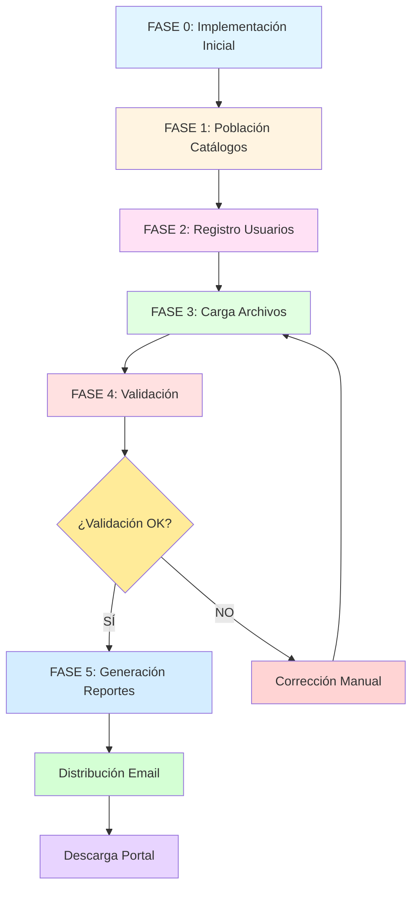
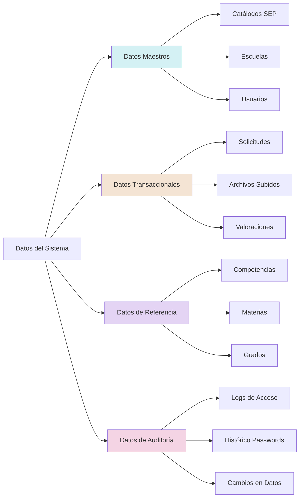
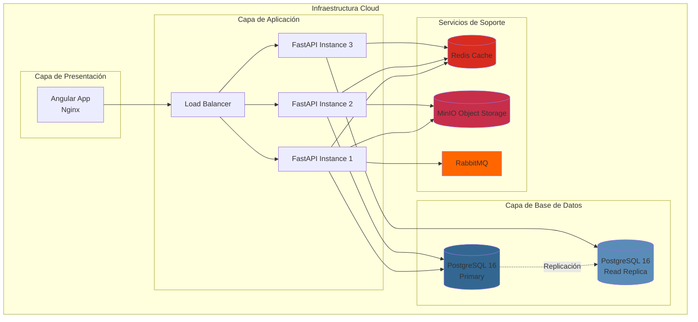
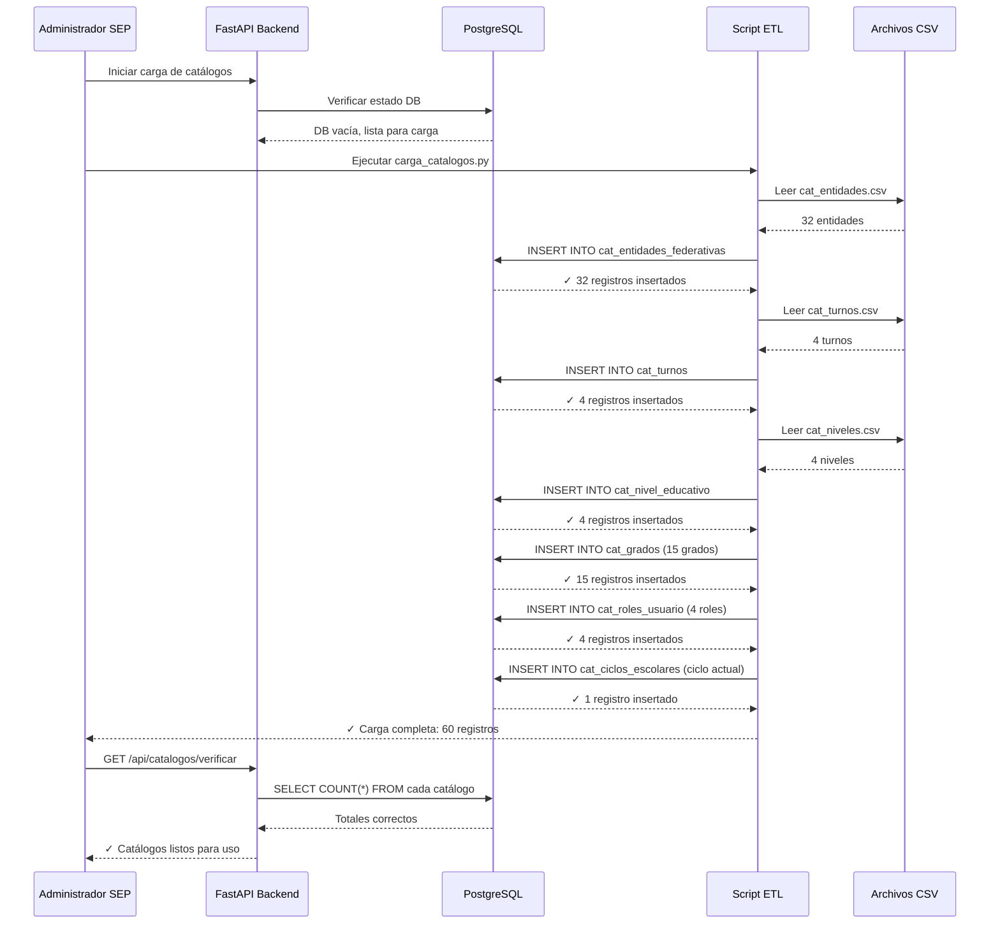

# FLUJO DE DATOS E IMPLEMENTACIÓN - SEP EVALUACIÓN DIAGNÓSTICA
## Sistema de Recepción, Validación y Descarga de Evaluaciones

**Fecha de Creación**: 9 de enero de 2026  
**Autor**: Ingeniero de Software Certificado PSP  
**Versión**: 1.0  
**Propósito**: Documentar el flujo completo de datos desde implementación inicial hasta operación productiva

---

## 📑 Índice

1. [Vista General del Flujo](#1-vista-general-del-flujo)
2. [Fase 0: Implementación Inicial del Sistema](#fase-0-implementación-inicial-del-sistema)
3. [Fase 1: Población de Datos Maestros](#fase-1-población-de-datos-maestros)
4. [Fase 2: Registro y Configuración de Usuarios](#fase-2-registro-y-configuración-de-usuarios)
5. [Fase 3: Carga de Archivos de Valoración](#fase-3-carga-de-archivos-de-valoración)
6. [Fase 4: Validación y Procesamiento](#fase-4-validación-y-procesamiento)
7. [Fase 5: Generación y Distribución de Reportes](#fase-5-generación-y-distribución-de-reportes)
8. [Diagramas de Secuencia Detallados](#8-diagramas-de-secuencia-detallados)
9. [Diagramas de Estado](#9-diagramas-de-estado)
10. [Matriz de Dependencias de Datos](#10-matriz-de-dependencias-de-datos)

---

## 1. Vista General del Flujo

### 1.1 Diagrama de Flujo Macro



### 1.2 Actores del Sistema

| Actor | Rol | Responsabilidades |
|-------|-----|-------------------|
| **Administrador SEP** | Configuración central | - Crear catálogos<br>- Gestionar periodos<br>- Configurar ciclos escolares<br>- Aprobar usuarios |
| **Director de Escuela** | Usuario principal | - Cargar archivos FRV<br>- Revisar validaciones<br>- Descargar reportes<br>- Gestionar docentes |
| **Docente** | Usuario consulta | - Visualizar resultados<br>- Descargar reportes de grupo |
| **Sistema de Archivos** | Automatización | - Procesar archivos en lote<br>- Validar estructuras<br>- Generar reportes PDF |
| **Sistema de Email** | Notificaciones | - Enviar credenciales<br>- Notificar validaciones<br>- Distribuir reportes |

### 1.3 Tipos de Datos en el Sistema



### 1.4 Volumetría Estimada

| Entidad | Registros Iniciales | Crecimiento Anual | Total 5 años |
|---------|---------------------|-------------------|---------------|
| **ESCUELAS** | 230,000 | +2,000 | 240,000 |
| **USUARIOS** (Directores) | 230,000 | +2,000 | 240,000 |
| **USUARIOS** (Docentes) | 1,200,000 | +50,000 | 1,450,000 |
| **ESTUDIANTES** | 25,000,000 | +1,000,000 | 30,000,000 |
| **SOLICITUDES** | 120,000/ciclo | 120,000/ciclo | 600,000 |
| **VALORACIONES** | 150M/ciclo | 150M/ciclo | 750M |
| **REPORTES_GENERADOS** | 500,000/ciclo | 500,000/ciclo | 2.5M |

---

## FASE 0: Implementación Inicial del Sistema

### 2.1 Diagrama de Implementación Física



### 2.2 Script de Creación Completa de Base de Datos

#### Paso 1: Crear Base de Datos y Extensiones

```sql
-- ============================================================================
-- SCRIPT DE CREACIÓN COMPLETA - SEP EVALUACIÓN DIAGNÓSTICA
-- Base de Datos: PostgreSQL 16+
-- Fecha: 2026-01-09
-- ============================================================================

-- 1.1 Crear base de datos
CREATE DATABASE sep_evaluacion_diagnostica
    WITH 
    OWNER = postgres
    ENCODING = 'UTF8'
    LC_COLLATE = 'es_MX.UTF-8'
    LC_CTYPE = 'es_MX.UTF-8'
    TABLESPACE = pg_default
    CONNECTION LIMIT = -1;

\c sep_evaluacion_diagnostica

-- 1.2 Crear extensiones necesarias
CREATE EXTENSION IF NOT EXISTS "uuid-ossp";      -- Generación de UUIDs
CREATE EXTENSION IF NOT EXISTS "pgcrypto";       -- Funciones de encriptación
CREATE EXTENSION IF NOT EXISTS "pg_trgm";        -- Búsquedas de texto
CREATE EXTENSION IF NOT EXISTS "btree_gin";      -- Índices GIN en tipos nativos
CREATE EXTENSION IF NOT EXISTS "pg_stat_statements"; -- Monitoreo de queries

-- 1.3 Crear esquema para funciones personalizadas
CREATE SCHEMA IF NOT EXISTS utils;
CREATE SCHEMA IF NOT EXISTS audit;

-- 1.4 Configurar búsqueda de texto en español
CREATE TEXT SEARCH CONFIGURATION sep_spanish (COPY = spanish);
```

#### Paso 2: Crear Tablas de Catálogos de Estados y Tipos

> **NOTA IMPORTANTE**: Este sistema utiliza **tablas de catálogo** en lugar de tipos ENUM de PostgreSQL para mayor flexibilidad y mantenibilidad. Los catálogos permiten agregar/modificar valores sin cambiar el esquema de la base de datos.

```sql
-- ============================================================================
-- 2. CATÁLOGOS DE ESTADOS Y TIPOS (ENUM Mirrors)
-- ============================================================================
-- Los tipos ENUM fueron reemplazados por tablas de catálogo con estructura unificada:
-- - id: SMALLINT GENERATED ALWAYS AS IDENTITY PRIMARY KEY
-- - codigo: VARCHAR(50) NOT NULL UNIQUE (valor canónico)
-- - descripcion: VARCHAR(200) (texto legible)
-- - orden: SMALLINT NOT NULL (para ordenamiento en UI)
-- - activo: BOOLEAN NOT NULL DEFAULT TRUE (soft delete)

-- 2.1 Catálogo de Niveles Educativos
CREATE TABLE cat_nivel_educativo (
    id SMALLINT GENERATED ALWAYS AS IDENTITY PRIMARY KEY,
    codigo VARCHAR(50) NOT NULL UNIQUE,
    descripcion VARCHAR(200),
    orden SMALLINT NOT NULL,
    activo BOOLEAN NOT NULL DEFAULT TRUE
);

INSERT INTO cat_nivel_educativo (codigo, descripcion, orden) VALUES
    ('PREESCOLAR', 'Preescolar', 1),
    ('PRIMARIA', 'Primaria', 2),
    ('SECUNDARIA', 'Secundaria', 3),
    ('TELESECUNDARIA', 'Telesecundaria', 4);

-- 2.2 Catálogo de Estados de Archivo
CREATE TABLE cat_estado_archivo (
    id SMALLINT GENERATED ALWAYS AS IDENTITY PRIMARY KEY,
    codigo VARCHAR(50) NOT NULL UNIQUE,
    descripcion VARCHAR(200),
    orden SMALLINT NOT NULL,
    activo BOOLEAN NOT NULL DEFAULT TRUE
);

INSERT INTO cat_estado_archivo (codigo, descripcion, orden) VALUES
    ('CARGADO', 'Cargado', 1),
    ('VALIDADO', 'Validado', 2),
    ('PROCESADO', 'Procesado', 3),
    ('ERROR', 'Error', 4);

-- 2.3 Catálogo de Estados de Archivo Temporal
CREATE TABLE cat_estado_archivo_temporal (
    id SMALLINT GENERATED ALWAYS AS IDENTITY PRIMARY KEY,
    codigo VARCHAR(50) NOT NULL UNIQUE,
    descripcion VARCHAR(200),
    orden SMALLINT NOT NULL,
    activo BOOLEAN NOT NULL DEFAULT TRUE
);

INSERT INTO cat_estado_archivo_temporal (codigo, descripcion, orden) VALUES
    ('PENDIENTE', 'Pendiente', 1),
    ('PROCESANDO', 'Procesando', 2),
    ('COMPLETADO', 'Completado', 3),
    ('ERROR', 'Error', 4);

-- 2.4 Catálogo de Tipos de Bloqueo
CREATE TABLE cat_tipo_bloqueo (
    id SMALLINT GENERATED ALWAYS AS IDENTITY PRIMARY KEY,
    codigo VARCHAR(50) NOT NULL UNIQUE,
    descripcion VARCHAR(200),
    orden SMALLINT NOT NULL,
    activo BOOLEAN NOT NULL DEFAULT TRUE
);

INSERT INTO cat_tipo_bloqueo (codigo, descripcion, orden) VALUES
    ('AUTOMATICO', 'Automático', 1),
    ('MANUAL', 'Manual', 2),
    ('PERMANENTE', 'Permanente', 3);

-- 2.5 Catálogo de Estados de Tickets
CREATE TABLE cat_estado_ticket (
    id SMALLINT GENERATED ALWAYS AS IDENTITY PRIMARY KEY,
    codigo VARCHAR(50) NOT NULL UNIQUE,
    descripcion VARCHAR(200),
    orden SMALLINT NOT NULL,
    activo BOOLEAN NOT NULL DEFAULT TRUE
);

INSERT INTO cat_estado_ticket (codigo, descripcion, orden) VALUES
    ('ABIERTO', 'Abierto', 1),
    ('EN_PROCESO', 'En Proceso', 2),
    ('RESUELTO', 'Resuelto', 3),
    ('CERRADO', 'Cerrado', 4);

-- 2.6 Catálogo de Tipos de Reporte
CREATE TABLE cat_tipo_reporte (
    id SMALLINT GENERATED ALWAYS AS IDENTITY PRIMARY KEY,
    codigo VARCHAR(50) NOT NULL UNIQUE,
    descripcion VARCHAR(200),
    orden SMALLINT NOT NULL,
    activo BOOLEAN NOT NULL DEFAULT TRUE
);

INSERT INTO cat_tipo_reporte (codigo, descripcion, orden) VALUES
    ('ENS', 'Ensayo', 1),
    ('HYC', 'Habilidades y Conocimientos', 2),
    ('LEN', 'Lenguaje', 3),
    ('SPC', 'Sesión de Pares Complementarios', 4),
    ('F5', 'Formulario 5', 5);

-- 2.7 Catálogo de Tipos de Notificación
CREATE TABLE cat_tipo_notificacion (
    id SMALLINT GENERATED ALWAYS AS IDENTITY PRIMARY KEY,
    codigo VARCHAR(50) NOT NULL UNIQUE,
    descripcion VARCHAR(200),
    orden SMALLINT NOT NULL,
    activo BOOLEAN NOT NULL DEFAULT TRUE
);

INSERT INTO cat_tipo_notificacion (codigo, descripcion, orden) VALUES
    ('RESULTADO_LISTO', 'Resultado Listo', 1),
    ('TICKET_CREADO', 'Ticket Creado', 2),
    ('TICKET_ACTUALIZADO', 'Ticket Actualizado', 3),
    ('TICKET_RESUELTO', 'Ticket Resuelto', 4),
    ('RECUPERACION_PASSWORD', 'Recuperación Password', 5),
    ('CREDENCIALES_EIA2', 'Credenciales EIA2', 6),
    ('EVALUACION_VALIDADA', 'Evaluación Validada', 7);

-- 2.8 Catálogo de Estados de Notificación
CREATE TABLE cat_estado_notificacion (
    id SMALLINT GENERATED ALWAYS AS IDENTITY PRIMARY KEY,
    codigo VARCHAR(50) NOT NULL UNIQUE,
    descripcion VARCHAR(200),
    orden SMALLINT NOT NULL,
    activo BOOLEAN NOT NULL DEFAULT TRUE
);

INSERT INTO cat_estado_notificacion (codigo, descripcion, orden) VALUES
    ('PENDIENTE', 'Pendiente', 1),
    ('ENVIADO', 'Enviado', 2),
    ('ERROR', 'Error', 3),
    ('REINTENTANDO', 'Reintentando', 4);

-- 2.9 Catálogo de Prioridades de Notificación
CREATE TABLE cat_prioridad_notificacion (
    id SMALLINT GENERATED ALWAYS AS IDENTITY PRIMARY KEY,
    codigo VARCHAR(50) NOT NULL UNIQUE,
    descripcion VARCHAR(200),
    orden SMALLINT NOT NULL,
    activo BOOLEAN NOT NULL DEFAULT TRUE
);

INSERT INTO cat_prioridad_notificacion (codigo, descripcion, orden) VALUES
    ('ALTA', 'Alta', 1),
    ('MEDIA', 'Media', 2),
    ('BAJA', 'Baja', 3);

-- 2.10 Catálogo de Operaciones de Auditoría
CREATE TABLE cat_operacion_auditoria (
    id SMALLINT GENERATED ALWAYS AS IDENTITY PRIMARY KEY,
    codigo VARCHAR(50) NOT NULL UNIQUE,
    descripcion VARCHAR(200),
    orden SMALLINT NOT NULL,
    activo BOOLEAN NOT NULL DEFAULT TRUE
);

INSERT INTO cat_operacion_auditoria (codigo, descripcion, orden) VALUES
    ('INSERT', 'Insertar', 1),
    ('UPDATE', 'Actualizar', 2),
    ('DELETE', 'Eliminar', 3);

-- 2.11 Catálogo de Tipos de Configuración
CREATE TABLE cat_tipo_configuracion (
    id SMALLINT GENERATED ALWAYS AS IDENTITY PRIMARY KEY,
    codigo VARCHAR(50) NOT NULL UNIQUE,
    descripcion VARCHAR(200),
    orden SMALLINT NOT NULL,
    activo BOOLEAN NOT NULL DEFAULT TRUE
);

INSERT INTO cat_tipo_configuracion (codigo, descripcion, orden) VALUES
    ('STRING', 'Cadena de Texto', 1),
    ('INTEGER', 'Número Entero', 2),
    ('BOOLEAN', 'Booleano', 3),
    ('JSON', 'JSON', 4);

-- 2.12 Catálogo de Origen de Cambio de Password
CREATE TABLE cat_origen_cambio_password (
    id SMALLINT GENERATED ALWAYS AS IDENTITY PRIMARY KEY,
    codigo VARCHAR(50) NOT NULL UNIQUE,
    descripcion VARCHAR(200),
    orden SMALLINT NOT NULL,
    activo BOOLEAN NOT NULL DEFAULT TRUE
);

INSERT INTO cat_origen_cambio_password (codigo, descripcion, orden) VALUES
    ('SISTEMA', 'Sistema', 1),
    ('USUARIO', 'Usuario', 2),
    ('ADMIN', 'Administrador', 3),
    ('RECUPERACION', 'Recuperación', 4);

-- 2.13 Catálogo de Estado de Validación EIA2
CREATE TABLE cat_estado_validacion_eia2 (
    id SMALLINT GENERATED ALWAYS AS IDENTITY PRIMARY KEY,
    codigo VARCHAR(50) NOT NULL UNIQUE,
    descripcion VARCHAR(200),
    orden SMALLINT NOT NULL,
    activo BOOLEAN NOT NULL DEFAULT TRUE
);

INSERT INTO cat_estado_validacion_eia2 (codigo, descripcion, orden) VALUES
    ('VALIDO', 'Válido', 1),
    ('INVALIDO', 'Inválido', 2);

-- 2.14 Catálogo de Motivos de Fallo de Login
CREATE TABLE cat_motivo_fallo_login (
    id SMALLINT GENERATED ALWAYS AS IDENTITY PRIMARY KEY,
    codigo VARCHAR(50) NOT NULL UNIQUE,
    descripcion VARCHAR(200),
    orden SMALLINT NOT NULL,
    activo BOOLEAN NOT NULL DEFAULT TRUE
);

INSERT INTO cat_motivo_fallo_login (codigo, descripcion, orden) VALUES
    ('USUARIO_INVALIDO', 'Usuario Inválido', 1),
    ('PASSWORD_INCORRECTO', 'Password Incorrecto', 2),
    ('CUENTA_BLOQUEADA', 'Cuenta Bloqueada', 3),
    ('CUENTA_INACTIVA', 'Cuenta Inactiva', 4),
    ('CUENTA_ELIMINADA', 'Cuenta Eliminada', 5),
    ('PASSWORD_EXPIRADO', 'Password Expirado', 6);

-- 2.15 Catálogo de Estados de Archivo de Ticket
CREATE TABLE cat_estado_archivo_ticket (
    id SMALLINT GENERATED ALWAYS AS IDENTITY PRIMARY KEY,
    codigo VARCHAR(50) NOT NULL UNIQUE,
    descripcion VARCHAR(200),
    orden SMALLINT NOT NULL,
    activo BOOLEAN NOT NULL DEFAULT TRUE
);

INSERT INTO cat_estado_archivo_ticket (codigo, descripcion, orden) VALUES
    ('ACTIVO', 'Activo', 1),
    ('ELIMINADO', 'Eliminado', 2),
    ('CORRUPTO', 'Corrupto', 3),
    ('EN_CUARENTENA', 'En Cuarentena', 4);

-- 2.16 Catálogo de Referencias de Tipo de Notificación
CREATE TABLE cat_referencia_tipo_notificacion (
    id SMALLINT GENERATED ALWAYS AS IDENTITY PRIMARY KEY,
    codigo VARCHAR(50) NOT NULL UNIQUE,
    descripcion VARCHAR(200),
    orden SMALLINT NOT NULL,
    activo BOOLEAN NOT NULL DEFAULT TRUE
);

INSERT INTO cat_referencia_tipo_notificacion (codigo, descripcion, orden) VALUES
    ('TICKET', 'Ticket', 1),
    ('REPORTE', 'Reporte', 2),
    ('USUARIO', 'Usuario', 3),
    ('EVALUACION', 'Evaluación', 4),
    ('CREDENCIAL', 'Credencial', 5);

-- Función helper para obtener IDs de catálogos por código
CREATE OR REPLACE FUNCTION fn_catalogo_id(p_catalogo TEXT, p_codigo TEXT)
RETURNS SMALLINT
LANGUAGE plpgsql
STABLE
AS $$
DECLARE
    v_id SMALLINT;
    v_query TEXT;
BEGIN
    -- Construir query dinámico para buscar en el catálogo especificado
    v_query := format('SELECT id FROM %I WHERE codigo = $1', p_catalogo);
    EXECUTE v_query INTO v_id USING p_codigo;
    
    IF v_id IS NULL THEN
        RAISE EXCEPTION 'Código % no encontrado en catálogo %', p_codigo, p_catalogo;
    END IF;
    
    RETURN v_id;
END;
$$;

COMMENT ON FUNCTION fn_catalogo_id IS 'Obtiene el ID de un catálogo dado su nombre de tabla y código';

-- Ejemplo de uso:
-- SELECT fn_catalogo_id('cat_estado_archivo', 'VALIDADO'); -- retorna el ID del estado VALIDADO
```

#### Paso 3: Crear Tablas de Catálogos de Datos Maestros SEP

```sql
-- ============================================================================
-- 3. CATÁLOGOS DE DATOS MAESTROS SEP
-- ============================================================================
-- Estos catálogos contienen información oficial de la SEP que cambia con poca
-- frecuencia. Usan INT como PK para mantener consistencia con sistemas existentes.

-- 3.1 Catálogo de Ciclos Escolares
CREATE TABLE cat_ciclos_escolares (
    id_ciclo INT PRIMARY KEY,
    nombre VARCHAR(20) NOT NULL UNIQUE,  -- Ej: '2024-2025'
    fecha_inicio DATE NOT NULL,
    fecha_fin DATE NOT NULL,
    activo BOOLEAN NOT NULL DEFAULT FALSE,  -- Solo un ciclo activo a la vez
    created_at TIMESTAMP WITHOUT TIME ZONE NOT NULL DEFAULT NOW(),
    
    CONSTRAINT chk_cat_ciclos_fechas CHECK (fecha_fin > fecha_inicio)
);

COMMENT ON TABLE cat_ciclos_escolares IS 'Ciclos escolares oficiales SEP';
COMMENT ON COLUMN cat_ciclos_escolares.nombre IS 'Formato: YYYY-YYYY (2024-2025)';
COMMENT ON COLUMN cat_ciclos_escolares.activo IS 'Solo un ciclo puede estar activo';

-- 3.2 Catálogo de Entidades Federativas
CREATE TABLE cat_entidades_federativas (
    id_entidad INT PRIMARY KEY,
    nombre VARCHAR(100) NOT NULL,
    abreviatura VARCHAR(10) NOT NULL UNIQUE,
    codigo_sep VARCHAR(5) NOT NULL UNIQUE,  -- Clave oficial SEP (2 dígitos)
    region VARCHAR(50)  -- Norte, Sur, Centro-Norte, Centro-Sur
);

COMMENT ON TABLE cat_entidades_federativas IS 'Catálogo oficial de entidades federativas de México';
COMMENT ON COLUMN cat_entidades_federativas.codigo_sep IS 'Clave SEP: 01-32';

-- 3.3 Catálogo de Turnos Escolares
CREATE TABLE cat_turnos (
    id_turno INT PRIMARY KEY,
    nombre VARCHAR(50) NOT NULL,
    codigo VARCHAR(10) NOT NULL UNIQUE,  -- 'MAT', 'VESP', 'NOCT', 'CONT'
    descripcion VARCHAR(100)
);

COMMENT ON TABLE cat_turnos IS 'Catálogo de turnos escolares oficiales SEP';

-- Datos de turnos estándar
INSERT INTO cat_turnos (id_turno, nombre, codigo, descripcion) VALUES
    (1, 'Matutino', 'MAT', 'Turno matutino (07:00 - 13:00)'),
    (2, 'Vespertino', 'VESP', 'Turno vespertino (13:00 - 19:00)'),
    (3, 'Nocturno', 'NOCT', 'Turno nocturno (19:00 - 22:00)'),
    (4, 'Continuo', 'CONT', 'Turno continuo (jornada completa)')
ON CONFLICT (id_turno) DO NOTHING;

-- 3.4 Catálogo de Grados
-- NOTA: Depende de cat_nivel_educativo creado en Paso 2
CREATE TABLE cat_grados (
    id_grado INT PRIMARY KEY,
    nivel_educativo SMALLINT NOT NULL REFERENCES cat_nivel_educativo(id),
    grado_numero INT NOT NULL,  -- 1, 2, 3, 4, 5, 6
    grado_nombre VARCHAR(20) NOT NULL,  -- 'Primer Grado', 'Segundo Grado'
    orden INT,  -- Para ordenamiento en UI
    
    CONSTRAINT uq_cat_grados UNIQUE (nivel_educativo, grado_numero)
);

COMMENT ON TABLE cat_grados IS 'Catálogo de grados escolares vinculados a niveles educativos';
COMMENT ON COLUMN cat_grados.nivel_educativo IS 'FK a cat_nivel_educativo';

-- Población de grados por nivel educativo
INSERT INTO cat_grados (id_grado, nivel_educativo, grado_numero, grado_nombre, orden) VALUES
    -- Preescolar (nivel_educativo = 1)
    (1, 1, 1, '1° Preescolar', 1),
    (2, 1, 2, '2° Preescolar', 2),
    (3, 1, 3, '3° Preescolar', 3),
    -- Primaria (nivel_educativo = 2)
    (4, 2, 1, '1° Primaria', 4),
    (5, 2, 2, '2° Primaria', 5),
    (6, 2, 3, '3° Primaria', 6),
    (7, 2, 4, '4° Primaria', 7),
    (8, 2, 5, '5° Primaria', 8),
    (9, 2, 6, '6° Primaria', 9),
    -- Secundaria (nivel_educativo = 3)
    (10, 3, 1, '1° Secundaria', 10),
    (11, 3, 2, '2° Secundaria', 11),
    (12, 3, 3, '3° Secundaria', 12),
    -- Telesecundaria (nivel_educativo = 4)
    (13, 4, 1, '1° Telesecundaria', 13),
    (14, 4, 2, '2° Telesecundaria', 14),
    (15, 4, 3, '3° Telesecundaria', 15)
ON CONFLICT (nivel_educativo, grado_numero) DO NOTHING;

-- 3.5 Catálogo de Roles de Usuario
CREATE TABLE cat_roles_usuario (
    id_rol INT PRIMARY KEY,
    nombre VARCHAR(50) NOT NULL,
    codigo VARCHAR(20) NOT NULL UNIQUE,  -- 'DIRECTOR', 'DOCENTE', 'ADMIN', etc.
    descripcion VARCHAR(200),
    permisos JSONB NOT NULL DEFAULT '{}'::JSONB,  -- Permisos específicos del rol
    created_at TIMESTAMP WITHOUT TIME ZONE NOT NULL DEFAULT NOW()
);

COMMENT ON TABLE cat_roles_usuario IS 'Catálogo de roles y permisos del sistema';
COMMENT ON COLUMN cat_roles_usuario.permisos IS 'Estructura JSON con permisos del rol';

-- Población de roles estándar
INSERT INTO cat_roles_usuario (id_rol, nombre, codigo, descripcion, permisos) VALUES
    (1, 'Administrador SEP', 'ADMIN_SEP', 'Administrador central con permisos totales', 
        '{"escuelas": {"crear": true, "leer": true, "actualizar": true, "eliminar": true}, "usuarios": {"crear": true, "leer": true, "actualizar": true, "eliminar": true}, "reportes": {"generar": true, "descargar": true}}'::JSONB),
    (2, 'Director Escuela', 'DIRECTOR', 'Director de escuela con permisos de gestión', 
        '{"archivos": {"subir": true, "descargar": true}, "reportes": {"descargar": true}, "docentes": {"asignar": true}}'::JSONB),
    (3, 'Docente', 'DOCENTE', 'Docente con permisos de consulta', 
        '{"reportes": {"descargar": true, "consultar": true}}'::JSONB),
    (4, 'Soporte Técnico', 'SOPORTE', 'Soporte técnico con permisos de lectura', 
        '{"tickets": {"crear": true, "leer": true, "actualizar": true}, "logs": {"leer": true}}'::JSONB)
ON CONFLICT (id_rol) DO NOTHING;

-- 3.6 Tabla de Materias
CREATE TABLE materias (
    id UUID PRIMARY KEY DEFAULT gen_random_uuid(),
    codigo VARCHAR(10) NOT NULL UNIQUE,
    nombre VARCHAR(100) NOT NULL,
    nivel_educativo SMALLINT NOT NULL REFERENCES cat_nivel_educativo(id),
    orden INT,  -- Para ordenamiento en UI
    activa BOOLEAN NOT NULL DEFAULT TRUE
);

COMMENT ON TABLE materias IS 'Catálogo de materias por nivel educativo';

-- 3.7 Tabla de Competencias
CREATE TABLE competencias (
    id_competencia INT PRIMARY KEY,
    id_materia UUID NOT NULL REFERENCES materias(id),
    codigo VARCHAR(20) NOT NULL,
    descripcion VARCHAR(500) NOT NULL,
    nivel_esperado INT NOT NULL,  -- Nivel de desempeño esperado
    
    UNIQUE (id_materia, codigo)
);

COMMENT ON TABLE competencias IS 'Competencias educativas asociadas a materias';
```

#### Paso 4: Crear Índices en Catálogos

```sql
-- ============================================================================
-- 4. ÍNDICES EN CATÁLOGOS
-- ============================================================================

-- Índices para cat_ciclos_escolares
CREATE INDEX idx_ciclos_activo ON cat_ciclos_escolares(activo) WHERE activo = TRUE;
CREATE INDEX idx_ciclos_fechas ON cat_ciclos_escolares(fecha_inicio, fecha_fin);

-- Índices para cat_entidades_federativas
CREATE INDEX idx_entidades_codigo_sep ON cat_entidades_federativas(codigo_sep);
CREATE INDEX idx_entidades_region ON cat_entidades_federativas(region);

-- Índices para cat_grados
CREATE INDEX idx_grados_nivel ON cat_grados(nivel_educativo, grado_numero);
CREATE INDEX idx_grados_orden ON cat_grados(orden);

-- Índices para cat_roles_usuario
CREATE INDEX idx_roles_codigo ON cat_roles_usuario(codigo);

-- Índices para materias
CREATE INDEX idx_materias_nivel ON materias(nivel_educativo);
CREATE INDEX idx_materias_activa ON materias(activa) WHERE activa = TRUE;

-- Índices para competencias
CREATE INDEX idx_competencias_materia ON competencias(id_materia);
```

---

## FASE 1: Población de Datos Maestros

### 3.1 Diagrama de Secuencia - Carga Inicial



### 3.2 Script Python para Población Inicial

```python
# ============================================================================
# SCRIPT: poblacion_inicial_catalogos.py
# PROPÓSITO: Carga inicial de catálogos maestros en PostgreSQL
# VERSIÓN: 1.0
# ============================================================================

import psycopg2
from psycopg2.extras import execute_batch
import csv
from datetime import datetime, date
import json
import os

class CargaCatalogos:
    def __init__(self, db_config):
        """
        Inicializar conexión a base de datos
        
        Args:
            db_config (dict): {host, port, database, user, password}
        """
        self.conn = psycopg2.connect(**db_config)
        self.cursor = self.conn.cursor()
        self.log = []
        
    def cargar_ciclos_escolares(self):
        """Cargar ciclos escolares desde 2020 hasta 2030"""
        print("📅 Cargando ciclos escolares...")
        
        ciclos = []
        for year in range(2020, 2031):
            ciclo = f"{year}-{year+1}"
            fecha_inicio = date(year, 8, 1)  # 1 de agosto
            fecha_fin = date(year+1, 7, 31)  # 31 de julio
            activo = (year == 2024)  # Solo 2024-2025 activo
            
            ciclos.append((
                ciclo,
                fecha_inicio,
                fecha_fin,
                activo,
                f"Ciclo escolar {ciclo}"
            ))
        
        query = """
            INSERT INTO cat_ciclos_escolares 
            (nombre, fecha_inicio, fecha_fin, activo, created_at)
            VALUES (%s, %s, %s, %s, NOW())
            ON CONFLICT (nombre) DO NOTHING
        """
        
        execute_batch(self.cursor, query, ciclos)
        self.conn.commit()
        self.log.append(f"✓ Ciclos escolares: {len(ciclos)} registros")
        print(f"  ✓ {len(ciclos)} ciclos escolares cargados")
        
    def cargar_entidades_federativas(self):
        """Cargar las 32 entidades federativas de México"""
        print("🗺️  Cargando entidades federativas...")
        
        entidades = [
            ('01', 'Aguascalientes', 'AGS', 'Centro'),
            ('02', 'Baja California', 'BC', 'Norte'),
            ('03', 'Baja California Sur', 'BCS', 'Norte'),
            ('04', 'Campeche', 'CAMP', 'Sur'),
            ('05', 'Coahuila de Zaragoza', 'COAH', 'Norte'),
            ('06', 'Colima', 'COL', 'Centro'),
            ('07', 'Chiapas', 'CHIS', 'Sur'),
            ('08', 'Chihuahua', 'CHIH', 'Norte'),
            ('09', 'Ciudad de México', 'CDMX', 'Centro'),
            ('10', 'Durango', 'DGO', 'Norte'),
            ('11', 'Guanajuato', 'GTO', 'Centro'),
            ('12', 'Guerrero', 'GRO', 'Sur'),
            ('13', 'Hidalgo', 'HGO', 'Centro'),
            ('14', 'Jalisco', 'JAL', 'Centro'),
            ('15', 'México', 'MEX', 'Centro'),
            ('16', 'Michoacán de Ocampo', 'MICH', 'Centro'),
            ('17', 'Morelos', 'MOR', 'Centro'),
            ('18', 'Nayarit', 'NAY', 'Centro'),
            ('19', 'Nuevo León', 'NL', 'Norte'),
            ('20', 'Oaxaca', 'OAX', 'Sur'),
            ('21', 'Puebla', 'PUE', 'Centro'),
            ('22', 'Querétaro', 'QRO', 'Centro'),
            ('23', 'Quintana Roo', 'QROO', 'Sur'),
            ('24', 'San Luis Potosí', 'SLP', 'Centro'),
            ('25', 'Sinaloa', 'SIN', 'Norte'),
            ('26', 'Sonora', 'SON', 'Norte'),
            ('27', 'Tabasco', 'TAB', 'Sur'),
            ('28', 'Tamaulipas', 'TAMPS', 'Norte'),
            ('29', 'Tlaxcala', 'TLAX', 'Centro'),
            ('30', 'Veracruz de Ignacio de la Llave', 'VER', 'Sur'),
            ('31', 'Yucatán', 'YUC', 'Sur'),
            ('32', 'Zacatecas', 'ZAC', 'Centro')
        ]
        
        query = """
            INSERT INTO cat_entidades_federativas 
            (codigo_sep, nombre, abreviatura, region)
            VALUES (%s, %s, %s, %s)
            ON CONFLICT (codigo_sep) DO NOTHING
        """
        
        execute_batch(self.cursor, query, entidades)
        self.conn.commit()
        self.log.append(f"✓ Entidades federativas: {len(entidades)} registros")
        print(f"  ✓ {len(entidades)} entidades federativas cargadas")
        
    def cargar_turnos(self):
        """Cargar catálogo de turnos escolares"""
        print("🕐 Cargando turnos escolares...")
        
        turnos = [
            ('MAT', 'Matutino', 'Turno matutino (07:00 - 13:00)'),
            ('VESP', 'Vespertino', 'Turno vespertino (13:00 - 19:00)'),
            ('NOCT', 'Nocturno', 'Turno nocturno (19:00 - 22:00)'),
            ('CONT', 'Continuo', 'Jornada continua (08:00 - 16:00)')
        ]
        
        query = """
            INSERT INTO cat_turnos (codigo, nombre, descripcion)
            VALUES (%s, %s, %s)
            ON CONFLICT (codigo) DO NOTHING
        """
        
        execute_batch(self.cursor, query, turnos)
        self.conn.commit()
        self.log.append(f"✓ Turnos: {len(turnos)} registros")
        print(f"  ✓ {len(turnos)} turnos cargados")
        
    def cargar_niveles_educativos(self):
        """Cargar niveles educativos"""
        print("📚 Cargando niveles educativos...")
        
        niveles = [
            ('PREESCOLAR', 'Preescolar', 'Educación preescolar (3-5 años)', 1),
            ('PRIMARIA', 'Primaria', 'Educación primaria (6-11 años)', 2),
            ('SECUNDARIA', 'Secundaria', 'Educación secundaria (12-14 años)', 3),
            ('TELESECUNDARIA', 'Telesecundaria', 'Educación telesecundaria (12-14 años)', 4)
        ]
        
        query = """
            INSERT INTO cat_nivel_educativo (codigo, descripcion, orden)
            VALUES (%s, %s, %s)
            ON CONFLICT (codigo) DO NOTHING
            RETURNING id
        """
        
        niveles_ids = {}
        for codigo, _, orden in niveles:
            self.cursor.execute(query, (codigo, f"{_}", orden))
            result = self.cursor.fetchone()
            if result:
                niveles_ids[codigo] = result[0]
            else:
                # Ya existe, obtener ID
                self.cursor.execute(
                    "SELECT id FROM cat_nivel_educativo WHERE codigo = %s",
                    (codigo,)
                )
                niveles_ids[codigo] = self.cursor.fetchone()[0]
        
        self.conn.commit()
        self.log.append(f"✓ Niveles educativos: {len(niveles)} registros")
        print(f"  ✓ {len(niveles)} niveles educativos cargados")
        
        return niveles_ids
        
    def cargar_grados(self, niveles_ids):
        """Cargar grados escolares por nivel"""
        print("🎓 Cargando grados escolares...")
        
        grados = []
        
        # Preescolar: 1°, 2°, 3°
        for grado in range(1, 4):
            grados.append((
                niveles_ids['PREESCOLAR'],
                grado,
                f"{grado}° Preescolar",
                grado + 0  # orden 1, 2, 3
            ))
        
        # Primaria: 1° a 6°
        for grado in range(1, 7):
            grados.append((
                niveles_ids['PRIMARIA'],
                grado,
                f"{grado}° Primaria",
                grado + 3  # orden 4, 5, 6, 7, 8, 9
            ))
        
        # Secundaria: 1° a 3°
        for grado in range(1, 4):
            grados.append((
                niveles_ids['SECUNDARIA'],
                grado,
                f"{grado}° Secundaria",
                grado + 9  # orden 10, 11, 12
            ))
        
        # Telesecundaria: 1° a 3°
        for grado in range(1, 4):
            grados.append((
                niveles_ids['TELESECUNDARIA'],
                grado,
                f"{grado}° Telesecundaria",
                grado + 12  # orden 13, 14, 15
            ))
        
        query = """
            INSERT INTO cat_grados (nivel_educativo, grado_numero, grado_nombre, orden)
            VALUES (%s, %s, %s, %s)
            ON CONFLICT (nivel_educativo, grado_numero) DO NOTHING
        """
        
        execute_batch(self.cursor, query, grados)
        self.conn.commit()
        self.log.append(f"✓ Grados: {len(grados)} registros")
        print(f"  ✓ {len(grados)} grados cargados")
        
    def cargar_roles_usuario(self):
        """Cargar roles de usuario del sistema"""
        print("👥 Cargando roles de usuario...")
        
        roles = [
            (
                'ADMINISTRADOR',
                'Administrador del Sistema',
                'Acceso total al sistema, gestión de catálogos y configuraciones',
                10,
                json.dumps({
                    "leer": True,
                    "escribir": True,
                    "eliminar": True,
                    "gestionar_usuarios": True,
                    "gestionar_catalogos": True,
                    "ver_reportes_globales": True,
                    "configurar_sistema": True
                })
            ),
            (
                'DIRECTOR',
                'Director de Escuela',
                'Gestión de escuela, carga de archivos, visualización de reportes',
                5,
                json.dumps({
                    "leer": True,
                    "escribir": True,
                    "eliminar": False,
                    "cargar_archivos": True,
                    "ver_reportes_escuela": True,
                    "gestionar_docentes": True,
                    "solicitar_soporte": True
                })
            ),
            (
                'DOCENTE',
                'Docente',
                'Consulta de resultados de sus grupos',
                3,
                json.dumps({
                    "leer": True,
                    "escribir": False,
                    "eliminar": False,
                    "ver_reportes_grupo": True,
                    "solicitar_soporte": True
                })
            ),
            (
                'SUPERVISOR',
                'Supervisor de Zona',
                'Visualización de reportes de múltiples escuelas de su zona',
                7,
                json.dumps({
                    "leer": True,
                    "escribir": False,
                    "eliminar": False,
                    "ver_reportes_zona": True,
                    "ver_reportes_globales": True,
                    "solicitar_soporte": True
                })
            ),
            (
                'SOPORTE',
                'Soporte Técnico',
                'Atención de tickets y resolución de problemas',
                6,
                json.dumps({
                    "leer": True,
                    "escribir": True,
                    "eliminar": False,
                    "gestionar_tickets": True,
                    "ver_logs": True,
                    "reintentar_procesos": True
                })
            )
        ]
        
        query = """
            INSERT INTO cat_roles_usuario 
            (codigo, nombre, descripcion, permisos)
            VALUES (%s, %s, %s, %s::jsonb)
            ON CONFLICT (codigo) DO NOTHING
        """
        
        execute_batch(self.cursor, query, roles)
        self.conn.commit()
        self.log.append(f"✓ Roles de usuario: {len(roles)} registros")
        print(f"  ✓ {len(roles)} roles cargados")
        
    def _numero_a_ordinal(self, num):
        """Convertir número a ordinal en español"""
        ordinales = {
            1: 'Primer',
            2: 'Segundo',
            3: 'Tercer',
            4: 'Cuarto',
            5: 'Quinto',
            6: 'Sexto'
        }
        return ordinales.get(num, f"{num}°")
        
    def verificar_carga(self):
        """Verificar que todos los catálogos se cargaron correctamente"""
        print("\n🔍 Verificando carga de catálogos...")
        
        verificaciones = [
            ("cat_ciclos_escolares", 1),
            ("cat_entidades_federativas", 32),
            ("cat_turnos", 4),
            ("cat_nivel_educativo", 4),
            ("cat_grados", 15),
            ("cat_roles_usuario", 4)
        ]
        
        errores = []
        for tabla, esperado in verificaciones:
            self.cursor.execute(f"SELECT COUNT(*) FROM {tabla}")
            actual = self.cursor.fetchone()[0]
            
            if actual == esperado:
                print(f"  ✓ {tabla}: {actual} registros")
            else:
                error = f"  ✗ {tabla}: esperado {esperado}, encontrado {actual}"
                print(error)
                errores.append(error)
        
        return len(errores) == 0
        
    def ejecutar_carga_completa(self):
        """Ejecutar la carga completa de todos los catálogos"""
        print("="*60)
        print("🚀 INICIANDO CARGA DE CATÁLOGOS MAESTROS")
        print("="*60)
        
        try:
            self.cargar_ciclos_escolares()
            self.cargar_entidades_federativas()
            self.cargar_turnos()
            niveles_ids = self.cargar_niveles_educativos()
            self.cargar_grados(niveles_ids)
            self.cargar_roles_usuario()
            
            if self.verificar_carga():
                print("\n" + "="*60)
                print("✅ CARGA COMPLETADA EXITOSAMENTE")
                print("="*60)
                for linea in self.log:
                    print(f"  {linea}")
                return True
            else:
                print("\n" + "="*60)
                print("⚠️  CARGA COMPLETADA CON ADVERTENCIAS")
                print("="*60)
                return False
                
        except Exception as e:
            print(f"\n❌ ERROR durante la carga: {str(e)}")
            self.conn.rollback()
            return False
        finally:
            self.cursor.close()
            self.conn.close()

# ============================================================================
# EJECUCIÓN
# ============================================================================

if __name__ == "__main__":
    # Configuración de base de datos
    DB_CONFIG = {
        'host': 'localhost',
        'port': 5432,
        'database': 'sep_evaluacion_diagnostica',
        'user': 'postgres',
        'password': 'your_password_here'
    }
    
    carga = CargaCatalogos(DB_CONFIG)
    exito = carga.ejecutar_carga_completa()
    
    exit(0 if exito else 1)
```

