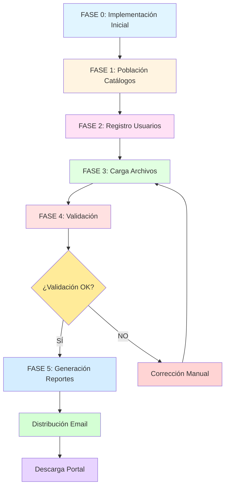
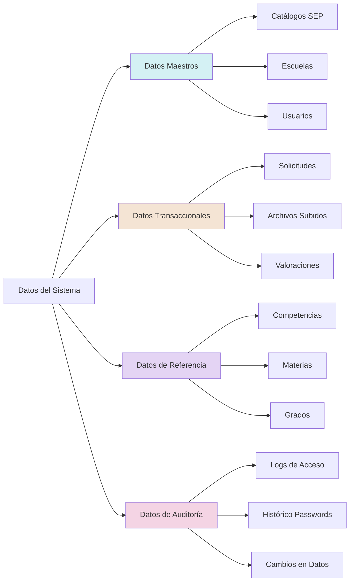
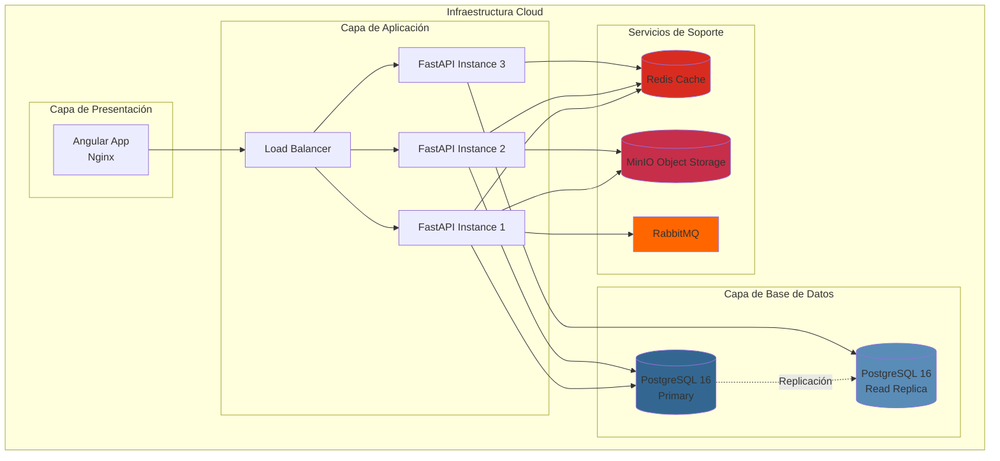
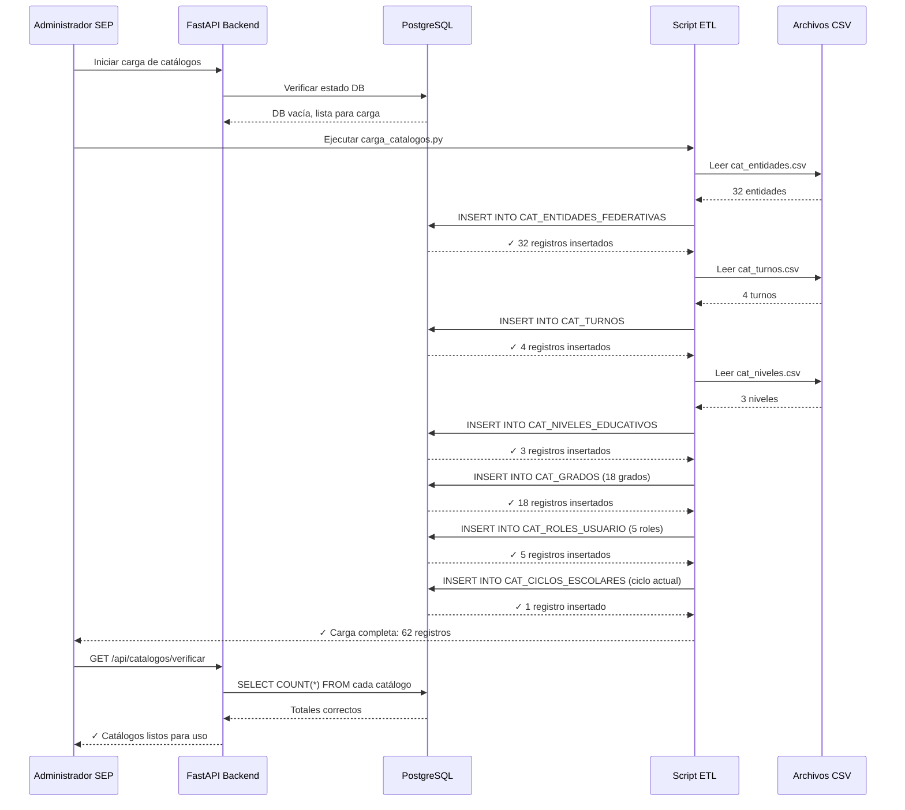

# FLUJO DE DATOS E IMPLEMENTACIÓN - SEP EVALUACIÓN DIAGNÓSTICA
## Sistema de Recepción, Validación y Descarga de Evaluaciones

**Fecha de Creación**: 9 de enero de 2026  
**Autor**: Ingeniero de Software Certificado PSP  
**Versión**: 1.0  
**Propósito**: Documentar el flujo completo de datos desde implementación inicial hasta operación productiva

---

## 📑 Índice

1. [Vista General del Flujo](#1-vista-general-del-flujo)
2. [Fase 0: Implementación Inicial del Sistema](#fase-0-implementación-inicial-del-sistema)
3. [Fase 1: Población de Datos Maestros](#fase-1-población-de-datos-maestros)
4. [Fase 2: Registro y Configuración de Usuarios](#fase-2-registro-y-configuración-de-usuarios)
5. [Fase 3: Carga de Archivos de Valoración](#fase-3-carga-de-archivos-de-valoración)
6. [Fase 4: Validación y Procesamiento](#fase-4-validación-y-procesamiento)
7. [Fase 5: Generación y Distribución de Reportes](#fase-5-generación-y-distribución-de-reportes)
8. [Diagramas de Secuencia Detallados](#8-diagramas-de-secuencia-detallados)
9. [Diagramas de Estado](#9-diagramas-de-estado)
10. [Matriz de Dependencias de Datos](#10-matriz-de-dependencias-de-datos)

---

## 1. Vista General del Flujo

### 1.1 Diagrama de Flujo Macro



### 1.2 Actores del Sistema

| Actor | Rol | Responsabilidades |
|-------|-----|-------------------|
| **Administrador SEP** | Configuración central | - Crear catálogos<br>- Gestionar periodos<br>- Configurar ciclos escolares<br>- Aprobar usuarios |
| **Director de Escuela** | Usuario principal | - Cargar archivos FRV<br>- Revisar validaciones<br>- Descargar reportes<br>- Gestionar docentes |
| **Docente** | Usuario consulta | - Visualizar resultados<br>- Descargar reportes de grupo |
| **Sistema de Archivos** | Automatización | - Procesar archivos en lote<br>- Validar estructuras<br>- Generar reportes PDF |
| **Sistema de Email** | Notificaciones | - Enviar credenciales<br>- Notificar validaciones<br>- Distribuir reportes |

### 1.3 Tipos de Datos en el Sistema



### 1.4 Volumetría Estimada

| Entidad | Registros Iniciales | Crecimiento Anual | Total 5 años |
|---------|---------------------|-------------------|---------------|
| **ESCUELAS** | 230,000 | +2,000 | 240,000 |
| **USUARIOS** (Directores) | 230,000 | +2,000 | 240,000 |
| **USUARIOS** (Docentes) | 1,200,000 | +50,000 | 1,450,000 |
| **ESTUDIANTES** | 25,000,000 | +1,000,000 | 30,000,000 |
| **SOLICITUDES** | 120,000/ciclo | 120,000/ciclo | 600,000 |
| **VALORACIONES** | 150M/ciclo | 150M/ciclo | 750M |
| **REPORTES_GENERADOS** | 500,000/ciclo | 500,000/ciclo | 2.5M |

---

## FASE 0: Implementación Inicial del Sistema

### 2.1 Diagrama de Implementación Física



### 2.2 Script de Creación Completa de Base de Datos

#### Paso 1: Crear Base de Datos y Extensiones

```sql
-- ============================================================================
-- SCRIPT DE CREACIÓN COMPLETA - SEP EVALUACIÓN DIAGNÓSTICA
-- Base de Datos: PostgreSQL 16+
-- Fecha: 2026-01-09
-- ============================================================================

-- 1.1 Crear base de datos
CREATE DATABASE sep_evaluacion_diagnostica
    WITH 
    OWNER = postgres
    ENCODING = 'UTF8'
    LC_COLLATE = 'es_MX.UTF-8'
    LC_CTYPE = 'es_MX.UTF-8'
    TABLESPACE = pg_default
    CONNECTION LIMIT = -1;

\c sep_evaluacion_diagnostica

-- 1.2 Crear extensiones necesarias
CREATE EXTENSION IF NOT EXISTS "uuid-ossp";      -- Generación de UUIDs
CREATE EXTENSION IF NOT EXISTS "pgcrypto";       -- Funciones de encriptación
CREATE EXTENSION IF NOT EXISTS "pg_trgm";        -- Búsquedas de texto
CREATE EXTENSION IF NOT EXISTS "btree_gin";      -- Índices GIN en tipos nativos
CREATE EXTENSION IF NOT EXISTS "pg_stat_statements"; -- Monitoreo de queries

-- 1.3 Crear esquema para funciones personalizadas
CREATE SCHEMA IF NOT EXISTS utils;
CREATE SCHEMA IF NOT EXISTS audit;

-- 1.4 Configurar búsqueda de texto en español
CREATE TEXT SEARCH CONFIGURATION sep_spanish (COPY = spanish);
```

#### Paso 2: Crear ENUM Types

```sql
-- ============================================================================
-- 2. TIPOS ENUMERADOS (ENUM)
-- ============================================================================

-- 2.1 Estados de solicitudes
CREATE TYPE estado_solicitud AS ENUM (
    'PENDIENTE',
    'EN_VALIDACION',
    'VALIDADO',
    'RECHAZADO',
    'PROCESADO',
    'ERROR',
    'CORREGIDO'
);

-- 2.2 Estados de archivos
CREATE TYPE estado_archivo AS ENUM (
    'SUBIDO',
    'EN_VALIDACION',
    'VALIDADO',
    'RECHAZADO',
    'PROCESADO',
    'ELIMINADO'
);

-- 2.3 Tipos de error de validación
CREATE TYPE tipo_error_validacion AS ENUM (
    'ERROR_ESTRUCTURA',
    'ERROR_FORMATO',
    'ERROR_RANGO',
    'ERROR_OBLIGATORIO',
    'ERROR_DUPLICADO',
    'ERROR_REFERENCIA',
    'ERROR_LOGICA',
    'ADVERTENCIA'
);

-- 2.4 Niveles de desempeño
CREATE TYPE nivel_desempeno AS ENUM (
    'INSUFICIENTE',
    'ELEMENTAL',
    'BUENO',
    'EXCELENTE',
    'NO_EVALUADO'
);

-- 2.5 Estados de tickets
CREATE TYPE estado_ticket AS ENUM (
    'ABIERTO',
    'EN_ATENCION',
    'PENDIENTE_USUARIO',
    'RESUELTO',
    'CERRADO',
    'ESCALADO'
);

-- 2.6 Prioridades de tickets
CREATE TYPE prioridad_ticket AS ENUM (
    'BAJA',
    'MEDIA',
    'ALTA',
    'URGENTE',
    'CRITICA'
);

-- 2.7 Tipos de reporte
CREATE TYPE tipo_reporte AS ENUM (
    'INDIVIDUAL',
    'GRUPO',
    'ESCUELA',
    'CONSOLIDADO',
    'COMPARATIVO'
);

-- 2.8 Formato de reporte
CREATE TYPE formato_reporte AS ENUM (
    'PDF',
    'EXCEL',
    'CSV',
    'JSON'
);

-- 2.9 Estados de reportes
CREATE TYPE estado_reporte AS ENUM (
    'PENDIENTE',
    'GENERANDO',
    'GENERADO',
    'ERROR',
    'ENVIADO',
    'DESCARGADO'
);

-- 2.10 Tipos de notificación
CREATE TYPE tipo_notificacion AS ENUM (
    'BIENVENIDA',
    'CREDENCIALES',
    'VALIDACION_OK',
    'VALIDACION_ERROR',
    'REPORTE_DISPONIBLE',
    'PASSWORD_RESET',
    'BLOQUEO_CUENTA',
    'ADVERTENCIA_SISTEMA'
);

-- 2.11 Estados de credenciales EIA
CREATE TYPE estado_credencial AS ENUM (
    'PENDIENTE',
    'APROBADA',
    'RECHAZADA',
    'EXPIRADA',
    'BLOQUEADA'
);

-- 2.12 Aplicaciones EIA
CREATE TYPE aplicacion_eia AS ENUM (
    'EIA_1',
    'EIA_2'
);

-- 2.13 Severidad de logs
CREATE TYPE severidad_log AS ENUM (
    'DEBUG',
    'INFO',
    'WARNING',
    'ERROR',
    'CRITICAL'
);
```

#### Paso 3: Crear Tablas de Catálogos (Datos Maestros)

```sql
-- ============================================================================
-- 3. TABLAS DE CATÁLOGOS (DATOS MAESTROS)
-- ============================================================================

-- 3.1 Catálogo de Ciclos Escolares
CREATE TABLE CAT_CICLOS_ESCOLARES (
    id SERIAL PRIMARY KEY,
    ciclo VARCHAR(9) NOT NULL UNIQUE,  -- Ej: '2024-2025'
    fecha_inicio DATE NOT NULL,
    fecha_fin DATE NOT NULL,
    activo BOOLEAN DEFAULT TRUE,
    descripcion TEXT,
    created_at TIMESTAMP DEFAULT NOW(),
    
    CONSTRAINT chk_ciclo_formato CHECK (ciclo ~ '^\d{4}-\d{4}$'),
    CONSTRAINT chk_ciclo_fechas CHECK (fecha_inicio < fecha_fin)
);

COMMENT ON TABLE CAT_CICLOS_ESCOLARES IS 'Catálogo de ciclos escolares oficiales SEP';
COMMENT ON COLUMN CAT_CICLOS_ESCOLARES.ciclo IS 'Formato: YYYY-YYYY (2024-2025)';

-- 3.2 Catálogo de Entidades Federativas
CREATE TABLE CAT_ENTIDADES_FEDERATIVAS (
    id SERIAL PRIMARY KEY,
    clave CHAR(2) NOT NULL UNIQUE,  -- Clave oficial SEP
    nombre VARCHAR(100) NOT NULL,
    abreviatura VARCHAR(10),
    region VARCHAR(50),  -- Norte, Sur, Centro, etc.
    activo BOOLEAN DEFAULT TRUE,
    created_at TIMESTAMP DEFAULT NOW()
);

COMMENT ON TABLE CAT_ENTIDADES_FEDERATIVAS IS 'Catálogo oficial de entidades federativas de México';

-- 3.3 Catálogo de Turnos Escolares
CREATE TABLE CAT_TURNOS (
    id SERIAL PRIMARY KEY,
    codigo VARCHAR(10) NOT NULL UNIQUE,  -- 'MAT', 'VESP', 'NOCT', 'CONT'
    nombre VARCHAR(50) NOT NULL,
    descripcion TEXT,
    activo BOOLEAN DEFAULT TRUE,
    created_at TIMESTAMP DEFAULT NOW()
);

COMMENT ON TABLE CAT_TURNOS IS 'Catálogo de turnos escolares (Matutino, Vespertino, Nocturno, Continuo)';

-- 3.4 Catálogo de Niveles Educativos
CREATE TABLE CAT_NIVELES_EDUCATIVOS (
    id SERIAL PRIMARY KEY,
    codigo VARCHAR(10) NOT NULL UNIQUE,  -- 'PRE', 'PRI', 'SEC'
    nombre VARCHAR(50) NOT NULL,
    descripcion TEXT,
    orden INT NOT NULL,  -- Para ordenamiento
    activo BOOLEAN DEFAULT TRUE,
    created_at TIMESTAMP DEFAULT NOW(),
    
    CONSTRAINT uq_niveles_orden UNIQUE (orden)
);

COMMENT ON TABLE CAT_NIVELES_EDUCATIVOS IS 'Catálogo de niveles educativos (Preescolar, Primaria, Secundaria)';

-- 3.5 Catálogo de Grados
CREATE TABLE CAT_GRADOS (
    id SERIAL PRIMARY KEY,
    nivel_educativo_id INT NOT NULL REFERENCES CAT_NIVELES_EDUCATIVOS(id),
    grado INT NOT NULL,  -- 1, 2, 3, 4, 5, 6
    nombre VARCHAR(50) NOT NULL,  -- 'Primer Grado', 'Segundo Grado'
    abreviatura VARCHAR(10),  -- '1°', '2°', '3°'
    activo BOOLEAN DEFAULT TRUE,
    created_at TIMESTAMP DEFAULT NOW(),
    
    CONSTRAINT uq_grados_nivel UNIQUE (nivel_educativo_id, grado),
    CONSTRAINT chk_grado_rango CHECK (grado BETWEEN 1 AND 6)
);

COMMENT ON TABLE CAT_GRADOS IS 'Catálogo de grados escolares por nivel educativo';

-- 3.6 Catálogo de Roles de Usuario
CREATE TABLE CAT_ROLES_USUARIO (
    id SERIAL PRIMARY KEY,
    codigo VARCHAR(20) NOT NULL UNIQUE,  -- 'DIRECTOR', 'DOCENTE', 'ADMIN'
    nombre VARCHAR(50) NOT NULL,
    descripcion TEXT,
    nivel_acceso INT NOT NULL,  -- 1=básico, 10=admin
    permisos JSONB,  -- {"leer": true, "escribir": false, ...}
    activo BOOLEAN DEFAULT TRUE,
    created_at TIMESTAMP DEFAULT NOW(),
    
    CONSTRAINT chk_nivel_acceso CHECK (nivel_acceso BETWEEN 1 AND 10)
);

COMMENT ON TABLE CAT_ROLES_USUARIO IS 'Catálogo de roles y permisos del sistema';
COMMENT ON COLUMN CAT_ROLES_USUARIO.permisos IS 'JSON con permisos específicos del rol';
```

#### Paso 4: Crear Índices en Catálogos

```sql
-- ============================================================================
-- 4. ÍNDICES EN CATÁLOGOS
-- ============================================================================

CREATE INDEX idx_ciclos_activo ON CAT_CICLOS_ESCOLARES(activo) WHERE activo = TRUE;
CREATE INDEX idx_ciclos_fechas ON CAT_CICLOS_ESCOLARES(fecha_inicio, fecha_fin);

CREATE INDEX idx_entidades_clave ON CAT_ENTIDADES_FEDERATIVAS(clave);
CREATE INDEX idx_entidades_region ON CAT_ENTIDADES_FEDERATIVAS(region);

CREATE INDEX idx_grados_nivel ON CAT_GRADOS(nivel_educativo_id, grado);
CREATE INDEX idx_grados_activo ON CAT_GRADOS(activo) WHERE activo = TRUE;

CREATE INDEX idx_roles_codigo ON CAT_ROLES_USUARIO(codigo);
CREATE INDEX idx_roles_nivel ON CAT_ROLES_USUARIO(nivel_acceso);
```

---

## FASE 1: Población de Datos Maestros

### 3.1 Diagrama de Secuencia - Carga Inicial



### 3.2 Script Python para Población Inicial

```python
# ============================================================================
# SCRIPT: poblacion_inicial_catalogos.py
# PROPÓSITO: Carga inicial de catálogos maestros en PostgreSQL
# VERSIÓN: 1.0
# ============================================================================

import psycopg2
from psycopg2.extras import execute_batch
import csv
from datetime import datetime, date
import json
import os

class CargaCatalogos:
    def __init__(self, db_config):
        """
        Inicializar conexión a base de datos
        
        Args:
            db_config (dict): {host, port, database, user, password}
        """
        self.conn = psycopg2.connect(**db_config)
        self.cursor = self.conn.cursor()
        self.log = []
        
    def cargar_ciclos_escolares(self):
        """Cargar ciclos escolares desde 2020 hasta 2030"""
        print("📅 Cargando ciclos escolares...")
        
        ciclos = []
        for year in range(2020, 2031):
            ciclo = f"{year}-{year+1}"
            fecha_inicio = date(year, 8, 1)  # 1 de agosto
            fecha_fin = date(year+1, 7, 31)  # 31 de julio
            activo = (year == 2024)  # Solo 2024-2025 activo
            
            ciclos.append((
                ciclo,
                fecha_inicio,
                fecha_fin,
                activo,
                f"Ciclo escolar {ciclo}"
            ))
        
        query = """
            INSERT INTO CAT_CICLOS_ESCOLARES 
            (ciclo, fecha_inicio, fecha_fin, activo, descripcion)
            VALUES (%s, %s, %s, %s, %s)
            ON CONFLICT (ciclo) DO NOTHING
        """
        
        execute_batch(self.cursor, query, ciclos)
        self.conn.commit()
        self.log.append(f"✓ Ciclos escolares: {len(ciclos)} registros")
        print(f"  ✓ {len(ciclos)} ciclos escolares cargados")
        
    def cargar_entidades_federativas(self):
        """Cargar las 32 entidades federativas de México"""
        print("🗺️  Cargando entidades federativas...")
        
        entidades = [
            ('01', 'Aguascalientes', 'AGS', 'Centro'),
            ('02', 'Baja California', 'BC', 'Norte'),
            ('03', 'Baja California Sur', 'BCS', 'Norte'),
            ('04', 'Campeche', 'CAMP', 'Sur'),
            ('05', 'Coahuila de Zaragoza', 'COAH', 'Norte'),
            ('06', 'Colima', 'COL', 'Centro'),
            ('07', 'Chiapas', 'CHIS', 'Sur'),
            ('08', 'Chihuahua', 'CHIH', 'Norte'),
            ('09', 'Ciudad de México', 'CDMX', 'Centro'),
            ('10', 'Durango', 'DGO', 'Norte'),
            ('11', 'Guanajuato', 'GTO', 'Centro'),
            ('12', 'Guerrero', 'GRO', 'Sur'),
            ('13', 'Hidalgo', 'HGO', 'Centro'),
            ('14', 'Jalisco', 'JAL', 'Centro'),
            ('15', 'México', 'MEX', 'Centro'),
            ('16', 'Michoacán de Ocampo', 'MICH', 'Centro'),
            ('17', 'Morelos', 'MOR', 'Centro'),
            ('18', 'Nayarit', 'NAY', 'Centro'),
            ('19', 'Nuevo León', 'NL', 'Norte'),
            ('20', 'Oaxaca', 'OAX', 'Sur'),
            ('21', 'Puebla', 'PUE', 'Centro'),
            ('22', 'Querétaro', 'QRO', 'Centro'),
            ('23', 'Quintana Roo', 'QROO', 'Sur'),
            ('24', 'San Luis Potosí', 'SLP', 'Centro'),
            ('25', 'Sinaloa', 'SIN', 'Norte'),
            ('26', 'Sonora', 'SON', 'Norte'),
            ('27', 'Tabasco', 'TAB', 'Sur'),
            ('28', 'Tamaulipas', 'TAMPS', 'Norte'),
            ('29', 'Tlaxcala', 'TLAX', 'Centro'),
            ('30', 'Veracruz de Ignacio de la Llave', 'VER', 'Sur'),
            ('31', 'Yucatán', 'YUC', 'Sur'),
            ('32', 'Zacatecas', 'ZAC', 'Centro')
        ]
        
        query = """
            INSERT INTO CAT_ENTIDADES_FEDERATIVAS 
            (clave, nombre, abreviatura, region)
            VALUES (%s, %s, %s, %s)
            ON CONFLICT (clave) DO NOTHING
        """
        
        execute_batch(self.cursor, query, entidades)
        self.conn.commit()
        self.log.append(f"✓ Entidades federativas: {len(entidades)} registros")
        print(f"  ✓ {len(entidades)} entidades federativas cargadas")
        
    def cargar_turnos(self):
        """Cargar catálogo de turnos escolares"""
        print("🕐 Cargando turnos escolares...")
        
        turnos = [
            ('MAT', 'Matutino', 'Turno matutino (07:00 - 13:00)'),
            ('VESP', 'Vespertino', 'Turno vespertino (13:00 - 19:00)'),
            ('NOCT', 'Nocturno', 'Turno nocturno (19:00 - 22:00)'),
            ('CONT', 'Continuo', 'Jornada continua (08:00 - 16:00)')
        ]
        
        query = """
            INSERT INTO CAT_TURNOS (codigo, nombre, descripcion)
            VALUES (%s, %s, %s)
            ON CONFLICT (codigo) DO NOTHING
        """
        
        execute_batch(self.cursor, query, turnos)
        self.conn.commit()
        self.log.append(f"✓ Turnos: {len(turnos)} registros")
        print(f"  ✓ {len(turnos)} turnos cargados")
        
    def cargar_niveles_educativos(self):
        """Cargar niveles educativos"""
        print("📚 Cargando niveles educativos...")
        
        niveles = [
            ('PRE', 'Preescolar', 'Educación preescolar (3-5 años)', 1),
            ('PRI', 'Primaria', 'Educación primaria (6-11 años)', 2),
            ('SEC', 'Secundaria', 'Educación secundaria (12-14 años)', 3)
        ]
        
        query = """
            INSERT INTO CAT_NIVELES_EDUCATIVOS (codigo, nombre, descripcion, orden)
            VALUES (%s, %s, %s, %s)
            ON CONFLICT (codigo) DO NOTHING
            RETURNING id
        """
        
        niveles_ids = {}
        for nivel in niveles:
            self.cursor.execute(query, nivel)
            result = self.cursor.fetchone()
            if result:
                niveles_ids[nivel[0]] = result[0]
            else:
                # Ya existe, obtener ID
                self.cursor.execute(
                    "SELECT id FROM CAT_NIVELES_EDUCATIVOS WHERE codigo = %s",
                    (nivel[0],)
                )
                niveles_ids[nivel[0]] = self.cursor.fetchone()[0]
        
        self.conn.commit()
        self.log.append(f"✓ Niveles educativos: {len(niveles)} registros")
        print(f"  ✓ {len(niveles)} niveles educativos cargados")
        
        return niveles_ids
        
    def cargar_grados(self, niveles_ids):
        """Cargar grados escolares por nivel"""
        print("🎓 Cargando grados escolares...")
        
        grados = []
        
        # Preescolar: 1°, 2°, 3°
        for grado in range(1, 4):
            grados.append((
                niveles_ids['PRE'],
                grado,
                f"{self._numero_a_ordinal(grado)} Grado de Preescolar",
                f"{grado}° PRE"
            ))
        
        # Primaria: 1° a 6°
        for grado in range(1, 7):
            grados.append((
                niveles_ids['PRI'],
                grado,
                f"{self._numero_a_ordinal(grado)} Grado de Primaria",
                f"{grado}° PRI"
            ))
        
        # Secundaria: 1° a 3°
        for grado in range(1, 4):
            grados.append((
                niveles_ids['SEC'],
                grado,
                f"{self._numero_a_ordinal(grado)} Grado de Secundaria",
                f"{grado}° SEC"
            ))
        
        query = """
            INSERT INTO CAT_GRADOS (nivel_educativo_id, grado, nombre, abreviatura)
            VALUES (%s, %s, %s, %s)
            ON CONFLICT (nivel_educativo_id, grado) DO NOTHING
        """
        
        execute_batch(self.cursor, query, grados)
        self.conn.commit()
        self.log.append(f"✓ Grados: {len(grados)} registros")
        print(f"  ✓ {len(grados)} grados cargados")
        
    def cargar_roles_usuario(self):
        """Cargar roles de usuario del sistema"""
        print("👥 Cargando roles de usuario...")
        
        roles = [
            (
                'ADMINISTRADOR',
                'Administrador del Sistema',
                'Acceso total al sistema, gestión de catálogos y configuraciones',
                10,
                json.dumps({
                    "leer": True,
                    "escribir": True,
                    "eliminar": True,
                    "gestionar_usuarios": True,
                    "gestionar_catalogos": True,
                    "ver_reportes_globales": True,
                    "configurar_sistema": True
                })
            ),
            (
                'DIRECTOR',
                'Director de Escuela',
                'Gestión de escuela, carga de archivos, visualización de reportes',
                5,
                json.dumps({
                    "leer": True,
                    "escribir": True,
                    "eliminar": False,
                    "cargar_archivos": True,
                    "ver_reportes_escuela": True,
                    "gestionar_docentes": True,
                    "solicitar_soporte": True
                })
            ),
            (
                'DOCENTE',
                'Docente',
                'Consulta de resultados de sus grupos',
                3,
                json.dumps({
                    "leer": True,
                    "escribir": False,
                    "eliminar": False,
                    "ver_reportes_grupo": True,
                    "solicitar_soporte": True
                })
            ),
            (
                'SUPERVISOR',
                'Supervisor de Zona',
                'Visualización de reportes de múltiples escuelas de su zona',
                7,
                json.dumps({
                    "leer": True,
                    "escribir": False,
                    "eliminar": False,
                    "ver_reportes_zona": True,
                    "ver_reportes_globales": True,
                    "solicitar_soporte": True
                })
            ),
            (
                'SOPORTE',
                'Soporte Técnico',
                'Atención de tickets y resolución de problemas',
                6,
                json.dumps({
                    "leer": True,
                    "escribir": True,
                    "eliminar": False,
                    "gestionar_tickets": True,
                    "ver_logs": True,
                    "reintentar_procesos": True
                })
            )
        ]
        
        query = """
            INSERT INTO CAT_ROLES_USUARIO 
            (codigo, nombre, descripcion, nivel_acceso, permisos)
            VALUES (%s, %s, %s, %s, %s::jsonb)
            ON CONFLICT (codigo) DO NOTHING
        """
        
        execute_batch(self.cursor, query, roles)
        self.conn.commit()
        self.log.append(f"✓ Roles de usuario: {len(roles)} registros")
        print(f"  ✓ {len(roles)} roles cargados")
        
    def _numero_a_ordinal(self, num):
        """Convertir número a ordinal en español"""
        ordinales = {
            1: 'Primer',
            2: 'Segundo',
            3: 'Tercer',
            4: 'Cuarto',
            5: 'Quinto',
            6: 'Sexto'
        }
        return ordinales.get(num, f"{num}°")
        
    def verificar_carga(self):
        """Verificar que todos los catálogos se cargaron correctamente"""
        print("\n🔍 Verificando carga de catálogos...")
        
        verificaciones = [
            ("CAT_CICLOS_ESCOLARES", 11),
            ("CAT_ENTIDADES_FEDERATIVAS", 32),
            ("CAT_TURNOS", 4),
            ("CAT_NIVELES_EDUCATIVOS", 3),
            ("CAT_GRADOS", 12),
            ("CAT_ROLES_USUARIO", 5)
        ]
        
        errores = []
        for tabla, esperado in verificaciones:
            self.cursor.execute(f"SELECT COUNT(*) FROM {tabla}")
            actual = self.cursor.fetchone()[0]
            
            if actual == esperado:
                print(f"  ✓ {tabla}: {actual} registros")
            else:
                error = f"  ✗ {tabla}: esperado {esperado}, encontrado {actual}"
                print(error)
                errores.append(error)
        
        return len(errores) == 0
        
    def ejecutar_carga_completa(self):
        """Ejecutar la carga completa de todos los catálogos"""
        print("="*60)
        print("🚀 INICIANDO CARGA DE CATÁLOGOS MAESTROS")
        print("="*60)
        
        try:
            self.cargar_ciclos_escolares()
            self.cargar_entidades_federativas()
            self.cargar_turnos()
            niveles_ids = self.cargar_niveles_educativos()
            self.cargar_grados(niveles_ids)
            self.cargar_roles_usuario()
            
            if self.verificar_carga():
                print("\n" + "="*60)
                print("✅ CARGA COMPLETADA EXITOSAMENTE")
                print("="*60)
                for linea in self.log:
                    print(f"  {linea}")
                return True
            else:
                print("\n" + "="*60)
                print("⚠️  CARGA COMPLETADA CON ADVERTENCIAS")
                print("="*60)
                return False
                
        except Exception as e:
            print(f"\n❌ ERROR durante la carga: {str(e)}")
            self.conn.rollback()
            return False
        finally:
            self.cursor.close()
            self.conn.close()

# ============================================================================
# EJECUCIÓN
# ============================================================================

if __name__ == "__main__":
    # Configuración de base de datos
    DB_CONFIG = {
        'host': 'localhost',
        'port': 5432,
        'database': 'sep_evaluacion_diagnostica',
        'user': 'postgres',
        'password': 'your_password_here'
    }
    
    carga = CargaCatalogos(DB_CONFIG)
    exito = carga.ejecutar_carga_completa()
    
    exit(0 if exito else 1)
```

