# 📊 FLUJO DE DATOS COMPLETO - Sistema de Evaluación Diagnóstica SEP

**Versión:** 1.0  
**Fecha:** 9 de enero de 2026  
**Autor:** Equipo de Desarrollo - Certificación PSP  
**Proyecto:** Plataforma de Recepción, Validación y Descarga de Evaluaciones Diagnósticas

---

## 📑 Índice

1. [Introducción y Contexto](#1-introducción-y-contexto)
2. [Fase 0: Implementación Inicial del Sistema](#2-fase-0-implementación-inicial-del-sistema)
3. [Fase 1: Población de Catálogos y Datos Maestros](#3-fase-1-población-de-catálogos-y-datos-maestros)
4. [Fase 2: Carga de Escuelas y Creación de Usuarios](#4-fase-2-carga-de-escuelas-y-creación-de-usuarios)
5. [Fase 3: Configuración de Periodo de Evaluación](#5-fase-3-configuración-de-periodo-de-evaluación)
6. [Fase 4: Registro y Autenticación de Usuarios](#6-fase-4-registro-y-autenticación-de-usuarios)
7. [Fase 5: Carga de Archivos de Valoración (.xlsx)](#7-fase-5-carga-de-archivos-de-valoración)
8. [Fase 6: Validación y Procesamiento de Archivos](#8-fase-6-validación-y-procesamiento-de-archivos)
9. [Fase 7: Generación de Reportes PDF](#9-fase-7-generación-de-reportes-pdf)
10. [Fase 8: Descarga de Archivos DBF](#10-fase-8-descarga-de-archivos-dbf)
11. [Fase 9: Segunda Aplicación EIA2](#11-fase-9-segunda-aplicación-eia2)
12. [Flujos de Excepción y Soporte](#12-flujos-de-excepción-y-soporte)
13. [Monitoreo y Métricas](#13-monitoreo-y-métricas)

---

## 1. Introducción y Contexto

### 1.1 Propósito del Documento

Este documento describe el **flujo completo de datos** del Sistema de Evaluación Diagnóstica de la SEP, desde la implementación inicial hasta la operación diaria. Está diseñado para:

- **Administradores de Sistemas**: Comprender cómo poblar y mantener la base de datos
- **Desarrolladores**: Entender las dependencias entre componentes
- **DBAs**: Conocer el ciclo de vida de los datos
- **Auditores/PSP**: Validar procesos y trazabilidad

### 1.2 Alcance del Sistema

**Usuarios finales:** ~230,000 escuelas públicas de México  
**Volumen esperado:** 120,000+ solicitudes de validación por ciclo escolar  
**Periodo operativo:** Agosto - Diciembre (ciclo escolar)  
**Datos procesados:** Archivos .xlsx → Validación → Reportes PDF + Archivos .DBF

### 1.3 Arquitectura de Datos

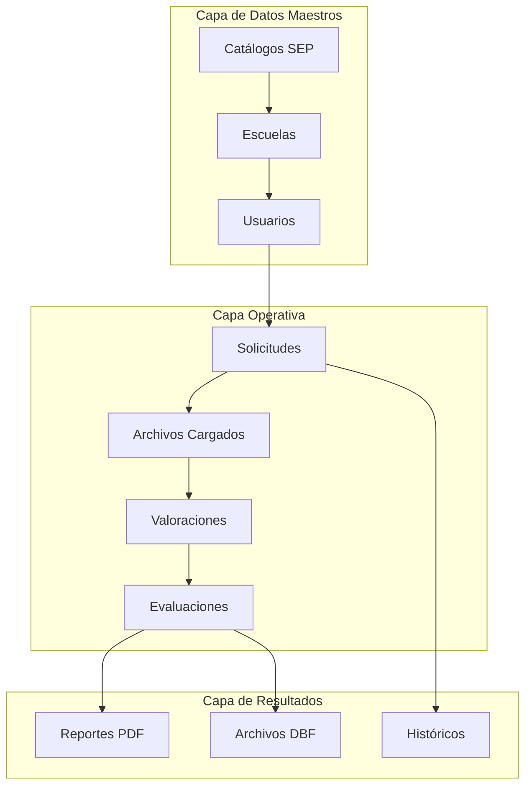
```mermaid
graph TB
    subgraph "Capa de Datos Maestros"
        CAT[Catálogos SEP]
        ESC[Escuelas]
        USR[Usuarios]
    end
    
    subgraph "Capa Operativa"
        SOL[Solicitudes]
        ARCH[Archivos Cargados]
        VAL[Valoraciones]
        EVAL[Evaluaciones]
    end
    
    subgraph "Capa de Resultados"
        REP[Reportes PDF]
        DBF[Archivos DBF]
        HIST[Históricos]
    end
    
    CAT --> ESC
    ESC --> USR
    USR --> SOL
    SOL --> ARCH
    ARCH --> VAL
    VAL --> EVAL
    EVAL --> REP
    EVAL --> DBF
    SOL --> HIST
```

---

## 2. Fase 0: Implementación Inicial del Sistema

### 2.1 Creación de Base de Datos

**Responsable:** DBA  
**Momento:** Primera instalación del sistema  
**Frecuencia:** Una sola vez (o por ambiente: dev/test/prod)

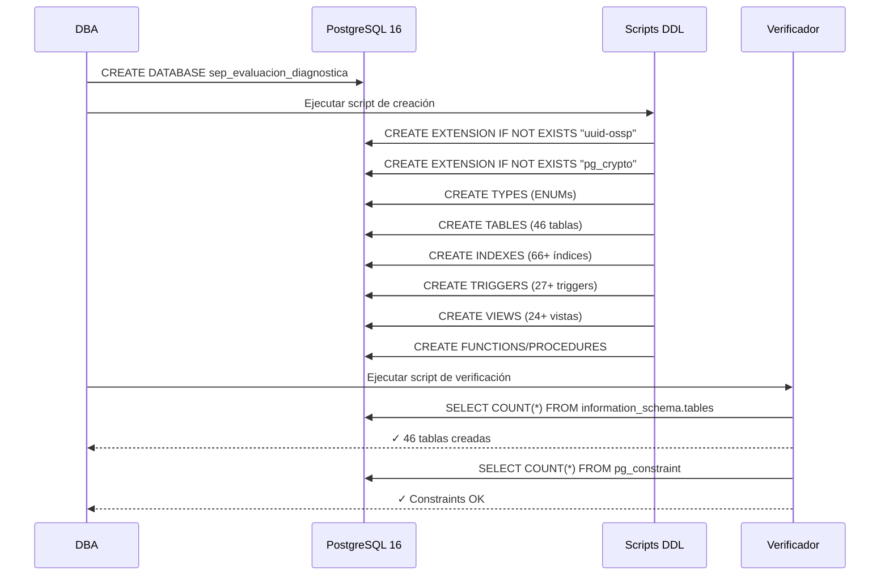
```mermaid
sequenceDiagram
    participant DBA
    participant PG as PostgreSQL 16
    participant DDL as Scripts DDL
    participant VER as Verificador
    
    DBA->>PG: CREATE DATABASE sep_evaluacion_diagnostica
    DBA->>DDL: Ejecutar script de creación
    DDL->>PG: CREATE EXTENSION IF NOT EXISTS "uuid-ossp"
    DDL->>PG: CREATE EXTENSION IF NOT EXISTS "pg_crypto"
    DDL->>PG: CREATE TYPES (ENUMs)
    DDL->>PG: CREATE TABLES (46 tablas)
    DDL->>PG: CREATE INDEXES (66+ índices)
    DDL->>PG: CREATE TRIGGERS (27+ triggers)
    DDL->>PG: CREATE VIEWS (24+ vistas)
    DDL->>PG: CREATE FUNCTIONS/PROCEDURES
    DBA->>VER: Ejecutar script de verificación
    VER->>PG: SELECT COUNT(*) FROM information_schema.tables
    VER-->>DBA: ✓ 46 tablas creadas
    VER->>PG: SELECT COUNT(*) FROM pg_constraint
    VER-->>DBA: ✓ Constraints OK
```

#### Script de Creación Inicial

```sql
-- 1. Crear base de datos
CREATE DATABASE sep_evaluacion_diagnostica
    WITH ENCODING='UTF8'
    LC_COLLATE='es_MX.UTF-8'
    LC_CTYPE='es_MX.UTF-8'
    TEMPLATE=template0;

\c sep_evaluacion_diagnostica;

-- 2. Extensiones
CREATE EXTENSION IF NOT EXISTS "uuid-ossp";
CREATE EXTENSION IF NOT EXISTS "pgcrypto";

-- 3. Schema de auditoría
CREATE SCHEMA IF NOT EXISTS auditoria;

-- 4. ENUMs (13 tipos)
CREATE TYPE tipo_evaluacion AS ENUM ('DIAGNOSTICA', 'FORMATIVA', 'SUMATIVA');
CREATE TYPE nivel_desempeno AS ENUM ('I', 'II', 'III', 'IV');
CREATE TYPE tipo_campo AS ENUM ('LECTURA', 'FORMACION_CIVICA_ETICA', 'MATEMATICAS');
CREATE TYPE estado_solicitud AS ENUM ('PENDIENTE', 'EN_PROCESO', 'VALIDADO', 'RECHAZADO', 'DESCARGADO');
CREATE TYPE estado_ticket AS ENUM ('ABIERTO', 'EN_PROCESO', 'RESUELTO', 'CERRADO', 'ESCALADO');
CREATE TYPE prioridad_ticket AS ENUM ('BAJA', 'MEDIA', 'ALTA', 'URGENTE');
CREATE TYPE tipo_usuario_ticket AS ENUM ('SOLICITANTE', 'SOPORTE');
CREATE TYPE tipo_archivo AS ENUM ('VALORACION', 'REPORTE_PDF', 'DBF', 'OTRO');
CREATE TYPE resultado_validacion AS ENUM ('EXITOSO', 'ADVERTENCIAS', 'ERRORES_CRITICOS');
CREATE TYPE turno_escolar AS ENUM ('MATUTINO', 'VESPERTINO', 'NOCTURNO', 'JORNADA_AMPLIADA', 'TIEMPO_COMPLETO');
CREATE TYPE tipo_reporte AS ENUM ('INDIVIDUAL', 'GRUPAL', 'ESCUELA', 'ZONA');
CREATE TYPE tipo_notificacion AS ENUM ('SOLICITUD_RECIBIDA', 'VALIDACION_COMPLETA', 'REPORTE_LISTO', 'ERROR_VALIDACION', 'TICKET_ACTUALIZADO');
CREATE TYPE formato_descarga AS ENUM ('PDF', 'DBF', 'XLSX', 'ZIP');

-- 5. Crear tablas en orden de dependencias
-- (Ver ESTRUCTURA_DE_DATOS.md para scripts completos)
```

### 2.2 Verificación Post-Instalación

```sql
-- Script de verificación
DO $$
DECLARE
    v_tabla_count INT;
    v_index_count INT;
    v_trigger_count INT;
    v_errors TEXT := '';
BEGIN
    -- Contar tablas
    SELECT COUNT(*) INTO v_tabla_count
    FROM information_schema.tables
    WHERE table_schema = 'public' AND table_type = 'BASE TABLE';
    
    IF v_tabla_count < 46 THEN
        v_errors := v_errors || format('ERROR: Solo %s tablas creadas (esperadas: 46)\n', v_tabla_count);
    END IF;
    
    -- Contar índices
    SELECT COUNT(*) INTO v_index_count
    FROM pg_indexes
    WHERE schemaname = 'public';
    
    IF v_index_count < 60 THEN
        v_errors := v_errors || format('ADVERTENCIA: Solo %s índices (esperados: 66+)\n', v_index_count);
    END IF;
    
    -- Contar triggers
    SELECT COUNT(*) INTO v_trigger_count
    FROM pg_trigger
    WHERE tgrelid::regclass::text NOT LIKE 'pg_%';
    
    IF v_trigger_count < 20 THEN
        v_errors := v_errors || format('ADVERTENCIA: Solo %s triggers (esperados: 27+)\n', v_trigger_count);
    END IF;
    
    IF LENGTH(v_errors) > 0 THEN
        RAISE WARNING E'Problemas detectados:\n%', v_errors;
    ELSE
        RAISE NOTICE 'Instalación completada exitosamente';
        RAISE NOTICE 'Tablas: %, Índices: %, Triggers: %', v_tabla_count, v_index_count, v_trigger_count;
    END IF;
END $$;
```

---

## 3. Fase 1: Población de Catálogos y Datos Maestros

### 3.1 Flujo de Población de Catálogos

**Responsable:** Administrador del Sistema / DBA  
**Momento:** Después de crear la BD, antes de operación  
**Frecuencia:** Una vez por ciclo escolar (con actualizaciones menores)

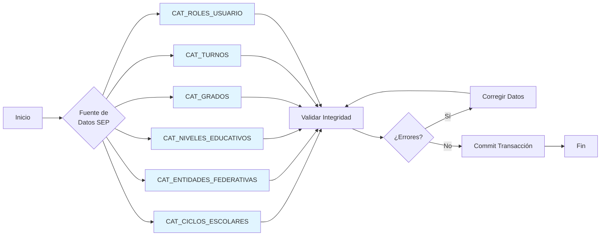
```mermaid
graph LR
    A[Inicio] --> B{Fuente de<br/>Datos SEP}
    B --> C[CAT_CICLOS_ESCOLARES]
    B --> D[CAT_ENTIDADES_FEDERATIVAS]
    B --> E[CAT_NIVELES_EDUCATIVOS]
    B --> F[CAT_GRADOS]
    B --> G[CAT_TURNOS]
    B --> H[CAT_ROLES_USUARIO]
    
    C --> I[Validar Integridad]
    D --> I
    E --> I
    F --> I
    G --> I
    H --> I
    
    I --> J{¿Errores?}
    J -->|Sí| K[Corregir Datos]
    K --> I
    J -->|No| L[Commit Transacción]
    L --> M[Fin]
    
    style C fill:#e1f5ff
    style D fill:#e1f5ff
    style E fill:#e1f5ff
    style F fill:#e1f5ff
    style G fill:#e1f5ff
    style H fill:#e1f5ff
```

### 3.2 Orden de Carga de Catálogos

**Importante:** Respetar el orden por dependencias de Foreign Keys

#### 3.2.1 CAT_CICLOS_ESCOLARES

```sql
-- Población de ciclos escolares (2024-2025, 2025-2026, etc.)
INSERT INTO CAT_CICLOS_ESCOLARES (id, ciclo, fecha_inicio, fecha_fin, activo, descripcion)
VALUES
    (1, '2024-2025', '2024-08-26', '2025-07-18', TRUE, 'Ciclo escolar 2024-2025'),
    (2, '2025-2026', '2025-08-25', '2026-07-17', FALSE, 'Ciclo escolar 2025-2026'),
    (3, '2026-2027', '2026-08-24', '2027-07-16', FALSE, 'Ciclo escolar 2026-2027')
ON CONFLICT (id) DO NOTHING;

-- Verificación
SELECT * FROM CAT_CICLOS_ESCOLARES ORDER BY fecha_inicio DESC;
```

#### 3.2.2 CAT_ENTIDADES_FEDERATIVAS

```sql
-- Población de 32 estados de México
INSERT INTO CAT_ENTIDADES_FEDERATIVAS (id, clave, nombre, abreviatura, activo)
VALUES
    (1, '01', 'Aguascalientes', 'AGS', TRUE),
    (2, '02', 'Baja California', 'BC', TRUE),
    (3, '03', 'Baja California Sur', 'BCS', TRUE),
    (4, '04', 'Campeche', 'CAMP', TRUE),
    (5, '05', 'Coahuila de Zaragoza', 'COAH', TRUE),
    (6, '06', 'Colima', 'COL', TRUE),
    (7, '07', 'Chiapas', 'CHIS', TRUE),
    (8, '08', 'Chihuahua', 'CHIH', TRUE),
    (9, '09', 'Ciudad de México', 'CDMX', TRUE),
    (10, '10', 'Durango', 'DGO', TRUE),
    (11, '11', 'Guanajuato', 'GTO', TRUE),
    (12, '12', 'Guerrero', 'GRO', TRUE),
    (13, '13', 'Hidalgo', 'HGO', TRUE),
    (14, '14', 'Jalisco', 'JAL', TRUE),
    (15, '15', 'México', 'MEX', TRUE),
    (16, '16', 'Michoacán de Ocampo', 'MICH', TRUE),
    (17, '17', 'Morelos', 'MOR', TRUE),
    (18, '18', 'Nayarit', 'NAY', TRUE),
    (19, '19', 'Nuevo León', 'NL', TRUE),
    (20, '20', 'Oaxaca', 'OAX', TRUE),
    (21, '21', 'Puebla', 'PUE', TRUE),
    (22, '22', 'Querétaro', 'QRO', TRUE),
    (23, '23', 'Quintana Roo', 'QROO', TRUE),
    (24, '24', 'San Luis Potosí', 'SLP', TRUE),
    (25, '25', 'Sinaloa', 'SIN', TRUE),
    (26, '26', 'Sonora', 'SON', TRUE),
    (27, '27', 'Tabasco', 'TAB', TRUE),
    (28, '28', 'Tamaulipas', 'TAMPS', TRUE),
    (29, '29', 'Tlaxcala', 'TLAX', TRUE),
    (30, '30', 'Veracruz de Ignacio de la Llave', 'VER', TRUE),
    (31, '31', 'Yucatán', 'YUC', TRUE),
    (32, '32', 'Zacatecas', 'ZAC', TRUE)
ON CONFLICT (id) DO NOTHING;

-- Verificación: Debe retornar 32 registros
SELECT COUNT(*) as total_estados FROM CAT_ENTIDADES_FEDERATIVAS;
```

#### 3.2.3 CAT_NIVELES_EDUCATIVOS

```sql
INSERT INTO CAT_NIVELES_EDUCATIVOS (id, clave, nombre, descripcion, orden, activo)
VALUES
    (1, 'PREESC', 'Preescolar', 'Educación Preescolar (3-5 años)', 1, TRUE),
    (2, 'PRIM', 'Primaria', 'Educación Primaria (6-11 años)', 2, TRUE),
    (3, 'SEC', 'Secundaria', 'Educación Secundaria (12-14 años)', 3, TRUE)
ON CONFLICT (id) DO NOTHING;

SELECT * FROM CAT_NIVELES_EDUCATIVOS ORDER BY orden;
```

#### 3.2.4 CAT_GRADOS

```sql
-- Grados de Preescolar
INSERT INTO CAT_GRADOS (id, nivel_educativo, grado, nombre_completo, orden, activo)
VALUES
    (1, 'PREESC', 1, '1° de Preescolar', 1, TRUE),
    (2, 'PREESC', 2, '2° de Preescolar', 2, TRUE),
    (3, 'PREESC', 3, '3° de Preescolar', 3, TRUE),
    
    -- Grados de Primaria
    (4, 'PRIM', 1, '1° de Primaria', 4, TRUE),
    (5, 'PRIM', 2, '2° de Primaria', 5, TRUE),
    (6, 'PRIM', 3, '3° de Primaria', 6, TRUE),
    (7, 'PRIM', 4, '4° de Primaria', 7, TRUE),
    (8, 'PRIM', 5, '5° de Primaria', 8, TRUE),
    (9, 'PRIM', 6, '6° de Primaria', 9, TRUE),
    
    -- Grados de Secundaria
    (10, 'SEC', 1, '1° de Secundaria', 10, TRUE),
    (11, 'SEC', 2, '2° de Secundaria', 11, TRUE),
    (12, 'SEC', 3, '3° de Secundaria', 12, TRUE)
ON CONFLICT (id) DO NOTHING;

-- Verificación: Debe retornar 12 registros
SELECT nivel_educativo, COUNT(*) as total_grados
FROM CAT_GRADOS
GROUP BY nivel_educativo
ORDER BY nivel_educativo;
```

#### 3.2.5 CAT_TURNOS

```sql
INSERT INTO CAT_TURNOS (id, clave, nombre, descripcion, horario_inicio, horario_fin, activo)
VALUES
    (1, 'MAT', 'Matutino', 'Turno matutino', '08:00:00', '13:00:00', TRUE),
    (2, 'VESP', 'Vespertino', 'Turno vespertino', '14:00:00', '19:00:00', TRUE),
    (3, 'NOCT', 'Nocturno', 'Turno nocturno', '19:00:00', '22:00:00', TRUE),
    (4, 'JA', 'Jornada Ampliada', 'Jornada ampliada (6 horas)', '08:00:00', '14:30:00', TRUE),
    (5, 'TC', 'Tiempo Completo', 'Tiempo completo (8 horas)', '08:00:00', '16:00:00', TRUE)
ON CONFLICT (id) DO NOTHING;

SELECT * FROM CAT_TURNOS ORDER BY id;
```

#### 3.2.6 CAT_ROLES_USUARIO

```sql
INSERT INTO CAT_ROLES_USUARIO (id, codigo, nombre, descripcion, nivel_acceso, activo)
VALUES
    (1, 'ADMIN', 'Administrador', 'Acceso total al sistema', 100, TRUE),
    (2, 'SOPORTE', 'Soporte Técnico', 'Gestión de tickets y asistencia', 80, TRUE),
    (3, 'SUPERVISOR', 'Supervisor de Zona', 'Supervisión de múltiples escuelas', 60, TRUE),
    (4, 'DIRECTOR', 'Director de Escuela', 'Gestión de su escuela', 40, TRUE),
    (5, 'DOCENTE', 'Docente', 'Consulta de reportes de su grupo', 20, TRUE)
ON CONFLICT (id) DO NOTHING;

SELECT * FROM CAT_ROLES_USUARIO ORDER BY nivel_acceso DESC;
```

### 3.3 Script Completo de Población de Catálogos

```sql
-- ========================================
-- POBLACIÓN COMPLETA DE CATÁLOGOS
-- Sistema de Evaluación Diagnóstica SEP
-- ========================================

BEGIN;

-- 1. Ciclos Escolares
INSERT INTO CAT_CICLOS_ESCOLARES (id, ciclo, fecha_inicio, fecha_fin, activo, descripcion)
VALUES
    (1, '2024-2025', '2024-08-26', '2025-07-18', TRUE, 'Ciclo escolar 2024-2025'),
    (2, '2025-2026', '2025-08-25', '2026-07-17', FALSE, 'Ciclo escolar 2025-2026')
ON CONFLICT (id) DO NOTHING;

-- 2. Entidades Federativas (32 estados)
INSERT INTO CAT_ENTIDADES_FEDERATIVAS (id, clave, nombre, abreviatura, activo)
SELECT * FROM (VALUES
    (1, '01', 'Aguascalientes', 'AGS', TRUE),
    (2, '02', 'Baja California', 'BC', TRUE),
    -- ... (resto de estados)
    (32, '32', 'Zacatecas', 'ZAC', TRUE)
) AS v(id, clave, nombre, abreviatura, activo)
ON CONFLICT (id) DO NOTHING;

-- 3. Niveles Educativos
INSERT INTO CAT_NIVELES_EDUCATIVOS (id, clave, nombre, descripcion, orden, activo)
VALUES
    (1, 'PREESC', 'Preescolar', 'Educación Preescolar', 1, TRUE),
    (2, 'PRIM', 'Primaria', 'Educación Primaria', 2, TRUE),
    (3, 'SEC', 'Secundaria', 'Educación Secundaria', 3, TRUE)
ON CONFLICT (id) DO NOTHING;

-- 4. Grados (12 grados: 3 preescolar + 6 primaria + 3 secundaria)
INSERT INTO CAT_GRADOS (id, nivel_educativo, grado, nombre_completo, orden, activo)
SELECT * FROM (VALUES
    (1, 'PREESC', 1, '1° de Preescolar', 1, TRUE),
    (2, 'PREESC', 2, '2° de Preescolar', 2, TRUE),
    (3, 'PREESC', 3, '3° de Preescolar', 3, TRUE),
    (4, 'PRIM', 1, '1° de Primaria', 4, TRUE),
    (5, 'PRIM', 2, '2° de Primaria', 5, TRUE),
    (6, 'PRIM', 3, '3° de Primaria', 6, TRUE),
    (7, 'PRIM', 4, '4° de Primaria', 7, TRUE),
    (8, 'PRIM', 5, '5° de Primaria', 8, TRUE),
    (9, 'PRIM', 6, '6° de Primaria', 9, TRUE),
    (10, 'SEC', 1, '1° de Secundaria', 10, TRUE),
    (11, 'SEC', 2, '2° de Secundaria', 11, TRUE),
    (12, 'SEC', 3, '3° de Secundaria', 12, TRUE)
) AS v(id, nivel_educativo, grado, nombre_completo, orden, activo)
ON CONFLICT (id) DO NOTHING;

-- 5. Turnos Escolares
INSERT INTO CAT_TURNOS (id, clave, nombre, descripcion, horario_inicio, horario_fin, activo)
VALUES
    (1, 'MAT', 'Matutino', 'Turno matutino', '08:00:00', '13:00:00', TRUE),
    (2, 'VESP', 'Vespertino', 'Turno vespertino', '14:00:00', '19:00:00', TRUE),
    (3, 'NOCT', 'Nocturno', 'Turno nocturno', '19:00:00', '22:00:00', TRUE),
    (4, 'JA', 'Jornada Ampliada', 'Jornada ampliada', '08:00:00', '14:30:00', TRUE),
    (5, 'TC', 'Tiempo Completo', 'Tiempo completo', '08:00:00', '16:00:00', TRUE)
ON CONFLICT (id) DO NOTHING;

-- 6. Roles de Usuario
INSERT INTO CAT_ROLES_USUARIO (id, codigo, nombre, descripcion, nivel_acceso, activo)
VALUES
    (1, 'ADMIN', 'Administrador', 'Acceso total', 100, TRUE),
    (2, 'SOPORTE', 'Soporte Técnico', 'Gestión de tickets', 80, TRUE),
    (3, 'SUPERVISOR', 'Supervisor de Zona', 'Supervisión', 60, TRUE),
    (4, 'DIRECTOR', 'Director de Escuela', 'Gestión escuela', 40, TRUE),
    (5, 'DOCENTE', 'Docente', 'Consulta reportes', 20, TRUE)
ON CONFLICT (id) DO NOTHING;

COMMIT;

-- Verificación final
SELECT 'CAT_CICLOS_ESCOLARES' as tabla, COUNT(*) as registros FROM CAT_CICLOS_ESCOLARES
UNION ALL
SELECT 'CAT_ENTIDADES_FEDERATIVAS', COUNT(*) FROM CAT_ENTIDADES_FEDERATIVAS
UNION ALL
SELECT 'CAT_NIVELES_EDUCATIVOS', COUNT(*) FROM CAT_NIVELES_EDUCATIVOS
UNION ALL
SELECT 'CAT_GRADOS', COUNT(*) FROM CAT_GRADOS
UNION ALL
SELECT 'CAT_TURNOS', COUNT(*) FROM CAT_TURNOS
UNION ALL
SELECT 'CAT_ROLES_USUARIO', COUNT(*) FROM CAT_ROLES_USUARIO;
```

### 3.4 Diagrama de Flujo de Verificación

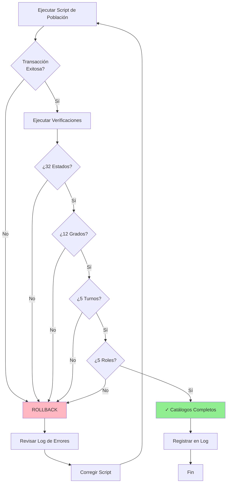
```mermaid
flowchart TD
    A[Ejecutar Script de Población] --> B{Transacción<br/>Exitosa?}
    B -->|No| C[ROLLBACK]
    C --> D[Revisar Log de Errores]
    D --> E[Corregir Script]
    E --> A
    
    B -->|Sí| F[Ejecutar Verificaciones]
    F --> G{¿32 Estados?}
    G -->|No| C
    G -->|Sí| H{¿12 Grados?}
    H -->|No| C
    H -->|Sí| I{¿5 Turnos?}
    I -->|No| C
    I -->|Sí| J{¿5 Roles?}
    J -->|No| C
    J -->|Sí| K[✓ Catálogos Completos]
    K --> L[Registrar en Log]
    L --> M[Fin]
    
    style K fill:#90EE90
    style C fill:#FFB6C1
```

---

## 4. Fase 2: Carga de Escuelas y Creación de Usuarios

### 4.1 Flujo General

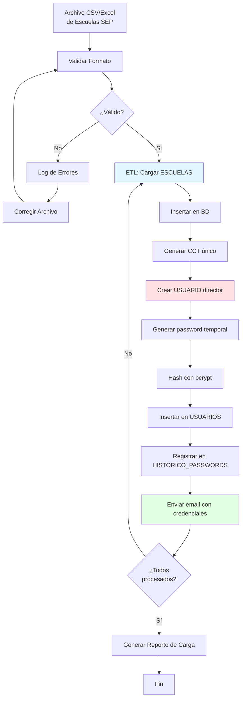
```mermaid
graph TB
    A[Archivo CSV/Excel<br/>de Escuelas SEP] --> B[Validar Formato]
    B --> C{¿Válido?}
    C -->|No| D[Log de Errores]
    D --> E[Corregir Archivo]
    E --> B
    
    C -->|Sí| F[ETL: Cargar ESCUELAS]
    F --> G[Insertar en BD]
    G --> H[Generar CCT único]
    H --> I[Crear USUARIO director]
    I --> J[Generar password temporal]
    J --> K[Hash con bcrypt]
    K --> L[Insertar en USUARIOS]
    L --> M[Registrar en HISTORICO_PASSWORDS]
    M --> N[Enviar email con credenciales]
    N --> O{¿Todos<br/>procesados?}
    O -->|No| F
    O -->|Sí| P[Generar Reporte de Carga]
    P --> Q[Fin]
    
    style F fill:#e1f5ff
    style I fill:#ffe1e1
    style N fill:#e1ffe1
```

### 4.2 Estructura del Archivo de Carga de Escuelas

**Formato:** CSV UTF-8 o Excel (.xlsx)  
**Columnas obligatorias:**

| Campo | Tipo | Descripción | Ejemplo |
|-------|------|-------------|---------|
| cct | VARCHAR(10) | Clave de Centro de Trabajo (único) | 09DPR1234A |
| nombre | VARCHAR(255) | Nombre oficial de la escuela | ESC. PRIM. BENITO JUAREZ |
| entidad_id | INT | ID de CAT_ENTIDADES_FEDERATIVAS | 9 (CDMX) |
| municipio | VARCHAR(100) | Municipio/Alcaldía | Iztapalapa |
| localidad | VARCHAR(100) | Localidad | Iztapalapa Centro |
| domicilio | VARCHAR(255) | Dirección completa | Calle 5 de Mayo #123 |
| codigo_postal | VARCHAR(10) | CP | 09000 |
| nivel_educativo | VARCHAR(10) | PREESC/PRIM/SEC | PRIM |
| turno | VARCHAR(20) | Turno principal | MATUTINO |
| telefono | VARCHAR(15) | Teléfono contacto | 5512345678 |
| email_director | VARCHAR(100) | Email del director (se convierte en usuario) | director.escuela@edu.mx |
| nombre_director | VARCHAR(200) | Nombre completo del director | Juan Pérez García |

#### Ejemplo de Archivo CSV

```csv
cct,nombre,entidad_id,municipio,localidad,domicilio,codigo_postal,nivel_educativo,turno,telefono,email_director,nombre_director
09DPR0001A,ESC. PRIM. BENITO JUAREZ,9,Iztapalapa,Iztapalapa Centro,Calle 5 de Mayo 123,09000,PRIM,MATUTINO,5512345678,director.escuela001@edu.mx,Juan Pérez García
09DPR0002B,ESC. PRIM. MIGUEL HIDALGO,9,Gustavo A. Madero,GAM Norte,Av. Insurgentes 456,07000,PRIM,VESPERTINO,5587654321,director.escuela002@edu.mx,María López Hernández
15DES0123X,ESC. SEC. TEC. NUM 45,15,Toluca,Toluca Centro,Blvd. Toluca 789,50000,SEC,MATUTINO,7221234567,director.sec045@edu.mx,Carlos Ramírez Torres
```

### 4.3 Script de ETL para Carga Masiva

```sql
-- ========================================
-- ETL: CARGA MASIVA DE ESCUELAS Y USUARIOS
-- ========================================

CREATE OR REPLACE FUNCTION fn_carga_masiva_escuelas(
    p_archivo_csv TEXT -- Ruta al archivo CSV en servidor
)
RETURNS TABLE(
    total_procesadas INT,
    total_exitosas INT,
    total_errores INT,
    log_errores JSONB
) AS $$
DECLARE
    v_registro RECORD;
    v_escuela_id UUID;
    v_usuario_id UUID;
    v_password_temporal VARCHAR(20);
    v_password_hash VARCHAR(255);
    v_errores JSONB := '[]'::JSONB;
    v_exitosas INT := 0;
    v_errores_count INT := 0;
    v_total INT := 0;
BEGIN
    -- Crear tabla temporal para CSV
    CREATE TEMP TABLE temp_escuelas (
        cct VARCHAR(10),
        nombre VARCHAR(255),
        entidad_id INT,
        municipio VARCHAR(100),
        localidad VARCHAR(100),
        domicilio VARCHAR(255),
        codigo_postal VARCHAR(10),
        nivel_educativo VARCHAR(10),
        turno VARCHAR(20),
        telefono VARCHAR(15),
        email_director VARCHAR(100),
        nombre_director VARCHAR(200)
    ) ON COMMIT DROP;
    
    -- Cargar CSV
    EXECUTE format('COPY temp_escuelas FROM %L WITH CSV HEADER ENCODING ''UTF8''', p_archivo_csv);
    
    SELECT COUNT(*) INTO v_total FROM temp_escuelas;
    
    -- Procesar cada registro
    FOR v_registro IN SELECT * FROM temp_escuelas LOOP
        BEGIN
            -- Validar CCT único
            IF EXISTS (SELECT 1 FROM ESCUELAS WHERE cct = v_registro.cct) THEN
                v_errores := v_errores || jsonb_build_object(
                    'cct', v_registro.cct,
                    'error', 'CCT duplicado'
                );
                v_errores_count := v_errores_count + 1;
                CONTINUE;
            END IF;
            
            -- Validar entidad existe
            IF NOT EXISTS (SELECT 1 FROM CAT_ENTIDADES_FEDERATIVAS WHERE id = v_registro.entidad_id) THEN
                v_errores := v_errores || jsonb_build_object(
                    'cct', v_registro.cct,
                    'error', format('Entidad %s no existe', v_registro.entidad_id)
                );
                v_errores_count := v_errores_count + 1;
                CONTINUE;
            END IF;
            
            -- Insertar escuela
            v_escuela_id := gen_random_uuid();
            INSERT INTO ESCUELAS (
                id, cct, nombre, entidad_id, municipio, localidad,
                domicilio, codigo_postal, nivel_educativo, turno,
                telefono, activa, created_at
            ) VALUES (
                v_escuela_id,
                v_registro.cct,
                v_registro.nombre,
                v_registro.entidad_id,
                v_registro.municipio,
                v_registro.localidad,
                v_registro.domicilio,
                v_registro.codigo_postal,
                v_registro.nivel_educativo,
                v_registro.turno,
                v_registro.telefono,
                TRUE,
                NOW()
            );
            
            -- Generar password temporal (12 caracteres alfanuméricos + símbolos)
            v_password_temporal := 'Temp' || 
                SUBSTRING(MD5(v_registro.email_director || NOW()::TEXT) FROM 1 FOR 8) || 
                '!';
            
            -- Hashear password (en producción debe hacerse desde la aplicación con bcrypt)
            -- Este es solo un placeholder
            v_password_hash := 'BCRYPT_HASH_' || v_password_temporal;
            
            -- Insertar usuario director
            v_usuario_id := gen_random_uuid();
            INSERT INTO USUARIOS (
                id, email, password_hash, nombre, telefono,
                rol, escuela_id, activo, password_debe_cambiar,
                ultimo_cambio_password, created_at
            ) VALUES (
                v_usuario_id,
                v_registro.email_director,
                v_password_hash,
                v_registro.nombre_director,
                v_registro.telefono,
                (SELECT id FROM CAT_ROLES_USUARIO WHERE codigo = 'DIRECTOR'),
                v_escuela_id,
                TRUE,
                TRUE, -- Debe cambiar password en primer login
                NOW(),
                NOW()
            );
            
            -- Registrar en histórico de passwords
            INSERT INTO HISTORICO_PASSWORDS (
                id, usuario_id, password_hash, es_temporal,
                generada_en, expira_en, cambiada_por, activa
            ) VALUES (
                gen_random_uuid(),
                v_usuario_id,
                v_password_hash,
                TRUE,
                NOW(),
                NOW() + INTERVAL '72 hours',
                'SISTEMA',
                TRUE
            );
            
            -- TODO: Enviar email con credenciales
            -- Se implementará en la aplicación
            
            v_exitosas := v_exitosas + 1;
            
        EXCEPTION WHEN OTHERS THEN
            v_errores := v_errores || jsonb_build_object(
                'cct', v_registro.cct,
                'error', SQLERRM
            );
            v_errores_count := v_errores_count + 1;
        END;
    END LOOP;
    
    RETURN QUERY SELECT v_total, v_exitosas, v_errores_count, v_errores;
END;
$$ LANGUAGE plpgsql;
```

### 4.4 Uso del Script de Carga

```sql
-- Ejecutar carga masiva
SELECT * FROM fn_carga_masiva_escuelas('/ruta/al/archivo/escuelas.csv');

-- Resultado ejemplo:
-- total_procesadas | total_exitosas | total_errores | log_errores
--        1000      |      995       |       5       | [{"cct":"09DPR9999Z","error":"CCT duplicado"},...]
```

### 4.5 Secuencia de Creación de Usuario

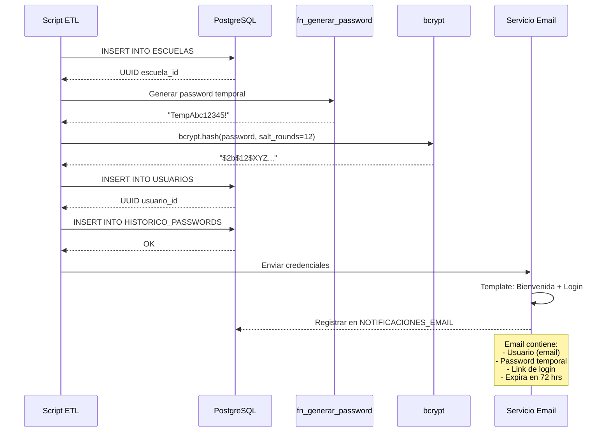
```mermaid
sequenceDiagram
    participant ETL as Script ETL
    participant DB as PostgreSQL
    participant PWD as fn_generar_password
    participant HASH as bcrypt
    participant EMAIL as Servicio Email
    
    ETL->>DB: INSERT INTO ESCUELAS
    DB-->>ETL: UUID escuela_id
    
    ETL->>PWD: Generar password temporal
    PWD-->>ETL: "TempAbc12345!"
    
    ETL->>HASH: bcrypt.hash(password, salt_rounds=12)
    HASH-->>ETL: "$2b$12$XYZ..."
    
    ETL->>DB: INSERT INTO USUARIOS
    DB-->>ETL: UUID usuario_id
    
    ETL->>DB: INSERT INTO HISTORICO_PASSWORDS
    DB-->>ETL: OK
    
    ETL->>EMAIL: Enviar credenciales
    EMAIL->>EMAIL: Template: Bienvenida + Login
    EMAIL-->>DB: Registrar en NOTIFICACIONES_EMAIL
    
    Note over EMAIL: Email contiene:<br/>- Usuario (email)<br/>- Password temporal<br/>- Link de login<br/>- Expira en 72 hrs
```

---

## 5. Fase 3: Configuración de Periodo de Evaluación

### 5.1 Flujo de Creación de Periodo

**Responsable:** Administrador del Sistema  
**Momento:** Antes del inicio del ciclo escolar  
**Frecuencia:** 1-2 veces por ciclo escolar

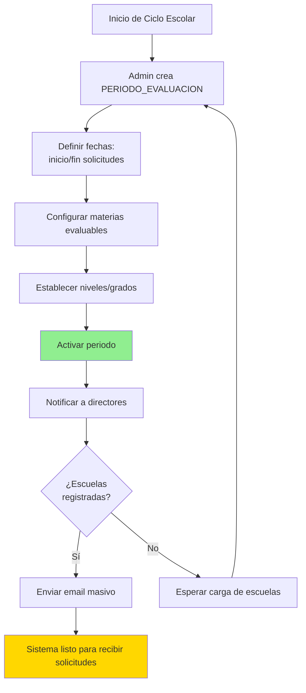
```mermaid
flowchart TD
    A[Inicio de Ciclo Escolar] --> B[Admin crea PERIODO_EVALUACION]
    B --> C[Definir fechas:<br/>inicio/fin solicitudes]
    C --> D[Configurar materias evaluables]
    D --> E[Establecer niveles/grados]
    E --> F[Activar periodo]
    F --> G[Notificar a directores]
    G --> H{¿Escuelas<br/>registradas?}
    H -->|Sí| I[Enviar email masivo]
    H -->|No| J[Esperar carga de escuelas]
    I --> K[Sistema listo para recibir solicitudes]
    J --> B
    
    style F fill:#90EE90
    style K fill:#FFD700
```

### 5.2 Creación Manual de Periodo

```sql
-- Insertar periodo de evaluación para ciclo 2024-2025
INSERT INTO PERIODOS_EVALUACION (
    id,
    ciclo_escolar,
    nombre,
    descripcion,
    fecha_inicio_solicitudes,
    fecha_fin_solicitudes,
    fecha_inicio_evaluaciones,
    fecha_fin_evaluaciones,
    activo,
    created_at
) VALUES (
    gen_random_uuid(),
    '2024-2025',
    'Evaluación Diagnóstica 2024-2025',
    'Periodo de evaluación diagnóstica para el ciclo escolar 2024-2025. Aplicación en agosto-septiembre.',
    '2024-08-01 00:00:00',  -- Inicia recepción de solicitudes
    '2024-10-31 23:59:59',  -- Termina recepción
    '2024-08-26 00:00:00',  -- Inicia aplicación en escuelas
    '2024-09-30 23:59:59',  -- Termina aplicación
    TRUE,                    -- Periodo activo
    NOW()
);

-- Verificar periodo creado
SELECT 
    id,
    ciclo_escolar,
    nombre,
    fecha_inicio_solicitudes,
    fecha_fin_solicitudes,
    activo
FROM PERIODOS_EVALUACION
WHERE activo = TRUE;
```

### 5.3 Configuración de Materias Evaluables

```sql
-- Insertar materias para evaluación diagnóstica
INSERT INTO MATERIAS (id, codigo, nombre, nivel_educativo, activa)
VALUES
    (gen_random_uuid(), 'LEC', 'Lectura', 'PRIM', TRUE),
    (gen_random_uuid(), 'MAT', 'Matemáticas', 'PRIM', TRUE),
    (gen_random_uuid(), 'FCE', 'Formación Cívica y Ética', 'PRIM', TRUE),
    
    (gen_random_uuid(), 'LEC_SEC', 'Lectura', 'SEC', TRUE),
    (gen_random_uuid(), 'MAT_SEC', 'Matemáticas', 'SEC', TRUE),
    (gen_random_uuid(), 'FCE_SEC', 'Formación Cívica y Ética', 'SEC', TRUE),
    
    (gen_random_uuid(), 'LEC_PRE', 'Lectura', 'PREESC', TRUE),
    (gen_random_uuid(), 'MAT_PRE', 'Matemáticas', 'PREESC', TRUE)
ON CONFLICT (codigo) DO NOTHING;

-- Verificar materias por nivel
SELECT nivel_educativo, COUNT(*) as total_materias
FROM MATERIAS
WHERE activa = TRUE
GROUP BY nivel_educativo;
```

---

## 6. Fase 4: Registro y Autenticación de Usuarios

### 6.1 Flujo de Primer Login

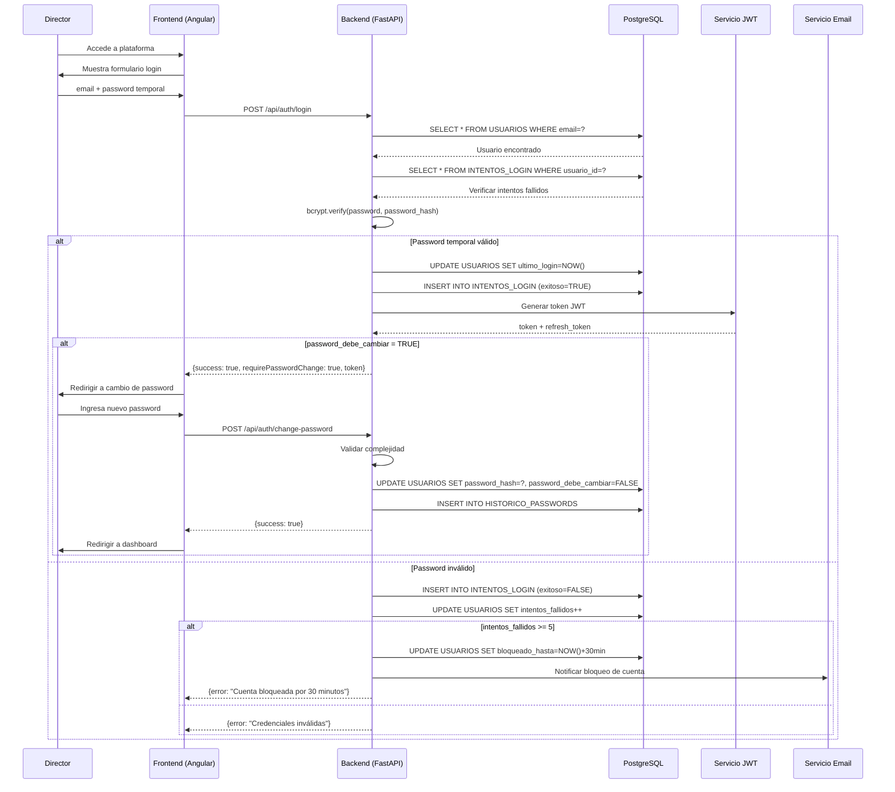
```mermaid
sequenceDiagram
    participant D as Director
    participant WEB as Frontend (Angular)
    participant API as Backend (FastAPI)
    participant DB as PostgreSQL
    participant JWT as Servicio JWT
    participant EMAIL as Servicio Email
    
    D->>WEB: Accede a plataforma
    WEB->>D: Muestra formulario login
    D->>WEB: email + password temporal
    
    WEB->>API: POST /api/auth/login
    API->>DB: SELECT * FROM USUARIOS WHERE email=?
    DB-->>API: Usuario encontrado
    
    API->>DB: SELECT * FROM INTENTOS_LOGIN WHERE usuario_id=?
    DB-->>API: Verificar intentos fallidos
    
    API->>API: bcrypt.verify(password, password_hash)
    
    alt Password temporal válido
        API->>DB: UPDATE USUARIOS SET ultimo_login=NOW()
        API->>DB: INSERT INTO INTENTOS_LOGIN (exitoso=TRUE)
        API->>JWT: Generar token JWT
        JWT-->>API: token + refresh_token
        
        alt password_debe_cambiar = TRUE
            API-->>WEB: {success: true, requirePasswordChange: true, token}
            WEB->>D: Redirigir a cambio de password
            D->>WEB: Ingresa nuevo password
            WEB->>API: POST /api/auth/change-password
            API->>API: Validar complejidad
            API->>DB: UPDATE USUARIOS SET password_hash=?, password_debe_cambiar=FALSE
            API->>DB: INSERT INTO HISTORICO_PASSWORDS
            API-->>WEB: {success: true}
            WEB->>D: Redirigir a dashboard
        end
    else Password inválido
        API->>DB: INSERT INTO INTENTOS_LOGIN (exitoso=FALSE)
        API->>DB: UPDATE USUARIOS SET intentos_fallidos++
        
        alt intentos_fallidos >= 5
            API->>DB: UPDATE USUARIOS SET bloqueado_hasta=NOW()+30min
            API->>EMAIL: Notificar bloqueo de cuenta
            API-->>WEB: {error: "Cuenta bloqueada por 30 minutos"}
        else
            API-->>WEB: {error: "Credenciales inválidas"}
        end
    end
```

### 6.2 Endpoints de Autenticación

#### 6.2.1 POST /api/auth/login

```python
# FastAPI endpoint (pseudo-código)
@router.post("/login")
async def login(credentials: LoginRequest, db: Session):
    # 1. Buscar usuario
    usuario = db.query(USUARIOS).filter(
        USUARIOS.email == credentials.email,
        USUARIOS.activo == True
    ).first()
    
    if not usuario:
        return {"error": "Credenciales inválidas"}
    
    # 2. Verificar bloqueo
    if usuario.bloqueado_hasta and usuario.bloqueado_hasta > datetime.now():
        return {
            "error": f"Cuenta bloqueada hasta {usuario.bloqueado_hasta}",
            "blocked_until": usuario.bloqueado_hasta
        }
    
    # 3. Verificar password
    if not bcrypt.verify(credentials.password, usuario.password_hash):
        # Registrar intento fallido
        db.add(INTENTOS_LOGIN(
            id=uuid4(),
            usuario_id=usuario.id,
            ip_address=request.client.host,
            exitoso=False,
            created_at=datetime.now()
        ))
        
        # Incrementar contador
        usuario.intentos_fallidos += 1
        if usuario.intentos_fallidos >= 5:
            usuario.bloqueado_hasta = datetime.now() + timedelta(minutes=30)
        
        db.commit()
        return {"error": "Credenciales inválidas"}
    
    # 4. Login exitoso
    db.add(INTENTOS_LOGIN(
        id=uuid4(),
        usuario_id=usuario.id,
        ip_address=request.client.host,
        exitoso=True,
        created_at=datetime.now()
    ))
    
    usuario.ultimo_login = datetime.now()
    usuario.intentos_fallidos = 0
    db.commit()
    
    # 5. Generar JWT
    token = create_jwt_token({
        "user_id": str(usuario.id),
        "email": usuario.email,
        "rol": usuario.rol,
        "escuela_id": str(usuario.escuela_id)
    })
    
    return {
        "success": True,
        "token": token,
        "requirePasswordChange": usuario.password_debe_cambiar,
        "user": {
            "id": usuario.id,
            "email": usuario.email,
            "nombre": usuario.nombre,
            "rol": usuario.rol
        }
    }
```

#### 6.2.2 POST /api/auth/change-password

```python
@router.post("/change-password")
async def change_password(
    request: ChangePasswordRequest,
    current_user: USUARIOS = Depends(get_current_user),
    db: Session = Depends(get_db)
):
    # 1. Validar password actual
    if not bcrypt.verify(request.old_password, current_user.password_hash):
        return {"error": "Password actual inválido"}
    
    # 2. Validar complejidad del nuevo password
    if not validate_password_complexity(request.new_password):
        return {
            "error": "Password no cumple requisitos",
            "requirements": [
                "Mínimo 8 caracteres",
                "Al menos 1 mayúscula",
                "Al menos 1 minúscula",
                "Al menos 1 número",
                "Al menos 1 símbolo especial"
            ]
        }
    
    # 3. Verificar que no sea igual a passwords anteriores
    historico = db.query(HISTORICO_PASSWORDS).filter(
        HISTORICO_PASSWORDS.usuario_id == current_user.id
    ).order_by(HISTORICO_PASSWORDS.generada_en.desc()).limit(5).all()
    
    for pwd_hist in historico:
        if bcrypt.verify(request.new_password, pwd_hist.password_hash):
            return {"error": "No puedes reutilizar passwords anteriores"}
    
    # 4. Hashear nuevo password
    new_hash = bcrypt.hash(request.new_password, rounds=12)
    
    # 5. Actualizar usuario
    current_user.password_hash = new_hash
    current_user.password_debe_cambiar = False
    current_user.ultimo_cambio_password = datetime.now()
    
    # 6. Registrar en histórico
    db.add(HISTORICO_PASSWORDS(
        id=uuid4(),
        usuario_id=current_user.id,
        password_hash=new_hash,
        es_temporal=False,
        generada_en=datetime.now(),
        cambiada_por=current_user.email,
        activa=True
    ))
    
    # Desactivar passwords anteriores
    db.query(HISTORICO_PASSWORDS).filter(
        HISTORICO_PASSWORDS.usuario_id == current_user.id,
        HISTORICO_PASSWORDS.id != historico[-1].id
    ).update({"activa": False})
    
    db.commit()
    
    return {"success": True, "message": "Password actualizado correctamente"}
```

### 6.3 Diagrama de Estados de Usuario

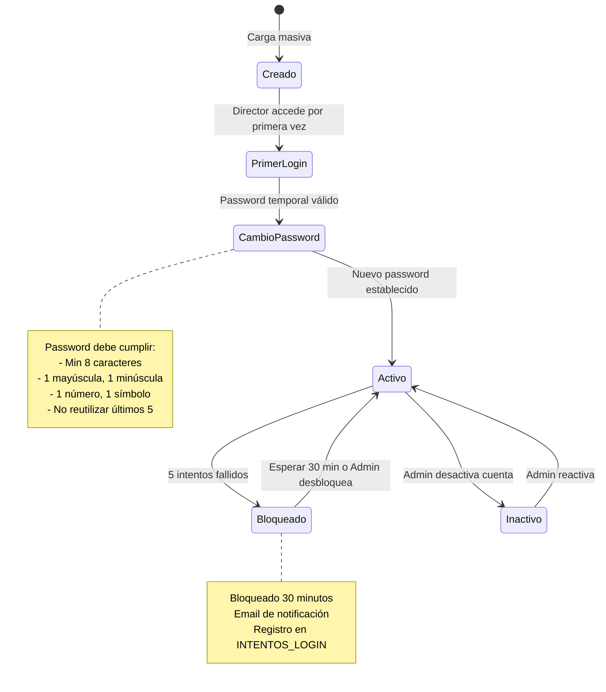
```mermaid
stateDiagram-v2
    [*] --> Creado: Carga masiva
    Creado --> PrimerLogin: Director accede por primera vez
    PrimerLogin --> CambioPassword: Password temporal válido
    CambioPassword --> Activo: Nuevo password establecido
    Activo --> Bloqueado: 5 intentos fallidos
    Bloqueado --> Activo: Esperar 30 min o Admin desbloquea
    Activo --> Inactivo: Admin desactiva cuenta
    Inactivo --> Activo: Admin reactiva
    
    note right of CambioPassword
        Password debe cumplir:
        - Min 8 caracteres
        - 1 mayúscula, 1 minúscula
        - 1 número, 1 símbolo
        - No reutilizar últimos 5
    end note
    
    note right of Bloqueado
        Bloqueado 30 minutos
        Email de notificación
        Registro en INTENTOS_LOGIN
    end note
```

---

## 7. Fase 5: Carga de Archivos de Valoración (.xlsx)

### 7.1 Flujo Completo de Carga

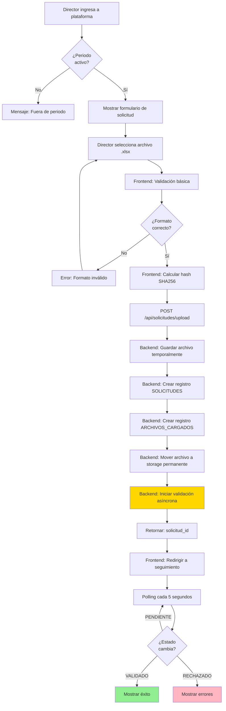
```mermaid
graph TB
    A[Director ingresa a plataforma] --> B{¿Periodo<br/>activo?}
    B -->|No| C[Mensaje: Fuera de periodo]
    B -->|Sí| D[Mostrar formulario de solicitud]
    
    D --> E[Director selecciona archivo .xlsx]
    E --> F[Frontend: Validación básica]
    F --> G{¿Formato<br/>correcto?}
    G -->|No| H[Error: Formato inválido]
    H --> E
    
    G -->|Sí| I[Frontend: Calcular hash SHA256]
    I --> J[POST /api/solicitudes/upload]
    J --> K[Backend: Guardar archivo temporalmente]
    K --> L[Backend: Crear registro SOLICITUDES]
    L --> M[Backend: Crear registro ARCHIVOS_CARGADOS]
    M --> N[Backend: Mover archivo a storage permanente]
    N --> O[Backend: Iniciar validación asíncrona]
    O --> P[Retornar: solicitud_id]
    P --> Q[Frontend: Redirigir a seguimiento]
    Q --> R[Polling cada 5 segundos]
    R --> S{¿Estado<br/>cambia?}
    S -->|PENDIENTE| R
    S -->|VALIDADO| T[Mostrar éxito]
    S -->|RECHAZADO| U[Mostrar errores]
    
    style O fill:#FFD700
    style T fill:#90EE90
    style U fill:#FFB6C1
```

### 7.2 Estructura Esperada del Archivo .xlsx

#### Hoja 1: "Datos Generales"

| Campo | Valor |
|-------|-------|
| CCT | 09DPR0001A |
| Nombre de la Escuela | ESC. PRIM. BENITO JUAREZ |
| Turno | MATUTINO |
| Nivel | PRIMARIA |
| Grado | 3 |
| Grupo | A |
| Ciclo Escolar | 2024-2025 |
| Total de Alumnos | 35 |

#### Hoja 2: "Valoraciones"

| Num | CURP | Nombre Completo | Lectura_NI | Lectura_NIII | Lectura_NIII | Lectura_NIV | Mat_NI | Mat_NII | Mat_NIII | Mat_NIV | FCE_NI | FCE_NII | FCE_NIII | FCE_NIV |
|-----|------|-----------------|------------|--------------|--------------|-------------|--------|---------|----------|---------|--------|---------|----------|---------|
| 1 | GAPL120815HMCRRS09 | García Pérez Luis | 2 | 3 | 4 | 1 | 3 | 3 | 2 | 2 | 4 | 3 | 3 | 3 |
| 2 | LOMC130422MDFPNR07 | López Martínez Carla | 3 | 4 | 4 | 2 | 4 | 4 | 3 | 3 | 4 | 4 | 4 | 3 |
| ... | ... | ... | ... | ... | ... | ... | ... | ... | ... | ... | ... | ... | ... | ... |

**Niveles de dominio:**
- 1 = Esperado (domina totalmente)
- 2 = Cercano al esperado
- 3 = Requiere apoyo
- 4 = En desarrollo inicial

### 7.3 Endpoint de Carga

#### POST /api/solicitudes/upload

```python
from fastapi import UploadFile, File, Depends
from openpyxl import load_workbook
import hashlib

@router.post("/upload")
async def upload_valoracion(
    archivo: UploadFile = File(...),
    current_user: USUARIOS = Depends(get_current_user),
    db: Session = Depends(get_db)
):
    # 1. Validaciones iniciales
    if not archivo.filename.endswith('.xlsx'):
        raise HTTPException(400, "Solo se permiten archivos .xlsx")
    
    if archivo.size > 10 * 1024 * 1024:  # 10 MB max
        raise HTTPException(400, "Archivo excede tamaño máximo (10MB)")
    
    # 2. Verificar que el usuario pertenece a una escuela
    if not current_user.escuela_id:
        raise HTTPException(403, "Usuario no asociado a escuela")
    
    # 3. Verificar periodo activo
    periodo = db.query(PERIODOS_EVALUACION).filter(
        PERIODOS_EVALUACION.activo == True,
        PERIODOS_EVALUACION.fecha_inicio_solicitudes <= datetime.now(),
        PERIODOS_EVALUACION.fecha_fin_solicitudes >= datetime.now()
    ).first()
    
    if not periodo:
        raise HTTPException(400, "No hay periodo activo para solicitudes")
    
    # 4. Leer contenido del archivo
    contenido = await archivo.read()
    
    # 5. Calcular hash
    file_hash = hashlib.sha256(contenido).hexdigest()
    
    # 6. Verificar duplicados
    duplicado = db.query(ARCHIVOS_CARGADOS).filter(
        ARCHIVOS_CARGADOS.hash_sha256 == file_hash
    ).first()
    
    if duplicado:
        raise HTTPException(400, f"Archivo duplicado (ya cargado el {duplicado.created_at})")
    
    # 7. Guardar archivo temporalmente
    temp_path = f"/tmp/uploads/{uuid4()}.xlsx"
    with open(temp_path, "wb") as f:
        f.write(contenido)
    
    # 8. Validación básica del formato Excel
    try:
        wb = load_workbook(temp_path, read_only=True)
        if "Datos Generales" not in wb.sheetnames:
            raise HTTPException(400, "Falta hoja 'Datos Generales'")
        if "Valoraciones" not in wb.sheetnames:
            raise HTTPException(400, "Falta hoja 'Valoraciones'")
        wb.close()
    except Exception as e:
        os.remove(temp_path)
        raise HTTPException(400, f"Error al leer archivo: {str(e)}")
    
    # 9. Crear SOLICITUD
    solicitud_id = uuid4()
    solicitud = SOLICITUDES(
        id=solicitud_id,
        usuario_id=current_user.id,
        escuela_id=current_user.escuela_id,
        periodo_id=periodo.id,
        estado='PENDIENTE',
        created_at=datetime.now()
    )
    db.add(solicitud)
    
    # 10. Crear ARCHIVO_CARGADO
    archivo_id = uuid4()
    ruta_permanente = f"/storage/valoraciones/{current_user.escuela_id}/{solicitud_id}.xlsx"
    
    archivo_db = ARCHIVOS_CARGADOS(
        id=archivo_id,
        solicitud_id=solicitud_id,
        nombre_original=archivo.filename,
        ruta_archivo=ruta_permanente,
        tipo_archivo='VALORACION',
        tamano_bytes=archivo.size,
        hash_sha256=file_hash,
        uploaded_by=current_user.id,
        created_at=datetime.now()
    )
    db.add(archivo_db)
    
    # 11. Mover archivo a storage permanente
    os.makedirs(os.path.dirname(ruta_permanente), exist_ok=True)
    shutil.move(temp_path, ruta_permanente)
    
    db.commit()
    
    # 12. Iniciar validación asíncrona (Celery/RQ)
    validar_archivo_task.delay(solicitud_id, archivo_id)
    
    return {
        "success": True,
        "solicitud_id": str(solicitud_id),
        "archivo_id": str(archivo_id),
        "mensaje": "Archivo cargado exitosamente. Iniciando validación..."
    }
```

### 7.4 Diagrama de Secuencia de Carga

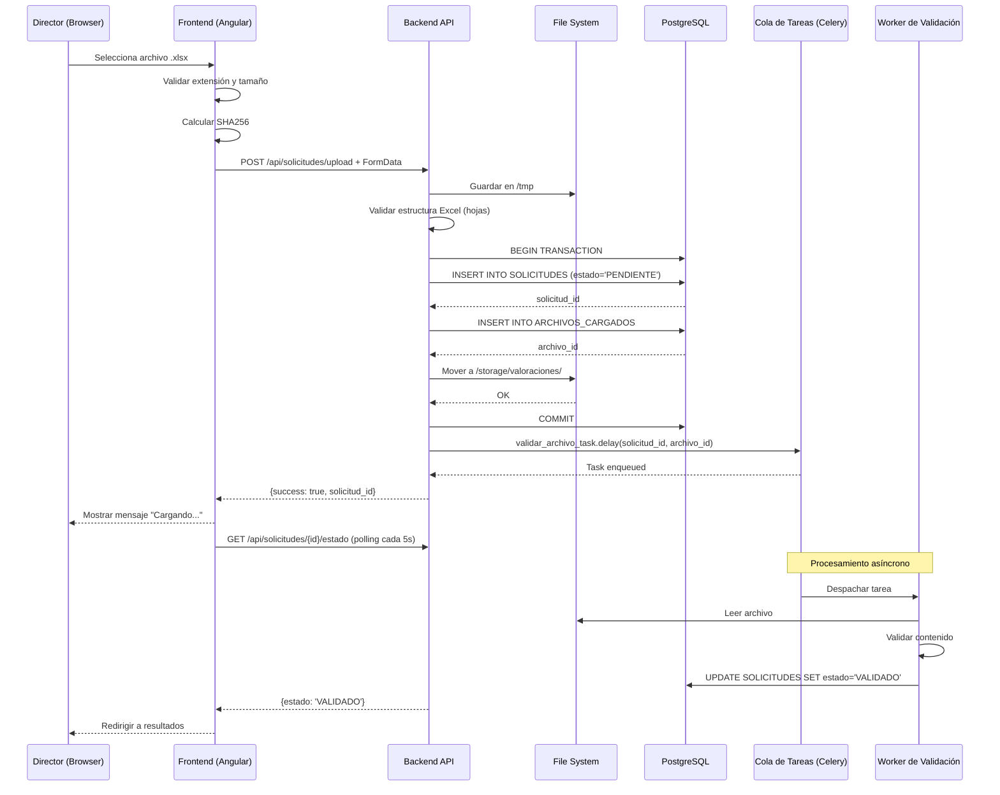
```mermaid
sequenceDiagram
    participant D as Director (Browser)
    participant FE as Frontend (Angular)
    participant API as Backend API
    participant FS as File System
    participant DB as PostgreSQL
    participant Q as Cola de Tareas (Celery)
    participant W as Worker de Validación
    
    D->>FE: Selecciona archivo .xlsx
    FE->>FE: Validar extensión y tamaño
    FE->>FE: Calcular SHA256
    FE->>API: POST /api/solicitudes/upload + FormData
    
    API->>FS: Guardar en /tmp
    API->>API: Validar estructura Excel (hojas)
    
    API->>DB: BEGIN TRANSACTION
    API->>DB: INSERT INTO SOLICITUDES (estado='PENDIENTE')
    DB-->>API: solicitud_id
    
    API->>DB: INSERT INTO ARCHIVOS_CARGADOS
    DB-->>API: archivo_id
    
    API->>FS: Mover a /storage/valoraciones/
    FS-->>API: OK
    
    API->>DB: COMMIT
    
    API->>Q: validar_archivo_task.delay(solicitud_id, archivo_id)
    Q-->>API: Task enqueued
    
    API-->>FE: {success: true, solicitud_id}
    FE-->>D: Mostrar mensaje "Cargando..."
    
    FE->>API: GET /api/solicitudes/{id}/estado (polling cada 5s)
    
    Note over Q,W: Procesamiento asíncrono
    Q->>W: Despachar tarea
    W->>FS: Leer archivo
    W->>W: Validar contenido
    W->>DB: UPDATE SOLICITUDES SET estado='VALIDADO'
    
    API-->>FE: {estado: 'VALIDADO'}
    FE-->>D: Redirigir a resultados
```

---

## 8. Fase 6: Validación y Procesamiento de Archivos

### 8.1 Flujo de Validación Asíncrona

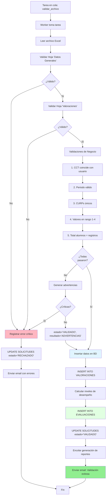
```mermaid
graph TB
    A[Tarea en cola: validar_archivo] --> B[Worker toma tarea]
    B --> C[Leer archivo Excel]
    C --> D[Validar Hoja 'Datos Generales']
    
    D --> E{¿Válido?}
    E -->|No| F[Registrar error crítico]
    F --> G[UPDATE SOLICITUDES estado='RECHAZADO']
    G --> H[Enviar email con errores]
    H --> Z[Fin]
    
    E -->|Sí| I[Validar Hoja 'Valoraciones']
    I --> J{¿Válido?}
    J -->|No| F
    
    J -->|Sí| K[Validaciones de Negocio]
    K --> L[1. CCT coincide con usuario]
    L --> M[2. Periodo válido]
    M --> N[3. CURPs únicos]
    N --> O[4. Valores en rango 1-4]
    O --> P[5. Total alumnos = registros]
    
    P --> Q{¿Todas<br/>pasaron?}
    Q -->|No| R[Generar advertencias]
    R --> S{¿Críticas?}
    S -->|Sí| F
    S -->|No| T[estado='VALIDADO', resultado='ADVERTENCIAS']
    
    Q -->|Sí| U[Insertar datos en BD]
    U --> V[INSERT INTO VALORACIONES]
    V --> W[Calcular niveles de desempeño]
    W --> X[INSERT INTO EVALUACIONES]
    X --> Y[UPDATE SOLICITUDES estado='VALIDADO']
    Y --> AA[Encolar generación de reportes]
    AA --> AB[Enviar email: Validación exitosa]
    AB --> Z
    
    T --> U
    
    style U fill:#e1f5ff
    style X fill:#e1ffe1
    style F fill:#FFB6C1
    style AB fill:#90EE90
```

### 8.2 Worker de Validación (Celery Task)

```python
from celery import shared_task
from openpyxl import load_workbook
import re

@shared_task(bind=True, max_retries=3)
def validar_archivo_task(self, solicitud_id: str, archivo_id: str):
    """
    Tarea asíncrona para validar archivo de valoraciones
    """
    db = SessionLocal()
    errores = []
    advertencias = []
    
    try:
        # 1. Obtener solicitud y archivo
        solicitud = db.query(SOLICITUDES).filter(SOLICITUDES.id == solicitud_id).first()
        archivo = db.query(ARCHIVOS_CARGADOS).filter(ARCHIVOS_CARGADOS.id == archivo_id).first()
        
        if not solicitud or not archivo:
            raise ValueError("Solicitud o archivo no encontrado")
        
        # 2. Actualizar estado a EN_PROCESO
        solicitud.estado = 'EN_PROCESO'
        solicitud.fecha_procesamiento_inicio = datetime.now()
        db.commit()
        
        # 3. Cargar Excel
        wb = load_workbook(archivo.ruta_archivo, data_only=True)
        
        # ====================================
        # VALIDACIÓN: Hoja "Datos Generales"
        # ====================================
        hoja_general = wb["Datos Generales"]
        
        datos_generales = {}
        for row in hoja_general.iter_rows(min_row=1, max_row=20, values_only=True):
            if row[0] and row[1]:
                datos_generales[str(row[0]).strip()] = row[1]
        
        # Validar campos obligatorios
        campos_obligatorios = ['CCT', 'Nivel', 'Grado', 'Grupo', 'Ciclo Escolar', 'Total de Alumnos']
        for campo in campos_obligatorios:
            if campo not in datos_generales:
                errores.append({
                    "tipo": "CRITICO",
                    "campo": campo,
                    "mensaje": f"Falta campo obligatorio '{campo}' en Datos Generales"
                })
        
        if errores:
            # Abortar si faltan campos críticos
            raise ValidationError("Faltan campos obligatorios")
        
        # Validar CCT coincide con escuela del usuario
        escuela = db.query(ESCUELAS).filter(ESCUELAS.id == solicitud.escuela_id).first()
        if escuela.cct != datos_generales.get('CCT'):
            errores.append({
                "tipo": "CRITICO",
                "campo": "CCT",
                "mensaje": f"CCT no coincide. Esperado: {escuela.cct}, Recibido: {datos_generales.get('CCT')}"
            })
            raise ValidationError("CCT no coincide")
        
        # Validar nivel educativo
        nivel_valido = db.query(CAT_NIVELES_EDUCATIVOS).filter(
            CAT_NIVELES_EDUCATIVOS.nombre.ilike(f"%{datos_generales['Nivel']}%")
        ).first()
        
        if not nivel_valido:
            errores.append({
                "tipo": "CRITICO",
                "campo": "Nivel",
                "mensaje": f"Nivel educativo inválido: {datos_generales['Nivel']}"
            })
            raise ValidationError("Nivel educativo inválido")
        
        # Validar grado
        grado = db.query(CAT_GRADOS).filter(
            CAT_GRADOS.nivel_educativo == nivel_valido.clave,
            CAT_GRADOS.grado == int(datos_generales['Grado'])
        ).first()
        
        if not grado:
            errores.append({
                "tipo": "CRITICO",
                "campo": "Grado",
                "mensaje": f"Grado inválido para nivel {nivel_valido.nombre}"
            })
            raise ValidationError("Grado inválido")
        
        # ====================================
        # VALIDACIÓN: Hoja "Valoraciones"
        # ====================================
        hoja_valoraciones = wb["Valoraciones"]
        
        # Leer encabezados
        headers = [cell.value for cell in hoja_valoraciones[1]]
        
        # Validar columnas esperadas
        columnas_esperadas = [
            'Num', 'CURP', 'Nombre Completo',
            'Lectura_NI', 'Lectura_NII', 'Lectura_NIII', 'Lectura_NIV',
            'Mat_NI', 'Mat_NII', 'Mat_NIII', 'Mat_NIV',
            'FCE_NI', 'FCE_NII', 'FCE_NIII', 'FCE_NIV'
        ]
        
        for col in columnas_esperadas:
            if col not in headers:
                errores.append({
                    "tipo": "CRITICO",
                    "campo": col,
                    "mensaje": f"Falta columna '{col}' en hoja Valoraciones"
                })
        
        if errores:
            raise ValidationError("Estructura de Valoraciones incorrecta")
        
        # Leer registros de estudiantes
        estudiantes = []
        curps_unicos = set()
        
        for row_idx, row in enumerate(hoja_valoraciones.iter_rows(min_row=2, values_only=True), start=2):
            if not row[0]:  # Num vacío = fin de datos
                break
            
            estudiante = {
                'num': row[0],
                'curp': row[1],
                'nombre': row[2],
                'lectura_ni': row[3],
                'lectura_nii': row[4],
                'lectura_niii': row[5],
                'lectura_niv': row[6],
                'mat_ni': row[7],
                'mat_nii': row[8],
                'mat_niii': row[9],
                'mat_niv': row[10],
                'fce_ni': row[11],
                'fce_nii': row[12],
                'fce_niii': row[13],
                'fce_niv': row[14]
            }
            
            # Validar CURP formato
            if not re.match(r'^[A-Z]{4}\d{6}[HM][A-Z]{5}[0-9A-Z]\d$', str(estudiante['curp'])):
                advertencias.append({
                    "tipo": "ADVERTENCIA",
                    "fila": row_idx,
                    "campo": "CURP",
                    "mensaje": f"CURP con formato inválido: {estudiante['curp']}"
                })
            
            # Validar CURP único
            if estudiante['curp'] in curps_unicos:
                errores.append({
                    "tipo": "CRITICO",
                    "fila": row_idx,
                    "campo": "CURP",
                    "mensaje": f"CURP duplicado: {estudiante['curp']}"
                })
            curps_unicos.add(estudiante['curp'])
            
            # Validar valores de niveles (1-4)
            for campo in ['lectura_ni', 'lectura_nii', 'lectura_niii', 'lectura_niv',
                         'mat_ni', 'mat_nii', 'mat_niii', 'mat_niv',
                         'fce_ni', 'fce_nii', 'fce_niii', 'fce_niv']:
                valor = estudiante[campo]
                if valor is None or valor not in [1, 2, 3, 4]:
                    errores.append({
                        "tipo": "CRITICO",
                        "fila": row_idx,
                        "campo": campo,
                        "mensaje": f"Valor inválido '{valor}'. Debe ser 1, 2, 3 o 4"
                    })
            
            estudiantes.append(estudiante)
        
        # Validar total de alumnos coincide
        total_esperado = int(datos_generales['Total de Alumnos'])
        total_recibido = len(estudiantes)
        
        if total_esperado != total_recibido:
            advertencias.append({
                "tipo": "ADVERTENCIA",
                "campo": "Total de Alumnos",
                "mensaje": f"Total declarado ({total_esperado}) difiere de registros ({total_recibido})"
            })
        
        wb.close()
        
        # ====================================
        # GUARDAR ERRORES/ADVERTENCIAS
        # ====================================
        if errores:
            # Validación rechazada
            solicitud.estado = 'RECHAZADO'
            solicitud.resultado_validacion = 'ERRORES_CRITICOS'
            solicitud.errores_validacion = {
                "errores": errores,
                "advertencias": advertencias
            }
            solicitud.fecha_procesamiento_fin = datetime.now()
            db.commit()
            
            # Enviar email con errores
            enviar_email_validacion_rechazada(solicitud, errores)
            
            return {
                "success": False,
                "estado": "RECHAZADO",
                "errores": errores,
                "advertencias": advertencias
            }
        
        # ====================================
        # INSERTAR DATOS EN BD
        # ====================================
        
        # Crear o encontrar grupo
        grupo = db.query(GRUPOS).filter(
            GRUPOS.escuela_id == solicitud.escuela_id,
            GRUPOS.nombre == datos_generales['Grupo'],
            GRUPOS.grado_id == grado.id
        ).first()
        
        if not grupo:
            grupo = GRUPOS(
                id=uuid4(),
                escuela_id=solicitud.escuela_id,
                grado_id=grado.id,
                nombre=datos_generales['Grupo'],
                turno=datos_generales.get('Turno', 'MATUTINO'),
                total_alumnos=total_recibido,
                activo=True,
                created_at=datetime.now()
            )
            db.add(grupo)
            db.flush()
        
        # Obtener materias
        materia_lectura = db.query(MATERIAS).filter(
            MATERIAS.codigo == 'LEC',
            MATERIAS.nivel_educativo == nivel_valido.clave
        ).first()
        
        materia_matematicas = db.query(MATERIAS).filter(
            MATERIAS.codigo == 'MAT',
            MATERIAS.nivel_educativo == nivel_valido.clave
        ).first()
        
        materia_fce = db.query(MATERIAS).filter(
            MATERIAS.codigo == 'FCE',
            MATERIAS.nivel_educativo == nivel_valido.clave
        ).first()
        
        # Insertar estudiantes y valoraciones
        for est in estudiantes:
            # Crear o encontrar estudiante
            estudiante_db = db.query(ESTUDIANTES).filter(
                ESTUDIANTES.curp == est['curp']
            ).first()
            
            if not estudiante_db:
                estudiante_db = ESTUDIANTES(
                    id=uuid4(),
                    curp=est['curp'],
                    nombre_completo=est['nombre'],
                    escuela_id=solicitud.escuela_id,
                    grupo_id=grupo.id,
                    activo=True,
                    created_at=datetime.now()
                )
                db.add(estudiante_db)
                db.flush()
            
            # Insertar valoraciones para cada materia
            # LECTURA
            valoracion_lec = VALORACIONES(
                id=uuid4(),
                solicitud_id=solicitud.id,
                estudiante_id=estudiante_db.id,
                materia_id=materia_lectura.id,
                periodo_id=solicitud.periodo_id,
                nivel_i=est['lectura_ni'],
                nivel_ii=est['lectura_nii'],
                nivel_iii=est['lectura_niii'],
                nivel_iv=est['lectura_niv'],
                created_at=datetime.now()
            )
            db.add(valoracion_lec)
            
            # MATEMÁTICAS
            valoracion_mat = VALORACIONES(
                id=uuid4(),
                solicitud_id=solicitud.id,
                estudiante_id=estudiante_db.id,
                materia_id=materia_matematicas.id,
                periodo_id=solicitud.periodo_id,
                nivel_i=est['mat_ni'],
                nivel_ii=est['mat_nii'],
                nivel_iii=est['mat_niii'],
                nivel_iv=est['mat_niv'],
                created_at=datetime.now()
            )
            db.add(valoracion_mat)
            
            # FORMACIÓN CÍVICA Y ÉTICA
            valoracion_fce = VALORACIONES(
                id=uuid4(),
                solicitud_id=solicitud.id,
                estudiante_id=estudiante_db.id,
                materia_id=materia_fce.id,
                periodo_id=solicitud.periodo_id,
                nivel_i=est['fce_ni'],
                nivel_ii=est['fce_nii'],
                nivel_iii=est['fce_niii'],
                nivel_iv=est['fce_niv'],
                created_at=datetime.now()
            )
            db.add(valoracion_fce)
            
            # Calcular nivel de desempeño (simplificado)
            # Regla: Promedio ponderado de niveles
            def calcular_nivel_desempeno(ni, nii, niii, niv):
                # Convertir a puntos: 1=4pts, 2=3pts, 3=2pts, 4=1pt
                puntajes = {1: 4, 2: 3, 3: 2, 4: 1}
                total = puntajes[ni] + puntajes[nii] + puntajes[niii] + puntajes[niv]
                promedio = total / 4
                
                if promedio >= 3.5:
                    return 'IV'  # Dominio sobresaliente
                elif promedio >= 2.5:
                    return 'III'  # Dominio satisfactorio
                elif promedio >= 1.5:
                    return 'II'  # Dominio básico
                else:
                    return 'I'  # Requiere apoyo
            
            # Crear EVALUACIONES
            eval_lec = EVALUACIONES(
                id=uuid4(),
                estudiante_id=estudiante_db.id,
                materia_id=materia_lectura.id,
                periodo_id=solicitud.periodo_id,
                nivel_desempeno=calcular_nivel_desempeno(
                    est['lectura_ni'], est['lectura_nii'],
                    est['lectura_niii'], est['lectura_niv']
                ),
                puntaje_total=sum([est['lectura_ni'], est['lectura_nii'],
                                  est['lectura_niii'], est['lectura_niv']]),
                observaciones=None,
                created_at=datetime.now()
            )
            db.add(eval_lec)
            
            eval_mat = EVALUACIONES(
                id=uuid4(),
                estudiante_id=estudiante_db.id,
                materia_id=materia_matematicas.id,
                periodo_id=solicitud.periodo_id,
                nivel_desempeno=calcular_nivel_desempeno(
                    est['mat_ni'], est['mat_nii'],
                    est['mat_niii'], est['mat_niv']
                ),
                puntaje_total=sum([est['mat_ni'], est['mat_nii'],
                                  est['mat_niii'], est['mat_niv']]),
                observaciones=None,
                created_at=datetime.now()
            )
            db.add(eval_mat)
            
            eval_fce = EVALUACIONES(
                id=uuid4(),
                estudiante_id=estudiante_db.id,
                materia_id=materia_fce.id,
                periodo_id=solicitud.periodo_id,
                nivel_desempeno=calcular_nivel_desempeno(
                    est['fce_ni'], est['fce_nii'],
                    est['fce_niii'], est['fce_niv']
                ),
                puntaje_total=sum([est['fce_ni'], est['fce_nii'],
                                  est['fce_niii'], est['fce_niv']]),
                observaciones=None,
                created_at=datetime.now()
            )
            db.add(eval_fce)
        
        # Actualizar solicitud
        resultado = 'ADVERTENCIAS' if advertencias else 'EXITOSO'
        solicitud.estado = 'VALIDADO'
        solicitud.resultado_validacion = resultado
        solicitud.fecha_procesamiento_fin = datetime.now()
        
        if advertencias:
            solicitud.errores_validacion = {"advertencias": advertencias}
        
        db.commit()
        
        # Encolar generación de reportes
        generar_reportes_task.delay(str(solicitud.id))
        
        # Enviar email de éxito
        enviar_email_validacion_exitosa(solicitud, advertencias)
        
        return {
            "success": True,
            "estado": "VALIDADO",
            "resultado": resultado,
            "total_estudiantes": len(estudiantes),
            "advertencias": advertencias
        }
        
    except ValidationError as e:
        db.rollback()
        # Registrar estado fallido
        solicitud.estado = 'RECHAZADO'
        solicitud.resultado_validacion = 'ERROR'
        solicitud.fecha_procesamiento_fin = datetime.now()
        solicitud.errores_validacion = {"errores": errores}
        db.commit()
        
        # Enviar email con errores
        enviar_email_validacion_fallida(solicitud, errores)
        
        return {"success": False, "error": str(e), "errores": errores}
    
    except Exception as e:
        db.rollback()
        # Reintentar hasta 3 veces
        raise self.retry(exc=e, countdown=60)
    
    finally:
        db.close()


class ValidationError(Exception):
    pass
```

### 8.3 Procedimiento de Rollback

En caso de fallo durante la validación o procesamiento, el sistema implementa las siguientes estrategias de rollback:

#### **8.3.1 Rollback de Base de Datos**

```python
# Rollback automático en bloque try/except
try:
    # Operaciones de inserción
    db.add(valoracion)
    db.add(evaluacion)
    db.commit()
except Exception as e:
    db.rollback()  # Deshace todos los cambios pendientes
    logger.error(f"Error en validación: {e}")
    raise
```

#### **8.3.2 Rollback de Archivos**

```python
# Marcar archivo como procesado solo después de commit exitoso
try:
    archivo.estado_procesamiento = 'PROCESADO'
    db.commit()
except Exception:
    # Si falla, archivo permanece 'PENDIENTE' y puede reprocesarse
    archivo.estado_procesamiento = 'ERROR'
    db.commit()
```

#### **8.3.3 Rollback de Tareas en Cola**

```python
@shared_task(bind=True, max_retries=3, autoretry_for=(Exception,))
def validar_archivo_task(self, solicitud_id: str):
    try:
        # Procesamiento
        process_file(solicitud_id)
    except Exception as exc:
        # Si falla, Celery reintentará automáticamente
        logger.warning(f"Reintento {self.request.retries}/{self.max_retries}")
        raise self.retry(exc=exc, countdown=60)  # Espera 60s antes de reintentar
```

#### **8.3.4 Estrategia de Compensación**

En caso de que la solicitud llegue a estado `VALIDADO` pero falle la generación de reportes:

```python
# Estado de solicitud se mantiene como VALIDADO
# Tarea de generación de reportes se reintenta independientemente
generar_reportes_task.apply_async(
    args=[str(solicitud.id)],
    retry=True,
    retry_policy={
        'max_retries': 5,
        'interval_start': 60,
        'interval_step': 120,
        'interval_max': 600
    }
)
```

#### **8.3.5 Limpieza de Datos Huérfanos**

```sql
-- Script de limpieza periódica (cron job diario)
-- Elimina valoraciones/evaluaciones de solicitudes rechazadas hace más de 7 días
DELETE FROM VALORACIONES
WHERE solicitud_id IN (
    SELECT id FROM SOLICITUDES
    WHERE estado = 'RECHAZADO'
    AND fecha_procesamiento_fin < NOW() - INTERVAL '7 days'
);

DELETE FROM EVALUACIONES
WHERE estudiante_id IN (
    SELECT e.id FROM ESTUDIANTES e
    LEFT JOIN VALORACIONES v ON e.id = v.estudiante_id
    WHERE v.id IS NULL
);
```

#### **8.3.6 Notificación de Errores**

```python
def enviar_email_validacion_fallida(solicitud, errores):
    """
    Notifica al usuario que su archivo fue rechazado
    """
    email = NOTIFICACIONES_EMAIL(
        id=uuid4(),
        usuario_id=solicitud.usuario_id,
        destinatario=solicitud.usuario.email,
        asunto="Error en validación de archivo",
        cuerpo=render_template('email_error.html', errores=errores),
        tipo='EVALUACION_VALIDADA',
        estado='PENDIENTE',
        prioridad='ALTA',
        referencia_id=solicitud.id,
        referencia_tipo='SOLICITUD',
        created_at=datetime.now()
    )
    db.add(email)
    db.commit()
    
    # Encolar envío
    enviar_email_task.delay(str(email.id))
```

### 8.4 Endpoint de Consulta de Estado

```python
@router.get("/solicitudes/{solicitud_id}/estado")
async def get_estado_solicitud(
    solicitud_id: UUID,
    current_user: USUARIOS = Depends(get_current_user),
    db: Session = Depends(get_db)
):
    solicitud = db.query(SOLICITUDES).filter(
        SOLICITUDES.id == solicitud_id,
        SOLICITUDES.usuario_id == current_user.id  # Solo su solicitud
    ).first()
    
    if not solicitud:
        raise HTTPException(404, "Solicitud no encontrada")
    
    return {
        "solicitud_id": str(solicitud.id),
        "estado": solicitud.estado,
        "resultado_validacion": solicitud.resultado_validacion,
        "fecha_creacion": solicitud.created_at,
        "fecha_inicio_proceso": solicitud.fecha_procesamiento_inicio,
        "fecha_fin_proceso": solicitud.fecha_procesamiento_fin,
        "errores": solicitud.errores_validacion.get("errores", []) if solicitud.errores_validacion else [],
        "advertencias": solicitud.errores_validacion.get("advertencias", []) if solicitud.errores_validacion else []
    }
```

### 8.4 Diagrama de Estados de Solicitud

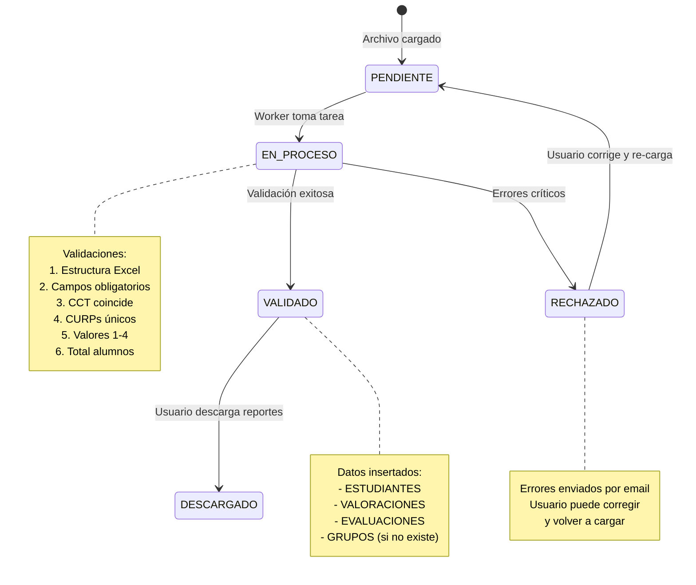
```mermaid
stateDiagram-v2
    [*] --> PENDIENTE: Archivo cargado
    PENDIENTE --> EN_PROCESO: Worker toma tarea
    EN_PROCESO --> VALIDADO: Validación exitosa
    EN_PROCESO --> RECHAZADO: Errores críticos
    VALIDADO --> DESCARGADO: Usuario descarga reportes
    RECHAZADO --> PENDIENTE: Usuario corrige y re-carga
    
    note right of EN_PROCESO
        Validaciones:
        1. Estructura Excel
        2. Campos obligatorios
        3. CCT coincide
        4. CURPs únicos
        5. Valores 1-4
        6. Total alumnos
    end note
    
    note right of VALIDADO
        Datos insertados:
        - ESTUDIANTES
        - VALORACIONES
        - EVALUACIONES
        - GRUPOS (si no existe)
    end note
    
    note right of RECHAZADO
        Errores enviados por email
        Usuario puede corregir
        y volver a cargar
    end note
```

---

## 9. Fase 7: Generación de Reportes PDF

### 9.1 Flujo de Generación

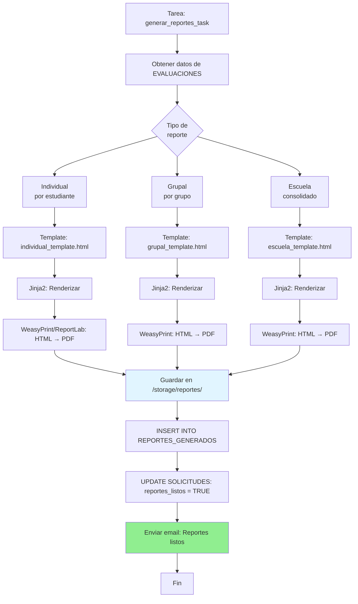
```mermaid
graph TB
    A[Tarea: generar_reportes_task] --> B[Obtener datos de EVALUACIONES]
    B --> C{Tipo de<br/>reporte}
    
    C --> D1[Individual<br/>por estudiante]
    C --> D2[Grupal<br/>por grupo]
    C --> D3[Escuela<br/>consolidado]
    
    D1 --> E1[Template: individual_template.html]
    D2 --> E2[Template: grupal_template.html]
    D3 --> E3[Template: escuela_template.html]
    
    E1 --> F1[Jinja2: Renderizar]
    E2 --> F2[Jinja2: Renderizar]
    E3 --> F3[Jinja2: Renderizar]
    
    F1 --> G1[WeasyPrint/ReportLab: HTML → PDF]
    F2 --> G2[WeasyPrint: HTML → PDF]
    F3 --> G3[WeasyPrint: HTML → PDF]
    
    G1 --> H[Guardar en /storage/reportes/]
    G2 --> H
    G3 --> H
    
    H --> I[INSERT INTO REPORTES_GENERADOS]
    I --> J[UPDATE SOLICITUDES: reportes_listos = TRUE]
    J --> K[Enviar email: Reportes listos]
    K --> L[Fin]
    
    style H fill:#e1f5ff
    style K fill:#90EE90
```

### 9.2 Worker de Generación de Reportes

```python
from jinja2 import Environment, FileSystemLoader
from weasyprint import HTML
import os

@shared_task(bind=True)
def generar_reportes_task(self, solicitud_id: str):
    db = SessionLocal()
    
    try:
        solicitud = db.query(SOLICITUDES).filter(SOLICITUDES.id == solicitud_id).first()
        
        # Obtener datos
        escuela = db.query(ESCUELAS).filter(ESCUELAS.id == solicitud.escuela_id).first()
        periodo = db.query(PERIODOS_EVALUACION).filter(PERIODOS_EVALUACION.id == solicitud.periodo_id).first()
        
        # Obtener evaluaciones agrupadas
        evaluaciones = db.query(
            EVALUACIONES,
            ESTUDIANTES.nombre_completo,
            ESTUDIANTES.curp,
            MATERIAS.nombre.label('materia_nombre'),
            GRUPOS.nombre.label('grupo_nombre'),
            CAT_GRADOS.nombre_completo.label('grado_nombre')
        ).join(ESTUDIANTES, EVALUACIONES.estudiante_id == ESTUDIANTES.id)\
         .join(MATERIAS, EVALUACIONES.materia_id == MATERIAS.id)\
         .join(GRUPOS, ESTUDIANTES.grupo_id == GRUPOS.id)\
         .join(CAT_GRADOS, GRUPOS.grado_id == CAT_GRADOS.id)\
         .filter(EVALUACIONES.periodo_id == solicitud.periodo_id)\
         .filter(ESTUDIANTES.escuela_id == solicitud.escuela_id)\
         .all()
        
        # Agrupar por estudiante
        estudiantes_data = {}
        for eval_row in evaluaciones:
            eval_obj = eval_row[0]
            estudiante_nombre = eval_row[1]
            estudiante_curp = eval_row[2]
            materia_nombre = eval_row[3]
            grupo_nombre = eval_row[4]
            grado_nombre = eval_row[5]
            
            if estudiante_curp not in estudiantes_data:
                estudiantes_data[estudiante_curp] = {
                    'nombre': estudiante_nombre,
                    'curp': estudiante_curp,
                    'grupo': grupo_nombre,
                    'grado': grado_nombre,
                    'evaluaciones': {}
                }
            
            estudiantes_data[estudiante_curp]['evaluaciones'][materia_nombre] = {
                'nivel': eval_obj.nivel_desempeno,
                'puntaje': eval_obj.puntaje_total,
                'observaciones': eval_obj.observaciones
            }
        
        # ====================================
        # REPORTE INDIVIDUAL POR ESTUDIANTE
        # ====================================
        env = Environment(loader=FileSystemLoader('templates/reportes'))
        template_individual = env.get_template('individual.html')
        
        reportes_generados = []
        
        for curp, estudiante in estudiantes_data.items():
            # Renderizar HTML
            html_content = template_individual.render(
                estudiante=estudiante,
                escuela=escuela,
                periodo=periodo,
                fecha_generacion=datetime.now()
            )
            
            # Generar PDF
            pdf_filename = f"reporte_individual_{curp}.pdf"
            pdf_path = f"/storage/reportes/{solicitud.id}/{pdf_filename}"
            os.makedirs(os.path.dirname(pdf_path), exist_ok=True)
            
            HTML(string=html_content).write_pdf(pdf_path)
            
            # Registrar en BD
            reporte = REPORTES_GENERADOS(
                id=uuid4(),
                solicitud_id=solicitud.id,
                tipo_reporte='INDIVIDUAL',
                nombre_archivo=pdf_filename,
                ruta_archivo=pdf_path,
                formato='PDF',
                estudiante_id=db.query(ESTUDIANTES).filter(ESTUDIANTES.curp == curp).first().id,
                generado_en=datetime.now()
            )
            db.add(reporte)
            reportes_generados.append(reporte)
        
        # ====================================
        # REPORTE GRUPAL
        # ====================================
        template_grupal = env.get_template('grupal.html')
        
        # Agrupar por grupo
        grupos_data = {}
        for curp, estudiante in estudiantes_data.items():
            grupo = estudiante['grupo']
            if grupo not in grupos_data:
                grupos_data[grupo] = {
                    'nombre': grupo,
                    'grado': estudiante['grado'],
                    'estudiantes': []
                }
            grupos_data[grupo]['estudiantes'].append(estudiante)
        
        for grupo_nombre, grupo_data in grupos_data.items():
            # Calcular estadísticas del grupo
            estadisticas = {
                'total_alumnos': len(grupo_data['estudiantes']),
                'por_materia': {}
            }
            
            for materia in ['Lectura', 'Matemáticas', 'Formación Cívica y Ética']:
                niveles_count = {'I': 0, 'II': 0, 'III': 0, 'IV': 0}
                for est in grupo_data['estudiantes']:
                    if materia in est['evaluaciones']:
                        nivel = est['evaluaciones'][materia]['nivel']
                        niveles_count[nivel] += 1
                
                estadisticas['por_materia'][materia] = niveles_count
            
            # Renderizar HTML
            html_content = template_grupal.render(
                grupo=grupo_data,
                estadisticas=estadisticas,
                escuela=escuela,
                periodo=periodo,
                fecha_generacion=datetime.now()
            )
            
            # Generar PDF
            pdf_filename = f"reporte_grupal_{grupo_nombre}.pdf"
            pdf_path = f"/storage/reportes/{solicitud.id}/{pdf_filename}"
            
            HTML(string=html_content).write_pdf(pdf_path)
            
            # Registrar en BD
            grupo_obj = db.query(GRUPOS).filter(
                GRUPOS.nombre == grupo_nombre,
                GRUPOS.escuela_id == solicitud.escuela_id
            ).first()
            
            reporte = REPORTES_GENERADOS(
                id=uuid4(),
                solicitud_id=solicitud.id,
                tipo_reporte='GRUPAL',
                nombre_archivo=pdf_filename,
                ruta_archivo=pdf_path,
                formato='PDF',
                grupo_id=grupo_obj.id if grupo_obj else None,
                generado_en=datetime.now()
            )
            db.add(reporte)
            reportes_generados.append(reporte)
        
        # ====================================
        # REPORTE DE ESCUELA (CONSOLIDADO)
        # ====================================
        template_escuela = env.get_template('escuela.html')
        
        # Estadísticas generales de la escuela
        estadisticas_escuela = {
            'total_grupos': len(grupos_data),
            'total_estudiantes': len(estudiantes_data),
            'por_grado': {},
            'por_materia_global': {}
        }
        
        # Calcular por grado
        for curp, estudiante in estudiantes_data.items():
            grado = estudiante['grado']
            if grado not in estadisticas_escuela['por_grado']:
                estadisticas_escuela['por_grado'][grado] = {
                    'total': 0,
                    'por_materia': {}
                }
            estadisticas_escuela['por_grado'][grado]['total'] += 1
        
        # Renderizar HTML
        html_content = template_escuela.render(
            escuela=escuela,
            periodo=periodo,
            estadisticas=estadisticas_escuela,
            grupos=grupos_data,
            fecha_generacion=datetime.now()
        )
        
        # Generar PDF
        pdf_filename = f"reporte_escuela_{escuela.cct}.pdf"
        pdf_path = f"/storage/reportes/{solicitud.id}/{pdf_filename}"
        
        HTML(string=html_content).write_pdf(pdf_path)
        
        # Registrar en BD
        reporte = REPORTES_GENERADOS(
            id=uuid4(),
            solicitud_id=solicitud.id,
            tipo_reporte='ESCUELA',
            nombre_archivo=pdf_filename,
            ruta_archivo=pdf_path,
            formato='PDF',
            escuela_id=solicitud.escuela_id,
            generado_en=datetime.now()
        )
        db.add(reporte)
        reportes_generados.append(reporte)
        
        # Actualizar solicitud
        solicitud.reportes_listos = True
        db.commit()
        
        # Enviar email
        enviar_email_reportes_listos(solicitud, len(reportes_generados))
        
        return {
            "success": True,
            "total_reportes": len(reportes_generados),
            "individuales": len(estudiantes_data),
            "grupales": len(grupos_data),
            "escuela": 1
        }
        
    except Exception as e:
        db.rollback()
        raise self.retry(exc=e, countdown=120)
    
    finally:
        db.close()
```

### 9.3 Template HTML Individual (Ejemplo)

```html
<!-- templates/reportes/individual.html -->
<!DOCTYPE html>
<html>
<head>
    <meta charset="UTF-8">
    <title>Reporte Individual - {{ estudiante.nombre }}</title>
    <style>
        @page {
            size: letter;
            margin: 2cm;
        }
        body {
            font-family: 'Arial', sans-serif;
            font-size: 11pt;
        }
        .header {
            text-align: center;
            margin-bottom: 30px;
        }
        .logo {
            width: 100px;
        }
        h1 {
            color: #003366;
            font-size: 18pt;
        }
        .info-estudiante {
            background-color: #f0f0f0;
            padding: 15px;
            margin-bottom: 20px;
            border-left: 5px solid #003366;
        }
        table {
            width: 100%;
            border-collapse: collapse;
            margin-top: 20px;
        }
        th {
            background-color: #003366;
            color: white;
            padding: 10px;
            text-align: left;
        }
        td {
            padding: 10px;
            border-bottom: 1px solid #ddd;
        }
        .nivel-IV { color: #28a745; font-weight: bold; }
        .nivel-III { color: #17a2b8; font-weight: bold; }
        .nivel-II { color: #ffc107; font-weight: bold; }
        .nivel-I { color: #dc3545; font-weight: bold; }
        .footer {
            margin-top: 40px;
            text-align: center;
            font-size: 9pt;
            color: #666;
        }
    </style>
</head>
<body>
    <div class="header">
        
        <h1>Evaluación Diagnóstica {{ periodo.ciclo_escolar }}</h1>
        <p><strong>{{ escuela.nombre }}</strong> ({{ escuela.cct }})</p>
    </div>
    
    <div class="info-estudiante">
        <p><strong>Estudiante:</strong> {{ estudiante.nombre }}</p>
        <p><strong>CURP:</strong> {{ estudiante.curp }}</p>
        <p><strong>Grado:</strong> {{ estudiante.grado }} - Grupo: {{ estudiante.grupo }}</p>
    </div>
    
    <h2>Resultados por Materia</h2>
    
    <table>
        <thead>
            <tr>
                <th>Materia</th>
                <th>Nivel de Desempeño</th>
                <th>Puntaje Total</th>
            </tr>
        </thead>
        <tbody>
            
            <tr>
                <td>{{ materia }}</td>
                <td class="nivel-{{ eval.nivel }}">Nivel {{ eval.nivel }}</td>
                <td>{{ eval.puntaje }} puntos</td>
            </tr>
            
        </tbody>
    </table>
    
    <h3>Interpretación de Niveles</h3>
    <ul>
        <li><span class="nivel-IV">Nivel IV:</span> Dominio sobresaliente - El estudiante supera las expectativas</li>
        <li><span class="nivel-III">Nivel III:</span> Dominio satisfactorio - El estudiante cumple las expectativas</li>
        <li><span class="nivel-II">Nivel II:</span> Dominio básico - El estudiante está en proceso</li>
        <li><span class="nivel-I">Nivel I:</span> Requiere apoyo - El estudiante necesita refuerzo</li>
    </ul>
    
    <div class="footer">
        <p>Reporte generado el {{ fecha_generacion.strftime('%d/%m/%Y %H:%M') }}</p>
        <p>Sistema de Evaluación Diagnóstica - Secretaría de Educación Pública</p>
    </div>
</body>
</html>
```

### 9.4 Endpoint de Descarga de Reportes

```python
@router.get("/solicitudes/{solicitud_id}/reportes")
async def listar_reportes(
    solicitud_id: UUID,
    current_user: USUARIOS = Depends(get_current_user),
    db: Session = Depends(get_db)
):
    # Verificar acceso
    solicitud = db.query(SOLICITUDES).filter(
        SOLICITUDES.id == solicitud_id,
        SOLICITUDES.usuario_id == current_user.id
    ).first()
    
    if not solicitud:
        raise HTTPException(404, "Solicitud no encontrada")
    
    if not solicitud.reportes_listos:
        return {
            "reportes_listos": False,
            "mensaje": "Reportes en generación. Por favor espera."
        }
    
    # Obtener reportes
    reportes = db.query(REPORTES_GENERADOS).filter(
        REPORTES_GENERADOS.solicitud_id == solicitud_id
    ).all()
    
    return {
        "reportes_listos": True,
        "total": len(reportes),
        "reportes": [
            {
                "id": str(r.id),
                "tipo": r.tipo_reporte,
                "nombre_archivo": r.nombre_archivo,
                "formato": r.formato,
                "generado_en": r.generado_en,
                "download_url": f"/api/solicitudes/{solicitud_id}/reportes/{r.id}/download"
            }
            for r in reportes
        ]
    }


@router.get("/solicitudes/{solicitud_id}/reportes/{reporte_id}/download")
async def descargar_reporte(
    solicitud_id: UUID,
    reporte_id: UUID,
    current_user: USUARIOS = Depends(get_current_user),
    db: Session = Depends(get_db)
):
    # Verificar acceso
    solicitud = db.query(SOLICITUDES).filter(
        SOLICITUDES.id == solicitud_id,
        SOLICITUDES.usuario_id == current_user.id
    ).first()
    
    if not solicitud:
        raise HTTPException(404, "Solicitud no encontrada")
    
    reporte = db.query(REPORTES_GENERADOS).filter(
        REPORTES_GENERADOS.id == reporte_id,
        REPORTES_GENERADOS.solicitud_id == solicitud_id
    ).first()
    
    if not reporte:
        raise HTTPException(404, "Reporte no encontrado")
    
    if not os.path.exists(reporte.ruta_archivo):
        raise HTTPException(500, "Archivo no encontrado en el servidor")
    
    # Registrar descarga
    reporte.descargado_en = datetime.now()
    reporte.veces_descargado = (reporte.veces_descargado or 0) + 1
    db.commit()
    
    return FileResponse(
        path=reporte.ruta_archivo,
        media_type='application/pdf',
        filename=reporte.nombre_archivo
    )
```

---

## 10. Fase 8: Descarga de Archivos DBF

### 10.1 Flujo de Generación DBF

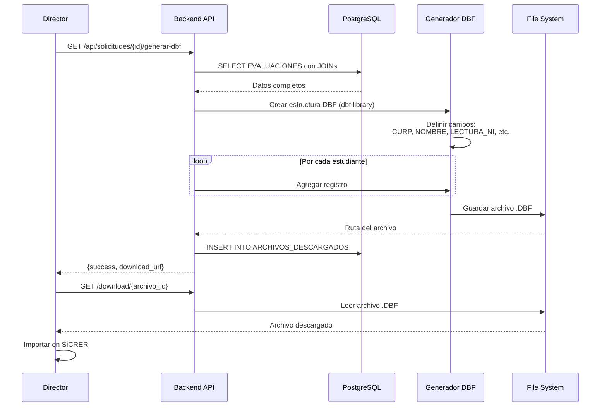
```mermaid
sequenceDiagram
    participant D as Director
    participant API as Backend API
    participant DB as PostgreSQL
    participant DBF as Generador DBF
    participant FS as File System
    
    D->>API: GET /api/solicitudes/{id}/generar-dbf
    API->>DB: SELECT EVALUACIONES con JOINs
    DB-->>API: Datos completos
    
    API->>DBF: Crear estructura DBF (dbf library)
    DBF->>DBF: Definir campos:<br/>CURP, NOMBRE, LECTURA_NI, etc.
    
    loop Por cada estudiante
        API->>DBF: Agregar registro
    end
    
    DBF->>FS: Guardar archivo .DBF
    FS-->>API: Ruta del archivo
    
    API->>DB: INSERT INTO ARCHIVOS_DESCARGADOS
    API-->>D: {success, download_url}
    
    D->>API: GET /download/{archivo_id}
    API->>FS: Leer archivo .DBF
    FS-->>D: Archivo descargado
    
    D->>D: Importar en SiCRER
```

### 10.2 Worker de Generación DBF

```python
from dbfpy3 import dbf
import struct

@shared_task
def generar_archivo_dbf_task(solicitud_id: str):
    db = SessionLocal()
    
    try:
        solicitud = db.query(SOLICITUDES).filter(SOLICITUDES.id == solicitud_id).first()
        
        # Obtener datos de evaluaciones
        registros = db.query(
            ESTUDIANTES.curp,
            ESTUDIANTES.nombre_completo,
            GRUPOS.nombre.label('grupo'),
            CAT_GRADOS.grado,
            MATERIAS.codigo.label('materia_codigo'),
            EVALUACIONES.nivel_desempeno,
            EVALUACIONES.puntaje_total,
            VALORACIONES.nivel_i,
            VALORACIONES.nivel_ii,
            VALORACIONES.nivel_iii,
            VALORACIONES.nivel_iv
        ).join(ESTUDIANTES, EVALUACIONES.estudiante_id == ESTUDIANTES.id)\
         .join(MATERIAS, EVALUACIONES.materia_id == MATERIAS.id)\
         .join(GRUPOS, ESTUDIANTES.grupo_id == GRUPOS.id)\
         .join(CAT_GRADOS, GRUPOS.grado_id == CAT_GRADOS.id)\
         .join(VALORACIONES, and_(
             VALORACIONES.estudiante_id == ESTUDIANTES.id,
             VALORACIONES.materia_id == MATERIAS.id,
             VALORACIONES.periodo_id == solicitud.periodo_id
         ))\
         .filter(EVALUACIONES.periodo_id == solicitud.periodo_id)\
         .filter(ESTUDIANTES.escuela_id == solicitud.escuela_id)\
         .all()
        
        # Agrupar por estudiante (pivot para tener todas las materias en una fila)
        estudiantes_dict = {}
        for reg in registros:
            curp = reg.curp
            if curp not in estudiantes_dict:
                estudiantes_dict[curp] = {
                    'CURP': reg.curp,
                    'NOMBRE': reg.nombre_completo[:50],  # DBF limit
                    'GRUPO': reg.grupo,
                    'GRADO': reg.grado
                }
            
            # Agregar datos por materia
            materia = reg.materia_codigo
            estudiantes_dict[curp][f'{materia}_NI'] = reg.nivel_i
            estudiantes_dict[curp][f'{materia}_NII'] = reg.nivel_ii
            estudiantes_dict[curp][f'{materia}_NIII'] = reg.nivel_iii
            estudiantes_dict[curp][f'{materia}_NIV'] = reg.nivel_iv
            estudiantes_dict[curp][f'{materia}_NIVEL'] = reg.nivel_desempeno
        
        # Crear archivo DBF
        dbf_filename = f"evaluaciones_{solicitud.escuela.cct}.dbf"
        dbf_path = f"/storage/dbf/{solicitud.id}/{dbf_filename}"
        os.makedirs(os.path.dirname(dbf_path), exist_ok=True)
        
        # Definir estructura DBF
        db_dbf = dbf.Dbf(dbf_path, new=True)
        db_dbf.add_field("CURP", "C", 18)
        db_dbf.add_field("NOMBRE", "C", 50)
        db_dbf.add_field("GRUPO", "C", 10)
        db_dbf.add_field("GRADO", "N", 1, 0)
        db_dbf.add_field("LEC_NI", "N", 1, 0)
        db_dbf.add_field("LEC_NII", "N", 1, 0)
        db_dbf.add_field("LEC_NIII", "N", 1, 0)
        db_dbf.add_field("LEC_NIV", "N", 1, 0)
        db_dbf.add_field("LEC_NIVEL", "C", 3)
        db_dbf.add_field("MAT_NI", "N", 1, 0)
        db_dbf.add_field("MAT_NII", "N", 1, 0)
        db_dbf.add_field("MAT_NIII", "N", 1, 0)
        db_dbf.add_field("MAT_NIV", "N", 1, 0)
        db_dbf.add_field("MAT_NIVEL", "C", 3)
        db_dbf.add_field("FCE_NI", "N", 1, 0)
        db_dbf.add_field("FCE_NII", "N", 1, 0)
        db_dbf.add_field("FCE_NIII", "N", 1, 0)
        db_dbf.add_field("FCE_NIV", "N", 1, 0)
        db_dbf.add_field("FCE_NIVEL", "C", 3)
        
        # Insertar registros
        for curp, estudiante in estudiantes_dict.items():
            rec = db_dbf.new_record()
            rec["CURP"] = estudiante.get('CURP', '')
            rec["NOMBRE"] = estudiante.get('NOMBRE', '')
            rec["GRUPO"] = estudiante.get('GRUPO', '')
            rec["GRADO"] = estudiante.get('GRADO', 0)
            rec["LEC_NI"] = estudiante.get('LEC_NI', 0)
            rec["LEC_NII"] = estudiante.get('LEC_NII', 0)
            rec["LEC_NIII"] = estudiante.get('LEC_NIII', 0)
            rec["LEC_NIV"] = estudiante.get('LEC_NIV', 0)
            rec["LEC_NIVEL"] = estudiante.get('LEC_NIVEL', '')
            rec["MAT_NI"] = estudiante.get('MAT_NI', 0)
            rec["MAT_NII"] = estudiante.get('MAT_NII', 0)
            rec["MAT_NIII"] = estudiante.get('MAT_NIII', 0)
            rec["MAT_NIV"] = estudiante.get('MAT_NIV', 0)
            rec["MAT_NIVEL"] = estudiante.get('MAT_NIVEL', '')
            rec["FCE_NI"] = estudiante.get('FCE_NI', 0)
            rec["FCE_NII"] = estudiante.get('FCE_NII', 0)
            rec["FCE_NIII"] = estudiante.get('FCE_NIII', 0)
            rec["FCE_NIV"] = estudiante.get('FCE_NIV', 0)
            rec["FCE_NIVEL"] = estudiante.get('FCE_NIVEL', '')
            rec.store()
        
        db_dbf.close()
        
        # Registrar en BD
        archivo_descargado = ARCHIVOS_CARGADOS(
            id=uuid4(),
            solicitud_id=solicitud.id,
            nombre_original=dbf_filename,
            ruta_archivo=dbf_path,
            tipo_archivo='DBF',
            tamano_bytes=os.path.getsize(dbf_path),
            hash_sha256=calculate_hash(dbf_path),
            uploaded_by=solicitud.usuario_id,
            created_at=datetime.now()
        )
        db.add(archivo_descargado)
        
        # Actualizar solicitud
        solicitud.estado = 'DESCARGADO'
        db.commit()
        
        return {
            "success": True,
            "archivo_id": str(archivo_descargado.id),
            "ruta": dbf_path
        }
        
    except Exception as e:
        db.rollback()
        raise
    
    finally:
        db.close()
```

---

## 11. Fase 9: Segunda Aplicación EIA2

### 11.1 Flujo de Segunda Aplicación

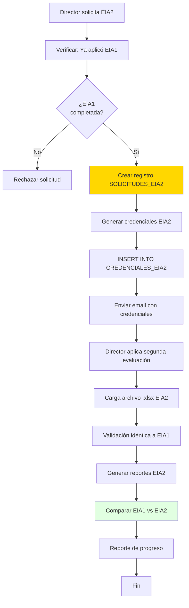
```mermaid
graph TB
    A[Director solicita EIA2] --> B[Verificar: Ya aplicó EIA1]
    B --> C{¿EIA1<br/>completada?}
    C -->|No| D[Rechazar solicitud]
    C -->|Sí| E[Crear registro SOLICITUDES_EIA2]
    E --> F[Generar credenciales EIA2]
    F --> G[INSERT INTO CREDENCIALES_EIA2]
    G --> H[Enviar email con credenciales]
    H --> I[Director aplica segunda evaluación]
    I --> J[Carga archivo .xlsx EIA2]
    J --> K[Validación idéntica a EIA1]
    K --> L[Generar reportes EIA2]
    L --> M[Comparar EIA1 vs EIA2]
    M --> N[Reporte de progreso]
    N --> O[Fin]
    
    style E fill:#FFD700
    style M fill:#e1ffe1
```

### 11.2 Endpoint de Solicitud EIA2

```python
@router.post("/solicitudes/{solicitud_id}/solicitar-eia2")
async def solicitar_eia2(
    solicitud_id: UUID,
    current_user: USUARIOS = Depends(get_current_user),
    db: Session = Depends(get_db)
):
    # Verificar que exista EIA1
    solicitud_eia1 = db.query(SOLICITUDES).filter(
        SOLICITUDES.id == solicitud_id,
        SOLICITUDES.usuario_id == current_user.id,
        SOLICITUDES.estado == 'VALIDADO'
    ).first()
    
    if not solicitud_eia1:
        raise HTTPException(400, "Debes completar la primera aplicación (EIA1) antes de solicitar EIA2")
    
    # Verificar que no exista ya una EIA2
    eia2_existente = db.query(SOLICITUDES_EIA2).filter(
        SOLICITUDES_EIA2.solicitud_original_id == solicitud_id
    ).first()
    
    if eia2_existente:
        raise HTTPException(400, "Ya existe una solicitud EIA2 para esta evaluación")
    
    # Crear solicitud EIA2
    solicitud_eia2_id = uuid4()
    solicitud_eia2 = SOLICITUDES_EIA2(
        id=solicitud_eia2_id,
        solicitud_original_id=solicitud_id,
        usuario_id=current_user.id,
        escuela_id=current_user.escuela_id,
        estado='PENDIENTE',
        fecha_solicitud=datetime.now()
    )
    db.add(solicitud_eia2)
    
    # Generar credenciales
    credencial = CREDENCIALES_EIA2(
        id=uuid4(),
        solicitud_eia2_id=solicitud_eia2_id,
        usuario_id=current_user.id,
        clave_acceso=generar_clave_acceso(),  # Código único
        activa=True,
        created_at=datetime.now()
    )
    db.add(credencial)
    
    db.commit()
    
    # Enviar email
    enviar_email_credenciales_eia2(current_user, credencial)
    
    return {
        "success": True,
        "solicitud_eia2_id": str(solicitud_eia2_id),
        "clave_acceso": credencial.clave_acceso,
        "mensaje": "Solicitud EIA2 creada. Revisa tu email para las credenciales."
    }


def generar_clave_acceso():
    """Genera una clave única de 12 caracteres"""
    import random
    import string
    return ''.join(random.choices(string.ascii_uppercase + string.digits, k=12))
```

---

## 12. Flujos de Excepción y Soporte

### 12.1 Sistema de Tickets

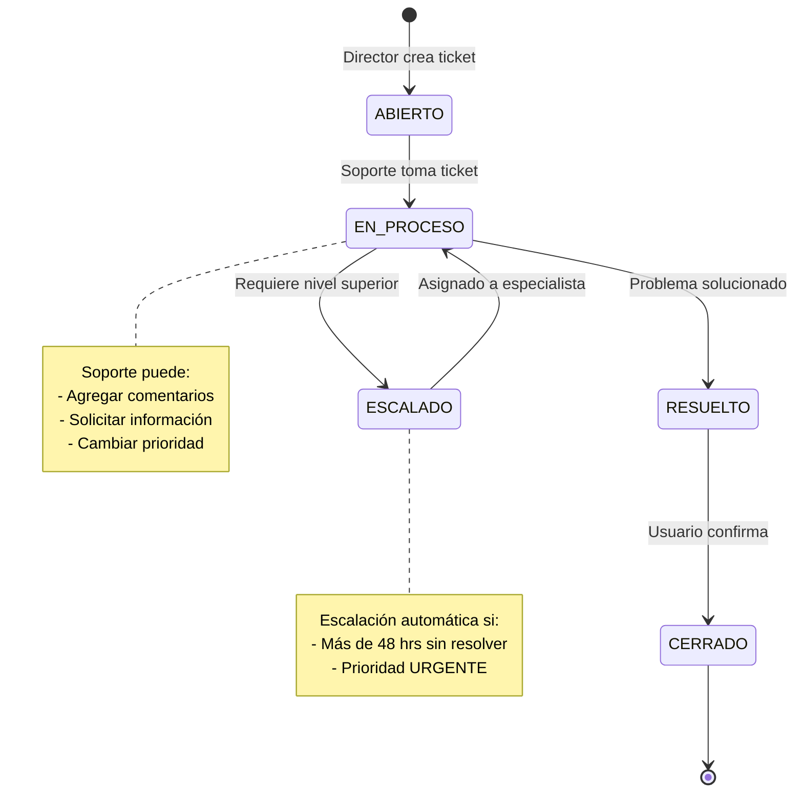
```mermaid
stateDiagram-v2
    [*] --> ABIERTO: Director crea ticket
    ABIERTO --> EN_PROCESO: Soporte toma ticket
    EN_PROCESO --> RESUELTO: Problema solucionado
    EN_PROCESO --> ESCALADO: Requiere nivel superior
    ESCALADO --> EN_PROCESO: Asignado a especialista
    RESUELTO --> CERRADO: Usuario confirma
    CERRADO --> [*]
    
    note right of EN_PROCESO
        Soporte puede:
        - Agregar comentarios
        - Solicitar información
        - Cambiar prioridad
    end note
    
    note right of ESCALADO
        Escalación automática si:
        - Más de 48 hrs sin resolver
        - Prioridad URGENTE
    end note
```

### 12.2 Endpoint de Creación de Ticket

```python
@router.post("/tickets")
async def crear_ticket(
    ticket_data: CrearTicketRequest,
    current_user: USUARIOS = Depends(get_current_user),
    db: Session = Depends(get_db)
):
    ticket = TICKETS(
        id=uuid4(),
        usuario_id=current_user.id,
        solicitud_id=ticket_data.solicitud_id,
        asunto=ticket_data.asunto,
        descripcion=ticket_data.descripcion,
        prioridad=ticket_data.prioridad or 'MEDIA',
        estado='ABIERTO',
        created_at=datetime.now()
    )
    db.add(ticket)
    
    # Comentario inicial
    comentario = COMENTARIOS_TICKET(
        id=uuid4(),
        ticket_id=ticket.id,
        usuario_id=current_user.id,
        tipo_usuario='SOLICITANTE',
        comentario=ticket_data.descripcion,
        created_at=datetime.now()
    )
    db.add(comentario)
    
    db.commit()
    
    # Notificar a soporte
    enviar_notificacion_nuevo_ticket(ticket)
    
    return {
        "success": True,
        "ticket_id": str(ticket.id),
        "mensaje": "Ticket creado. El equipo de soporte te contactará pronto."
    }
```

---

## 13. Monitoreo y Métricas

### 13.1 Dashboard de Administrador

**Métricas en tiempo real:**

```sql
-- Total de solicitudes por estado
SELECT estado, COUNT(*) as total
FROM SOLICITUDES
WHERE created_at >= CURRENT_DATE - INTERVAL '30 days'
GROUP BY estado;

-- Promedio de tiempo de procesamiento
SELECT 
    AVG(EXTRACT(EPOCH FROM (fecha_procesamiento_fin - fecha_procesamiento_inicio)) / 60) as minutos_promedio
FROM SOLICITUDES
WHERE estado = 'VALIDADO';

-- Top 10 escuelas con más solicitudes
SELECT 
    e.nombre,
    e.cct,
    COUNT(s.id) as total_solicitudes
FROM SOLICITUDES s
JOIN ESCUELAS e ON s.escuela_id = e.id
GROUP BY e.id, e.nombre, e.cct
ORDER BY total_solicitudes DESC
LIMIT 10;

-- Tasa de rechazo
SELECT 
    COUNT(CASE WHEN estado = 'RECHAZADO' THEN 1 END) * 100.0 / COUNT(*) as tasa_rechazo_pct
FROM SOLICITUDES
WHERE created_at >= CURRENT_DATE - INTERVAL '7 days';
```

### 13.2 Alertas Automáticas

```python
# Monitoreo de cola de tareas
@shared_task(name='monitorear_sistema')
def monitorear_sistema_task():
    db = SessionLocal()
    
    # Alertar si hay solicitudes pendientes > 2 horas
    solicitudes_pendientes = db.query(SOLICITUDES).filter(
        SOLICITUDES.estado == 'PENDIENTE',
        SOLICITUDES.created_at < datetime.now() - timedelta(hours=2)
    ).count()
    
    if solicitudes_pendientes > 10:
        enviar_alerta_admin(f"⚠️ {solicitudes_pendientes} solicitudes pendientes > 2 horas")
    
    # Alertar si hay tickets urgentes sin atender
    tickets_urgentes = db.query(TICKETS).filter(
        TICKETS.prioridad == 'URGENTE',
        TICKETS.estado == 'ABIERTO',
        TICKETS.created_at < datetime.now() - timedelta(hours=1)
    ).count()
    
    if tickets_urgentes > 0:
        enviar_alerta_admin(f"🚨 {tickets_urgentes} tickets URGENTES sin atender")
    
    db.close()
```

---

## Resumen del Flujo Completo

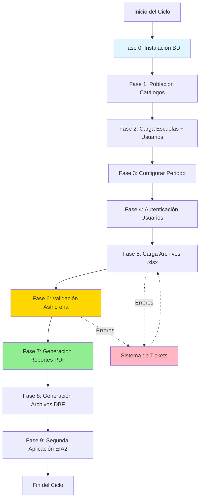
```mermaid
graph TB
    START[Inicio del Ciclo] --> FASE0[Fase 0: Instalación BD]
    FASE0 --> FASE1[Fase 1: Población Catálogos]
    FASE1 --> FASE2[Fase 2: Carga Escuelas + Usuarios]
    FASE2 --> FASE3[Fase 3: Configurar Periodo]
    FASE3 --> FASE4[Fase 4: Autenticación Usuarios]
    FASE4 --> FASE5[Fase 5: Carga Archivos .xlsx]
    FASE5 --> FASE6[Fase 6: Validación Asíncrona]
    FASE6 --> FASE7[Fase 7: Generación Reportes PDF]
    FASE7 --> FASE8[Fase 8: Generación Archivos DBF]
    FASE8 --> FASE9[Fase 9: Segunda Aplicación EIA2]
    FASE9 --> END[Fin del Ciclo]
    
    FASE5 -.->|Errores| SOPORTE[Sistema de Tickets]
    FASE6 -.->|Errores| SOPORTE
    SOPORTE -.-> FASE5
    
    style FASE0 fill:#e1f5ff
    style FASE6 fill:#FFD700
    style FASE7 fill:#90EE90
    style SOPORTE fill:#FFB6C1
```

---

**Documento generado:** 9 de enero de 2026  
**Sistema:** Plataforma de Evaluación Diagnóstica SEP  
**Versión:** 1.0  

Este documento describe el flujo completo de datos desde la implementación hasta la operación diaria del sistema. Para más detalles técnicos, consultar:
- [ESTRUCTURA_DE_DATOS.md](./ESTRUCTURA_DE_DATOS.md)
- [REQUERIMIENTOS_Y_CASOS_DE_USO.md](./REQUERIMIENTOS_Y_CASOS_DE_USO.md)
- [FLUJO_OPERATIVO_OFICIAL.md](./FLUJO_OPERATIVO_OFICIAL.md)
