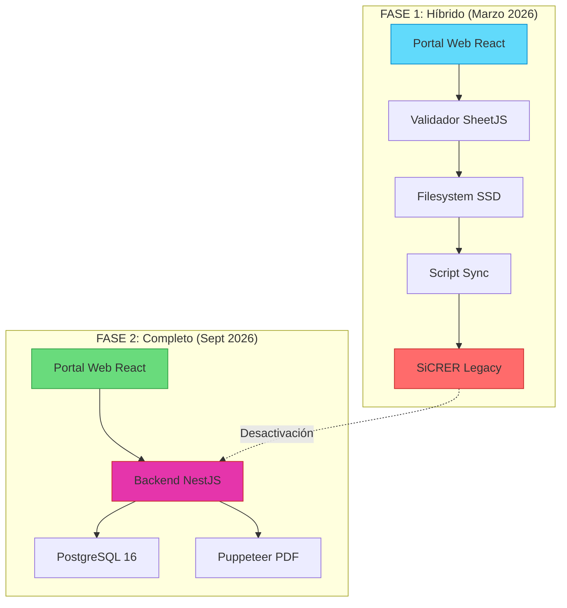
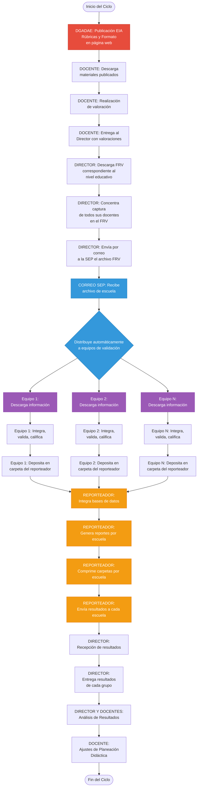
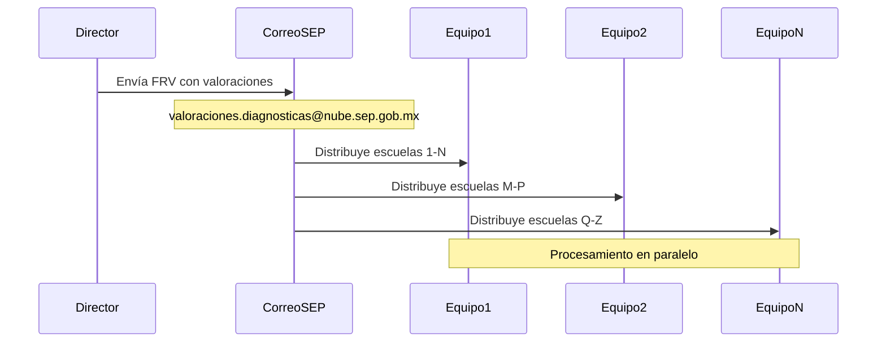
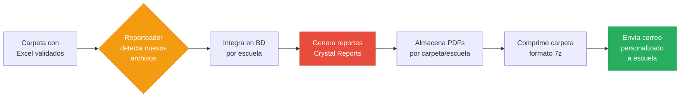
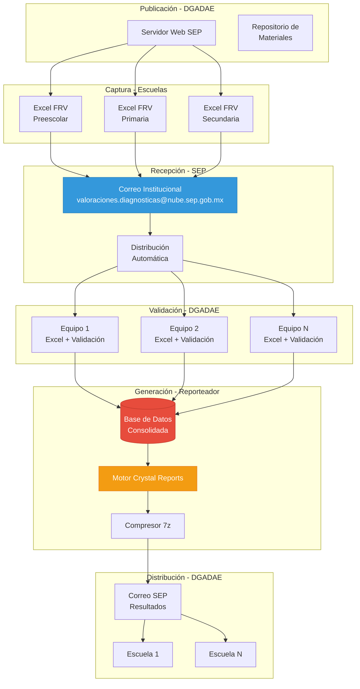
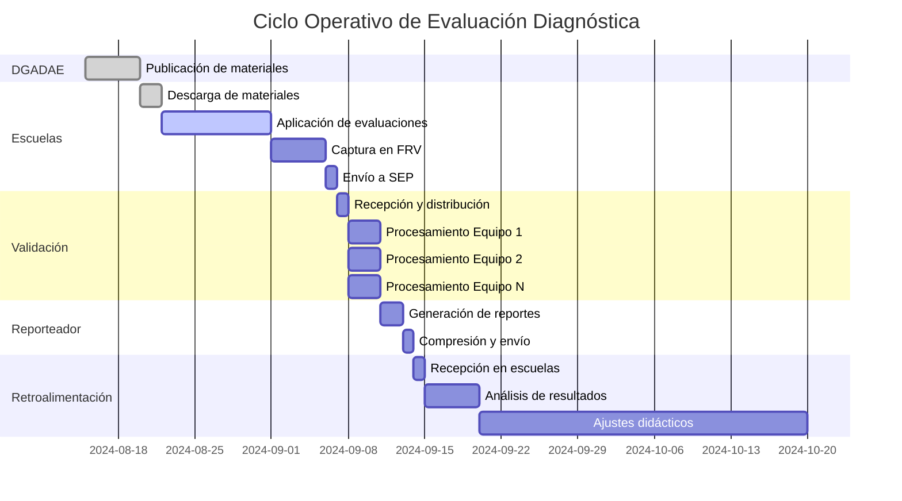
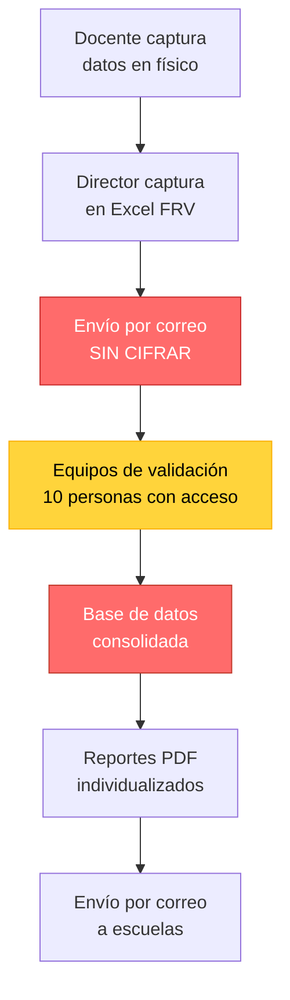
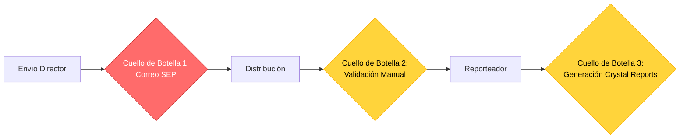

# 📋 FLUJO OPERATIVO OFICIAL - SISTEMA SiCRER

## Versión 2.0 - Estrategia Bifásica

> **Documentación basada en diagramas oficiales de la SEP**
> Estrategia para la Recuperación de la Información - Ciclo 2024-2025
> **ACTUALIZACIÓN:** Migración a Stack Open Source (Python + Angular + PostgreSQL)

---

## 🎯 VISIÓN GENERAL

Este documento detalla el **flujo operativo completo** del Sistema de Captura de Resultados de Evaluación y Registro (SiCRER), basado en la documentación oficial proporcionada por la Dirección General de Administración y Análisis de Evaluación (**DGADAE**) de la Secretaría de Educación Pública.

### 🚀 ESTRATEGIA DE MODERNIZACIÓN BIFÁSICA

**Fase 1 (Marzo 2026):** Portal Web Híbrido

- 🌐 Portal web **Angular 17** para directores (upload FRV, descarga PDFs)
- ✅ Validación automatizada con **pandas + openpyxl** (30 seg vs 15 min manual)
- 🎫 Sistema de tickets para errores de validación
- 🔄 Sincronización nocturna con legacy para procesamiento
- 📊 Adopción esperada: 115K-150K escuelas públicas (de ~230K según SEP 2024)

**Fase 2 (Septiembre 2026):** Migración Completa

- ⚡ Procesamiento nativo **Python** (FastAPI + workers Celery/RQ) que elimina SiCRER.exe
- 📄 Generación PDF con **WeasyPrint/ReportLab** (elimina Crystal Reports)
- 🔒 Compliance LGPDP 100% (módulo ARCO + consentimientos)
- 📈 Dashboard analytics con **Angular** (ng-charts/ngx-echarts)



---

## 👥 ACTORES DEL SISTEMA

### 🆕 0. PORTAL WEB (Fase 1 - Nuevo)

**Rol Principal:** Interfaz moderna para directores

**Responsabilidades:**

- 🔐 Autenticación JWT (CCT + contraseña)
- 📤 Upload FRV con drag & drop (React Dropzone)
- ✅ Validación en tiempo real (30 segundos)
- 🎫 Generación automática de tickets tras N fallos
- 📥 Descarga de reportes PDF desde navegador
- 📊 Dashboard con estado de cargas

**Stack Tecnológico:**

- Frontend: React 18 + TypeScript 5 + Vite 5
- Backend: NestJS 10 + Prisma 5 + PostgreSQL 16
- Storage: Filesystem nativo SSD (~550 GB/año)
- Cache: node-cache (memoria nativa) + pg-boss (jobs en PostgreSQL)

**Volumetría Fase 1:**

- Escuelas objetivo: 115K-150K públicas (de ~230K totales según estadísticas SEP 2024)
- Uploads concurrentes: 5,000 escuelas/día
- Tamaño promedio FRV: 200 KB
- Tiempo validación: 30 seg (vs 15 min manual)
- Reducción tickets: 70% (validación automática)

**Nota sobre volumetría:** México cuenta con aproximadamente 230,000 escuelas públicas de educación básica (preescolar, primaria, secundaria). La Fase 1 se enfoca en escuelas con mayor capacidad tecnológica, estimando 50-65% de adopción inicial.

---

## 👥 ACTORES DEL SISTEMA (Legacy + Nuevos)

### 1. DGADAE (Dirección General de Administración y Análisis de Evaluación)

**Rol Principal:** Coordinación central y validación de datos

**Responsabilidades:**

- ✅ Publicación de EIA, Rúbricas y Formatos en página web
- ✅ Validación de información recibida de escuelas
- ✅ Integración de valoraciones recibidas en el día
- ✅ Recepción de valoraciones enviadas por directores
- ✅ Determinación del Nivel de Integración por campo formativo
- ✅ Generación de reportes de resultados (grupo y escuela para 4 campos formativos)
- ✅ Envío de resultados a cada escuela por correo electrónico

**Recursos:**

- 📊 Sistema Generador de Reportes
- 🔐 Programas para validación y asignación de "Niveles de Integración del Aprendizaje"
- 📝 Plantilla en Excel para integrar información
- 💻 **10 Equipos de cómputo**
- 👥 **10 Personas** en equipo

### 2. DIRECTOR DEL PLANTEL

**Rol Principal:** Administración escolar y consolidación de datos

**Responsabilidades:**

- 📥 Descargar el Formato para el Registro de Valoraciones (FRV)
- 📊 Capturar valoraciones de todos los grados y grupos de su escuela
- 📧 Enviar archivo Excel del FRV a la SEP (correo: valoraciones.diagnosticas@nube.sep.gob.mx)

**Recursos:**

- 📄 "Ejercicios Integradores del Aprendizaje" con valoraciones
- 📋 "Formato para el Registro de Valoraciones"

**Procedimiento:**

```txt
1. Descarga FRV del nivel educativo correspondiente
2. Captura valoraciones de todos grados/grupos
3. Envía Excel a: valoraciones.diagnosticas@nube.sep.gob.mx
```

### 3. DOCENTE

**Rol Principal:** Aplicación de evaluaciones y valoración

**Responsabilidades:**

- 📚 Descarga de materiales publicados (EIA, Rúbricas)
- ✏️ Realización de valoración de estudiantes
- 📝 Asignación de valoración con apoyo de rúbricas
- 📤 Entrega de EIA con valoraciones al directivo
- 📊 Ajustes de Planeación Didáctica basados en resultados
- 📈 Análisis de Resultados (junto con director)

**Recursos:**

- 📖 "Ejercicios Integradores del Aprendizaje"
- 📏 "Rúbricas"

**Tiempo:**

- Sin definir (Procedimiento coordinado por DGADAE)

### 4. CORREO SEP (Sistema Automatizado)

**Rol Principal:** Distribución automatizada de información

**Responsabilidades:**

- 📨 Recibir archivos de información capturada por directivos
- 🔄 Distribuir automáticamente correos a equipos de Validación

**Recursos:**

- 📧 Correo electrónico con archivo "Formato de Registro de Valoraciones"
- 💻 1 Equipo de cómputo
- 👤 1 Persona

**Tiempo:**

- Distribución inmediata

### 5. VALIDACIÓN (Equipos de Trabajo)

**Rol Principal:** Procesamiento paralelo de datos de escuelas

**Estructura:**

- **Equipo 1, Equipo 2, ... Equipo N** (múltiples equipos en paralelo)
- Cada equipo procesa un subconjunto de escuelas

**Responsabilidades:**

- 📥 Descarga archivo recibido del correo del día anterior
- 🔍 Integra información en archivo Excel
- ✅ Valida información integrada, separa inconsistencias
- 🎯 Asigna "Niveles de Integración del Aprendizaje" para cada estudiante
- 📁 Coloca archivo en carpeta del "Reporteador"
- 📊 Integra todas las bases de datos recibidas
- 📄 Genera reportes y los almacena en carpeta por escuela
- 🗜️ Comprime carpetas por escuela y envía al equipo de resultados

**Recursos:**

- 📋 Archivo con "Formato de Registro de Valoraciones"
- 🔐 Programas para validación y asignación de "Niveles de Integración del Aprendizaje"
- 📊 Plantilla en Excel para integrar información
- 💻 **10 Equipos de cómputo**
- 👥 **10 Personas**

**Tiempo:**

- Grupo de actividades que toman **horas por equipo de cómputo**

### 6. REPORTEADOR (Sistema Automatizado)

**Rol Principal:** Generación masiva de reportes PDF

**Funcionamiento:**

- ⚡ De forma automática procesa archivos Excel recibidos
- 📊 Integra en base de datos el contenido del archivo
- 📁 Integra en base de datos general el contenido de archivos
- 🏫 Genera reportes para escuela contenida en base de datos
- 📦 Almacena reportes en carpeta por escuela
- 🗜️ Comprime carpetas (formato 7z)
- 📧 Envía archivos comprimidos con resultados

**Recursos:**

- 📝 Plantilla en Excel para integrar información
- 🖥️ Sistema Generador de Reportes
- 🔄 Programa para comprimir carpetas
- 💻 **10 Equipos de cómputo inicialmente**
- 📈 **Se incrementarían conforme aumente la demanda**
- 👥 **10 Personas**

**Tiempo:**

- Promedio de **1.5 minutos por escuela**

**Escalabilidad:**

- Sistema diseñado para incrementar equipos según demanda

---

## 📊 FLUJO DE INFORMACIÓN COMPLETO



---

## 📈 VOLUMETRÍA Y CAPACIDAD DEL SISTEMA

### Reportes Generados por Nivel Educativo

| Nivel Educativo | No. de Reportes por Escuela |
| ----------------- | ------------------------------ |
| **Preescolar** | 5 reportes |
| **Primaria** | 30 reportes |
| **Secundaria** | 15 reportes |

**Cálculo de Carga:**

```txt
ESCENARIO: Estado con 1,000 escuelas
- Preescolar (300 escuelas): 300 × 5 = 1,500 reportes
- Primaria (500 escuelas): 500 × 30 = 15,000 reportes
- Secundaria (200 escuelas): 200 × 15 = 3,000 reportes

TOTAL: 19,500 reportes
TIEMPO ESTIMADO: 19,500 × 1.5 min = 29,250 minutos
TIEMPO EN HORAS: 487.5 horas ≈ 20.3 días (1 equipo)

CON 10 EQUIPOS: 2.03 días de procesamiento continuo
```

### Capacidad de Procesamiento

**Configuración Inicial:**

- 💻 10 Equipos de cómputo
- 👥 10 Personas operando
- ⏱️ 1.5 minutos por escuela (promedio)
- 📊 Capacidad: ~400 escuelas/día (10 equipos trabajando 10h)

**Escalabilidad:**

- ✅ Sistema diseñado para incrementar equipos según demanda
- ✅ Procesamiento paralelo por equipos de validación
- ✅ Automatización del "Reporteador"

---

## 🔄 PROCESO DETALLADO DE VALIDACIÓN

### Fase 1: Recepción y Distribución



### Fase 2: Validación y Calificación

**Proceso de cada Equipo de Validación:**

1. **Descarga** (automática)
   - Recibe correo del día anterior
   - Extrae archivo Excel adjunto

2. **Integración**
   - Abre plantilla maestra
   - Importa datos del archivo recibido
   - Consolida en base de datos

3. **Validación**
   - Detecta inconsistencias:
     - ❌ Campos vacíos
     - ❌ Valores fuera de rango
     - ❌ CURP inválidos
     - ❌ Datos duplicados
   - Separa registros con errores
   - Da solución en paralelo

4. **Asignación de Niveles**
   - Aplica algoritmo de "Niveles de Integración del Aprendizaje"
   - Asigna nivel para cada estudiante
   - Calcula estadísticas por grupo/escuela

5. **Depósito**
   - Guarda archivo procesado en carpeta del Reporteador
   - Notifica finalización

### Fase 3: Generación de Reportes

**Proceso del Reporteador (Automatizado):**



**Tipos de Reportes Generados:**

1. **Reportes de Escuela** (Consolidados por materia):
   - `res_esc_ens.rpt` - Enseñanza/Español y Matemáticas
   - `res_esc_hyc.rpt` - Historia y Civismo
   - `res_esc_len.rpt` - Lenguaje y Comunicación
   - `res_esc_spc.rpt` - Saberes y Pensamiento Científico

2. **Reportes de Estudiante** (Individuales por formato):
   - `res_est_f2.rpt` - Formato 2
   - `res_est_f3.rpt` - Formato 3
   - `res_est_f4.rpt` - Formato 4
   - `res_est_f5.rpt` - Formato 5
   - `res_est_f6.rpt` - Formato 6 (Principal)
   - `res_est_f6a.rpt` - Formato 6a (Alternativo)

---

## ⚙️ ARQUITECTURA TÉCNICA DEL FLUJO

### Componentes del Sistema



---

## 📋 FORMATOS Y PLANTILLAS CLAVE

### 1. FRV (Formato para el Registro de Valoraciones)

**Descripción:** Plantilla Excel para captura de valoraciones por nivel educativo

**Variantes:**

- `2025_EIA_FormatoValoraciones_Preescolar.xlsx`
- `2025_EIA_FormatoValoraciones_Primaria.xlsx`
- `2025_EIA_FormatoValoraciones_Secundarias_Tecnicas_Generales.xlsx`
- `2025_EIA_FormatoValoraciones_Secundarias_Telesecundarias.xlsx`

**Campos Principales:**

- CCT de la escuela
- Grado y Grupo
- Datos del estudiante (CURP, Nombre)
- Valoraciones por campo formativo
- Observaciones

### 2. EIA (Ejercicios Integradores del Aprendizaje)

**Descripción:** Materiales de evaluación aplicados por docentes

**Componentes:**

- Ejercicios por campo formativo
- Instrucciones para aplicación
- Criterios de valoración

### 3. Rúbricas

**Descripción:** Instrumentos para asignación objetiva de valoraciones

**Estructura:**

- Niveles de desempeño
- Descriptores por nivel
- Criterios de evaluación

---

## ⏱️ LÍNEA DE TIEMPO OPERATIVA



**Duración Total Estimada:** 30-40 días desde publicación hasta ajustes

---

## 🔐 CONSIDERACIONES DE SEGURIDAD Y LGPDP

### Datos Personales Manejados

**Datos Sensibles (CURP de menores):**

- ✅ CURP de estudiantes
- ✅ Nombres completos
- ✅ Resultados de evaluación académica

**Flujo de Datos Personales:**



### ⚠️ RIESGOS IDENTIFICADOS

| Riesgo | Severidad | Punto del Flujo | Recomendación |
| -------- | ----------- | ----------------- | --------------- |
| **Correo sin cifrar** | 🔴 CRÍTICO | Envío Director→SEP | Implementar TLS/HTTPS obligatorio |
| **Excel sin protección** | 🔴 ALTO | Todo el flujo | Cifrar archivos con contraseña |
| **10 personas con acceso** | 🟡 MEDIO | Validación | Implementar logs de auditoría |
| **BD sin cifrado** | 🔴 CRÍTICO | Reporteador | Migrar a SQL Server con TDE |
| **Sin log de accesos** | 🟡 MEDIO | Todo el sistema | Implementar bitácora ARCO |

---

## 📊 MÉTRICAS Y KPIs DEL FLUJO

### Indicadores de Desempeño

| Métrica | Objetivo | Método de Medición |
| --------- | ---------- | --------------------- |
| **Tiempo de procesamiento por escuela** | ≤ 1.5 min | Timestamp inicio-fin por escuela |
| **Tasa de errores en FRV** | ≤ 5% | Registros rechazados / Total |
| **Disponibilidad del sistema** | ≥ 99% | Uptime del correo y reporteador |
| **Escuelas procesadas/día** | ≥ 400 | Contador diario |
| **Satisfacción de usuarios** | ≥ 4/5 | Encuesta post-recepción |

### Cuellos de Botella Identificados



**Cuellos de Botella:**

1. **Correo SEP** - Límite de adjuntos grandes
2. **Validación Manual** - Requiere intervención humana (10 personas)
3. **Crystal Reports** - Tecnología obsoleta y lenta

---

## 🚀 OPORTUNIDADES DE MEJORA IDENTIFICADAS

### Corto Plazo (0-3 meses)

1. **Automatizar Distribución**
   - Reemplazar correo por API REST
   - Balanceo de carga automático entre equipos

2. **Validación Automatizada**
   - Reducir de 10 personas a 2-3 supervisores
   - Algoritmos de validación automática

3. **Cifrado de Comunicaciones**
   - TLS 1.3 en todas las transmisiones
   - Cifrado de archivos Excel con AES-256

### Mediano Plazo (3-6 meses)

4. **Portal Web de Captura**

   - Reemplazar Excel FRV por formulario web
   - Validación en tiempo real
   - Reducir errores de captura

5. **Base de Datos Centralizada**

   - Migrar de Excel a SQL Server
   - Eliminar duplicidad de datos
   - Consultas en tiempo real

6. **Modernizar Reporteador**

   - Reemplazar Crystal Reports por Puppeteer + Handlebars (open source)
   - Reducir tiempo de 1.5 min a 10 segundos por escuela

### Largo Plazo (6-12 meses)

7. **Arquitectura Cloud**

   - Azure/AWS para escalabilidad
   - Procesamiento serverless
   - Reducir de 10 equipos físicos a 0

8. **Dashboard en Tiempo Real**

   - Directores ven resultados inmediatos
   - Sin esperar correos
   - Analytics predictivo

---

## 📧 INFORMACIÓN DE CONTACTO

**Correo Institucional para Envío de Valoraciones:**

```txt
valoraciones.diagnosticas@nube.sep.gob.mx
```

**Entidad Responsable:**

- Dirección General de Administración y Análisis de Evaluación (DGADAE)
- Secretaría de Educación Pública (SEP)

---

## 📚 REFERENCIAS Y ANEXOS

### Documentos Relacionados

1. **Estrategia para la Recuperación de la Información** (Diagrama oficial)
2. **Tabla de Responsables, Procedimientos, Recursos y Tiempos** (Documento oficial)
3. **Flujo de la Información - Equipos de Validación** (Diagrama técnico)

### Formatos Oficiales

- Formatos de Valoración 2025 (4 variantes por nivel educativo)
- Ejercicios Integradores del Aprendizaje (EIA)
- Rúbricas de Evaluación

---

**FLUJO OPERATIVO OFICIAL - SISTEMA SiCRER**  
**Versión:** 1.0  
**Fecha:** Noviembre 2025  
**Basado en:** Documentación oficial DGADAE/SEP  
**Autor:** Análisis PSP/RUP Complementario

> ⚠️ **NOTA IMPORTANTE:** Este documento complementa el análisis técnico principal.
> La información fue extraída de diagramas oficiales proporcionados por la SEP.
> Para el análisis completo del sistema, consultar [ANALISIS_DETALLADO_PSP_RUP.md](ANALISIS_DETALLADO_PSP_RUP.md)
