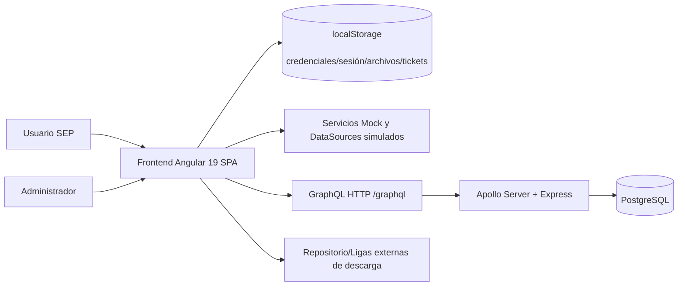
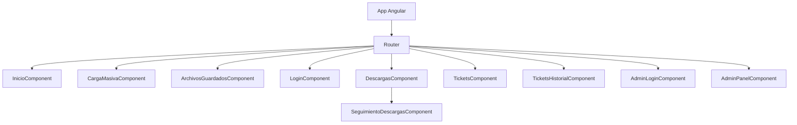
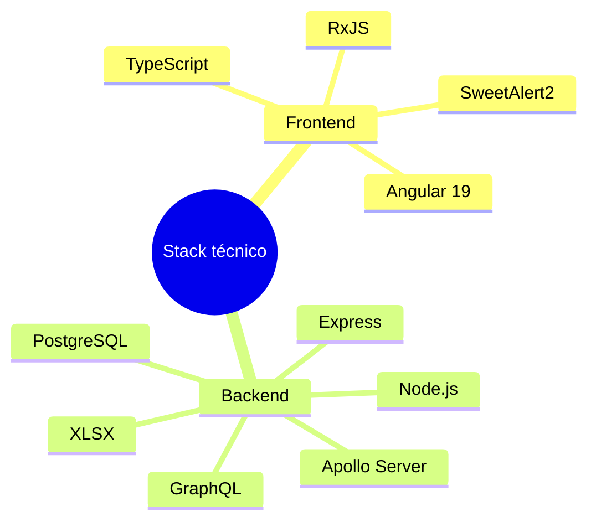
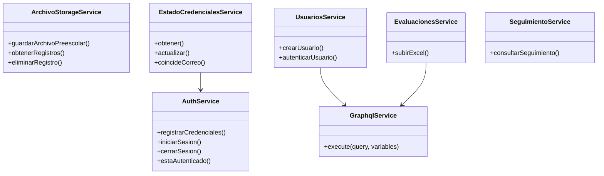
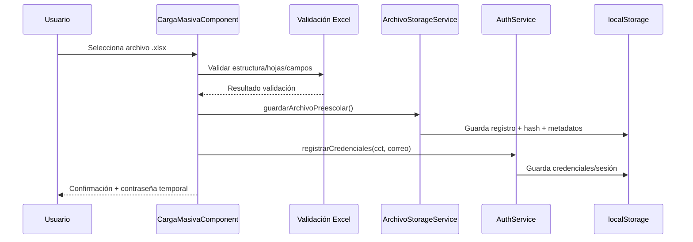
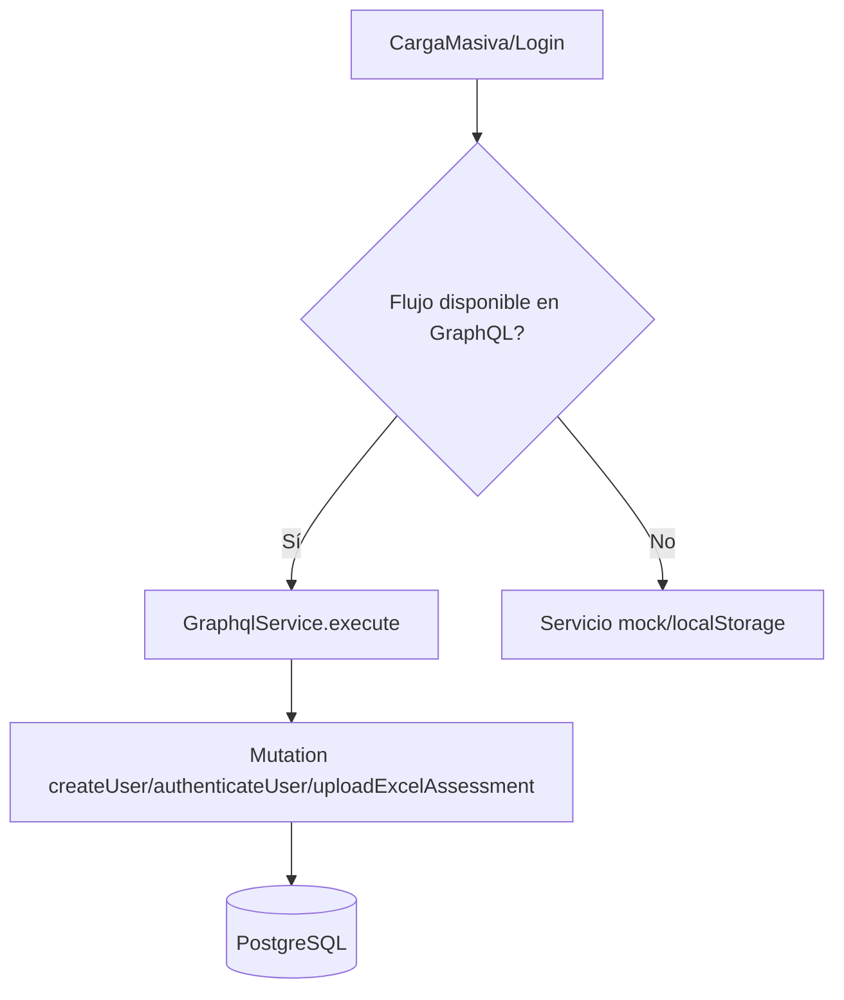
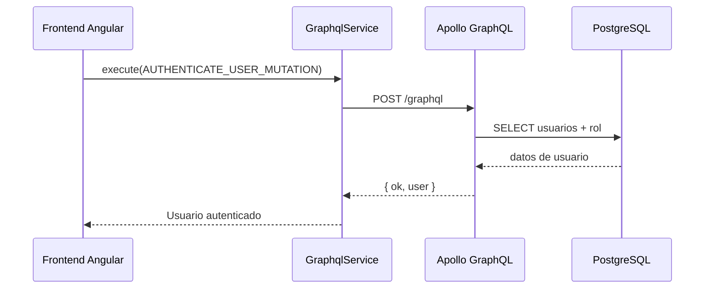
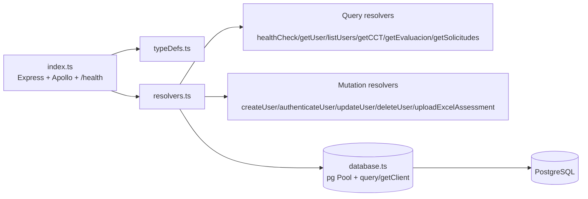
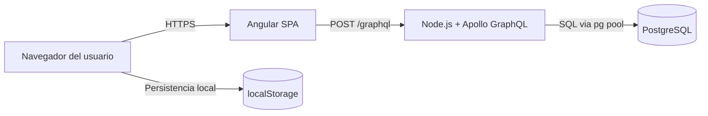
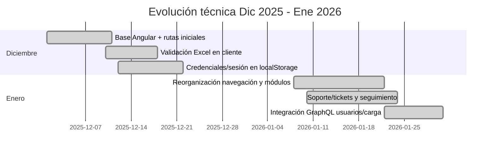

# Informe mensual de arquitectura y componentes (Diciembre 2025 – Enero 2026)

## 1) Propósito del entregable (alineado a contrato)
Este informe documenta el **análisis de arquitectura Frontend de sistemas web** orientados al Sector Educativo y presenta el **diagrama de arquitectura y componentes** solicitado: estructura lógica/tecnológica, módulos de Angular, librerías complementarias, servicios API, conexiones GraphQL y frameworks involucrados.

> En diciembre y gran parte de enero, el comportamiento funcional se sostuvo principalmente con **localStorage y servicios mock**; durante enero se consolidó la **preparación e integración GraphQL** para autenticación y carga.

---

## 2) Resumen ejecutivo por mes

### Diciembre 2025 (foco frontend + simulación local)
- Consolidación del frontend Angular y flujo de carga masiva.
- Validación de plantillas Excel en cliente.
- Generación y control de credenciales locales.
- Persistencia con localStorage (archivos, sesión, estado de credenciales).
- Gestión de duplicados por hash y reglas de negocio de primera carga.

### Enero 2026 (foco integración + madurez funcional)
- Reorganización de navegación y módulos de usuario/admin.
- Fortalecimiento de soporte (tickets, historial, seguimiento).
- Ajustes de UX/validaciones de carga.
- Integración progresiva con GraphQL para operaciones de usuario y carga de Excel.
- Backend GraphQL operativo con PostgreSQL para autenticar, crear usuario y procesar cargas.

---

## 3) Evidencia de trabajo diciembre/enero (fuentes del proyecto)

## 3.1 Bitácora del proyecto
- La bitácora documenta explícitamente avances de **2025-12-12, 2025-12-15 y 2025-12-18** con foco en autenticación, carga masiva, validación y almacenamiento local.
- También refleja avances de enero con correcciones, consolidación funcional y lineamientos de negocio.

## 3.2 Trazabilidad por commits (enero)
- En enero aparecen hitos de integración GraphQL y ajuste funcional, por ejemplo:
  - `Agregar autenticación GraphQL para login`
  - `Integrar CreateUser en carga masiva`
  - `Ajustar endpoint GraphQL en frontend`
  - `Usar updated_at en autenticacion`

---

## 4) Arquitectura lógica y tecnológica del sistema

---

## 5) Frontend Angular: módulos/páginas implementadas

Rutas funcionales:
- `/inicio`
- `/carga-masiva`
- `/archivos-preescolar`
- `/login`
- `/descargas`
- `/tickets`
- `/tickets-historial`
- `/admin/login`
- `/admin/panel`

---

## 6) Librerías y frameworks utilizados

## 6.1 Frontend
- **Angular 19** (`@angular/core`, `router`, `forms`, etc.)
- **RxJS** para flujos reactivos.
- **SweetAlert2** para alertas y confirmaciones UX.
- **TypeScript 5** + Angular CLI/Karma/Jasmine.

## 6.2 Backend/API
- **Node.js + TypeScript**
- **Apollo Server + GraphQL**
- **Express, CORS, Helmet, Compression**
- **PostgreSQL** con `pg`
- **XLSX** para parseo de archivos de carga

---

## 7) Arquitectura de servicios frontend

---

## 8) Diciembre: operación basada en localStorage (sin dependencia real de API)

Durante diciembre se implementó una arquitectura **offline-first/simulada** para destrabar entregables de frontend sin bloquearse por backend:

- `AuthService`: controla credenciales/sesión en localStorage.
- `ArchivoStorageService`: guarda archivos y metadatos, controla duplicados por hash.
- `EstadoCredencialesService`: persiste estado de credenciales para continuidad UX.
- `AdminAuthService`: token simulado para panel administrativo.
- Servicios de seguimiento/versiones en modo mock.

---

## 9) Enero: transición a integración GraphQL

En enero se mantiene la experiencia frontend pero se activa integración real por capas para operaciones clave:

- `GraphqlService` resuelve endpoint (`localhost:4000/graphql` en dev).
- `UsuariosService` consume `createUser` y `authenticateUser`.
- `EvaluacionesService` consume `uploadExcelAssessment`.
- Se conserva soporte mock para funcionalidades aún no acopladas totalmente.

---

## 10) Backend GraphQL y componentes (enero)

---

## 11) Diagrama de despliegue técnico

---

## 12) Matriz de componentes solicitada por contrato

| Componente solicitado | Estado Dic | Estado Ene | Evidencia técnica |
|---|---|---|---|
| Estructura lógica frontend | Implementada | Consolidada | Router + componentes |
| Módulos Angular/páginas | Implementados | Ajustados UX/navegación | rutas activas |
| Librerías complementarias | Integradas | Estables | Angular/RxJS/SweetAlert2 |
| Servicios API (frontend) | Simulados | Híbrido mock + real | servicios `GraphqlService`, `UsuariosService`, `EvaluacionesService` |
| Conexión GraphQL | Parcial/preparación | Operativa en flujos clave | mutations de usuarios/carga |
| Otros frameworks (backend) | En preparación | Operativos | Express + Apollo + PostgreSQL |

---

## 13) Conclusión para reporte de pago (diciembre-enero)

1. **Sí se cumplió el análisis y evolución de arquitectura frontend**, con decisiones técnicas alineadas a continuidad operativa (localStorage/mocks) mientras maduraba la capa API.
2. **Sí se avanzó en el entregable de diagrama y componentes**, al contar con arquitectura de frontend definida, servicios por dominio, integración gradual a GraphQL y backend operativo con PostgreSQL.
3. En diciembre predominó la **simulación controlada** (válida para avance funcional); en enero se materializó la **transición a integración real GraphQL** en procesos críticos.

---

## 14) Anexo: diagrama de roadmap mensual

