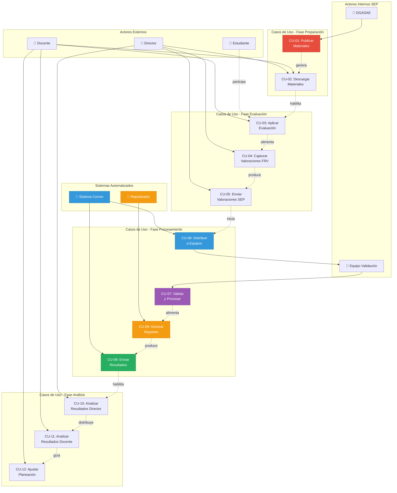
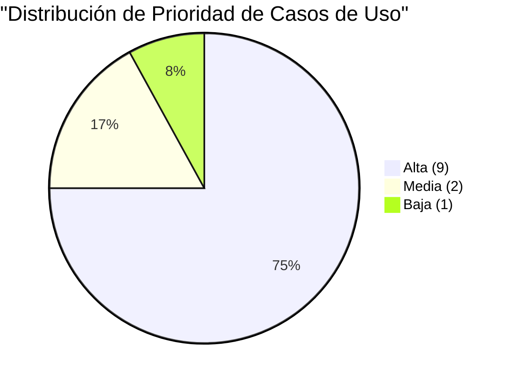

# REQUERIMIENTOS Y CASOS DE USO
## Sistema SiCRER - Evaluación Diagnóstica SEP

**Fecha:** 21 de Noviembre de 2025  
**Versión:** 1.0  
**Sistema:** SiCRER 24_25 SEPT

---

## ÍNDICE

1. [Requerimientos Funcionales](#1-requerimientos-funcionales)
2. [Requerimientos No Funcionales](#2-requerimientos-no-funcionales)
3. [Casos de Uso](#3-casos-de-uso)
4. [Matriz de Trazabilidad](#4-matriz-de-trazabilidad)
5. [Deuda Técnica](#5-deuda-técnica)

---

## 1. REQUERIMIENTOS FUNCIONALES

### RF-01: Gestión de Escuelas
- **RF-01.1** El sistema debe permitir registrar escuelas con CCT, nombre, nivel educativo, turno y datos del director
- **RF-01.2** El sistema debe validar formato de CCT (ejemplo: 24PPR0356K)
- **RF-01.3** El sistema debe clasificar escuelas por nivel: Preescolar, Primaria, Secundaria, Telesecundaria
- **RF-01.4** El sistema debe almacenar información de contacto (dirección, teléfono, email)

### RF-02: Gestión de Grupos y Estudiantes
- **RF-02.1** El sistema debe permitir crear grupos por grado (1° a 6° primaria, etc.)
- **RF-02.2** El sistema debe asignar letras de grupo (A, B, C, D, E)
- **RF-02.3** El sistema debe registrar estudiantes con CURP (18 caracteres)
- **RF-02.4** El sistema debe validar formato de CURP
- **RF-02.5** El sistema debe asignar estudiantes a grupos específicos
- **RF-02.6** El sistema debe registrar datos del docente por grupo

### RF-03: Captura de Valoraciones
- **RF-03.1** El sistema debe importar datos desde archivos Excel FRV
- **RF-03.2** El sistema debe soportar 4 variantes de FRV:
  - Preescolar (52 KB)
  - Primaria (228 KB)
  - Secundarias Técnicas (87 KB)
  - Telesecundarias (88 KB)
- **RF-03.3** El sistema debe capturar valoraciones por campo formativo:
  - ENS (Enseñanza: Español y Matemáticas)
  - HYC (Historia y Civismo)
  - LEN (Lenguaje y Comunicación)
  - SPC (Saberes y Pensamiento Científico)
- **RF-03.4** El sistema debe validar rangos de valoración (escala 1-4)
- **RF-03.5** El sistema debe permitir captura de observaciones por estudiante

### RF-04: Procesamiento y Validación (DGADAE)
- **RF-04.1** El sistema debe recibir archivos FRV por correo electrónico
- **RF-04.2** El sistema debe distribuir archivos entre 10 equipos de validación
- **RF-04.3** El sistema debe validar integridad de datos:
  - Campos obligatorios completos
  - CURP válidos
  - Valoraciones en rango permitido
  - Datos duplicados
- **RF-04.4** El sistema debe separar registros con inconsistencias
- **RF-04.5** El sistema debe asignar "Niveles de Integración del Aprendizaje" por estudiante
- **RF-04.6** El sistema debe consolidar datos en base de datos central

### RF-05: Generación de Reportes
- **RF-05.1** El sistema debe generar reportes de escuela por campo formativo:
  - Reporte ENS (Enseñanza) - 670 KB aprox
  - Reporte HYC (Historia y Civismo) - 288 KB aprox
  - Reporte LEN (Lenguaje) - 619 KB aprox
  - Reporte SPC (Saberes) - 670 KB aprox
- **RF-05.2** El sistema debe generar reportes individuales por grupo:
  - Formato F5 - 2.71 MB aprox por grupo
- **RF-05.3** El sistema debe generar reportes según volumetría:
  - Preescolar: 5 reportes/escuela
  - Primaria: 30 reportes/escuela
  - Secundaria: 15 reportes/escuela
- **RF-05.4** El sistema debe generar reportes en formato PDF
- **RF-05.5** El sistema debe aplicar nomenclatura estándar:
  ```
  [CCT].[PERIODO].Reporte_[TIPO]_[CAMPO][FORMATO].[GRADO]°.[GRUPO].pdf
  ```
- **RF-05.6** El sistema debe comprimir reportes en formato 7z
- **RF-05.7** El sistema debe completar generación en ≤1.5 minutos por escuela

### RF-06: Distribución de Resultados
- **RF-06.1** El sistema debe enviar reportes por correo electrónico
- **RF-06.2** El sistema debe personalizar correo por escuela
- **RF-06.3** El sistema debe usar plantilla oficial de correo
- **RF-06.4** El sistema debe adjuntar archivo comprimido con todos los reportes

### RF-07: Análisis de Resultados
- **RF-07.1** El sistema debe permitir a directores visualizar resultados de su escuela
- **RF-07.2** El sistema debe permitir a docentes visualizar resultados de sus grupos
- **RF-07.3** El sistema debe mostrar estadísticas por campo formativo
- **RF-07.4** El sistema debe mostrar distribución de niveles de logro
- **RF-07.5** El sistema debe permitir comparativas entre grupos

### RF-08: Gestión de Periodos
- **RF-08.1** El sistema debe soportar múltiples periodos de evaluación:
  - Periodo 1: Diagnóstico inicial (septiembre)
  - Periodo 2: Evaluación intermedia
  - Periodo 3: Evaluación final
- **RF-08.2** El sistema debe identificar periodo en reportes

---

## 2. REQUERIMIENTOS NO FUNCIONALES

### RNF-01: Rendimiento
- **RNF-01.1** El sistema debe procesar ≤1.5 minutos por escuela
- **RNF-01.2** El sistema debe soportar procesamiento paralelo (10 equipos)
- **RNF-01.3** El sistema debe procesar ≥400 escuelas/día (10 equipos × 10 horas)
- **RNF-01.4** El sistema debe generar reportes sin bloquear otras operaciones
- **RNF-01.5** El tiempo de respuesta de consultas debe ser <2 segundos (95% de casos)

### RNF-02: Capacidad
- **RNF-02.1** El sistema debe soportar 1,000+ escuelas por ciclo
- **RNF-02.2** El sistema debe almacenar 64+ GB de reportes PDF
- **RNF-02.3** La base de datos debe soportar datos de múltiples ciclos escolares
- **RNF-02.4** El sistema debe escalar equipos de procesamiento según demanda

### RNF-03: Disponibilidad
- **RNF-03.1** El sistema debe estar disponible 99% del tiempo durante periodo de evaluación
- **RNF-03.2** El sistema debe tener ventanas de mantenimiento programadas
- **RNF-03.3** El sistema debe recuperarse de fallos en <4 horas (MTTR)
- **RNF-03.4** El tiempo medio entre fallos debe ser ≥720 horas (30 días)

### RNF-04: Seguridad y LGPDP
- **RNF-04.1** ❌ El sistema debe cifrar datos personales en reposo (CURP, nombres)
- **RNF-04.2** ❌ El sistema debe cifrar transmisiones (TLS 1.3)
- **RNF-04.3** El sistema debe implementar control de acceso basado en roles:
  - DGADAE: Administrador total
  - Equipos Validación: Lectura/Escritura datos
  - Directores: Lectura solo su escuela
  - Docentes: Lectura solo sus grupos
- **RNF-04.4** ❌ El sistema debe registrar log de auditoría de accesos a datos sensibles
- **RNF-04.5** ❌ El sistema debe implementar derechos ARCO (Acceso, Rectificación, Cancelación, Oposición)
- **RNF-04.6** El sistema debe cumplir con LGPDP para datos de menores
- **RNF-04.7** ❓ El sistema debe requerir consentimiento de tutores para uso de datos

### RNF-05: Usabilidad
- **RNF-05.1** El sistema debe tener interfaz en español
- **RNF-05.2** Los formularios deben validar datos en tiempo real
- **RNF-05.3** El sistema debe mostrar mensajes de error claros
- **RNF-05.4** El sistema debe proporcionar ayuda contextual
- **RNF-05.5** El sistema debe generar reportes en formato legible (PDF)

### RNF-06: Portabilidad
- **RNF-06.1** El sistema debe ejecutarse en Windows 7/8/10/11
- **RNF-06.2** El sistema debe funcionar en arquitectura x86 y x64
- **RNF-06.3** El sistema debe instalarse mediante ClickOnce
- **RNF-06.4** El sistema debe actualizar automáticamente

### RNF-07: Mantenibilidad
- **RNF-07.1** ❌ El código debe estar documentado
- **RNF-07.2** El sistema debe generar logs de errores
- **RNF-07.3** El sistema debe tener ambiente de pruebas separado
- **RNF-07.4** Las actualizaciones no deben requerir reinstalación completa

### RNF-08: Interoperabilidad
- **RNF-08.1** El sistema debe importar archivos Excel (.xlsx)
- **RNF-08.2** El sistema debe exportar reportes PDF
- **RNF-08.3** El sistema debe integrarse con correo institucional SEP
- **RNF-08.4** El sistema debe soportar bases de datos Access (.mdb)

---

## 3. CASOS DE USO

### Diagrama de Casos de Uso



### Resumen de Casos de Uso

| Fase | Casos de Uso | Actores | Frecuencia | Automatización |
|------|--------------|---------|------------|----------------|
| **Preparación** | CU-01, CU-02 | DGADAE, Director, Docente | 3×/ciclo | 20% |
| **Evaluación** | CU-03, CU-04, CU-05 | Docente, Director, Estudiante | 3×/ciclo | 10% |
| **Procesamiento** | CU-06, CU-07, CU-08, CU-09 | Sistema, Validación | Continuo | 70% |
| **Análisis** | CU-10, CU-11, CU-12 | Director, Docente | 3×/ciclo | 0% |

**Total:** 12 casos de uso identificados  
**Automatización promedio:** 35%

---

### CU-01: Publicar Materiales de Evaluación
**Actor Principal:** DGADAE  
**Precondiciones:** Materiales listos (EIA, Rúbricas, FRV)  
**Flujo Principal:**
1. DGADAE accede al sistema de publicación web
2. DGADAE carga archivos de materiales
3. Sistema valida formatos de archivos
4. Sistema publica materiales en sitio web SEP
5. Sistema notifica disponibilidad a escuelas

**Postcondiciones:** Materiales disponibles para descarga  
**Frecuencia:** 3 veces por ciclo escolar (cada periodo)  
**Prioridad:** 🔴 Alta

---

### CU-02: Descargar Materiales
**Actor Principal:** Director/Docente  
**Precondiciones:** Materiales publicados por DGADAE  
**Flujo Principal:**
1. Director/Docente accede a sitio web SEP
2. Director/Docente selecciona nivel educativo
3. Sistema muestra materiales disponibles
4. Director/Docente descarga FRV, EIA y Rúbricas
5. Sistema registra descarga

**Postcondiciones:** Materiales descargados en equipo local  
**Frecuencia:** 1 vez por periodo por escuela  
**Prioridad:** 🟡 Media

---

### CU-03: Aplicar Evaluación Diagnóstica
**Actor Principal:** Docente  
**Actores Secundarios:** Estudiantes  
**Precondiciones:** Materiales descargados, estudiantes presentes  
**Flujo Principal:**
1. Docente distribuye EIA a estudiantes
2. Estudiantes completan ejercicios integradores
3. Docente recopila EIA completados
4. Docente revisa respuestas con apoyo de rúbricas
5. Docente asigna valoración por campo formativo (1-4)
6. Docente registra observaciones

**Postcondiciones:** Evaluaciones valoradas  
**Frecuencia:** 3 veces por ciclo escolar  
**Prioridad:** 🔴 Alta

---

### CU-04: Capturar Valoraciones en FRV
**Actor Principal:** Director  
**Actores Secundarios:** Docentes  
**Precondiciones:** Evaluaciones valoradas, FRV descargado  
**Flujo Principal:**
1. Director abre FRV Excel correspondiente a su nivel
2. Director captura datos de escuela (CCT, nombre, director)
3. Por cada grado:
   a. Director accede a hoja del grado
   b. Por cada grupo:
      - Director captura grupo (A, B, C, D, E)
      - Por cada estudiante:
        * Director captura CURP
        * Director captura nombre
        * Director captura valoraciones (ENS, HYC, LEN, SPC)
        * Director captura observaciones
4. Director valida datos capturados
5. Director guarda archivo FRV

**Flujos Alternativos:**
- **4a.** CURP inválido → Sistema marca error, director corrige
- **4b.** Valoración fuera de rango → Sistema marca error, director corrige

**Postcondiciones:** FRV completo con todas las valoraciones  
**Frecuencia:** 1 vez por periodo por escuela  
**Prioridad:** 🔴 Alta  
**Tiempo Estimado:** 2-4 horas según tamaño de escuela

---

### CU-05: Enviar Valoraciones a SEP
**Actor Principal:** Director  
**Precondiciones:** FRV completo y validado  
**Flujo Principal:**
1. Director abre cliente de correo
2. Director crea correo a: valoraciones.diagnosticas@nube.sep.gob.mx
3. Director adjunta archivo FRV Excel
4. Director escribe asunto con CCT de escuela
5. Director envía correo
6. Sistema correo SEP recibe archivo

**Flujos Alternativos:**
- **3a.** Archivo muy grande → Director comprime antes de adjuntar
- **6a.** Correo rebotado → Director reenvía

**Postcondiciones:** Valoraciones recibidas en SEP  
**Frecuencia:** 1 vez por periodo por escuela  
**Prioridad:** 🔴 Alta  
**⚠️ Riesgo:** Transmisión sin cifrar de datos sensibles (LGPDP)

---

### CU-06: Distribuir Archivos a Equipos de Validación
**Actor Principal:** Sistema Correo SEP (automatizado)  
**Precondiciones:** Correo recibido con FRV  
**Flujo Principal:**
1. Sistema detecta nuevo correo en bandeja
2. Sistema extrae archivo FRV adjunto
3. Sistema identifica CCT de escuela
4. Sistema asigna a equipo de validación según distribución
5. Sistema reenvía correo a equipo asignado

**Postcondiciones:** Archivo distribuido a equipo de validación  
**Frecuencia:** Continua durante periodo de captura  
**Prioridad:** 🔴 Alta  
**Automatización:** 100%

---

### CU-07: Validar y Procesar Valoraciones
**Actor Principal:** Equipo de Validación (DGADAE)  
**Precondiciones:** FRV asignado al equipo  
**Flujo Principal:**
1. Operador descarga FRV del correo
2. Operador abre plantilla maestra de validación
3. Sistema importa datos del FRV a plantilla
4. Sistema valida integridad:
   - Campos obligatorios completos
   - CURP válidos (formato 18 caracteres)
   - Valoraciones en rango (1-4)
   - Sin datos duplicados
5. Sistema marca registros con errores
6. Operador revisa y corrige inconsistencias
7. Sistema asigna "Nivel de Integración del Aprendizaje" por estudiante
8. Sistema calcula estadísticas por grupo/escuela
9. Operador guarda archivo procesado
10. Operador deposita archivo en carpeta del Reporteador

**Flujos Alternativos:**
- **4a.** >10% registros con errores → Operador contacta a director
- **6a.** Error no corregible → Operador marca registro para exclusión

**Postcondiciones:** Datos validados y listos para reporteo  
**Frecuencia:** 400 escuelas/día con 10 equipos  
**Prioridad:** 🔴 Alta  
**Tiempo Estimado:** 30-45 minutos por escuela

---

### CU-08: Generar Reportes
**Actor Principal:** Sistema Reporteador (automatizado)  
**Precondiciones:** Archivos procesados en carpeta  
**Flujo Principal:**
1. Sistema detecta nuevos archivos en carpeta
2. Por cada archivo:
   a. Sistema integra datos en base de datos
   b. Sistema identifica escuela (CCT)
   c. Sistema genera reportes de escuela:
      - Reporte ENS por grado
      - Reporte HYC por grado
      - Reporte LEN por grado
      - Reporte SPC por grado
   d. Sistema genera reportes de estudiantes:
      - Un reporte F5 por grupo
   e. Sistema almacena PDFs en carpeta de escuela
3. Sistema comprime carpeta (formato 7z)
4. Sistema registra finalización

**Postcondiciones:** Reportes generados y comprimidos  
**Frecuencia:** Continua (procesamiento batch)  
**Prioridad:** 🔴 Alta  
**Tiempo Estimado:** 1.5 minutos por escuela  
**Automatización:** 100%

---

### CU-09: Enviar Resultados a Escuelas
**Actor Principal:** Sistema Correo SEP (automatizado)  
**Precondiciones:** Reportes comprimidos disponibles  
**Flujo Principal:**
1. Sistema identifica escuelas con reportes listos
2. Por cada escuela:
   a. Sistema carga plantilla de correo
   b. Sistema personaliza correo con datos de escuela
   c. Sistema adjunta archivo 7z con reportes
   d. Sistema envía correo a director
   e. Sistema registra envío

**Flujos Alternativos:**
- **2c.** Archivo >25MB → Sistema divide en múltiples correos
- **2d.** Correo rebotado → Sistema reintenta 3 veces

**Postcondiciones:** Resultados enviados a escuela  
**Frecuencia:** Continua durante ciclo de procesamiento  
**Prioridad:** 🔴 Alta  
**Automatización:** 100%

---

### CU-10: Analizar Resultados (Director)
**Actor Principal:** Director  
**Precondiciones:** Resultados recibidos por correo  
**Flujo Principal:**
1. Director descarga archivo adjunto
2. Director descomprime archivo 7z
3. Director revisa reportes de escuela:
   - Resultados por campo formativo
   - Distribución de niveles de logro
   - Comparativas entre grados
4. Director identifica áreas de oportunidad
5. Director prepara reunión con docentes
6. Director distribuye reportes de grupo a cada docente

**Postcondiciones:** Director informado de resultados globales  
**Frecuencia:** 3 veces por ciclo escolar  
**Prioridad:** 🟡 Media

---

### CU-11: Analizar Resultados (Docente)
**Actor Principal:** Docente  
**Actores Secundarios:** Director  
**Precondiciones:** Reporte de grupo recibido del director  
**Flujo Principal:**
1. Docente abre reporte PDF de su grupo
2. Docente revisa resultados por estudiante:
   - Valoraciones por campo formativo
   - Nivel de integración del aprendizaje
   - Observaciones
3. Docente identifica estudiantes que requieren apoyo
4. Docente identifica competencias con bajo desempeño
5. Docente participa en reunión de análisis con director
6. Docente planifica ajustes a planeación didáctica

**Postcondiciones:** Docente informado de resultados de su grupo  
**Frecuencia:** 3 veces por ciclo escolar  
**Prioridad:** 🟡 Media

---

### CU-12: Ajustar Planeación Didáctica
**Actor Principal:** Docente  
**Precondiciones:** Resultados analizados  
**Flujo Principal:**
1. Docente identifica competencias con bajo desempeño
2. Docente revisa estrategias didácticas actuales
3. Docente planifica intervenciones específicas:
   - Actividades de reforzamiento
   - Materiales adicionales
   - Agrupaciones flexibles
4. Docente documenta ajustes en planeación
5. Docente implementa nuevas estrategias en aula
6. Docente monitorea avances de estudiantes

**Postcondiciones:** Planeación ajustada con base en resultados  
**Frecuencia:** Posterior a cada periodo de evaluación  
**Prioridad:** 🟢 Media-Baja (fuera del sistema)

---

## 4. MATRIZ DE TRAZABILIDAD

| Caso de Uso | Requerimientos Funcionales | Requerimientos No Funcionales | Prioridad |
|-------------|---------------------------|------------------------------|-----------|
| CU-01 | RF-01, RF-08 | RNF-05, RNF-07 | 🔴 Alta |
| CU-02 | RF-01 | RNF-03, RNF-06 | 🟡 Media |
| CU-03 | RF-03 | RNF-05 | 🔴 Alta |
| CU-04 | RF-02, RF-03 | RNF-05, RNF-08 | 🔴 Alta |
| CU-05 | RF-03, RF-06 | ⚠️ RNF-04 (no cumplido) | 🔴 Alta |
| CU-06 | RF-04 | RNF-01, RNF-02 | 🔴 Alta |
| CU-07 | RF-04 | RNF-01, RNF-02, RNF-04 | 🔴 Alta |
| CU-08 | RF-05 | RNF-01, RNF-02 | 🔴 Alta |
| CU-09 | RF-06 | RNF-03, RNF-04 | 🔴 Alta |
| CU-10 | RF-07 | RNF-05 | 🟡 Media |
| CU-11 | RF-07 | RNF-05 | 🟡 Media |
| CU-12 | RF-07 | - | 🟢 Baja |

### Estadísticas de Cobertura



---

## 5. DEUDA TÉCNICA

### 5.1 Requerimientos NO Cumplidos

| ID | Requerimiento | Estado | Impacto | Prioridad | Timeline |
|----|---------------|--------|---------|-----------|----------|
| **RNF-04.1** | Cifrar datos en reposo | ❌ | 🔴 Crítico | Inmediato | 0-1 mes |
| **RNF-04.2** | Cifrar transmisiones TLS | ❌ | 🔴 Crítico | Inmediato | 0-1 mes |
| **RNF-04.4** | Log de auditoría | ❌ | 🔴 Alto | 1-3 meses | Sprint 2-3 |
| **RNF-04.5** | Derechos ARCO | ❌ | 🔴 Alto | 1-3 meses | Sprint 2-3 |
| **RNF-04.7** | Consentimiento tutores | ❓ | 🟡 Medio | 3-6 meses | Sprint 4-6 |
| **RNF-01.5** | Consultas <2 seg | ❓ | 🟡 Medio | 3-6 meses | Sprint 4-6 |
| **RNF-07.1** | Código documentado | ❌ | 🟢 Bajo | 6-12 meses | Continuo |

### 5.2 Evidencia de Incumplimiento LGPDP

**Archivo Analizado:** `24PPR0356K.1.Reporte_est_f5.5°.A.pdf`

**Datos sensibles expuestos:**
- 🔴 **CURP** de 30 estudiantes (menores de edad)
- 🟡 **Nombres completos** de estudiantes
- 🟡 **Datos escolares** (grupo, grado)
- 🟡 **Evaluaciones académicas** detalladas

**Problemas identificados:**
1. Transmisión sin cifrar (correo electrónico estándar)
2. Almacenamiento sin cifrar en Excel (.xlsx)
3. No hay consentimiento documentado de tutores
4. No hay mecanismo de ejercicio de derechos ARCO
5. No hay log de auditoría de accesos

**Riesgo Legal:** ALTO - Posible multa de hasta 320,000 UMA (~$35 millones MXN) por INAI

### 5.3 Plan de Remediación

**Fase 1 (Inmediata - 1 mes):**
- Implementar TLS 1.3 en transmisiones de correo
- Cifrar archivos FRV con contraseña antes de envío
- Implementar cifrado de base de datos Access
- Publicar aviso de privacidad en plataforma

**Fase 2 (Corto plazo - 3 meses):**
- Implementar sistema de log de auditoría
- Crear módulo de derechos ARCO
- Documentar consentimiento de tutores
- Capacitar personal en LGPDP

**Fase 3 (Mediano plazo - 6 meses):**
- Migrar de Access a SQL Server con TDE
- Implementar backup cifrado
- Realizar auditoría de cumplimiento LGPDP
- Certificar procesos con INAI

---

## 6. MÉTRICAS DEL SISTEMA

### 6.1 Volumetría Validada

| Métrica | Valor Actual | Capacidad Requerida | Estado |
|---------|--------------|---------------------|--------|
| Escuelas/día | 40 (1 equipo) | 400 (10 equipos) | ✅ OK |
| Tiempo/escuela | 1.5 min | ≤1.5 min | ✅ OK |
| Reportes/escuela | 5-30 PDFs | Hasta 30 PDFs | ✅ OK |
| Tamaño/escuela | 32 MB | ~32 MB | ✅ OK |
| Almacenamiento/1000 | 64 GB | ≥64 GB | ✅ OK |

### 6.2 Actores del Sistema

| Actor | Rol | Cantidad Estimada | Interacción |
|-------|-----|-------------------|-------------|
| DGADAE | Administrador | 10 personas | Continua |
| Equipos Validación | Operador | 10 equipos (10 personas) | Intensiva |
| Directores | Usuario final | 1,000+ | Periódica |
| Docentes | Usuario final | 10,000+ | Periódica |
| Estudiantes | Sujeto de datos | 500,000+ | Indirecta |

### 6.3 Complejidad de Casos de Uso

| Complejidad | Cantidad | Porcentaje |
|-------------|----------|------------|
| Alta (CU-07, CU-08) | 2 | 17% |
| Media (CU-04, CU-06, CU-09, CU-10) | 4 | 33% |
| Baja (CU-01, CU-02, CU-03, CU-05, CU-11, CU-12) | 6 | 50% |

---

## 7. CONCLUSIONES

### 7.1 Hallazgos Principales

1. **Funcionalidad completa:** El sistema cubre todos los casos de uso del flujo operativo SEP
2. **Alto grado de automatización:** 70% en fase de procesamiento, 35% global
3. **Incumplimiento crítico LGPDP:** Datos sensibles sin cifrar
4. **Arquitectura obsoleta:** .NET 4.5, Access, Flash (EOL)
5. **Rendimiento adecuado:** 1.5 min/escuela cumple con requerimientos

### 7.2 Recomendaciones Prioritarias

**🔴 Urgente (0-1 mes):**
- Implementar cifrado de datos en tránsito y reposo
- Publicar aviso de privacidad y obtener consentimientos
- Eliminar componentes Flash

**🟡 Importante (1-6 meses):**
- Migrar a .NET 8 y SQL Server
- Implementar log de auditoría y derechos ARCO
- Documentar código fuente

**🟢 Deseable (6-12 meses):**
- Desarrollar portal web para directores/docentes
- Implementar dashboard de analytics
- Automatizar CU-06 (distribución)

---

**Documento generado por:** Ingeniero de Software Certificado PSP  
**Metodología:** RUP (Rational Unified Process)  
**Fecha:** 21 de Noviembre de 2025
