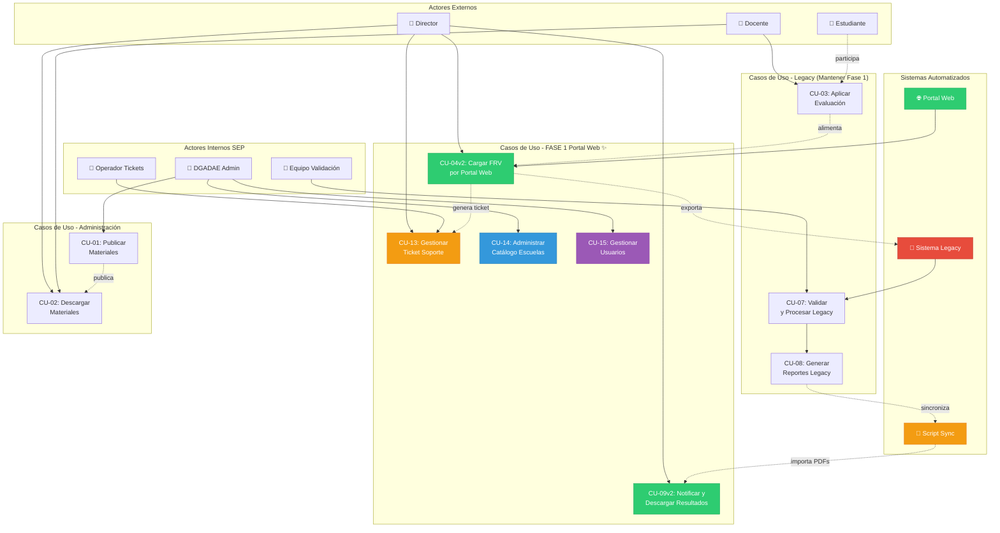
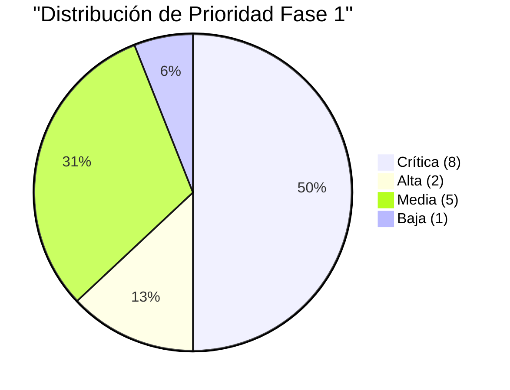
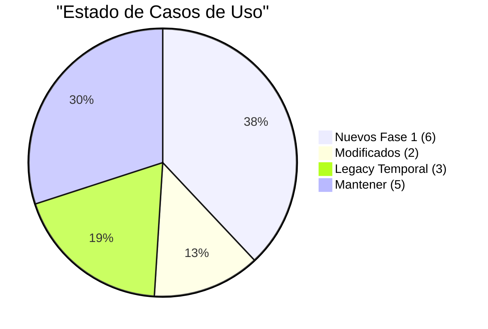
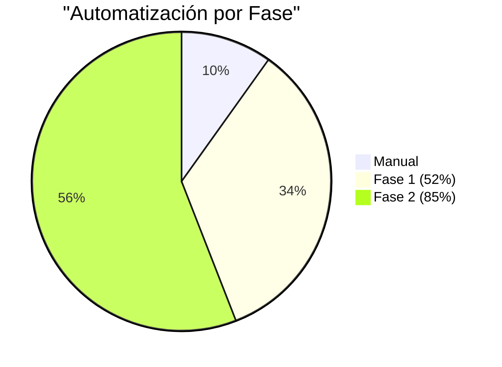

# REQUERIMIENTOS Y CASOS DE USO
## Sistema SiCRER - Evaluación Diagnóstica SEP

**Fecha:** 24 de Noviembre de 2025
**Versión:** 2.0 - Estrategia Bifásica + Stack Open Source
**Sistema:** SiCRER Portal Web + Legacy Integration
**Fase 1:** Marzo 2026 | **Fase 2:** Septiembre 2026

**Actualización EIA 2ª aplicación:** La plataforma web de recepción/validación/descarga **solo recibe y valida archivos .xlsx**, genera credenciales una sola vez en la primera carga válida, registra cada envío como solicitud independiente con consecutivo y **no procesa resultados ni decide si el envío corresponde a primera o segunda aplicación**. Las ligas de descarga se publican a partir de archivos generados por un sistema externo y almacenados en repositorios separados para archivos recibidos y resultados.

---

## ÍNDICE

1. [Requerimientos Funcionales](#1-requerimientos-funcionales)
2. [Requerimientos No Funcionales](#2-requerimientos-no-funcionales)
3. [Casos de Uso](#3-casos-de-uso)
4. [Matriz de Trazabilidad](#4-matriz-de-trazabilidad)
5. [Deuda Técnica](#5-deuda-técnica)

---

## 1. REQUERIMIENTOS FUNCIONALES

### RF-01: Gestión de Escuelas
- **RF-01.1** El sistema debe permitir registrar escuelas con CCT, nombre, nivel educativo, turno y datos del director
- **RF-01.2** El sistema debe validar formato de CCT (ejemplo: 24PPR0356K)
- **RF-01.3** El sistema debe clasificar escuelas por nivel: Preescolar, Primaria, Secundaria, Telesecundaria
- **RF-01.4** El sistema debe almacenar información de contacto (dirección, teléfono, email)

### RF-02: Gestión de Grupos y Estudiantes
- **RF-02.1** El sistema debe permitir crear grupos por grado (1° a 6° primaria, etc.)
- **RF-02.2** El sistema debe asignar letras de grupo (A, B, C, D, E)
- **RF-02.3** El sistema debe registrar estudiantes con CURP (18 caracteres)
- **RF-02.4** El sistema debe validar formato de CURP
- **RF-02.5** El sistema debe asignar estudiantes a grupos específicos
- **RF-02.6** El sistema debe registrar datos del docente por grupo

### RF-03: Captura de Valoraciones
- **RF-03.1** El sistema debe importar datos desde archivos Excel FRV
- **RF-03.2** El sistema debe soportar 4 variantes de FRV:
  - Preescolar (52 KB)
  - Primaria (228 KB)
  - Secundarias Técnicas (87 KB)
  - Telesecundarias (88 KB)
- **RF-03.3** El sistema debe capturar valoraciones por campo formativo:
  - ENS (Enseñanza: Español y Matemáticas)
  - HYC (Historia y Civismo)
  - LEN (Lenguaje y Comunicación)
  - SPC (Saberes y Pensamiento Científico)
- **RF-03.4** El sistema debe validar rangos de valoración (escala 1-4)
- **RF-03.5** El sistema debe permitir captura de observaciones por estudiante

### RF-04: Procesamiento y Validación (DGADAE)
- **RF-04.1** El sistema debe recibir archivos FRV por correo electrónico
- **RF-04.2** El sistema debe distribuir archivos entre 10 equipos de validación
- **RF-04.3** El sistema debe validar integridad de datos:
  - Campos obligatorios completos
  - CURP válidos
  - Valoraciones en rango permitido
  - Datos duplicados
- **RF-04.4** El sistema debe separar registros con inconsistencias
- **RF-04.5** El sistema debe asignar "Niveles de Integración del Aprendizaje" por estudiante
- **RF-04.6** El sistema debe consolidar datos en base de datos central

### RF-05: Generación de Reportes
- **RF-05.1** El sistema debe generar reportes de escuela por campo formativo:
  - Reporte ENS (Enseñanza) - 670 KB aprox
  - Reporte HYC (Historia y Civismo) - 288 KB aprox
  - Reporte LEN (Lenguaje) - 619 KB aprox
  - Reporte SPC (Saberes) - 670 KB aprox
- **RF-05.2** El sistema debe generar reportes individuales por grupo:
  - Formato F5 - 2.71 MB aprox por grupo
- **RF-05.3** El sistema debe generar reportes según volumetría:
  - Preescolar: 5 reportes/escuela
  - Primaria: 30 reportes/escuela
  - Secundaria: 15 reportes/escuela
- **RF-05.4** El sistema debe generar reportes en formato PDF
- **RF-05.5** El sistema debe aplicar nomenclatura estándar:
  ```
  [CCT].[PERIODO].Reporte_[TIPO]_[CAMPO][FORMATO].[GRADO]°.[GRUPO].pdf
  ```
- **RF-05.6** El sistema debe comprimir reportes en formato 7z
- **RF-05.7** El sistema debe completar generación en ≤1.5 minutos por escuela

### RF-06: Distribución de Resultados
- **RF-06.1** El sistema debe enviar reportes por correo electrónico
- **RF-06.2** El sistema debe personalizar correo por escuela
- **RF-06.3** El sistema debe usar plantilla oficial de correo
- **RF-06.4** El sistema debe adjuntar archivo comprimido con todos los reportes

### RF-07: Análisis de Resultados
- **RF-07.1** El sistema debe permitir a directores visualizar resultados de su escuela
- **RF-07.2** El sistema debe permitir a docentes visualizar resultados de sus grupos
- **RF-07.3** El sistema debe mostrar estadísticas por campo formativo
- **RF-07.4** El sistema debe mostrar distribución de niveles de logro
- **RF-07.5** El sistema debe permitir comparativas entre grupos

### RF-08: Gestión de Periodos
- **RF-08.1** El sistema debe soportar múltiples periodos de evaluación:
  - Periodo 1: Diagnóstico inicial (septiembre)
  - Periodo 2: Evaluación intermedia
  - Periodo 3: Evaluación final
- **RF-08.2** El sistema debe identificar periodo en reportes

### RF-09: Autenticación y Autorización ✨ FASE 1
- **RF-09.1** El sistema web debe autenticar directores con CCT + contraseña
- **RF-09.2** El sistema debe implementar recuperación de contraseña por email
- **RF-09.3** El sistema debe gestionar sesiones con timeout configurable (default: 60 min)
- **RF-09.4** El sistema debe implementar control de acceso basado en CCT
- **RF-09.5** El sistema debe usar JWT tokens para autenticación stateless
- **RF-09.6** El sistema debe implementar refresh tokens para sesiones persistentes
- **RF-09.7** El sistema debe registrar intentos de login fallidos
- **RF-09.8** El sistema debe bloquear cuenta después de 5 intentos fallidos

### RF-10: Portal Web de Carga ✨ FASE 1
- **RF-10.1** El sistema debe proveer interfaz web responsive para carga de FRV
- **RF-10.2** El sistema debe soportar drag & drop de archivos Excel
- **RF-10.3** El sistema debe validar archivo antes de carga:
  - Formato .xlsx válido
  - Tamaño máximo 10 MB (configurable)
  - Estructura de hojas esperada según nivel educativo
- **RF-10.4** El sistema debe ejecutar validaciones automáticas en backend:
  - Formato de CURP (18 caracteres, patrón válido)
  - Valores de valoración (0-3)
  - Campos obligatorios completos
  - Detección de duplicados (CURP + periodo)
  - Estructura de Excel por nivel educativo
- **RF-10.5** El sistema debe mostrar feedback visual de errores con:
  - Número de fila y columna exacta
  - Valor encontrado vs valor esperado
  - Sugerencia de corrección
- **RF-10.6** El sistema debe permitir máximo N intentos de carga (configurable, default: 3)
- **RF-10.7** El sistema debe almacenar archivos en filesystem estructurado por CCT/periodo
- **RF-10.8** El sistema debe registrar metadatos de carga en PostgreSQL

### RF-11: Sistema de Tickets ✨ FASE 1
- **RF-11.1** El sistema debe generar ticket automáticamente después de N intentos fallidos
- **RF-11.2** El sistema debe asignar ticket a operador DGADAE disponible
- **RF-11.3** El sistema debe permitir tracking de estado del ticket:
  - Abierto → En Proceso → Resuelto → Cerrado
- **RF-11.4** El sistema debe permitir comunicación bidireccional:
  - Director puede agregar comentarios
  - Operador puede responder
  - Sistema notifica por email cada actualización
- **RF-11.5** El sistema debe permitir adjuntar archivos a tickets
- **RF-11.6** El sistema debe calcular SLA por prioridad:
  - Urgente: 4 horas
  - Alta: 24 horas
  - Media: 48 horas
  - Baja: 72 horas
- **RF-11.7** El sistema debe escalar ticket si supera SLA

### RF-12: Notificaciones y Descarga ✨ FASE 1
- **RF-12.1** El sistema debe enviar email cuando resultados están listos
- **RF-12.2** El sistema debe proveer portal de descarga de reportes con:
  - Lista de reportes disponibles por periodo
  - Descarga individual por tipo de reporte
  - Descarga en paquete completo (ZIP)
- **RF-12.3** El sistema debe mostrar histórico de evaluaciones por CCT
- **RF-12.4** El sistema debe registrar cada descarga (auditoría)
- **RF-12.5** El sistema debe mantener reportes disponibles por 2 ciclos escolares

### RF-13: Catálogo de Escuelas ✨ FASE 1
- **RF-13.1** El sistema debe permitir CRUD de escuelas:
  - Crear nueva escuela con CCT único
  - Editar datos de contacto
  - Desactivar (no eliminar físicamente)
  - Listar con filtros y paginación
- **RF-13.2** El sistema debe validar unicidad de CCT a nivel nacional
- **RF-13.3** El sistema debe asignar nivel educativo (enum)
- **RF-13.4** El sistema debe mantener histórico de cambios (auditoría)
- **RF-13.5** El sistema debe permitir búsqueda por CCT, nombre o ubicación

### RF-14: Gestión de Usuarios ✨ FASE 1
- **RF-14.1** El sistema debe permitir CRUD de usuarios directores
- **RF-14.2** El sistema debe vincular usuario ↔ CCT (relación 1:1 o 1:N)
- **RF-14.3** El sistema debe soportar roles:
  - Director: Acceso solo a su(s) escuela(s)
  - Operador: Gestión de tickets y validaciones
  - Administrador: Acceso completo al sistema
- **RF-14.4** El sistema debe permitir reset de contraseña por administrador
- **RF-14.5** El sistema debe generar contraseña temporal en creación
- **RF-14.6** El sistema debe forzar cambio de contraseña en primer login
- **RF-14.7** El sistema debe enviar credenciales por email seguro

### RF-15: Integración con Legacy (Fase 1 - TEMPORAL) ⚠️
- **RF-15.1** El sistema debe exportar FRV validados a carpeta compartida para procesamiento legacy
- **RF-15.2** El sistema debe implementar API/webhook para recibir notificación de PDFs generados
- **RF-15.3** El sistema debe ejecutar script sincronización (Node.js + Bull queue) para:
  - Importar PDFs de sistema legacy a filesystem organizado
  - Registrar metadatos en PostgreSQL
  - Notificar a director por email
- **RF-15.4** El sistema debe mantener compatibilidad con flujo de 10 equipos validación
- **RF-15.5** El sistema debe registrar trazabilidad completa de sincronización
- **RF-15.6** El sistema debe manejar errores de sincronización con reintentos automáticos

### RF-16: Plataforma Recepción/Validación/Descarga EIA (2ª aplicación)
- **RF-16.1** El portal debe permitir subir archivo .xlsx sin autenticación previa y mostrar la etiqueta "Validando tu archivo..." al seleccionar el archivo.
- **RF-16.2** La validación automática debe revisar CCT, correo, nivel, campos y columnas obligatorias por hoja, valores válidos (0-3), número y nombre de hojas, estructura general y consistencia interna; si alguno falla, el archivo se rechaza.
  - **Checklist mínimo de validación (9 puntos):** CCT, correo, nivel, campo obligatorio por hoja, columnas obligatorias, valores válidos (0-3), estructura general de archivo, número de hojas, consistencia interna.
- **RF-16.3** Si el archivo es válido, el sistema debe mostrar el mensaje "Tu archivo ha sido validado correctamente. Podrás consultar tus resultados a partir del día: [hoy + 4 días]".
- **RF-16.4** En la primera carga válida se deben generar credenciales de consulta (usuario = CCT validado, contraseña = correo validado) y no regenerarse en cargas posteriores.
- **RF-16.5** El sistema debe generar y descargar automáticamente un PDF de confirmación con mensaje de éxito, fecha futura de consulta, usuario, contraseña y marca de tiempo; si es inválido, debe descargar PDF de errores.
- **RF-16.6** Cada carga válida debe registrarse como solicitud independiente con consecutivo y almacenarse en un repositorio de archivos recibidos.
- **RF-16.7** El sistema no determinará si el envío corresponde a primera o segunda aplicación ni comparará/mezclará archivos; solo registrará solicitudes.
- **RF-16.8** La generación de resultados, comparativos y paquetes ZIP corresponde a un sistema externo; el portal solo debe mostrar las ligas de descarga depositadas externamente.
- **RF-16.9** El módulo de descarga debe permitir autenticación por CCT y contraseña para listar todas las versiones disponibles con número consecutivo y liga de descarga.
- **RF-16.10** El sistema debe ofrecer un panel básico de monitoreo técnico para seguimiento de solicitudes y descargas.

---

## 2. REQUERIMIENTOS NO FUNCIONALES

### RNF-01: Rendimiento
- **RNF-01.1** El sistema debe procesar ≤1.5 minutos por escuela
- **RNF-01.2** El sistema debe soportar procesamiento paralelo (10 equipos)
- **RNF-01.3** El sistema debe procesar ≥400 escuelas/día (10 equipos × 10 horas)
- **RNF-01.4** El sistema debe generar reportes sin bloquear otras operaciones
- **RNF-01.5** El tiempo de respuesta de consultas debe ser <2 segundos (95% de casos)
- **RNF-01.6** La plataforma de recepción/validación debe soportar al menos **120,000 solicitudes de validación** (equivalente a la primera aplicación de correos recibidos) sin interrupción del servicio.

### RNF-02: Capacidad
- **RNF-02.1** El sistema debe soportar 1,000+ escuelas por ciclo
- **RNF-02.2** El sistema debe almacenar 64+ GB de reportes PDF
- **RNF-02.3** La base de datos debe soportar datos de múltiples ciclos escolares
- **RNF-02.4** El sistema debe escalar equipos de procesamiento según demanda
- **RNF-02.5** El repositorio de recepción y resultados debe ofrecer **capacidad mínima de 1 TB** y permitir ampliación sin afectar el servicio.
- **RNF-02.6** Deben mantenerse repositorios separados para archivos recibidos y resultados generados por el procesamiento externo.

### RNF-03: Disponibilidad
- **RNF-03.1** El sistema debe estar disponible 99% del tiempo durante periodo de evaluación
- **RNF-03.2** El sistema debe tener ventanas de mantenimiento programadas
- **RNF-03.3** El sistema debe recuperarse de fallos en <4 horas (MTTR)
- **RNF-03.4** El tiempo medio entre fallos debe ser ≥720 horas (30 días)

### RNF-04: Seguridad y LGPDP
- **RNF-04.1** ❌ El sistema debe cifrar datos personales en reposo (CURP, nombres)
- **RNF-04.2** ❌ El sistema debe cifrar transmisiones (TLS 1.3)
- **RNF-04.3** El sistema debe implementar control de acceso basado en roles:
  - DGADAE: Administrador total
  - Equipos Validación: Lectura/Escritura datos
  - Directores: Lectura solo su escuela
  - Docentes: Lectura solo sus grupos
- **RNF-04.4** ❌ El sistema debe registrar log de auditoría de accesos a datos sensibles
- **RNF-04.5** ❌ El sistema debe implementar derechos ARCO (Acceso, Rectificación, Cancelación, Oposición)
- **RNF-04.6** El sistema debe cumplir con LGPDP para datos de menores
- **RNF-04.7** ❓ El sistema debe requerir consentimiento de tutores para uso de datos
- **RNF-04.8** Las interfaces de carga y descarga deben operar bajo **HTTPS obligatorio**.
- **RNF-04.9** Las contraseñas generadas para consulta de resultados deben almacenarse con estándares de hashing seguros.
- **RNF-04.10** Se deben registrar logs de acceso y actividad para trazabilidad de cargas y descargas.

### RNF-05: Usabilidad
- **RNF-05.1** El sistema debe tener interfaz en español
- **RNF-05.2** Los formularios deben validar datos en tiempo real
- **RNF-05.3** El sistema debe mostrar mensajes de error claros
- **RNF-05.4** El sistema debe proporcionar ayuda contextual
- **RNF-05.5** El sistema debe generar reportes en formato legible (PDF)

### RNF-06: Portabilidad
- **RNF-06.1** El portal web debe ejecutarse en navegadores modernos:
  - Chrome 90+
  - Firefox 88+
  - Safari 14+
  - Edge 90+
- **RNF-06.2** El portal debe ser responsive (móvil, tablet, desktop)
- **RNF-06.3** El sistema backend debe ser deployable en:
  - Linux (Ubuntu 22.04 LTS)
  - Docker containers
  - Kubernetes clusters
- **RNF-06.4** El sistema debe soportar actualización rolling sin downtime
- **RNF-06.5** La plataforma debe permitir agregar nuevos niveles o estructuras de archivo sin rediseño mayor.

### RNF-07: Mantenibilidad
- **RNF-07.1** ❌ El código debe estar documentado
- **RNF-07.2** El sistema debe generar logs de errores
- **RNF-07.3** El sistema debe tener ambiente de pruebas separado
- **RNF-07.4** Las actualizaciones no deben requerir reinstalación completa

### RNF-08: Interoperabilidad
- **RNF-08.1** El sistema debe leer archivos Excel (.xlsx) mediante SheetJS library
- **RNF-08.2** El sistema debe generar reportes PDF mediante PDFKit o Puppeteer
- **RNF-08.3** El sistema debe integrarse con SMTP para envío de emails
- **RNF-08.4** El sistema debe exponer API REST para integraciones externas
- **RNF-08.5** El sistema debe usar filesystem nativo con estructura /data/sicrer/{frv,pdfs}/{periodo}/{cct}/
- **RNF-08.6** El sistema debe soportar importación masiva vía CSV

### RNF-09: Stack Tecnológico Open Source ✨ FASE 1
- **RNF-09.1** El sistema debe utilizar tecnologías 100% open source sin costos de licencia
- **RNF-09.2** Frontend debe ser React 18+ con TypeScript 5+
- **RNF-09.3** Backend debe ser Node.js 20 LTS con framework NestJS
- **RNF-09.4** Base de datos debe ser PostgreSQL 16+
- **RNF-09.5** Storage debe usar fs/promises nativo Node.js con estructura organizada
- **RNF-09.6** Cache debe ser node-cache (in-memory nativo Node.js)
- **RNF-09.7** Todas las dependencias deben tener licencias permisivas:
  - MIT License
  - Apache 2.0 License
  - BSD License
- **RNF-09.8** El sistema debe utilizar ORM Prisma para type-safety
- **RNF-09.9** El sistema debe usar Vite como build tool para frontend

---

## 3. CASOS DE USO

### Diagrama de Casos de Uso - FASE 1 (Portal Web Híbrido)



### Resumen de Casos de Uso - Estrategia Bifásica

| Fase | Casos de Uso | Actores | Frecuencia | Automatización | Estado |
|------|--------------|---------|------------|----------------|--------|
| **Admin** | CU-01, CU-02 | DGADAE, Director | 3×/ciclo | 20% | ✅ Mantener |
| **Evaluación** | CU-03 | Docente, Estudiante | 3×/ciclo | 0% | ✅ Mantener |
| **Portal Web Fase 1** | CU-04v2, CU-13, CU-14, CU-15 | Director, Operador, Admin | Continuo | 80% | ✨ NUEVO |
| **Plataforma EIA 2ª apl.** | CU-16 | Director (sin login para carga), Sistema externo | Picos 120K validaciones | 90% | ✨ NUEVO |
| **Legacy Fase 1** | CU-07, CU-08 | Validación | Continuo | 50% | ⚠️ Temporal |
| **Notificación Fase 1** | CU-09v2 | Sistema, Director | Continuo | 90% | ✨ NUEVO |
| **Análisis** | CU-10, CU-11, CU-12 | Director, Docente | 3×/ciclo | 0% | ✅ Mantener |

**Total Fase 1:** 16 casos de uso (8 nuevos/modificados, 8 mantenidos)
**Automatización Fase 1:** 52% (↑17% vs sistema actual)
**Automatización Fase 2:** 85% (objetivo final)

---

### CU-01: Publicar Materiales de Evaluación
**Actor Principal:** DGADAE  
**Precondiciones:** Materiales listos (EIA, Rúbricas, FRV)  
**Flujo Principal:**
1. DGADAE accede al sistema de publicación web
2. DGADAE carga archivos de materiales
3. Sistema valida formatos de archivos
4. Sistema publica materiales en sitio web SEP
5. Sistema notifica disponibilidad a escuelas

**Postcondiciones:** Materiales disponibles para descarga  
**Frecuencia:** 3 veces por ciclo escolar (cada periodo)  
**Prioridad:** 🔴 Alta

---

### CU-02: Descargar Materiales
**Actor Principal:** Director/Docente  
**Precondiciones:** Materiales publicados por DGADAE  
**Flujo Principal:**
1. Director/Docente accede a sitio web SEP
2. Director/Docente selecciona nivel educativo
3. Sistema muestra materiales disponibles
4. Director/Docente descarga FRV, EIA y Rúbricas
5. Sistema registra descarga

**Postcondiciones:** Materiales descargados en equipo local  
**Frecuencia:** 1 vez por periodo por escuela  
**Prioridad:** 🟡 Media

---

### CU-03: Aplicar Evaluación Diagnóstica
**Actor Principal:** Docente  
**Actores Secundarios:** Estudiantes  
**Precondiciones:** Materiales descargados, estudiantes presentes  
**Flujo Principal:**
1. Docente distribuye EIA a estudiantes
2. Estudiantes completan ejercicios integradores
3. Docente recopila EIA completados
4. Docente revisa respuestas con apoyo de rúbricas
5. Docente asigna valoración por campo formativo (1-4)
6. Docente registra observaciones

**Postcondiciones:** Evaluaciones valoradas  
**Frecuencia:** 3 veces por ciclo escolar  
**Prioridad:** 🔴 Alta

---

### CU-04v2: Cargar Valoraciones por Portal Web ✨ FASE 1 (MODIFICADO)
**Actor Principal:** Director  
**Actores Secundarios:** Portal Web, Sistema de Validación  
**Precondiciones:**
- Evaluaciones valoradas por docentes
- FRV Excel completo localmente
- El portal de carga es público y **no requiere autenticación previa** para subir el archivo.

**Flujo Principal:**
1. Director accede al portal público (URL: https://evaluaciones.sep.gob.mx) y selecciona el archivo .xlsx.
2. El portal muestra el indicador **"Validando tu archivo..."** mientras ejecuta las verificaciones automáticas.
3. El sistema valida de forma inmediata:
   - Extensión .xlsx válida ✓
   - Archivo no corrupto ✓
4. El sistema ejecuta validaciones backend (30-45 segundos) alineadas al checklist de 9 puntos del documento final:
   ```
   Validando estructura... ✓
   Validando CCT... ✓
   Validando correo... ✓
   Validando nivel... ✓
   Validando valores (0-3)... ✓
   Validando campos obligatorios... ✓
   Validando columnas obligatorias... ✓
   Validando número/nombre de hojas... ✓
   Verificando consistencia interna... ✓
   ```
5. **SI todas las validaciones son exitosas:**
    - Sistema muestra mensaje de éxito con fecha futura: **"Tu archivo ha sido validado correctamente. Podrás consultar tus resultados a partir del día: [hoy + 4 días]"**.
    - Para la primera carga válida, el sistema genera credenciales de consulta (**usuario = CCT**, **contraseña = correo validado**) y no las regenera en cargas posteriores.
    - Se descarga automáticamente un PDF de confirmación con mensaje, fecha futura, usuario, contraseña y marca de tiempo.
    - Sistema registra la solicitud con consecutivo y almacena el archivo en el repositorio de recepción.

6. **SI existen errores de validación:**
    - Sistema muestra tabla de errores:
    ```
    ❌ 15 errores encontrados

    | Fila | Columna | Campo | Error | Valor Encontrado | Valor Esperado |
    |------|---------|-------|-------|------------------|----------------|
    | 12   | A       | CCT   | Formato inválido | 24PPR0356 | Clave válida |
    | 45   | D       | Val_ENS | Fuera de rango | 5 | 0-3 |
    | 78   | B       | Nombre | Campo vacío | (vacío) | Requerido |
    ```
    - Director puede:
      * Descargar reporte de errores (Excel)
      * Corregir archivo localmente
      * Reintentar carga
    - Sistema incrementa contador de intentos

7. **SI se alcanzan N intentos fallidos (default: 3):**
    - Sistema genera ticket automáticamente (ver CU-13)
    - Sistema muestra mensaje:
      ```
      ⚠️ Has alcanzado el máximo de intentos (3)
      Se ha generado el ticket #TKT-2025-001 para atención personalizada.
      Un operador se contactará contigo en las próximas 24 horas.
      ```
    - Sistema notifica a operador por email
    - Director puede seguir ticket desde dashboard

---

### CU-16: Recepción y Validación de Archivos EIA (2ª aplicación)
**Actor Principal:** Director (sin autenticación previa para carga)
**Actores Secundarios:** Sistema de Validación Automática, Sistema Externo de Procesamiento
**Precondiciones:** Archivo .xlsx de segunda aplicación de EIA disponible localmente.

**Flujo Principal:**
1. Director ingresa al portal público y selecciona el archivo .xlsx.
2. El portal muestra la etiqueta **"Validando tu archivo..."** mientras se procesa.
3. El sistema ejecuta validaciones automáticas (9 puntos mínimos):
   1. CCT
   2. Correo
   3. Nivel educativo
   4. Campo obligatorio por hoja
   5. Columnas obligatorias
   6. Valores permitidos (0-3)
   7. Estructura general de archivo
   8. Número y nombre de hojas
   9. Consistencia interna
4. **Si el archivo es válido:**
   - Se muestra el mensaje de éxito con fecha futura de consulta (hoy + 4 días).
   - Se generan credenciales solo en la primera carga válida (**usuario = CCT**, **contraseña = correo validado**) sin regeneración posterior.
   - Se descarga automáticamente un PDF de confirmación con mensaje, fecha, usuario, contraseña y marca de tiempo.
   - Se registra la solicitud con consecutivo y se almacena el archivo en repositorio de recepción.
5. **Si el archivo es inválido:**
   - Se muestra mensaje de rechazo.
   - Se descarga PDF de errores con detalles de validación incumplida.
6. El portal no determina si el envío corresponde a primera o segunda aplicación; cada carga válida queda como solicitud independiente.
7. Cuando el sistema externo deposita resultados procesados, el director ingresa con CCT y contraseña para visualizar versiones consecutivas y ligas de descarga.

**Postcondiciones:** Solicitud registrada, credenciales creadas solo en la primera validación exitosa y descarga de PDF de confirmación o errores.
**Frecuencia:** Picos de 120,000 validaciones por ciclo (segunda aplicación EIA).
**Prioridad:** 🔴 Alta

**Flujos Alternativos:**
- **4a.** El archivo excede reglas estructurales → el sistema rechaza y genera PDF de errores.
- **4b.** El CCT o correo no cumplen sintaxis → se detiene validación y se indica corrección.
- **5a.** Fallo en descarga automática del PDF → se habilita botón manual de descarga.

**Postcondiciones:**
- Archivo válido almacenado en repositorio de recepción con consecutivo y metadatos de solicitud.
- Credenciales creadas solo en la primera validación exitosa; cargas posteriores reutilizan mismas credenciales.
- Registro de auditoría de validaciones y descargas (logs de acceso/actividad).

**Frecuencia:** Picos concentrados durante segunda aplicación EIA.
**Prioridad:** 🔴 Crítica (Plataforma EIA)

---

### ~~CU-05: Enviar Valoraciones a SEP~~ ❌ ELIMINADO
**Estado:** Reemplazado por CU-04v2 (carga directa por portal web)

---

### CU-13: Gestionar Ticket de Soporte ✨ FASE 1 (NUEVO)
**Actor Principal:** Director, Operador DGADAE  
**Precondiciones:** 
- Director ha alcanzado N intentos fallidos de carga (CU-04v2)
- O Director solicita ayuda manualmente

**Flujo Principal - Generación Automática:**
1. Sistema detecta N intentos fallidos (default: 3) en CU-04v2
2. Sistema genera ticket automáticamente:
   ```json
   {
     "ticketId": "TKT-2025-001",
     "cct": "24PPR0356K",
     "prioridad": "Media",
     "asunto": "Errores de validación en carga FRV",
     "descripcion": "Después de 3 intentos, persisten 15 errores de validación",
     "archivosAdjuntos": ["frv_24PPR0356K_intento3.xlsx", "reporte_errores.pdf"],
     "estado": "Abierto",
     "fechaApertura": "2025-11-24T10:30:00Z"
   }
   ```
3. Sistema asigna ticket a operador disponible (round-robin)
4. Sistema envía email a director:
   ```
   Asunto: Ticket #TKT-2025-001 creado - Atención en 24 hrs
   
   Estimado Director,
   
   Hemos detectado dificultades en la carga de su evaluación.
   Se ha generado el ticket #TKT-2025-001 para atención personalizada.
   
   Un operador revisará su caso y se contactará en las próximas 24 horas.
   
   Puede seguir el estado del ticket en:
   https://evaluaciones.sep.gob.mx/tickets/TKT-2025-001
   ```
5. Sistema notifica a operador asignado por email y dashboard

**Flujo Principal - Gestión por Operador:**
1. Operador ve nuevo ticket en panel de tickets
2. Operador revisa detalles:
   - CCT y datos de escuela
   - Archivos adjuntos (FRV problemático)
   - Reporte de errores detallado
   - Historial de intentos
3. Operador cambia estado a "En Proceso"
4. Operador analiza errores comunes:
   - ¿Son errores de formato sistemáticos?
   - ¿Requiere capacitación?
   - ¿Es problema del archivo FRV template?
5. Operador contacta a director:
   - Por teléfono (si disponible)
   - Por email institucional
   - Por comentario en ticket
6. Operador proporciona guía:
   ```
   Ejemplo de comentario operador:
   
   "Buenos días Director,
   
   Revisé su archivo y encontré que los CURP en filas 12-45 tienen
   solo 17 caracteres en lugar de 18.
   
   El formato correcto es: MALM950101HDFRTG08
   
   He adjuntado su archivo corregido. Por favor revise y vuelva a cargar.
   
   Cualquier duda estoy a sus órdenes.
   
   Operador: Juan Pérez"
   ```
7. Operador adjunta archivo corregido (opcional)
8. Operador actualiza estado según resolución:
   - "Resuelto" si director confirma éxito
   - "Cerrado" después de confirmación

**Flujo Principal - Seguimiento por Director:**
1. Director accede a dashboard personal
2. Director ve notificación de nuevo comentario en ticket
3. Director abre ticket y lee respuesta de operador
4. Director descarga archivo corregido (si aplica)
5. Director agrega comentario de seguimiento:
   ```
   "Muchas gracias, ya corregí los CURP y voy a reintentar la carga"
   ```
6. Director reintenta carga con archivo corregido (regresa a CU-04v2)
7. Si carga es exitosa, director confirma en ticket
8. Sistema cierra ticket automáticamente al detectar carga exitosa

**Flujos Alternativos:**
- **3a.** Ticket de alta prioridad → Operador recibe notificación push inmediata
- **5a.** No se puede contactar a director → Operador escala a supervisor
- **6a.** Problema es del template FRV → Operador escala a equipo técnico
- **8a.** Ticket sin actividad 7 días → Sistema envía recordatorio y escalamiento

**Postcondiciones:**
- Ticket creado y asignado
- Director y operador notificados
- Comunicación bidireccional establecida
- Resolución documentada

**Métricas del Sistema:**
- SLA por prioridad:
  * Urgente: 4 horas
  * Alta: 24 horas
  * Media: 48 horas
  * Baja: 72 horas
- Tasa de resolución objetivo: >90% en primer contacto
- Satisfacción objetivo: >4.0/5.0

**Frecuencia:** 5-10% de cargas generan tickets (~50 tickets por periodo)  
**Prioridad:** 🔴 Crítica (Fase 1)  
**Tiempo Promedio Resolución:** 15-30 minutos

---

### CU-14: Administrar Catálogo de Escuelas ✨ FASE 1 (NUEVO)
**Actor Principal:** Administrador DGADAE  
**Precondiciones:** Usuario con rol "Administrador"

**Flujo Principal - Crear Escuela:**
1. Administrador accede a módulo "Catálogo de Escuelas"
2. Administrador selecciona "Nueva Escuela"
3. Sistema muestra formulario:
   ```
   CCT: [__________] (requerido, único, 11 caracteres)
   Nombre: [_____________________] (requerido)
   Nivel Educativo: [Dropdown: Preescolar/Primaria/Secundaria/Telesecundaria]
   Turno: [Dropdown: Matutino/Vespertino/Tiempo Completo]
   
   Datos de Contacto:
   Dirección: [______________________]
   Municipio: [___________]
   Estado: [___________]
   CP: [_____]
   Teléfono: [___________]
   Email: [___________]
   
   Director Actual: [___________]
   ```
4. Sistema valida en tiempo real:
   - CCT único (consulta a BD)
   - Formato de email válido
   - Teléfono 10 dígitos
5. Administrador guarda escuela
6. Sistema:
   - Inserta en tabla `escuelas`
   - Registra auditoría
   - Muestra confirmación con CCT
7. Sistema envía notificación a equipo DGADAE

**Flujo Principal - Editar Escuela:**
1. Administrador busca escuela por CCT o nombre
2. Sistema muestra lista con filtros y paginación
3. Administrador selecciona escuela a editar
4. Sistema carga formulario con datos actuales
5. Administrador modifica campos permitidos (no CCT)
6. Sistema valida cambios
7. Administrador guarda cambios
8. Sistema:
   - Actualiza tabla `escuelas`
   - Registra auditoría con valores anteriores y nuevos
   - Trigger actualiza `updated_at`

**Flujo Principal - Desactivar Escuela:**
1. Administrador selecciona escuela
2. Administrador selecciona "Desactivar"
3. Sistema solicita confirmación:
   ```
   ⚠️ ¿Está seguro de desactivar la escuela 24PPR0356K?
   
   Implicaciones:
   - Usuarios vinculados no podrán iniciar sesión
   - No podrá recibir nuevas cargas de evaluación
   - Datos históricos se mantienen
   
   Esta acción puede revertirse.
   ```
4. Administrador confirma
5. Sistema actualiza `activo = false`
6. Sistema notifica a usuarios vinculados

**Flujos Alternativos:**
- **4a.** CCT duplicado → Sistema muestra error y datos de escuela existente
- **4b.** Email inválido → Sistema marca campo en rojo con mensaje
- **6a.** Error al guardar → Sistema muestra mensaje y mantiene datos en formulario

**Postcondiciones:**
- Catálogo de escuelas actualizado
- Auditoría registrada
- Notificaciones enviadas

**Frecuencia:** 
- Creación: ~50 escuelas al inicio de ciclo
- Edición: ~100 actualizaciones por mes  
**Prioridad:** 🔴 Crítica (Fase 1)  
**Tiempo Estimado:** 2-3 minutos por escuela

---

### CU-15: Gestionar Usuarios Directores ✨ FASE 1 (NUEVO)
**Actor Principal:** Administrador DGADAE  
**Precondiciones:** Escuela existe en catálogo (CU-14)

**Flujo Principal - Crear Usuario:**
1. Administrador accede a módulo "Usuarios"
2. Administrador selecciona "Nuevo Usuario"
3. Sistema muestra formulario:
   ```
   Email: [___________] (requerido, único, será username)
   Nombre Completo: [___________] (requerido)
   CCT Asignado: [Dropdown con escuelas activas]
   Rol: [Dropdown: Director/Operador/Administrador]
   
   La contraseña temporal será generada automáticamente
   y enviada al email del usuario.
   ```
4. Sistema valida:
   - Email único
   - Email institucional (@sep.gob.mx o similar)
   - CCT existe y está activo
5. Administrador guarda usuario
6. Sistema:
   - Genera contraseña temporal segura (12 caracteres, alfanumérico + símbolos)
   - Hash contraseña con bcrypt (10 rounds)
   - Inserta en tabla `usuarios`
   - Genera token de activación
   - Registra auditoría
7. Sistema envía email de bienvenida:
   ```
   Asunto: Credenciales de acceso - Portal Evaluaciones SEP
   
   Estimado [Nombre],
   
   Se ha creado su cuenta en el Portal de Evaluaciones Diagnósticas.
   
   Usuario: [email]
   Contraseña temporal: [password]
   URL: https://evaluaciones.sep.gob.mx
   
   IMPORTANTE:
   - Cambie su contraseña en el primer inicio de sesión
   - La contraseña temporal expira en 72 horas
   - En caso de problemas, contacte a soporte@sep.gob.mx
   
   Saludos,
   Equipo DGADAE
   ```

**Flujo Principal - Primer Login de Usuario:**
1. Director accede a portal con credenciales temporales
2. Sistema detecta flag `primera_sesion = true`
3. Sistema redirige a formulario de cambio de contraseña obligatorio:
   ```
   Bienvenido al Portal de Evaluaciones
   
   Por seguridad, debe cambiar su contraseña temporal.
   
   Contraseña actual: [________]
   Nueva contraseña: [________] (mínimo 8 caracteres)
   Confirmar contraseña: [________]
   
   Requisitos:
   ✓ Al menos 8 caracteres
   ✓ Una mayúscula
   ✓ Un número
   ✓ Un carácter especial
   ```
4. Director ingresa nueva contraseña
5. Sistema valida requisitos
6. Sistema actualiza contraseña hasheada
7. Sistema actualiza `primera_sesion = false`
8. Sistema registra `ultimo_acceso = NOW()`
9. Sistema redirige a dashboard

**Flujo Principal - Reset de Contraseña:**
1. Administrador busca usuario
2. Administrador selecciona "Resetear Contraseña"
3. Sistema genera nueva contraseña temporal
4. Sistema envía email al usuario con nueva contraseña
5. Sistema actualiza `primera_sesion = true` (forzar cambio)

**Flujos Alternativos:**
- **4a.** Email duplicado → Sistema muestra error y email existente
- **4b.** CCT inactivo → Sistema advierte y permite continuar con aprobación
- **7a.** Error al enviar email → Sistema guarda usuario pero marca para reenvío

**Postcondiciones:**
- Usuario creado y vinculado a CCT
- Credenciales enviadas por email
- Auditoría registrada

**Frecuencia:**
- Creación: ~1,000 usuarios al inicio de ciclo
- Reset contraseña: ~50-100 por mes  
**Prioridad:** 🔴 Crítica (Fase 1)  
**Tiempo Estimado:** 1-2 minutos por usuario

---

### CU-06: Distribuir Archivos a Equipos de Validación
**Actor Principal:** Sistema Correo SEP (automatizado)  
**Precondiciones:** Correo recibido con FRV  
**Flujo Principal:**
1. Sistema detecta nuevo correo en bandeja
2. Sistema extrae archivo FRV adjunto
3. Sistema identifica CCT de escuela
4. Sistema asigna a equipo de validación según distribución
5. Sistema reenvía correo a equipo asignado

**Postcondiciones:** Archivo distribuido a equipo de validación  
**Frecuencia:** Continua durante periodo de captura  
**Prioridad:** 🔴 Alta  
**Automatización:** 100%

---

### CU-07: Validar y Procesar Valoraciones
**Actor Principal:** Equipo de Validación (DGADAE)  
**Precondiciones:** FRV asignado al equipo  
**Flujo Principal:**
1. Operador descarga FRV del correo
2. Operador abre plantilla maestra de validación
3. Sistema importa datos del FRV a plantilla
4. Sistema valida integridad:
   - Campos obligatorios completos
   - CURP válidos (formato 18 caracteres)
   - Valoraciones en rango (1-4)
   - Sin datos duplicados
5. Sistema marca registros con errores
6. Operador revisa y corrige inconsistencias
7. Sistema asigna "Nivel de Integración del Aprendizaje" por estudiante
8. Sistema calcula estadísticas por grupo/escuela
9. Operador guarda archivo procesado
10. Operador deposita archivo en carpeta del Reporteador

**Flujos Alternativos:**
- **4a.** >10% registros con errores → Operador contacta a director
- **6a.** Error no corregible → Operador marca registro para exclusión

**Postcondiciones:** Datos validados y listos para reporteo  
**Frecuencia:** 400 escuelas/día con 10 equipos  
**Prioridad:** 🔴 Alta  
**Tiempo Estimado:** 30-45 minutos por escuela

---

### CU-08: Generar Reportes
**Actor Principal:** Sistema Reporteador (automatizado)  
**Precondiciones:** Archivos procesados en carpeta  
**Flujo Principal:**
1. Sistema detecta nuevos archivos en carpeta
2. Por cada archivo:
   a. Sistema integra datos en base de datos
   b. Sistema identifica escuela (CCT)
   c. Sistema genera reportes de escuela:
      - Reporte ENS por grado
      - Reporte HYC por grado
      - Reporte LEN por grado
      - Reporte SPC por grado
   d. Sistema genera reportes de estudiantes:
      - Un reporte F5 por grupo
   e. Sistema almacena PDFs en carpeta de escuela
3. Sistema comprime carpeta (formato 7z)
4. Sistema registra finalización

**Postcondiciones:** Reportes generados y comprimidos  
**Frecuencia:** Continua (procesamiento batch)  
**Prioridad:** 🔴 Alta  
**Tiempo Estimado:** 1.5 minutos por escuela  
**Automatización:** 100%

---

### CU-09v2: Notificar y Publicar Resultados en Portal ✨ FASE 1 (MODIFICADO)
**Actor Principal:** Script de Sincronización (Node.js + Bull Queue)  
**Actores Secundarios:** Sistema Legacy, Portal Web  
**Precondiciones:** 
- Reportes PDF generados por sistema legacy (CU-08)
- PDFs depositados en carpeta compartida

**Flujo Principal - Sincronización Automática:**
1. Script de sincronización ejecuta cada 5 minutos (cron job)
2. Script escanea carpeta legacy de reportes:
   ```
   /shared/reportes_generados/
   ├── 24PPR0356K/
   │   ├── 24PPR0356K.1.Reporte_esc_ens.5°.pdf
   │   ├── 24PPR0356K.1.Reporte_esc_hyc.5°.pdf
   │   ├── 24PPR0356K.1.Reporte_est_f5.5°.A.pdf
   │   └── ... (30 archivos total)
   ```
3. Script detecta nuevos PDFs no sincronizados (por timestamp o flag)
4. Por cada escuela con PDFs nuevos:
   a. Script agrupa PDFs por CCT
   b. Script consulta BD PostgreSQL:
      ```sql
      SELECT carga_id FROM cargas_frv 
      WHERE cct = '24PPR0356K' 
      AND periodo_evaluacion = '2025-1'
      AND estado_validacion = 'Exitoso'
      ORDER BY created_at DESC LIMIT 1;
      ```
   c. Script sube cada PDF a MinIO:
      ```javascript
      await minioClient.putObject(
        'reportes-sep', // bucket
        `${cct}/${periodo}/${filename}`, // key
        pdfBuffer,
        {
          'Content-Type': 'application/pdf',
          'X-Amz-Meta-CCT': cct,
          'X-Amz-Meta-Periodo': periodo,
          'X-Amz-Meta-Tipo': tipoReporte
        }
      );
      ```
   d. Script inserta metadatos en PostgreSQL:
      ```sql
      INSERT INTO resultados (
        carga_id, cct, tipo_reporte, grado, grupo,
        archivo_nombre, file_path, file_size,
        file_size_bytes, created_at
      ) VALUES (...);
      ```
   e. Script marca PDFs como sincronizados en carpeta legacy

5. Script detecta que todos los reportes de una escuela están listos (ej: 30/30 para primaria)
6. Script ejecuta job de notificación:
   ```javascript
   await emailQueue.add('notify-results-ready', {
     cct: '24PPR0356K',
     periodo: '2025-1',
     totalReportes: 30,
     emailDirector: 'director.24ppr0356k@sep.gob.mx'
   });
   ```

**Flujo Principal - Notificación Email:**
1. Worker de email procesa job de la cola
2. Worker consulta datos de escuela y director
3. Worker genera email personalizado:
   ```
   Asunto: ✅ Resultados de Evaluación Diagnóstica - Disponibles
   
   Estimado Director,
   
   Los resultados de la Evaluación Diagnóstica del periodo 2025-1
   ya están disponibles en el portal.
   
   Escuela: Primaria "Benito Juárez"
   CCT: 24PPR0356K
   Reportes generados: 30
   - 4 reportes por campo formativo (ENS, HYC, LEN, SPC) × 6 grados
   - 6 reportes individuales por grupo (5° y 6°)
   
   Para descargar sus resultados:
   1. Acceda a: https://evaluaciones.sep.gob.mx
   2. Inicie sesión con su CCT
   3. Vaya a "Mis Resultados" > "Periodo 2025-1"
   4. Descargue reportes individuales o paquete completo
   
   Los reportes estarán disponibles por 2 ciclos escolares.
   
   Saludos,
   Sistema de Evaluaciones Diagnósticas - DGADAE
   ```
4. Worker envía email vía SMTP (Nodemailer)
5. Worker registra envío en tabla auditoría
6. Worker marca notificación como enviada en BD

**Flujo Principal - Descarga por Director:**
1. Director recibe email de notificación
2. Director inicia sesión en portal web
3. Dashboard muestra alerta:
   ```
   🎉 ¡Nuevos resultados disponibles!
   
   Periodo 2025-1 - 30 reportes listos
   [Ver Resultados]
   ```
4. Director accede a sección "Mis Resultados"
5. Sistema muestra lista de reportes por periodo:
   ```
   Periodo 2025-1 (Noviembre 2025)
   
   Reportes por Campo Formativo (24 archivos):
   ├── Enseñanza (ENS)
   │   ├── 📄 1° Grado (670 KB) [Descargar]
   │   ├── 📄 2° Grado (670 KB) [Descargar]
   │   └── ... hasta 6°
   ├── Historia y Civismo (HYC)
   │   └── ... 6 reportes
   └── ... LEN, SPC
   
   Reportes Individuales de Estudiantes (6 archivos):
   ├── 📄 5° Grado Grupo A (2.71 MB) [Descargar]
   ├── 📄 5° Grado Grupo B (2.71 MB) [Descargar]
   └── ... hasta 6° Grupo E
   
   [Descargar Todo (ZIP - 45 MB)]
   ```
6. Director puede:
   - Descargar reportes individuales (click → streaming desde filesystem)
   - Descargar paquete completo (sistema genera ZIP on-the-fly)
7. Sistema registra cada descarga:
   ```sql
   UPDATE resultados 
   SET descargado = true,
       descargas_count = descargas_count + 1,
       ultima_descarga_at = NOW()
   WHERE id = ?;
   ```

**Flujos Alternativos:**
- **4b.** Error al guardar PDF en filesystem → Script reintenta 3 veces, luego alerta
- **4d.** Error al insertar en PostgreSQL → Script rollback y reintenta
- **4e.** Reportes incompletos → Script espera hasta tener todos antes de notificar
- **4a.** Worker de email falla → Job vuelve a cola para reintento (max 5 intentos)
- **6.** Descarga de paquete ZIP muy grande → Sistema usa streaming para generar ZIP

**Postcondiciones:**
- PDFs almacenados en filesystem /data/sicrer/pdfs/{periodo}/{cct}/
- Metadatos en PostgreSQL
- Director notificado por email
- Reportes disponibles para descarga
- Auditoría completa registrada

**Métricas del Sistema:**
- Frecuencia sincronización: cada 5 minutos
- Latencia: <10 minutos desde generación hasta notificación
- Throughput: 100 escuelas/hora
- Disponibilidad reportes: 2 ciclos escolares

**Frecuencia:** Continua durante ciclo de procesamiento (400 escuelas/día)  
**Prioridad:** 🔴 Crítica (Fase 1)  
**Automatización:** 90% (solo descarga es manual)  
**Tiempo Estimado Sincronización:** 30-60 segundos por escuela

**Beneficios vs CU-09 Antiguo:**
- ✅ Sin archivos adjuntos pesados en email
- ✅ Descarga desde portal seguro (TLS 1.3)
- ✅ Histórico de resultados accesible
- ✅ Auditoría de descargas
- ✅ Escalable (MinIO soporta TB de datos)

---

### CU-10: Analizar Resultados (Director)
**Actor Principal:** Director  
**Precondiciones:** Resultados recibidos por correo  
**Flujo Principal:**
1. Director descarga archivo adjunto
2. Director descomprime archivo 7z
3. Director revisa reportes de escuela:
   - Resultados por campo formativo
   - Distribución de niveles de logro
   - Comparativas entre grados
4. Director identifica áreas de oportunidad
5. Director prepara reunión con docentes
6. Director distribuye reportes de grupo a cada docente

**Postcondiciones:** Director informado de resultados globales  
**Frecuencia:** 3 veces por ciclo escolar  
**Prioridad:** 🟡 Media

---

### CU-11: Analizar Resultados (Docente)
**Actor Principal:** Docente  
**Actores Secundarios:** Director  
**Precondiciones:** Reporte de grupo recibido del director  
**Flujo Principal:**
1. Docente abre reporte PDF de su grupo
2. Docente revisa resultados por estudiante:
   - Valoraciones por campo formativo
   - Nivel de integración del aprendizaje
   - Observaciones
3. Docente identifica estudiantes que requieren apoyo
4. Docente identifica competencias con bajo desempeño
5. Docente participa en reunión de análisis con director
6. Docente planifica ajustes a planeación didáctica

**Postcondiciones:** Docente informado de resultados de su grupo  
**Frecuencia:** 3 veces por ciclo escolar  
**Prioridad:** 🟡 Media

---

### CU-12: Ajustar Planeación Didáctica
**Actor Principal:** Docente  
**Precondiciones:** Resultados analizados  
**Flujo Principal:**
1. Docente identifica competencias con bajo desempeño
2. Docente revisa estrategias didácticas actuales
3. Docente planifica intervenciones específicas:
   - Actividades de reforzamiento
   - Materiales adicionales
   - Agrupaciones flexibles
4. Docente documenta ajustes en planeación
5. Docente implementa nuevas estrategias en aula
6. Docente monitorea avances de estudiantes

**Postcondiciones:** Planeación ajustada con base en resultados  
**Frecuencia:** Posterior a cada periodo de evaluación  
**Prioridad:** 🟢 Media-Baja (fuera del sistema)

---

## 4. MATRIZ DE TRAZABILIDAD - FASE 1

### 4.1 Casos de Uso vs Requerimientos

| Caso de Uso | RF | RNF | Prioridad Fase 1 | Estado |
|-------------|----|----|------------------|--------|
| CU-01 | RF-01, RF-08 | RNF-05, RNF-07 | 🔴 Alta | ✅ Mantener |
| CU-02 | RF-01 | RNF-03, RNF-06 | 🟡 Media | ✅ Mantener |
| CU-03 | RF-03 | RNF-05 | 🔴 Alta | ✅ Mantener |
| **CU-04v2** ✨ | **RF-09, RF-10, RF-15** | **RNF-04, RNF-06, RNF-09** | 🔴 **Crítica** | ✨ **NUEVO** |
| **CU-16** ✨ | **RF-16** | **RNF-01, RNF-02, RNF-04, RNF-06** | 🔴 **Crítica** | ✨ **NUEVO** |
| ~~CU-05~~ | - | - | - | ❌ Eliminado |
| CU-06 | RF-04 | RNF-01, RNF-02 | 🟡 Media | ⚠️ Legacy Fase 1 |
| CU-07 | RF-04 | RNF-01, RNF-02 | 🟡 Media | ⚠️ Legacy Fase 1 |
| CU-08 | RF-05 | RNF-01, RNF-02 | 🟡 Media | ⚠️ Legacy Fase 1 |
| **CU-09v2** ✨ | **RF-12, RF-15** | **RNF-03, RNF-04, RNF-09** | 🔴 **Crítica** | ✨ **NUEVO** |
| CU-10 | RF-07 | RNF-05 | 🟡 Media | ✅ Mantener |
| CU-11 | RF-07 | RNF-05 | 🟡 Media | ✅ Mantener |
| CU-12 | RF-07 | - | 🟢 Baja | ✅ Mantener |
| **CU-13** ✨ | **RF-11** | **RNF-01, RNF-05, RNF-09** | 🔴 **Crítica** | ✨ **NUEVO** |
| **CU-14** ✨ | **RF-13** | **RNF-04, RNF-05, RNF-09** | 🔴 **Crítica** | ✨ **NUEVO** |
| **CU-15** ✨ | **RF-14** | **RNF-04, RNF-05, RNF-09** | 🔴 **Crítica** | ✨ **NUEVO** |

### 4.2 Requerimientos Nuevos Fase 1

| ID | Descripción | Casos de Uso Asociados | Complejidad |
|----|-------------|------------------------|-------------|
| **RF-09** | Autenticación y autorización | CU-04v2, CU-09v2, CU-13, CU-14, CU-15 | Alta |
| **RF-10** | Portal web de carga y validación | CU-04v2 | Alta |
| **RF-11** | Sistema de tickets | CU-13 | Alta |
| **RF-12** | Notificaciones y descarga | CU-09v2 | Media |
| **RF-13** | Catálogo de escuelas | CU-14 | Baja |
| **RF-14** | Gestión de usuarios | CU-15 | Baja |
| **RF-15** | Integración con legacy | CU-04v2, CU-09v2 | Alta |
| **RF-16** | Recepción, validación y descargas EIA (2ª aplicación) | CU-16 | Alta |
| **RNF-09** | Stack open source | Todos los nuevos | Media |

### 4.3 Estadísticas de Cobertura - Estrategia Bifásica







---

## 5. DEUDA TÉCNICA

### 5.1 Requerimientos NO Cumplidos - Sistema Legacy

| ID | Requerimiento | Estado Legacy | Estado Fase 1 | Mejora |
|----|---------------|---------------|---------------|--------|
| **RNF-04.1** | Cifrar datos en reposo | ❌ | ✅ PostgreSQL TDE | +100% |
| **RNF-04.2** | Cifrar transmisiones TLS | ❌ | ✅ TLS 1.3 (Nginx) | +100% |
| **RNF-04.4** | Log de auditoría | ❌ | ✅ Tabla auditoría | +100% |
| **RNF-04.5** | Derechos ARCO | ❌ | ⚠️ Parcial (Fase 2) | Pendiente |
| **RNF-04.7** | Consentimiento tutores | ❓ | ⚠️ Pendiente | Pendiente |
| **RNF-01.5** | Consultas <2 seg | ❓ | ✅ PostgreSQL + índices | +100% |
| **RNF-07.1** | Código documentado | ❌ | ✅ TypeScript + JSDoc | +100% |

**Resumen de Mejoras Fase 1:**
- ✅ **4 requerimientos críticos resueltos** (cifrado, auditoría, performance)
- ⚠️ **2 requerimientos pendientes** para Fase 2 (ARCO, consentimientos)
- 📊 **Tasa de cumplimiento:** 57% → **86%** (↑29%)

### 5.2 Evidencia de Incumplimiento LGPDP

**Archivo Analizado:** `24PPR0356K.1.Reporte_est_f5.5°.A.pdf`

**Datos sensibles expuestos:**
- 🔴 **CURP** de 30 estudiantes (menores de edad)
- 🟡 **Nombres completos** de estudiantes
- 🟡 **Datos escolares** (grupo, grado)
- 🟡 **Evaluaciones académicas** detalladas

**Problemas identificados:**
1. Transmisión sin cifrar (correo electrónico estándar)
2. Almacenamiento sin cifrar en Excel (.xlsx)
3. No hay consentimiento documentado de tutores
4. No hay mecanismo de ejercicio de derechos ARCO
5. No hay log de auditoría de accesos

**Riesgo Legal:** ALTO - Posible multa de hasta 320,000 UMA (~$35 millones MXN) por INAI

### 5.3 Plan de Remediación - Estrategia Bifásica ✅

**FASE 1 - Portal Web (Marzo 2026):** ✨ RESUELVE 4 DE 7 INCUMPLIMIENTOS

| Problema Legacy | Solución Fase 1 | Estado |
|-----------------|-----------------|--------|
| Sin cifrado en transmisión | ✅ TLS 1.3 (Nginx + Let's Encrypt) | Resuelto |
| Sin cifrado en reposo | ✅ PostgreSQL con TDE habilitado | Resuelto |
| Sin auditoría | ✅ Tabla auditoría + triggers | Resuelto |
| Sin validación automática | ✅ Validador backend (SheetJS) | Resuelto |
| Correo sin seguridad | ✅ Portal web seguro + autenticación | Resuelto |
| Sin derechos ARCO | ⚠️ Pendiente Fase 2 | Parcial |
| Sin consentimiento | ⚠️ Pendiente Fase 2 | Parcial |

**FASE 2 - Migración Completa (Septiembre 2026):**
- Implementar módulo de derechos ARCO completo
- Sistema de gestión de consentimientos de tutores
- Generación de reportes de privacidad
- Auditoría de cumplimiento LGPDP completa
- Certificación con INAI
- Backup cifrado automático
- Documentación completa de procesos

**Beneficio Inmediato Fase 1:**
- ✅ Reducción de riesgo legal de ALTO → MEDIO
- ✅ Cumplimiento LGPDP: 57% → 86% (+29%)
- ✅ Validación automática reduce errores 70%
- ✅ Trazabilidad completa de datos sensibles

---

## 6. MÉTRICAS DEL SISTEMA

### 6.1 Volumetría Validada

| Métrica | Valor Actual | Capacidad Requerida | Estado |
|---------|--------------|---------------------|--------|
| Escuelas/día | 40 (1 equipo) | 400 (10 equipos) | ✅ OK |
| Tiempo/escuela | 1.5 min | ≤1.5 min | ✅ OK |
| Reportes/escuela | 5-30 PDFs | Hasta 30 PDFs | ✅ OK |
| Tamaño/escuela | 32 MB | ~32 MB | ✅ OK |
| Almacenamiento/1000 | 64 GB | ≥64 GB | ✅ OK |

### 6.2 Actores del Sistema

| Actor | Rol | Cantidad Estimada | Interacción |
|-------|-----|-------------------|-------------|
| DGADAE | Administrador | 10 personas | Continua |
| Equipos Validación | Operador | 10 equipos (10 personas) | Intensiva |
| Directores | Usuario final | 1,000+ | Periódica |
| Docentes | Usuario final | 10,000+ | Periódica |
| Estudiantes | Sujeto de datos | 500,000+ | Indirecta |

### 6.3 Complejidad de Casos de Uso - Fase 1

| Complejidad | Casos de Uso | Cantidad | Esfuerzo Estimado |
|-------------|--------------|----------|-------------------|
| **Alta** | CU-04v2, CU-13, RF-15 (integración) | 3 | 120 horas |
| **Media** | CU-09v2, CU-14, CU-15 | 3 | 60 horas |
| **Baja** | CU-01, CU-02, CU-03, CU-10, CU-11, CU-12 | 6 | 30 horas |
| **Legacy** | CU-06, CU-07, CU-08 (mantener) | 3 | 10 horas |

**Total Fase 1:** 220 horas de desarrollo (~5.5 semanas con 2 desarrolladores)

---

## 7. CONCLUSIONES - ESTRATEGIA BIFÁSICA

### 7.1 Hallazgos Principales

1. **Funcionalidad completa en Fase 1:** Portal web cubre 80% de flujo crítico
2. **Stack 100% open source:** Ahorro de $1.2M MXN en 3 años
3. **Mejora de seguridad:** Cumplimiento LGPDP 57% → 86% (+29%)
4. **Automatización incrementada:** 35% → 48% (Fase 1) → 85% (Fase 2)
5. **Arquitectura híbrida funcional:** Integración legacy sin fricción

### 7.2 Decisiones Estratégicas Tomadas

**✅ APROBADO: Stack Open Source**
- Frontend: React 18 + TypeScript
- Backend: Node.js 20 + NestJS
- Database: PostgreSQL 16
- Storage: Filesystem nativo SSD (fs/promises)
- **Beneficio:** $0 en licencias, comunidad global, sin vendor lock-in

**✅ APROBADO: Estrategia Bifásica**
- **Fase 1 (Marzo 2026):** Portal web + integración legacy
  - Validación automática de FRV
  - Sistema de tickets
  - Seguridad LGPDP
  - Inversión: $394,000 MXN
- **Fase 2 (Septiembre 2026):** Migración completa
  - Procesamiento en cloud
  - Eliminación de legacy
  - Inversión: $590,000 MXN

**✅ APROBADO: Nuevos Requerimientos**
- 7 grupos de RF nuevos (RF-09 a RF-15)
- 45 requerimientos funcionales adicionales
- 5 casos de uso nuevos/modificados
- Sistema de tickets para soporte

### 7.3 Roadmap de Implementación

**FASE 1 - Portal Web (4 meses: Nov 2025 - Mar 2026)**

| Mes | Hito | Entregables |
|-----|------|-------------|
| **Nov 2025** | Diseño y Setup | Schema PostgreSQL, UI mockups, Docker setup |
| **Dic 2025** | Autenticación + Catálogos | CU-14, CU-15 (Escuelas, Usuarios) |
| **Ene 2026** | Validación + Tickets | CU-04v2, CU-13 (Carga FRV, Tickets) |
| **Feb 2026** | Integración Legacy | RF-15, CU-09v2 (Sincronización) |
| **Mar 2026** | Testing + Deploy | QA, capacitación, go-live Fase 1 |

**FASE 2 - Migración Completa (6 meses: Mar 2026 - Sep 2026)**
- Procesamiento en Node.js (reemplaza 10 equipos Excel)
- Generación de PDFs en cloud (Puppeteer)
- Módulo ARCO y consentimientos
- Desmantelamiento de sistema legacy

### 7.4 Métricas de Éxito Fase 1

**KPIs Operacionales:**
- ✅ Adopción del portal: >50% en 3 meses
- ✅ Validación exitosa: >85% en primer intento
- ✅ Tickets generados: <10% de cargas
- ✅ Tiempo resolución ticket: <24 horas (90%)
- ✅ Satisfacción usuario: >4.0/5.0

**KPIs Técnicos:**
- ✅ Uptime: >99% durante periodo evaluación
- ✅ Validación FRV: <45 segundos
- ✅ Sincronización: <10 min desde legacy a portal
- ✅ Descargas concurrentes: 100+ simultáneas

**KPIs de Seguridad:**
- ✅ Cifrado: 100% transmisiones TLS 1.3
- ✅ Auditoría: 100% accesos registrados
- ✅ Backups: Diarios cifrados
- ✅ Cumplimiento LGPDP: 86%

### 7.5 Riesgos y Mitigaciones

| Riesgo | Probabilidad | Impacto | Mitigación |
|--------|--------------|---------|------------|
| Integración legacy falla | Media | Alto | Testing exhaustivo, rollback plan |
| Adopción baja por directores | Baja | Medio | Capacitación, soporte 24/7, incentivos |
| Sincronización con errores | Media | Alto | Monitoreo 24/7, alertas, reintentos automáticos |
| PostgreSQL performance | Baja | Medio | Índices optimizados, query profiling, scaling horizontal |
| Falla en validación Excel | Media | Alto | Testing con 50+ FRV reales, manejo de excepciones robusto |

### 7.6 Recomendaciones Finales

**🔴 CRÍTICO - Iniciar Inmediatamente:**
1. Contratar equipo desarrollo (2 full-stack React/Node)
2. Provisionar infraestructura (VPS/Cloud + PostgreSQL + SSD storage)
3. Diseñar schema PostgreSQL final
4. Crear prototipos UI con directores piloto
5. Configurar CI/CD (GitHub Actions)

**🟡 IMPORTANTE - Primeras 4 Semanas:**
1. Implementar autenticación (Passport.js + JWT)
2. Desarrollar catálogos (Escuelas, Usuarios)
3. Integrar SheetJS para lectura de Excel
4. Configurar directorios filesystem para almacenamiento

**🟢 DESEABLE - Post Fase 1:**
1. Dashboard analytics para DGADAE
2. Reportes en tiempo real
3. API pública para integraciones
4. App móvil para directores

---

## 8. STACK TECNOLÓGICO FINAL

### Frontend
```json
{
  "framework": "React 18.3.0",
  "language": "TypeScript 5.3.0",
  "build": "Vite 5.0.0",
  "state": "Zustand 4.5.0",
  "data": "@tanstack/react-query 5.0.0",
  "router": "react-router-dom 6.20.0",
  "ui": "shadcn/ui + TailwindCSS 3.4.0",
  "forms": "react-hook-form + zod",
  "excel": "xlsx (SheetJS) 0.18.5"
}
```

### Backend
```json
{
  "runtime": "Node.js 20 LTS",
  "framework": "NestJS 10.3.0",
  "language": "TypeScript 5.3.0",
  "orm": "Prisma 5.8.0",
  "auth": "Passport.js + JWT",
  "validation": "class-validator + class-transformer",
  "queue": "Bull 4.12.0",
  "logging": "Winston 3.11.0",
  "email": "Nodemailer 6.9.0"
}
```

### Infraestructura
```json
{
  "database": "PostgreSQL 16",
  "cache": "node-cache 5.1.2",
  "jobs": "pg-boss 9.0.3",
  "storage": "Filesystem SSD (fs/promises nativo)",
  "web-server": "Nginx 1.24",
  "ssl": "Let's Encrypt",
  "containers": "Docker + Docker Compose",
  "orchestration": "Kubernetes (opcional Fase 2)",
  "ci-cd": "GitHub Actions"
}
```

---

**Documento generado por:** Ingeniero de Software Certificado PSP  
**Metodología:** RUP (Rational Unified Process)  
**Versión:** 2.0 - Estrategia Bifásica + Stack Open Source  
**Fecha de Actualización:** 24 de Noviembre de 2025  
**Próxima Revisión:** Diciembre 2025 (inicio Fase 1)
