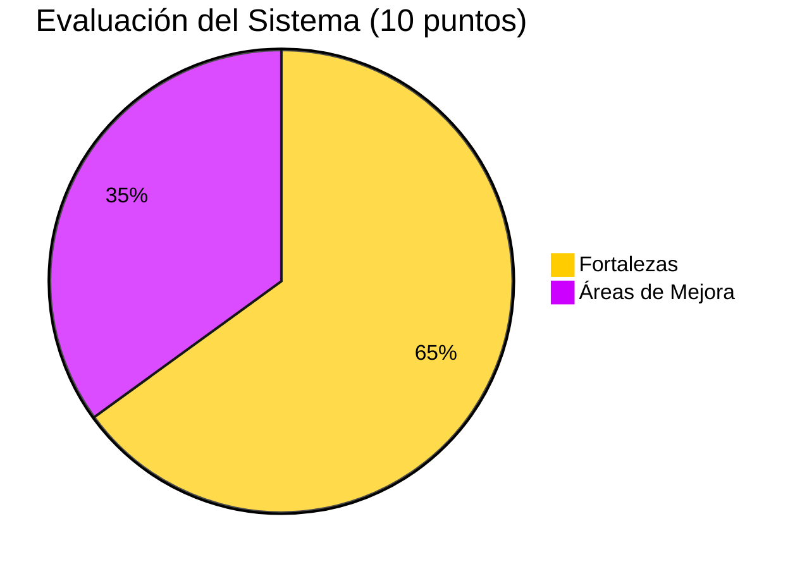
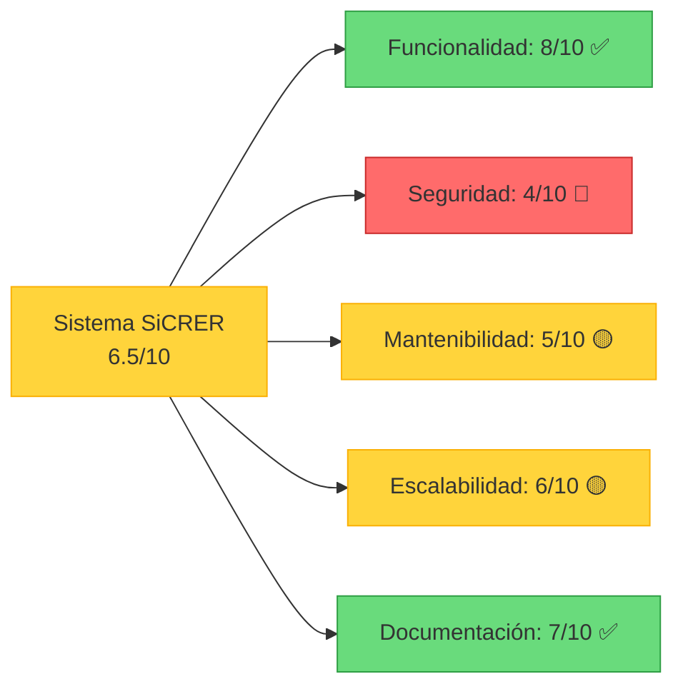
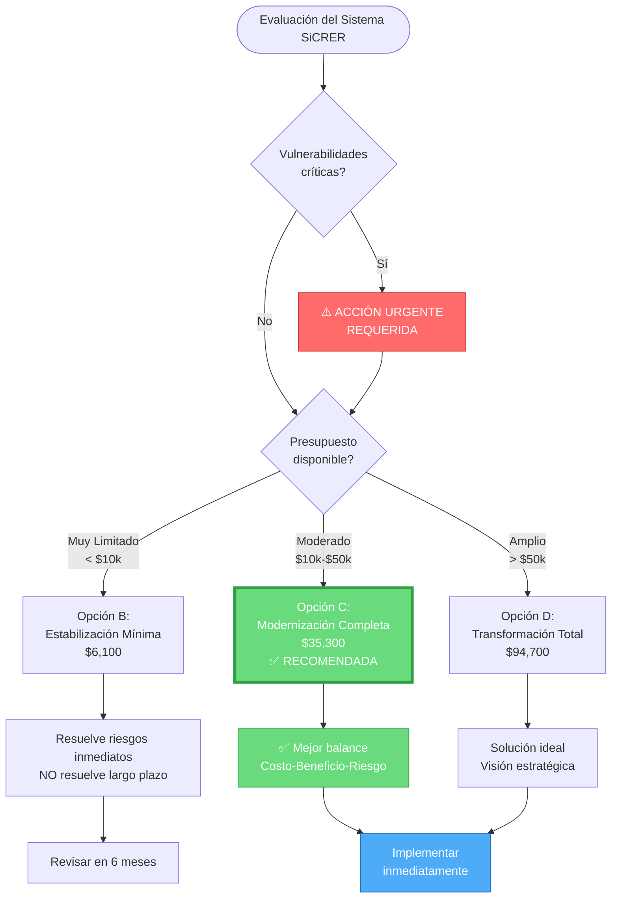
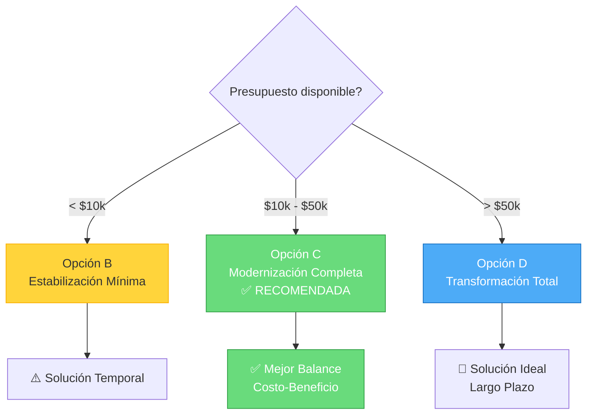

# RESUMEN EJECUTIVO PARA STAKEHOLDERS
## Sistema SiCRER - Evaluación Diagnóstica SEP

**Fecha:** 21 de Noviembre de 2025  
**Destinado a:** Dirección Técnica SEP, Tomadores de Decisión  
**Preparado por:** Ingeniero de Software Certificado PSP

---

## 📊 RESUMEN DE HALLAZGOS

### Estado General del Sistema: **6.5/10** ⚠️

El Sistema SiCRER es una aplicación funcional en producción que requiere **modernización urgente** debido a componentes obsoletos y riesgos de seguridad.



**Desglose de Evaluación:**



---

## 🎯 HALLAZGOS PRINCIPALES

### ✅ FORTALEZAS

1. **Sistema Operativo y Funcional**
   - En uso activo en instituciones educativas
   - Genera reportes completos y detallados
   - Arquitectura modular por nivel educativo

2. **Documentación de Usuario**
   - Plantillas de formatos incluidas
   - Ejemplos de reportes disponibles
   - Plantilla de comunicación con escuelas

3. **Seguridad Básica**
   - Aplicación firmada digitalmente
   - Certificado válido instalado

### ❌ DEBILIDADES CRÍTICAS

1. **🔴 RIESGO CRÍTICO: Componentes Obsoletos**
   - Adobe Flash (fin de soporte: 31/12/2020)
   - .NET Framework 4.5 (fin de soporte: 26/04/2022)
   - **Vulnerabilidades de seguridad sin parches disponibles**

2. **🔴 RIESGO CRÍTICO: Código Fuente**
   - Solo binarios compilados en el repositorio
   - Código fuente no versionado
   - **Imposibilidad de mantenimiento sin fuentes**

3. **🔴 RIESGO ALTO: Limitaciones de Base de Datos**
   - Microsoft Access con límite de 2 GB
   - Tamaño actual: 25.23 MB (12.6% del límite)
   - **Problemas de escalabilidad inminentes**

4. **🟡 RIESGO MEDIO: Dependencia Comercial**
   - Crystal Reports (licencia SAP comercial)
   - Versión antigua (13.0)
   - Costos de licenciamiento continuos

---

## 💰 ANÁLISIS FINANCIERO

### Inversión Requerida para Modernización

| Fase | Descripción | Costo | Tiempo |
|------|-------------|-------|--------|
| **Fase 1** | Estabilización y seguridad | $6,100 | 1-3 meses |
| **Fase 2** | Modernización tecnológica | $29,200 | 3-6 meses |
| **Fase 3** | Transformación digital (opcional) | $59,400 | 6-12 meses |
| **TOTAL** | Modernización completa | **$94,700** | **12 meses** |

### Costo de No Hacer Nada

| Riesgo | Probabilidad | Impacto Financiero |
|--------|--------------|-------------------|
| Pérdida de datos por corrupción BD | Media (30%) | $50,000 - $100,000 |
| Fallo de seguridad (Flash vulnerabilities) | Alta (70%) | $25,000 - $75,000 |
| Incompatibilidad con nuevos sistemas operativos | Alta (80%) | $150,000 (re-desarrollo completo) |
| Multas LGPDP por incumplimiento | Media (40%) | $10,000 - $100,000 |

**Exposición al riesgo anual:** $76,500 USD

---

## 📈 RETORNO DE INVERSIÓN

### Ahorros Proyectados

| Concepto | Ahorro Anual |
|----------|--------------|
| Reducción de soporte técnico | $2,400 |
| Eliminación de licencias Crystal Reports | $5,000 |
| Reducción de bugs (mejor calidad) | $2,000 |
| Automatización de despliegue | $1,500 |
| **TOTAL AHORROS ANUALES** | **$10,900** |

### ROI Simple

```
Inversión: $94,700
Ahorro anual: $10,900
ROI: 8.7 años
```

**NOTA IMPORTANTE:** El ROI financiero no es la única justificación. Los beneficios principales son:
- ✅ **Reducción de riesgos críticos de seguridad**
- ✅ **Sostenibilidad tecnológica a largo plazo**
- ✅ **Cumplimiento normativo (LGPDP)**
- ✅ **Escalabilidad para crecimiento futuro**

---

## 🎯 RECOMENDACIONES

### Recomendación Principal: **PROCEDER CON MODERNIZACIÓN GRADUAL**

### Plan de Acción Inmediata (30 días)

#### 1. **Asegurar Activos Críticos** 🔴 URGENTE
- [ ] Localizar código fuente original
- [ ] Crear backup completo de la base de datos
- [ ] Versionar código en Git con control de acceso
- [ ] Documentar configuraciones actuales

**Costo:** $2,500 | **Tiempo:** 2 semanas

#### 2. **Eliminar Vulnerabilidades Flash** 🔴 URGENTE
- [ ] Identificar usos de componentes Flash
- [ ] Reemplazar con controles .NET estándar
- [ ] Testing de regresión
- [ ] Despliegue de versión parcheada

**Costo:** $2,500 | **Tiempo:** 2 semanas

#### 3. **Implementar Backups Automáticos** 🔴 URGENTE
- [ ] Configurar backup diario de BD
- [ ] Establecer política de retención
- [ ] Probar proceso de restauración
- [ ] Documentar procedimientos

**Costo:** $1,100 | **Tiempo:** 1 semana

**INVERSIÓN TOTAL FASE INMEDIATA:** $6,100

---

## 📋 ROADMAP ESTRATÉGICO

### Timeline Visual de Implementación

```mermaid
timeline
    title Roadmap de Modernización del Sistema SiCRER
    section Fase 1: Estabilización
        Mes 1 : Asegurar activos críticos
              : Eliminar vulnerabilidades Flash
        Mes 2 : Implementar backups automáticos
              : Documentación técnica completa
        Mes 3 : Testing y validación
              : Despliegue de parches de seguridad
    section Fase 2: Modernización
        Mes 4 : Migración a SQL Server
              : Inicio upgrade .NET 8.0
        Mes 5 : Finalización .NET 8.0
              : Reemplazo Crystal Reports
        Mes 6 : Testing integral
              : Despliegue en producción
    section Fase 3: Transformación
        Mes 7-9 : Desarrollo arquitectura web
                : APIs de integración
        Mes 10-11 : Sistema de autenticación
                  : Dashboard de analytics
        Mes 12 : Capacitación y despliegue final
               : Migración completa
```

### Fase 1: Estabilización (Meses 1-3) - **PRIORIDAD CRÍTICA**

**Objetivos:**
- Asegurar continuidad operativa
- Eliminar vulnerabilidades críticas
- Establecer base para modernización

**Entregables:**
1. Código fuente versionado
2. Sistema sin componentes Flash
3. Backups automáticos implementados
4. Documentación técnica completa

**Inversión:** $6,100 | **ROI:** Inmediato (reducción de riesgos)

---

### Fase 2: Modernización (Meses 4-6) - **PRIORIDAD ALTA**

**Objetivos:**
- Migrar a tecnologías soportadas
- Mejorar escalabilidad
- Reducir dependencias comerciales

**Entregables:**
1. Migración a .NET 8.0 (soporte hasta 2026)
2. Base de datos SQL Server Express
3. Reemplazo de Crystal Reports por RDLC
4. Suite de pruebas automatizadas

**Inversión:** $29,200 | **ROI:** 5-7 años

---

### Fase 3: Transformación Digital (Meses 7-12) - **ESTRATÉGICO**

**Objetivos:**
- Modernizar experiencia de usuario
- Centralizar datos
- Habilitar análisis avanzado

**Entregables:**
1. Arquitectura web moderna
2. Acceso desde cualquier dispositivo
3. APIs de integración
4. Sistema de autenticación robusto
5. Dashboard de analytics

**Inversión:** $59,400 | **ROI:** Estratégico

---

## ⚖️ OPCIONES DE DECISIÓN

### Árbol de Decisión Ejecutiva



### Opción A: No Hacer Nada 🔴 NO RECOMENDADO

**Ventajas:**
- Sin inversión inmediata
- Sin interrupciones

**Desventajas:**
- Vulnerabilidades críticas sin resolver
- Riesgo de pérdida de datos
- Posible incompatibilidad futura
- Incumplimiento LGPDP
- Exposición al riesgo: $76,500/año

**Recomendación:** ❌ NO PROCEDER

---

### Opción B: Modernización Mínima (Solo Fase 1) 🟡 ACEPTABLE

**Ventajas:**
- Inversión mínima ($6,100)
- Tiempo reducido (3 meses)
- Elimina riesgos inmediatos

**Desventajas:**
- No resuelve escalabilidad
- Tecnologías aún obsoletas
- Dependencias comerciales continúan

**Recomendación:** ⚠️ TEMPORAL - Solo si presupuesto es limitado

---

### Opción C: Modernización Completa (Fases 1+2) ✅ RECOMENDADO

**Ventajas:**
- Elimina todos los riesgos críticos
- Tecnologías modernas y soportadas
- Base sólida para crecimiento
- Cumplimiento normativo
- Reducción de dependencias comerciales

**Desventajas:**
- Inversión significativa ($35,300)
- Tiempo moderado (6 meses)
- Requiere coordinación con usuarios

**Recomendación:** ✅ PROCEDER - Mejor relación costo-beneficio

---

### Opción D: Transformación Total (Fases 1+2+3) 🔵 IDEAL

**Ventajas:**
- Solución moderna y escalable
- Acceso web multiplataforma
- Centralización de datos
- Analytics avanzado
- Ventaja competitiva

**Desventajas:**
- Inversión alta ($94,700)
- Tiempo extenso (12 meses)
- Cambio cultural significativo

**Recomendación:** 🔵 CONSIDERAR - Para visión de largo plazo

---

## 📋 COMPARATIVA DE OPCIONES

| Aspecto | Opción A | Opción B | Opción C ✅ | Opción D |
|---------|----------|----------|------------|----------|
| **Inversión** | $0 | $6,100 | $35,300 | $94,700 |
| **Tiempo** | 0 | 3 meses | 6 meses | 12 meses |
| **Riesgo Seguridad** | 🔴 Alto | 🟡 Medio | 🟢 Bajo | 🟢 Bajo |
| **Escalabilidad** | 🔴 No | 🔴 No | 🟢 Sí | 🟢 Sí |
| **Sostenibilidad** | 🔴 No | 🟡 Parcial | 🟢 Sí | 🟢 Sí |
| **LGPDP Compliance** | 🔴 No | 🔴 No | 🟡 Parcial | 🟢 Completo |
| **Modernidad** | 🔴 Legacy | 🟡 Parcial | 🟢 Moderno | 🟢 Vanguardia |

### Visualización de Opciones: Inversión vs Valor

```mermaid
quadrantChart
    title Análisis Costo-Beneficio de Opciones
    x-axis Baja Inversión --> Alta Inversión
    y-axis Bajo Valor --> Alto Valor
    quadrant-1 Mejor ROI
    quadrant-2 Sobreprecio
    quadrant-3 Baja Prioridad
    quadrant-4 Oportunidad
    Opción A: [0.1, 0.2]
    Opción B: [0.2, 0.5]
    Opción C (RECOMENDADA): [0.4, 0.85]
    Opción D: [0.9, 0.95]
```

### Matriz de Decisión



---

## 🚨 RIESGOS DE NO ACTUAR

### Escenario 1: Fallo de Seguridad

**Probabilidad:** Alta (70%)  
**Impacto:** $25,000 - $75,000

Una vulnerabilidad Flash explotada podría comprometer datos de estudiantes (CURP, desempeño académico). Esto resultaría en:
- Pérdida de reputación institucional
- Posibles sanciones LGPDP
- Costo de remediación
- Investigación y auditoría

### Escenario 2: Corrupción de Base de Datos

**Probabilidad:** Media (30%)  
**Impacto:** $50,000 - $100,000

Access llegando a su límite de 2GB podría causar corrupción. Esto implicaría:
- Pérdida de datos de evaluaciones
- Re-captura manual (si es posible)
- Interrupción del servicio
- Re-desarrollo urgente

### Escenario 3: Incompatibilidad Windows 11+

**Probabilidad:** Alta (80%)  
**Impacto:** $150,000

Futuras actualizaciones de Windows podrían romper compatibilidad. Esto requeriría:
- Re-desarrollo completo desde cero
- Pérdida de funcionalidad temporalmente
- Inversión 3x mayor que modernización

---

## ✅ CRITERIOS DE ÉXITO

### Métricas Técnicas

- ✅ Eliminación del 100% de componentes obsoletos
- ✅ Migración exitosa del 100% de datos
- ✅ Code coverage ≥ 70%
- ✅ Tiempo de respuesta < 2 segundos en 95% de operaciones
- ✅ Zero downtime durante despliegue

### Métricas de Negocio

- ✅ Satisfacción de usuarios ≥ 4.0/5.0
- ✅ Reducción de incidentes técnicos en 60%
- ✅ Reducción de tiempo de soporte en 40%
- ✅ Cumplimiento 100% normativa LGPDP

### Métricas Financieras

- ✅ Proyecto dentro de presupuesto (±10%)
- ✅ Entrega dentro de plazo (±15%)
- ✅ ROI alcanzado según proyección

---

## 🎓 IMPACTO EN BENEFICIARIOS

### Beneficios para Directivos SEP

- **Visibilidad:** Datos consolidados en tiempo real
- **Decisiones:** Información actualizada para políticas educativas
- **Cumplimiento:** Normativa LGPDP satisfecha
- **Reputación:** Sistema moderno y confiable

### Beneficios para Directores de Escuela

- **Eficiencia:** Procesos automatizados
- **Rapidez:** Generación instantánea de reportes
- **Accesibilidad:** Acceso desde cualquier ubicación (Fase 3)
- **Confiabilidad:** Datos seguros y respaldados

### Beneficios para Docentes

- **Simplicidad:** Interfaz intuitiva
- **Rapidez:** Menos tiempo en captura
- **Precisión:** Validaciones automáticas
- **Seguimiento:** Históricos completos

### Beneficios para Estudiantes y Padres

- **Transparencia:** Acceso a resultados
- **Oportunidad:** Identificación temprana de áreas de mejora
- **Privacidad:** Datos protegidos adecuadamente

---

## 📞 PRÓXIMOS PASOS

### Acción Inmediata Requerida

1. **Decisión de Dirección** (Esta semana)
   - Revisar este documento
   - Aprobar presupuesto Fase 1 ($6,100)
   - Autorizar inicio de trabajos

2. **Formación de Equipo** (Próxima semana)
   - Asignar líder técnico
   - Designar equipo de desarrollo
   - Establecer canales de comunicación

3. **Kickoff del Proyecto** (Semana 3)
   - Reunión de arranque
   - Revisión de plan detallado
   - Establecer cronograma
   - Definir KPIs

---

## 📋 ANEXOS

### A. Equipo Recomendado

| Rol | Cantidad | Perfil |
|-----|----------|--------|
| Líder Técnico | 1 | Senior .NET Developer |
| Desarrollador | 2 | Mid-level .NET Developer |
| QA Engineer | 1 | Testing specialist |
| DBA | 1 | SQL Server expert (part-time) |
| DevOps | 1 | CI/CD specialist (part-time) |

### B. Herramientas y Tecnologías

**Desarrollo:**
- Visual Studio 2022
- .NET 8.0 SDK
- SQL Server Express 2022
- Git / GitHub

**Testing:**
- xUnit / NUnit
- Selenium (UI tests)
- SQL Server Data Tools

**Infraestructura:**
- Windows Server 2022
- IIS 10
- Azure DevOps (opcional)

### C. Cronograma Visual

```
Mes 1-3: FASE 1 - Estabilización [███████░░░░░░░░░]
├── Semana 1-2: Asegurar activos
├── Semana 3-4: Eliminar Flash
└── Semana 5-12: Backups y documentación

Mes 4-6: FASE 2 - Modernización [░░░░░░░███████░░]
├── Semana 13-16: Migración BD
├── Semana 17-20: Upgrade .NET
└── Semana 21-24: Reemplazo Crystal

Mes 7-12: FASE 3 - Transformación [░░░░░░░░░░░████]
├── Semana 25-32: Desarrollo Web
├── Semana 33-40: APIs y Auth
└── Semana 41-48: Testing y Deploy
```

---

## 💼 RECOMENDACIÓN FINAL

### Para Toma de Decisión Inmediata

**✅ APROBAR FASE 1 + FASE 2 (Opción C)**

**Razones:**
1. Elimina riesgos críticos de seguridad
2. Inversión razonable y justificada
3. Tiempo de ejecución moderado
4. Base sólida para futuro crecimiento
5. Cumplimiento normativo alcanzado

**Inversión Total:** $35,300 USD  
**Tiempo:** 6 meses  
**Valor Agregado:** Incalculable (continuidad operativa + reducción de riesgos)

---

**Preparado por:**  
Ingeniero de Software Certificado PSP  
Especialista en Metodología RUP

**Fecha:** 21 de Noviembre de 2025

**Para consultas o aclaraciones:**  
Contactar al equipo técnico del proyecto

---

**DOCUMENTO CONFIDENCIAL**  
*Este documento contiene información técnica y financiera sensible del Sistema SiCRER de la Secretaría de Educación Pública.*
