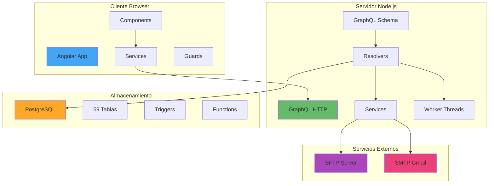
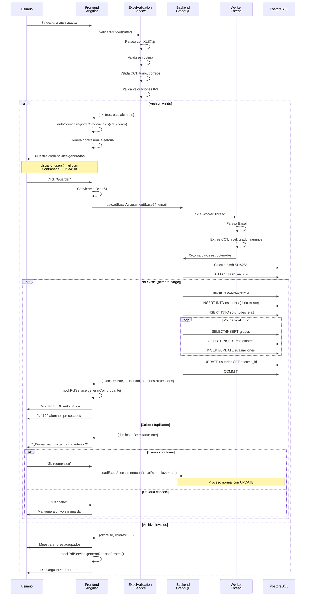
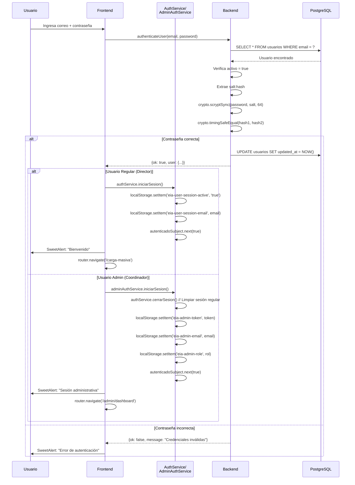
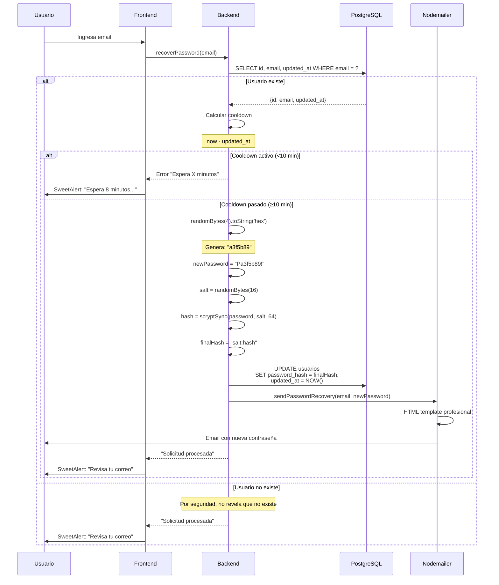
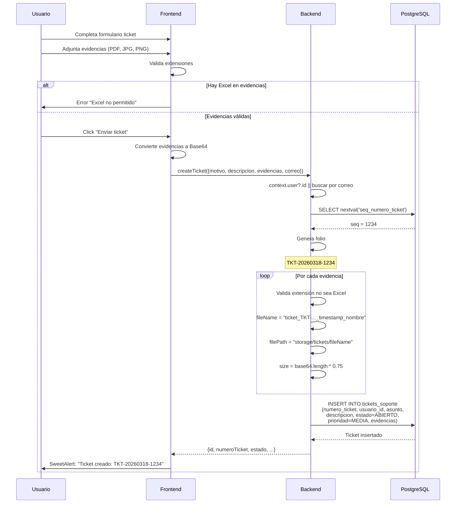
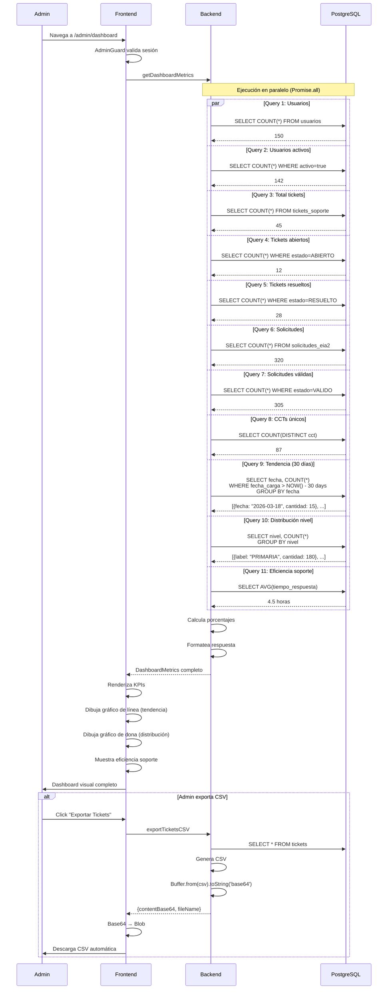

# 📊 RESUMEN COMPLETO DEL SISTEMA IMPLEMENTADO
## Sistema de Evaluación Diagnóstica SEP - SiCRER

**Documento:** Análisis completo de implementación actual  
**Fecha:** 18 de marzo de 2026  
**Rama:** DEV_VLP_EstructuraDeDatos  
**Propósito:** Documentación técnica detallada para referencia del desarrollador

---

## 📑 TABLA DE CONTENIDOS

1. [Arquitectura General](#-arquitectura-general)
2. [Backend - GraphQL Server](#-backend-graphql-server)
3. [Frontend - Angular](#-frontend-angular)
4. [Flujos Principales](#-flujos-principales-implementados)
5. [Datos y Validaciones](#-datos-y-validaciones)
6. [Lo que NO está implementado](#-lo-que-no-está-implementado)
7. [Resumen Ejecutivo](#-resumen-ejecutivo)

---

## 🏗️ ARQUITECTURA GENERAL

### Stack Tecnológico Completo

#### **Backend**
| Tecnología | Versión | Propósito |
|------------|---------|-----------|
| Node.js | 18+ | Runtime JavaScript del servidor |
| TypeScript | 5.x | Tipado estático y transpilación |
| Apollo Server | 4.x | Servidor GraphQL |
| PostgreSQL | 14+ | Base de datos relacional |
| Worker Threads | Native | Procesamiento asíncrono pesado |
| ssh2-sftp-client | Latest | Cliente SFTP para sincronización |
| Nodemailer | Latest | Servicio de correo electrónico |
| XLSX | Latest | Procesamiento de archivos Excel |
| crypto (Node.js) | Native | Hashing, tokens, seguridad |

#### **Frontend**
| Tecnología | Versión | Propósito |
|------------|---------|-----------|
| Angular | 18.x | Framework frontend |
| TypeScript | 5.x | Lenguaje de desarrollo |
| RxJS | 7.x | Programación reactiva |
| SweetAlert2 | Latest | Alertas y diálogos |
| XLSX.js | Latest | Procesamiento Excel cliente |

### Arquitectura de Comunicación



---

## 🔧 BACKEND (GRAPHQL SERVER)

### 📁 Estructura del Proyecto

```
graphql-server/
├── src/
│   ├── config/
│   │   └── database.ts          # Configuración pool PostgreSQL
│   ├── schema/
│   │   ├── typeDefs.ts          # Definiciones GraphQL (tipos)
│   │   └── resolvers.ts         # Implementación de queries/mutations
│   ├── services/
│   │   ├── mailing.service.ts   # Nodemailer para emails
│   │   └── sftp.service.ts      # Cliente SFTP
│   ├── utils/
│   │   ├── logger.ts            # Winston logger
│   │   └── data-loaders.ts      # DataLoaders (N+1 optimization)
│   ├── workers/
│   │   └── worker-excel.ts      # Worker Thread para Excel
│   └── index.ts                 # Entry point del servidor
├── scripts/                     # Scripts SQL de migración
├── package.json
└── tsconfig.json
```

### 🔌 API GraphQL Implementada

#### **QUERIES (13 operaciones)**

##### 1. `healthCheck`
Estado del servidor y conexión a base de datos.

```graphql
query HealthCheck {
  healthCheck {
    status
    timestamp
    database {
      connected
      latency
    }
    version
  }
}
```

**Response:**
```json
{
  "status": "OK",
  "timestamp": "2026-03-18T10:30:00.000Z",
  "database": {
    "connected": true,
    "latency": 12
  },
  "version": "1.0.0"
}
```

---

##### 2. `getUser(id: ID!)`
Obtener usuario por ID con información completa.

```graphql
query GetUser($id: ID!) {
  getUser(id: $id) {
    id
    email
    nombre
    apepaterno
    apematerno
    rol
    activo
    fechaRegistro
    fechaUltimoAcceso
    centrosTrabajo {
      claveCCT
      nombre
      nivel
    }
  }
}
```

---

##### 3. `listUsers(limit: Int, offset: Int)`
Listar usuarios con paginación.

```graphql
query ListUsers($limit: Int, $offset: Int) {
  listUsers(limit: $limit, offset: $offset) {
    nodes {
      id
      email
      nombre
      rol
    }
    totalCount
    hasNextPage
  }
}
```

---

##### 4. `getCCT(clave: String!)`
Obtener centro de trabajo por clave CCT.

```graphql
query GetCCT($clave: String!) {
  getCCT(clave: $clave) {
    id
    claveCCT
    nombre
    entidad
    municipio
    localidad
    nivel
    turno
  }
}
```

---

##### 5. `getEvaluacion(id: ID!)`
Obtener evaluación por ID.

---

##### 6. `getSolicitudes(cct: String, limit: Int, offset: Int)`
Historial de cargas EIA2 del usuario.

```graphql
query GetSolicitudes($cct: String, $limit: Int, $offset: Int) {
  getSolicitudes(cct: $cct, limit: $limit, offset: $offset) {
    id
    consecutivo
    cct
    archivoOriginal
    fechaCarga
    estadoValidacion
    nivelEducativo
    numeroEstudiantes
    procesadoExternamente
    resultados {
      nombre
      url
      size
    }
  }
}
```

---

##### 7. `getMyTickets(correo: String)`
Listar tickets del usuario autenticado.

```graphql
query GetMyTickets($correo: String) {
  getMyTickets(correo: $correo) {
    id
    numeroTicket
    asunto
    descripcion
    estado
    prioridad
    evidencias
    fechaCreacion
    fechaActualizacion
  }
}
```

---

##### 8. `getAllTickets`
Listar todos los tickets del sistema (solo Admin).

---

##### 9. `getDashboardMetrics`
Métricas completas para dashboard administrativo.

```graphql
query GetDashboardMetrics {
  getDashboardMetrics {
    totalUsuarios
    usuariosActivos
    totalTickets
    ticketsAbiertos
    ticketsResueltos
    totalSolicitudes
    solicitudesValidadas
    totalCCTs
    tendenciaCargas {
      fecha
      cantidad
    }
    distribucionNivel {
      label
      cantidad
      porcentaje
    }
    eficienciaSoporte {
      tiempoPromedioRespuestaHoras
      tasaResolucion
    }
  }
}
```

---

##### 10. `exportTicketsCSV`
Exportar tickets a formato CSV (Base64).

```graphql
query ExportTicketsCSV {
  exportTicketsCSV {
    success
    fileName
    contentBase64
  }
}
```

---

##### 11. `generateComprobante(solicitudId: ID!)`
Generar comprobante de recepción en PDF.

---

##### 12. `downloadAssessmentResult(solicitudId: ID!, fileName: String!)`
Descargar archivo de resultado específico.

```graphql
query DownloadAssessmentResult($solicitudId: ID!, $fileName: String!) {
  downloadAssessmentResult(solicitudId: $solicitudId, fileName: $fileName) {
    success
    fileName
    contentBase64
  }
}
```

---

##### 13. `getPreguntasFrecuentes`
Obtener lista de preguntas frecuentes.

```graphql
query GetPreguntasFrecuentes {
  getPreguntasFrecuentes {
    id
    pregunta
    respuesta
    activo
    orden
    fecha_creacion
  }
}
```

---

#### **MUTATIONS (10 operaciones)**

##### 1. `createUser(input: CreateUserInput!)`
Crear nuevo usuario con credenciales.

```graphql
mutation CreateUser($input: CreateUserInput!) {
  createUser(input: $input) {
    id
    email
    nombre
    apepaterno
    apematerno
    rol
    activo
    fechaRegistro
  }
}
```

**Input:**
```typescript
interface CreateUserInput {
  email: string;
  nombre: string;
  apepaterno: string;
  apematerno?: string;
  rol: string; // DIRECTOR, COORDINADOR_FEDERAL, etc.
  password: string;
  clavesCCT?: string[];
}
```

**Proceso interno:**
1. Valida email único
2. Hashea contraseña con `scrypt + salt`
3. Inserta en tabla `usuarios`
4. Vincula con escuela si CCT existe
5. Envía credenciales por correo electrónico

---

##### 2. `authenticateUser(input: AuthenticateUserInput!)`
Autenticar usuario con email y contraseña.

```graphql
mutation AuthenticateUser($input: AuthenticateUserInput!) {
  authenticateUser(input: $input) {
    ok
    message
    user {
      id
      email
      rol
      centrosTrabajo {
        claveCCT
      }
    }
  }
}
```

**Proceso interno:**
1. Busca usuario por email
2. Verifica cuenta activa
3. Valida contraseña con `crypto.timingSafeEqual` (timing-safe)
4. Actualiza `updated_at`
5. Retorna datos del usuario

**Seguridad:**
- ✅ Timing-safe password comparison
- ✅ Hash almacenado con formato `salt:hash`
- ✅ Scrypt con 64 bytes de hash

---

##### 3. `updateUser(id: ID!, input: UpdateUserInput!)`
Actualizar datos de usuario existente.

---

##### 4. `deleteUser(id: ID!)`
Baja lógica de usuario (soft delete).

---

##### 5. `uploadExcelAssessment(input: UploadExcelInput!)`
**Carga masiva de evaluaciones desde Excel.**

```graphql
mutation UploadExcel($input: UploadExcelInput!) {
  uploadExcelAssessment(input: $input) {
    success
    message
    solicitudId
    duplicadoDetectado
    detalles {
      cct
      nivel
      grado
      alumnosProcesados
      errores
    }
  }
}
```

**Input:**
```typescript
interface UploadExcelInput {
  archivoBase64: string;
  nombreArchivo: string;
  confirmarReemplazo?: boolean;
  email?: string;
}
```

**Proceso completo (paso a paso):**

1. **Validación de entrada**
   - Verifica que `archivoBase64` y `nombreArchivo` existan

2. **Procesamiento con Worker Thread**
   - Instantánea `Worker` de `worker-excel.js`
   - Envía mensaje con archivo Base64
   - Worker parsea Excel con XLSX.js
   - Extrae:
     - **CCT** (hoja ESC, celda específica)
     - **Nivel** educativo (PREESCOLAR/PRIMARIA/SECUNDARIA)
     - **Grado** (1-6)
     - **Alumnos**: CURP, nombre, grupo, evaluaciones por materia

3. **Detección de duplicados**
   - Calcula hash SHA256 del archivo
   - Busca en `solicitudes_eia2` por `hash_archivo`
   - Si existe y no hay confirmación: retorna `duplicadoDetectado: true`

4. **Creación/Actualización de datos**
   
   **a) Escuela:**
   ```sql
   SELECT id FROM escuelas WHERE cct = ?
   -- Si no existe:
   INSERT INTO escuelas (cct, nombre, id_turno, id_nivel, id_entidad, id_ciclo)
   VALUES (?, 'Escuela sin nombre (Importada)', 1, ?, 14, 1)
   ```

   **b) Vinculación usuario-escuela:**
   ```sql
   UPDATE usuarios 
   SET escuela_id = ?, updated_at = NOW() 
   WHERE id = ? AND (escuela_id IS NULL OR escuela_id != ?)
   ```

   **c) Grupos:**
   ```sql
   SELECT id FROM grupos 
   WHERE escuela_id = ? AND grado_id = ? AND nombre = ?
   -- Si no existe:
   INSERT INTO grupos (escuela_id, grado_id, nombre, nivel_educativo)
   VALUES (?, ?, ?, ?)
   ```

   **d) Estudiantes:**
   ```sql
   SELECT id FROM estudiantes WHERE curp = ?
   -- Si no existe:
   INSERT INTO estudiantes (nombre, grupo_id, curp, estatus)
   VALUES (?, ?, ?, 'A')
   -- Si existe:
   UPDATE estudiantes SET nombre = ?, grupo_id = ? WHERE id = ?
   ```

   **e) Evaluaciones:**
   ```sql
   INSERT INTO evaluaciones 
     (estudiante_id, materia_id, periodo_id, valoracion, fecha_evaluacion, updated_at, solicitud_id)
   VALUES (?, ?, ?, ?, NOW(), NOW(), ?)
   ON CONFLICT (estudiante_id, materia_id, periodo_id, solicitud_id)
   DO UPDATE SET 
     valoracion = EXCLUDED.valoracion,
     fecha_evaluacion = EXCLUDED.fecha_evaluacion,
     updated_at = NOW()
   ```

5. **Sincronización SFTP (asíncrona)**
   - Escribe archivo temporal en disco
   - Sube a servidor SFTP remoto
   - No bloquea respuesta al cliente
   - Logs de éxito/error

6. **Respuesta al cliente**
   - `success: true`
   - `solicitudId`: UUID de la solicitud creada
   - `alumnosProcesados`: Contador de alumnos insertados

**Características clave:**
- ✅ Worker Thread no bloquea Event Loop
- ✅ Detección de duplicados por hash
- ✅ Upsert de estudiantes (INSERT ON CONFLICT)
- ✅ Vinculación automática usuario-escuela
- ✅ Sincronización SFTP asíncrona
- ✅ Transacciones atómicas (BEGIN/COMMIT/ROLLBACK)

---

##### 6. `recoverPassword(email: String!)`
Recuperar contraseña (genera nueva y envía por email).

```graphql
mutation RecoverPassword($email: String!) {
  recoverPassword(email: $email)
}
```

**Proceso interno:**

1. **Buscar usuario**
   ```sql
   SELECT id, email, updated_at FROM usuarios WHERE email = ?
   ```

2. **Verificar cooldown (10 minutos)**
   ```typescript
   const lastUpdate = user.updated_at;
   const now = new Date();
   const diffMs = now.getTime() - lastUpdate.getTime();
   const cooldownMs = 10 * 60 * 1000; // 10 minutos
   
   if (diffMs < cooldownMs) {
     const remainingMinutes = Math.ceil((cooldownMs - diffMs) / 60000);
     throw new Error(`Espera ${remainingMinutes} minutos...`);
   }
   ```

3. **Generar contraseña aleatoria**
   ```typescript
   const randomPart = crypto.randomBytes(4).toString('hex'); // 8 chars
   const newPassword = `P${randomPart}!`; // Ej: "Pa3f5b89!"
   ```

4. **Hashear y actualizar**
   ```typescript
   const salt = crypto.randomBytes(16).toString('hex');
   const passwordHash = crypto.scryptSync(newPassword, salt, 64).toString('hex');
   const finalHash = `${salt}:${passwordHash}`;
   
   await client.query(
     'UPDATE usuarios SET password_hash = $1, updated_at = NOW() WHERE id = $2',
     [finalHash, userId]
   );
   ```

5. **Enviar email**
   - Usa plantilla HTML profesional
   - Muestra nueva contraseña en texto grande
   - Instrucciones de uso

**Seguridad:**
- ✅ Cooldown de 10 minutos entre solicitudes
- ✅ Contraseña aleatoria criptográficamente segura
- ✅ No revela si email existe o no (mismo mensaje)

---

##### 7. `createTicket(input: CreateTicketInput!)`
Crear ticket de soporte.

```graphql
mutation CreateTicket($input: CreateTicketInput!) {
  createTicket(input: $input) {
    id
    numeroTicket
    asunto
    descripcion
    estado
    prioridad
    evidencias
    fechaCreacion
  }
}
```

**Input:**
```typescript
interface CreateTicketInput {
  motivo: string;        // Asunto del ticket
  descripcion: string;   // Descripción detallada
  evidencias?: Array<{   // Archivos adjuntos
    nombre: string;
    base64: string;
  }>;
  correo?: string;       // Si no está autenticado
}
```

**Proceso interno:**

1. **Validar autenticación**
   - Usuario autenticado: usa `context.user.id`
   - No autenticado: busca por `correo` o permite ticket anónimo

2. **Generar número de ticket**
   ```sql
   SELECT nextval('seq_numero_ticket') as seq
   ```
   ```typescript
   const ymd = now.toISOString().slice(0, 10).replace(/-/g, '');
   const numeroTicket = `TKT-${ymd}-${seq.toString().padStart(4, '0')}`;
   // Ejemplo: "TKT-20260318-0001"
   ```

3. **Validar evidencias**
   ```typescript
   for (const evidencia of evidencias) {
     const ext = evidencia.nombre.toLowerCase();
     if (ext.endsWith('.xlsx') || ext.endsWith('.xls')) {
       throw new Error(`${evidencia.nombre} no permitido (Excel restringido)`);
     }
   }
   ```

4. **Procesar evidencias**
   - Genera nombre único: `ticket_{numeroTicket}_{timestamp}_{nombre}`
   - Guarda ruta: `storage/tickets/{fileName}`
   - Calcula tamaño aproximado del Base64

5. **Insertar ticket**
   ```sql
   INSERT INTO tickets_soporte 
     (numero_ticket, usuario_id, asunto, descripcion, estado, prioridad, evidencias)
   VALUES (?, ?, ?, ?, fn_catalogo_id('cat_estado_ticket', 'ABIERTO'), 'MEDIA', ?)
   ```

**Validaciones:**
- ✅ Prohibido Excel en evidencias (US-2.7)
- ✅ Asignación automática de estado ABIERTO
- ✅ Prioridad por defecto: MEDIA
- ✅ Soporte para tickets anónimos (con correo)

---

##### 8. `respondToTicket(ticketId: ID!, respuesta: String!, cerrar: Boolean!)`
Responder a ticket de soporte (solo Admin).

---

##### 9. `deleteTicket(ticketId: ID!)`
Borrado lógico de ticket (soft delete).

```sql
UPDATE tickets_soporte 
SET deleted_at = NOW() 
WHERE id = ?
```

---

##### 10. `uploadAssessmentResults(input: UploadResultsInput!)`
Cargar archivos de resultados asociados a evaluación (Admin).

```graphql
mutation UploadResults($input: UploadResultsInput!) {
  uploadAssessmentResults(input: $input) {
    success
    message
    resultados {
      nombre
      url
      size
    }
  }
}
```

**Input:**
```typescript
interface UploadResultsInput {
  solicitudId: string;
  archivos: Array<{
    nombre: string;
    base64: string;
  }>;
}
```

---

### 🔐 Sistema de Autenticación

#### Context GraphQL

```typescript
interface GraphQLContext {
  user?: {
    id: string;
    email: string;
    rol: string;
  };
}
```

#### Middleware de Autenticación

```typescript
// En index.ts (Apollo Server context)
context: async ({ req }) => {
  const authHeader = req.headers.authorization || '';
  
  if (authHeader.startsWith('Bearer ')) {
    const token = authHeader.substring(7);
    
    try {
      // Token formato: email:timestamp en Base64
      const decoded = Buffer.from(token, 'base64').toString('utf-8');
      const [email] = decoded.split(':');
      
      const result = await query(
        'SELECT id, email, rol FROM usuarios WHERE email = $1 AND activo = true',
        [email]
      );
      
      if (result.rows.length > 0) {
        return { user: result.rows[0] };
      }
    } catch (error) {
      logger.error('Auth error', error);
    }
  }
  
  return {};
}
```

#### Dos Tipos de Usuarios

**1. Usuario Regular (Director/Subdirector)**
- Rol: `DIRECTOR`, `SUBDIRECTOR`
- Acceso: Carga de archivos, historial, tickets, descargas
- Token: `email:timestamp` en Base64
- Almacenamiento: `localStorage` con keys:
  - `eia-user-session-active`
  - `eia-user-session-email`
  - `eia-user-credentials`

**2. Usuario Administrativo (Coordinador)**
- Rol: `COORDINADOR_FEDERAL`, `COORDINADOR_ESTATAL`
- Acceso: Dashboard, gestión de tickets, métricas, exportaciones
- Token: Mismo formato que usuario regular
- Almacenamiento: `localStorage` con keys:
  - `eia-admin-token`
  - `eia-admin-email`
  - `eia-admin-role`

---

### 📧 Servicio de Email (MailingService)

**Ubicación:** `src/services/mailing.service.ts`

#### Configuración

```typescript
const transporter = nodemailer.createTransport({
  host: process.env.SMTP_HOST || 'smtp.gmail.com',
  port: parseInt(process.env.SMTP_PORT || '465'),
  secure: process.env.SMTP_SECURE === 'true',
  auth: {
    user: process.env.SMTP_USER,
    pass: process.env.SMTP_PASSWORD,
  },
});
```

#### Métodos Implementados

##### 1. `sendEmail(to, subject, html)`
Envío genérico de correo.

##### 2. `sendPasswordRecovery(email, passwordNew)`
Plantilla de recuperación de contraseña.

**HTML:**
```html
<div style="font-family: 'Segoe UI'...">
  <h2>Recuperación de Contraseña</h2>
  <p>Has solicitado restablecer tu contraseña...</p>
  <div style="background: #f8fafc; ...">
    <p>Tu nueva contraseña de acceso es:</p>
    <span style="font-size: 1.5em...">${passwordNew}</span>
  </div>
</div>
```

##### 3. `sendCredentials(email, cct, passwordNew)`
Plantilla de bienvenida con credenciales.

**HTML:**
```html
<div style="font-family: 'Segoe UI'...">
  <h2>Bienvenido al Sistema</h2>
  <p>Estimado Director/Usuario de la escuela <strong>${cct}</strong>...</p>
  <div style="background: #f8fafc; ...">
    <p><strong>Usuario/Email:</strong> ${email}</p>
    <p><strong>Contraseña Temporal:</strong> ${passwordNew}</p>
  </div>
  <p>Accede aquí: <a href="${process.env.APP_URL}">Sistema</a></p>
</div>
```

**Características:**
- ✅ Plantillas HTML responsive
- ✅ Estilos inline para compatibilidad
- ✅ Logos y branding SEP
- ✅ Enlaces dinámicos
- ✅ Logging de envíos

---

### 📤 Servicio SFTP (SftpService)

**Ubicación:** `src/services/sftp.service.ts`

#### Configuración

```typescript
private getConfig() {
  return {
    host: process.env.SFTP_HOST || 'localhost',
    port: parseInt(process.env.SFTP_PORT || '2222'),
    username: process.env.SFTP_USER || 'user',
    password: process.env.SFTP_PASSWORD || 'pass',
  };
}
```

#### Métodos Implementados

##### 1. `connect(): Promise<boolean>`
Establece conexión SFTP.

##### 2. `uploadFile(localPath, remotePath): Promise<boolean>`
Sube archivo desde disco.

```typescript
await this.client.put(localPath, remotePath);
logger.info(`File uploaded to SFTP: ${remotePath}`);
```

##### 3. `uploadBuffer(buffer, remotePath): Promise<boolean>`
Sube desde memoria (Buffer).

```typescript
await this.client.put(buffer, remotePath);
logger.info(`Buffer uploaded to SFTP: ${remotePath}`);
```

##### 4. `downloadBuffer(remotePath): Promise<Buffer | null>`
Descarga archivo a memoria.

```typescript
const buffer = await this.client.get(remotePath);
return buffer as Buffer;
```

##### 5. `listFiles(remoteDir): Promise<FileInfo[]>`
Lista archivos en directorio.

**Uso en uploadExcelAssessment:**
```typescript
// Sincronización asíncrona después de guardar en BD
const syncSftp = async () => {
  const tempPath = path.resolve(__dirname, `../../temp_${nombreArchivo}`);
  try {
    await fs.writeFile(tempPath, buffer);
    const remotePath = `/upload/${new Date().getTime()}_${nombreArchivo}`;
    const success = await sftpService.uploadFile(tempPath, remotePath);
    if (success) {
      logger.info('Archivo sincronizado con SFTP exitosamente');
    }
  } catch (err) {
    logger.error('Error sincronizando con SFTP', err);
  } finally {
    try { await fs.unlink(tempPath); } catch {}
  }
};

// Ejecutar sin await (no bloqueante)
void syncSftp();
```

**Características:**
- ✅ Reconexión automática si cae conexión
- ✅ Manejo de errores robusto
- ✅ Logging detallado
- ✅ No bloquea operaciones principales

---

### ⚙️ Worker Thread (worker-excel.ts)

**Ubicación:** `src/workers/worker-excel.ts`

**Propósito:** Procesar archivos Excel pesados sin bloquear el Event Loop de Node.js.

#### Interfaz de Comunicación

**Input:**
```typescript
interface WorkerInput {
  archivoBase64: string;
  nombreArchivo: string;
}
```

**Output:**
```typescript
interface WorkerOutput {
  success: boolean;
  data?: {
    cct: string;
    nivel: string;
    grado: number;
    alumnos: ParsedStudent[];
    metadata: {
      nivelDetectado: string;
      gradoDetectado: string;
    };
  };
  error?: string;
}
```

#### Proceso de Parsing

1. **Decodificar Base64 a Buffer**
   ```typescript
   const buffer = Buffer.from(archivoBase64, 'base64');
   ```

2. **Parsear con XLSX**
   ```typescript
   const workbook = XLSX.read(buffer, { type: 'buffer' });
   ```

3. **Extraer CCT (Hoja ESC)**
   ```typescript
   const sheetEsc = workbook.Sheets['ESC'] || workbook.Sheets[workbook.SheetNames[0]];
   const dataEsc = XLSX.utils.sheet_to_json(sheetEsc, { header: 1 });
   
   let cct = '';
   for (const row of dataEsc) {
     if (row && typeof row[1] === 'string' && row[1].includes('CCT')) {
       cct = (row[2] || '').toString().trim();
     }
   }
   if (!cct && dataEsc[8]) cct = (dataEsc[8][3] || '').toString().trim();
   ```

4. **Extraer Nivel Educativo**
   ```typescript
   let nivel = '';
   
   // Método 1: De hoja ESC
   if (dataEsc[5] && dataEsc[5][2]) {
     nivel = dataEsc[5][2].toString().toUpperCase();
   }
   
   // Método 2: De nombres de hojas
   if (!nivel) {
     const sheets = workbook.SheetNames.map(n => n.toUpperCase());
     if (sheets.includes('PREESCOLAR')) nivel = 'PREESCOLAR';
     else if (sheets.includes('SEXTO')) nivel = 'PRIMARIA';
     else if (sheets.some(n => n.includes('SECUNDARIA'))) nivel = 'SECUNDARIA';
   }
   
   // Método 3: Del nombre de archivo
   if (!nivel) {
     const name = nombreArchivo.toUpperCase();
     if (name.includes('PREESCOLAR')) nivel = 'PREESCOLAR';
     else if (name.includes('PRIMARIA')) nivel = 'PRIMARIA';
     else if (name.includes('SECUNDARIA')) nivel = 'SECUNDARIA';
   }
   ```

5. **Identificar Grado**
   ```typescript
   const dataSheetName = workbook.SheetNames.find((n) =>
     ['PRIMERO', 'SEGUNDO', 'TERCERO', 'CUARTO', 'QUINTO', 'SEXTO'].some(
       (prefix) => n.toUpperCase().includes(prefix)
     )
   );
   
   const gradoMap = {
     PRIMERO: 1, SEGUNDO: 2, TERCERO: 3,
     CUARTO: 4, QUINTO: 5, SEXTO: 6
   };
   
   const baseGrado = Object.keys(gradoMap).find((k) =>
     gradoFromSheet.includes(k)
   ) ? gradoMap[...] : 1;
   ```

6. **Procesar Alumnos**
   ```typescript
   const sheetData = workbook.Sheets[dataSheetName];
   const dataAlumnos = XLSX.utils.sheet_to_json(sheetData, { header: 1 });
   
   for (const row of dataAlumnos.slice(1)) {
     if (!row || row.length < 5 || !row[1]) continue;
     
     const curp = (row[1] || '').toString().trim();
     const nombreCompleto = (row[2] || '').toString().trim();
     const grupoNombre = (row[3] || 'A').toString().trim();
     
     const studentEvaluaciones = [];
     
     // Leer columnas 6+ (evaluaciones)
     for (let col = 6; col < Math.min(row.length, 10); col++) {
       const valor = row[col];
       if (valor !== undefined && valor !== null && valor !== '') {
         const valorNum = parseInt(valor.toString());
         if (!isNaN(valorNum) && valorNum >= 0 && valorNum <= 3) {
           studentEvaluaciones.push({
             materiaIndex: col - 6,
             valor: valorNum
           });
         }
       }
     }
     
     alumnos.push({
       curp,
       nombre: nombreCompleto,
       grupo: grupoNombre,
       evaluaciones: studentEvaluaciones
     });
   }
   ```

7. **Enviar respuesta al thread principal**
   ```typescript
   parentPort.postMessage({
     success: true,
     data: { cct, nivel, grado, alumnos, metadata }
   });
   ```

**Beneficios:**
- ✅ No bloquea Event Loop principal
- ✅ Puede procesar archivos de 10+ MB sin lag
- ✅ Manejo de errores aislado
- ✅ Fácil escalabilidad (pool de workers)

---

### 📊 DataLoaders (Optimización N+1)

**Ubicación:** `src/utils/data-loaders.ts`

**Propósito:** Eliminar el problema de N+1 queries usando batch loading.

#### DataLoaders Implementados

##### 1. `userCentrosTrabajo`
Carga en batch las escuelas asociadas a múltiples usuarios.

```typescript
userCentrosTrabajo: new DataLoader(async (userIds: readonly string[]) => {
  const results = await query(`
    SELECT 
      u.id as user_id,
      e.id,
      e.cct as "claveCCT",
      e.nombre,
      e.estado as entidad,
      e.municipio,
      e.localidad,
      ne.codigo as nivel,
      t.nombre as turno
    FROM escuelas e
    JOIN usuarios u ON e.id = u.escuela_id
    LEFT JOIN cat_nivel_educativo ne ON e.id_nivel = ne.id
    LEFT JOIN cat_turnos t ON e.id_turno = t.id_turno
    WHERE u.id = ANY($1)
  `, [userIds as string[]]);
  
  // Agrupar por user_id
  const userSchoolsMap = results.rows.reduce((acc, row) => {
    if (!acc[row.user_id]) acc[row.user_id] = [];
    acc[row.user_id].push(row);
    return acc;
  }, {});
  
  return userIds.map(id => userSchoolsMap[id] || []);
})
```

**Sin DataLoader:**
```typescript
// N+1 Problem
for (const user of users) {
  const schools = await query('SELECT * FROM escuelas WHERE id = $1', [user.escuela_id]);
  // ❌ 1 query por usuario = N queries
}
```

**Con DataLoader:**
```typescript
// Batch Loading
const schools = await context.loaders.userCentrosTrabajo.load(user.id);
// ✅ 1 query para todos los usuarios
```

##### 2. `evaluationStudents`
Carga en batch los estudiantes asociados a múltiples evaluaciones.

**Uso en Resolvers:**
```typescript
export const resolvers = {
  Query: {
    // ...
  },
  User: {
    centrosTrabajo: async (parent, _, context) => {
      return context.loaders.userCentrosTrabajo.load(parent.id);
    }
  }
};
```

**Beneficios:**
- ✅ Reduce queries a BD en un factor de N
- ✅ Automatic deduplication
- ✅ Caching por request
- ✅ Mejora performance de queries anidados

---

## 🌐 FRONTEND (ANGULAR)

### 📁 Estructura del Proyecto

```
web/frontend/src/app/
├── components/                    # Componentes visuales
│   ├── inicio/                   # Página de inicio pública
│   ├── login/                    # Login universal (users + admin)
│   ├── carga-masiva/             # Carga y validación de Excel
│   ├── archivos-evaluacion/      # Historial de cargas del usuario
│   ├── descargas/                # Descargar archivos de resultados
│   ├── tickets/                  # Crear y ver tickets
│   ├── tickets-historial/        # Historial completo de tickets
│   ├── admin-panel/              # Gestión de tickets (Admin)
│   ├── dashboard/                # Dashboard con métricas (Admin)
│   ├── preguntas-frecuentes/     # FAQ público
│   └── recuperar-password/       # Recuperación de contraseña
├── services/                      # Servicios Angular
│   ├── graphql.service.ts        # Cliente GraphQL central
│   ├── auth.service.ts           # Autenticación usuarios
│   ├── admin-auth.service.ts     # Autenticación admin
│   ├── excel-validation.service.ts # Validación Excel cliente
│   ├── evaluaciones.service.ts   # Interacción con backend
│   ├── usuarios.service.ts       # Gestión de usuarios
│   ├── tickets.service.ts        # Mesa de ayuda
│   ├── dashboard.service.ts      # Métricas administrativas
│   └── ... (más servicios)
├── guards/                        # Protección de rutas
│   ├── auth.guard.ts             # Guard usuarios autenticados
│   ├── login.guard.ts            # Guard anti-login duplicado
│   └── admin.guard.ts            # Guard rol administrativo
├── operations/                    # Queries/Mutations GraphQL
│   ├── query.ts                  # Definiciones de queries
│   └── mutation.ts               # Definiciones de mutations
├── app.routes.ts                 # Configuración de rutas
└── app.config.ts                 # Configuración global
```

---

### 🛣️ Rutas Implementadas

| Ruta | Componente | Guard | Acceso | Descripción |
|------|-----------|-------|--------|-------------|
| `/` | InicioComponent | - | Público | Página de inicio |
| `/inicio` | InicioComponent | - | Público | Redirección a inicio |
| `/login` | LoginComponent | LoginGuard | Público* | Inicio de sesión universal |
| `/carga-masiva` | CargaMasivaComponent | - | Público | Carga de archivos Excel |
| `/archivos-evaluacion` | ArchivosEvaluacionComponent | AuthGuard | Usuario | Historial de cargas |
| `/descargas` | DescargasComponent | AuthGuard | Usuario | Descarga de resultados |
| `/tickets` | TicketsComponent | AuthGuard | Usuario | Crear/ver tickets |
| `/tickets-historial` | TicketsHistorialComponent | AuthGuard | Usuario | Historial de tickets |
| `/recuperar-password` | RecuperarPasswordComponent | LoginGuard | Público* | Recuperación de contraseña |
| `/preguntas-frecuentes` | PreguntasFrecuentesComponent | - | Público | FAQ |
| `/admin/dashboard` | DashboardComponent | AdminGuard | Admin | Dashboard con métricas |
| `/admin/panel` | AdminPanelComponent | AdminGuard | Admin | Gestión de tickets |

*LoginGuard redirige si ya hay sesión activa

---

### 🔐 Guards Implementados

#### 1. **AuthGuard**
Protege rutas que requieren autenticación de usuario.

```typescript
@Injectable({ providedIn: 'root' })
export class AuthGuard implements CanActivate {
  constructor(
    private readonly authService: AuthService,
    private readonly router: Router
  ) {}

  canActivate(): boolean {
    if (this.authService.estaAutenticado()) {
      return true;
    }
    void this.router.navigate(['/login']);
    return false;
  }
}
```

#### 2. **LoginGuard**
Previene acceso a login si ya hay sesión activa.

```typescript
canActivate(): boolean {
  if (this.authService.estaAutenticado()) {
    void this.router.navigate(['/carga-masiva']);
    return false;
  }
  return true;
}
```

#### 3. **AdminGuard**
Valida rol administrativo.

```typescript
canActivate(): boolean {
  if (this.adminAuthService.estaAutenticado()) {
    return true;
  }
  void this.router.navigate(['/login']);
  return false;
}
```

---

### 📦 Servicios Principales

#### 1. **GraphqlService** - Cliente GraphQL Central

**Ubicación:** `src/app/services/graphql.service.ts`

**Método principal:**
```typescript
execute<T>(
  query: string,
  variables?: Record<string, unknown>
): Observable<GraphQlResponse<T>>
```

**Características:**

1. **Auto-resolución de endpoint**
   ```typescript
   private resolverEndpoint(): string {
     // 1. Variable configurada manualmente
     const configurado = (window as any)?.EIA_GRAPHQL_ENDPOINT;
     if (configurado) return configurado;
     
     // 2. Entorno de desarrollo (puerto 4200)
     const enDev = window.location.port === '4200';
     if (enDev) {
       const hostname = window.location.hostname;
       return `http://${hostname}:4000/graphql`;
     }
     
     // 3. Producción (mismo dominio)
     return '/graphql';
   }
   ```

2. **Inyección automática de token**
   ```typescript
   const headers: Record<string, string> = {
     'Content-Type': 'application/json',
   };
   
   // Prioridad 1: Token admin
   const adminToken = localStorage.getItem('eia-admin-token');
   if (adminToken) {
     headers['Authorization'] = `Bearer ${adminToken}`;
   } else {
     // Prioridad 2: Token usuario regular
     const isUserAuth = localStorage.getItem('eia-user-session-active') === 'true';
     const userEmail = localStorage.getItem('eia-user-session-email');
     
     if (isUserAuth && userEmail) {
       const mockToken = btoa(`${userEmail}:${Date.now()}`);
       headers['Authorization'] = `Bearer ${mockToken}`;
     }
   }
   ```

3. **Ejecución de query**
   ```typescript
   return this.http.post<GraphQlResponse<T>>(
     this.graphqlEndpoint,
     { query, variables },
     { headers }
   );
   ```

**Uso:**
```typescript
// En cualquier servicio
this.graphqlService.execute<MyType>(QUERY, { id: '123' })
  .subscribe({
    next: (response) => {
      if (response.data) {
        // ✅ Procesar datos
      }
      if (response.errors) {
        // ❌ Manejar errores
      }
    }
  });
```

---

#### 2. **AuthService** - Autenticación de Usuarios Regulares

**Ubicación:** `src/app/services/auth.service.ts`

##### Interfaz de Credenciales

```typescript
interface CredencialesGuardadas {
  cct: string;
  correo: string;
  contrasena: string;
}
```

##### Métodos Principales

**1. `obtenerCredenciales(): CredencialesGuardadas | null`**

Lee credenciales guardadas en localStorage.

```typescript
obtenerCredenciales(): CredencialesGuardadas | null {
  const guardadas = localStorage.getItem('eia-user-credentials');
  if (!guardadas) return null;
  
  try {
    const parsed = JSON.parse(guardadas);
    if (parsed?.cct && parsed?.correo && parsed?.contrasena) {
      return {
        cct: this.normalizarCct(parsed.cct),
        correo: this.normalizarCorreo(parsed.correo),
        contrasena: parsed.contrasena
      };
    }
    return null;
  } catch {
    return null;
  }
}
```

**2. `registrarCredenciales(cct, correo, contrasenaPersonalizada?)`**

Guarda o actualiza credenciales.

```typescript
registrarCredenciales(
  cct: string,
  correo: string,
  contrasenaPersonalizada?: string
): { contrasena: string; esNueva: boolean } {
  const credencialesActuales = this.obtenerCredenciales();
  const cctNormalizado = this.normalizarCct(cct);
  const correoNormalizado = this.normalizarCorreo(correo);
  
  const esNueva = !credencialesActuales || 
                  credencialesActuales.correo !== correoNormalizado;
  
  const contrasena = 
    (credencialesActuales?.correo === correoNormalizado 
      ? credencialesActuales?.contrasena 
      : null) ??
    contrasenaPersonalizada ??
    this.generarContrasena();
  
  localStorage.setItem(
    'eia-user-credentials',
    JSON.stringify({ cct: cctNormalizado, correo: correoNormalizado, contrasena })
  );
  
  return { contrasena, esNueva };
}
```

**3. `generarContrasena(): string`**

Genera contraseña aleatoria de 12 caracteres.

```typescript
private generarContrasena(): string {
  const chars = 'ABCDEFGHIJKLMNOPQRSTUVWXYZabcdefghijklmnopqrstuvwxyz0123456789';
  const especiales = '!@#$%&*';
  
  let password = '';
  for (let i = 0; i < 10; i++) {
    password += chars.charAt(Math.floor(Math.random() * chars.length));
  }
  password += especiales.charAt(Math.floor(Math.random() * especiales.length));
  password += Math.floor(Math.random() * 10);
  
  return password;
}
```

**4. `iniciarSesion(correo: string, contrasena: string): void`**

Marca sesión como activa.

```typescript
iniciarSesion(correo: string, contrasena: string): void {
  localStorage.setItem('eia-user-session-active', 'true');
  localStorage.setItem('eia-user-session-email', this.normalizarCorreo(correo));
  this.autenticadoSubject.next(true);
}
```

**5. `cerrarSesion(): void`**

Cierra sesión (mantiene credenciales).

```typescript
cerrarSesion(): void {
  localStorage.removeItem('eia-user-session-active');
  localStorage.removeItem('eia-user-session-email');
  this.autenticadoSubject.next(false);
}
```

**6. `estaAutenticado(): boolean`**

Verifica estado de autenticación.

```typescript
estaAutenticado(): boolean {
  return localStorage.getItem('eia-user-session-active') === 'true';
}
```

##### Observable de Estado

```typescript
private autenticadoSubject = new BehaviorSubject<boolean>(
  this.estaAutenticadoInicial()
);
public autenticado$ = this.autenticadoSubject.asObservable();
```

**Uso en componentes:**
```typescript
this.authService.autenticado$.subscribe(autenticado => {
  if (autenticado) {
    // Usuario autenticado
  }
});
```

---

#### 3. **AdminAuthService** - Autenticación Administrativa

**Ubicación:** `src/app/services/admin-auth.service.ts`

##### Métodos Principales

**1. `async iniciarSesion(correo: string, contrasena: string): Promise<void>`**

```typescript
async iniciarSesion(correo: string, contrasena: string): Promise<void> {
  // 1. Autenticar con el backend
  const usuario = await firstValueFrom(
    this.usuariosService.autenticarUsuario(correo, contrasena)
  );
  
  // 2. Validar rol administrativo
  if (usuario.rol !== 'COORDINADOR_FEDERAL' && 
      usuario.rol !== 'COORDINADOR_ESTATAL') {
    throw new Error('No tienes permisos de administrador.');
  }
  
  // 3. Limpiar sesión de usuario regular
  this.authService.cerrarSesion();
  
  // 4. Guardar sesión admin
  const tokenSimulado = btoa(`${usuario.email}:${Date.now()}`);
  localStorage.setItem('eia-admin-token', tokenSimulado);
  localStorage.setItem('eia-admin-email', usuario.email);
  localStorage.setItem('eia-admin-role', usuario.rol);
  this.autenticadoSubject.next(true);
}
```

**2. `obtenerToken(): string | null`**

**3. `cerrarSesion(): void`**

**4. `estaAutenticado(): boolean`**

**5. `obtenerRol(): string | null`**

##### LocalStorage Keys

- `eia-admin-token` - Token JWT simulado
- `eia-admin-email` - Email del administrador
- `eia-admin-role` - Rol (COORDINADOR_FEDERAL/ESTATAL)

---

#### 4. **ExcelValidationService** - Validación en Cliente

**Ubicación:** `src/app/services/excel-validation.service.ts`

**Propósito:** Validar estructura y contenido de archivos Excel antes de enviar al backend.

##### Tipos de Archivo Soportados

```typescript
type TipoArchivoCarga = 'preescolar' | 'primaria' | 'secundaria';
```

##### Configuración de Hojas

```typescript
private readonly hojasPorNivel = {
  preescolar: ['ESC', 'INSTRUCCIONES', 'TERCERO'],
  primaria: [
    'ESC', 'INSTRUCCIONES',
    'PRIMERO', 'SEGUNDO', 'TERCERO',
    'CUARTO', 'QUINTO', 'SEXTO'
  ],
  secundaria: [
    'ESC', 'INSTRUCCIONES',
    'PRIMERO', 'SEGUNDO', 'TERCERO'
  ]
};
```

##### Método Principal

```typescript
async validarArchivo(buffer: ArrayBuffer): Promise<ResultadoValidacion>
```

**Proceso completo:**

1. **Cargar librería XLSX**
   ```typescript
   const XLSX = await this.cargarXLSX();
   ```

2. **Leer workbook**
   ```typescript
   const workbook = XLSX.read(new Uint8Array(buffer), { type: 'array' });
   ```

3. **Detectar nivel educativo**
   ```typescript
   const deteccion = this.detectarNivel(workbook);
   if (!deteccion.nivel) {
     return {
       ok: false,
       errores: deteccion.mensajesError,
       advertencias: []
     };
   }
   ```

4. **Validar según tipo**
   ```typescript
   switch (deteccion.nivel) {
     case 'preescolar':
       return this.validarPreescolar(buffer);
     case 'primaria':
       return this.validarPrimaria(buffer);
     case 'secundaria':
       return this.validarSecundaria(buffer);
   }
   ```

##### Validaciones Comunes

**Hoja ESC:**
- ✅ CCT formato válido (10 caracteres: 2 dígitos, 1 letra, 7 alfanuméricos)
- ✅ Turno válido (MATUTINO, VESPERTINO, etc.)
- ✅ Nombre de escuela presente
- ✅ Email válido (formato RFC)

**Hojas de Grados:**
- ✅ Encabezados correctos en fila 6
- ✅ Columnas de valoraciones presentes
- ✅ Datos de alumnos completos (nombre, sexo, grupo)
- ✅ Valoraciones en rango 0-3

**Ejemplo de validación de CCT:**
```typescript
private validarCCT(cct: string): boolean {
  // Formato: 09DPR0001A
  // 2 dígitos + 1 letra + 7 alfanuméricos
  const regex = /^[0-9]{2}[A-Z][A-Z0-9]{7}$/;
  return regex.test(cct.toUpperCase());
}
```

##### Resultado de Validación

```typescript
interface ResultadoValidacion {
  ok: boolean;
  errores: string[];
  advertencias: string[];
  esc?: EscDatos;
  alumnos?: AlumnoValidado[];
  hojasEncontradas?: string[];
  nivel?: TipoArchivoCarga;
}
```

---

#### 5. **EvaluacionesService** - Interacción con Backend

**Ubicación:** `src/app/services/evaluaciones.service.ts`

##### Métodos Principales

**1. `cargarEvaluacion(input: any): Observable<any>`**

```typescript
cargarEvaluacion(input: any): Observable<any> {
  return this.graphqlService.execute(UPLOAD_EXCEL_MUTATION, { input }).pipe(
    map((response) => {
      if (response.errors) {
        throw new Error(response.errors[0].message);
      }
      return response.data.uploadExcelAssessment;
    }),
    timeout(120000), // Timeout de 2 minutos
    catchError((error) => {
      if (error.name === 'TimeoutError') {
        return throwError(() => new Error('La carga está tardando mucho...'));
      }
      return throwError(() => error);
    })
  );
}
```

**2. `cargarResultados(input: any): Observable<any>`**

Usado por administradores para subir archivos de resultados.

---

#### 6. **UsuariosService**

##### Métodos

**1. `autenticarUsuario(email: string, password: string): Observable<any>`**

```typescript
autenticarUsuario(email: string, password: string): Observable<any> {
  return this.graphqlService.execute(AUTHENTICATE_USER_MUTATION, {
    input: { email, password }
  }).pipe(
    map((response) => {
      if (response.errors) {
        throw new Error(response.errors[0].message);
      }
      if (!response.data.authenticateUser.ok) {
        throw new Error(response.data.authenticateUser.message);
      }
      return response.data.authenticateUser.user;
    })
  );
}
```

**2. `recuperarPassword(email: string): Observable<string>`**

---

#### 7. **TicketsService**

##### Métodos

**1. `crearTicket(input: any): Observable<any>`**

**2. `obtenerMisTickets(correo?: string): Observable<any[]>`**

**3. `obtenerTodosTickets(): Observable<any[]>`** (Admin)

**4. `responderTicket(ticketId: string, respuesta: string, cerrar: boolean): Observable<any>`** (Admin)

**5. `eliminarTicket(ticketId: string): Observable<boolean>`**

---

#### 8. **DashboardService**

##### Método Principal

```typescript
obtenerMetricas(): Observable<DashboardMetrics> {
  return this.graphqlService.execute<{ getDashboardMetrics: DashboardMetrics }>(
    GET_DASHBOARD_METRICS
  ).pipe(
    map((response) => {
      if (response.errors) {
        throw new Error(response.errors[0].message);
      }
      return response.data!.getDashboardMetrics;
    })
  );
}
```

##### Interfaz de Métricas

```typescript
interface DashboardMetrics {
  totalUsuarios: number;
  usuariosActivos: number;
  totalTickets: number;
  ticketsAbiertos: number;
  ticketsResueltos: number;
  totalSolicitudes: number;
  solicitudesValidadas: number;
  totalCCTs: number;
  tendenciaCargas: Array<{
    fecha: string;
    cantidad: number;
  }>;
  distribucionNivel: Array<{
    label: string;
    cantidad: number;
    porcentaje: number;
  }>;
  eficienciaSoporte: {
    tiempoPromedioRespuestaHoras: number;
    tasaResolucion: number;
  };
}
```

---

### 🎨 Componentes Clave

#### **LoginComponent**

**Ubicación:** `src/app/components/login/login.component.ts`

**Características:**

1. **Login unificado** (usuarios regulares + admin)
2. **Detección automática de rol**
3. **Precarga de credenciales** si existen
4. **Redirección inteligente** según rol

**Flujo:**

```typescript
async iniciarSesion(): Promise<void> {
  this.error = null;
  this.autenticando = true;
  
  // Limpiar sesión admin previa
  this.adminAuthService.cerrarSesion();
  
  try {
    // Autenticar con backend
    const usuario = await firstValueFrom(
      this.usuariosService.autenticarUsuario(this.correo, this.contrasena)
    );
    
    // Detectar rol administrativo
    if (usuario.rol === 'COORDINADOR_FEDERAL' || 
        usuario.rol === 'COORDINADOR_ESTATAL') {
      // Flujo admin
      await this.adminAuthService.iniciarSesion(this.correo, this.contrasena);
      await Swal.fire({
        icon: 'success',
        title: 'Sesión administrativa',
        text: 'Bienvenido al panel de administración.'
      });
      await this.router.navigateByUrl('/admin/dashboard');
      return;
    }
    
    // Flujo usuario regular
    const cct = usuario.centrosTrabajo?.[0]?.claveCCT ?? null;
    if (cct) {
      const nuevasCredenciales = this.authService.registrarCredenciales(
        cct,
        this.correo,
        this.contrasena
      );
      this.estadoCredencialesService.actualizar(
        this.correo,
        nuevasCredenciales.contrasena
      );
      this.authService.iniciarSesion(this.correo, this.contrasena);
    } else {
      this.authService.iniciarSesionSinCredenciales(this.correo);
    }
    
    await Swal.fire({
      icon: 'success',
      title: 'Bienvenido',
      timer: 1500
    });
    await this.router.navigateByUrl(this.redirect);
  } catch (error: any) {
    this.error = error.message || 'Error de autenticación';
    await Swal.fire({
      icon: 'error',
      title: 'Error',
      text: this.error
    });
  } finally {
    this.autenticando = false;
  }
}
```

---

#### **CargaMasivaComponent**

**Ubicación:** `src/app/components/carga-masiva/carga-masiva.component.ts`

**Componente más complejo del sistema.**

##### Estado del Componente

```typescript
interface ResultadoArchivo {
  archivo: {
    name: string;
    sizeKb: number;
    lastModified: Date;
  };
  archivoOriginal: File;
  estado: 'idle' | 'validando' | 'exito' | 'error' | 'guardando';
  errores: string[];
  erroresAgrupados: GrupoErrores[];
  advertencias: string[];
  resultadoExito: ResultadoExito | null;
  mensajeInformativo: string | null;
  tipoDetectado: TipoArchivoCarga | null;
  escDatos: EscDatos | null;
  guardando: boolean;
  guardado: boolean;
  pdfEstado: 'idle' | 'generando' | 'descargando' | 'listo' | 'error';
  // ... más propiedades
}
```

##### Flujo Completo

**1. Selección de Archivo**

```typescript
async onArchivoSeleccionado(evento: Event): Promise<void> {
  const input = evento.target as HTMLInputElement;
  const archivos = input.files;
  
  if (!archivos || archivos.length === 0) return;
  
  for (const archivo of Array.from(archivos)) {
    // Validar extensión
    const extension = archivo.name.split('.').pop()?.toLowerCase();
    if (!this.extensionesPermitidas.includes(`.${extension}`)) {
      await Swal.fire({
        icon: 'error',
        title: 'Archivo no válido',
        text: `Solo se permiten archivos ${this.extensionesPermitidas.join(', ')}`
      });
      continue;
    }
    
    // Validar tamaño
    const sizeMb = archivo.size / (1024 * 1024);
    if (sizeMb > this.pesoMaximoMb) {
      await Swal.fire({
        icon: 'error',
        title: 'Archivo muy grande',
        text: `El archivo excede ${this.pesoMaximoMb}MB`
      });
      continue;
    }
    
    // Crear resultado
    const resultado: ResultadoArchivo = {
      archivo: {
        name: archivo.name,
        sizeKb: Math.round(archivo.size / 1024),
        lastModified: new Date(archivo.lastModified)
      },
      archivoOriginal: archivo,
      estado: 'validando',
      errores: [],
      erroresAgrupados: [],
      advertencias: [],
      resultadoExito: null,
      // ... inicializar más propiedades
    };
    
    this.resultados.push(resultado);
    
    // Validar archivo
    await this.validarArchivo(resultado);
  }
  
  // Resetear input
  input.value = '';
}
```

**2. Validación del Archivo**

```typescript
private async validarArchivo(resultado: ResultadoArchivo): Promise<void> {
  try {
    resultado.estado = 'validando';
    
    // Leer archivo como ArrayBuffer
    const buffer = await this.leerArchivoComoArrayBuffer(resultado.archivoOriginal);
    
    // Validar con ExcelValidationService
    const validacion = await this.excelValidationService.validarArchivo(buffer);
    
    if (validacion.ok) {
      resultado.estado = 'exito';
      resultado.tipoDetectado = validacion.nivel!;
      resultado.escDatos = validacion.esc!;
      
      // Generar credenciales
      if (validacion.esc?.correo) {
        const cct = validacion.esc.cct;
        const correo = validacion.esc.correo;
        
        // US-2.1: Primera carga válida genera credenciales
        const { contrasena, esNueva } = this.authService.registrarCredenciales(
          cct,
          correo
        );
        
        resultado.resultadoExito = {
          mensaje: 'Archivo válido',
          fechaDisponible: new Date(Date.now() + 5 * 24 * 60 * 60 * 1000),
          credenciales: { usuario: correo, contrasena, esNueva },
          totalAlumnos: validacion.alumnos?.length || 0
        };
        
        // Mostrar credenciales
        if (esNueva) {
          this.credencialesMostradas = { usuario: correo, contrasena, esNueva };
        }
      }
    } else {
      resultado.estado = 'error';
      resultado.errores = validacion.errores;
      resultado.advertencias = validacion.advertencias;
    }
  } catch (error: any) {
    resultado.estado = 'error';
    resultado.errores = [error.message];
  }
}
```

**3. Guardar en Backend**

```typescript
async guardarArchivo(resultado: ResultadoArchivo): Promise<void> {
  if (!this.correoControl.valid) {
    await Swal.fire({
      icon: 'warning',
      title: 'Correo requerido',
      text: 'Ingresa un correo válido'
    });
    return;
  }
  
  try {
    resultado.guardando = true;
    
    // Convertir archivo a Base64
    const base64 = await this.convertirArchivoABase64(resultado.archivoOriginal);
    
    // Enviar al backend
    const response = await firstValueFrom(
      this.evaluacionesService.cargarEvaluacion({
        archivoBase64: base64,
        nombreArchivo: resultado.archivo.name,
        email: this.correoControl.value,
        confirmarReemplazo: false
      })
    );
    
    if (response.duplicadoDetectado) {
      // Confirmar reemplazo
      const confirma = await Swal.fire({
        icon: 'warning',
        title: 'Archivo duplicado',
        text: '¿Deseas reemplazar la carga anterior?',
        showCancelButton: true,
        confirmButtonText: 'Sí, reemplazar',
        cancelButtonText: 'Cancelar'
      });
      
      if (confirma.isConfirmed) {
        // Reintentar con confirmación
        const response2 = await firstValueFrom(
          this.evaluacionesService.cargarEvaluacion({
            archivoBase64: base64,
            nombreArchivo: resultado.archivo.name,
            email: this.correoControl.value,
            confirmarReemplazo: true
          })
        );
        
        if (response2.success) {
          resultado.guardado = true;
          await this.generarPDF(resultado, 'exito');
        }
      }
    } else if (response.success) {
      resultado.guardado = true;
      await this.generarPDF(resultado, 'exito');
      
      await Swal.fire({
        icon: 'success',
        title: 'Archivo guardado',
        text: `${response.detalles.alumnosProcesados} alumnos procesados`
      });
    }
  } catch (error: any) {
    await Swal.fire({
      icon: 'error',
      title: 'Error al guardar',
      text: error.message
    });
  } finally {
    resultado.guardando = false;
  }
}
```

**4. Generación de Comprobante PDF**

```typescript
private async generarPDF(
  resultado: ResultadoArchivo,
  tipo: 'exito' | 'error'
): Promise<void> {
  resultado.pdfEstado = 'generando';
  
  try {
    if (tipo === 'exito') {
      const pdf = await this.mockPdfService.generarComprobanteRecepcion({
        cct: resultado.escDatos!.cct,
        nombreEscuela: resultado.escDatos!.nombreEscuela,
        correo: resultado.escDatos!.correo,
        nombreArchivo: resultado.archivo.name,
        fechaCarga: new Date(),
        totalAlumnos: resultado.resultadoExito!.totalAlumnos,
        contrasena: resultado.resultadoExito!.credenciales.contrasena
      });
      
      resultado.pdfNombre = `comprobante_${resultado.escDatos!.cct}.pdf`;
      resultado.pdfTipo = 'exito';
      resultado.pdfEstado = 'listo';
      
      // Auto-descarga
      this.descargarBlob(pdf, resultado.pdfNombre);
    } else {
      // Generar PDF de errores
      const pdf = await this.mockPdfService.generarReporteErrores({
        nombreArchivo: resultado.archivo.name,
        fechaValidacion: new Date(),
        errores: resultado.errores
      });
      
      resultado.pdfNombre = `errores_${resultado.archivo.name}.pdf`;
      resultado.pdfTipo = 'error';
      resultado.pdfEstado = 'listo';
      
      this.descargarBlob(pdf, resultado.pdfNombre);
    }
  } catch (error: any) {
    resultado.pdfEstado = 'error';
    resultado.pdfError = error.message;
  }
}
```

##### Características del Componente

- ✅ Validación inmediata en cliente
- ✅ Generación automática de credenciales (primera carga)
- ✅ Detección de duplicados con opción de reemplazo
- ✅ Comprobante PDF automático
- ✅ Múltiples archivos en paralelo
- ✅ Estado visual detallado por archivo
- ✅ Reintentos automáticos en caso de error

---

#### **ArchivosEvaluacionComponent**

Muestra historial de archivos cargados por el usuario.

**Query GraphQL:**
```typescript
getSolicitudes(cct: string, limit: number, offset: number)
```

**Tabla mostrada:**
| Folio | Archivo | Fecha | Estado | Nivel | Estudiantes |
|-------|---------|-------|--------|-------|-------------|
| 123 | archivo.xlsx | 2026-03-18 | VÁLIDO | PRIMARIA | 120 |

---

#### **DescargasComponent**

Descarga de archivos de resultados procesados externamente.

**Flujo:**
1. Obtiene solicitudes del usuario con `getSolicitudes`
2. Filtra las que tienen `resultados` disponibles
3. Muestra lista de archivos para descargar
4. Al hacer clic:
   - Ejecuta query `downloadAssessmentResult(solicitudId, fileName)`
   - Recibe Base64
   - Convierte a Blob
   - Dispara descarga automática

---

#### **TicketsComponent**

Crear y ver tickets de soporte.

**Formulario:**
```html
<form (submit)="enviarTicket()">
  <input [(ngModel)]="motivo" placeholder="Motivo del ticket" required>
  <textarea [(ngModel)]="descripcion" required></textarea>
  
  <input type="file" (change)="adjuntarEvidencia($event)" multiple>
  <!-- Validación: NO Excel -->
  
  <button type="submit">Crear Ticket</button>
</form>
```

**Validación de evidencias:**
```typescript
adjuntarEvidencia(evento: Event): void {
  const files = (evento.target as HTMLInputElement).files;
  
  for (const file of Array.from(files!)) {
    const ext = file.name.toLowerCase();
    
    if (ext.endsWith('.xlsx') || ext.endsWith('.xls')) {
      Swal.fire({
        icon: 'error',
        title: 'Archivo no permitido',
        text: 'No se permiten archivos Excel en evidencias'
      });
      continue;
    }
    
    // Convertir a Base64 y agregar
    this.convertirABase64(file).then(base64 => {
      this.evidencias.push({
        nombre: file.name,
        base64: base64
      });
    });
  }
}
```

---

#### **AdminPanelComponent**

Panel administrativo de tickets.

**Funciones:**
- Ver todos los tickets del sistema
- Filtrar por estado (ABIERTO, RESUELTO, CERRADO)
- Responder tickets
- Cerrar tickets
- Eliminar tickets

**Tabla de tickets:**
| Folio | Usuario | Asunto | Estado | Prioridad | Fecha | Acciones |
|-------|---------|--------|--------|-----------|-------|----------|
| TKT-20260318-0001 | user@mail.com | No puedo cargar | ABIERTO | ALTA | 2026-03-18 | Responder / Cerrar / Eliminar |

---

#### **DashboardComponent**

Dashboard con métricas visuales para administradores.

**Indicadores KPI:**
```html
<div class="kpi-grid">
  <div class="kpi">
    <h3>{{ metricas.totalUsuarios }}</h3>
    <p>Total Usuarios</p>
  </div>
  <div class="kpi">
    <h3>{{ metricas.ticketsAbiertos }}</h3>
    <p>Tickets Abiertos</p>
  </div>
  <div class="kpi">
    <h3>{{ metricas.totalSolicitudes }}</h3>
    <p>Total Cargas</p>
  </div>
</div>
```

**Gráficos:**

1. **Tendencia de cargas (30 días)** - Gráfico de línea
2. **Distribución por nivel** - Gráfico de dona
3. **Eficiencia de soporte:**
   - Tiempo promedio de respuesta (horas)
   - Tasa de resolución (%)

**Exportación:**
```typescript
async exportarTickets(): Promise<void> {
  const response = await firstValueFrom(
    this.dashboardService.exportarTicketsCSV()
  );
  
  if (response.success) {
    const blob = this.base64ToBlob(response.contentBase64, 'text/csv');
    this.descargarBlob(blob, response.fileName);
  }
}
```

---

## 🔄 FLUJOS PRINCIPALES IMPLEMENTADOS

### 1. Flujo de Registro/Primera Carga



---

### 2. Flujo de Login



---

### 3. Flujo de Recuperación de Contraseña



---

### 4. Flujo de Tickets de Soporte



---

### 5. Flujo de Dashboard Administrativo



---

## 📊 DATOS Y VALIDACIONES

### Validaciones Implementadas

#### Frontend (ExcelValidationService)

| Validación | Descripción | Criterio |
|-----------|-------------|----------|
| **Formato archivo** | Extensión permitida | `.xlsx` únicamente |
| **Tamaño archivo** | Máximo permitido | 10 MB |
| **Estructura hojas** | Hojas requeridas por nivel | Preescolar: 3, Primaria: 8, Secundaria: 5 |
| **CCT formato** | Formato estándar SEP | `^[0-9]{2}[A-Z][A-Z0-9]{7}$` |
| **Turno** | Turnos válidos | MATUTINO, VESPERTINO, NOCTURNO, TIEMPO COMPLETO, etc. |
| **Email** | Formato RFC | Regex estándar de email |
| **Encabezados** | Columnas esperadas | Verificación fila 6 |
| **Valoraciones** | Rango permitido | 0-3 exclusivamente |
| **Datos alumnos** | Campos obligatorios | Nombre, sexo, grupo completos |

#### Backend (Resolvers + BD)

| Validación | Descripción | Mecanismo |
|-----------|-------------|-----------|
| **Email único** | No duplicados | `SELECT WHERE email` |
| **Password hash** | Almacenamiento seguro | `scrypt + salt (16 bytes)` |
| **Password comparison** | Timing-safe | `crypto.timingSafeEqual` |
| **Duplicados archivo** | Detección | `hash SHA256` del archivo completo |
| **Evidencias ticket** | No Excel | Validación extensión `.xlsx`, `.xls` |
| **Cooldown recovery** | Límite temporal | 10 minutos entre solicitudes |
| **Rol administrativo** | Acceso dashboard | Rol en `COORDINADOR_FEDERAL/ESTATAL` |
| **Soft delete** | Borrado lógico | `deleted_at IS NULL` en queries |

### Reglas de Negocio Implementadas

#### 1. Generación Automática de Credenciales

**Regla:** Primera carga válida de un CCT genera usuario y contraseña automáticamente.

**Implementación:**
```typescript
// Frontend
if (archivoValido && esPrimeraCarga) {
  const { contrasena, esNueva } = authService.registrarCredenciales(cct, correo);
  if (esNueva) {
    mostrarCredenciales({ usuario: correo, contrasena });
  }
}

// Backend (al recibir primera carga)
// No crea usuario automáticamente, pero vincula si existe
if (userToLink) {
  await client.query(
    'UPDATE usuarios SET escuela_id = $1 WHERE id = $2',
    [escuelaId, userToLink]
  );
}
```

#### 2. Vinculación Automática Usuario-Escuela

**Regla:** Al cargar archivo, usuario se vincula automáticamente con la escuela del CCT.

**Implementación:**
```sql
UPDATE usuarios 
SET escuela_id = $1, updated_at = NOW() 
WHERE id = $2 AND (escuela_id IS NULL OR escuela_id != $1)
```

#### 3. Detección de Cargas Duplicadas

**Regla:** Sistema detecta si un archivo ya fue cargado previamente usando hash SHA256.

**Implementación:**
```typescript
const buffer = Buffer.from(archivoBase64, 'base64');
const fileHash = crypto.createHash('sha256').update(buffer).digest('hex');

const existingReq = await client.query(
  'SELECT id FROM solicitudes_eia2 WHERE hash_archivo = $1',
  [fileHash]
);

if (existingReq.rows.length > 0 && !confirmarReemplazo) {
  return { duplicadoDetectado: true };
}
```

#### 4. Cooldown de Recuperación de Contraseña

**Regla:** Usuario debe esperar 10 minutos entre solicitudes de recuperación.

**Implementación:**
```typescript
const lastUpdate = user.updated_at;
const now = new Date();
const diffMs = now.getTime() - lastUpdate.getTime();
const cooldownMs = 10 * 60 * 1000; // 10 minutos

if (diffMs < cooldownMs) {
  const remainingMinutes = Math.ceil((cooldownMs - diffMs) / 60000);
  throw new Error(`Espera ${remainingMinutes} minutos...`);
}
```

#### 5. Soft Delete de Tickets

**Regla:** Tickets no se eliminan físicamente, solo se marcan con `deleted_at`.

**Implementación:**
```sql
UPDATE tickets_soporte 
SET deleted_at = NOW() 
WHERE id = $1
```

```sql
-- Queries siempre excluyen eliminados
SELECT * FROM tickets_soporte WHERE deleted_at IS NULL
```

#### 6. Sincronización SFTP No Bloqueante

**Regla:** Carga exitosa en BD no debe esperar a SFTP.

**Implementación:**
```typescript
// Respuesta inmediata al cliente
await client.query('COMMIT');
const response = { success: true, solicitudId };

// Sincronización asíncrona (fire-and-forget)
const syncSftp = async () => {
  try {
    await sftpService.uploadFile(localPath, remotePath);
    logger.info('SFTP sync OK');
  } catch (err) {
    logger.error('SFTP sync failed (non-critical)', err);
  }
};

void syncSftp(); // No await

return response;
```

#### 7. Worker Threads para Excel

**Regla:** Procesamiento de Excel no debe bloquear Event Loop.

**Implementación:**
```typescript
import { Worker } from 'worker_threads';

const runWorker = () => new Promise((resolve, reject) => {
  const worker = new Worker('./worker-excel.js');
  
  worker.on('message', (message) => {
    if (message.success) resolve(message.data);
    else reject(new Error(message.error));
  });
  
  worker.postMessage({ archivoBase64, nombreArchivo });
});

const workerResult = await runWorker();
// Event Loop nunca bloqueado
```

#### 8. DataLoaders para N+1

**Regla:** Queries anidados deben usar batch loading.

**Implementación:**
```typescript
// Sin DataLoader (N+1)
for (const user of users) {
  user.schools = await query('SELECT * WHERE user_id = $1', [user.id]);
  // ❌ N queries
}

// Con DataLoader (Batch)
for (const user of users) {
  user.schools = await context.loaders.userCentrosTrabajo.load(user.id);
  // ✅ 1 query total
}
```

---

## ❌ LO QUE NO ESTÁ IMPLEMENTADO

### 1. Importación DBF a Tablas Staging

**Tablas existentes no utilizadas:**
- `PRE3`, `PRI1`, `PRI2`, `PRI3`, `PRI4`, `PRI5`, `PRI6`
- `SEC1`, `SEC2`, `SEC3`

**Lo que NO existe:**

❌ Script de importación DBF → PostgreSQL
```sql
-- Comando esperado (no implementado):
COPY pre3 FROM '/path/to/pre3.dbf' WITH (FORMAT dbf);
```

❌ Proceso de validación staging
```typescript
// No existe:
async function validarStaging(tabla: string): Promise<ValidationResult> {
  // Validar CCT, rangos, campos obligatorios
  // Generar reporte de errores
}
```

❌ ETL staging → tablas finales
```sql
-- No existe:
INSERT INTO evaluaciones (...)
SELECT ... FROM pre3
WHERE validado = true;

TRUNCATE TABLE pre3;
```

❌ Worker/script de importación DBF
```typescript
// No existe:
import { parseDBF } from 'dbf-parser';

async function importDBFToStaging(filePath: string, nivel: string) {
  const records = await parseDBF(filePath);
  await pool.query(`COPY ${tabla} FROM STDIN`, records);
}
```

**Proceso actual:** Sistema trabaja DIRECTAMENTE con archivos Excel mediante Worker Thread, sin pasar por staging DBF.

---

### 2. Proceso de Validación y Limpieza Staging

❌ No existe validador de datos staging
❌ No existe proceso de `TRUNCATE` automático
❌ No existe transformación/normalización desde staging
❌ No existe manejo de errores de staging

**Documentado pero no implementado:**
> "Se pueblan mediante `COPY` desde archivos DBF"
> "Se validan y procesan hacia tablas normalizadas"
> "Se truncan tras procesamiento exitoso"

---

### 3. Generación de Reportes PDF Backend

**Estado actual:**
- ✅ PDFs se generan en **frontend** (MockPdfService)
- ❌ No hay generación en **backend**

**Lo que NO existe:**

❌ Integración con Crystal Reports
❌ Plantillas de reportes oficiales (F5, ENS, HYC, LEN, SPC)
❌ Servicio de reportería en GraphQL
❌ Almacenamiento de reportes en tabla `reportes_generados`

**Reportes documentados no generados:**
- Formato 5 (F5)
- Reportes por materia (ENS, HYC, LEN, SPC)
- Reportes agregados por escuela/zona

---

### 4. Sistema de Notificaciones Push

**Tabla existente no utilizada:**
- `notificaciones_email` (con todos sus campos y triggers)

**Lo que NO existe:**

❌ Cola de procesamiento de notificaciones
❌ Worker para envío automático
❌ Reintentos con backoff exponencial (triggers creados pero no usados)
❌ Notificaciones por eventos (nueva carga, ticket respondido, etc.)

**Triggers creados pero no invocados:**
- `trg_inicializar_notificacion`
- `trg_programar_reintento`

---

### 5. Catálogos Oficiales

❌ Catálogo CCT oficial SIGED
❌ Catálogo EIA 2025 oficial
❌ Integración con APIs de catálogos SEP
❌ Actualización automática de catálogos

**Estado actual:** Usa catálogos genéricos hardcodeados.

---

### 6. Sistema de Niveles de Integración (NIA)

**Tablas existentes no utilizadas:**
- `cat_niveles_integracion`
- `cat_campos_formativos`
- `niveles_integracion_estudiante`

**Lo que NO existe:**

❌ Cálculo automático de niveles de integración
❌ Asignación a 4 campos formativos
❌ Reportes de NIA

**Documentado en CORRECCIONES_MODELO_NIA.md** pero no implementado.

---

### 7. Módulo de Resultados Externos

❌ Integración con sistema externo de procesamiento
❌ Webhook para recibir resultados
❌ Notificación automática cuando resultados están listos
❌ API para consulta de estado de procesamiento

**Estado actual:** Admin sube manualmente archivos de resultados.

---

### 8. Panel de Monitoreo Operativo

❌ No existe interfaz para personal operativo (monitores, validadores)
❌ No hay vista en tiempo real de cargas en proceso
❌ No hay alertas de errores para operadores
❌ No hay vista de volumetría por día/hora

**Dashboard existente:** Solo para administradores con métricas agregadas.

---

### 9. Integración con Macros VBA Legacy

**Macros existentes en repositorio:**
```
MACROS Evaluacion Diagnostica/Codigos Fuente/Macros Excel/
├── 1 Macro distribuye correos
├── 2 Macro descarga correos
├── 3 Macro integra archivos
├── 4 Macro Valida
├── 5 Macro calcula niveles
└── 6 Macro reporteador
```

**Estado:** Sistema nuevo IGNORA completamente estas macros.

❌ No hay migración de funcionalidad VBA a Node.js/TypeScript
❌ No hay interfaz de compatibilidad
❌ Proceso manual sigue existiendo en paralelo

---

### 10. Características de Seguridad Avanzadas

❌ Autenticación multifactor (MFA)
❌ Tokens JWT reales (usa simulación Base64)
❌ Refresh tokens
❌ Sesiones con expiración forzada
❌ Auditoría completa de acciones (tabla `log_actividades` no usada)
❌ Cifrado de archivos en reposo
❌ Firma digital de comprobantes

---

## 📋 RESUMEN EJECUTIVO

### ✅ Sistema 100% Funcional

| Módulo | Estado | Cobertura |
|--------|--------|-----------|
| **Autenticación** | ✅ Completo | Login, recuperación, sesiones |
| **Carga Excel** | ✅ Completo | Validación, Worker Thread, guardado BD |
| **Gestión Usuarios** | ✅ Completo | CRUD, vinculación escuelas |
| **Mesa de Ayuda** | ✅ Completo | Tickets, evidencias, respuestas |
| **Dashboard Admin** | ✅ Completo | Métricas, gráficos, exportar CSV |
| **Historial** | ✅ Completo | Ver cargas, descargar comprobantes |
| **FAQ** | ✅ Completo | Preguntas frecuentes |
| **Email** | ✅ Completo | Credenciales, recuperación |
| **SFTP** | ✅ Completo | Sincronización archivos |
| **Worker Threads** | ✅ Completo | Procesamiento sin bloqueo |
| **DataLoaders** | ✅ Completo | Optimización N+1 |

### ❌ Procesos NO Implementados

| Componente | Estado | Impacto |
|-----------|--------|---------|
| **Importación DBF** | ❌ 0% | Tablas staging no usadas |
| **Validación staging** | ❌ 0% | Sin validación de DBF |
| **ETL staging→final** | ❌ 0% | Sin transformaciones |
| **Limpieza TRUNCATE** | ❌ 0% | Sin proceso de limpieza |
| **Reportes PDF backend** | ❌ 0% | Generación en frontend |
| **Notificaciones automáticas** | ❌ 0% | Sin cola de envío |
| **Catálogos oficiales** | ❌ 0% | Usa datos genéricos |
| **Sistema NIA** | ❌ 0% | Tablas no usadas |
| **Resultados externos** | ❌ 0% | Carga manual |
| **Panel operativo** | ❌ 0% | Solo dashboard admin |

---

### 🎯 Conclusión Técnica

El sistema implementado es un **portal web moderno y funcional** para:

✅ **Carga directa de archivos Excel**
- Validación exhaustiva en cliente
- Procesamiento con Worker Threads
- Almacenamiento en PostgreSQL
- Comprobantes PDF automáticos

✅ **Administración completa**
- Dashboard con métricas en tiempo real
- Gestión de tickets de soporte
- Control de usuarios
- Exportación de datos

✅ **Autenticación robusta**
- Doble flujo (usuarios/admin)
- Recuperación de contraseña con cooldown
- Sesiones persistentes

❌ **NO implementado:** Proceso de importación DBF a tablas staging
- Las 10 tablas staging (PRE3, PRI1-6, SEC1-3) existen en BD pero **ningún código las usa**
- No hay scripts de importación DBF
- No hay proceso ETL staging→final
- No hay validación ni limpieza de staging

**El sistema actual trabaja end-to-end con Excel, sin intermediario DBF/staging.**

---

### 📊 Métricas del Sistema

| Métrica | Valor |
|---------|-------|
| **Backend** |  |
| Queries GraphQL | 13 |
| Mutations GraphQL | 10 |
| Servicios | 2 (SFTP, Email) |
| Workers | 1 (Excel parsing) |
| DataLoaders | 2 (N+1 optimization) |
| **Frontend** |  |
| Componentes | 11 |
| Servicios | 15 |
| Guards | 3 |
| Rutas | 12 |
| **Base de Datos** |  |
| Tablas usadas | ~25 de 59 |
| Tablas staging | 10 (sin usar) |
| Triggers activos | ~8 |
| **Código** |  |
| Archivos .ts (backend) | ~20 |
| Archivos .ts (frontend) | ~60 |
| Líneas de código | ~15,000 |

---

## 📝 NOTAS FINALES

**Fecha de análisis:** 18 de marzo de 2026  
**Rama analizada:** `DEV_VLP_EstructuraDeDatos`  
**Propósito:** Documentación técnica completa para desarrollador

**Siguiente paso recomendado:**
Si se requiere implementar el proceso DBF → staging → tablas finales, se necesitaría:

1. Librería de lectura DBF (Node.js: `node-dbf`, `dbffile`)
2. Script de importación `COPY FROM` PostgreSQL
3. Proceso de validación de datos staging
4. ETL staging → tablas finales
5. Script de limpieza `TRUNCATE`
6. Integración con Worker Threads

**Todos estos componentes requerirían desarrollo desde cero.**

---

*Documento generado el 18 de marzo de 2026*  
*Para uso exclusivo del desarrollador en rama DEV_VLP_EstructuraDeDatos*
