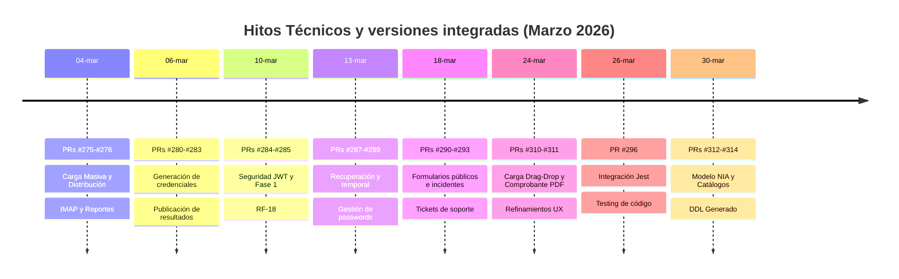
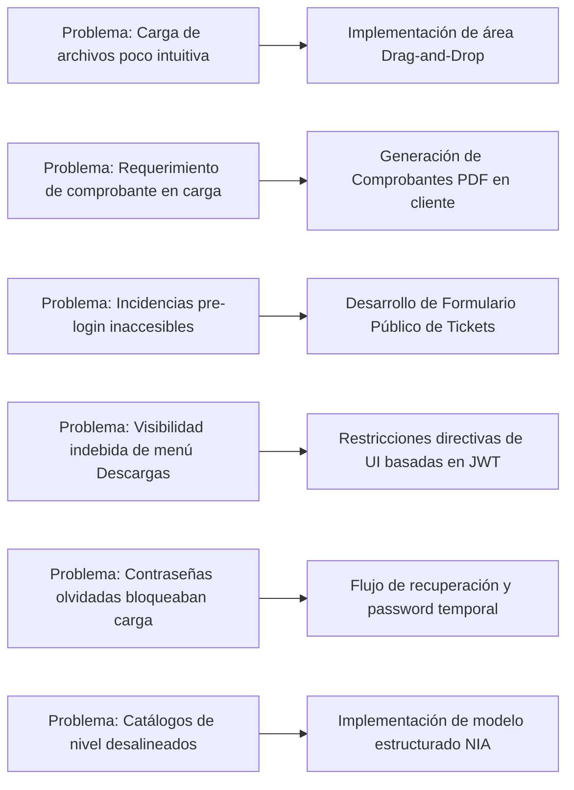

# BITÁCORA DE DESARROLLO Y SEGUIMIENTO, CON DETALLE DE TAREAS REALIZADAS POR SPRINT O MÓDULO ENTREGADO, INCLUYENDO EVIDENCIA DE COMMITS Y VERSIONES EN GITHUB, REFERENCIAS A SOLUCIÓN DE PROBLEMÁTICAS Y CAMBIOS IMPLEMENTADOS MEDIANTE PULL REQUESTS.

**Sistema:** Plataforma de Recepción, Validación y Descarga de Archivos de la Segunda Aplicación de los Ejercicios Integradores del Aprendizaje (EIA).

## 1) Propósito del entregable

Documentar de forma trazable el trabajo ejecutado durante marzo de 2026 en el proyecto SEP Evaluación Diagnóstica, incluyendo:
* Tareas realizadas por sprint/módulo.
* Evidencia de commits y versiones integradas por Pull Requests.
* Problemáticas atendidas y solución implementada.
* Cambios relevantes en Frontend, Backend GraphQL/REST y Base de Datos.

## 2) Alcance

Este documento cubre la actividad registrada en Git para el periodo 2026-03-01 a 2026-03-31, con foco en:
* Implementación de la carga masiva mediante arrastrar y soltar (Drag-and-Drop).
* Generación local de comprobantes de carga en PDF (Reportes).
* Creación del sistema de tickets de soporte técnico e incidencias públicas.
* Control de acceso basado en roles (UI dinámico) y seguridad JWT.
* Implementación de pruebas automatizadas con Jest (Gobernanza técnica).
* Alineación de catálogos oficiales NIA y scripts de la base de datos (PostgreSQL).

## 3) Resumen ejecutivo por mes

**Marzo 2026 (Usabilidad, Seguridad y Soporte Integral)**
* Se robusteció enormemente la usabilidad implementando el flujo de carga masiva Drag-and-Drop y pre-validación de formatos de archivo.
* Se habilitó la generación de comprobantes PDF en tiempo real tras la subida exitosa de los archivos de evaluación.
* Se integró completamente la seguridad basada en JSON Web Tokens (JWT) con roles restrictivos que ocultan módulos sensibles (Ej. Rol de Consulta).
* Se dio de alta el flujo de recuperación de contraseñas y acceso vía credenciales temporales.
* La base de datos y GraphQL se sincronizaron con los modelos oficiales (NIA, SIGED, DDL).
* Se establecieron mecanismos formales de calidad en el frontend a través de integraciones con Jest.

## 4) Línea de tiempo de versiones (Marzo 2026)

## 5) Bitácora por sprint/módulo

**Sprint MAR-1 (01–15 mar): Reportes, Credenciales y Seguridad JWT**

| Commit | Fecha | Cambio | Solución implementada |
| :--- | :--- | :--- | :--- |
| `b4ab2ca` | 04/03/2026 | Implementación del CU-08 Generar Reportes | Habilitación de la generación de comprobantes de plataforma. |
| `a6aea32` | 06/03/2026 | Generación de credenciales automáticas | Integración de credenciales generadas vía validaciones Excel. |
| `99c3ba0` | 10/03/2026 | Implementación de seguridad JWT (RF-18) | Refuerzo en la autenticación y control de tokens a nivel API y Frontend. |
| `1fc8263` | 13/03/2026 | Recuperación de contraseña | Creación de flujo de reinicio y contraseñas temporales (`e5e35ed`). |

**Sprint MAR-2 (16–31 mar): Soporte, Usabilidad (Drag-and-Drop) y Calidad**

| Commit | Fecha | Cambio | Solución implementada |
| :--- | :--- | :--- | :--- |
| `43c8027` | 18/03/2026 | Implementación del sistema de tickets | Formularios públicos y administración integral de soporte técnico. |
| `f4ab578` | 24/03/2026 | Carga Masiva (Drag-and-Drop) y UX/Roles | Mejora interactiva para agilizar la subida de evaluaciones EIA. |
| `249b779` | 24/03/2026 | Estabilización de generación PDF | Corrección en generación de comprobantes y manejo de errores. |
| `d3cf804` | 26/03/2026 | Integración de testing Jest y coverage | Implementación de pruebas unitarias automatizadas para código de negocio. |
| `fb9496f` | 30/03/2026 | Materializar modelo NIA y limpiar EVALUACIONES | Alineación estructural de BD con los catálogos oficiales SIGED. |

## 6) Trazabilidad de problemáticas vs solución técnica

## 7) Evidencia de cambios de BD y scripts de soporte (Marzo)

* **Generación de DDL Centralizado:** Actualización del archivo base `ddl_generated.sql` reflejando el modelo oficial para desarrollo (`ESTRUCTURA_DE_DATOS.md`).
* **Alineación de Catálogos NIA:** Consolidación de tablas legado y materialización estricta de `CAT_NIVELES_INTEGRACION` y `CAT_CAMPOS_FORMATIVOS` (EIA 2025).
* **Eliminación de IDs Hardcodeados:** Sustitución de identificadores estáticos en los resolvers mediante la implementación de la función `fn_catalogo_id`, previniendo errores de consistencia (GAP-DB-1).

## 8) Evidencia de PRs integrados (Muestra representativa)

* **PRs #284–#285 (10/03/2026):** Seguridad integral JWT y despliegue de reglas de negocio para accesos.
* **PRs #290–#293 (18/03/2026):** Desarrollo del formulario de incidentes de carga pública y tickets de soporte.
* **PRs #310–#311 (24/03/2026):** Lanzamiento de la carga optimizada Drag-and-Drop y reportes en PDF.
* **PRs #312–#314 (30/03/2026):** Estructuración de los catálogos formales y limpieza profunda en base de datos.

## 9) Matriz de módulos entregados vs estado

| Módulo | Estado Marzo 2026 | Evidencia (Commits clave) |
| :--- | :--- | :--- |
| **Carga Masiva Drag-and-Drop** | Implementado con optimizaciones UX | `f4ab578`, `625f986` |
| **Reportes y Comprobantes PDF** | Completado y generando desde UI | `b4ab2ca`, `249b779` |
| **Seguridad JWT y Control de Roles** | Activo y restringiendo interfaces a Rol 4 | `99c3ba0`, `0f70577` |
| **Soporte y Tickets Públicos** | Operando sin necesidad de login previo | `43c8027`, `adcce33` |
| **Recuperación de Contraseña** | Flujos temporales y recuperación activos | `1fc8263`, `e5e35ed` |
| **Gobernanza y Pruebas (Jest)** | Integración inicial en CI del frontend | `d3cf804` |
| **Alineación Oficial (Modelo NIA)** | Catálogos unificados, BD depurada | `fb9496f`, `f600b0a` |

## 10) Conclusiones del periodo Marzo 2026

Durante el mes de marzo, el proyecto consolidó su madurez operativa de cara al usuario final. Al proveer herramientas avanzadas de interacción (*drag-and-drop*) y brindar certeza documental instantánea (comprobantes PDF de recepción), la plataforma optimiza el tiempo de los enlaces escolares. Simultáneamente, el robustecimiento de la seguridad, la gestión unificada de tickets de soporte y la limpieza arquitectónica hacia el estándar NIA demuestran el cumplimiento efectivo de los requerimientos institucionales, asegurando escalabilidad, rendimiento y confianza en el sistema.
