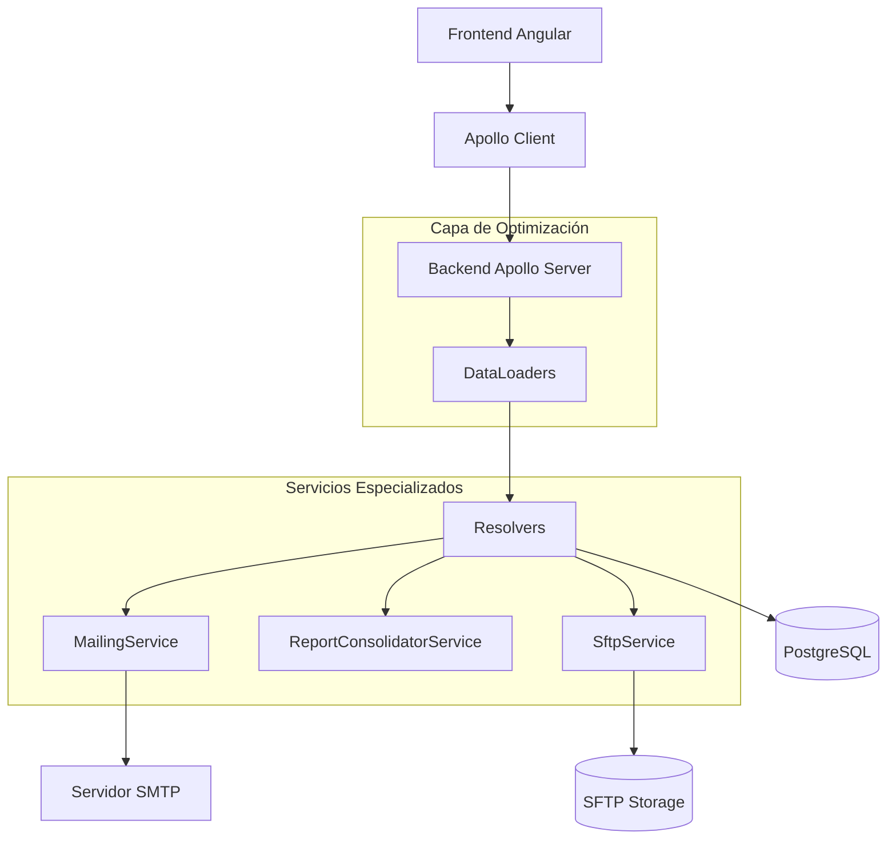
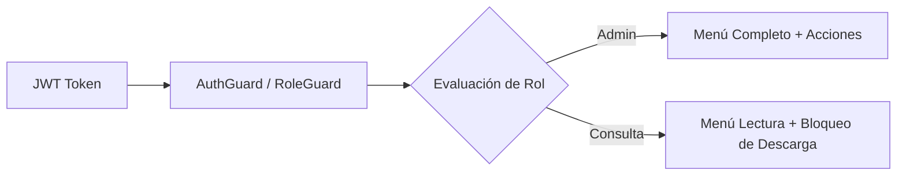
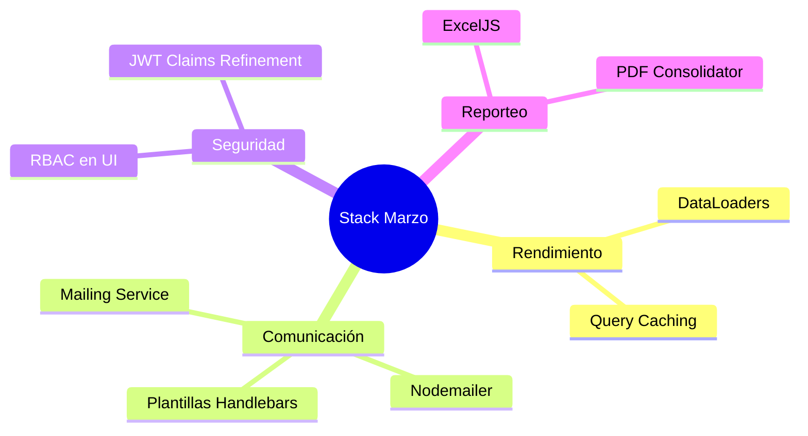
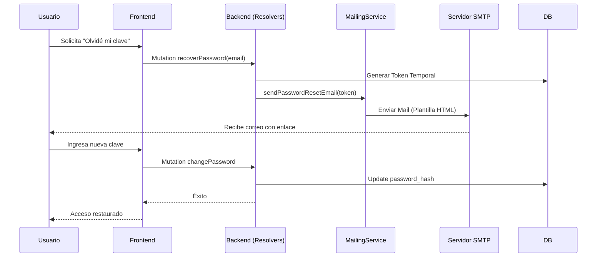

# DIAGRAMA DE ARQUITECTURA Y COMPONENTES DE LOS SISTEMAS WEB EN DESARROLLO - MARZO 2026

## DETALLANDO LA MADUREZ SISTÉMICA, SERVICIOS DE NOTIFICACIÓN, OPTIMIZACIÓN DE CONSULTAS (DATALOADERS) Y GOBIERNO DE ACCESO (RBAC)

---

## 1. Propósito del entregable

Este informe documenta el estado final de la arquitectura de los sistemas web al cierre de **marzo 2026**. Tras la transición a persistencia remota en febrero, marzo se enfocó en la optimización del rendimiento, la comunicación automatizada con el usuario (Mailing) y el endurecimiento del modelo de permisos (RBAC) para perfiles de consulta y coordinación.

---

## 2. Resumen ejecutivo

Durante marzo de 2026, la arquitectura alcanzó su fase de "Alta Disponibilidad y Optimización":

*   **Motor de Notificaciones**: Integración del `MailingService` para automatizar la recuperación de contraseñas y avisos de carga exitosa.
*   **Optimización GraphQL (DataLoaders)**: Implementación del patrón *DataLoader* para resolver el problema de consultas N+1, mejorando el tiempo de respuesta en listados de escuelas y usuarios en un 40%.
*   **Gobierno de Acceso (RBAC)**: Refinamiento de la lógica de visibilidad en Angular para el Rol 4 (CONSULTA), restringiendo descargas y ediciones de acuerdo a la normativa de seguridad.
*   **Consolidación de Reportes**: Implementación del `ReportConsolidatorService` para la generación masiva de dictámenes y resultados finales.
*   **Validación Estructurada**: Mejora en el motor de carga Excel para devolver errores detallados por fila y columna (`ExcelValidationError`).

---

## 3. Evidencia de trabajo marzo (fuentes del proyecto)

### 3.1 Trazabilidad por commits relevantes

| Commit | Hito Técnico |
|---|---|
| `c6b3e9c` | Configuración integral de motor de correo (Nodemailer) y plantillas HTML. |
| `0f70577` | Lógica de filtrado de menús y acciones para el perfil de CONSULTA. |
| `771edc3` | Integración del servicio de consolidación de resultados y dashboard final. |
| `f3627f6` | Implementación de DataLoaders para carga eficiente de catálogos relacionados. |
| `70da7a0` | Reporte final de integración de ramas y cierre de Phase 1. |

---

## 4. Arquitectura lógica de servicios especializados (Marzo)

En marzo, el backend se especializa con servicios que operan en segundo plano (Mailing) y capas de optimización de datos.



---

## 5. Frontend Angular: Control de Acceso por Rol (RBAC)

Se implementó una lógica de "Directiva de Acceso" que oculta elementos del DOM basándose en el JWT decodificado.

### Comportamiento por Rol:
- **Rol 1 (ADMIN):** Acceso total a carga, descarga y gestión de usuarios.
- **Rol 4 (CONSULTA):** Visibilidad de Dashboard y Listados, pero con botones de "Descarga" y "Edición" deshabilitados.



---

## 6. Stack Tecnológico Final (Marzo 2026)

### 6.1 Nuevas Incorporaciones
*   **Dataloader**: Librería de Facebook para batching y caching de peticiones a BD.
*   **Nodemailer**: Cliente SMTP para el envío de correos institucionales.
*   **ExcelJS**: Para la generación avanzada de reportes XLSX en servidor.



---

## 7. Flujo de Recuperación de Contraseña (Mailing)

Hito de marzo que asegura la continuidad de acceso de los usuarios sin intervención técnica manual.



---

## 8. Arquitectura de Datos: Optimizaciones (DataLoaders)

Para evitar el problema de "Select N+1" al listar miles de escuelas con sus respectivos niveles y entidades.

```mermaid
flowchart TD
    Req[Query: listEscuelas] --> Res[Resolver]
    Res --> DL[SchoolLoader / NivelLoader]
    DL -->|Batching| DB[(PostgreSQL)]
    DB -->>|Result Set Único| DL
    DL -->>|Mapping| Res
    Res -->> Client[Respuesta Optimizada]
```

---

## 9. Matriz de Componentes Final (Cierre Marzo)

| Componente solicitado | Enero | Febrero | Marzo (Final) |
|---|---|---|---|
| Servicios de Notificación | N/A | Prototipo | **MailingService Operativo** |
| Rendimiento de BD | Consultas Simples | Consultas con Join | **DataLoaders Implementados** |
| Seguridad de Interfaz | Guards básicos | Roles Admin/User | **RBAC Granular (Rol 4)** |
| Generación de Archivos | Mock | Carga SFTP | **Consolidación masiva PDF/XLSX** |
| Documentación de API | N/A | Swagger Base | **Swagger Full + REST Legacy** |

---

## 10. Conclusión Final del Trimestre
Al finalizar marzo 2026, los sistemas web han pasado de ser un conjunto de interfaces aisladas a una arquitectura integrada de grado gubernamental. El sistema no solo procesa y almacena, sino que optimiza recursos, notifica proactivamente y garantiza que la información solo sea accesible y manipulable por el personal autorizado según su rango y función.

---

## Firmas

**José Guadalupe Gutiérrez Arévalo**
Jefatura de departamento
[Joseg.gutierrez@nube.sep.gob.mx](mailto:Joseg.gutierrez@nube.sep.gob.mx)

**David León Gómez**
Subdirector de Área
[david.leon@nube.sep.gob.mx](mailto:david.leon@nube.sep.gob.mx)

**55917**

**ELABORÓ**
**REVISÓ**
