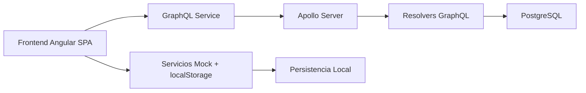
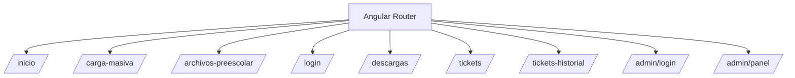
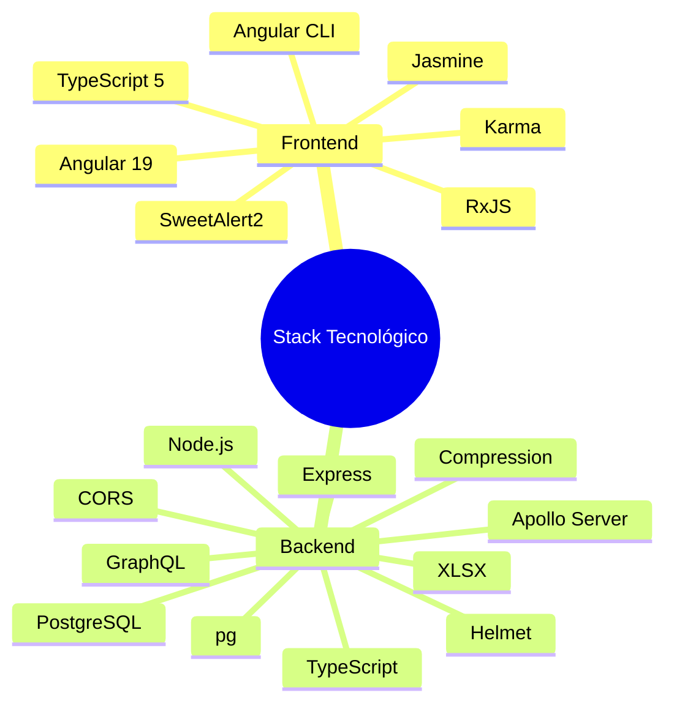
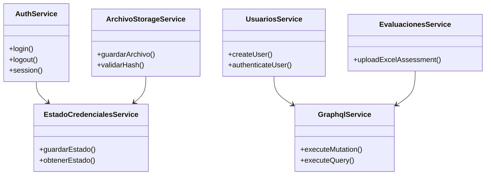
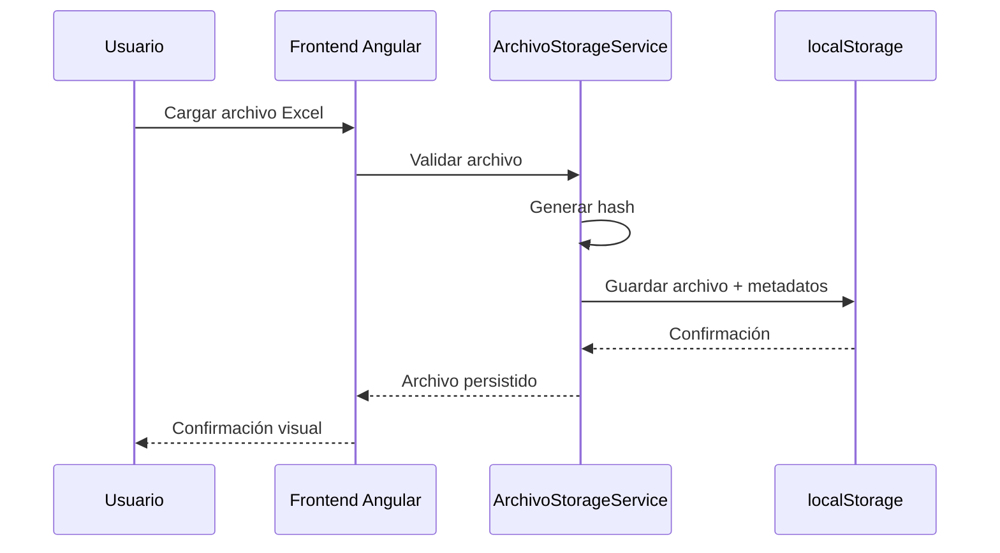
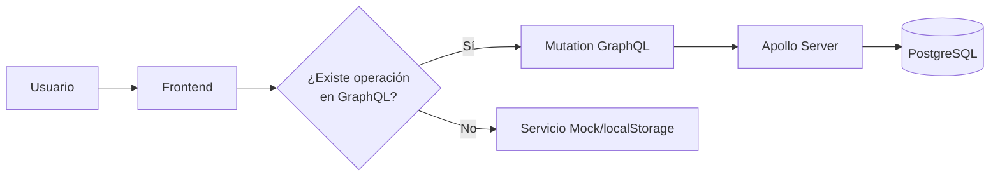
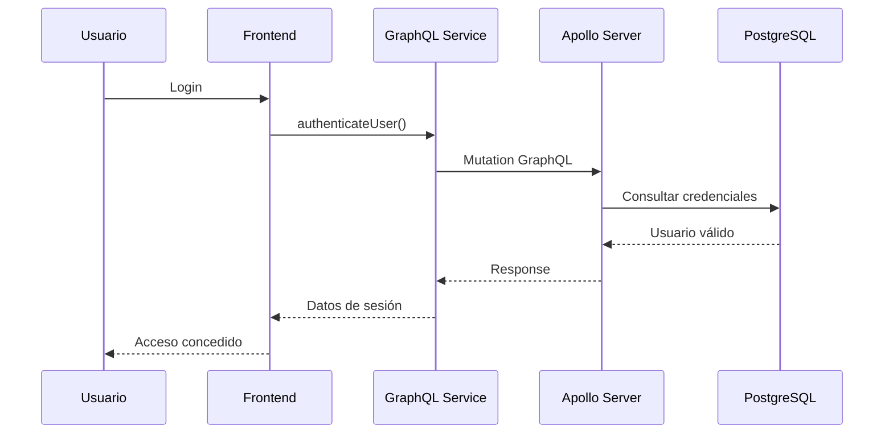
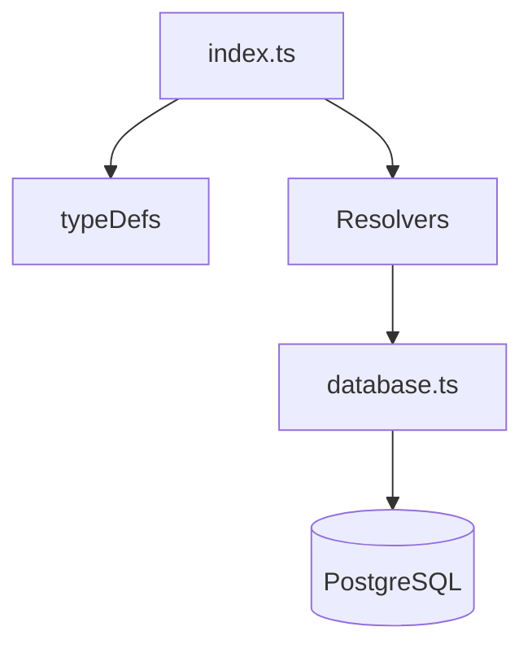
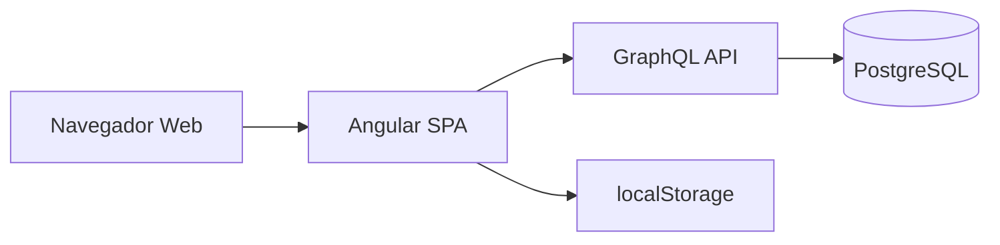

# DIAGRAMA DE ARQUITECTURA Y COMPONENTES DE LOS SISTEMAS WEB EN DESARROLLO

## DETALLANDO LA ESTRUCTURA LÓGICA Y TECNOLÓGICA, INCLUYENDO MÓDULOS DE ANGULAR, LIBRERÍAS COMPLEMENTARIAS, SERVICIOS API, CONEXIONES GRAPHQL Y OTROS FRAMEWORKS

---

## 1. Propósito del entregable

Este informe documenta el análisis de arquitectura Frontend de sistemas web orientados al Sector Educativo y presenta el diagrama de arquitectura y componentes solicitado: estructura lógica/tecnológica, módulos de Angular, librerías complementarias, servicios API, conexiones GraphQL y frameworks involucrados.

En el mes de enero, el comportamiento funcional se sostuvo principalmente con `localStorage` y servicios mock; pero también se consolidó la preparación e integración GraphQL para autenticación y carga.

---

## 2. Resumen ejecutivo

### Principios de Enero (foco frontend + simulación local)

* Consolidación del frontend Angular y flujo de carga masiva.
* Validación de plantillas Excel en cliente.
* Generación y control de credenciales locales.
* Persistencia con `localStorage` (archivos, sesión, estado de credenciales).
* Gestión de duplicados por hash y reglas de negocio de primera carga.

### Finales de Enero (foco integración + madurez funcional)

* Reorganización de navegación y módulos de usuario/admin.
* Fortalecimiento de soporte (tickets, historial, seguimiento).
* Ajustes de UX/validaciones de carga.
* Integración progresiva con GraphQL para operaciones de usuario y carga de Excel.
* Backend GraphQL operativo con PostgreSQL para autenticar, crear usuario y procesar cargas.

---

## 3. Evidencia de trabajo enero (fuentes del proyecto)

### 3.1 Bitácora del proyecto

* La bitácora documenta explícitamente avances de enero 2026 con foco en autenticación, carga masiva, validación y almacenamiento local.
* También refleja avances con correcciones, consolidación funcional y lineamientos de negocio.

### 3.2 Trazabilidad por commits

En enero aparecen hitos de integración GraphQL y ajuste funcional, por ejemplo:

* `Agregar autenticación GraphQL para login`
* `Integrar CreateUser en carga masiva`
* `Ajustar endpoint GraphQL en frontend`
* `Usar updated_at en autenticacion`

---

## 4. Arquitectura lógica y tecnológica del sistema

Este flujo resume cómo conviven dos modos de operación en el periodo reportado:

* Persistencia local y servicios simulados para continuidad funcional del frontend.
* Integración progresiva con GraphQL hasta llegar a Apollo + PostgreSQL para operaciones reales.

---

## 5. Frontend Angular: módulos/páginas implementadas

### Rutas funcionales

* `/inicio`
* `/carga-masiva`
* `/archivos-preescolar`
* `/login`
* `/descargas`
* `/tickets`
* `/tickets-historial`
* `/admin/login`
* `/admin/panel`

Este mapa de componentes muestra el enrutador como eje central de navegación y la distribución de páginas funcionales del sistema.

---

## 6. Librerías y frameworks utilizados

### 6.1 Frontend

* Angular 19 (`@angular/core`, `router`, `forms`, etc.)
* RxJS para flujos reactivos
* SweetAlert2 para alertas y confirmaciones UX
* TypeScript 5
* Angular CLI
* Karma
* Jasmine

### 6.2 Backend/API

* Node.js + TypeScript
* Apollo Server + GraphQL
* Express
* CORS
* Helmet
* Compression
* PostgreSQL con `pg`
* XLSX para parseo de archivos

---

## 7. Arquitectura de servicios frontend

Separación por responsabilidades en servicios Angular:

* autenticación
* almacenamiento local
* estado de credenciales
* consumo GraphQL

---

## 8. Operación basada en localStorage (sin dependencia real de API)

Arquitectura offline-first para permitir continuidad sin depender del backend.

* `AuthService`
* `ArchivoStorageService`
* `EstadoCredencialesService`
* `AdminAuthService`

---

## 9. Transición a integración GraphQL

A finales de enero se activa integración real por capas.

* `GraphqlService`
* `UsuariosService`
* `EvaluacionesService`

### 9.1 Autenticación real vía GraphQL

---

## 10. Backend GraphQL y componentes

---

## 11. Diagrama de despliegue técnico

---

## 12. Matriz de componentes

| Componente solicitado      | Principio Enero       | Final Enero               | Evidencia técnica                                    |
| -------------------------- | --------------------- | ------------------------- | ---------------------------------------------------- |
| Estructura lógica frontend | Implementada          | Consolidada               | Router + componentes                                 |
| Módulos Angular / páginas  | Implementados         | Ajustados UX / navegación | rutas activas                                        |
| Librerías complementarias  | Integradas            | Estables                  | Angular / RxJS / SweetAlert2                         |
| Servicios API (frontend)   | Simulados             | Híbrido mock + real       | GraphqlService, UsuariosService, EvaluacionesService |
| Conexión GraphQL           | Parcial / preparación | Operativa en flujos clave | mutations de usuarios / carga                        |
| Otros frameworks (backend) | En preparación        | Operativos                | Express + Apollo + PostgreSQL                        |

---

## 13. Conclusión

1. Sí se cumplió el análisis y evolución de arquitectura frontend.
2. Sí se avanzó en el entregable de diagrama y componentes.
3. En enero predominó la simulación controlada y se materializó la transición a integración real GraphQL.

---

## Firmas

**José Guadalupe Gutiérrez Arévalo**
Jefatura de departamento
[joseg.gutierrez@nube.sep.gob.mx](mailto:joseg.gutierrez@nube.sep.gob.mx)

**David León Gómez**
Subdirector de Área
[david.leon@nube.sep.gob.mx](mailto:david.leon@nube.sep.gob.mx)

**55917**

**ELABORÓ**
**REVISÓ**
