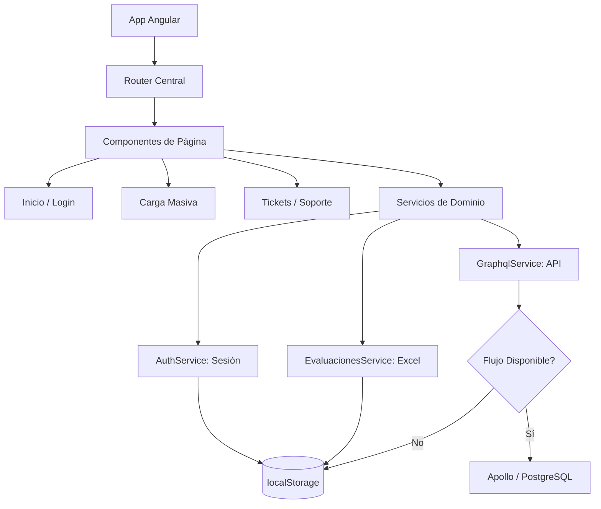
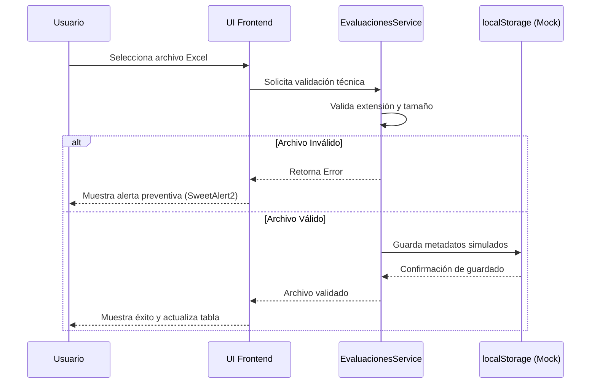

# INFORME DE ESTÁNDARES Y CRITERIOS TÉCNICOS DE DESARROLLO FRONTEND

**Sistema:** Plataforma de Recepción, Validación y Descarga de Archivos de la Segunda Aplicación de los Ejercicios Integradores del Aprendizaje (EIA).

## 1. Propósito del entregable
Este documento define los lineamientos, validaciones técnicas y acciones correctivas aplicadas al desarrollo frontend durante el periodo de enero 2026. El objetivo es asegurar la calidad del código, la trazabilidad de los cambios en GitHub y el cumplimiento de los objetivos funcionales del Sector Educativo.

## 2. Resumen Ejecutivo
Durante el mes de enero, el desarrollo frontend se rigió por estándares de alta disponibilidad y desacoplamiento. Se implementó una estrategia de **"Simulación Controlada"** (Mocks y localStorage) para garantizar el avance de las interfaces de usuario mientras se consolidaba la capa de servicios GraphQL.

**Hitos de Enero:**
* Implementación de arquitectura SPA con Angular 19.
* Estandarización de rutas y guardas de seguridad.
* Validación técnica de archivos Excel en el cliente (Frontend).
* Transición exitosa de servicios simulados a integración real con GraphQL.

## 3. Arquitectura de Componentes Frontend
Este diagrama muestra la vista lógica de los componentes desarrollados durante enero, destacando la interacción entre la navegación, los servicios de dominio y la capa de persistencia simulada provisional.

**Descripción del Diagrama:** Se ilustra la división modular de la aplicación en Angular. El *Router Central* distribuye a tres páginas principales. El flujo de datos recae en servicios que, ante la indisponibilidad temporal del backend completo (GraphQL), desviaban el tráfico hacia un almacenamiento local (`localStorage`) para no bloquear el progreso de la UI.

## 4. Lineamientos Establecidos

| Criterio Técnico | Estándar Implementado | Evidencia en Enero 2026 |
| :--- | :--- | :--- |
| **Framework Base** | Angular 19 + TypeScript 5 | Uso de Standalone Components y RxJS |
| **Estilo y UX** | SweetAlert2 para feedback | Alertas consistentes en carga y login |
| **Control de Versiones** | Convención de Pull Requests | Registro de PRs #124 a #213 |
| **Gestión de Estado** | LocalStorage + Inyectables | Persistencia de sesión y hash de archivos simulados |
| **Consumo de API** | Cliente GraphQL (Apollo) | Integración inicial de mutaciones y queries |

## 5. Validaciones Realizadas

Durante este periodo, se ejecutaron validaciones técnicas centradas en asegurar la robustez de la interfaz antes de la disponibilidad completa del backend:

* **Validación en Cliente (Archivos):** Verificación de extensión de archivos Excel (.xls, .xlsx) y tamaño máximo permitido directamente en el navegador.
* **Seguridad de Rutas:** Implementación de guardas en Angular (Route Guards) para prevenir el acceso no autorizado a vistas internas.

**Descripción del Diagrama:** El siguiente diagrama de secuencia ilustra el flujo de validación técnica de archivos Excel en el cliente. Muestra cómo el sistema intercepta errores antes de intentar la persistencia (en este caso simulada en `localStorage`), optimizando la experiencia del usuario y reduciendo la carga futura al servidor.

## 6. Observaciones Técnicas y Acciones Correctivas Implementadas

| Observación Técnica (Problema Detectado) | Acción Correctiva Implementada | Estado |
| :--- | :--- | :--- |
| Inconsistencia de campos entre Frontend y las definiciones de Base de Datos. | Ajuste y alineación de interfaces en `UsuariosService` para coincidir con el esquema. | Solucionado |
| Falta de retroalimentación o prevención al intentar subir archivos sin selección previa. | Implementación de alertas preventivas en la UI bloqueando la carga en vacío. | Solucionado |
| Exposición de rutas internas (carga masiva, tickets) sin sesión activa. | Inclusión de guardas de seguridad en el Router y ocultamiento condicional de links. | Solucionado |

## 7. Evidencia de Verificación de Cumplimiento

Las correcciones e implementaciones fueron integradas y revisadas en el repositorio a través de los siguientes commits representativos:

* **Commit `e418a4f`:** Evidencia del ajuste de interfaces en UsuariosService.
* **Commit `7f90015`:** Evidencia de alertas preventivas al subir archivos sin selección.
* **Commit `9730812`:** Evidencia de inclusión de guardas de seguridad en rutas y control de links.

## 8. Conclusión
El desarrollo frontend durante enero de 2026 cumplió con los criterios de calidad y trazabilidad exigidos. La adopción de una arquitectura híbrida (con mocks locales) permitió la continuidad operativa del equipo de diseño e interfaz, logrando sentar las bases para la transición transparente hacia los servicios finales que se integrarán en el mes siguiente.
