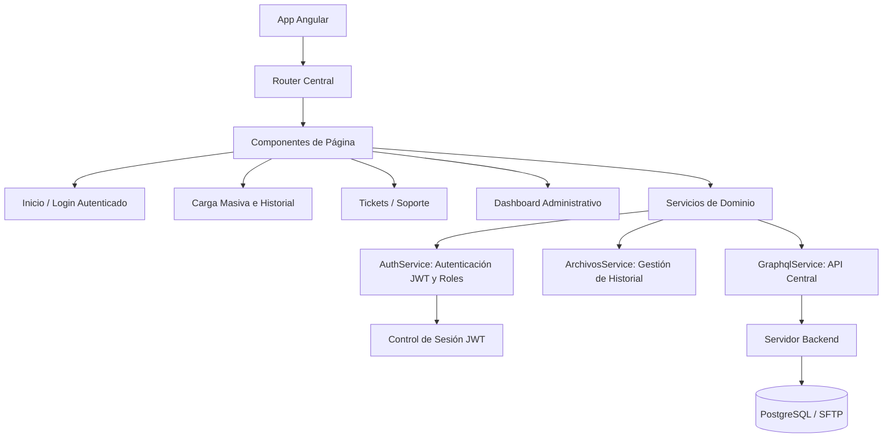
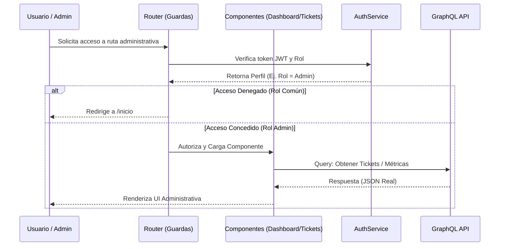

# INFORME DE ESTÁNDARES Y CRITERIOS TÉCNICOS DE DESARROLLO FRONTEND

**Sistema:** Plataforma de Recepción, Validación y Descarga de Archivos de la Segunda Aplicación de los Ejercicios Integradores del Aprendizaje (EIA).

## 1. Propósito del entregable
Este documento define los lineamientos, validaciones técnicas y acciones correctivas aplicadas al desarrollo frontend durante el periodo de febrero 2026. El objetivo es asegurar la calidad del código, la trazabilidad de los cambios en GitHub y el cumplimiento de los objetivos funcionales del Sector Educativo, consolidando la integración con los servicios de backend y estableciendo paneles de control administrativo.

## 2. Resumen Ejecutivo
Durante el mes de febrero, el desarrollo frontend se enfocó en la integración definitiva con el backend, la migración de persistencia local a un modelo de cliente-servidor real y la creación del módulo de administración. Se logró la transición exitosa de `localStorage` a almacenamiento centralizado, se implementó un Dashboard Administrativo con métricas en tiempo real y se estabilizaron los flujos de inicio de sesión y gestión de tickets de soporte.

**Hitos de Febrero:**
* Implementación del Dashboard Administrativo con métricas reales y reconocimiento de roles (Administrador, Enlace, etc.).
* Migración de persistencia simulada a comunicación centralizada (GraphQL/SFTP) en el Frontend.
* Corrección y estabilización en la visibilidad de tickets de soporte técnico, diferenciando vistas de usuario y administrador.
* Gestión de errores en el historial de carga masiva y aplicación de gobernanza de proyecto (CI/CD, Husky).

## 3. Arquitectura de Componentes Frontend
Este diagrama muestra la evolución de la vista lógica en febrero, destacando la interacción entre la navegación, el nuevo panel administrativo y la comunicación directa con la API GraphQL, eliminando la dependencia de mocks locales.

**Descripción del Diagrama:** Se ilustra la transición hacia un ecosistema plenamente integrado. El frontend ahora consume `GraphqlService` para comunicarse con el servidor backend real, incorporando módulos avanzados como el Dashboard Administrativo y la autenticación mediante JWT (JSON Web Tokens).

## 4. Lineamientos Establecidos

| Criterio Técnico | Estándar Implementado | Evidencia en Febrero 2026 |
| :--- | :--- | :--- |
| **Framework Base** | Angular 19 + TypeScript 5 | Tipado estricto en roles y métricas administrativas |
| **Estilo y UX** | Mejoras de UI y Consistencia | Rediseño de componentes para panel de administración y tickets |
| **Control de Versiones** | Convención de Commits | Commits semánticos y estructurados (feat, fix, chore) |
| **Gestión de Estado** | Servicios Injectables y API | Transición de LocalStorage hacia la API (GraphQL) |
| **Métricas y Monitoreo** | Dashboard Dinámico | Mapeo de información desde DB para gráficas en UI |

## 5. Validaciones Realizadas

Durante este periodo se ejecutaron pruebas clave para asegurar la integridad operativa del frontend:
* **Pruebas de Integración con Backend:** Validación de la migración de datos locales a respuestas reales de la API GraphQL.
* **Pruebas de Roles de Usuario:** Verificación de acceso y permisos visuales en el sistema para perfiles Administrador, Enlace y regulares.
* **Pruebas de Carga de Archivos:** Verificación del comportamiento del historial de carga frente a fallos y recuperación del proceso (SFTP).
* **Pruebas de Build y Despliegue:** Validación de la gobernanza del proyecto mediante integración continua y pre-commits.

**Descripción del Diagrama:** El diagrama secuencial muestra el flujo de validación y renderizado condicional basado en roles implementado en febrero. Este flujo previene que usuarios comunes visualicen tickets o paneles destinados exclusivamente al perfil administrativo, protegiendo la información y asegurando la correcta asignación de responsabilidades.

## 6. Observaciones Técnicas y Acciones Correctivas Implementadas

| Observación Técnica (Problema Detectado) | Acción Correctiva Implementada | Estado |
| :--- | :--- | :--- |
| Visibilidad incorrecta de tickets para distintos roles; administradores veían tickets públicos inadecuadamente. | Ajuste de componentes UI y aplicación de reglas de filtrado para roles administradores. | Solucionado |
| Errores de Build en Angular por falta de estandarización en el equipo. | Implementación de CI/CD, configuración de Husky para hooks pre-commit y remediación de errores de build. | Solucionado |
| Inconsistencias en login de usuario y consulta de Centros de Trabajo (CCT). | Refactorización y corrección en los flujos de inicio de sesión coordinados entre frontend y backend. | Solucionado |
| Persistencia volátil y pérdida de estado en el historial de carga masiva. | Gestión avanzada de errores y centralización de la persistencia de los archivos en el servidor SFTP. | Solucionado |

## 7. Evidencia de Verificación de Cumplimiento

Las correcciones y evoluciones arquitectónicas fueron verificadas e integradas al repositorio principal bajo los siguientes registros de control de versiones (commits):

* **Commit `1ac7f01`:** Evidencia de la corrección de visibilidad de tickets y mejoras en UI.
* **Commit `50c6563`:** Evidencia de la remediación de build y estabilización (Gobernanza).
* **Commit `9fd3334`:** Evidencia de la corrección en los flujos de login y consulta de CCT.
* **Commit `ad59618`:** Evidencia de la gestión del historial de carga masiva y migración de persistencia.
* **Commit `01ce65e`:** Evidencia de la implementación del Dashboard Administrativo con métricas.
* **Commit `0f499f6`:** Evidencia de remediación y plan de estabilización con configuración Husky.

## 8. Conclusión
El desarrollo frontend durante febrero de 2026 cumplió con los estándares de consolidación del sistema. La transición del almacenamiento local a una integración robusta con los servicios de backend y la creación de un panel administrativo funcional permitieron que la plataforma madurara operativamente. Los esfuerzos de estabilización de código y gobernanza garantizan que el proyecto esté preparado para su evolución a escenarios en producción.
