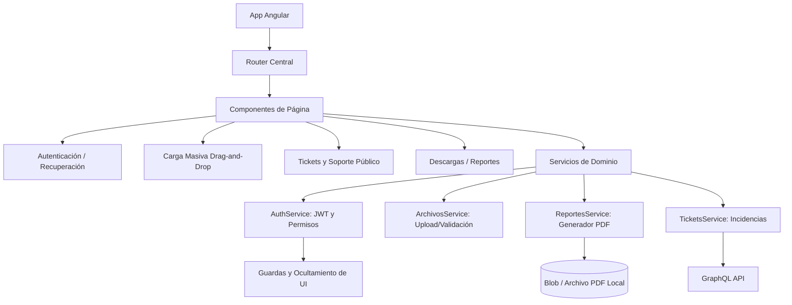
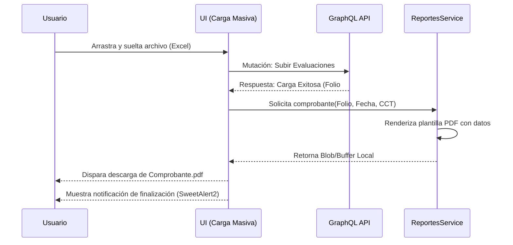

# INFORME DE ESTÁNDARES Y CRITERIOS TÉCNICOS DE DESARROLLO FRONTEND

**Sistema:** Plataforma de Recepción, Validación y Descarga de Archivos de la Segunda Aplicación de los Ejercicios Integradores del Aprendizaje (EIA).

## 1. Propósito del entregable
Este documento define los lineamientos, validaciones técnicas y acciones correctivas aplicadas al desarrollo frontend durante el periodo de marzo 2026. El objetivo principal es documentar la implementación de flujos avanzados de interfaz, tales como la carga masiva intuitiva (drag-and-drop), el sistema integral de soporte (tickets), la generación de comprobantes PDF en cliente y la consolidación de la seguridad mediante autenticación JWT y control de acceso visual basado en roles.

## 2. Resumen Ejecutivo
Durante el mes de marzo, el equipo frontend se enfocó en proveer herramientas de autogestión y soporte al usuario final, integrando la generación de documentos PDF comprobatorios y perfeccionando la experiencia de carga de archivos. Se incorporaron restricciones dinámicas de navegación para perfiles específicos (ej. Rol "CONSULTA") y se establecieron pruebas automatizadas con Jest, además de refinar los catálogos y formularios de registro e incidencias públicas.

**Hitos de Marzo:**
* Implementación de interfaz de Carga Masiva optimizada con soporte *Drag-and-Drop* y validaciones previas de formato.
* Generación de comprobantes de carga en formato PDF directamente desde el navegador (cliente).
* Integración del sistema completo de tickets de soporte técnico e incidencias públicas (sin sesión).
* Control dinámico de la Interfaz de Usuario (UI) basado en roles, garantizando el ocultamiento de menús para roles restrictivos (Rol Consulta/Rol 4).
* Integración de recuperación de contraseñas y acceso seguro mediante credenciales temporales.

## 3. Arquitectura de Componentes Frontend

Este diagrama expone la arquitectura ampliada empleada durante marzo, enfatizando los nuevos módulos de reportes (generación PDF) y el flujo del sistema de incidencias.

**Descripción del Diagrama:** Se ilustra la relación del `Router Central` con los nuevos módulos introducidos en marzo. Destaca la inclusión de `ReportesService` para la generación de PDFs del lado del cliente, la persistencia local de ese documento, y el módulo `TicketsService` que procesa tanto incidentes internos autenticados como públicos.

## 4. Lineamientos Establecidos

| Criterio Técnico | Estándar Implementado | Evidencia en Marzo 2026 |
| :--- | :--- | :--- |
| **Generación de Documentos** | PDFMake / jsPDF | Generación de comprobantes de carga directamente en el cliente |
| **Control de Acceso UI** | Directivas estructurales (*ngIf) basadas en JWT | Ocultamiento del menú "Descargas" para Rol Consulta |
| **Experiencia de Usuario** | Eventos nativos HTML5 para Drag-and-Drop | Área interactiva para arrastrar y soltar archivos de evaluación |
| **Calidad de Código** | Pruebas Unitarias con Jest | Configuración inicial e integración de tests (CI) |
| **Estilo y Consistencia** | TailwindCSS + SCSS Modulares | Rediseño y estandarización visual de formularios (CCT, Tickets) |

## 5. Validaciones Realizadas

Durante marzo se ejecutaron validaciones intensivas centradas en la interacción del usuario y la respuesta de la interfaz frente a casos de borde:
* **Pruebas de Funcionalidad Drag-and-Drop:** Verificación de la respuesta visual y técnica de la UI al arrastrar archivos válidos y formatos no soportados.
* **Validación de Reglas de CCT:** Comprobación de que la longitud y estructura de la Clave de Centro de Trabajo se evaluara en el formulario antes de enviarse al servidor.
* **Pruebas de Restricción Visual (Roles):** Confirmación de que el Rol de Consulta (Rol 4) no tuviera inyectado en el DOM ningún enlace a vistas de descarga o modificación.
* **Validación de Generación PDF:** Comprobación de la estructura, logotipos y datos dinámicos inyectados correctamente en los recibos emitidos tras una carga exitosa.

**Descripción del Diagrama:** El diagrama de secuencia expone el ciclo de vida de la generación de un comprobante PDF. Demuestra cómo el frontend recibe la confirmación de éxito desde la API, inyecta los datos de respuesta en el generador de reportes local, y fuerza la descarga de un archivo binario directamente al navegador del usuario, optimizando el ancho de banda y ofreciendo inmediatez.

## 6. Observaciones Técnicas y Acciones Correctivas Implementadas

| Observación Técnica (Problema Detectado) | Acción Correctiva Implementada | Estado |
| :--- | :--- | :--- |
| Usuarios del perfil Consulta (Rol 4) tenían acceso visual y estructural al menú de "Descargas". | Implementación de validación dinámica en componentes de navegación para destruir el menú (*ngIf) según el JWT. | Solucionado |
| Inconsistencias y cuelgues ocasionales durante la generación de recibos PDF al subir múltiples archivos. | Estabilización del flujo de comprobantes PDF y adición de manejo asíncrono de errores. | Solucionado |
| El flujo de subida tradicional requería demasiadas interacciones y era poco intuitivo. | Optimización total de la carga masiva incorporando zona interactiva *Drag-and-Drop* y validaciones previas de formato. | Solucionado |
| Los formularios de soporte técnico exigían iniciar sesión, bloqueando reportes de fallos de login. | Implementación de formularios de incidencias públicos independientes y ajuste de mapeos de estatus de tickets. | Solucionado |

## 7. Evidencia de Verificación de Cumplimiento

Las correcciones y evoluciones funcionales fueron revisadas, estabilizadas e integradas a la rama principal bajo los siguientes registros de control de versiones:

* **Commit `f4ab578`:** Evidencia de la implementación de la nueva funcionalidad de carga masiva Drag-and-Drop.
* **Commit `249b779`:** Evidencia de la estabilización y validación técnica en la generación de comprobantes PDF.
* **Commit `0f70577`:** Evidencia de las modificaciones de estilo y ocultamiento del menú de usuario para el Rol 4 (Consulta).
* **Commit `adcce33`:** Evidencia de corrección del mapeo en el estatus de los tickets y soporte público.
* **Commit `99c3ba0`:** Evidencia de implementación de seguridad estricta basada en JWT.
* **Commit `d3cf804`:** Evidencia de la integración de pruebas automatizadas y cobertura usando Jest.

## 8. Conclusión
El mes de marzo marcó un avance sustancial en la usabilidad e interacción de la plataforma. La inclusión de la experiencia *drag-and-drop*, la generación local de recibos PDF y el pulido exhaustivo en las restricciones visuales para los distintos roles demostró un enfoque profundo en el confort del usuario final. Asimismo, la introducción de pruebas formales con Jest y validaciones estrictas en formularios consolida un producto altamente resiliente, seguro y adaptado al volumen de operación requerido por la Secretaría.
