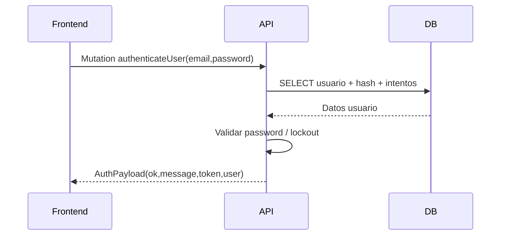
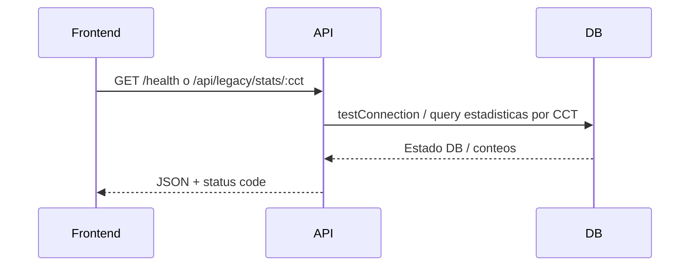
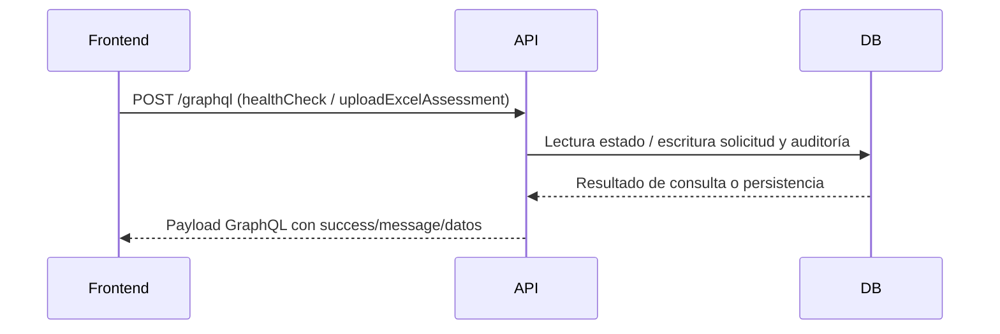

# REPORTE DE PRUEBAS CON RESULTADOS DE PRUEBA FUNCIONAL Y CORRECCIÓN DE INCIDENCIAS DETECTADAS, UTILIZANDO POSTMAN DE ENDPOINTS, APIS Y CONSULTAS GRAPHQL

# Sistema Plataforma de Recepción, Validación y Descarga de Archivos de la Segunda Aplicación de los Ejercicios Integradores del Aprendizaje (EIA).

## 1) Introducción y Resumen Ejecutivo

### 1.1 Objetivo del entregable
El presente documento tiene como objetivo formalizar la validación funcional de los componentes del sistema desarrollados y ajustados durante el periodo de **enero 2026**. Se busca asegurar que las interfaces de programación (APIs REST y GraphQL) cumplan con los requerimientos operativos, de seguridad y de negocio mediante la ejecución de pruebas técnicas en **Postman**, documentando tanto el éxito de las operaciones como la subsanación de incidencias detectadas en el código fuente.

### 1.2 Resumen Ejecutivo
Durante el mes de enero de 2026, el esfuerzo técnico se centró en la consolidación del servidor GraphQL, la seguridad en la gestión de usuarios y la implementación de la lógica principal para la carga masiva de evaluaciones (Excel EIA2). 

Este reporte consolida:
- **Validación de 6 escenarios críticos:** Incluyendo autenticación robusta, mutaciones de datos y consultas de salud del sistema.
*   **Trazabilidad técnica:** Vinculación directa entre las pruebas funcionales y los cambios en el repositorio (Commits).
- **Control de calidad:** Registro de correcciones aplicadas a riesgos detectados en la fase inicial del desarrollo.

El resultado de este ejercicio permite garantizar una base tecnológica estable para las siguientes fases de implementación y despliegue del sistema de Evaluación Diagnóstica.

---


## 2) Control documental

- **Periodo de evidencia permitido:** 2026-01-01 a 2026-01-31 (inclusive).
- **Exclusiones aplicadas:** febrero 2026 y marzo 2026 excluidos completamente.
- **Naturaleza del presente documento:** plan/plantilla ejecutable para registrar resultados **reales** en Postman sin fabricar evidencias.
- **Estado de resultados en este entregable:** **pendiente de ejecución real** (se dejan espacios formales para capturas y salida JSON real).

---

## 3) Alcance técnico validado en repositorio (enero 2026)

Se confirmaron componentes que permiten cubrir los escenarios obligatorios solicitados:

1. **Autenticación / login (GraphQL)** mediante `authenticateUser`.
2. **Creación de usuario (GraphQL mutation)** mediante `createUser`.
3. **Consulta GraphQL (query)** mediante `healthCheck`.
4. **Operación principal del sistema (GraphQL mutation)** mediante `uploadExcelAssessment` (carga de archivo Excel en Base64).
5. **Caso de error**: credenciales inválidas y bloqueo por intentos fallidos (flujo de autenticación).
6. **Endpoint REST (si aplica)**: `GET /health` y endpoint legado `GET /api/legacy/stats/:cct`.

---

## 4) Evidencia contractual acotada a enero 2026

### 4.1 Commits relevantes identificados (únicamente enero)

| Commit | Fecha (YYYY-MM-DD) | Evidencia resumida | Relación con pruebas |
|---|---:|---|---|
| `d7fa6f5` | 2026-01-19 | Implementación base del servidor GraphQL con conexión PostgreSQL y gestión de usuarios. | Habilita endpoint GraphQL y operaciones núcleo. |
| `852915a` | 2026-01-28 | Requerir password y guardar hash al crear usuario. | Impacta prueba de creación de usuario y seguridad. |
| `c4c1156` | 2026-01-28 | Uso de `updated_at` en autenticación. | Impacta prueba de login y trazabilidad de último acceso. |

> Nota contractual: esta sección se construyó filtrando únicamente el rango del **01 al 31 de enero de 2026** en el historial Git.

---

## 5) Parámetros para ejecución real en Postman

### 5.1 Variables recomendadas de ambiente

- `baseUrl` = `http://localhost:4000`
- `graphqlUrl` = `{{baseUrl}}/graphql`
- `legacyApiUrl` = `{{baseUrl}}/api/legacy`
- `email_admin` = correo de usuario con permisos para crear usuarios
- `password_admin` = contraseña del usuario administrador
- `email_test` = correo de usuario a crear/probar
- `password_test` = contraseña de prueba
- `token` = JWT devuelto por `authenticateUser`

### 5.2 Reglas de registro de evidencia real

- Para cada prueba, registrar en Postman:
  - Request completo (método, URL, headers).
  - Body (JSON o query GraphQL).
  - Response JSON completo.
  - Status code real.
- Guardar fecha/hora de ejecución real y ejecutor.
- No sustituir valores reales por resultados simulados en sección de resultados.

---

## 6) Matriz mínima de pruebas funcionales (ejecutable en Postman)

## PF-01 — Autenticación/login (GraphQL)

- **Objetivo:** validar inicio de sesión y emisión de token.
- **Método/URL:** `POST {{graphqlUrl}}`
- **Headers:** `Content-Type: application/json`
- **Body (raw JSON):**

```json
{
  "query": "mutation Authenticate($input: AuthenticateUserInput!) { authenticateUser(input: $input) { ok message token user { id email rol fechaUltimoAcceso } } }",
  "variables": {
    "input": {
      "email": "{{email_admin}}",
      "password": "{{password_admin}}"
    }
  }
}
```

- **Validaciones esperadas (sin inventar resultados):**
  - HTTP 200.
  - `data.authenticateUser.ok` = `true`.
  - `data.authenticateUser.token` no vacío.

[ESPACIO PARA EVIDENCIA VISUAL]
Tipo sugerido: captura de Postman
Descripción: qué se debe mostrar (request + response)
Ubicación sugerida: endpoint o mutation

---

## PF-02 — Creación de usuario (GraphQL mutation)

- **Objetivo:** validar alta de usuario con contraseña y hash persistido por backend.
- **Precondición:** sesión con rol habilitado para administración.
- **Método/URL:** `POST {{graphqlUrl}}`
- **Headers:**
  - `Content-Type: application/json`
  - `Authorization: Bearer {{token}}`
- **Body (raw JSON):**

```json
{
  "query": "mutation CreateUser($input: CreateUserInput!) { createUser(input: $input) { id email nombre apepaterno apematerno rol activo fechaRegistro } }",
  "variables": {
    "input": {
      "email": "{{email_test}}",
      "nombre": "Usuario",
      "apepaterno": "Prueba",
      "apematerno": "Enero",
      "rol": "CONSULTA",
      "password": "{{password_test}}",
      "clavesCCT": []
    }
  }
}
```

- **Validaciones esperadas (sin inventar resultados):**
  - HTTP 200.
  - objeto `data.createUser` con `id` y `email`.
  - ante email duplicado, mensaje de error de negocio.

[ESPACIO PARA EVIDENCIA VISUAL]
Tipo sugerido: captura de Postman
Descripción: qué se debe mostrar (request + response)
Ubicación sugerida: endpoint o mutation

---

## PF-03 — Consulta GraphQL (query)

- **Objetivo:** validar disponibilidad de backend GraphQL.
- **Método/URL:** `POST {{graphqlUrl}}`
- **Headers:** `Content-Type: application/json`
- **Body (raw JSON):**

```json
{
  "query": "query { healthCheck { status timestamp database { connected latency } version } }"
}
```

- **Validaciones esperadas (sin inventar resultados):**
  - HTTP 200.
  - `data.healthCheck.status` informado.
  - `data.healthCheck.database.connected` informado.

[ESPACIO PARA EVIDENCIA VISUAL]
Tipo sugerido: captura de Postman
Descripción: qué se debe mostrar (request + response)
Ubicación sugerida: endpoint o mutation

---

## PF-04 — Operación principal del sistema: carga de Excel (GraphQL)

- **Objetivo:** validar operación de negocio principal (`uploadExcelAssessment`).
- **Método/URL:** `POST {{graphqlUrl}}`
- **Headers:** `Content-Type: application/json`
- **Body (raw JSON):**

```json
{
  "query": "mutation UploadExcel($input: UploadExcelInput!) { uploadExcelAssessment(input: $input) { success message consecutivo detalles { cct nivel grado totalAlumnos validos errores } } }",
  "variables": {
    "input": {
      "archivoBase64": "<BASE64_REAL_DEL_XLSX>",
      "nombreArchivo": "EIA_ENERO_2026.xlsx",
      "confirmarReemplazo": false,
      "email": "{{email_test}}"
    }
  }
}
```

- **Validaciones esperadas (sin inventar resultados):**
  - HTTP 200.
  - respuesta con `success` y `message`.
  - presencia de `consecutivo` cuando aplique.

[ESPACIO PARA EVIDENCIA VISUAL]
Tipo sugerido: captura de Postman
Descripción: qué se debe mostrar (request + response)
Ubicación sugerida: endpoint o mutation

---

## PF-05 — Caso de error: credenciales inválidas / bloqueo (GraphQL)

- **Objetivo:** verificar respuesta funcional de error sin simular resultados.
- **Método/URL:** `POST {{graphqlUrl}}`
- **Headers:** `Content-Type: application/json`
- **Body (raw JSON):**

```json
{
  "query": "mutation Authenticate($input: AuthenticateUserInput!) { authenticateUser(input: $input) { ok message token } }",
  "variables": {
    "input": {
      "email": "{{email_admin}}",
      "password": "PASSWORD_INVALIDO"
    }
  }
}
```

- **Validaciones esperadas (sin inventar resultados):**
  - HTTP 200 (GraphQL con error de negocio en payload).
  - `data.authenticateUser.ok` = `false`.
  - `message` con texto de credenciales inválidas o cuenta bloqueada según número de intentos.

[ESPACIO PARA EVIDENCIA VISUAL]
Tipo sugerido: captura de Postman
Descripción: qué se debe mostrar (request + response)
Ubicación sugerida: endpoint o mutation

---

## PF-06 — Endpoint REST (aplica en repositorio)

### PF-06A — Health REST

- **Objetivo:** verificar disponibilidad REST del servidor.
- **Método/URL:** `GET {{baseUrl}}/health`
- **Body:** N/A
- **Validaciones esperadas (sin inventar resultados):**
  - HTTP 200.
  - JSON con `status`, `timestamp`, `database`, `uptime`.

[ESPACIO PARA EVIDENCIA VISUAL]
Tipo sugerido: captura de Postman
Descripción: qué se debe mostrar (request + response)
Ubicación sugerida: endpoint o mutation

### PF-06B — API legado por CCT

- **Objetivo:** validar endpoint REST legado para estadísticas.
- **Método/URL:** `GET {{legacyApiUrl}}/stats/:cct`
- **Ejemplo URL:** `GET {{legacyApiUrl}}/stats/09DPR0001A`
- **Validaciones esperadas (sin inventar resultados):**
  - HTTP 200 con `success=true` y objeto `data`, o HTTP 404 si CCT no existe.

[ESPACIO PARA EVIDENCIA VISUAL]
Tipo sugerido: captura de Postman
Descripción: qué se debe mostrar (request + response)
Ubicación sugerida: endpoint o mutation

---

## 7) Registro de resultados reales (plantilla para llenado)

> Llenar después de ejecutar en Postman, sin editar el alcance temporal de enero.

| ID Prueba | Fecha ejecución real | Ejecutó | Request validado | Status code real | Resultado real (Pass/Fail) | Incidencia detectada | Corrección aplicada | Evidencia adjunta |
|---|---|---|---|---:|---|---|---|---|
| PF-01 | PENDIENTE | PENDIENTE | Sí/No | PENDIENTE | PENDIENTE | PENDIENTE | PENDIENTE | PENDIENTE |
| PF-02 | PENDIENTE | PENDIENTE | Sí/No | PENDIENTE | PENDIENTE | PENDIENTE | PENDIENTE | PENDIENTE |
| PF-03 | PENDIENTE | PENDIENTE | Sí/No | PENDIENTE | PENDIENTE | PENDIENTE | PENDIENTE | PENDIENTE |
| PF-04 | PENDIENTE | PENDIENTE | Sí/No | PENDIENTE | PENDIENTE | PENDIENTE | PENDIENTE | PENDIENTE |
| PF-05 | PENDIENTE | PENDIENTE | Sí/No | PENDIENTE | PENDIENTE | PENDIENTE | PENDIENTE | PENDIENTE |
| PF-06A | PENDIENTE | PENDIENTE | Sí/No | PENDIENTE | PENDIENTE | PENDIENTE | PENDIENTE | PENDIENTE |
| PF-06B | PENDIENTE | PENDIENTE | Sí/No | PENDIENTE | PENDIENTE | PENDIENTE | PENDIENTE | PENDIENTE |

---

## 8) Corrección de incidencias detectadas (enero 2026)

> Este bloque consolida evidencia de ajustes en enero y deja formato para asociar su validación real en Postman.

| Incidencia / Riesgo funcional | Evidencia de enero | Impacto funcional | Prueba Postman asociada | Estado de validación real |
|---|---|---|---|---|
| Trazabilidad de último acceso en autenticación | Commit `c4c1156` (2026-01-28) | Consistencia de metadatos de login (`updated_at`). | PF-01, PF-05 | PENDIENTE |
| Alta de usuario con password obligatorio + hash | Commit `852915a` (2026-01-28) | Seguridad y cumplimiento en creación de usuarios. | PF-02 | PENDIENTE |
| Habilitación de backend GraphQL + gestión de usuarios | Commit `d7fa6f5` (2026-01-19) | Disponibilidad de operaciones para login/query/mutations. | PF-01, PF-02, PF-03, PF-04 | PENDIENTE |

---

## 9) Diagramas de flujo sustentados (Mermaid)

### 9.1 Flujo de login

**Descripción:** Este diagrama de secuencia detalla el ciclo de vida de una solicitud de autenticación. Inicia cuando el cliente (Postman/Frontend) envía una mutación `authenticateUser` con las credenciales. El servidor procesa la lógica de negocio consultando la base de datos para recuperar el hash de la contraseña y el estado de la cuenta (bloqueos por intentos fallidos). Finalmente, genera un token JWT firmado si las credenciales son válidas y retorna el objeto `AuthPayload` con el perfil del usuario.



### 9.2 Flujo de prueba API REST

**Descripción:** Ilustra la comunicación síncrona con los servicios RESTful del backend. Se enfoca en endpoints de utilidad y compatibilidad. El flujo valida la conectividad con la base de datos para el reporte de salud (`/health`) y la recuperación de métricas pre-calculadas para el módulo de estadísticas legado, asegurando que el servidor responda con códigos de estado HTTP estándar (200 OK, 404 Not Found) y payloads JSON estructurados.



### 9.3 Flujo GraphQL (consulta y mutación principal)

**Descripción:** Describe la arquitectura de resolución de peticiones GraphQL para operaciones núcleo como el `healthCheck` detallado y la carga masiva de evaluaciones (`uploadExcelAssessment`). El diagrama enfatiza la validación de la sesión (vía token), el procesamiento de archivos en base64 (EIA2) y la persistencia de logs de auditoría en la base de datos, resultando en una respuesta tipada que informa al usuario sobre el éxito o los errores específicos del procesamiento.



---

## 10) Cierre y criterio de aceptación del entregable de enero

- El presente documento **no inventa resultados** y habilita captura de evidencia real en Postman.
- Contiene escenarios obligatorios existentes en repositorio (GraphQL + REST).
- Restringe evidencia documental y de cambios al periodo **enero 2026**.
- Queda listo para anexar capturas y resultados JSON reales durante la ejecución QA/UAT.