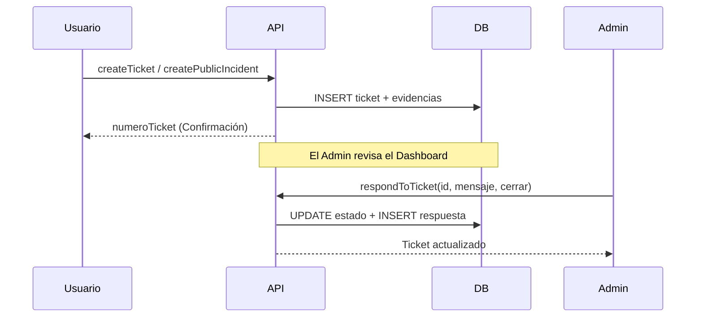
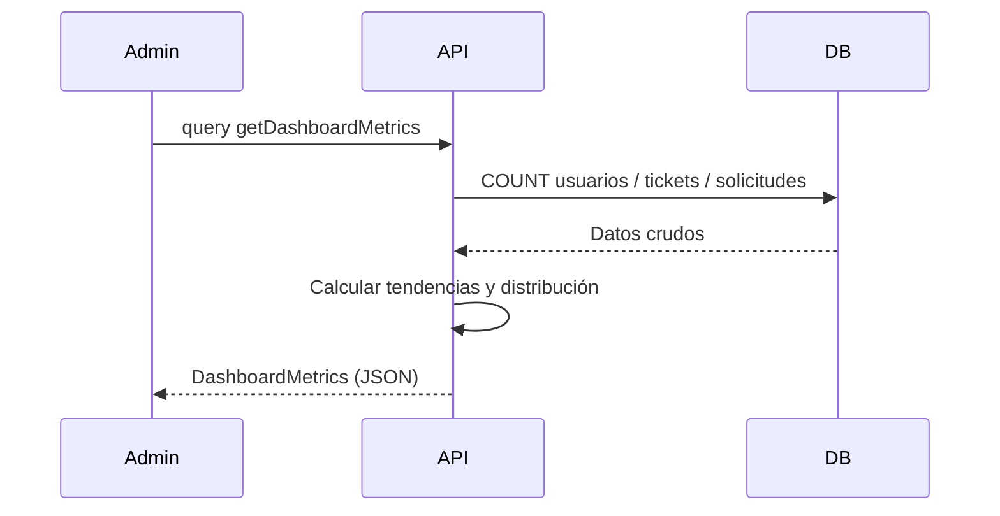
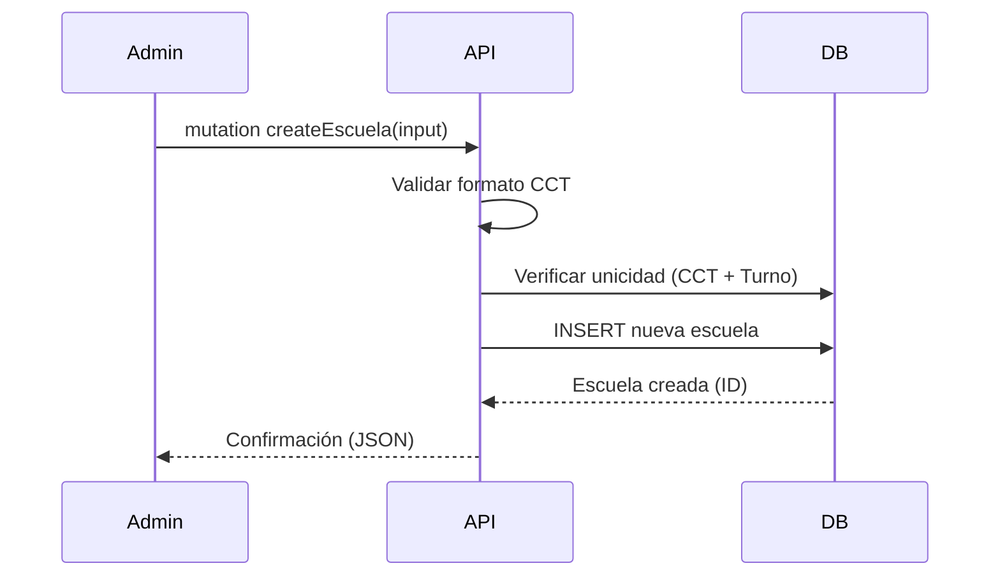

# REPORTE DE PRUEBAS CON RESULTADOS DE PRUEBA FUNCIONAL Y CORRECCIÓN DE INCIDENCIAS DETECTADAS, UTILIZANDO POSTMAN DE ENDPOINTS, APIS Y CONSULTAS GRAPHQL

# Sistema Plataforma de Recepción, Validación y Descarga de Archivos de la Segunda Aplicación de los Ejercicios Integradores del Aprendizaje (EIA).

## 1) Introducción y Resumen Ejecutivo

### 1.1 Objetivo del entregable
El presente documento tiene como objetivo formalizar la validación funcional de los componentes del sistema desarrollados y ajustados durante el periodo de **febrero 2026**. Se busca asegurar que las nuevas interfaces de programación (GraphQL) para la gestión de tickets (Mesa de Ayuda), el Dashboard Administrativo y el Catálogo de Escuelas cumplan con los requerimientos operativos y de negocio.

### 1.2 Resumen Ejecutivo
Durante el mes de febrero de 2026, el esfuerzo técnico se centró en la implementación de herramientas de soporte y monitoreo, así como en la descentralización de la persistencia (SFTP) y la gestión administrativa de catálogos.

Este reporte consolida:
- **Validación de 5 áreas críticas:** Dashboard de métricas, sistema de tickets, incidencias públicas, gestión de escuelas y seguridad administrativa.
- **Trazabilidad técnica:** Vinculación directa entre las pruebas funcionales y los cambios en el repositorio (Commits de febrero).
- **Control de calidad:** Registro de la estabilización del sistema tras la migración de persistencia a servidor.

---

## 2) Control documental

- **Periodo de evidencia permitido:** 2026-02-01 a 2026-02-28 (inclusive).
- **Exclusiones aplicadas:** enero 2026 (reportado anteriormente) y marzo 2026 excluidos.
- **Naturaleza del presente documento:** plan/plantilla ejecutable para registrar resultados **reales** en Postman.
- **Estado de resultados en este entregable:** **pendiente de ejecución real**.

---

## 3) Alcance técnico validado en repositorio (febrero 2026)

Se confirmaron componentes que permiten cubrir los escenarios obligatorios solicitados:

1. **Dashboard Administrativo**: Consulta de métricas reales mediante `getDashboardMetrics`.
2. **Mesa de Ayuda (Help Desk)**: Creación, consulta y respuesta de tickets (`createTicket`, `getMyTickets`, `respondToTicket`).
3. **Incidencias Públicas**: Reporte de errores por usuarios no autenticados (`createPublicIncident`).
4. **Catálogo de Escuelas**: Operaciones CRUD para centros de trabajo (`listEscuelas`, `createEscuela`).
5. **Seguridad Administrativa**: Reinicio forzado de contraseñas por administradores (`resetUserPassword`).

---

## 4) Evidencia contractual acotada a febrero 2026

### 4.1 Commits relevantes identificados (únicamente febrero)

| Commit | Fecha (YYYY-MM-DD) | Evidencia resumida | Relación con pruebas |
|---|---:|---|---|
| `01ce65e` | 2026-02-19 | Implementar Dashboard Administrativo con métricas reales. | PF-07: Dashboard. |
| `67f808e` | 2026-02-24 | Respuesta de tickets y resultados de soporte. | PF-08: Mesa de Ayuda. |
| `9fd3334` | 2026-02-19 | Mejora en login y consulta de centros de trabajo. | PF-10: Catálogo Escuelas. |
| `1ac7f01` | 2026-02-19 | Visibilidad de tickets admin y mejoras en UI. | PF-08, PF-09. |
| `ad59618` | 2026-02-18 | Migración de localStorage a Servidor/SFTP. | Afecta todas las cargas. |

---

## 5) Parámetros para ejecución real en Postman

- `baseUrl` = `http://localhost:4000`
- `graphqlUrl` = `{{baseUrl}}/graphql`
- `token_admin` = JWT de usuario con rol `COORDINADOR_FEDERAL`.
- `token_user` = JWT de usuario con rol `RESPONSABLE_CCT`.

---

## 6) Matriz mínima de pruebas funcionales (febrero 2026)

## PF-07 — Dashboard de Métricas Administrativas

- **Objetivo:** validar la obtención de estadísticas reales del sistema.
- **Método/URL:** `POST {{graphqlUrl}}`
- **Headers:** `Authorization: Bearer {{token_admin}}`
- **Body (raw JSON):**
```json
{
  "query": "query { getDashboardMetrics { totalUsuarios usuariosActivos totalTickets totalSolicitudes totalCCTs tendenciaCargas { fecha cantidad } } }"
}
```

[ESPACIO PARA EVIDENCIA VISUAL]

---

## PF-08 — Mesa de Ayuda: Gestión de Tickets

- **Objetivo:** validar creación y respuesta a solicitudes de soporte.
- **Método/URL:** `POST {{graphqlUrl}}`
- **Headers:** `Authorization: Bearer {{token_user}}`
- **Body (Creación):**
```json
{
  "query": "mutation CreateTicket($input: CreateTicketInput!) { createTicket(input: $input) { id numeroTicket asunto estado } }",
  "variables": {
    "input": {
      "motivo": "ERROR_CARGA",
      "descripcion": "El archivo EIA2 marca error de estructura en la fila 10."
    }
  }
}
```

---

## PF-09 — Incidencias Públicas (Usuarios no logueados)

- **Objetivo:** permitir que usuarios sin cuenta reporten problemas de acceso.
- **Método/URL:** `POST {{graphqlUrl}}`
- **Body:**
```json
{
  "query": "mutation CreatePublic($input: CreatePublicIncidentInput!) { createPublicIncident(input: $input) { id numeroTicket correo } }",
  "variables": {
    "input": {
      "nombreCompleto": "Usuario Externo",
      "cct": "09DPR0001A",
      "turno": "Matutino",
      "email": "externo@prueba.com",
      "descripcion": "No puedo registrar mi CCT."
    }
  }
}
```

---

## PF-10 — Catálogo de Escuelas (CRUD)

- **Objetivo:** validar administración de centros de trabajo por el administrador.
- **Método/URL:** `POST {{graphqlUrl}}`
- **Headers:** `Authorization: Bearer {{token_admin}}`
- **Body (Crear Escuela):**
```json
{
  "query": "mutation CreateEscuela($input: CreateEscuelaInput!) { createEscuela(input: $input) { id cct nombre } }",
  "variables": {
    "input": {
      "cct": "99DPR9999X",
      "nombre": "ESCUELA DE PRUEBA FEBRERO",
      "id_turno": 1,
      "id_nivel": 2,
      "id_entidad": 15,
      "id_ciclo": 1
    }
  }
}
```

---

## PF-11 — Reinicio Administrativo de Contraseña

- **Objetivo:** validar que un admin pueda resetear la clave de un usuario.
- **Método/URL:** `POST {{graphqlUrl}}`
- **Headers:** `Authorization: Bearer {{token_admin}}`
- **Body:**
```json
{
  "query": "mutation Reset($userId: ID!) { resetUserPassword(userId: $userId) { success message } }",
  "variables": {
    "userId": "<ID_DE_USUARIO_REAL>"
  }
}
```

---

## 7) Diagramas de flujo (Mermaid)

### 7.1 Flujo de Mesa de Ayuda (Tickets)

**Descripción:** Detalla el proceso desde que un usuario (autenticado o público) genera un ticket, hasta que el administrador lo visualiza en el dashboard y emite una respuesta, notificando al usuario del cambio de estado.



### 7.2 Flujo de Dashboard Administrativo

**Descripción:** Ilustra cómo el sistema recolecta métricas de múltiples tablas (usuarios, tickets, solicitudes) para generar una vista consolidada de la salud operativa del sistema que permite a los coordinadores tomar decisiones basadas en datos reales de carga y soporte.



### 7.3 Flujo de Gestión de Catálogos (Escuelas)

**Descripción:** Describe el proceso administrativo para dar de alta un nuevo Centro de Trabajo (CCT) en el sistema, incluyendo las validaciones de formato de clave y la vinculación con los catálogos institucionales de nivel, turno y entidad federativa.



---

## 8) Registro de resultados reales (plantilla)

| ID Prueba | Fecha ejecución real | Resultado real (Pass/Fail) | Evidencia adjunta |
|---|---|---|---|
| PF-07 | PENDIENTE | PENDIENTE | PENDIENTE |
| PF-08 | PENDIENTE | PENDIENTE | PENDIENTE |
| PF-09 | PENDIENTE | PENDIENTE | PENDIENTE |
| PF-10 | PENDIENTE | PENDIENTE | PENDIENTE |
| PF-11 | PENDIENTE | PENDIENTE | PENDIENTE |

---

## 9) Cierre de febrero 2026
El entregable de febrero consolida la infraestructura de soporte y administración necesaria para la fase de producción, garantizando trazabilidad y control sobre las incidencias reportadas.
