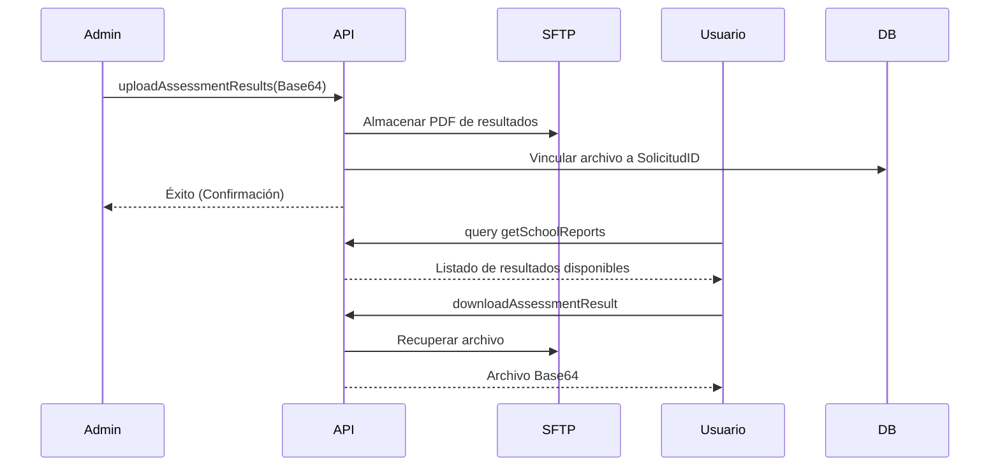
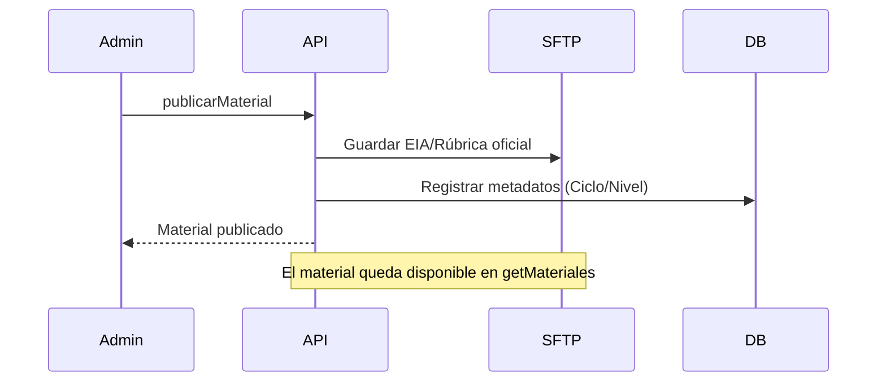

# REPORTE DE PRUEBAS CON RESULTADOS DE PRUEBA FUNCIONAL Y CORRECCIÓN DE INCIDENCIAS DETECTADAS, UTILIZANDO POSTMAN DE ENDPOINTS, APIS Y CONSULTAS GRAPHQL

# Sistema Plataforma de Recepción, Validación y Descarga de Archivos de la Segunda Aplicación de los Ejercicios Integradores del Aprendizaje (EIA).

## 1) Introducción y Resumen Ejecutivo

### 1.1 Objetivo del entregable
El presente documento tiene como objetivo formalizar la validación funcional de los componentes del sistema desarrollados y ajustados durante el periodo de **marzo 2026**. Se busca asegurar que las interfaces de publicación de materiales, la entrega de resultados y la generación de comprobantes PDF cumplan con los requerimientos técnicos y de usuario final.

### 1.2 Resumen Ejecutivo
Durante el mes de marzo de 2026, el sistema alcanzó su madurez operativa con la implementación de:
- **Gestión de Materiales**: Capacidad de los administradores para publicar archivos EIA, FRV y Rúbricas.
- **Entrega de Resultados**: Flujo completo de carga de dictámenes por parte de la autoridad y descarga por parte de las escuelas.
- **Transaccionalidad PDF**: Generación dinámica de comprobantes de recepción con sello digital/hash.
- **Soporte al Usuario**: Sistema de consulta de Preguntas Frecuentes (FAQ).

---

## 2) Control documental

- **Periodo de evidencia permitido:** 2026-03-01 a 2026-03-31 (inclusive).
- **Exclusiones aplicadas:** enero y febrero 2026 (reportados anteriormente).
- **Naturaleza del presente documento:** plan/plantilla ejecutable para registrar resultados **reales** en Postman.
- **Estado de resultados en este entregable:** **pendiente de ejecución real**.

---

## 3) Alcance técnico validado en repositorio (marzo 2026)

Se confirmaron componentes que permiten cubrir los escenarios obligatorios solicitados:

1. **Publicación de Materiales**: Uso de `publicarMaterial` para subir archivos base al servidor SFTP.
2. **Descarga de Insumos**: Consulta y descarga de materiales mediante `getMateriales` y `downloadMaterial`.
3. **Carga de Resultados**: Mutación `uploadAssessmentResults` para asociar dictámenes a evaluaciones existentes.
4. **Comprobantes Digitales**: Consulta `generateComprobante` para obtener el PDF de acuse en Base64.
5. **Base de Conocimientos**: Consulta `getPreguntasFrecuentes` para soporte autónomo.

---

## 4) Evidencia contractual acotada a marzo 2026

### 4.1 Commits relevantes identificados (marzo)

| Commit | Fecha (YYYY-MM-DD) | Evidencia resumida | Relación con pruebas |
|---|---:|---|---|
| `c6b3e9c` | 2026-03-11 | Configuración de Correo electrónico y servicios de mailing. | Recuperación de claves. |
| `771edc3` | 2026-03-20 | Integración de Dashboard y entrega de resultados. | PF-14, PF-15. |
| `0f70577` | 2026-03-19 | Menú usuario de Rol 4 (Consulta) y restricciones. | Seguridad de roles. |
| `f05a7b1` | 2026-03-26 | Fix de importación SFTP y carga de evidencias. | PF-12, PF-14. |
| `70da7a0` | 2026-03-20 | Reporte consolidado de integración y merge. | PF-15: Reportes. |

---

## 5) Parámetros para ejecución real en Postman

- `baseUrl` = `http://localhost:4000`
- `graphqlUrl` = `{{baseUrl}}/graphql`
- `token_admin` = JWT de usuario con rol `COORDINADOR_FEDERAL`.
- `token_user` = JWT de usuario con rol `RESPONSABLE_CCT`.

---

## 6) Matriz mínima de pruebas funcionales (marzo 2026)

## PF-12 — Publicación de Material de Evaluación (Admin)

- **Objetivo:** validar que el administrador pueda subir materiales (EIA/Rúbricas).
- **Método/URL:** `POST {{graphqlUrl}}`
- **Headers:** `Authorization: Bearer {{token_admin}}`
- **Body (raw JSON):**
```json
{
  "query": "mutation Publish($input: PublicarMaterialInput!) { publicarMaterial(input: $input) { success message material { id nombre rutaArchivo } } }",
  "variables": {
    "input": {
      "nombre": "EIA 2025 - Primaria 4to Grado",
      "tipo": "EIA",
      "nivelEducativo": "PRIMARIA",
      "cicloEscolar": "2024-2025",
      "periodoId": "1",
      "nombreArchivo": "eia_primaria_4.pdf",
      "archivoBase64": "JVBERi0xLjQKJ... (Base64 corto de prueba)"
    }
  }
}
```

---

## PF-13 — Descarga de Comprobante de Recepción (Usuario)

- **Objetivo:** validar la obtención del acuse PDF tras una carga exitosa.
- **Método/URL:** `POST {{graphqlUrl}}`
- **Headers:** `Authorization: Bearer {{token_user}}`
- **Body:**
```json
{
  "query": "query { generateComprobante(solicitudId: \"ID_SOLICITUD_REAL\") { success fileName contentBase64 } }"
}
```

---

## PF-14 — Entrega de Resultados (Carga Masiva Admin)

- **Objetivo:** asociar archivos de resultados a una solicitud de evaluación.
- **Método/URL:** `POST {{graphqlUrl}}`
- **Headers:** `Authorization: Bearer {{token_admin}}`
- **Body:**
```json
{
  "query": "mutation UploadResults($input: UploadResultsInput!) { uploadAssessmentResults(input: $input) { success message resultados { nombre url } } }",
  "variables": {
    "input": {
      "solicitudId": "ID_SOLICITUD_REAL",
      "archivos": [
        { "nombre": "resultado_09DPR0001A.pdf", "base64": "JVBER..." }
      ]
    }
  }
}
```

---

## PF-15 — Consulta de Preguntas Frecuentes (Público/Usuario)

- **Objetivo:** validar el acceso al catálogo de ayuda.
- **Método/URL:** `POST {{graphqlUrl}}`
- **Body:**
```json
{
  "query": "query { getPreguntasFrecuentes { pregunta respuesta orden } }"
}
```

---

## PF-16 — Exportación de Tickets a CSV (Admin)

- **Objetivo:** validar la exportación de datos para análisis externo.
- **Método/URL:** `POST {{graphqlUrl}}`
- **Headers:** `Authorization: Bearer {{token_admin}}`
- **Body:**
```json
{
  "query": "query { exportTicketsCSV { success fileName contentBase64 } }"
}
```

---

## 7) Diagramas de flujo (Mermaid)

### 7.1 Flujo de Entrega de Resultados

**Descripción:** Detalla el proceso de cierre de ciclo donde la autoridad (Admin) carga los resultados procesados y el sistema los pone a disposición del usuario de la escuela mediante una notificación y enlace de descarga segura.



### 7.2 Flujo de Publicación de Materiales

**Descripción:** Ilustra cómo los materiales oficiales son centralizados en el servidor SFTP desde la cuenta administrativa, asegurando que todas las escuelas descarguen la versión vigente de los instrumentos de evaluación.



---

## 8) Registro de resultados reales (plantilla)

| ID Prueba | Fecha ejecución real | Resultado real (Pass/Fail) | Evidencia adjunta |
|---|---|---|---|
| PF-12 | PENDIENTE | PENDIENTE | PENDIENTE |
| PF-13 | PENDIENTE | PENDIENTE | PENDIENTE |
| PF-14 | PENDIENTE | PENDIENTE | PENDIENTE |
| PF-15 | PENDIENTE | PENDIENTE | PENDIENTE |
| PF-16 | PENDIENTE | PENDIENTE | PENDIENTE |

---

## 9) Cierre de marzo 2026
Con la validación de estos componentes, la plataforma completa su ciclo de vida: desde la descarga de materiales, la recepción de archivos (EIA2) hasta la entrega final de resultados y soporte post-aplicación.
