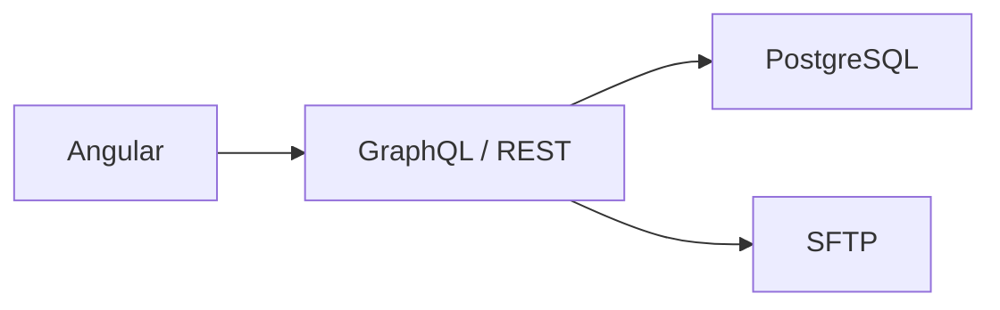
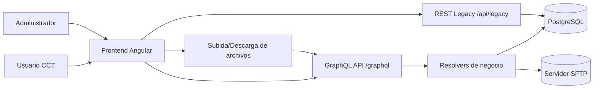
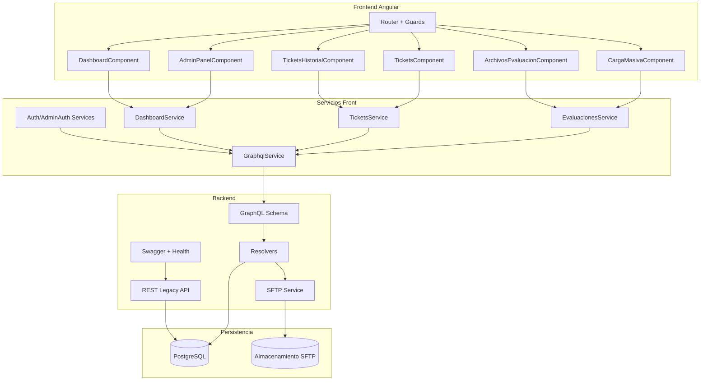
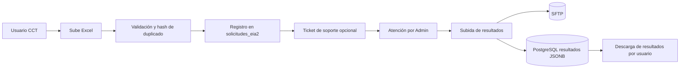

# 1. Diagrama de arquitectura y componentes de los sistemas web en desarrollo
## Complemento de avances del mes de febrero 2026

## 1) Objetivo
Dar continuidad al entregable de arquitectura presentado en enero 2026, documentando de forma explícita los avances implementados durante febrero 2026 en las tres capas del sistema que fueron desarrolladas de manera integral: **Frontend Angular**, **Backend GraphQL/REST** y **Base de Datos PostgreSQL**.

Este complemento incorpora los **nuevos módulos, componentes, APIs, mutaciones/queries, reglas de seguridad, tablas/campos y ajustes de integridad** agregados en el mes, para mantener trazabilidad técnica y operativa del proyecto.

---

## 2) Introducción
Durante febrero 2026 se continuó el desarrollo del proyecto con un enfoque de evolución arquitectónica y cierre de funcionalidades clave. El sistema pasó de una etapa centrada en estabilización funcional a una etapa con mayor madurez en integración de servicios, privacidad de datos por usuario, soporte administrativo y entrega de resultados.

En este periodo se añadieron y consolidaron:
- Nuevos componentes y rutas en Angular para operación administrativa y seguimiento.
- Nuevas capacidades GraphQL para dashboard, tickets, descargas y resultados.
- Exposición de endpoints REST para integración con sistemas legados.
- Cambios estructurales en base de datos para trazabilidad por usuario, versionado de cargas y almacenamiento de resultados.
- Endurecimiento del flujo de autenticación/autorización con guards y controles por rol.

---

## 3) Resumen ejecutivo de febrero 2026

### 3.1 Resultado general del mes
En febrero se consolidó una arquitectura **híbrida y trazable**:
1. **Angular** como capa de experiencia (operación escolar y administración).
2. **GraphQL** como núcleo transaccional para casos de uso principales.
3. **REST legado + Swagger** para interoperabilidad externa.
4. **PostgreSQL** como fuente de verdad con nuevos campos para privacidad y resultados.
5. **SFTP** como canal de almacenamiento/entrega de archivos de evidencia y resultados.

### 3.2 Capacidades nuevas destacadas
- Dashboard administrativo con métricas reales.
- Gestión avanzada de tickets (respuesta, cierre, exportación y evidencias).
- Carga de resultados asociados a solicitudes (PDF/imágenes) y descarga por archivo.
- Filtro de historial por autor (`usuario_id`) para privacidad por rol.
- Integración REST para consumo de estadísticas por sistemas legados.

### 3.3 Cobertura por capa (validación explícita del alcance)
Para evitar ambigüedad, este entregable **sí cubre las tres capas** del sistema, no únicamente Angular.

| Capa | Cobertura en el documento | Evidencias incluidas |
|---|---|---|
| Frontend Angular | Completa | Rutas, componentes, guards y servicios de UI/negocio |
| Backend GraphQL/REST | Completa | Queries, mutations, endpoint legado, health y Swagger |
| Base de datos PostgreSQL | Completa | Campos/tablas nuevos, restricciones y soporte de trazabilidad |

**Conclusión de cobertura:**
- **Angular:** cubierto.
- **GraphQL/REST:** cubierto.
- **PostgreSQL:** cubierto.

---

## 4) Arquitectura actualizada (febrero)

**Lectura arquitectónica de febrero:**
- El frontend incrementó cobertura funcional en rutas de usuario y administración.
- GraphQL concentró orquestación de procesos (cargas, tickets, métricas, resultados).
- REST complementó interoperabilidad hacia sistemas externos.
- BD y SFTP cerraron trazabilidad de datos y documentos.

---

## 5) Capa Frontend (Angular) — avances de febrero

## 5.1 Nuevos módulos/rutas y refuerzo de navegación
Se consolidó la navegación con protección por sesión/rol para operaciones críticas:
- `/admin/dashboard` (nuevo tablero administrativo).
- `/admin/panel` (operación administrativa central).
- `/tickets` y `/tickets-historial` (mesa de ayuda y seguimiento).
- `/archivos-evaluacion` y `/descargas` para trazabilidad de entregables.
- `/recuperar-password` para continuidad operativa de acceso.

## 5.2 Componentes reforzados
Durante febrero se ampliaron o estabilizaron componentes clave:
- `DashboardComponent`: visualización de KPIs y tendencias.
- `AdminPanelComponent`: operación administrativa, tickets y gestión de resultados.
- `CargaMasivaComponent`: mejoras de flujo de autenticación y carga.
- `ArchivosEvaluacionComponent`: historial y seguimiento de archivos de evaluación.
- `TicketsComponent` y `TicketsHistorialComponent`: creación, consulta y seguimiento.
- `AdminLoginComponent` y `LoginComponent`: mejoras de acceso y control de sesión.

## 5.3 Servicios frontend consolidados
Se fortaleció el desacoplamiento de responsabilidades mediante servicios:
- `dashboard.service.ts`: consumo de métricas administrativas.
- `tickets.service.ts`: operación de tickets y respuestas.
- `evaluaciones.service.ts`: carga de evaluaciones y seguimiento.
- `auth.service.ts` y `admin-auth.service.ts`: autenticación/rol.
- `graphql.service.ts`: cliente unificado para operaciones GraphQL.

---

## 6) Capa Backend (GraphQL/REST) — avances de febrero

## 6.1 Nuevas queries y capacidades GraphQL
Se consolidaron consultas para operación real:
- `getDashboardMetrics`
- `getAllTickets`
- `exportTicketsCSV`
- `generateComprobante`
- `downloadAssessmentResult`
- Refuerzo de `getSolicitudes` y `getMyTickets` con criterios de visibilidad.

## 6.2 Nuevas mutaciones y ampliaciones
Se fortaleció la operación transaccional:
- `respondToTicket(ticketId, respuesta, cerrar)`
- `deleteTicket(ticketId)` (borrado lógico)
- `uploadAssessmentResults(input)` para anexar resultados por solicitud.
- Evoluciones en `uploadExcelAssessment` para control de carga/duplicados.

## 6.3 Integración REST para sistemas legados
Se expuso el endpoint:
- `GET /api/legacy/stats/:cct`

Este endpoint entrega estadísticas de avance por CCT y complementa la estrategia de integración híbrida (GraphQL + REST).

## 6.4 Observabilidad y seguridad operativa
- Endpoint `/health` para verificación de disponibilidad.
- Swagger UI en `/api-docs` para documentación y consumo técnico.
- Middlewares de hardening (`helmet`, `compression`, `cors`) y configuración de contexto para control por usuario.

---

## 7) Capa de datos (PostgreSQL) — avances de febrero

## 7.1 Cambios de esquema relevantes
Se ejecutaron cambios estructurales para privacidad, trazabilidad y entrega de resultados:

1. **`solicitudes_eia2.usuario_id` (UUID FK a `usuarios`)**  
   Permite identificar al autor de cada carga y aplicar filtros de privacidad por rol.

2. **`solicitudes_eia2.resultados` (JSONB)**  
   Permite almacenar metadatos de múltiples archivos de resultados asociados a una solicitud.

3. **Ajuste de restricción en `grupos`**  
   Cambio de unicidad a `(escuela_id, grado_id, nombre)` para soportar grupos homónimos en grados distintos.

4. **Soporte de versionado/duplicados en cargas**  
   Inclusión/uso de `hash_archivo` y vínculo `solicitud_id` sobre flujos de carga/evaluación.

5. **Tickets con evidencias (JSONB)**  
   Fortalecimiento de soporte documental en mesa de ayuda mediante campo `evidencias`.

## 7.2 Beneficio técnico de los cambios
- Mayor integridad referencial y trazabilidad de autoría.
- Cumplimiento de reglas de privacidad de acceso a cargas.
- Soporte para ciclo completo: carga → validación → respuesta → resultados.
- Base de datos preparada para auditoría de operación por usuario y por solicitud.

---

## 8) Diagrama de componentes actualizado (febrero)

### 8.1 Explicación y concepto del diagrama de componentes
Este diagrama representa la **arquitectura por capas y responsabilidades** implementada en febrero:

1. **Capa de presentación (Frontend Angular)**  
   El `Router + Guards` controla navegación y seguridad de acceso. Cada componente atiende un caso de uso concreto (carga, historial, tickets, panel y dashboard).

2. **Capa de servicios frontend**  
   Los componentes no acceden directamente al backend; primero delegan en servicios de dominio (`EvaluacionesService`, `TicketsService`, `DashboardService`, `Auth/AdminAuth`). Esto mejora mantenibilidad y permite centralizar reglas de negocio del cliente.

3. **Capa de integración (`GraphqlService`)**  
   Actúa como punto unificado de comunicación, evitando acoplamiento directo entre cada componente y el esquema GraphQL.

4. **Capa backend**  
   `GraphQL Schema` define contrato, `Resolvers` ejecutan lógica y orquestan persistencia en PostgreSQL y archivos en SFTP. De forma paralela, la `REST Legacy API` cubre interoperabilidad con consumidores externos.

5. **Capa de persistencia**  
   PostgreSQL conserva datos transaccionales y SFTP concentra artefactos (evidencias/resultados), logrando trazabilidad integral.

**Interpretación funcional:**
- El flujo principal es: `Componente Angular -> Servicio de dominio -> GraphqlService -> Schema/Resolvers -> PostgreSQL/SFTP`.
- El flujo complementario para integración externa es: `REST Legacy API -> PostgreSQL`.
- La separación por capas permite escalar cada módulo sin romper el resto del sistema.

## 8.2 Diagrama adicional sugerido: flujo de ciclo de vida de una solicitud
Para complementar el diagrama de componentes, se agrega este diagrama de flujo del proceso operativo de febrero (carga, soporte y resultados):

---

## 9) Trazabilidad de entregables técnicos de febrero

## 9.1 Frontend
- Consolidación de dashboard administrativo con indicadores reales.
- Endurecimiento de guards (acceso por sesión/rol).
- Ajustes de UI/UX en login, panel admin, tickets e historial.
- Integración de operaciones de resultados y descargas.

## 9.2 GraphQL/Backend
- Extensión de esquema con queries/mutations para soporte operativo completo.
- Mejoras en resolvers para tickets, resultados y visibilidad por usuario.
- Habilitación de documentación Swagger y endpoint REST legado.

## 9.3 Base de datos
- Migraciones en `solicitudes_eia2` para autoría (`usuario_id`) y resultados (`JSONB`).
- Ajuste de unicidad en `grupos`.
- Refuerzo de estructura para evidencias de tickets y control de duplicados.

---

## 10) Conclusiones del mes de febrero
1. La arquitectura evolucionó de una base funcional a una plataforma con trazabilidad y gobierno de datos por usuario.
2. Se cerró el circuito funcional entre captura, soporte, administración y entrega de resultados.
3. La interoperabilidad quedó habilitada mediante API REST documentada y coexistencia con GraphQL.
4. El sistema quedó mejor preparado para continuidad de operación, auditoría técnica y escalamiento en próximos sprints.

---

## 11) Recomendaciones para marzo 2026
- Incorporar métricas de rendimiento (tiempos de carga, latencia por operación GraphQL, throughput de archivos).
- Añadir pruebas automáticas E2E para flujos críticos: carga, ticket y descarga de resultados.
- Definir versionamiento formal de esquema GraphQL y política de deprecación de campos.
- Formalizar dashboard de auditoría para trazabilidad por usuario/CCT/fecha.
