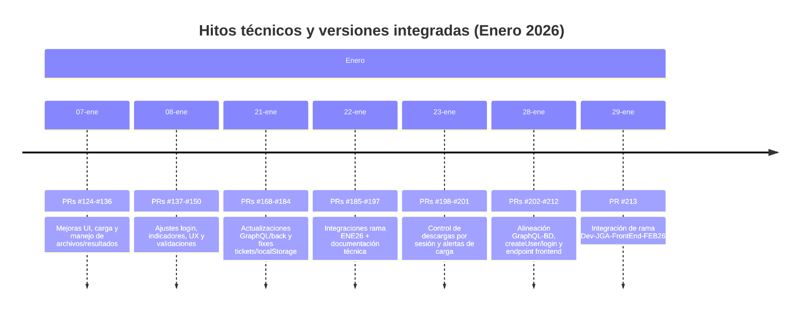
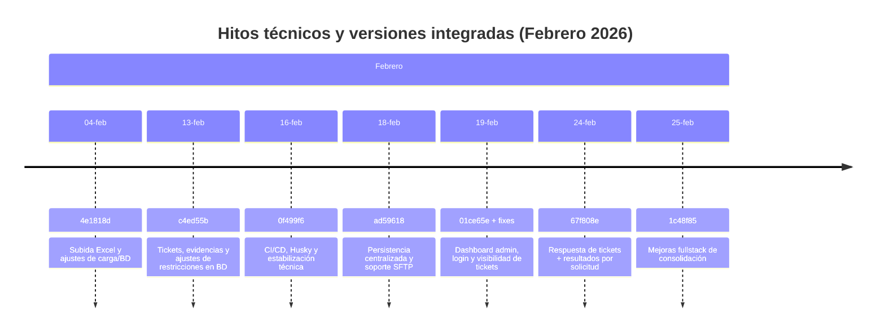
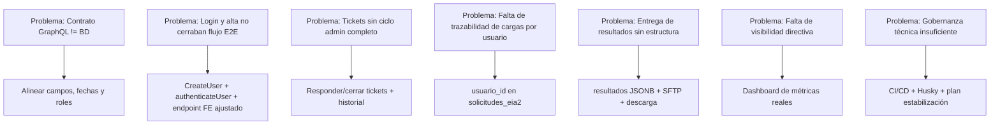

# 2. Bitácora de desarrollo y seguimiento (Enero–Febrero 2026)

## 1) Propósito del entregable
Documentar de forma trazable el trabajo ejecutado durante **enero y febrero de 2026** en el proyecto SEP Evaluación Diagnóstica, incluyendo:
- Tareas realizadas por sprint/módulo.
- Evidencia de commits y versiones integradas por Pull Requests.
- Problemáticas atendidas y solución implementada.
- Cambios relevantes en Frontend, Backend GraphQL/REST y Base de Datos.

---

## 2) Alcance
Este documento cubre la actividad registrada en Git para el periodo **2026-01-01 a 2026-02-29**, con foco en:
1. Módulo de autenticación y control de acceso.
2. Carga masiva y validación de archivos.
3. Tickets/mesa de ayuda y operación administrativa.
4. Dashboard y métricas.
5. Integración GraphQL/REST/SFTP.
6. Ajustes de esquema y trazabilidad en PostgreSQL.

---

## 3) Resumen ejecutivo por mes

### Enero 2026 (integración funcional y ajustes de contrato de datos)
- Se robusteció la interfaz de usuario y flujos de operación (login, carga, descargas, tickets).
- Se alineó el contrato GraphQL con estructura real de base de datos (campos, fechas, roles, credenciales).
- Se integraron cambios por múltiples PRs en ramas de trabajo (`Dev-JGA-FrontEnd-ENE26`, `codex/*`) y se cerraron incidencias de UX/validación.

### Febrero 2026 (madurez operativa, administración y trazabilidad)
- Se implementaron capacidades administrativas de mayor nivel: dashboard de métricas reales, control de tickets y resultados.
- Se fortaleció la persistencia con trazabilidad por usuario (`usuario_id`) y resultados (`JSONB`) en solicitudes.
- Se habilitó integración híbrida con endpoint REST legado y documentación técnica Swagger.
- Se consolidó la gobernanza técnica con CI/CD, Husky y plan de estabilización.

---

## 4) Línea de tiempo de versiones (separada por mes)

### 4.1 Enero 2026

### 4.2 Febrero 2026

---

## 5) Bitácora por sprint/módulo

> Nota: la planeación se presenta por bloques operativos equivalentes a sprint para facilitar seguimiento ejecutivo.

## Sprint ENE-1 (07–08 ene): UX base y flujo de operación inicial
**Módulos:** Frontend (login, carga, archivos, estado visual)  
**Problemáticas atendidas:** fricción de uso, estados poco claros, layout móvil, retroalimentación insuficiente.  
**Resultado:** interfaz más usable, componentes de estado y acciones de usuario reforzadas.

**Evidencia de PR/Versionado GitHub (extracto):**
- PR #124 a #136 (07-ene)
- PR #137 a #150 (08-ene)

---

## Sprint ENE-2 (21–23 ene): tickets, documentación técnica y control por sesión
**Módulos:** Tickets, descargas, documentación GraphQL/backend  
**Problemáticas atendidas:** guardado inconsistente de formularios, exposición de enlaces sin sesión, validaciones de carga.

**Commits evidencia (extracto):**
| Commit | Fecha | Cambio | Impacto |
|---|---|---|---|
| `9730812` | 2026-01-23 | Ocultar descargas sin sesión | Mejora seguridad funcional en frontend |
| `7f90015` | 2026-01-23 | Alertar al subir sin Excel | Prevención de error de usuario |
| `049d5bd` | 2026-01-23 | Permitir alerta sin selección de Excel | UX guiada en carga |
| `da0f0c7` | 2026-01-23 | Agregar manual de usuario frontend | Soporte de adopción y operación |

**Evidencia de PR/Versionado GitHub (extracto):**
- PRs #168 a #201 integrados entre 21 y 23 de enero.

---

## Sprint ENE-3 (28–29 ene): integración GraphQL real y alineación con BD
**Módulos:** Autenticación, creación de usuario, contrato GraphQL, carga masiva  
**Problemáticas atendidas:** diferencias de nombres de campos y fechas entre GraphQL y DB, flujo incompleto de alta/login.

**Commits evidencia (extracto):**
| Commit | Fecha | Cambio | Solución implementada |
|---|---|---|---|
| `e418a4f` | 2026-01-28 | Alinear campos de usuario con la base de datos | Consistencia entre API y persistencia |
| `9b137b8` | 2026-01-28 | Actualizar fecha de registro en GraphQL | Corrección semántica de datos |
| `c5ba546` | 2026-01-28 | Mapear roles de usuario desde catálogo | Control de rol unificado |
| `852915a` | 2026-01-28 | Requerir password y guardar hash al crear usuario | Endurecimiento de seguridad |
| `b451641` | 2026-01-28 | Integrar CreateUser en carga masiva | Cierre de flujo E2E de alta |
| `5a842cc` | 2026-01-28 | Agregar autenticación GraphQL para login | Login contra backend real |
| `95f19c6` | 2026-01-28 | Ajustar endpoint GraphQL en frontend | Conectividad estable FE-BE |
| `c4c1156` | 2026-01-28 | Usar updated_at en autenticación | Trazabilidad de acceso |

**Evidencia de PR/Versionado GitHub (extracto):**
- PRs #202, #203, #204, #205, #206, #207, #208, #209, #210, #211, #212 y #213.

---

## Sprint FEB-1 (04–16 feb): estabilización técnica y base de operación
**Módulos:** Carga masiva, BD, infraestructura de calidad  
**Problemáticas atendidas:** robustez de carga, deuda de gobernanza técnica y validación continua.

**Commits evidencia (extracto):**
| Commit | Fecha | Cambio | Impacto |
|---|---|---|---|
| `4e1818d` | 2026-02-04 | Subida de archivo Excel | Consolidación de flujo de carga con ajustes de BD |
| `c4ed55b` | 2026-02-13 | tickets | Soporte de evidencias y ajustes de restricciones |
| `0f499f6` | 2026-02-16 | Sprint 1 remediation + CI/CD + Husky | Gobernanza técnica y calidad continua |
| `939c618` | 2026-02-16 | Estabilización técnica y gestión de errores | Menor fragilidad operativa |
| `e6256f9` | 2026-02-16 | SFTP, Swagger, soft delete | Integración externa y control de ciclo de vida |

---

## Sprint FEB-2 (18–25 feb): dashboard, tickets administrables y resultados
**Módulos:** Admin panel, dashboard, tickets, historial, resultados, privacidad por usuario  
**Problemáticas atendidas:** falta de métricas reales, visibilidad de tickets, trazabilidad del autor de carga y entrega de resultados.

**Commits evidencia (extracto):**
| Commit | Fecha | Cambio | Solución implementada |
|---|---|---|---|
| `ad59618` | 2026-02-18 | Persistencia centralizada y SFTP | Migración de almacenamiento local a modelo trazable |
| `01ce65e` | 2026-02-19 | Implementar Dashboard Administrativo | KPIs reales para seguimiento directivo |
| `1ac7f01` | 2026-02-19 | Fix visibilidad tickets admin + UI | Corrección de acceso y operación de soporte |
| `9fd3334` | 2026-02-19 | Fix login/consulta centros de trabajo | Estabilidad en autenticación y catálogo |
| `3dbfcd2` | 2026-02-19 | Corregir estado EN_PROCESO en tickets | Integridad de estados de negocio |
| `67f808e` | 2026-02-24 | Respuesta de tickets y resultados | Cierre de flujo de soporte y resultados |
| `1c48f85` | 2026-02-25 | Mejoras | Afinación fullstack de consolidación |

---

## 6) Trazabilidad de problemáticas vs solución técnica

---

## 7) Evidencia de cambios de BD y scripts de soporte (enero-febrero)

### Cambios estructurales destacados
- Ajuste de unicidad en `grupos` para soportar nombre repetido por grado dentro de la misma escuela.
- Inclusión de `usuario_id` en `solicitudes_eia2` para privacidad y autoría.
- Inclusión de `resultados` en `solicitudes_eia2` para histórico de archivos de salida.
- Inclusión de `evidencias` en `tickets_soporte` para adjuntos de soporte.
- Fortalecimiento de controles de duplicados/versionado por `hash_archivo`.

### Scripts/migraciones involucradas
- `graphql-server/scripts/fix_grupos_constraint.sql`
- `graphql-server/scripts/add_usuario_id_solicitudes.sql`
- `graphql-server/scripts/add_resultados_solicitudes.sql`
- `graphql-server/scripts/add_ticket_evidencias.sql`
- `graphql-server/scripts/fix_duplicate_uploads.sql`

---

## 8) Evidencia de PRs integrados (muestra representativa)

| PR | Fecha aprox | Tema |
|---|---|---|
| #198–#201 | 2026-01-23 | Seguridad/UX en descargas y carga |
| #202–#213 | 2026-01-28/29 | Integración GraphQL-BD y alta/login |
| #229–#232 | 2026-02-12 | Consolidación de documentación técnica |

> Además de estos, el repositorio registra múltiples PRs intermedios de soporte/fix en enero para ramas `codex/*` y ramas de integración de frontend.

---

## 9) Matriz de módulos entregados vs estado

| Módulo | Estado Ene-Feb 2026 | Evidencia |
|---|---|---|
| Autenticación/Autorización | Completo y reforzado | `5a842cc`, `852915a`, `9fd3334` |
| Carga Masiva | Completo con controles de duplicado y trazabilidad | `4e1818d`, `ad59618`, `67f808e` |
| Tickets/Mesa de ayuda | Completo con respuesta admin y evidencias | `c4ed55b`, `3dbfcd2`, `67f808e` |
| Dashboard Administrativo | Implementado con métricas reales | `01ce65e`, `1c48f85` |
| Integración REST legado | Implementada | cambios de febrero en backend |
| SFTP resultados | Implementado y operativo | `ad59618`, `e6256f9`, `67f808e` |
| Gobernanza técnica (CI/CD) | Implementada | `0f499f6`, `939c618` |

---

## 10) Conclusiones del periodo Enero–Febrero 2026
1. Se completó la transición de un frontend principalmente local a una operación integrada con backend real (GraphQL/REST).
2. La plataforma ganó trazabilidad de punta a punta: usuario autor, ticket, respuesta, resultado y descarga.
3. El esquema de datos evolucionó para soportar privacidad, auditoría y ciclo de vida documental.
4. Se establecieron prácticas de estabilización y calidad continua para sostener el crecimiento del proyecto.

---

## 11) Recomendaciones para siguiente periodo
- Generar un tablero mensual automático de commits/PRs por módulo (pipeline de métricas de ingeniería).
- Definir etiquetas estándar de PR (`feat`, `fix`, `db`, `security`, `docs`) para análisis histórico más preciso.
- Incorporar reportes de lead time/cycle time por sprint para gestión ejecutiva.
- Mantener trazabilidad cruzada: issue -> PR -> commit -> script/migración -> evidencia funcional.
