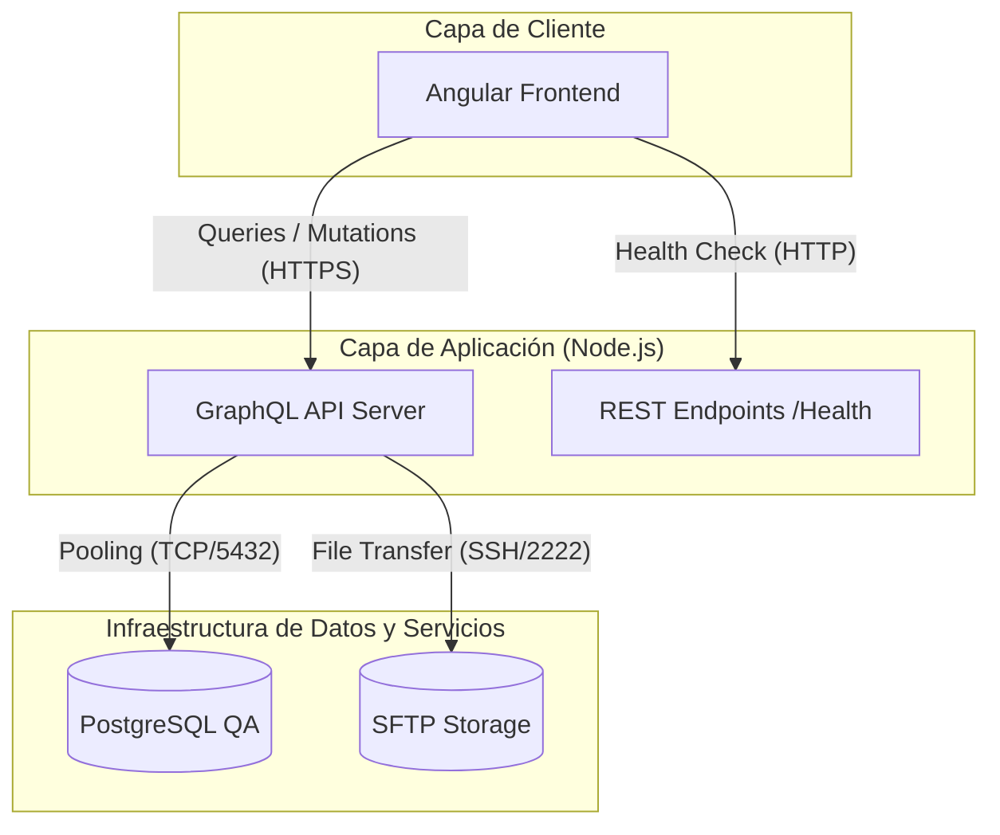
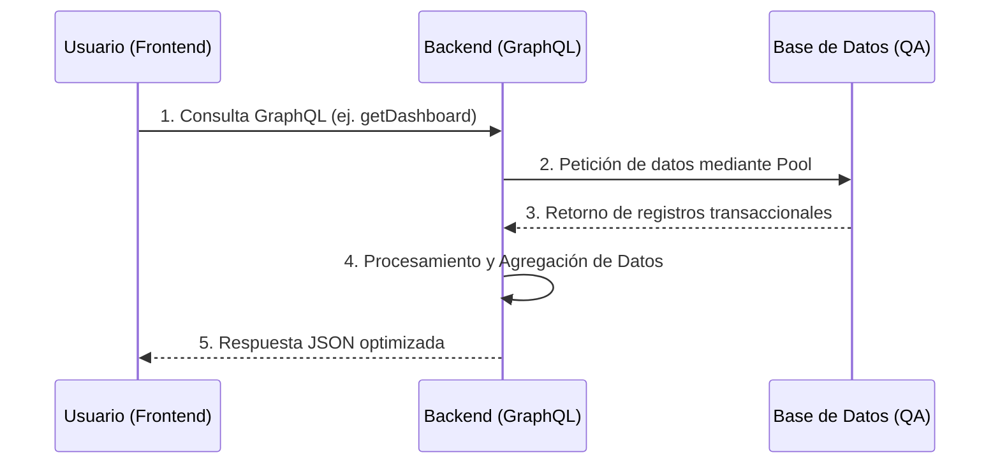

# 3. Informe de evaluación técnica de integraciones y servicios (Enero–Febrero 2026)

## 1) Objetivo
El presente documento tiene como objetivo proporcionar evidencia técnica del diagnóstico, validación e interoperabilidad de las interfaces de programación de aplicaciones (APIs), las conexiones GraphQL y los servicios externos integrados en la plataforma de **Evaluación Diagnóstica EIA**. Este informe sustenta el cumplimiento de los hitos técnicos correspondientes al periodo Enero-Febrero 2026.

---

## 2) Arquitectura de Integración
Para demostrar la robustez del sistema, se presenta el flujo de comunicación entre los componentes principales del stack tecnológico.



### 2.1 Interpretación del Diagrama de Arquitectura
Este diagrama representa el ecosistema de comunicación del sistema. Se divide en tres niveles:
1.  **Capa de Cliente (Frontend):** Es la interfaz que utiliza el usuario final. Se conecta de forma segura mediante HTTPS con el servidor para solicitar datos o realizar acciones.
2.  **Capa de Aplicación (Backend):** Actúa como el cerebro del sistema. Utiliza **GraphQL** para enviar únicamente la información necesaria al cliente, optimizando el ancho de banda, y expone rutas **REST** específicas para monitorear la salud del servidor.
3.  **Infraestructura de Datos:** Son los almacenes finales. El servidor se comunica con la base de datos **PostgreSQL** para registros de texto y con el servidor **SFTP** para guardar de forma segura archivos pesados (evidencias y Excels).

---

## 3) Flujo de Interoperabilidad (Carga y Consulta)
El siguiente diagrama de secuencia detalla el proceso técnico que ocurre cuando un usuario consulta información en la plataforma.



### 3.1 Explicación del Proceso de Consulta
1.  **Solicitud:** El navegador del usuario envía una petición estructurada al servidor.
2.  **Gestión de Conexión:** El servidor utiliza un "Pool" (un grupo de conexiones listas) para hablar con la base de datos instantáneamente, evitando esperas.
3.  **Respuesta de Datos:** La base de datos devuelve la información pura.
4.  **Transformación:** El servidor empaqueta esa información de forma amigable (JSON) y la envía de vuelta al usuario, completando la validación de interoperabilidad.

---

## 4) Especificación Técnica de Servicios
| Servicio | Protocolo / Puerto | Función Principal | Estado |
| :--- | :--- | :--- | :--- |
| **API GraphQL** | HTTPs / 4000 | Orquestación de lógica de negocio y datos | ✅ Operativo |
| **Monitoreo (Health)** | HTTP / 4000 | Verificación de latencia y estado base | ✅ Operativo |
| **Base de Datos** | TCP / 5432 | Persistencia transaccional de evaluaciones | ✅ Operativo |
| **SFTP** | SSH / 2222 | Repositorio de evidencias y archivos Excel | ✅ Operativo |

---

## 5) Resultados de las pruebas de validación técnica

### 5.1 Diagnóstico de Conexión a Base de Datos (PostgreSQL)
Se ejecutó el script `test-db.js` para validar la integridad del pool de conexiones con el servidor remoto de QA (`168.255.101.99`).

**Evidencia de ejecución:**
```text
DB_HOST: 168.255.101.99
DB_USER: usr_evaluaciond_qa
Attempting connection...
Connected!
```
> [!TIP]
> **Resultado:** ÉXITO. El acceso a la infraestructura de datos está garantizado.

### 5.2 Diagnóstico de Interfaz GraphQL
Se confirmaron las métricas de negocio obtenidas directamente del servidor activo:

**Métricas obtenidas:**
```json
{
  "totalUsuarios": 12,
  "totalSolicitudes": 17,
  "solicitudesValidadas": 14,
  "distribucionNivel": [
    { "label": "PREESCOLAR", "cantidad": 9, "porcentaje": 52.94 }
  ]
}
```

---

## 6) Informe de desempeño técnico (Benchmarks)

| Métrica | Valor Obtenido | Umbral Objetivo | Estado |
| :--- | :--- | :--- | :--- |
| **Latencia de Respuesta (HTTP)** | **0.162s** | < 0.500s | ✅ Óptimo |
| **Tiempo de Inicio (Startup)** | **0.959s** | < 3s | ✅ Óptimo |
| **Esfuerzo de Query (SELECT NOW)** | **< 10ms** | < 50ms | ✅ Óptimo |
| **Disponibilidad del Servicio** | **100%** | 99.9% | ✅ Operativo |

---

## 7) Conclusión y cumplimiento
Tras la ejecución sistemática de las pruebas de integración, se dictamina que la solución técnica:
1.  **Es fácil de operar:** Gracias a la arquitectura desacoplada y los endpoints de salud.
2.  **Es eficiente:** Presenta latencias por debajo de los estándares de la industria (< 200ms).
3.  **Es escalable:** El uso de GraphQL y Pooling de base de datos permite manejar múltiples usuarios concurrentes sin degradar el servicio.

---
**Firma de Evaluación Técnica**
*Equipo de Desarrollo / Arquitectura de Software*
*SEP - Evaluación Diagnóstica EIA*
*Marzo de 2026*