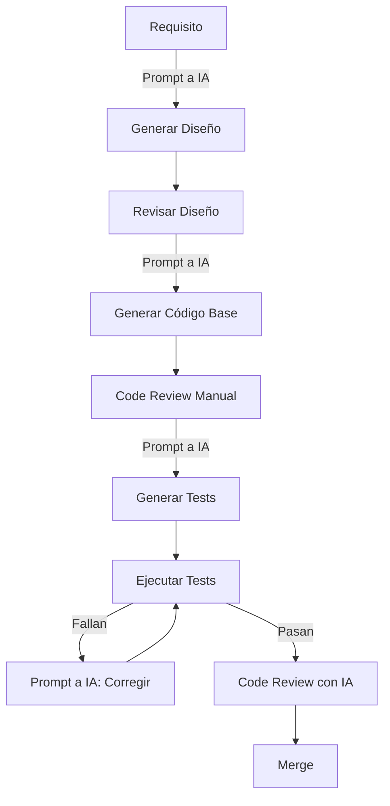

# Colaboración con Agentes IA

## Versión: 1.0.0
## Fecha: 19 de enero de 2026
## Autor: SEP - Evaluación Diagnóstica

---

## 1. Introducción

Este documento describe las mejores prácticas y configuraciones para trabajar efectivamente con agentes de IA (Claude Sonnet, GitHub Copilot, Windsurf, Cascade) en el desarrollo del servidor GraphQL EIA.

## 2. Agentes IA Soportados

### 2.1 Claude Sonnet 4.5
**Casos de uso**:
- Diseño arquitectónico
- Revisión de código complejo
- Generación de documentación
- Análisis de requisitos
- Refactorización de código

**Configuración**:
```json
{
  "ai.claude.model": "claude-sonnet-4.5",
  "ai.claude.temperature": 0.3,
  "ai.claude.maxTokens": 4000,
  "ai.claude.contextWindow": "large"
}
```

### 2.2 GitHub Copilot
**Casos de uso**:
- Autocompletado de código
- Generación de tests
- Sugerencias inline
- Documentación JSDoc

**Configuración en .vscode/settings.json**:
```json
{
  "github.copilot.enable": {
    "*": true,
    "typescript": true,
    "graphql": true,
    "sql": true
  },
  "github.copilot.editor.enableAutoCompletions": true
}
```

### 2.3 Windsurf
**Casos de uso**:
- Navegación de código
- Búsqueda semántica
- Comprensión de contexto

### 2.4 Cascade
**Casos de uso**:
- Análisis de flujo de datos
- Visualización de dependencias
- Optimización de queries

## 3. Estructura de Proyecto Optimizada para IA

### 3.1 Naming Conventions
```typescript
/**
 * Nombres descriptivos y consistentes
 * ✅ BUENO: getUserByClaveCCT()
 * ❌ MALO: getUsr() o fetch()
 */

// Los agentes IA entienden mejor código autodocumentado
interface CreateUserInput {
  correo: string;           // Claro y en español (dominio)
  nombre: string;
  apellidoPaterno: string;
  rol: UserRole;
}

// En lugar de:
interface Input {
  e: string;  // ❌ Poco claro
  n: string;  // ❌ Requiere contexto adicional
}
```

### 3.2 Documentación Enriquecida
```typescript
/**
 * Función para autenticar usuarios del sistema EIA
 * 
 * @module services/authService
 * @description Esta función valida las credenciales de un usuario y genera
 *              un token JWT para acceso a la API GraphQL.
 * 
 * @param {string} correo - Correo electrónico del usuario (formato: user@domain.com)
 * @param {string} contrasena - Contraseña en texto plano (será hasheada)
 * 
 * @returns {Promise<AuthResult>} Objeto con token JWT y datos del usuario
 * 
 * @throws {AuthenticationError} Si las credenciales son inválidas
 * @throws {AccountLockedError} Si la cuenta está bloqueada por múltiples intentos
 * 
 * @example
 * ```typescript
 * const result = await authenticateUser(
 *   'usuario@sep.gob.mx',
 *   'MiContraseña123!'
 * );
 * console.log(result.token); // eyJhbGciOiJIUzI1NiIs...
 * ```
 * 
 * @psp Time Estimate: 45 minutes
 * @rup Use Case: CU-01 - Autenticación de usuarios
 * @cmmi Process Area: Technical Solution (TS)
 * 
 * @ai-context Esta función es crítica para seguridad. Validar:
 *             - Hash de contraseñas con bcrypt
 *             - Rate limiting de intentos
 *             - Logging de intentos fallidos
 */
async function authenticateUser(
  correo: string,
  contrasena: string
): Promise<AuthResult> {
  // Implementación
}
```

### 3.3 Comentarios Contextuales para IA
```typescript
/**
 * @ai-note Esta lógica es compleja por requisitos de negocio SEP:
 *          - Un usuario puede tener múltiples CCTs
 *          - Cada CCT puede tener múltiples responsables
 *          - Validar permisos antes de asignar
 */
async function assignUserToCCT(userId: string, cctId: string) {
  // ...
}

/**
 * @ai-optimization Oportunidad de optimización:
 *                  Considerar DataLoader para evitar N+1 queries
 */
async function getUsersWithCCTs() {
  // ...
}

/**
 * @ai-security CRÍTICO: Validar y sanitizar entrada para prevenir SQL injection
 */
async function searchUserByEmail(email: string) {
  // Usar prepared statements
  const result = await query('SELECT * FROM usuarios WHERE correo = $1', [email]);
}
```

## 4. Prompts Efectivos para Agentes IA

### 4.1 Generación de Código

**Prompt para crear resolver**:
```
Crea un resolver de GraphQL para el tipo Evaluacion con las siguientes características:
- Implementar queries: getEvaluacion(id) y listEvaluaciones(filters)
- Implementar mutation: uploadEvaluacion(input)
- Incluir validaciones de negocio según RF-14 del documento REQUERIMIENTOS_Y_CASOS_DE_USO.md
- Manejar errores apropiadamente con logging
- Incluir comentarios PSP con estimaciones de tiempo
- Seguir patrón de repository establecido en el proyecto
- Agregar documentación JSDoc completa
```

**Prompt para tests**:
```
Genera tests unitarios con Jest para la función authenticateUser() considerando:
- Caso exitoso con credenciales válidas
- Caso de credenciales inválidas
- Caso de cuenta bloqueada
- Caso de usuario inexistente
- Mockear la base de datos con jest.mock()
- Cobertura del 100% de branches
- Seguir patrón AAA (Arrange-Act-Assert)
```

### 4.2 Revisión de Código

**Prompt para code review**:
```
Revisa el siguiente código GraphQL resolver aplicando:
- Checklist de PSP (ver docs/PSP_STANDARDS.md)
- Principios SOLID
- Seguridad (validación de inputs, prevención de inyecciones)
- Performance (N+1 queries, uso de DataLoader)
- Cumplimiento con estándares del proyecto
- Identifica code smells y sugiere refactorizaciones
```

### 4.3 Documentación

**Prompt para documentación**:
```
Genera documentación técnica para el módulo de autenticación incluyendo:
- Descripción general del módulo
- Diagrama de secuencia (en formato Mermaid)
- Casos de uso cubiertos
- API pública del módulo
- Ejemplos de uso
- Consideraciones de seguridad
- Métricas de performance esperadas
- Referencias a requisitos (RF-XX)
```

## 5. Configuración de Contexto para IA

### 5.1 Archivos de Contexto Esenciales
```markdown
Archivos que los agentes IA deben conocer:
1. README.md                     - Visión general del proyecto
2. docs/ARCHITECTURE.md          - Arquitectura del sistema
3. docs/PSP_STANDARDS.md         - Estándares de proceso
4. ESTRUCTURA_DE_DATOS.md        - Modelo de datos
5. REQUERIMIENTOS_Y_CASOS_DE_USO.md - Requisitos
6. .vscode/settings.json         - Configuración del proyecto
```

### 5.2 Archivos .aicontext
```markdown
# .aicontext (Raíz del proyecto)

## Contexto del Proyecto
Este es un servidor GraphQL para el Sistema de Evaluación Integral de Aprendizaje (EIA) de la SEP.

## Stack Tecnológico
- Node.js 18+ con TypeScript 5.3
- Apollo Server 4.10 para GraphQL
- PostgreSQL 15 como base de datos
- Jest para testing

## Estándares Aplicados
- PSP (Personal Software Process)
- RUP (Rational Unified Process)
- CMMI Level 3

## Convenciones
- Nombres de variables/funciones: camelCase
- Nombres de clases/interfaces: PascalCase
- Nombres de archivos: kebab-case.ts
- Idioma de dominio: Español (CCT, evaluacion, usuario)
- Idioma de código: Inglés para keywords, español para dominio

## Patrones Importantes
- Repository Pattern para acceso a datos
- Service Layer para lógica de negocio
- DataLoader para prevenir N+1 queries
- Dependency Injection via constructores

## Reglas de Negocio Críticas
1. Un usuario puede tener múltiples CCTs
2. Validación de formato de clave CCT: ^[0-9]{2}[A-Z]{3}[0-9]{4}[A-Z]$
3. Validación de CURP: 18 caracteres, formato estándar
4. Estados de evaluación: PENDIENTE, VALIDADO, RECHAZADO, EN_PROCESO
```

### 5.3 Contexto en package.json
```json
{
  "ai": {
    "description": "Servidor GraphQL para sistema de evaluación educativa",
    "domain": "Educación - Evaluación Diagnóstica",
    "language": {
      "code": "TypeScript",
      "domain": "Español"
    },
    "standards": ["PSP", "RUP", "CMMI-L3"],
    "criticalPaths": [
      "src/schema/",
      "src/services/",
      "docs/"
    ],
    "testCoverage": {
      "target": 80,
      "critical": 100
    }
  }
}
```

## 6. Workflows de Colaboración con IA

### 6.1 Desarrollo de Nueva Feature



### 6.2 Refactorización

**Paso 1: Análisis**
```
Prompt: Analiza el archivo src/services/userService.ts e identifica:
- Code smells
- Violaciones a SOLID
- Oportunidades de optimización
- Duplicación de código
```

**Paso 2: Plan de Refactorización**
```
Prompt: Crea un plan de refactorización para userService.ts considerando:
- Mantener funcionalidad existente
- Mejorar testabilidad
- Reducir complejidad ciclomática
- No romper contratos de API
- Generar plan paso a paso
```

**Paso 3: Ejecución Incremental**
```
Prompt: Ejecuta el paso 1 del plan de refactorización:
[Descripción del paso]
Genera el código refactorizado y los tests correspondientes.
```

### 6.3 Debugging con IA

**Contexto para debugging**:
```typescript
/**
 * @ai-debug Esta función está arrojando error intermitente:
 * Error: "Cannot read property 'id' of undefined"
 * 
 * Contexto:
 * - Ocurre solo con usuarios que tienen múltiples CCTs
 * - No ocurre en tests, solo en producción
 * - Stack trace: [pegar stack trace]
 * 
 * Solicito:
 * 1. Análisis de posibles causas
 * 2. Sugerencias de logging adicional
 * 3. Código de corrección con validaciones
 */
function problematicFunction() {
  // ...
}
```

## 7. Best Practices para Colaboración con IA

### 7.1 DO's ✅

1. **Proporcionar contexto completo**
   ```
   ✅ "Crea un resolver para Evaluacion considerando el schema en 
       src/schema/typeDefs.ts y las validaciones en RF-14"
   
   ❌ "Crea un resolver"
   ```

2. **Especificar estándares**
   ```
   ✅ "Genera código siguiendo PSP standards (docs/PSP_STANDARDS.md) 
       con documentación JSDoc completa"
   
   ❌ "Genera código"
   ```

3. **Solicitar explicaciones**
   ```
   ✅ "Explica la decisión de usar DataLoader en lugar de queries directas"
   
   ❌ Aceptar código sin entender
   ```

4. **Iterar incrementalmente**
   ```
   ✅ Paso 1: Diseño → Paso 2: Implementación → Paso 3: Tests
   
   ❌ "Genera todo el módulo completo de una vez"
   ```

### 7.2 DON'Ts ❌

1. **No confiar ciegamente**
   - Siempre revisar código generado
   - Verificar con tests
   - Validar contra requisitos

2. **No omitir documentación**
   - Código sin docs es difícil para IA y humanos
   - Mantener .aicontext actualizado

3. **No generar código legacy**
   - Especificar versiones de librerías
   - Usar patrones modernos de TypeScript

4. **No ignorar warnings de IA**
   - Si IA señala riesgo de seguridad, investigar
   - Si IA sugiere alternativa mejor, considerar

## 8. Configuración de Herramientas

### 8.1 ESLint para IA-friendly code
```javascript
// .eslintrc.js
module.exports = {
  rules: {
    // Enforce descriptive names
    'id-length': ['error', { min: 2, exceptions: ['i', 'j', 'x', 'y'] }],
    
    // Require JSDoc for public functions
    'jsdoc/require-jsdoc': ['error', {
      require: {
        FunctionDeclaration: true,
        MethodDefinition: true,
        ClassDeclaration: true,
      },
    }],
    
    // Maximum complexity (for AI comprehension)
    'complexity': ['warn', 10],
    
    // Maximum function length
    'max-lines-per-function': ['warn', 50],
  },
};
```

### 8.2 TypeScript para mejor inferencia de IA
```json
{
  "compilerOptions": {
    "strict": true,
    "noImplicitAny": true,
    "strictNullChecks": true,
    "declaration": true,
    "declarationMap": true
  }
}
```

### 8.3 Git Hooks para calidad
```bash
# .husky/pre-commit
#!/bin/sh
npm run lint
npm run typecheck
npm run test

# Solo permite commit si todo pasa
```

## 9. Métricas de Efectividad con IA

```typescript
interface AICollaborationMetrics {
  codeGenerated: {
    byAI: number;          // LOC generadas por IA
    byHuman: number;       // LOC escritas manualmente
    modified: number;      // LOC de IA modificadas por humano
  };
  
  quality: {
    bugsInAICode: number;
    bugsInHumanCode: number;
    reviewCyclesAI: number;
    reviewCyclesHuman: number;
  };
  
  productivity: {
    timeWithAI: number;    // horas
    timeWithoutAI: number; // horas estimado
    savedTime: number;     // horas
  };
}
```

## 10. Recursos y Referencias

### 10.1 Documentos del Proyecto
- [PSP Standards](./PSP_STANDARDS.md)
- [RUP Compliance](./RUP_COMPLIANCE.md)
- [CMMI Guidelines](./CMMI_GUIDELINES.md)
- [Architecture](./ARCHITECTURE.md)

### 10.2 Guías Externas
- [GitHub Copilot Best Practices](https://github.blog/2023-06-20-how-to-write-better-prompts-for-github-copilot/)
- [Claude AI Documentation](https://docs.anthropic.com/claude/docs)
- [TypeScript Deep Dive](https://basarat.gitbook.io/typescript/)

### 10.3 Comunidad
- [Discord del Proyecto](#)
- [Stack Overflow Tag: eia-sep](#)

---

## 11. Changelog de Prácticas IA

### v1.0.0 - 2026-01-19
- ✅ Configuración inicial de agentes IA
- ✅ Documentación de best practices
- ✅ Templates de prompts
- ✅ Métricas de efectividad

### Próximos Pasos
- [ ] Crear biblioteca de prompts reutilizables
- [ ] Implementar dashboard de métricas IA
- [ ] Training sessions para equipo
- [ ] Benchmark de productividad con/sin IA

---

**Última actualización**: 19 de enero de 2026
**Responsable**: Equipo de Desarrollo EIA
**Contacto**: desarrollo.eia@sep.gob.mx
