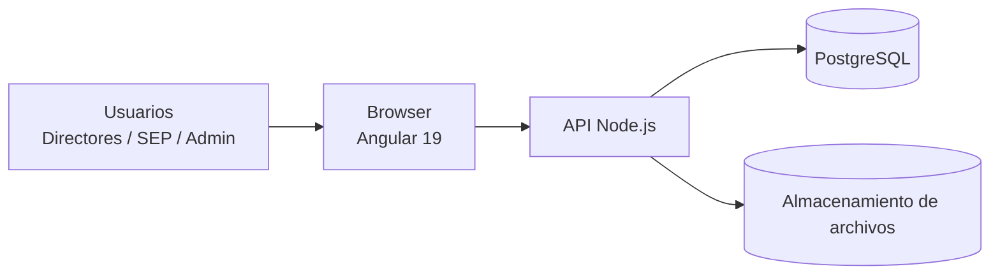

# Documento de Arquitectura de Software (SAD)  
## Plataforma de Gestión de Valoraciones EIA 2025–2026

---

# 1. Introducción

Este documento describe la arquitectura de alto nivel del sistema, las decisiones tecnológicas principales y los componentes esenciales que la conforman.

---

# 2. Visión arquitectónica

El sistema se basa en una arquitectura web de tres capas:

1. **Capa de presentación:** Aplicación Angular 19 desplegada como SPA.
2. **Capa de lógica de negocio:** API en Node.js (framework por definir, p. ej. Express o NestJS).
3. **Capa de datos:** Base de datos PostgreSQL y almacenamiento de archivos.

---

# 3. Vista lógica

## 3.1 Componentes principales

- **Módulo de Autenticación**
  - Inicio de sesión.
  - Gestión de sesiones o tokens.
- **Módulo de Gestión de Archivos**
  - Carga de valoraciones.
  - Descarga de valoraciones.
  - Carga de resultados.
  - Descarga de resultados.
- **Módulo de Validación**
  - Validación de extensión.
  - Validación de columnas obligatorias.
  - Advertencias de valoraciones incompletas.
- **Módulo de Auditoría**
  - Registro de eventos.
  - Consulta de bitácora.
- **Módulo de Administración**
  - Gestión de usuarios.
  - Configuración básica.

---

# 4. Vista de despliegue (Mermaid)

---

# 5. Decisiones tecnológicas clave

- **Backend:** Node.js (framework por definir; candidatos: Express, NestJS).
- **Frontend:** Angular 19.
- **Base de datos:** PostgreSQL.
- **Gestión de archivos:** sistema de archivos del servidor o almacenamiento de objetos (extensible a soluciones en la nube).
- **Protocolos:** HTTP/HTTPS.
- **Autenticación:** basada en sesiones o tokens (por ejemplo, JWT) según se defina en el diseño técnico.

---

# 6. Consideraciones de seguridad

- Todo el tráfico externo se realiza sobre HTTPS.
- Las contraseñas se almacenan de forma cifrada en la base de datos.
- La base de datos sólo es accesible desde la capa de backend.
- Los registros de auditoría son inmutables (no se modifican, sólo se agregan).

---

# 7. Escalabilidad

- El frontend puede servirse desde un servidor estático o CDN.
- El backend en Node.js puede escalarse horizontalmente mediante balanceadores de carga.
- La base de datos se dimensionará para soportar el volumen esperado, con posibilidad de réplica en lectura en etapas posteriores.

