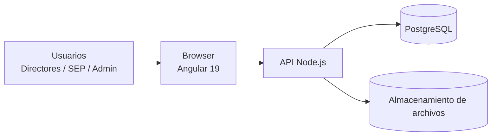
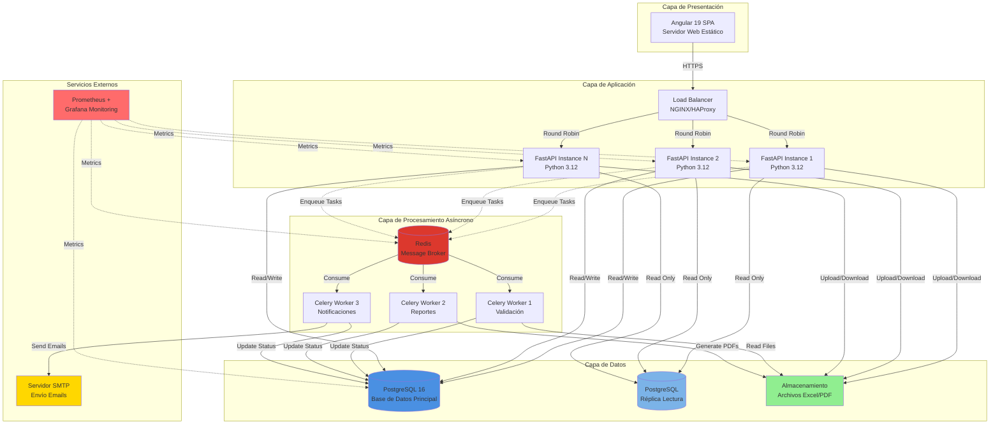

# Documento de Arquitectura de Software (SAD)  

## Plataforma de Gestión de Valoraciones EIA 2025–2026

---

## 1. Introducción

Este documento describe la arquitectura de alto nivel del sistema, las decisiones tecnológicas principales y los componentes esenciales que la conforman.

---

## 2. Visión arquitectónica

El sistema se basa en una arquitectura web de tres capas:

1. **Capa de presentación:** Aplicación Angular 19 desplegada como SPA.
2. **Capa de lógica de negocio:** API en Node.js (framework por definir, p. ej. Express o NestJS).
3. **Capa de datos:** Base de datos PostgreSQL y almacenamiento de archivos.

---

## 3. Vista lógica

### 3.1 Componentes principales

- **Módulo de Autenticación**
  - Inicio de sesión.
  - Gestión de sesiones o tokens.
- **Módulo de Gestión de Archivos**
  - Carga de valoraciones.
  - Descarga de valoraciones.
  - Carga de resultados.
  - Descarga de resultados.
- **Módulo de Validación**
  - Validación de extensión.
  - Validación de columnas obligatorias.
  - Advertencias de valoraciones incompletas.
- **Módulo de Auditoría**
  - Registro de eventos.
  - Consulta de bitácora.
- **Módulo de Administración**
  - Gestión de usuarios.
  - Configuración básica.

---

## 4. Vista de despliegue (Mermaid)

---

## 5. Decisiones tecnológicas clave

- **Backend:** Node.js (framework por definir; candidatos: Express, NestJS).
- **Frontend:** Angular 19.
- **Base de datos:** PostgreSQL.
- **Gestión de archivos:** sistema de archivos del servidor o almacenamiento de objetos (extensible a soluciones en la nube).
- **Protocolos:** HTTP/HTTPS.
- **Autenticación:** basada en sesiones o tokens (por ejemplo, JWT) según se defina en el diseño técnico.

---

## 6. Consideraciones de seguridad

- Todo el tráfico externo se realiza sobre HTTPS.
- Las contraseñas se almacenan de forma cifrada en la base de datos.
- La base de datos sólo es accesible desde la capa de backend.
- Los registros de auditoría son inmutables (no se modifican, sólo se agregan).

---

## 7. Escalabilidad

- El frontend puede servirse desde un servidor estático o CDN.
- El backend en Node.js puede escalarse horizontalmente mediante balanceadores de carga.
- La base de datos se dimensionará para soportar el volumen esperado, con posibilidad de réplica en lectura en etapas posteriores.

---

## 8. Vista de componentes de infraestructura

El siguiente diagrama muestra la arquitectura de componentes de infraestructura del sistema:

### 8.1 Descripción de componentes

#### Capa de Presentación

- **Angular 19 SPA:** Aplicación de página única servida desde servidor web estático o CDN
- **Protocolo:** HTTPS con certificado SSL/TLS

#### Capa de Aplicación

- **Load Balancer:** Distribuye peticiones entre instancias de API (NGINX o HAProxy)
- **FastAPI Instances:** Múltiples instancias para escalamiento horizontal
- **Conexión:** Pool de conexiones a PostgreSQL (máx. 20 por instancia)

#### Capa de Procesamiento Asíncrono

- **Redis:** Message broker para colas de tareas Celery
- **Celery Workers:** Procesamiento paralelo de validaciones, reportes y notificaciones
- **Configuración:** 3-5 workers por tipo de tarea

#### Capa de Datos

- **PostgreSQL 16 (Principal):** Base de datos transaccional principal
- **PostgreSQL (Réplica):** Réplica para consultas de solo lectura (opcional)
- **Almacenamiento:** Sistema de archivos NFS o almacenamiento de objetos (S3-compatible)

#### Servicios Externos

- **SMTP Server:** Servidor de correo para notificaciones (ej: SendGrid, Mailgun)
- **Monitoring:** Prometheus para métricas + Grafana para dashboards

### 8.2 Especificaciones técnicas mínimas

| Componente | CPU | RAM | Almacenamiento | Observaciones |
| ---------- | --- | --- | -------------- | ------------- |
| PostgreSQL | 8 cores | 32 GB | 500 GB SSD | RAID 10 recomendado |
| FastAPI Instance | 4 cores | 8 GB | 50 GB | Escalar según carga |
| Celery Worker | 2 cores | 4 GB | 20 GB | 1 worker por tarea |
| Redis | 2 cores | 8 GB | 20 GB | Persistencia habilitada |
| Almacenamiento | - | - | 2 TB | Crecimiento: ~50 GB/año |

### 8.3 Alta disponibilidad

- **RTO (Recovery Time Objective):** < 2 horas
- **RPO (Recovery Point Objective):** < 15 minutos
- **Backup:** Diario completo + WAL archiving continuo
- **Failover:** Réplica de PostgreSQL con promoción automática
