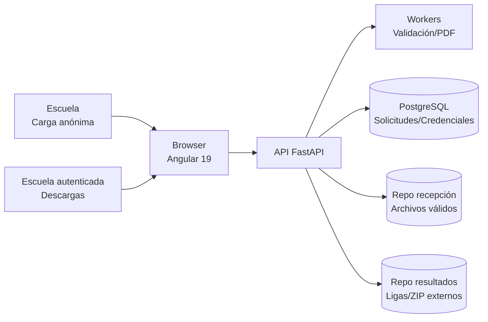

# Documento de Arquitectura de Software (SAD)
## Plataforma de Recepción, Validación y Descarga de Archivos EIA

---

# 1. Introducción

Describe la arquitectura de alto nivel para la plataforma que **recibe archivos .xlsx sin autenticación previa** (solo en el primer envío), los valida automáticamente, genera credenciales en la primera carga válida y publica ligas de descarga generadas por un sistema externo. Si ya existen credenciales para el CCT/correo, los **reenvíos requieren autenticación previa**.

---

# 2. Visión arquitectónica

Arquitectura web de tres capas y procesos desacoplados:

1. **Capa de presentación:** SPA en **Angular 19 (signals)** para carga anónima, descarga de PDFs y portal autenticado de descargas, usando la guía gráfica gob.mx v3 cargada desde CDN. Mientras el backend Python es desarrollado por otro equipo, el frontend operará con servicios simulados y datos de prueba almacenados en memoria/localStorage, manteniendo las mismas interfaces para conmutar a la API real sin cambios.
2. **Capa de lógica de negocio:** API **FastAPI (Python 3.12)** para orquestar validaciones, generación de credenciales y publicación de ligas (implementada por un equipo distinto).
3. **Capa de datos y archivos:** **PostgreSQL** para solicitudes/credenciales y **filesystem SSD** para repositorios separados de recepción y resultados.
4. **Procesamiento asíncrono:** Workers (Redis + RQ/Celery) para validaciones y armado de PDFs.

---

# 3. Vista lógica

## 3.1 Componentes principales

- **Módulo de Recepción Anónima (primer envío)**
  - Carga de archivo .xlsx sin login cuando no existan credenciales previas para el CCT/correo.
  - Mensaje “Validando tu archivo…”.
  - Verificación previa de duplicidad (si ya existen credenciales se bloquea el envío anónimo y la detección de archivo repetido usa hash, no el nombre).
- **Módulo de Reenvío Autenticado**
  - Solicita login cuando el CCT/correo ya registró una primera carga válida.
  - Permite subir nuevos archivos tras autenticarse.
- **Motor de Validación**
  - 10 verificaciones (CCT, correo, nivel, campos/columnas obligatorias, valores 0–3, estructura general, número/nombre de hojas, consistencia interna y **hash de contenido** para diferenciar archivos con el mismo nombre).
  - Rechazo inmediato con PDF de errores cuando falle; si el hash coincide con un envío previo del mismo CCT/correo se notifica que el archivo ya fue recibido.
- **Generador de Credenciales y PDFs**
  - Credenciales solo en primera carga válida (usuario = CCT, contraseña = correo validado).
  - PDFs de confirmación con fecha de consulta (hoy + 4 días) o PDFs de errores.
- **Registro de Solicitudes**
  - Consecutivo por carga válida.
  - Almacenamiento del archivo validado en repositorio de recepción.
- **Módulo de Descargas Autenticadas**
  - Login con CCT + contraseña generada en primera carga válida.
  - Listado de versiones de resultados (consecutivo + liga) depositados por el sistema externo.
  - Reutiliza la autenticación para permitir reenvío de archivos cuando ya existan credenciales.
- **Servicios de integración frontend**
  - Interfaces Angular tipificadas hacia FastAPI para carga, login y descargas.
  - Mientras no exista backend disponible, devuelven datos simulados/localStorage con la misma forma de respuesta que los futuros endpoints.
- **Panel técnico**
  - Monitoreo de logs, espacio en disco y estado de workers.

## 3.2 Componentes y servicios a construir (SPA Angular 19 + FastAPI)

### Frontend (Angular 19 con signals y datos simulados/localStorage)
- **AppShell/Layout gob.mx**: marco general con header, breadcrumbs y contenedor de vistas SPA.
- **Inicio/Carga Anónima**: componente con arrastrar/soltar y selección de archivo; muestra estado (“Validando tu archivo…”) y resumen de reglas; invoca servicio de recepción.
- **Login/Reenvío Autenticado**: formulario CCT + contraseña (correo); controla acceso a reenvíos y portal de descargas.
- **Portal de Descargas**: lista de ligas/artefactos por consecutivo/versión; permite descargar PDFs/ZIP; muestra estados vacíos/errores.
- **Historial/Solicitudes (opcional MVP)**: muestra cargas previas simuladas y el hash almacenado para diferenciar archivos con mismo nombre.
- **Componentes comunes**: alerts, tabla paginada, card de progreso, modal de confirmación, footer institucional.

### Servicios Angular (mocks hoy, API real mañana)
- **AuthService**: login/logout con signals; persiste token simulado/credencial en localStorage manteniendo la interfaz para JWT o sesión real en FastAPI.
- **UploadService**: envía archivos `.xlsx`, calcula hash en cliente para previsualizar duplicados y construye la petición multipart/form-data; hoy responde con mocks/localStorage.
- **ValidationStatusService**: gestiona estados de validación y mensajes (10 reglas, incluido hash) para retroalimentación en UI.
- **DownloadService**: obtiene ligas de resultados (datos simulados) y gestionará descargas autenticadas a FastAPI cuando exista backend.
- **ConfigService**: centraliza URLs base/endpoints (migrable de mocks a dominio FastAPI sin cambiar los componentes).
- **StorageService**: wrapper sobre localStorage para simular persistencia de solicitudes, hashes y credenciales generadas.

### Servicios/Endpoints esperados en FastAPI (referencia para el equipo backend)
- **POST /recepcion**: carga anónima/autenticada de `.xlsx`, aplica 10 reglas y devuelve PDF de confirmación/errores; si el hash ya existe para el mismo CCT/correo, notifica duplicidad.
- **POST /auth/login**: autenticación con CCT/contraseña generada en la primera carga válida.
- **GET /descargas**: lista de ligas/artefactos disponibles para el usuario autenticado.
- **GET /descargas/{id}**: descarga de PDF/ZIP resultante.
- **GET /solicitudes** (opcional): historial de envíos con hash y consecutivo.

---

# 4. Vista de despliegue (Mermaid)

---

# 5. Decisiones tecnológicas clave

- **Frontend:** Angular 19 + TypeScript (signals) con Angular CLI 19.2.x sobre Node 22.x y estilos base gob.mx v3 incluidos vía CDN en `index.html`. Los servicios Angular expondrán interfaces HTTP tipificadas; mientras no exista backend disponible, responderán con datos simulados/localStorage pero sin romper la forma de los endpoints.
- **Backend:** Python 3.12 + FastAPI (desarrollado por un equipo distinto; la integración del frontend será transparente gracias a la capa de servicios simulados).
- **Workers:** Redis + RQ/Celery para validación y generación de PDFs.
- **Persistencia:** PostgreSQL (datos) + Filesystem SSD (archivos válidos y resultados).
- **Generación de PDF:** WeasyPrint/ReportLab o librería equivalente en Python.
- **Validación de Excel:** pandas + openpyxl.
- **Protocolos:** HTTPS obligatorio.

---

# 6. Consideraciones de seguridad

- Hashing de contraseñas generadas (no se almacenan en texto plano).
- Repositorios de archivos con controles de acceso segregados (recepción vs. resultados).
- Bitácora de accesos y operaciones de validación/descarga.
- Certificados TLS para todo el tráfico externo.

---

# 7. Escalabilidad y disponibilidad

- Workers horizontales para paralelizar validaciones y PDFs.
- Posibilidad de crecer almacenamiento sin interrumpir servicio (mínimo 1 TB inicial).
- Separación de repositorios evita contención entre cargas y descargas.
- Balanceo de carga sobre FastAPI si incrementa el volumen (objetivo: 120,000 validaciones).
