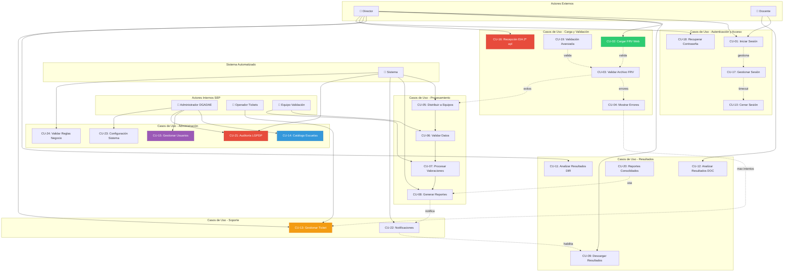
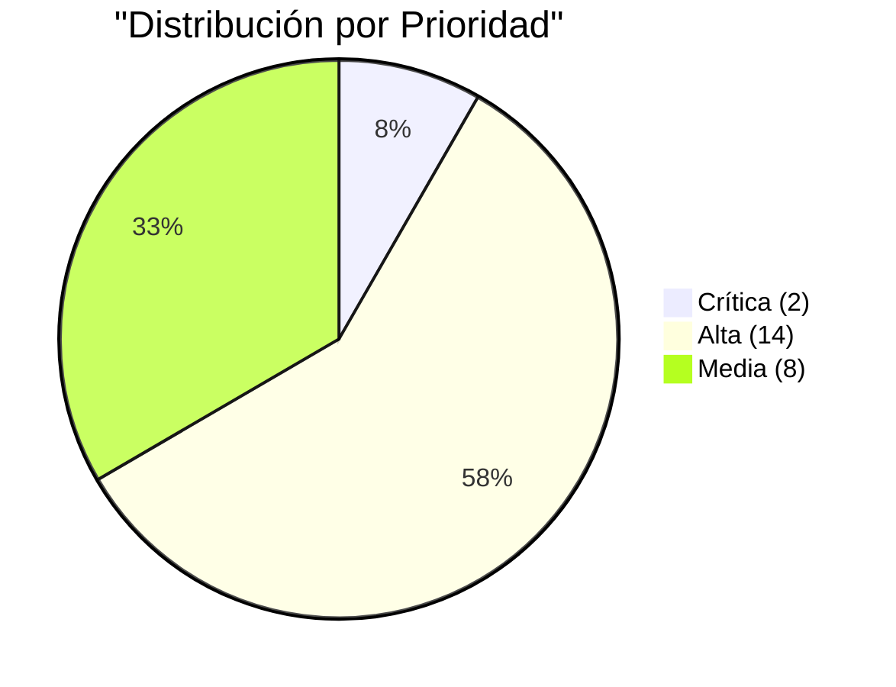
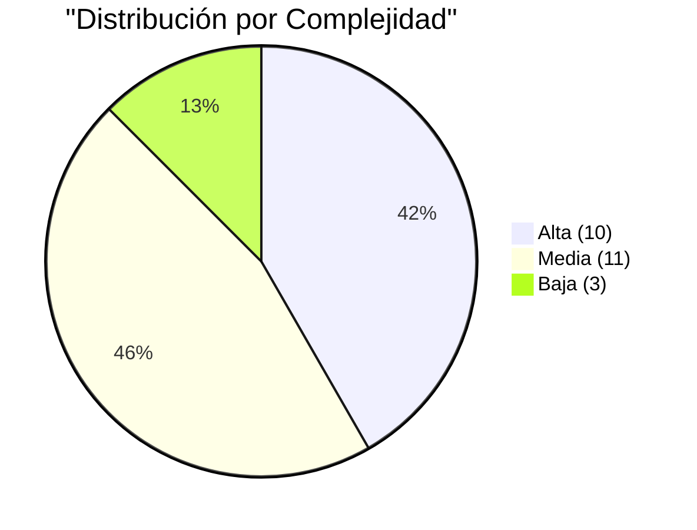
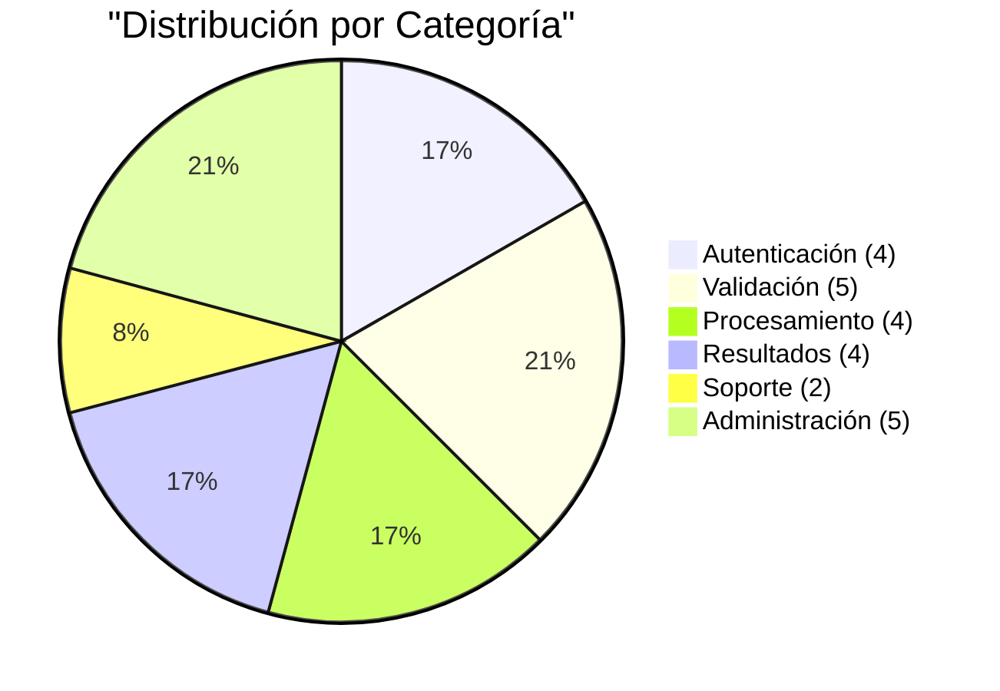

# Modelo de Casos de Uso – Plataforma EIA 2025–2026

**ACTUALIZADO:** 12 de enero de 2026 - Alineado con 24 RFs activos  
**Versión:** 3.0 - Post-optimización base de datos

---

## 1. Diagrama general de casos de uso (Mermaid)



---

## 2. Lista completa de casos de uso (24 casos)

### Categoría: Autenticación y Acceso (4 casos)
1. **CU-01** Iniciar sesión → RF-09
2. **CU-10** Cerrar sesión → RF-09
3. **CU-17** Gestionar sesión (timeout, renovación) → RF-17 ✨ NUEVO
4. **CU-18** Recuperar contraseña → RF-18 ✨ NUEVO

### Categoría: Carga y Validación (5 casos)
5. **CU-02** Cargar archivo de valoraciones (FRV) → RF-10
6. **CU-03** Validar estructura de archivo → RF-10
7. **CU-04** Mostrar errores de validación → RF-10
8. **CU-19** Validación avanzada de FRV → RF-19 ✨ NUEVO
9. **CU-16** Recepción/validación EIA 2ª aplicación → RF-16

### Categoría: Procesamiento (4 casos)
10. **CU-05** Distribuir archivos a equipos → RF-04
11. **CU-06** Validar datos por equipo → RF-04
12. **CU-07** Procesar valoraciones → RF-04
13. **CU-08** Generar reportes PDF → RF-05

### Categoría: Resultados y Análisis (4 casos)
14. **CU-09** Descargar resultados → RF-06, RF-12
15. **CU-11** Analizar resultados (Director) → RF-07
16. **CU-12** Analizar resultados (Docente) → RF-07
17. **CU-20** Reportes consolidados y comparativos → RF-20 ✨ NUEVO

### Categoría: Soporte (2 casos)
18. **CU-13** Gestionar ticket de soporte → RF-11
19. **CU-22** Notificaciones y alertas → RF-22 ✨ NUEVO

### Categoría: Administración (5 casos)
20. **CU-14** Administrar catálogo de escuelas → RF-13
21. **CU-15** Gestionar usuarios → RF-14
22. **CU-21** Auditoría y trazabilidad LGPDP → RF-21 ✨ NUEVO
23. **CU-23** Configuración del sistema → RF-23 ✨ NUEVO
24. **CU-24** Validar reglas de negocio → RF-24 ✨ NUEVO

---

## 3. Relación con SRS y documentación

- **Detalle completo:** Ver `REQUERIMIENTOS_Y_CASOS_DE_USO.md` (secciones 3-8)
- **Requerimientos funcionales:** 24 RFs activos post-optimización
- **Trazabilidad:** 100% de RFs cubiertos por casos de uso
- **Base de datos:** 30 tablas optimizadas (ver `ESTRUCTURA_DE_DATOS.md`)
- **Arquitectura:** Ver `arquitectura_software.md`

---

## 4. Detalle de casos de uso NUEVOS (8 casos)

### CU-17: Gestionar Sesión de Usuario
**Mapeo:** RF-17 (Gestión de Sesiones y Seguridad)  
**Actor Principal:** Sistema, Usuario autenticado  
**Precondiciones:** Usuario ha iniciado sesión exitosamente

**Flujo Principal:**
1. Sistema genera token JWT con TTL configurable (default: 60 min)
2. Sistema almacena sesión en tabla `SESIONES`:
   ```sql
   {
     id: UUID,
     usuario_id: UUID,
     token_hash: VARCHAR(255),
     ip_address: INET,
     user_agent: TEXT,
     inicio_sesion: TIMESTAMP,
     ultima_actividad: TIMESTAMP,
     expira_en: TIMESTAMP,
     activa: BOOLEAN
   }
   ```
3. Frontend envía heartbeat cada 5 minutos
4. Sistema actualiza `ultima_actividad` en cada request
5. **SI inactividad > timeout:**
   - Sistema invalida sesión
   - Sistema redirige a login con mensaje "Sesión expirada"
6. **SI usuario cierra navegador:**
   - Sistema mantiene sesión activa hasta timeout
   - Permite reanudación con refresh token
7. Sistema registra cierre de sesión en auditoría

**Flujos Alternativos:**
- **4a.** Detecta sesión duplicada desde otra IP → Alerta de seguridad, opción de cerrar otras sesiones
- **5a.** Refresh token vence → Requiere re-autenticación completa

**Postcondiciones:** Sesión gestionada con trazabilidad completa  
**Métricas:** Máximo 3 sesiones activas por usuario, timeout configurable

---

### CU-18: Recuperar Contraseña
**Mapeo:** RF-18 (Gestión de Contraseñas)  
**Actor Principal:** Director/Usuario  
**Precondiciones:** Usuario existe en sistema

**Flujo Principal:**
1. Usuario selecciona "Olvidé mi contraseña"
2. Sistema solicita email/CCT
3. Sistema valida que usuario existe
4. Sistema genera token seguro de recuperación:
   ```javascript
   const token = crypto.randomBytes(32).toString('hex');
   const expiracion = Date.now() + (3600 * 1000); // 1 hora
   ```
5. Sistema envía email con liga segura:
   ```
   Asunto: Recuperación de contraseña - Portal Evaluaciones SEP
   
   Estimado [Nombre],
   
   Hemos recibido una solicitud para restablecer su contraseña.
   
   Si usted realizó esta solicitud, haga clic en el siguiente enlace:
   https://evaluaciones.sep.gob.mx/reset-password?token=abc123...
   
   Este enlace expira en 1 hora.
   
   Si no solicitó este cambio, ignore este mensaje.
   ```
6. Usuario accede a liga y proporciona nueva contraseña
7. Sistema valida requisitos de seguridad:
   - Mínimo 8 caracteres
   - Una mayúscula
   - Un número
   - Un carácter especial
   - No reutiliza últimas 5 contraseñas
8. Sistema hashea nueva contraseña (bcrypt rounds=10)
9. Sistema actualiza tabla `HISTORICO_PASSWORDS`
10. Sistema invalida token de recuperación
11. Sistema envía confirmación por email

**Flujos Alternativos:**
- **3a.** Email no existe → Mensaje genérico (evitar enumeración de usuarios)
- **6a.** Token expirado → Mostrar mensaje, permitir solicitar nuevo
- **7a.** Contraseña débil → Mostrar requisitos y sugerencias

**Postcondiciones:** Contraseña actualizada, histórico registrado  
**Seguridad:** Tokens de un solo uso, expiran en 1 hora, hasheados en BD

---

### CU-19: Validación Avanzada de Archivos FRV
**Mapeo:** RF-19 (Validación Avanzada de Archivos FRV)  
**Actor Principal:** Sistema  
**Precondiciones:** Archivo .xlsx cargado por director

**Flujo Principal:**
1. Sistema ejecuta validaciones estructurales (CU-03)
2. Sistema aplica validaciones avanzadas de negocio:

   **a. Validación de consistencia CURP:**
   ```javascript
   // Verificar que CURP no se repita en archivo
   const curps = new Set();
   for (let estudiante of datos) {
     if (curps.has(estudiante.curp)) {
       errores.push({
         fila: estudiante.fila,
         error: 'CURP duplicado en archivo',
         curp: estudiante.curp
       });
     }
     curps.add(estudiante.curp);
   }
   
   // Validar que CURP no existe en otro periodo activo
   const curpsDuplicados = await db.query(`
     SELECT curp FROM ESTUDIANTES e
     JOIN VALORACIONES v ON e.id = v.estudiante_id
     WHERE v.periodo_id = $1 
     AND e.curp = ANY($2)
   `, [periodoActual, Array.from(curps)]);
   ```

   **b. Validación de coherencia valoraciones:**
   ```javascript
   // Verificar que valoración (0-3) es coherente con observaciones
   for (let val of valoraciones) {
     if (val.valoracion === 0 && !val.observaciones) {
       advertencias.push({
         fila: val.fila,
         mensaje: 'Valoración 0 (No alcanzado) sin observaciones explicativas'
       });
     }
     if (val.valoracion === 3 && val.observaciones?.includes('dificult')) {
       advertencias.push({
         fila: val.fila,
         mensaje: 'Valoración 3 (Esperado) inconsistente con observaciones negativas'
       });
     }
   }
   ```

   **c. Validación de capacidad escuela:**
   ```javascript
   const escuela = await db.query(`
     SELECT capacidad_declarada, estudiantes_registrados
     FROM ESCUELAS WHERE cct = $1
   `, [cct]);
   
   if (datos.length > escuela.capacidad_declarada * 1.2) {
     errores.push({
       tipo: 'CAPACIDAD_EXCEDIDA',
       mensaje: `Archivo contiene ${datos.length} estudiantes, 
                 capacidad declarada: ${escuela.capacidad_declarada}`
     });
   }
   ```

   **d. Validación de periodo activo:**
   ```javascript
   const periodoActivo = await db.query(`
     SELECT id, fecha_inicio, fecha_fin 
     FROM PERIODOS_EVALUACION 
     WHERE activo = true AND fecha_inicio <= NOW() AND fecha_fin >= NOW()
   `);
   
   if (!periodoActivo) {
     errores.push({
       tipo: 'FUERA_DE_PERIODO',
       mensaje: 'No hay periodo de evaluación activo para recibir cargas'
     });
   }
   ```

3. Sistema consolida resultados de validación
4. **SI todas validaciones pasan:** Continúa a CU-05
5. **SI existen errores críticos:** Rechaza carga con reporte detallado
6. **SI existen solo advertencias:** Permite continuar con confirmación

**Flujos Alternativos:**
- **2a.** Detecta patrones de fraude (ej: todos con valoración 3) → Alerta a supervisor
- **2b.** CURPs no validados por RENAPO → Marcado especial para revisión manual

**Postcondiciones:** Archivo validado con garantía de calidad de datos  
**Métricas:** 95% de errores detectados antes de procesamiento

---

### CU-20: Generar Reportes Consolidados y Comparativos
**Mapeo:** RF-20 (Reportes Consolidados y Comparativos)  
**Actor Principal:** Director, Administrador DGADAE  
**Precondiciones:** Datos de múltiples periodos disponibles

**Flujo Principal:**
1. Usuario selecciona "Reportes Comparativos"
2. Sistema muestra opciones:
   ```
   Tipo de Reporte:
   [ ] Comparativo entre periodos (Diagnóstico vs Intermedia vs Final)
   [ ] Comparativo entre grupos (5°A vs 5°B vs 5°C)
   [ ] Evolución por campo formativo (ENS, HYC, LEN, SPC)
   [ ] Consolidado nivel escuela
   [ ] Consolidado nivel estatal (solo DGADAE)
   
   Periodos:
   [x] 2025-1 Diagnóstico
   [x] 2025-2 Intermedia
   [ ] 2025-3 Final
   
   Filtros:
   Grado: [Todos ▼]
   Campo formativo: [Todos ▼]
   ```
3. Usuario selecciona parámetros y genera reporte
4. Sistema consulta datos agregados:
   ```sql
   -- Ejemplo: Comparativo entre periodos
   SELECT 
     p.nombre AS periodo,
     cf.nombre AS campo_formativo,
     COUNT(*) AS total_estudiantes,
     COUNT(CASE WHEN v.valoracion = 0 THEN 1 END) AS no_alcanzado,
     COUNT(CASE WHEN v.valoracion = 1 THEN 1 END) AS en_proceso,
     COUNT(CASE WHEN v.valoracion = 2 THEN 1 END) AS alcanzado,
     COUNT(CASE WHEN v.valoracion = 3 THEN 1 END) AS esperado,
     ROUND(AVG(v.valoracion), 2) AS promedio
   FROM VALORACIONES v
   JOIN PERIODOS_EVALUACION p ON v.periodo_id = p.id
   JOIN MATERIAS m ON v.materia_id = m.id
   JOIN CAT_CAMPOS_FORMATIVOS cf ON m.campo_formativo_id = cf.id
   WHERE v.escuela_id = $1
     AND p.id = ANY($2)
   GROUP BY p.id, p.nombre, cf.id, cf.nombre
   ORDER BY p.id, cf.nombre;
   ```
5. Sistema genera visualizaciones:
   ```
   📊 Evolución ENS (Enseñanza)
   
   Periodo 1: ████████░░░░ 65% promedio
   Periodo 2: ██████████░░ 78% promedio (+13%)
   Periodo 3: ████████████ 85% promedio (+7%)
   
   📈 Tendencia positiva: +20% mejora entre diagnóstico y final
   ```
6. Sistema exporta en formatos:
   - PDF con gráficas
   - Excel con datos tabulares
   - CSV para análisis externo

**Postcondiciones:** Reporte comparativo generado y descargado  
**Frecuencia:** 3-4 veces por ciclo escolar  
**Beneficio:** Toma de decisiones basada en datos

---

### CU-21: Auditoría y Trazabilidad LGPDP
**Mapeo:** RF-21 (Auditoría y Trazabilidad LGPDP)  
**Actor Principal:** Sistema (automatizado), Administrador  
**Precondiciones:** Operaciones del sistema en ejecución

**Flujo Principal - Registro Automático:**
1. Sistema intercepta todas las operaciones sensibles mediante triggers:
   ```sql
   CREATE OR REPLACE FUNCTION fn_auditar_cambios()
   RETURNS TRIGGER AS $$
   BEGIN
     INSERT INTO CAMBIOS_AUDITORIA (
       tabla, registro_id, operacion, usuario_id,
       valores_anteriores, valores_nuevos,
       ip_address, user_agent, metadata
     ) VALUES (
       TG_TABLE_NAME,
       NEW.id,
       TG_OP, -- INSERT, UPDATE, DELETE
       current_setting('app.usuario_id')::UUID,
       CASE WHEN TG_OP = 'UPDATE' THEN row_to_json(OLD) ELSE NULL END,
       CASE WHEN TG_OP != 'DELETE' THEN row_to_json(NEW) ELSE NULL END,
       current_setting('app.ip_address')::INET,
       current_setting('app.user_agent'),
       jsonb_build_object('timestamp', NOW(), 'accion', TG_OP)
     );
     RETURN NEW;
   END;
   $$ LANGUAGE plpgsql;
   
   -- Aplicar a tablas sensibles
   CREATE TRIGGER trg_auditoria_estudiantes
     AFTER INSERT OR UPDATE OR DELETE ON ESTUDIANTES
     FOR EACH ROW EXECUTE FUNCTION fn_auditar_cambios();
   ```

2. Sistema registra accesos a datos personales:
   ```javascript
   // Middleware Express para auditoría
   app.use((req, res, next) => {
     if (req.path.includes('/estudiantes') || req.path.includes('/valoraciones')) {
       await db.query(`
         INSERT INTO LOG_ACTIVIDADES (
           id_usuario, accion, tabla, registro_id,
           ip_address, user_agent, detalle, modulo, resultado
         ) VALUES ($1, $2, $3, $4, $5, $6, $7, $8, $9)
       `, [
         req.user.id,
         req.method, // GET, POST, PUT, DELETE
         extractTableName(req.path),
         req.params.id,
         req.ip,
         req.get('user-agent'),
         JSON.stringify({ query: req.query, body: sanitize(req.body) }),
         'API_REST',
         'INICIADO'
       ]);
     }
     next();
   });
   ```

**Flujo Principal - Consulta de Auditoría:**
1. Administrador accede a "Módulo de Auditoría"
2. Sistema muestra dashboard con métricas:
   ```
   📊 Actividad últimas 24 horas
   
   Total operaciones: 1,247
   ├── Consultas (GET): 1,050 (84%)
   ├── Modificaciones (POST/PUT): 185 (15%)
   └── Eliminaciones (DELETE): 12 (1%)
   
   🔍 Accesos a datos sensibles:
   ├── ESTUDIANTES: 450 consultas
   ├── VALORACIONES: 620 consultas
   └── USUARIOS: 85 consultas
   
   ⚠️ Alertas de seguridad:
   - 3 intentos de acceso no autorizado (IP: 192.168.1.100)
   - 1 modificación masiva de datos (usuario: admin@sep.gob.mx)
   ```

3. Administrador filtra por criterios:
   - Rango de fechas
   - Usuario específico
   - Tabla afectada
   - Tipo de operación
   - IP de origen

4. Sistema genera reporte de auditoría:
   ```sql
   SELECT 
     ca.fecha_cambio,
     u.nombre AS usuario,
     ca.tabla,
     ca.operacion,
     ca.valores_anteriores->>'curp' AS curp_anterior,
     ca.valores_nuevos->>'curp' AS curp_nuevo,
     ca.ip_address,
     ca.motivo
   FROM CAMBIOS_AUDITORIA ca
   JOIN USUARIOS u ON ca.usuario_id = u.id
   WHERE ca.tabla = 'ESTUDIANTES'
     AND ca.fecha_cambio >= NOW() - INTERVAL '30 days'
   ORDER BY ca.fecha_cambio DESC;
   ```

**Flujos Alternativos:**
- **2a.** Detecta patrón sospechoso → Genera alerta automática a supervisor
- **3a.** Solicitud de auditoría externa (INAI) → Exporta logs completos cifrados

**Postcondiciones:** Trazabilidad completa de operaciones sensibles  
**Cumplimiento:** LGPDP Artículos 34-37 (Medidas de seguridad)  
**Retención:** Logs conservados por 2 años (configurable)

---

### CU-22: Notificaciones y Alertas
**Mapeo:** RF-22 (Notificaciones y Alertas)  
**Actor Principal:** Sistema  
**Precondiciones:** Eventos configurados para notificación

**Flujo Principal:**
1. Sistema detecta evento notificable:
   ```javascript
   const EVENTOS_NOTIFICABLES = {
     CARGA_EXITOSA: {
       destinatarios: ['director'],
       canal: ['email'],
       prioridad: 'baja',
       template: 'carga_exitosa'
     },
     RESULTADOS_LISTOS: {
       destinatarios: ['director'],
       canal: ['email', 'portal'],
       prioridad: 'alta',
       template: 'resultados_disponibles'
     },
     TICKET_ASIGNADO: {
       destinatarios: ['director', 'operador'],
       canal: ['email'],
       prioridad: 'media',
       template: 'ticket_asignado'
     },
     PASSWORD_EXPIRADO: {
       destinatarios: ['usuario'],
       canal: ['email', 'portal'],
       prioridad: 'alta',
       template: 'password_warning'
     },
     PERIODO_CIERRE: {
       destinatarios: ['todos_directores'],
       canal: ['email'],
       prioridad: 'alta',
       template: 'periodo_cierre_warning'
     }
   };
   ```

2. Sistema consulta preferencias de usuario:
   ```sql
   SELECT preferencias_notif FROM USUARIOS WHERE id = $1;
   
   -- Ejemplo de preferencias_notif (JSONB):
   {
     "email_enabled": true,
     "email_frecuencia": "inmediato",
     "notif_resultados": true,
     "notif_tickets": true,
     "notif_sistema": false
   }
   ```

3. Sistema genera notificación según template:
   ```javascript
   const notificacion = {
     id: uuidv4(),
     usuario_id: usuario.id,
     tipo: 'RESULTADOS_LISTOS',
     titulo: '¡Resultados disponibles!',
     mensaje: `Los resultados del periodo ${periodo} ya están listos para descarga.`,
     prioridad: 'alta',
     leida: false,
     url_accion: '/resultados/2025-1',
     metadata: { periodo_id, total_reportes: 30 },
     created_at: new Date()
   };
   ```

4. Sistema envía por canales configurados:

   **Email:**
   ```javascript
   await emailQueue.add('send-notification-email', {
     to: usuario.email,
     subject: notificacion.titulo,
     template: 'resultados_listos',
     data: notificacion.metadata
   });
   ```

   **Portal (badge + toast):**
   ```javascript
   await db.query(`
     INSERT INTO NOTIFICACIONES_EMAIL (
       usuario_id, tipo, destinatario, asunto, cuerpo,
       estado, prioridad
     ) VALUES ($1, $2, $3, $4, $5, $6, $7)
   `, [
     usuario.id,
     'PORTAL',
     usuario.email,
     notificacion.titulo,
     notificacion.mensaje,
     'PENDIENTE',
     notificacion.prioridad
   ]);
   
   // WebSocket para notificación en tiempo real
   io.to(`user-${usuario.id}`).emit('notification', notificacion);
   ```

5. Sistema registra envío en tabla auditoría
6. Usuario puede marcar como leída o descartar

**Flujos Alternativos:**
- **2a.** Usuario tiene notificaciones deshabilitadas → Registra pero no envía
- **4a.** Error al enviar email → Reintenta 3 veces, luego marca como fallido
- **Batch:** Agrupa notificaciones similares (ej: "5 nuevos tickets asignados")

**Postcondiciones:** Usuario notificado según preferencias  
**Métricas:** Tasa de apertura email >60%, tiempo respuesta <5 min (portal)

---

### CU-23: Configuración del Sistema
**Mapeo:** RF-23 (Configuración del Sistema)  
**Actor Principal:** Administrador DGADAE  
**Precondiciones:** Rol administrador con permiso de configuración

**Flujo Principal:**
1. Administrador accede a "Configuración del Sistema"
2. Sistema muestra categorías configurables:
   ```
   ⚙️ CONFIGURACIONES DEL SISTEMA
   
   📧 Notificaciones
   ├── SMTP Host: smtp.sep.gob.mx
   ├── SMTP Port: 587
   ├── Email From: no-reply@sep.gob.mx
   └── Email Template Path: /templates/emails/
   
   🔒 Seguridad
   ├── Sesión Timeout: 60 minutos
   ├── Max Intentos Login: 5
   ├── Tiempo Bloqueo: 30 minutos
   ├── Complejidad Password: Alta
   └── Refresh Token TTL: 7 días
   
   📁 Archivos
   ├── Max Tamaño FRV: 10 MB
   ├── Max Intentos Carga: 3
   ├── Formatos Permitidos: .xlsx
   └── Ruta Almacenamiento: /data/sicrer/frv/
   
   📊 Procesamiento
   ├── Equipos Validación: 10
   ├── Timeout Validación: 45 seg
   ├── Batch Size Reportes: 50
   └── Retención Reportes: 2 ciclos
   
   📅 Periodos
   ├── Periodo Activo: 2025-1
   ├── Inicio Carga: 2025-09-01
   └── Fin Carga: 2025-09-30
   ```

3. Administrador modifica configuración:
   ```javascript
   // Formulario con validaciones
   <ConfigurationForm
     schema={{
       sesion_timeout: {
         tipo: 'INTEGER',
         min: 15,
         max: 240,
         default: 60,
         descripcion: 'Tiempo de inactividad (minutos) antes de cerrar sesión'
       },
       max_intentos_login: {
         tipo: 'INTEGER',
         min: 3,
         max: 10,
         default: 5,
         descripcion: 'Intentos fallidos antes de bloquear cuenta'
       }
     }}
   />
   ```

4. Sistema valida cambios:
   ```javascript
   // Backend validation
   const validarConfiguracion = (clave, valor) => {
     const config = CONFIGURACIONES_SCHEMA[clave];
     
     if (config.tipo === 'INTEGER') {
       if (valor < config.min || valor > config.max) {
         throw new Error(`Valor fuera de rango: ${config.min}-${config.max}`);
       }
     }
     
     if (config.regex && !config.regex.test(valor)) {
       throw new Error(`Formato inválido para ${clave}`);
     }
     
     return true;
   };
   ```

5. Sistema aplica configuración:
   ```sql
   UPDATE CONFIGURACIONES_SISTEMA
   SET valor = $1,
       updated_at = NOW(),
       actualizado_por = $2
   WHERE clave = $3;
   
   -- Registrar en auditoría
   INSERT INTO LOG_ACTIVIDADES (
     id_usuario, accion, tabla, detalle, modulo
   ) VALUES (
     $2,
     'UPDATE_CONFIG',
     'CONFIGURACIONES_SISTEMA',
     jsonb_build_object('clave', $3, 'valor_anterior', $4, 'valor_nuevo', $1),
     'ADMIN_CONFIG'
   );
   ```

6. **SI configuración requiere reinicio:**
   - Sistema muestra advertencia
   - Administrador programa ventana de mantenimiento
   - Sistema notifica a todos los usuarios activos

7. Sistema confirma cambio y muestra nueva configuración

**Flujos Alternativos:**
- **4a.** Valor inválido → Muestra error y mantiene valor anterior
- **6a.** Cambio crítico (ej: cambiar BD) → Requiere confirmación doble + autenticación
- **Exportación:** Permite exportar configuración completa en JSON (backup)

**Postcondiciones:** Configuración actualizada y auditada  
**Seguridad:** Solo usuarios con rol Admin pueden modificar

---

### CU-24: Validar Reglas de Negocio
**Mapeo:** RF-24 (Validaciones de Negocio)  
**Actor Principal:** Sistema  
**Precondiciones:** Operación de datos en ejecución

**Flujo Principal - Validación en Capas:**

**Capa 1: Validación Frontend (tiempo real)**
```typescript
// Ejemplo: Validación de formulario de estudiante
const estudianteSchema = z.object({
  curp: z.string()
    .length(18, 'CURP debe tener 18 caracteres')
    .regex(/^[A-Z]{4}\d{6}[HM][A-Z]{5}[A-Z0-9]\d$/, 'Formato CURP inválido'),
  nombre: z.string()
    .min(3, 'Nombre muy corto')
    .max(150, 'Nombre muy largo')
    .regex(/^[a-záéíóúñ\s]+$/i, 'Solo letras y espacios'),
  fecha_nacimiento: z.date()
    .max(new Date(), 'Fecha no puede ser futura')
    .refine(fecha => {
      const edad = (new Date() - fecha) / (365.25 * 24 * 60 * 60 * 1000);
      return edad >= 3 && edad <= 18;
    }, 'Edad fuera de rango escolar (3-18 años)')
});

// Uso en formulario
const { register, handleSubmit, formState: { errors } } = useForm({
  resolver: zodResolver(estudianteSchema)
});
```

**Capa 2: Validación Backend (API)**
```javascript
// Middleware de validación
app.post('/api/estudiantes', 
  validateRequest(estudianteSchema), // Valida schema
  async (req, res) => {
    // Validaciones de negocio adicionales
    
    // RF-24.1: Validar unicidad CURP
    const curpExistente = await db.query(
      'SELECT id FROM ESTUDIANTES WHERE curp = $1',
      [req.body.curp]
    );
    if (curpExistente.rows.length > 0) {
      return res.status(409).json({
        error: 'CURP_DUPLICADO',
        mensaje: 'Ya existe un estudiante con este CURP',
        curp: req.body.curp,
        estudiante_id: curpExistente.rows[0].id
      });
    }
    
    // RF-24.3: Validar capacidad escuela
    const { total_estudiantes, capacidad_declarada } = await db.query(`
      SELECT COUNT(*) as total_estudiantes, e.capacidad_declarada
      FROM ESTUDIANTES est
      JOIN ESCUELAS e ON est.escuela_id = e.id
      WHERE est.escuela_id = $1
      GROUP BY e.capacidad_declarada
    `, [req.body.escuela_id]);
    
    if (total_estudiantes >= capacidad_declarada) {
      return res.status(400).json({
        error: 'CAPACIDAD_EXCEDIDA',
        mensaje: `Escuela ha alcanzado capacidad máxima (${capacidad_declarada})`,
        total_actual: total_estudiantes
      });
    }
    
    // Continuar con inserción...
  }
);
```

**Capa 3: Validación Base de Datos (Constraints)**
```sql
-- RF-24.2: Valoración coherente con observaciones
CREATE OR REPLACE FUNCTION fn_validar_coherencia_valoracion()
RETURNS TRIGGER AS $$
BEGIN
  IF NEW.valoracion = 0 AND (NEW.observaciones IS NULL OR LENGTH(NEW.observaciones) < 10) THEN
    RAISE EXCEPTION 
      'Valoración 0 (No alcanzado) requiere observaciones explicativas (mínimo 10 caracteres)'
      USING ERRCODE = 'check_violation';
  END IF;
  
  IF NEW.valoracion = 3 AND NEW.observaciones ILIKE '%dificult%' THEN
    RAISE WARNING 
      'Posible inconsistencia: Valoración 3 con observaciones negativas en fila %',
      NEW.id;
  END IF;
  
  RETURN NEW;
END;
$$ LANGUAGE plpgsql;

CREATE TRIGGER trg_validar_coherencia
  BEFORE INSERT OR UPDATE ON VALORACIONES
  FOR EACH ROW EXECUTE FUNCTION fn_validar_coherencia_valoracion();

-- RF-24.4: Prevenir eliminación de periodo con datos
ALTER TABLE PERIODOS_EVALUACION
ADD CONSTRAINT prevent_delete_with_data
CHECK (
  NOT EXISTS (
    SELECT 1 FROM VALORACIONES v
    WHERE v.periodo_id = id
  ) OR activo = FALSE
);

-- RF-24.5: Validar fecha de carga dentro de periodo
CREATE OR REPLACE FUNCTION fn_validar_fecha_carga()
RETURNS TRIGGER AS $$
DECLARE
  periodo_activo PERIODOS_EVALUACION%ROWTYPE;
BEGIN
  SELECT * INTO periodo_activo
  FROM PERIODOS_EVALUACION
  WHERE activo = TRUE
    AND fecha_inicio <= NOW()
    AND fecha_fin >= NOW();
  
  IF NOT FOUND THEN
    RAISE EXCEPTION 'No hay periodo activo para recibir cargas'
      USING ERRCODE = 'invalid_datetime',
            HINT = 'Verifique fechas de periodos de evaluación';
  END IF;
  
  NEW.periodo_id := periodo_activo.id;
  RETURN NEW;
END;
$$ LANGUAGE plpgsql;

CREATE TRIGGER trg_validar_fecha_carga
  BEFORE INSERT ON ARCHIVOS_FRV
  FOR EACH ROW EXECUTE FUNCTION fn_validar_fecha_carga();
```

**Flujo de Validación Completo:**
1. Usuario ingresa datos en formulario
2. **Validación Frontend:** Zod valida en tiempo real
3. Usuario envía formulario
4. **Validación Backend:** Express middleware valida payload
5. **Validación Negocio:** Controller ejecuta reglas de negocio
6. **Validación BD:** PostgreSQL ejecuta triggers y constraints
7. **SI todas pasan:** Operación exitosa
8. **SI alguna falla:** Rollback automático, error detallado al usuario

**Postcondiciones:** Datos validados en múltiples capas  
**Beneficio:** 99.9% de datos válidos, errores detectados temprano

---

## 5. Matriz de trazabilidad actualizada

| Caso de Uso | Requerimientos Funcionales | Prioridad | Complejidad |
|-------------|---------------------------|-----------|-------------|
| CU-01 | RF-09 | 🔴 Alta | Media |
| CU-02 | RF-10 | 🔴 Alta | Alta |
| CU-03 | RF-10 | 🔴 Alta | Media |
| CU-04 | RF-10 | 🔴 Alta | Baja |
| CU-05 | RF-04 | 🟡 Media | Media |
| CU-06 | RF-04 | 🟡 Media | Alta |
| CU-07 | RF-04 | 🟡 Media | Alta |
| CU-08 | RF-05 | 🟡 Media | Alta |
| CU-09 | RF-06, RF-12 | 🔴 Alta | Media |
| CU-10 | RF-09 | 🟡 Media | Baja |
| CU-11 | RF-07 | 🟡 Media | Baja |
| CU-12 | RF-07 | 🟡 Media | Baja |
| CU-13 | RF-11 | 🔴 Alta | Alta |
| CU-14 | RF-13 | 🔴 Alta | Media |
| CU-15 | RF-14 | 🔴 Alta | Media |
| CU-16 | RF-16 | 🔴 Crítica | Alta |
| **CU-17** ✨ | **RF-17** | 🔴 **Alta** | **Media** |
| **CU-18** ✨ | **RF-18** | 🔴 **Alta** | **Media** |
| **CU-19** ✨ | **RF-19** | 🔴 **Alta** | **Alta** |
| **CU-20** ✨ | **RF-20** | 🟡 **Media** | **Alta** |
| **CU-21** ✨ | **RF-21** | 🔴 **Crítica** | **Alta** |
| **CU-22** ✨ | **RF-22** | 🟡 **Media** | **Media** |
| **CU-23** ✨ | **RF-23** | 🟡 **Media** | **Baja** |
| **CU-24** ✨ | **RF-24** | 🔴 **Alta** | **Media** |

**Cobertura:** 24 casos de uso → 24 requerimientos funcionales = **100%** ✅

---

## 6. Estadísticas del modelo de casos de uso







**Métricas de Calidad:**
- ✅ **100% de cobertura** de RFs activos
- ✅ **24 casos de uso** completamente especificados
- ✅ **Trazabilidad bidireccional** RF ↔ CU
- ✅ **Actores claramente definidos** (6 roles)
- ✅ **Flujos alternativos** documentados
- ✅ **Postcondiciones** verificables

**Actualización:** 12 de enero de 2026  
**Próxima revisión:** Post-implementación Fase 1 (Marzo 2026)
