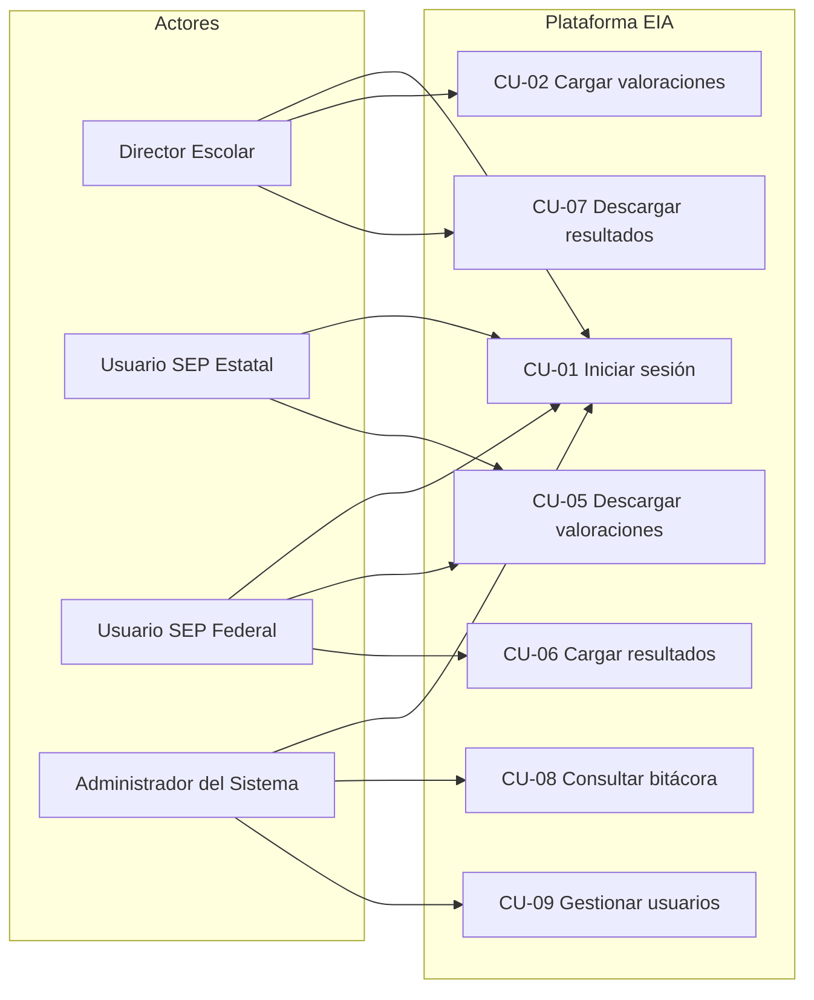

# Modelo de Casos de Uso – Plataforma EIA 2025–2026

## 1. Diagrama general de casos de uso (Mermaid)

---

## 2. Lista de casos de uso

1. CU-01 Iniciar sesión  
2. CU-02 Cargar archivo de valoraciones  
3. CU-03 Validar estructura de archivo (extensión y campos obligatorios)  
4. CU-04 Mostrar advertencias de valoraciones incompletas  
5. CU-05 Descargar archivos de valoraciones (SEP)  
6. CU-06 Cargar archivos de resultados (SEP Federal)  
7. CU-07 Descargar resultados por escuela  
8. CU-08 Consultar bitácora de actividades  
9. CU-09 Gestionar usuarios (Administrador)  
10. CU-10 Cerrar sesión  

---

## 3. Relación con la SRS y casos detallados

- El detalle completo de cada caso de uso (pre/postcondiciones, flujos, reglas de negocio) se encuentra en `casos_uso_detallados.md`.
- La relación con los requerimientos funcionales de alto nivel se describe en `srs.md`.
