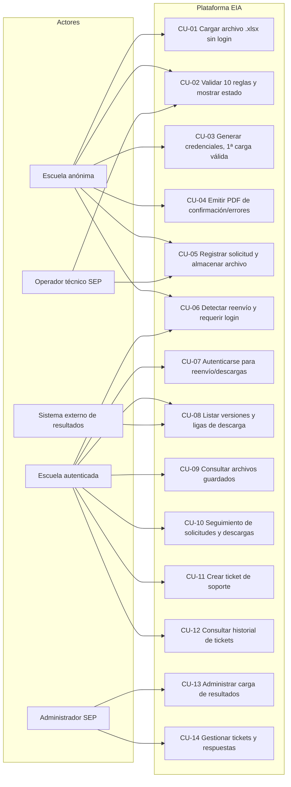

# Modelo de Casos de Uso – Plataforma de Recepción, Validación y Descarga EIA

## 1. Diagrama general de casos de uso (Mermaid)

---

## 2. Lista de casos de uso

1. **CU-01 Cargar archivo .xlsx sin login**
   - Actor: Escuela (anónima)
   - Descripción: Permite seleccionar y cargar el archivo. Dispara validación automática.

2. **CU-02 Validar 10 reglas y mostrar estado**
   - Actor: Escuela (anónima), Operador técnico SEP
   - Descripción: Ejecuta las verificaciones (CCT, correo, nivel, campos obligatorios por hoja, columnas obligatorias, valores 0–3, estructura general, número/nombre de hojas, consistencia interna y **huella de archivo/hash** para distinguir archivos con el mismo nombre) y muestra “Validando tu archivo…”.

3. **CU-03 Generar credenciales al cargar la primera validación exitosa**
   - Actor: Escuela (anónima)
   - Descripción: Si es la primera carga exitosa, crea usuario = correo registrado y contraseña aleatoria.

4. **CU-04 Emitir PDF de confirmación o errores**
   - Actor: Escuela (anónima)
   - Descripción: Descarga automática del PDF de confirmación (con fecha hoy + 4 días, usuario/contraseña, timestamp) o PDF de errores si el archivo es inválido.

5. **CU-05 Registrar solicitud y almacenar archivo**
   - Actor: Escuela (anónima), Operador técnico SEP
   - Descripción: Cada carga válida se registra como solicitud independiente con consecutivo y se guarda en el repositorio de recepción.

6. **CU-06 Detectar reenvío y requerir login**
   - Actor: Escuela (anónima), Escuela (autenticada)
   - Descripción: Si existe una credencial previa para el CCT/correo, se bloquea el envío anónimo y se solicita autenticación antes de permitir otro archivo; el reenvío verifica la **huella hash** para identificar si es exactamente el mismo archivo o una nueva versión aun con el mismo nombre.

7. **CU-07 Autenticarse para reenvío/descargas**
   - Actor: Escuela (autenticada)
   - Descripción: Login con correo + contraseña generada en la primera carga para habilitar el reenvío de archivos y el acceso a descargas.

8. **CU-08 Listar versiones y ligas de descarga**
   - Actores: Escuela (autenticada), Sistema externo de resultados
   - Descripción: Muestra consecutivos y ligas depositadas por el sistema externo para la escuela autenticada.

9. **CU-09 Consultar archivos guardados**
   - Actor: Escuela (autenticada)
   - Descripción: Lista archivos validados en el navegador, con búsqueda por nombre/CCT, acciones de descarga y eliminación, y acceso a resultados asociados.

10. **CU-10 Seguimiento de solicitudes y descargas**
   - Actor: Escuela (autenticada)
   - Descripción: Provee filtros por CCT/fecha y panel de estado para validar solicitudes y descargas recientes, incluyendo reintentos simulados.

11. **CU-11 Crear ticket de soporte**
   - Actor: Escuela (autenticada)
   - Descripción: Permite enviar un ticket con motivo, descripción y evidencias (PDF, Excel, Word o imágenes) desde la mesa de ayuda.

12. **CU-12 Consultar historial de tickets**
   - Actor: Escuela (autenticada)
   - Descripción: Muestra el historial de tickets con estatus, evidencias y respuestas del administrador.

13. **CU-13 Administrar carga de resultados**
   - Actor: Administrador SEP
   - Descripción: Selecciona un Excel validado, filtra por estatus/fecha y carga archivos de resultados (PDF/XLSX/etc.) asociados a la solicitud.

14. **CU-14 Gestionar tickets y respuestas**
   - Actor: Administrador SEP
   - Descripción: Consulta tickets, aplica filtros, actualiza estatus y envía respuestas al usuario.

**Nota de implementación temporal:** mientras el backend GraphQL es construido por otro equipo, los casos de uso CU-01 a CU-14 se ejecutarán en el frontend con servicios simulados y datos de prueba/localStorage que imitan las respuestas esperadas. Cuando las operaciones estén disponibles, se cambiará la fuente de datos sin modificar los flujos de usuario.

---

## 3. Relación con la SRS y casos detallados

- Las reglas de validación y credenciales se describen en `srs.md` y siguen el documento `plataforma_recepcion_validacion_descarga_EIA.md`.
- El detalle (flujos, pre/postcondiciones) se documentará en `casos_uso_detallados.md` si se requiere ampliación.
