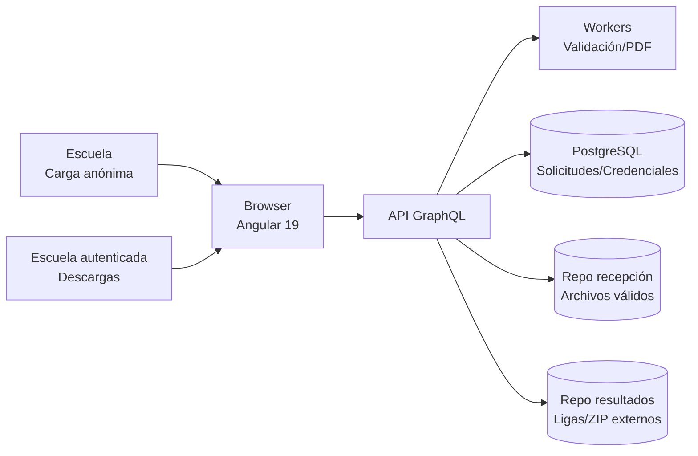

# DIAGRAMA DE ARQUITECTURA Y COMPONENTES DE LOS SISTEMAS WEB<br>EN DESARROLLO, DETALLANDO LA ESTRUCTURA LÓGICA Y TECNOLÓGICA<br>INCLUYENDO MÓDULOS DE ANGULAR, SERVICIOS API Y CONEXIONES<br>GRAPHQL

**Periodo reportado:** diciembre y primera semana de enero.

---

## 1. Resumen ejecutivo del periodo

Durante el periodo reportado se consolidó la visión arquitectónica del sistema web, se detallaron los componentes funcionales y se definieron las capas tecnológicas que soportan la recepción, validación y distribución de archivos. El frontend se planteó como una SPA en Angular 19 con integración a una API GraphQL (a cargo de un equipo externo), manteniendo un esquema de servicios simulados para continuar el avance mientras el backend se implementa. Asimismo, se documentaron los módulos clave de la aplicación y el flujo de integración con servicios de validación, generación de PDFs y persistencia en PostgreSQL + filesystem.

---

## 2. Alcance de la arquitectura (diciembre – primera semana de enero)

- Definición de arquitectura de tres capas (presentación, lógica de negocio y datos/archivos).
- Identificación de componentes funcionales: recepción anónima, reenvío autenticado, validación, credenciales/PDFs y descargas.
- Estandarización de servicios de integración en frontend con contratos alineados a GraphQL.
- Identificación de tecnologías clave: Angular 19 (signals), GraphQL, Redis + workers, PostgreSQL y filesystem SSD.

---

## 3. Diagrama de arquitectura (alto nivel)



**Notas clave:**
- La comunicación entre el frontend y la API se realizará vía operaciones GraphQL (queries/mutations).
- Los workers procesan validaciones y generación de PDFs de manera asíncrona.
- La persistencia combina base de datos relacional y repositorios de archivos en filesystem.

---

## 4. Diagrama de componentes (lógico-funcional)

```mermaid
flowchart TB
    subgraph Frontend[SPA Angular 19]
        R1[Módulo de recepción anónima]
        R2[Módulo de reenvío autenticado]
        R3[Módulo de descargas autenticadas]
        R4[Módulo de autenticación]
        R5[Panel técnico (monitoreo)]
        S1[Servicios de integración GraphQL]

        R1 --> S1
        R2 --> S1
        R3 --> S1
        R4 --> S1
        R5 --> S1
    end

    subgraph Backend[API GraphQL + Workers]
        GQL[API GraphQL]
        VAL[Motor de validación]
        PDF[Generador de PDFs]
        AUTH[Gestión de credenciales]
    end

    subgraph Datos[Persistencia]
        DB[(PostgreSQL)]
        FS1[(Repositorio recepción)]
        FS2[(Repositorio resultados)]
    end

    S1 --> GQL
    GQL --> VAL
    GQL --> PDF
    GQL --> AUTH
    GQL --> DB
    GQL --> FS1
    GQL --> FS2
```

---

## 5. Estructura lógica y tecnológica

| Capa | Responsabilidad | Tecnologías/Componentes | Estado (dic–ene) |
| --- | --- | --- | --- |
| Presentación | SPA, flujos de carga y descargas, navegación | Angular 19 (signals), guía gráfica gob.mx v3 | Definición y estructura modular documentada |
| Lógica de negocio | Orquestación de validaciones, credenciales, PDFs y ligas | API GraphQL, Workers (Redis + colas) | Contratos y operaciones definidos; integración pendiente con backend externo |
| Datos/Archivos | Persistencia de solicitudes, credenciales y repositorios | PostgreSQL, filesystem SSD | Modelado conceptual documentado |

---

## 6. Módulos Angular definidos/creados

Los módulos listados corresponden a la estructura definida para el avance del frontend en este periodo:

1. **Recepción anónima**
   - Carga inicial de archivo .xlsx sin autenticación.
   - Mensajes de validación en línea.
2. **Reenvío autenticado**
   - Requiere login si ya existen credenciales para CCT/correo.
3. **Autenticación**
   - Inicio de sesión para descargas y reenvíos posteriores.
4. **Descargas autenticadas**
   - Listado de versiones de resultados y ligas de descarga.
5. **Panel técnico**
   - Monitoreo básico de logs, estado de workers y espacio en disco.

---

## 7. Servicios, API y conexiones GraphQL

### 7.1 Principios de integración

- El frontend opera con servicios simulados/localStorage mientras el backend GraphQL se implementa.
- Las firmas de servicios se definen desde ahora para alinear queries/mutations reales sin refactor.

### 7.2 Operaciones GraphQL previstas (ejemplo de contratos)

- **Mutation: `uploadFile`**
  - Entrada: metadatos de escuela + archivo .xlsx.
  - Salida: estado de validación y referencia de PDF.
- **Mutation: `authenticate`**
  - Entrada: CCT + contraseña.
  - Salida: token de sesión.
- **Query: `downloadLinks`**
  - Entrada: CCT autenticado.
  - Salida: lista de versiones y ligas de descarga.
- **Mutation: `resubmitFile`**
  - Entrada: archivo y credenciales válidas.
  - Salida: estado de validación y nueva referencia.

---

## 8. Evidencias de avance (diciembre – primera semana de enero)

- Arquitectura de referencia documentada con capas y componentes principales.
- Flujos funcionales y módulos Angular definidos para recepción, validación y descargas.
- Contratos de integración establecidos con enfoque en GraphQL.
- Definición de tecnologías y dependencias (Angular 19, Redis + workers, PostgreSQL, filesystem).

---

## 9. Próximos pasos inmediatos

- Validación con el equipo de backend sobre el esquema de operaciones GraphQL.
- Implementación de servicios Angular con endpoints reales cuando estén disponibles.
- Desarrollo incremental de módulos y pruebas de integración.

---

**Responsable del informe:** Equipo de desarrollo web
