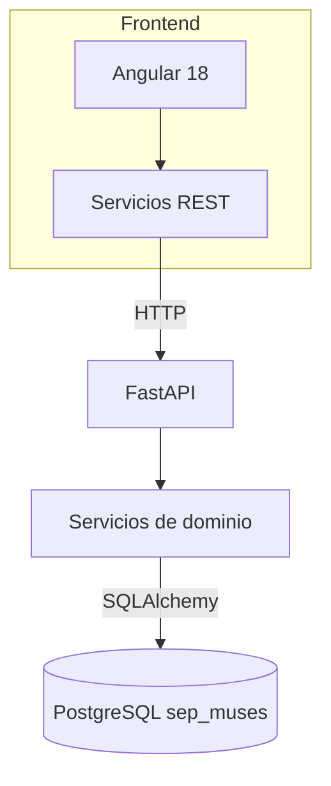
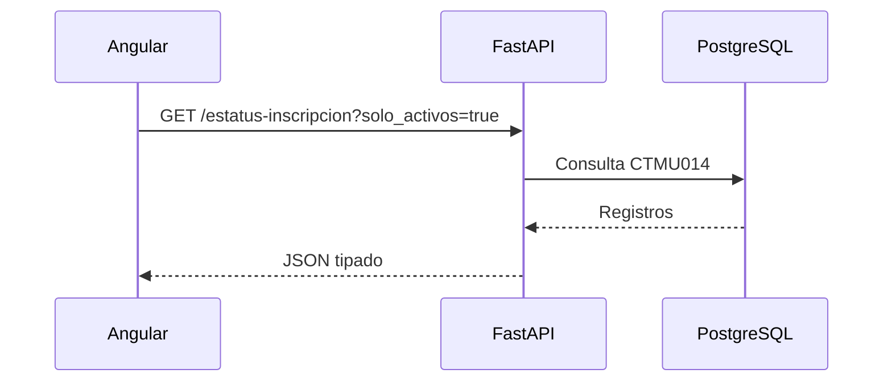
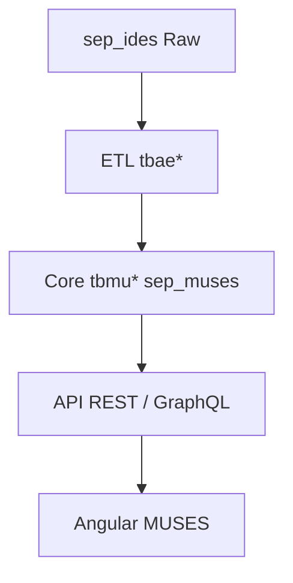

# DIAGRAMA DE ARQUITECTURA Y COMPONENTES DE LOS SISTEMAS WEB EN DESARROLLO

**Unidad de Administración y Finanzas**  
**Dirección General de Tecnologías de la Información y Comunicaciones**

---

## 1. Propósito y alcance (noviembre 2025)

Documentar el estado arquitectónico y los componentes entregados durante noviembre 2025, resaltando el cambio estratégico de backend y su impacto en los flujos del proyecto **MUSES Web**.

---

## 2. Resumen ejecutivo de avances

- **Cambio estratégico de backend:** Se sustituyó la API GraphQL planificada en Node.js por un backend en **Python + FastAPI**, manteniendo el frontend en Angular y la base de datos corporativa en PostgreSQL.
- **Servicios de catálogos listos:** Endpoints REST versionados (`/api/v1/catalogos/*`) que exponen los catálogos de inscripción.
- **Modelado consistente:** Modelos ORM alineados al esquema `sep_muses`.
- **Frontend estable:** Componentes standalone de Angular con transición de GraphQL a REST.

---

## 3. Comparativo octubre vs noviembre

| Elemento | Octubre (planeado) | Noviembre (ejecutado) |
|--------|-------------------|----------------------|
| Backend | Node.js + GraphQL | Python + FastAPI |
| Contratos | GraphQL | REST + Pydantic |
| Conectividad | Apollo Client | HttpClient |
| Base de datos | PostgreSQL | PostgreSQL + SQLAlchemy |
| Identidad | Llave MX (diseño) | Pendiente |

---

## 4. Arquitectura lógica

---

## 4.2 Flujo de publicación de catálogos

---

## 4.3 Flujo de datos corporativo

---

## 5. Componentes entregados

| Capa | Componente | Evidencia |
|-----|-----------|----------|
| Backend | Routers catálogos | webservice/app/api/routes |
| Backend | Servicios dominio | webservice/app/services |
| Backend | ORM | webservice/app/models |
| Backend | Schemas | webservice/app/schemas |
| Frontend | Angular | web/ |

---

## 6. Servicios REST

- `/api/v1/catalogos/*`
- Parámetro `solo_activos`
- Versionado `/api/v1`

---

## 7. Gestión de datos y seguridad

- SQLAlchemy + PostgreSQL
- Control de vigencia (`activo`)
- Pendiente integración Llave MX
