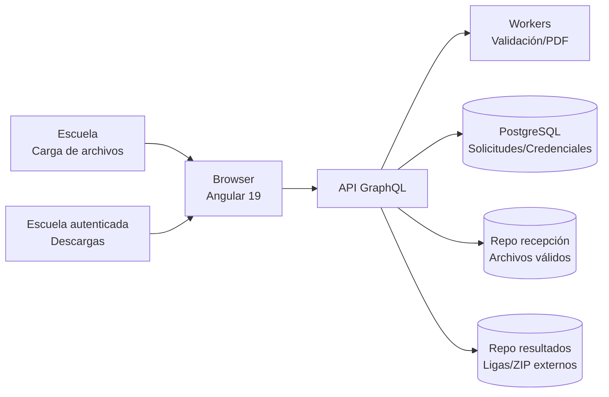

# DIAGRAMA DE ARQUITECTURA Y COMPONENTES DE LOS SISTEMAS WEB<br>EN DESARROLLO, DETALLANDO LA ESTRUCTURA LÓGICA Y TECNOLÓGICA<br>INCLUYENDO MÓDULOS DE ANGULAR, SERVICIOS API Y CONEXIONES<br>GRAPHQL

**Proyecto:** Evaluación Diagnóstica (plataforma web)

**Periodo reportado:** diciembre y primera semana de enero.

---

## 1. Resumen ejecutivo del periodo

En el periodo reportado se consolidó la arquitectura del sistema web de Evaluación Diagnóstica, definiendo sus capas principales, componentes funcionales y tecnologías clave. El frontend se plantea como SPA en Angular 19 (signals), integrado a un backend GraphQL (a cargo de un equipo externo), mientras que se mantiene una estrategia de servicios simulados para continuar el desarrollo sin bloquear avances. Se documentaron los módulos funcionales esenciales, el flujo de validación y descarga de resultados, y la infraestructura de persistencia basada en PostgreSQL + filesystem.

---

## 2. Alcance de la arquitectura (diciembre – primera semana de enero)

- Definición de arquitectura de tres capas (presentación, lógica de negocio y datos/archivos).
- Identificación de componentes funcionales: recepción de archivos, validación, autenticación, credenciales y descargas.
- Estándares de integración del frontend alineados a operaciones GraphQL.
- Selección tecnológica: Angular 19 (signals), GraphQL, Redis + workers, PostgreSQL y filesystem SSD.

---

## 3. Diagrama de arquitectura (alto nivel)



**Notas clave:**
- El frontend consume operaciones GraphQL (queries/mutations) para validar cargas, autenticar y listar resultados.
- Los workers ejecutan validaciones y generan PDFs de manera asíncrona.
- La persistencia combina base de datos relacional y repositorios de archivos en filesystem.

---

## 4. Diagrama de componentes (lógico-funcional)

```mermaid
flowchart TB
    subgraph Frontend[SPA Angular 19]
        R1[Módulo de recepción de archivos]
        R2[Módulo de reenvío autenticado]
        R3[Módulo de descargas autenticadas]
        R4[Módulo de autenticación]
        R5[Panel técnico (monitoreo)]
        S1[Servicios de integración GraphQL]

        R1 --> S1
        R2 --> S1
        R3 --> S1
        R4 --> S1
        R5 --> S1
    end

    subgraph Backend[API GraphQL + Workers]
        GQL[API GraphQL]
        VAL[Motor de validación]
        PDF[Generador de PDFs]
        AUTH[Gestión de credenciales]
    end

    subgraph Datos[Persistencia]
        DB[(PostgreSQL)]
        FS1[(Repositorio recepción)]
        FS2[(Repositorio resultados)]
    end

    S1 --> GQL
    GQL --> VAL
    GQL --> PDF
    GQL --> AUTH
    GQL --> DB
    GQL --> FS1
    GQL --> FS2
```

---

### 4.1 Descripción detallada de componentes e interacciones

**Frontend (SPA Angular 19)**

- **Módulo de recepción de archivos (R1)**: pantalla principal para la carga inicial de archivos .xlsx. Valida precondiciones del flujo (por ejemplo, si el envío es anónimo o requiere autenticación) y muestra el estado “Validando tu archivo...”. Consume operaciones GraphQL a través de `S1` para iniciar el proceso de validación. 
- **Módulo de reenvío autenticado (R2)**: habilita la carga de nuevas versiones cuando ya existen credenciales. Depende del módulo de autenticación para verificar sesión activa y consume las operaciones de reenvío/validación. 
- **Módulo de descargas autenticadas (R3)**: consulta y muestra la lista de versiones y ligas de descarga asociadas al CCT autenticado. Se alimenta de consultas GraphQL y presenta estados de carga y errores. 
- **Módulo de autenticación (R4)**: gestiona login y tokens de sesión. Centraliza el manejo de credenciales y provee estado de sesión a los demás módulos. 
- **Panel técnico (R5)**: visualiza indicadores básicos de operación (estado de workers, logs y espacio en disco) para soporte interno. 
- **Servicios de integración GraphQL (S1)**: capa de acceso a datos. Abstrae la comunicación con el backend, centraliza la ejecución de queries/mutations y normaliza respuestas/errores para los módulos de UI. 

**Backend (API GraphQL + Workers)**

- **API GraphQL (GQL)**: punto único de entrada para operaciones de negocio. Orquesta validaciones, autenticación y publicación de resultados. Implementa las reglas de negocio de carga, validación y control de reenvíos. 
- **Motor de validación (VAL)**: ejecuta verificaciones de estructura y contenido, calcula hashes y determina si un archivo es válido o duplicado. 
- **Generador de PDFs (PDF)**: produce PDFs de confirmación/errores. Se dispara desde el flujo de validación con la información necesaria para notificar al usuario. 
- **Gestión de credenciales (AUTH)**: administra la creación/validación de credenciales y sesiones, asegurando que el reenvío sea autenticado cuando corresponda. 

**Persistencia**

- **PostgreSQL (DB)**: almacena solicitudes, credenciales, sesiones y metadatos de validación. 
- **Repositorio de recepción (FS1)**: almacena archivos recibidos y validados. 
- **Repositorio de resultados (FS2)**: almacena ligas/archivos de resultados generados por el sistema externo. 

**Flujo general**

1. El usuario carga un archivo desde `R1` o `R2`. 
2. `S1` ejecuta la mutation correspondiente en `GQL`. 
3. `GQL` coordina la validación (`VAL`), generación de PDF (`PDF`) y actualización de credenciales (`AUTH`). 
4. Los metadatos se guardan en `DB` y los archivos en `FS1`; los resultados externos se exponen desde `FS2`. 
5. `R3` consulta resultados mediante GraphQL y presenta la lista de ligas disponibles. 

---

## 5. Estructura lógica y tecnológica

| Capa | Responsabilidad | Tecnologías/Componentes | Estado (dic–ene) |
| --- | --- | --- | --- |
| Presentación | SPA, flujos de carga y descargas, navegación | Angular 19 (signals), guía gráfica gob.mx v3 | Estructura modular definida y documentada |
| Lógica de negocio | Orquestación de validaciones, credenciales, PDFs y ligas | API GraphQL, Workers (Redis + colas) | Contratos de operaciones definidos; integración en espera de backend externo |
| Datos/Archivos | Persistencia de solicitudes, credenciales y repositorios | PostgreSQL, filesystem SSD | Modelo conceptual documentado |

---

## 6. Módulos Angular definidos/creados

Los módulos listados corresponden a la estructura definida para el avance del frontend en este periodo:

1. **Recepción de archivos**
   - Carga inicial de archivos .xlsx.
   - Mensajes de validación en línea.
2. **Reenvío autenticado**
   - Requiere login si ya existen credenciales para CCT/correo.
3. **Autenticación**
   - Inicio de sesión para descargas y reenvíos posteriores.
4. **Descargas autenticadas**
   - Listado de versiones de resultados y ligas de descarga.
5. **Panel técnico**
   - Monitoreo básico de logs, estado de workers y espacio en disco.

---

## 7. Servicios, API y conexiones GraphQL

### 7.1 Principios de integración

- El frontend opera con servicios simulados/localStorage mientras el backend GraphQL se implementa.
- Las firmas de servicios se definen desde ahora para alinear queries/mutations reales sin refactor.

### 7.2 Operaciones GraphQL previstas (ejemplo de contratos)

- **Mutation: `uploadDiagnosticFile`**
  - Entrada: metadatos de escuela + archivo .xlsx.
  - Salida: estado de validación y referencia de PDF.
- **Mutation: `authenticate`**
  - Entrada: CCT + contraseña.
  - Salida: token de sesión.
- **Query: `diagnosticResults`**
  - Entrada: CCT autenticado.
  - Salida: lista de versiones y ligas de descarga.
- **Mutation: `resubmitDiagnosticFile`**
  - Entrada: archivo y credenciales válidas.
  - Salida: estado de validación y nueva referencia.

---

## 8. Evidencias de avance (diciembre – primera semana de enero)

- Arquitectura de referencia documentada con capas y componentes principales.
- Flujos funcionales y módulos Angular definidos para recepción, validación y descargas.
- Contratos de integración establecidos con enfoque en GraphQL.
- Definición de tecnologías y dependencias (Angular 19, Redis + workers, PostgreSQL, filesystem).

---

## 9. Próximos pasos inmediatos

- Validación con el equipo de backend sobre el esquema de operaciones GraphQL.
- Implementación de servicios Angular con endpoints reales cuando estén disponibles.
- Desarrollo incremental de módulos y pruebas de integración.

---

**Responsable del informe:** Equipo de desarrollo web
