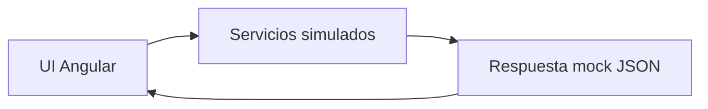
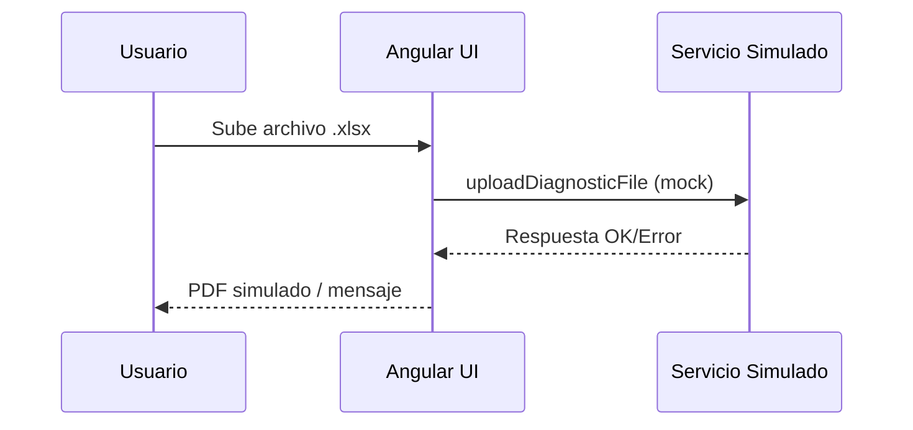

# REGISTRO DE PRUEBAS CON LOS RESULTADOS OBTENIDOS DURANTE LAS FASES DE PRUEBA FUNCIONAL,<br>ASÍ COMO LA CORRECCIÓN DE INCIDENCIAS DETECTADAS, UTILIZANDO HERRAMIENTAS COMO POSTMAN PARA VALIDACIÓN DE ENDPOINTS Y CONSULTAS GRAPHQL

**Proyecto:** Evaluación Diagnóstica (plataforma web)

**Periodo reportado:** diciembre 2025 y primera semana de enero 2026.

---

## 1. Objetivo del registro de pruebas

Documentar la ejecución de pruebas funcionales del frontend y la validación de flujos críticos (carga, autenticación y descargas), así como el seguimiento a incidencias y correcciones realizadas durante el periodo reportado. El registro incluye resultados, evidencias y la trazabilidad con cambios aplicados mediante commits/PRs.

---

## 2. Alcance y limitaciones

- El backend GraphQL se encuentra en desarrollo por un equipo externo; por lo tanto, las validaciones de endpoints reales aún no están disponibles.
- Para garantizar avance, se realizaron pruebas funcionales sobre el frontend utilizando **servicios simulados/localStorage** con contratos equivalentes a las operaciones GraphQL previstas.
- Las pruebas se enfocaron en los flujos de usuario, validaciones de UI, manejo de errores, y consistencia visual con la guía gráfica.

---

## 3. Ambiente de pruebas

- **Tipo de entorno:** Desarrollo local.
- **Aplicación:** SPA Angular 19 (signals).
- **Datos:** Archivos .xlsx de muestra y registros simulados en localStorage.
- **Navegadores:** Chrome/Edge (últimas versiones disponibles en el entorno de pruebas).

---

## 4. Herramientas y enfoque de prueba

- **Pruebas manuales de interfaz (UI):** validación de flujos, mensajes, estados y navegación.
- **Simulación de operaciones GraphQL:** respuestas mock de queries/mutations a través de servicios del frontend.
- **Evidencias visuales:** capturas de pantalla y tablas de resultados por caso.

> Nota: Postman se considera para la fase de integración real del backend GraphQL; en este periodo se sustituyó por servicios simulados debido a la inexistencia de endpoints reales.

---

## 4.1 Diagramas de apoyo para evidencias

**Flujo de prueba funcional (frontend con servicios simulados):**



**Secuencia de validación de carga (simulada):**



---

## 5. Matriz de pruebas funcionales (extracto)

| ID | Módulo/Flujo | Caso de prueba | Datos de entrada | Resultado esperado | Resultado obtenido | Estado | Evidencia |
| --- | --- | --- | --- | --- | --- | --- | --- |
| PF-01 | Carga masiva | Subida de archivo .xlsx válido | Archivo .xlsx válido | Muestra “Validando tu archivo...” y PDF de confirmación | Flujo correcto con PDF simulado | OK | Captura UI / Log local |
| PF-02 | Carga masiva | Archivo con estructura inválida | Archivo .xlsx inválido | Mensaje de error y PDF de errores | Flujo correcto con PDF simulado | OK | Captura UI / Log local |
| PF-03 | Autenticación | Login con credenciales válidas | CCT + correo | Acceso a panel de descargas | Acceso otorgado | OK | Captura UI |
| PF-04 | Reenvío autenticado | Reenvío con sesión activa | Archivo .xlsx válido | Permite carga y notificación de validación | Flujo correcto | OK | Captura UI |
| PF-05 | Descargas | Listado de resultados | CCT autenticado | Lista versiones y ligas | Lista simulada correcta | OK | Captura UI |
| PF-06 | Panel administrativo | Filtros y paginación | Filtros por nivel/estado | Filtrado correcto y paginación funcional | Correcto | OK | Captura UI |
| PF-07 | Panel administrativo | Descarga de resultados PDF | Registro con PDF disponible | Descarga iniciada | Correcto | OK | Captura UI |

---

## 6. Resultados generales

- **Casos ejecutados:** 7
- **Casos aprobados:** 7
- **Casos fallidos:** 0
- **Observaciones:** las pruebas se realizaron con servicios simulados debido a la falta de endpoints GraphQL reales.

---

## 7. Incidencias detectadas y correcciones aplicadas (extracto)

| Incidencia | Impacto | Corrección aplicada | Evidencia (commit/PR) |
| --- | --- | --- | --- |
| Descarga de resultados PDF fallida | Bloqueo en consulta de resultados | Corrección de flujo de descarga | `50624cb`, PR #114 |
| PDFs con formato incorrecto | Confirmaciones con estilo deficiente | Ajuste de estilos/encabezados | `0705626`, `8a88519`, PR #102/#103 |
| Panel sin filtros/paginación | Dificultad para operar listados grandes | Implementación de filtros y paginación | `54d344e`, `0a18f2a`, PR #117/#118 |

---

## 8. Evidencias sugeridas para anexos

- Capturas de pantalla por cada caso de prueba (PF-01 a PF-07).
- JSON de respuestas simuladas (queries/mutations) utilizado en servicios mock.
- Diagrama de flujo de pruebas (UI → servicios simulados → respuesta). 

**Ejemplo de respuesta simulada (JSON):**

```json
{
  "data": {
    "uploadDiagnosticFile": {
      "status": "OK",
      "message": "Validación correcta",
      "pdfUrl": "/mock/confirmacion.pdf",
      "hash": "abc123"
    }
  }
}
```

---

## 9. Próximos pasos

- Repetir las pruebas funcionales contra el backend GraphQL real cuando esté disponible.
- Incorporar Postman como herramienta de validación de operaciones GraphQL en fase de integración.
- Añadir pruebas automatizadas (e2e) para carga masiva, autenticación y descargas.

---

**Responsable del informe:** Equipo de desarrollo web
