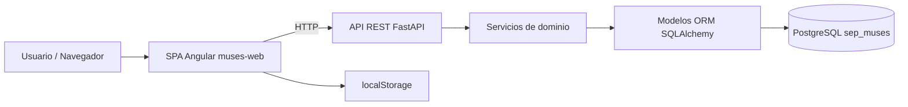

# MANUAL TÉCNICO Y FUNCIONAL  
## Desarrollos realizados o modificados – SEP‑MUSES

**Unidad de Administración y Finanzas**  
**Dirección General de Tecnologías de la Información y Comunicaciones**

Sistema: **Matrícula Única de Educación Superior (SEP‑MUSES)**  
Periodo de referencia: **Noviembre 2025**

---

## 1. Introducción

Este manual resume el estado del **frontend Angular** y del nuevo **backend Python/FastAPI** de SEP‑MUSES al cierre de noviembre de 2025.  
Sustituye la planeación previa con GraphQL y documenta los componentes, servicios REST y guías operativas vigentes.

### 1.1 Propósito

- Proporcionar una referencia técnica y funcional actualizada del frontend *muses‑web* y del backend FastAPI.  
- Enumerar componentes reutilizables, servicios y patrones vigentes en Angular y Python.  
- Incluir guías de instalación y despliegue para entornos locales de ambos stacks.  
- Documentar la transición de **GraphQL a REST** y el uso de **SQLAlchemy sobre PostgreSQL**.

---

## 2. Resumen arquitectónico del sistema

El proyecto mantiene la **SPA Angular** (`web/muses-web`) y agrega el servicio **FastAPI** (`webservice/`) para exponer catálogos de inscripción desde PostgreSQL `sep_muses`.

- Angular 18+ con componentes *standalone*, almacenamiento local y servicios simulados.  
- FastAPI expone `/health` y `/api/v1/catalogos/*`, usa **Pydantic** y **SQLAlchemy**.

### 2.1 Diagrama de arquitectura (Mermaid)



---

## 3. Estructura lógica

| Capa | Responsabilidades principales | Directorios clave |
|-----|------------------------------|------------------|
| Presentación (Angular) | Componentes standalone, rutas y estilos GOB | web/muses-web/src/app/app.routes.ts; feature/*/components |
| Aplicación (Angular) | Servicios de caso de uso, validadores y señales | feature/*/services; shared/state |
| Datos locales (Angular) | Adaptadores a localStorage y cachés | shared/data-access |
| Infraestructura (Angular) | Interceptores y configuración en memoria | core |
| API REST (Python) | Routers FastAPI y esquemas Pydantic | webservice/app/api/routes; schemas; services |
| Persistencia (Python) | Sesiones SQLAlchemy y modelos ORM | webservice/app/db; models; core/config.py |

---

## 4. Componentes y servicios reutilizables

### 4.1 Inventario transversal

| Identificador | Tipo | Descripción |
|-------------|------|-------------|
| muses-form-field | Componente Angular | Campos reactivos con validaciones estandarizadas |
| muses-select-cat | Componente Angular | Carga de catálogos con selección simple/múltiple |
| muses-error-panel | Componente Angular | Listado de errores por campo o fila |
| muses-upload | Componente Angular | Importación CSV y procesamiento por lotes |
| muses-table | Componente Angular | Tablas con paginación, filtros y acciones |
| CargaMasivaService | Servicio Angular | Lectura progresiva y persistencia local |
| CatalogosService | Servicio Angular | Consumo de catálogos simulados / REST |
| Routers de catálogos | Router FastAPI | Endpoints `/api/v1/catalogos/*` |
| Modelos ORM | SQLAlchemy | Tablas `ctmu0XX` con metadatos reutilizables |

---

## 5. Funcionalidades principales

- **Inscripción manual:** captura de más de 50 campos con validaciones.  
- **Inscripción por carga masiva:** procesamiento de archivos CSV y gestión de lotes.  
- **Gestión de bajas:** reutilización de formularios con campos específicos.  
- **Catálogos REST productivos:** consumo desde PostgreSQL vía FastAPI.  
- **Configuración institucional simulada:** reglas y catálogos en memoria.

---

## 6. Guías de instalación, ejecución y despliegue

### 6.1 Requisitos previos

- Node.js 18 LTS  
- npm 9+  
- Angular CLI (opcional)  
- Python 3.11+  
- PostgreSQL accesible  

### 6.2 Instalación local (frontend)

```bash
cd web/muses-web
npm install
npm start
```

Servidor: http://localhost:4200  

---

### 6.3 Instalación y ejecución local (backend FastAPI)

```bash
cd webservice
python -m venv .venv
source .venv/bin/activate
pip install -r requirements.txt
uvicorn app.main:app --reload --port 8000
```

Variables clave:
`DATABASE_USER`, `DATABASE_PASSWORD`, `DATABASE_HOST`, `DATABASE_PORT`,
`DATABASE_NAME`, `DATABASE_SCHEMA`.

---

## 7. Validación de endpoints REST

- `GET /health`  
- `GET /api/v1/catalogos/*` (estatus-inscripcion, nacionalidades, entidades-federativas, niveles-educativos, modalidades-educativas, opciones-educativas, turnos, discapacidades, aptitudes-sobresalientes, origenes-estudios, motivos-baja, sexo)

---

## 8. Lineamientos de diseño (Guía Gráfica GOB)

```css
@import url('https://framework-gb.cdn.gob.mx/assets/styles/main.css');

body {
  font-family: 'Montserrat', sans-serif;
  background-color: var(--color-gris-claro);
}
```

---

## 9. Integración pendiente

La autenticación con **Llave MX** permanece pendiente.  
El `AuthService` actual es un stub.

---

## 10. Persistencia local y trazabilidad

- Uso de **localStorage** para formularios y cargas masivas.  
- Configuración institucional en memoria mediante **BehaviorSubject**.  
- Catálogos REST con filtros `activo = 'A'`.

---

**Elaboró:** José Guadalupe Gutiérrez Arévalo  
**Revisó:** David León Gómez
