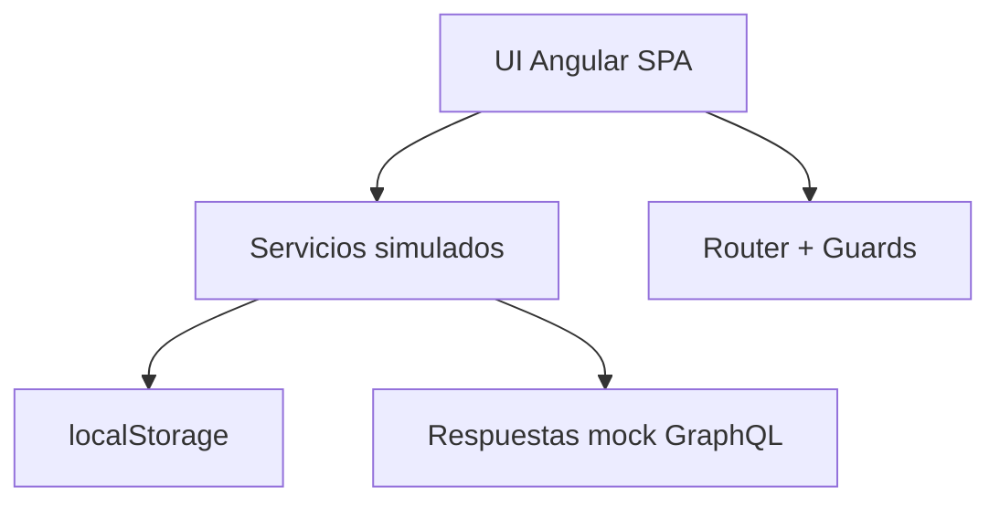
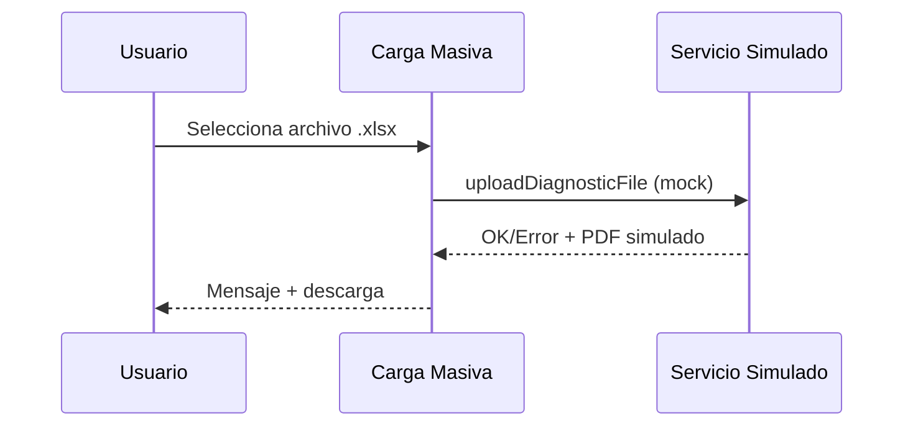
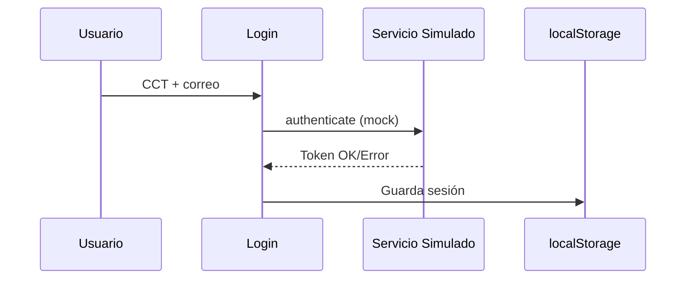
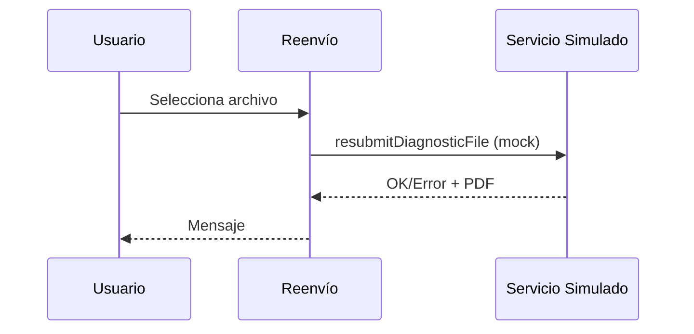
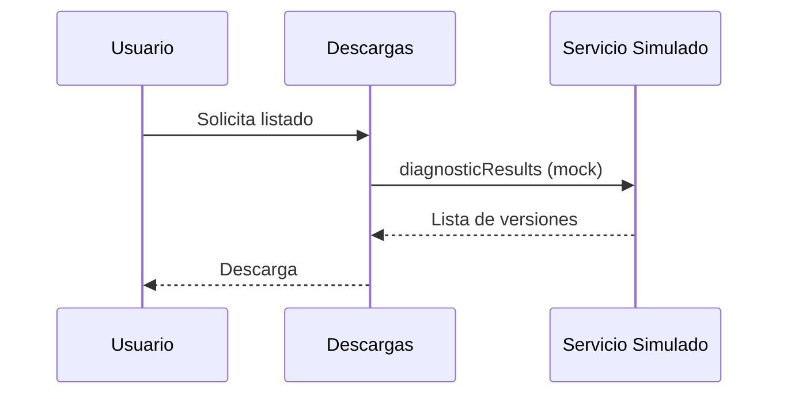
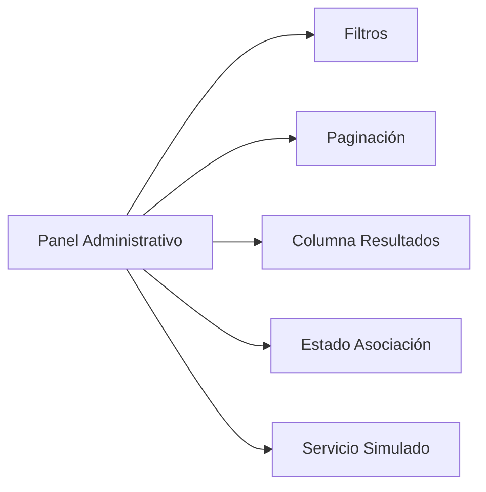
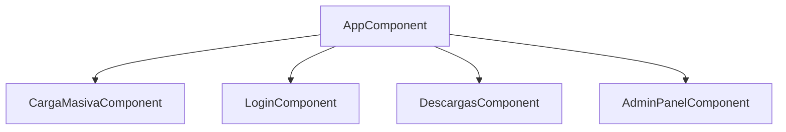
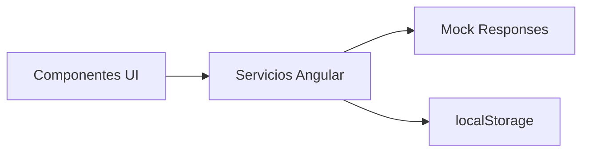
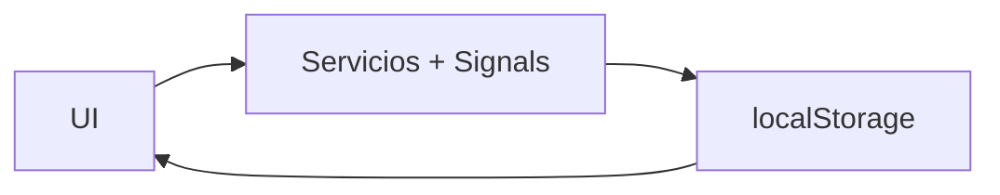
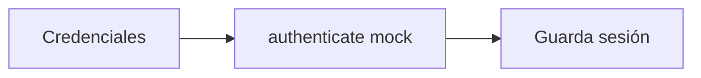

# MANUAL TÉCNICO FUNCIONAL
## Sistema de Evaluación Diagnóstica – Frontend Angular

**Versión:** 1.0

**Periodo reportado:** diciembre 2025 y primera semana de enero 2026.

---

## 1. Propósito del documento

Este manual técnico-funcional describe el funcionamiento del frontend del sistema de Evaluación Diagnóstica, construido en Angular. Incluye la estructura general del sistema, módulos funcionales, flujos de usuario, estructura de componentes, servicios de integración (simulados) y recomendaciones técnicas para operación y mantenimiento.

---

## 2. Alcance

- **Aplicación:** SPA Angular 19 (signals).
- **Cobertura:** interfaz de carga masiva, autenticación, descargas y panel administrativo.
- **Limitación actual:** el backend GraphQL aún no está integrado; se utilizan servicios simulados/localStorage con contratos equivalentes.

---

## 3. Arquitectura funcional (frontend)

La aplicación se organiza como una **Single Page Application (SPA)** con módulos de interfaz y servicios compartidos. Los principales bloques funcionales son:

1. **Carga masiva de archivos**
2. **Autenticación**
3. **Reenvío autenticado**
4. **Descargas de resultados**
5. **Panel administrativo**

Cada módulo consume servicios Angular que, por el momento, devuelven datos simulados (mocks) con la forma de respuesta prevista para GraphQL.

**Diagrama de arquitectura funcional (frontend):**

---

## 4. Módulos funcionales

### 4.1 Carga masiva

**Objetivo:** permitir la carga inicial de archivos .xlsx y mostrar el estado de validación.

**Flujo funcional:**
1. El usuario selecciona archivo .xlsx.
2. Se muestra el estado “Validando tu archivo...”.
3. Se procesa la validación simulada y se entrega PDF de confirmación o errores.

**Funciones clave:**
- Validación de formato de archivo.
- Mensajes de error en UI.
- Visualización de estado de validación.

**Diagrama de flujo de carga masiva:**

---

### 4.2 Autenticación

**Objetivo:** permitir acceso a áreas protegidas (descargas y reenvío).

**Flujo funcional:**
1. Usuario ingresa CCT y correo.
2. El sistema valida credenciales (simulado).
3. Se habilita acceso a descargas y reenvío.

**Funciones clave:**
- Manejo de sesión en localStorage.
- Protección de rutas.

**Diagrama de autenticación:**

---

### 4.3 Reenvío autenticado

**Objetivo:** permitir el envío de nuevas versiones cuando ya existen credenciales.

**Flujo funcional:**
1. Usuario autenticado selecciona archivo.
2. Se valida con el servicio simulado.
3. Se genera confirmación o error.

**Diagrama de reenvío autenticado:**

---

### 4.4 Descargas de resultados

**Objetivo:** listar versiones y habilitar descarga de resultados.

**Flujo funcional:**
1. Usuario autenticado accede al listado.
2. El sistema muestra versiones disponibles (simulado).
3. El usuario descarga la versión requerida.

**Diagrama de descargas:**

---

### 4.5 Panel administrativo

**Objetivo:** gestionar resultados, filtros, paginación y metadatos.

**Funciones principales:**
- Listado de archivos/Excel disponibles.
- Filtros por nivel y estado.
- Paginación de resultados.
- Columna de resultados y estado de descarga.
- Estado de asociación de Excel.

**Diagrama de panel administrativo:**

---

## 5. Estructura técnica (frontend)

### 5.1 Componentes y vistas clave

- **Carga masiva:** componente principal de carga y validación.
- **Login:** formulario de autenticación.
- **Descargas:** tabla/listado de resultados.
- **Panel administrativo:** vista con filtros, paginación y acciones.

**Mapa de componentes (alto nivel):**

### 5.2 Servicios (simulados)

Los servicios Angular actúan como capa de integración. En esta etapa:

- Retornan datos simulados (mocks).
- Mantienen la misma forma de respuesta que las operaciones GraphQL previstas.

**Ejemplos de operaciones simuladas:**
- `uploadDiagnosticFile`
- `authenticate`
- `diagnosticResults`
- `resubmitDiagnosticFile`

**Diagrama de integración de servicios:**

---

## 6. Almacenamiento local y estado

- **localStorage:** se utiliza para simular sesión, credenciales, archivos subidos y estados de validación.
- **State management:** el estado básico se gestiona en servicios con signals (Angular 19).

**Diagrama de estado local:**

---

## 7. Flujos funcionales resumidos

### 7.1 Flujo de carga inicial

1. Selección de archivo.
2. Validación local del formato.
3. Servicio simulado responde con OK/Error.
4. Generación de PDF simulado.

### 7.2 Flujo de autenticación

1. Ingreso de credenciales.
2. Validación simulada.
3. Persistencia de sesión.

### 7.3 Flujo de descargas

1. Consulta de lista de resultados.
2. Selección de versión.
3. Descarga de archivo (mock).

---

## 8. Mantenimiento y evolución

- **Correctivo:** corrección de errores de validación, descargas y estilos.
- **Evolutivo:** filtros, paginación y columnas nuevas en panel administrativo.
- **Próximo paso:** integración con backend GraphQL real y pruebas con Postman.

---

## 9. Recomendaciones para operación

- Verificar consistencia de datos simulados con contratos esperados.
- Mantener la guía gráfica gob.mx v3 cargada en el `index.html`.
- Documentar cambios de UI con capturas.
- Al integrar backend, reemplazar servicios mock por servicios reales sin modificar componentes.

---

## 10. Guías de instalación y despliegue (Angular)

### 10.1 Requisitos previos

- Node.js 22.x (o versión compatible con Angular 19).
- npm (incluido con Node.js).
- Angular CLI 19.2.x (instalación global opcional).

### 10.2 Instalación local

1. Instalar dependencias del frontend:
   - `npm install`
2. Ejecutar el servidor de desarrollo:
   - `npm run start` (o `ng serve`)
3. Acceder a la aplicación:
   - `http://localhost:4200/`

### 10.3 Construcción para producción

1. Generar build optimizado:
   - `npm run build`
2. Artefactos generados:
   - Directorio `dist/` (listo para despliegue en servidor web).

### 10.4 Despliegue (referencia)

- Publicar el contenido de `dist/` en un servidor estático (Nginx/Apache) o CDN.
- Configurar redirección a `index.html` para rutas SPA.
- Verificar que los assets de la guía gráfica gob.mx v3 estén disponibles (CDN cargado en `index.html`).

---

## 11. Anexos sugeridos

- Capturas de la pantalla de carga masiva y estado de validación.
- Capturas del panel administrativo con filtros y paginación.
- Ejemplos de respuestas JSON simuladas.

---

**Responsable del informe:** Equipo de desarrollo web
